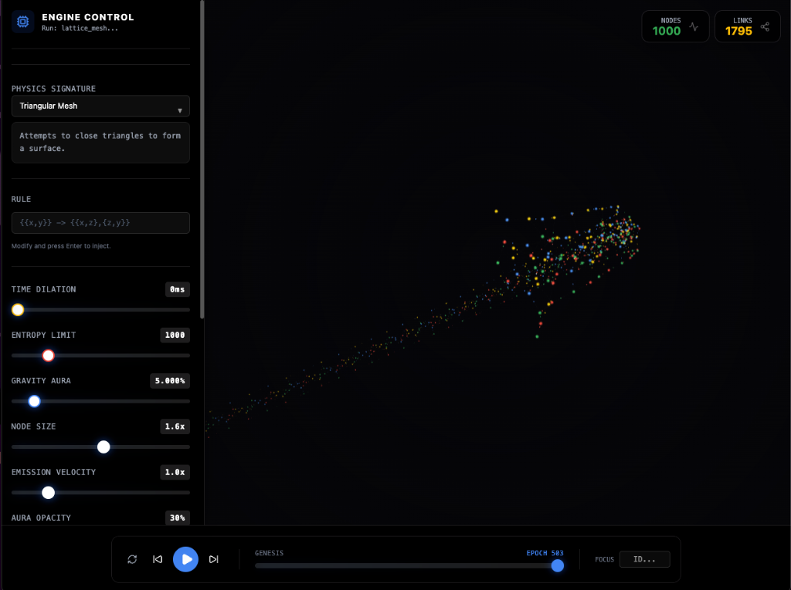

# 🌌 Wolfram Physics Explorer

> **Simulating the computational universe, one hypergraph at a time.**


A high-performance, GPU-accelerated visualization engine for **Wolfram Physics Project** models. Explore how simple graph rewriting rules can give rise to complex structures like spacetime, black holes, and quantum mechanics.


<div align="center">
  
  
</div>


## ✨ Key Features

### 🚀 Advanced Physics Engine
- **Stochastic Rewriting**: Real-time graph transformation based on Wolfram's localized rules.
- **Genesis Protocol**: Automatic mass injection prevents "heat death" in small universes.
- **High-Performance**: Off-main-thread Web Worker calculation loop for smooth 60fps rendering even at 1000+ nodes.

### 🎨 Cinematic Visualization
- **Glasmorphic Rendering**: Beautiful, transparent nodes with emissive cores.
- **Dynamic Physics**: Interactive force-directed layout with adjustable gravity, friction, and link distance.
- **Cosmic Effects**: Toggle particle emissions, shadow propagation, and aura opacity.

### 🛠️ Custom Rule Playground
Design your own universe! The built-in parser supports standard Wolfram signature syntax:
```wolfram
{{x,y},{u,v}} -> {{x,u},{y,v},{x,y}}
```
Watch as your abstract rule builds geometry before your eyes.

## 📦 Installation

```bash
# Clone the repository
git clone https://github.com/lg/wolfram-physics-explorer.git

# Install dependencies
npm install

# Run the simulation
npm run dev
```

## 🧪 Testing

We maintain a rigorous test suite for the core physics engine and rule parser.

```bash
# Run unit tests
npm run test

# Check coverage
npx vitest run --coverage
```

## 🧠 How It Works

1.  **State**: The universe is a **Hypergraph** (nodes and links).
2.  **Evolution**: At each step, the `Engine` scans the graph for patterns matching the selected **Rule**.
3.  **Rewrite**: Matching subgraphs are replaced according to the rule's Right-Hand Side (RHS).
4.  **Layout**: A force-directed algorithm (d3-force-3d) organizes the new topology in 3D space.

## 📜 License

MIT © 2024 Wolfram Physics Explorer Team
