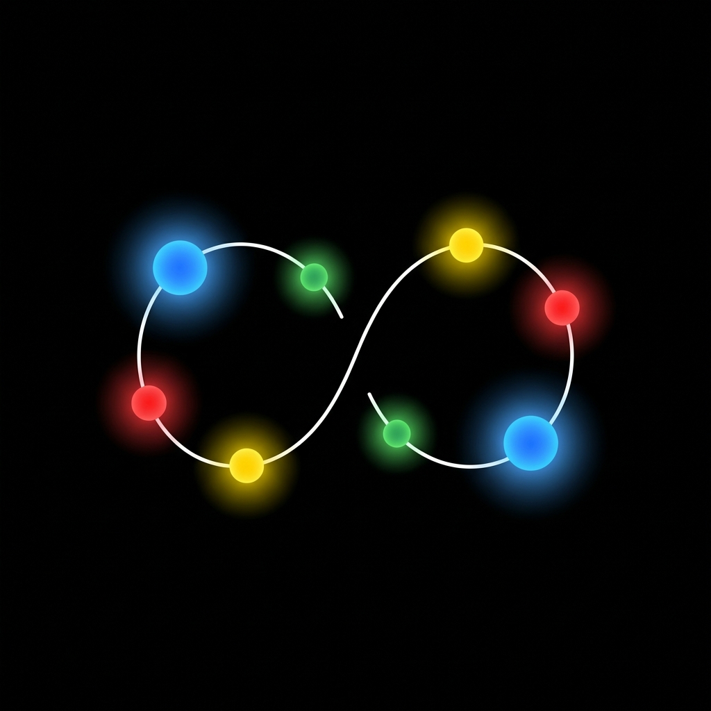
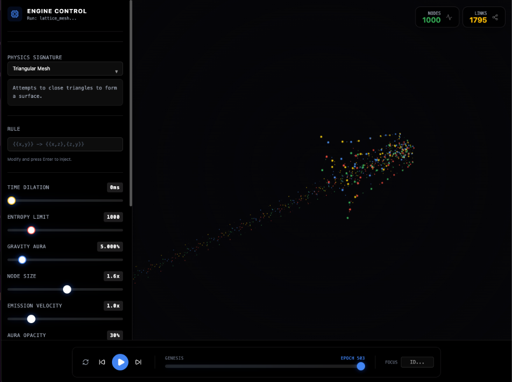
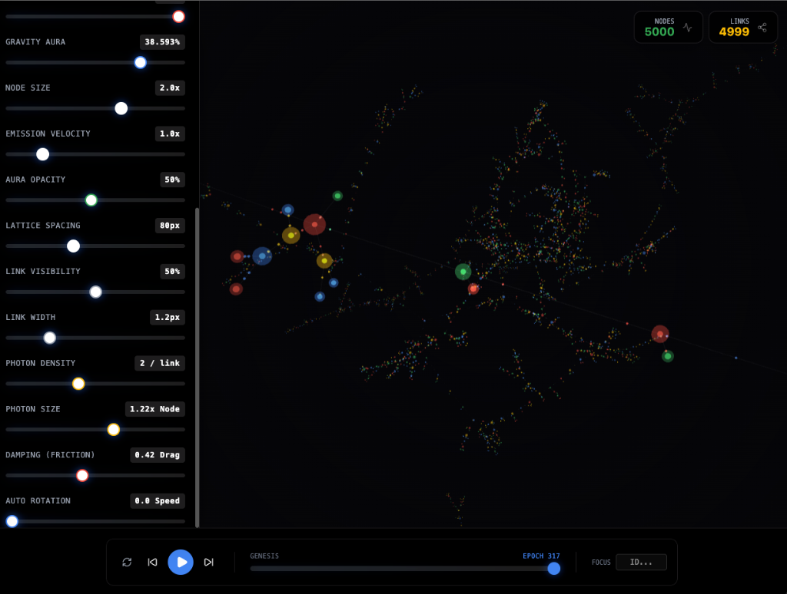

# Project Codebase: wolfram-physics-explorer

## File Tree

```text
wolfram-physics-explorer/
├── .gitignore
├── README.md
├── eslint.config.js
├── package-lock.json
├── package.json
├── postcss.config.js
├── scripts
│   └── verify_wasm.js
├── setupTests.ts
├── src
│   ├── App.tsx
│   ├── components
│   │   ├── controls
│   │   │   ├── BottomControlBar.tsx
│   │   │   ├── ControlSidebar.tsx
│   │   │   └── StatsDisplay.tsx
│   │   ├── graph
│   │   │   ├── GraphRenderer.tsx
│   │   │   ├── GraphVisualizer.tsx
│   │   │   ├── factories
│   │   │   │   ├── linkFactory.ts
│   │   │   │   └── nodeFactory.ts
│   │   │   ├── geometries.ts
│   │   │   ├── materials
│   │   │   │   ├── glass.ts
│   │   │   │   └── particles.ts
│   │   │   └── useGraphData.ts
│   │   └── ui
│   │       ├── button.tsx
│   │       ├── buttonVariants.ts
│   │       ├── card.tsx
│   │       ├── command.tsx
│   │       ├── popover.tsx
│   │       ├── select.tsx
│   │       └── slider.tsx
│   ├── context
│   │   └── SimulationContext.tsx
│   ├── hooks
│   │   └── useDebounce.ts
│   ├── index.css
│   ├── index.tsx
│   ├── rust
│   │   └── wolfram-physics-wasm
│   │       ├── Cargo.lock
│   │       ├── Cargo.toml
│   │       ├── README.md
│   │       └── src
│   │           ├── README.md
│   │           ├── lib.rs
│   │           ├── renderer.rs
│   │           ├── rules
│   │           │   ├── README.md
│   │           │   ├── growth.rs
│   │           │   └── mod.rs
│   │           └── shader.wgsl
│   ├── services
│   │   ├── physics
│   │   │   ├── README.md
│   │   │   ├── __tests__
│   │   │   │   └── customRuleParser.test.ts
│   │   │   ├── customRuleParser.ts
│   │   │   ├── engine.ts
│   │   │   ├── registry.ts
│   │   │   ├── rules
│   │   │   │   ├── chaos.ts
│   │   │   │   ├── cosmic.ts
│   │   │   │   ├── cycle.ts
│   │   │   │   ├── growth.ts
│   │   │   │   └── lattice.ts
│   │   │   ├── types.ts
│   │   │   └── utils
│   │   │       └── ids.ts
│   │   ├── worker.ts
│   │   └── workers
│   │       ├── idbWorker.ts
│   │       └── sqliteWorker.ts
│   └── types.ts
├── tsconfig.json
├── tsconfig.node.json
├── vite.config.ts
└── yarn.lock
```

## File Contents

### File: `.gitignore`

```text
# Logs
logs
*.log
npm-debug.log*
yarn-debug.log*
yarn-error.log*
pnpm-debug.log*
lerna-debug.log*

node_modules
dist
dist-ssr
*.local

# Editor directories and files
.vscode/*
!.vscode/extensions.json
.idea
.DS_Store
*.suo
*.ntvs*
*.njsproj
*.sln
*.sw?

# Rust WASM
src/rust/**/target
src/rust/**/pkg
src/rust/**/*.wasm
!src/rust/**/src/*.rs
# Keep the source, ignore the build
```

### File: `README.md`

````md
# 🌌 Wolfram Physics Explorer

<div align="center">
  
</div>


> **Simulating the computational universe, one hypergraph at a time.**


A high-performance, GPU-accelerated visualization engine for **Wolfram Physics Project** models. Explore how simple graph rewriting rules can give rise to complex structures like spacetime, black holes, and quantum mechanics.


<div align="center">
  
  
</div>


## ✨ Key Features

### 🚀 Advanced Physics Engine
- **Stochastic Rewriting**: Real-time graph transformation based on Wolfram's localized rules.
- **Genesis Protocol**: Automatic mass injection prevents "heat death" in small universes.
- **High-Performance**: Off-main-thread Web Worker calculation loop for smooth 60fps rendering even at 1000+ nodes.

### 🎨 Cinematic Visualization
- **Glasmorphic Rendering**: Beautiful, transparent nodes with emissive cores.
- **Dynamic Physics**: Interactive force-directed layout with adjustable gravity, friction, and link distance.
- **Cosmic Effects**: Toggle particle emissions, shadow propagation, and aura opacity.

### 🛠️ Custom Rule Playground
Design your own universe! The built-in parser supports standard Wolfram signature syntax:
```wolfram
{{x,y},{u,v}} -> {{x,u},{y,v},{x,y}}
```
Watch as your abstract rule builds geometry before your eyes.

## 📦 Installation

```bash
# Clone the repository
git clone https://github.com/lg/wolfram-physics-explorer.git

# Install dependencies
npm install

# Run the simulation
npm run dev
```

## 🧪 Testing

We maintain a rigorous test suite for the core physics engine and rule parser.

```bash
# Run unit tests
npm run test

# Check coverage
npx vitest run --coverage
```

## 🧠 How It Works

1.  **State**: The universe is a **Hypergraph** (nodes and links).
2.  **Evolution**: At each step, the `Engine` scans the graph for patterns matching the selected **Rule**.
3.  **Rewrite**: Matching subgraphs are replaced according to the rule's Right-Hand Side (RHS).
4.  **Layout**: A force-directed algorithm (d3-force-3d) organizes the new topology in 3D space.

## 📜 License

MIT © 2024 Wolfram Physics Explorer Team
````

### File: `eslint.config.js`

```javascript
import js from '@eslint/js';
import globals from 'globals';
import reactHooks from 'eslint-plugin-react-hooks';
import reactRefresh from 'eslint-plugin-react-refresh';
import tseslint from 'typescript-eslint';
import react from 'eslint-plugin-react';

export default tseslint.config(
  { ignores: ['dist'] },
  {
    extends: [js.configs.recommended, ...tseslint.configs.recommended],
    files: ['**/*.{ts,tsx}'],
    languageOptions: {
      ecmaVersion: 2020,
      globals: globals.browser,
    },
    plugins: {
      'react-hooks': reactHooks,
      'react-refresh': reactRefresh,
      react,
    },
    rules: {
      ...reactHooks.configs.recommended.rules,
      'react-refresh/only-export-components': [
        'warn',
        { allowConstantExport: true },
      ],
       "react/react-in-jsx-scope": "off",
       "@typescript-eslint/no-unused-vars": ["warn", { "argsIgnorePattern": "^_" }],
       "@typescript-eslint/no-explicit-any": "warn"
    },
  },
);
```

### File: `package-lock.json`

```json
{
  "name": "wolfram-physics-explorer",
  "version": "0.0.0",
  "lockfileVersion": 3,
  "requires": true,
  "packages": {
    "": {
      "name": "wolfram-physics-explorer",
      "version": "0.0.0",
      "dependencies": {
        "@google/genai": "^1.38.0",
        "@radix-ui/react-dialog": "^1.1.15",
        "@radix-ui/react-popover": "^1.1.15",
        "@sqlite.org/sqlite-wasm": "^3.51.2-build5",
        "class-variance-authority": "^0.7.1",
        "clsx": "^2.1.1",
        "cmdk": "^1.1.1",
        "lucide-react": "^0.563.0",
        "react": "^19.2.3",
        "react-dom": "^19.2.3",
        "react-force-graph-3d": "^1.29.0",
        "tailwind-merge": "^3.4.0",
        "three": "0.173.0"
      },
      "devDependencies": {
        "@tailwindcss/postcss": "^4.1.18",
        "@testing-library/jest-dom": "^6.9.1",
        "@testing-library/react": "^16.3.2",
        "@types/node": "^22.14.0",
        "@types/react": "^19.2.9",
        "@types/react-dom": "^19.2.3",
        "@types/three": "^0.182.0",
        "@typescript-eslint/eslint-plugin": "^8.54.0",
        "@typescript-eslint/parser": "^8.54.0",
        "@vitejs/plugin-react": "^5.0.0",
        "@vitest/coverage-v8": "4.0.18",
        "autoprefixer": "^10.4.23",
        "eslint": "^9.39.2",
        "eslint-plugin-react": "^7.37.5",
        "eslint-plugin-react-hooks": "^7.0.1",
        "eslint-plugin-react-refresh": "^0.4.26",
        "globals": "^17.1.0",
        "jsdom": "^27.4.0",
        "postcss": "^8.5.6",
        "prettier": "^3.8.1",
        "tailwindcss": "^4.1.18",
        "typescript": "~5.8.2",
        "typescript-eslint": "^8.54.0",
        "vite": "^6.2.0",
        "vitest": "^4.0.18"
      }
    },
    "node_modules/@acemir/cssom": {
      "version": "0.9.31",
      "resolved": "https://registry.npmjs.org/@acemir/cssom/-/cssom-0.9.31.tgz",
      "integrity": "sha512-ZnR3GSaH+/vJ0YlHau21FjfLYjMpYVIzTD8M8vIEQvIGxeOXyXdzCI140rrCY862p/C/BbzWsjc1dgnM9mkoTA==",
      "dev": true,
      "license": "MIT"
    },
    "node_modules/@adobe/css-tools": {
      "version": "4.4.4",
      "resolved": "https://registry.npmjs.org/@adobe/css-tools/-/css-tools-4.4.4.tgz",
      "integrity": "sha512-Elp+iwUx5rN5+Y8xLt5/GRoG20WGoDCQ/1Fb+1LiGtvwbDavuSk0jhD/eZdckHAuzcDzccnkv+rEjyWfRx18gg==",
      "dev": true,
      "license": "MIT"
    },
    "node_modules/@alloc/quick-lru": {
      "version": "5.2.0",
      "resolved": "https://registry.npmjs.org/@alloc/quick-lru/-/quick-lru-5.2.0.tgz",
      "integrity": "sha512-UrcABB+4bUrFABwbluTIBErXwvbsU/V7TZWfmbgJfbkwiBuziS9gxdODUyuiecfdGQ85jglMW6juS3+z5TsKLw==",
      "dev": true,
      "license": "MIT",
      "engines": {
        "node": ">=10"
      },
      "funding": {
        "url": "https://github.com/sponsors/sindresorhus"
      }
    },
    "node_modules/@asamuzakjp/css-color": {
      "version": "4.1.1",
      "resolved": "https://registry.npmjs.org/@asamuzakjp/css-color/-/css-color-4.1.1.tgz",
      "integrity": "sha512-B0Hv6G3gWGMn0xKJ0txEi/jM5iFpT3MfDxmhZFb4W047GvytCf1DHQ1D69W3zHI4yWe2aTZAA0JnbMZ7Xc8DuQ==",
      "dev": true,
      "license": "MIT",
      "dependencies": {
        "@csstools/css-calc": "^2.1.4",
        "@csstools/css-color-parser": "^3.1.0",
        "@csstools/css-parser-algorithms": "^3.0.5",
        "@csstools/css-tokenizer": "^3.0.4",
        "lru-cache": "^11.2.4"
      }
    },
    "node_modules/@asamuzakjp/css-color/node_modules/lru-cache": {
      "version": "11.2.5",
      "resolved": "https://registry.npmjs.org/lru-cache/-/lru-cache-11.2.5.tgz",
      "integrity": "sha512-vFrFJkWtJvJnD5hg+hJvVE8Lh/TcMzKnTgCWmtBipwI5yLX/iX+5UB2tfuyODF5E7k9xEzMdYgGqaSb1c0c5Yw==",
      "dev": true,
      "license": "BlueOak-1.0.0",
      "engines": {
        "node": "20 || >=22"
      }
    },
    "node_modules/@asamuzakjp/dom-selector": {
      "version": "6.7.6",
      "resolved": "https://registry.npmjs.org/@asamuzakjp/dom-selector/-/dom-selector-6.7.6.tgz",
      "integrity": "sha512-hBaJER6A9MpdG3WgdlOolHmbOYvSk46y7IQN/1+iqiCuUu6iWdQrs9DGKF8ocqsEqWujWf/V7b7vaDgiUmIvUg==",
      "dev": true,
      "license": "MIT",
      "dependencies": {
        "@asamuzakjp/nwsapi": "^2.3.9",
        "bidi-js": "^1.0.3",
        "css-tree": "^3.1.0",
        "is-potential-custom-element-name": "^1.0.1",
        "lru-cache": "^11.2.4"
      }
    },
    "node_modules/@asamuzakjp/dom-selector/node_modules/lru-cache": {
      "version": "11.2.5",
      "resolved": "https://registry.npmjs.org/lru-cache/-/lru-cache-11.2.5.tgz",
      "integrity": "sha512-vFrFJkWtJvJnD5hg+hJvVE8Lh/TcMzKnTgCWmtBipwI5yLX/iX+5UB2tfuyODF5E7k9xEzMdYgGqaSb1c0c5Yw==",
      "dev": true,
      "license": "BlueOak-1.0.0",
      "engines": {
        "node": "20 || >=22"
      }
    },
    "node_modules/@asamuzakjp/nwsapi": {
      "version": "2.3.9",
      "resolved": "https://registry.npmjs.org/@asamuzakjp/nwsapi/-/nwsapi-2.3.9.tgz",
      "integrity": "sha512-n8GuYSrI9bF7FFZ/SjhwevlHc8xaVlb/7HmHelnc/PZXBD2ZR49NnN9sMMuDdEGPeeRQ5d0hqlSlEpgCX3Wl0Q==",
      "dev": true,
      "license": "MIT"
    },
    "node_modules/@babel/code-frame": {
      "version": "7.28.6",
      "resolved": "https://registry.npmjs.org/@babel/code-frame/-/code-frame-7.28.6.tgz",
      "integrity": "sha512-JYgintcMjRiCvS8mMECzaEn+m3PfoQiyqukOMCCVQtoJGYJw8j/8LBJEiqkHLkfwCcs74E3pbAUFNg7d9VNJ+Q==",
      "dev": true,
      "license": "MIT",
      "dependencies": {
        "@babel/helper-validator-identifier": "^7.28.5",
        "js-tokens": "^4.0.0",
        "picocolors": "^1.1.1"
      },
      "engines": {
        "node": ">=6.9.0"
      }
    },
    "node_modules/@babel/compat-data": {
      "version": "7.28.6",
      "resolved": "https://registry.npmjs.org/@babel/compat-data/-/compat-data-7.28.6.tgz",
      "integrity": "sha512-2lfu57JtzctfIrcGMz992hyLlByuzgIk58+hhGCxjKZ3rWI82NnVLjXcaTqkI2NvlcvOskZaiZ5kjUALo3Lpxg==",
      "dev": true,
      "license": "MIT",
      "engines": {
        "node": ">=6.9.0"
      }
    },
    "node_modules/@babel/core": {
      "version": "7.28.6",
      "resolved": "https://registry.npmjs.org/@babel/core/-/core-7.28.6.tgz",
      "integrity": "sha512-H3mcG6ZDLTlYfaSNi0iOKkigqMFvkTKlGUYlD8GW7nNOYRrevuA46iTypPyv+06V3fEmvvazfntkBU34L0azAw==",
      "dev": true,
      "license": "MIT",
      "dependencies": {
        "@babel/code-frame": "^7.28.6",
        "@babel/generator": "^7.28.6",
        "@babel/helper-compilation-targets": "^7.28.6",
        "@babel/helper-module-transforms": "^7.28.6",
        "@babel/helpers": "^7.28.6",
        "@babel/parser": "^7.28.6",
        "@babel/template": "^7.28.6",
        "@babel/traverse": "^7.28.6",
        "@babel/types": "^7.28.6",
        "@jridgewell/remapping": "^2.3.5",
        "convert-source-map": "^2.0.0",
        "debug": "^4.1.0",
        "gensync": "^1.0.0-beta.2",
        "json5": "^2.2.3",
        "semver": "^6.3.1"
      },
      "engines": {
        "node": ">=6.9.0"
      },
      "funding": {
        "type": "opencollective",
        "url": "https://opencollective.com/babel"
      }
    },
    "node_modules/@babel/core/node_modules/semver": {
      "version": "6.3.1",
      "resolved": "https://registry.npmjs.org/semver/-/semver-6.3.1.tgz",
      "integrity": "sha512-BR7VvDCVHO+q2xBEWskxS6DJE1qRnb7DxzUrogb71CWoSficBxYsiAGd+Kl0mmq/MprG9yArRkyrQxTO6XjMzA==",
      "dev": true,
      "license": "ISC",
      "bin": {
        "semver": "bin/semver.js"
      }
    },
    "node_modules/@babel/generator": {
      "version": "7.28.6",
      "resolved": "https://registry.npmjs.org/@babel/generator/-/generator-7.28.6.tgz",
      "integrity": "sha512-lOoVRwADj8hjf7al89tvQ2a1lf53Z+7tiXMgpZJL3maQPDxh0DgLMN62B2MKUOFcoodBHLMbDM6WAbKgNy5Suw==",
      "dev": true,
      "license": "MIT",
      "dependencies": {
        "@babel/parser": "^7.28.6",
        "@babel/types": "^7.28.6",
        "@jridgewell/gen-mapping": "^0.3.12",
        "@jridgewell/trace-mapping": "^0.3.28",
        "jsesc": "^3.0.2"
      },
      "engines": {
        "node": ">=6.9.0"
      }
    },
    "node_modules/@babel/helper-compilation-targets": {
      "version": "7.28.6",
      "resolved": "https://registry.npmjs.org/@babel/helper-compilation-targets/-/helper-compilation-targets-7.28.6.tgz",
      "integrity": "sha512-JYtls3hqi15fcx5GaSNL7SCTJ2MNmjrkHXg4FSpOA/grxK8KwyZ5bubHsCq8FXCkua6xhuaaBit+3b7+VZRfcA==",
      "dev": true,
      "license": "MIT",
      "dependencies": {
        "@babel/compat-data": "^7.28.6",
        "@babel/helper-validator-option": "^7.27.1",
        "browserslist": "^4.24.0",
        "lru-cache": "^5.1.1",
        "semver": "^6.3.1"
      },
      "engines": {
        "node": ">=6.9.0"
      }
    },
    "node_modules/@babel/helper-compilation-targets/node_modules/semver": {
      "version": "6.3.1",
      "resolved": "https://registry.npmjs.org/semver/-/semver-6.3.1.tgz",
      "integrity": "sha512-BR7VvDCVHO+q2xBEWskxS6DJE1qRnb7DxzUrogb71CWoSficBxYsiAGd+Kl0mmq/MprG9yArRkyrQxTO6XjMzA==",
      "dev": true,
      "license": "ISC",
      "bin": {
        "semver": "bin/semver.js"
      }
    },
    "node_modules/@babel/helper-globals": {
      "version": "7.28.0",
      "resolved": "https://registry.npmjs.org/@babel/helper-globals/-/helper-globals-7.28.0.tgz",
      "integrity": "sha512-+W6cISkXFa1jXsDEdYA8HeevQT/FULhxzR99pxphltZcVaugps53THCeiWA8SguxxpSp3gKPiuYfSWopkLQ4hw==",
      "dev": true,
      "license": "MIT",
      "engines": {
        "node": ">=6.9.0"
      }
    },
    "node_modules/@babel/helper-module-imports": {
      "version": "7.28.6",
      "resolved": "https://registry.npmjs.org/@babel/helper-module-imports/-/helper-module-imports-7.28.6.tgz",
      "integrity": "sha512-l5XkZK7r7wa9LucGw9LwZyyCUscb4x37JWTPz7swwFE/0FMQAGpiWUZn8u9DzkSBWEcK25jmvubfpw2dnAMdbw==",
      "dev": true,
      "license": "MIT",
      "dependencies": {
        "@babel/traverse": "^7.28.6",
        "@babel/types": "^7.28.6"
      },
      "engines": {
        "node": ">=6.9.0"
      }
    },
    "node_modules/@babel/helper-module-transforms": {
      "version": "7.28.6",
      "resolved": "https://registry.npmjs.org/@babel/helper-module-transforms/-/helper-module-transforms-7.28.6.tgz",
      "integrity": "sha512-67oXFAYr2cDLDVGLXTEABjdBJZ6drElUSI7WKp70NrpyISso3plG9SAGEF6y7zbha/wOzUByWWTJvEDVNIUGcA==",
      "dev": true,
      "license": "MIT",
      "dependencies": {
        "@babel/helper-module-imports": "^7.28.6",
        "@babel/helper-validator-identifier": "^7.28.5",
        "@babel/traverse": "^7.28.6"
      },
      "engines": {
        "node": ">=6.9.0"
      },
      "peerDependencies": {
        "@babel/core": "^7.0.0"
      }
    },
    "node_modules/@babel/helper-plugin-utils": {
      "version": "7.28.6",
      "resolved": "https://registry.npmjs.org/@babel/helper-plugin-utils/-/helper-plugin-utils-7.28.6.tgz",
      "integrity": "sha512-S9gzZ/bz83GRysI7gAD4wPT/AI3uCnY+9xn+Mx/KPs2JwHJIz1W8PZkg2cqyt3RNOBM8ejcXhV6y8Og7ly/Dug==",
      "dev": true,
      "license": "MIT",
      "engines": {
        "node": ">=6.9.0"
      }
    },
    "node_modules/@babel/helper-string-parser": {
      "version": "7.27.1",
      "resolved": "https://registry.npmjs.org/@babel/helper-string-parser/-/helper-string-parser-7.27.1.tgz",
      "integrity": "sha512-qMlSxKbpRlAridDExk92nSobyDdpPijUq2DW6oDnUqd0iOGxmQjyqhMIihI9+zv4LPyZdRje2cavWPbCbWm3eA==",
      "dev": true,
      "license": "MIT",
      "engines": {
        "node": ">=6.9.0"
      }
    },
    "node_modules/@babel/helper-validator-identifier": {
      "version": "7.28.5",
      "resolved": "https://registry.npmjs.org/@babel/helper-validator-identifier/-/helper-validator-identifier-7.28.5.tgz",
      "integrity": "sha512-qSs4ifwzKJSV39ucNjsvc6WVHs6b7S03sOh2OcHF9UHfVPqWWALUsNUVzhSBiItjRZoLHx7nIarVjqKVusUZ1Q==",
      "dev": true,
      "license": "MIT",
      "engines": {
        "node": ">=6.9.0"
      }
    },
    "node_modules/@babel/helper-validator-option": {
      "version": "7.27.1",
      "resolved": "https://registry.npmjs.org/@babel/helper-validator-option/-/helper-validator-option-7.27.1.tgz",
      "integrity": "sha512-YvjJow9FxbhFFKDSuFnVCe2WxXk1zWc22fFePVNEaWJEu8IrZVlda6N0uHwzZrUM1il7NC9Mlp4MaJYbYd9JSg==",
      "dev": true,
      "license": "MIT",
      "engines": {
        "node": ">=6.9.0"
      }
    },
    "node_modules/@babel/helpers": {
      "version": "7.28.6",
      "resolved": "https://registry.npmjs.org/@babel/helpers/-/helpers-7.28.6.tgz",
      "integrity": "sha512-xOBvwq86HHdB7WUDTfKfT/Vuxh7gElQ+Sfti2Cy6yIWNW05P8iUslOVcZ4/sKbE+/jQaukQAdz/gf3724kYdqw==",
      "dev": true,
      "license": "MIT",
      "dependencies": {
        "@babel/template": "^7.28.6",
        "@babel/types": "^7.28.6"
      },
      "engines": {
        "node": ">=6.9.0"
      }
    },
    "node_modules/@babel/parser": {
      "version": "7.28.6",
      "resolved": "https://registry.npmjs.org/@babel/parser/-/parser-7.28.6.tgz",
      "integrity": "sha512-TeR9zWR18BvbfPmGbLampPMW+uW1NZnJlRuuHso8i87QZNq2JRF9i6RgxRqtEq+wQGsS19NNTWr2duhnE49mfQ==",
      "dev": true,
      "license": "MIT",
      "dependencies": {
        "@babel/types": "^7.28.6"
      },
      "bin": {
        "parser": "bin/babel-parser.js"
      },
      "engines": {
        "node": ">=6.0.0"
      }
    },
    "node_modules/@babel/plugin-transform-react-jsx-self": {
      "version": "7.27.1",
      "resolved": "https://registry.npmjs.org/@babel/plugin-transform-react-jsx-self/-/plugin-transform-react-jsx-self-7.27.1.tgz",
      "integrity": "sha512-6UzkCs+ejGdZ5mFFC/OCUrv028ab2fp1znZmCZjAOBKiBK2jXD1O+BPSfX8X2qjJ75fZBMSnQn3Rq2mrBJK2mw==",
      "dev": true,
      "license": "MIT",
      "dependencies": {
        "@babel/helper-plugin-utils": "^7.27.1"
      },
      "engines": {
        "node": ">=6.9.0"
      },
      "peerDependencies": {
        "@babel/core": "^7.0.0-0"
      }
    },
    "node_modules/@babel/plugin-transform-react-jsx-source": {
      "version": "7.27.1",
      "resolved": "https://registry.npmjs.org/@babel/plugin-transform-react-jsx-source/-/plugin-transform-react-jsx-source-7.27.1.tgz",
      "integrity": "sha512-zbwoTsBruTeKB9hSq73ha66iFeJHuaFkUbwvqElnygoNbj/jHRsSeokowZFN3CZ64IvEqcmmkVe89OPXc7ldAw==",
      "dev": true,
      "license": "MIT",
      "dependencies": {
        "@babel/helper-plugin-utils": "^7.27.1"
      },
      "engines": {
        "node": ">=6.9.0"
      },
      "peerDependencies": {
        "@babel/core": "^7.0.0-0"
      }
    },
    "node_modules/@babel/runtime": {
      "version": "7.28.6",
      "resolved": "https://registry.npmjs.org/@babel/runtime/-/runtime-7.28.6.tgz",
      "integrity": "sha512-05WQkdpL9COIMz4LjTxGpPNCdlpyimKppYNoJ5Di5EUObifl8t4tuLuUBBZEpoLYOmfvIWrsp9fCl0HoPRVTdA==",
      "license": "MIT",
      "engines": {
        "node": ">=6.9.0"
      }
    },
    "node_modules/@babel/template": {
      "version": "7.28.6",
      "resolved": "https://registry.npmjs.org/@babel/template/-/template-7.28.6.tgz",
      "integrity": "sha512-YA6Ma2KsCdGb+WC6UpBVFJGXL58MDA6oyONbjyF/+5sBgxY/dwkhLogbMT2GXXyU84/IhRw/2D1Os1B/giz+BQ==",
      "dev": true,
      "license": "MIT",
      "dependencies": {
        "@babel/code-frame": "^7.28.6",
        "@babel/parser": "^7.28.6",
        "@babel/types": "^7.28.6"
      },
      "engines": {
        "node": ">=6.9.0"
      }
    },
    "node_modules/@babel/traverse": {
      "version": "7.28.6",
      "resolved": "https://registry.npmjs.org/@babel/traverse/-/traverse-7.28.6.tgz",
      "integrity": "sha512-fgWX62k02qtjqdSNTAGxmKYY/7FSL9WAS1o2Hu5+I5m9T0yxZzr4cnrfXQ/MX0rIifthCSs6FKTlzYbJcPtMNg==",
      "dev": true,
      "license": "MIT",
      "dependencies": {
        "@babel/code-frame": "^7.28.6",
        "@babel/generator": "^7.28.6",
        "@babel/helper-globals": "^7.28.0",
        "@babel/parser": "^7.28.6",
        "@babel/template": "^7.28.6",
        "@babel/types": "^7.28.6",
        "debug": "^4.3.1"
      },
      "engines": {
        "node": ">=6.9.0"
      }
    },
    "node_modules/@babel/types": {
      "version": "7.28.6",
      "resolved": "https://registry.npmjs.org/@babel/types/-/types-7.28.6.tgz",
      "integrity": "sha512-0ZrskXVEHSWIqZM/sQZ4EV3jZJXRkio/WCxaqKZP1g//CEWEPSfeZFcms4XeKBCHU0ZKnIkdJeU/kF+eRp5lBg==",
      "dev": true,
      "license": "MIT",
      "dependencies": {
        "@babel/helper-string-parser": "^7.27.1",
        "@babel/helper-validator-identifier": "^7.28.5"
      },
      "engines": {
        "node": ">=6.9.0"
      }
    },
    "node_modules/@bcoe/v8-coverage": {
      "version": "1.0.2",
      "resolved": "https://registry.npmjs.org/@bcoe/v8-coverage/-/v8-coverage-1.0.2.tgz",
      "integrity": "sha512-6zABk/ECA/QYSCQ1NGiVwwbQerUCZ+TQbp64Q3AgmfNvurHH0j8TtXa1qbShXA6qqkpAj4V5W8pP6mLe1mcMqA==",
      "dev": true,
      "license": "MIT",
      "engines": {
        "node": ">=18"
      }
    },
    "node_modules/@csstools/color-helpers": {
      "version": "5.1.0",
      "resolved": "https://registry.npmjs.org/@csstools/color-helpers/-/color-helpers-5.1.0.tgz",
      "integrity": "sha512-S11EXWJyy0Mz5SYvRmY8nJYTFFd1LCNV+7cXyAgQtOOuzb4EsgfqDufL+9esx72/eLhsRdGZwaldu/h+E4t4BA==",
      "dev": true,
      "funding": [
        {
          "type": "github",
          "url": "https://github.com/sponsors/csstools"
        },
        {
          "type": "opencollective",
          "url": "https://opencollective.com/csstools"
        }
      ],
      "license": "MIT-0",
      "engines": {
        "node": ">=18"
      }
    },
    "node_modules/@csstools/css-calc": {
      "version": "2.1.4",
      "resolved": "https://registry.npmjs.org/@csstools/css-calc/-/css-calc-2.1.4.tgz",
      "integrity": "sha512-3N8oaj+0juUw/1H3YwmDDJXCgTB1gKU6Hc/bB502u9zR0q2vd786XJH9QfrKIEgFlZmhZiq6epXl4rHqhzsIgQ==",
      "dev": true,
      "funding": [
        {
          "type": "github",
          "url": "https://github.com/sponsors/csstools"
        },
        {
          "type": "opencollective",
          "url": "https://opencollective.com/csstools"
        }
      ],
      "license": "MIT",
      "engines": {
        "node": ">=18"
      },
      "peerDependencies": {
        "@csstools/css-parser-algorithms": "^3.0.5",
        "@csstools/css-tokenizer": "^3.0.4"
      }
    },
    "node_modules/@csstools/css-color-parser": {
      "version": "3.1.0",
      "resolved": "https://registry.npmjs.org/@csstools/css-color-parser/-/css-color-parser-3.1.0.tgz",
      "integrity": "sha512-nbtKwh3a6xNVIp/VRuXV64yTKnb1IjTAEEh3irzS+HkKjAOYLTGNb9pmVNntZ8iVBHcWDA2Dof0QtPgFI1BaTA==",
      "dev": true,
      "funding": [
        {
          "type": "github",
          "url": "https://github.com/sponsors/csstools"
        },
        {
          "type": "opencollective",
          "url": "https://opencollective.com/csstools"
        }
      ],
      "license": "MIT",
      "dependencies": {
        "@csstools/color-helpers": "^5.1.0",
        "@csstools/css-calc": "^2.1.4"
      },
      "engines": {
        "node": ">=18"
      },
      "peerDependencies": {
        "@csstools/css-parser-algorithms": "^3.0.5",
        "@csstools/css-tokenizer": "^3.0.4"
      }
    },
    "node_modules/@csstools/css-parser-algorithms": {
      "version": "3.0.5",
      "resolved": "https://registry.npmjs.org/@csstools/css-parser-algorithms/-/css-parser-algorithms-3.0.5.tgz",
      "integrity": "sha512-DaDeUkXZKjdGhgYaHNJTV9pV7Y9B3b644jCLs9Upc3VeNGg6LWARAT6O+Q+/COo+2gg/bM5rhpMAtf70WqfBdQ==",
      "dev": true,
      "funding": [
        {
          "type": "github",
          "url": "https://github.com/sponsors/csstools"
        },
        {
          "type": "opencollective",
          "url": "https://opencollective.com/csstools"
        }
      ],
      "license": "MIT",
      "engines": {
        "node": ">=18"
      },
      "peerDependencies": {
        "@csstools/css-tokenizer": "^3.0.4"
      }
    },
    "node_modules/@csstools/css-syntax-patches-for-csstree": {
      "version": "1.0.26",
      "resolved": "https://registry.npmjs.org/@csstools/css-syntax-patches-for-csstree/-/css-syntax-patches-for-csstree-1.0.26.tgz",
      "integrity": "sha512-6boXK0KkzT5u5xOgF6TKB+CLq9SOpEGmkZw0g5n9/7yg85wab3UzSxB8TxhLJ31L4SGJ6BCFRw/iftTha1CJXA==",
      "dev": true,
      "funding": [
        {
          "type": "github",
          "url": "https://github.com/sponsors/csstools"
        },
        {
          "type": "opencollective",
          "url": "https://opencollective.com/csstools"
        }
      ],
      "license": "MIT-0"
    },
    "node_modules/@csstools/css-tokenizer": {
      "version": "3.0.4",
      "resolved": "https://registry.npmjs.org/@csstools/css-tokenizer/-/css-tokenizer-3.0.4.tgz",
      "integrity": "sha512-Vd/9EVDiu6PPJt9yAh6roZP6El1xHrdvIVGjyBsHR0RYwNHgL7FJPyIIW4fANJNG6FtyZfvlRPpFI4ZM/lubvw==",
      "dev": true,
      "funding": [
        {
          "type": "github",
          "url": "https://github.com/sponsors/csstools"
        },
        {
          "type": "opencollective",
          "url": "https://opencollective.com/csstools"
        }
      ],
      "license": "MIT",
      "engines": {
        "node": ">=18"
      }
    },
    "node_modules/@dimforge/rapier3d-compat": {
      "version": "0.12.0",
      "resolved": "https://registry.npmjs.org/@dimforge/rapier3d-compat/-/rapier3d-compat-0.12.0.tgz",
      "integrity": "sha512-uekIGetywIgopfD97oDL5PfeezkFpNhwlzlaEYNOA0N6ghdsOvh/HYjSMek5Q2O1PYvRSDFcqFVJl4r4ZBwOow==",
      "dev": true,
      "license": "Apache-2.0"
    },
    "node_modules/@esbuild/aix-ppc64": {
      "version": "0.25.12",
      "resolved": "https://registry.npmjs.org/@esbuild/aix-ppc64/-/aix-ppc64-0.25.12.tgz",
      "integrity": "sha512-Hhmwd6CInZ3dwpuGTF8fJG6yoWmsToE+vYgD4nytZVxcu1ulHpUQRAB1UJ8+N1Am3Mz4+xOByoQoSZf4D+CpkA==",
      "cpu": [
        "ppc64"
      ],
      "dev": true,
      "license": "MIT",
      "optional": true,
      "os": [
        "aix"
      ],
      "engines": {
        "node": ">=18"
      }
    },
    "node_modules/@esbuild/android-arm": {
      "version": "0.25.12",
      "resolved": "https://registry.npmjs.org/@esbuild/android-arm/-/android-arm-0.25.12.tgz",
      "integrity": "sha512-VJ+sKvNA/GE7Ccacc9Cha7bpS8nyzVv0jdVgwNDaR4gDMC/2TTRc33Ip8qrNYUcpkOHUT5OZ0bUcNNVZQ9RLlg==",
      "cpu": [
        "arm"
      ],
      "dev": true,
      "license": "MIT",
      "optional": true,
      "os": [
        "android"
      ],
      "engines": {
        "node": ">=18"
      }
    },
    "node_modules/@esbuild/android-arm64": {
      "version": "0.25.12",
      "resolved": "https://registry.npmjs.org/@esbuild/android-arm64/-/android-arm64-0.25.12.tgz",
      "integrity": "sha512-6AAmLG7zwD1Z159jCKPvAxZd4y/VTO0VkprYy+3N2FtJ8+BQWFXU+OxARIwA46c5tdD9SsKGZ/1ocqBS/gAKHg==",
      "cpu": [
        "arm64"
      ],
      "dev": true,
      "license": "MIT",
      "optional": true,
      "os": [
        "android"
      ],
      "engines": {
        "node": ">=18"
      }
    },
    "node_modules/@esbuild/android-x64": {
      "version": "0.25.12",
      "resolved": "https://registry.npmjs.org/@esbuild/android-x64/-/android-x64-0.25.12.tgz",
      "integrity": "sha512-5jbb+2hhDHx5phYR2By8GTWEzn6I9UqR11Kwf22iKbNpYrsmRB18aX/9ivc5cabcUiAT/wM+YIZ6SG9QO6a8kg==",
      "cpu": [
        "x64"
      ],
      "dev": true,
      "license": "MIT",
      "optional": true,
      "os": [
        "android"
      ],
      "engines": {
        "node": ">=18"
      }
    },
    "node_modules/@esbuild/darwin-arm64": {
      "version": "0.25.12",
      "resolved": "https://registry.npmjs.org/@esbuild/darwin-arm64/-/darwin-arm64-0.25.12.tgz",
      "integrity": "sha512-N3zl+lxHCifgIlcMUP5016ESkeQjLj/959RxxNYIthIg+CQHInujFuXeWbWMgnTo4cp5XVHqFPmpyu9J65C1Yg==",
      "cpu": [
        "arm64"
      ],
      "dev": true,
      "license": "MIT",
      "optional": true,
      "os": [
        "darwin"
      ],
      "engines": {
        "node": ">=18"
      }
    },
    "node_modules/@esbuild/darwin-x64": {
      "version": "0.25.12",
      "resolved": "https://registry.npmjs.org/@esbuild/darwin-x64/-/darwin-x64-0.25.12.tgz",
      "integrity": "sha512-HQ9ka4Kx21qHXwtlTUVbKJOAnmG1ipXhdWTmNXiPzPfWKpXqASVcWdnf2bnL73wgjNrFXAa3yYvBSd9pzfEIpA==",
      "cpu": [
        "x64"
      ],
      "dev": true,
      "license": "MIT",
      "optional": true,
      "os": [
        "darwin"
      ],
      "engines": {
        "node": ">=18"
      }
    },
    "node_modules/@esbuild/freebsd-arm64": {
      "version": "0.25.12",
      "resolved": "https://registry.npmjs.org/@esbuild/freebsd-arm64/-/freebsd-arm64-0.25.12.tgz",
      "integrity": "sha512-gA0Bx759+7Jve03K1S0vkOu5Lg/85dou3EseOGUes8flVOGxbhDDh/iZaoek11Y8mtyKPGF3vP8XhnkDEAmzeg==",
      "cpu": [
        "arm64"
      ],
      "dev": true,
      "license": "MIT",
      "optional": true,
      "os": [
        "freebsd"
      ],
      "engines": {
        "node": ">=18"
      }
    },
    "node_modules/@esbuild/freebsd-x64": {
      "version": "0.25.12",
      "resolved": "https://registry.npmjs.org/@esbuild/freebsd-x64/-/freebsd-x64-0.25.12.tgz",
      "integrity": "sha512-TGbO26Yw2xsHzxtbVFGEXBFH0FRAP7gtcPE7P5yP7wGy7cXK2oO7RyOhL5NLiqTlBh47XhmIUXuGciXEqYFfBQ==",
      "cpu": [
        "x64"
      ],
      "dev": true,
      "license": "MIT",
      "optional": true,
      "os": [
        "freebsd"
      ],
      "engines": {
        "node": ">=18"
      }
    },
    "node_modules/@esbuild/linux-arm": {
      "version": "0.25.12",
      "resolved": "https://registry.npmjs.org/@esbuild/linux-arm/-/linux-arm-0.25.12.tgz",
      "integrity": "sha512-lPDGyC1JPDou8kGcywY0YILzWlhhnRjdof3UlcoqYmS9El818LLfJJc3PXXgZHrHCAKs/Z2SeZtDJr5MrkxtOw==",
      "cpu": [
        "arm"
      ],
      "dev": true,
      "license": "MIT",
      "optional": true,
      "os": [
        "linux"
      ],
      "engines": {
        "node": ">=18"
      }
    },
    "node_modules/@esbuild/linux-arm64": {
      "version": "0.25.12",
      "resolved": "https://registry.npmjs.org/@esbuild/linux-arm64/-/linux-arm64-0.25.12.tgz",
      "integrity": "sha512-8bwX7a8FghIgrupcxb4aUmYDLp8pX06rGh5HqDT7bB+8Rdells6mHvrFHHW2JAOPZUbnjUpKTLg6ECyzvas2AQ==",
      "cpu": [
        "arm64"
      ],
      "dev": true,
      "license": "MIT",
      "optional": true,
      "os": [
        "linux"
      ],
      "engines": {
        "node": ">=18"
      }
    },
    "node_modules/@esbuild/linux-ia32": {
      "version": "0.25.12",
      "resolved": "https://registry.npmjs.org/@esbuild/linux-ia32/-/linux-ia32-0.25.12.tgz",
      "integrity": "sha512-0y9KrdVnbMM2/vG8KfU0byhUN+EFCny9+8g202gYqSSVMonbsCfLjUO+rCci7pM0WBEtz+oK/PIwHkzxkyharA==",
      "cpu": [
        "ia32"
      ],
      "dev": true,
      "license": "MIT",
      "optional": true,
      "os": [
        "linux"
      ],
      "engines": {
        "node": ">=18"
      }
    },
    "node_modules/@esbuild/linux-loong64": {
      "version": "0.25.12",
      "resolved": "https://registry.npmjs.org/@esbuild/linux-loong64/-/linux-loong64-0.25.12.tgz",
      "integrity": "sha512-h///Lr5a9rib/v1GGqXVGzjL4TMvVTv+s1DPoxQdz7l/AYv6LDSxdIwzxkrPW438oUXiDtwM10o9PmwS/6Z0Ng==",
      "cpu": [
        "loong64"
      ],
      "dev": true,
      "license": "MIT",
      "optional": true,
      "os": [
        "linux"
      ],
      "engines": {
        "node": ">=18"
      }
    },
    "node_modules/@esbuild/linux-mips64el": {
      "version": "0.25.12",
      "resolved": "https://registry.npmjs.org/@esbuild/linux-mips64el/-/linux-mips64el-0.25.12.tgz",
      "integrity": "sha512-iyRrM1Pzy9GFMDLsXn1iHUm18nhKnNMWscjmp4+hpafcZjrr2WbT//d20xaGljXDBYHqRcl8HnxbX6uaA/eGVw==",
      "cpu": [
        "mips64el"
      ],
      "dev": true,
      "license": "MIT",
      "optional": true,
      "os": [
        "linux"
      ],
      "engines": {
        "node": ">=18"
      }
    },
    "node_modules/@esbuild/linux-ppc64": {
      "version": "0.25.12",
      "resolved": "https://registry.npmjs.org/@esbuild/linux-ppc64/-/linux-ppc64-0.25.12.tgz",
      "integrity": "sha512-9meM/lRXxMi5PSUqEXRCtVjEZBGwB7P/D4yT8UG/mwIdze2aV4Vo6U5gD3+RsoHXKkHCfSxZKzmDssVlRj1QQA==",
      "cpu": [
        "ppc64"
      ],
      "dev": true,
      "license": "MIT",
      "optional": true,
      "os": [
        "linux"
      ],
      "engines": {
        "node": ">=18"
      }
    },
    "node_modules/@esbuild/linux-riscv64": {
      "version": "0.25.12",
      "resolved": "https://registry.npmjs.org/@esbuild/linux-riscv64/-/linux-riscv64-0.25.12.tgz",
      "integrity": "sha512-Zr7KR4hgKUpWAwb1f3o5ygT04MzqVrGEGXGLnj15YQDJErYu/BGg+wmFlIDOdJp0PmB0lLvxFIOXZgFRrdjR0w==",
      "cpu": [
        "riscv64"
      ],
      "dev": true,
      "license": "MIT",
      "optional": true,
      "os": [
        "linux"
      ],
      "engines": {
        "node": ">=18"
      }
    },
    "node_modules/@esbuild/linux-s390x": {
      "version": "0.25.12",
      "resolved": "https://registry.npmjs.org/@esbuild/linux-s390x/-/linux-s390x-0.25.12.tgz",
      "integrity": "sha512-MsKncOcgTNvdtiISc/jZs/Zf8d0cl/t3gYWX8J9ubBnVOwlk65UIEEvgBORTiljloIWnBzLs4qhzPkJcitIzIg==",
      "cpu": [
        "s390x"
      ],
      "dev": true,
      "license": "MIT",
      "optional": true,
      "os": [
        "linux"
      ],
      "engines": {
        "node": ">=18"
      }
    },
    "node_modules/@esbuild/linux-x64": {
      "version": "0.25.12",
      "resolved": "https://registry.npmjs.org/@esbuild/linux-x64/-/linux-x64-0.25.12.tgz",
      "integrity": "sha512-uqZMTLr/zR/ed4jIGnwSLkaHmPjOjJvnm6TVVitAa08SLS9Z0VM8wIRx7gWbJB5/J54YuIMInDquWyYvQLZkgw==",
      "cpu": [
        "x64"
      ],
      "dev": true,
      "license": "MIT",
      "optional": true,
      "os": [
        "linux"
      ],
      "engines": {
        "node": ">=18"
      }
    },
    "node_modules/@esbuild/netbsd-arm64": {
      "version": "0.25.12",
      "resolved": "https://registry.npmjs.org/@esbuild/netbsd-arm64/-/netbsd-arm64-0.25.12.tgz",
      "integrity": "sha512-xXwcTq4GhRM7J9A8Gv5boanHhRa/Q9KLVmcyXHCTaM4wKfIpWkdXiMog/KsnxzJ0A1+nD+zoecuzqPmCRyBGjg==",
      "cpu": [
        "arm64"
      ],
      "dev": true,
      "license": "MIT",
      "optional": true,
      "os": [
        "netbsd"
      ],
      "engines": {
        "node": ">=18"
      }
    },
    "node_modules/@esbuild/netbsd-x64": {
      "version": "0.25.12",
      "resolved": "https://registry.npmjs.org/@esbuild/netbsd-x64/-/netbsd-x64-0.25.12.tgz",
      "integrity": "sha512-Ld5pTlzPy3YwGec4OuHh1aCVCRvOXdH8DgRjfDy/oumVovmuSzWfnSJg+VtakB9Cm0gxNO9BzWkj6mtO1FMXkQ==",
      "cpu": [
        "x64"
      ],
      "dev": true,
      "license": "MIT",
      "optional": true,
      "os": [
        "netbsd"
      ],
      "engines": {
        "node": ">=18"
      }
    },
    "node_modules/@esbuild/openbsd-arm64": {
      "version": "0.25.12",
      "resolved": "https://registry.npmjs.org/@esbuild/openbsd-arm64/-/openbsd-arm64-0.25.12.tgz",
      "integrity": "sha512-fF96T6KsBo/pkQI950FARU9apGNTSlZGsv1jZBAlcLL1MLjLNIWPBkj5NlSz8aAzYKg+eNqknrUJ24QBybeR5A==",
      "cpu": [
        "arm64"
      ],
      "dev": true,
      "license": "MIT",
      "optional": true,
      "os": [
        "openbsd"
      ],
      "engines": {
        "node": ">=18"
      }
    },
    "node_modules/@esbuild/openbsd-x64": {
      "version": "0.25.12",
      "resolved": "https://registry.npmjs.org/@esbuild/openbsd-x64/-/openbsd-x64-0.25.12.tgz",
      "integrity": "sha512-MZyXUkZHjQxUvzK7rN8DJ3SRmrVrke8ZyRusHlP+kuwqTcfWLyqMOE3sScPPyeIXN/mDJIfGXvcMqCgYKekoQw==",
      "cpu": [
        "x64"
      ],
      "dev": true,
      "license": "MIT",
      "optional": true,
      "os": [
        "openbsd"
      ],
      "engines": {
        "node": ">=18"
      }
    },
    "node_modules/@esbuild/openharmony-arm64": {
      "version": "0.25.12",
      "resolved": "https://registry.npmjs.org/@esbuild/openharmony-arm64/-/openharmony-arm64-0.25.12.tgz",
      "integrity": "sha512-rm0YWsqUSRrjncSXGA7Zv78Nbnw4XL6/dzr20cyrQf7ZmRcsovpcRBdhD43Nuk3y7XIoW2OxMVvwuRvk9XdASg==",
      "cpu": [
        "arm64"
      ],
      "dev": true,
      "license": "MIT",
      "optional": true,
      "os": [
        "openharmony"
      ],
      "engines": {
        "node": ">=18"
      }
    },
    "node_modules/@esbuild/sunos-x64": {
      "version": "0.25.12",
      "resolved": "https://registry.npmjs.org/@esbuild/sunos-x64/-/sunos-x64-0.25.12.tgz",
      "integrity": "sha512-3wGSCDyuTHQUzt0nV7bocDy72r2lI33QL3gkDNGkod22EsYl04sMf0qLb8luNKTOmgF/eDEDP5BFNwoBKH441w==",
      "cpu": [
        "x64"
      ],
      "dev": true,
      "license": "MIT",
      "optional": true,
      "os": [
        "sunos"
      ],
      "engines": {
        "node": ">=18"
      }
    },
    "node_modules/@esbuild/win32-arm64": {
      "version": "0.25.12",
      "resolved": "https://registry.npmjs.org/@esbuild/win32-arm64/-/win32-arm64-0.25.12.tgz",
      "integrity": "sha512-rMmLrur64A7+DKlnSuwqUdRKyd3UE7oPJZmnljqEptesKM8wx9J8gx5u0+9Pq0fQQW8vqeKebwNXdfOyP+8Bsg==",
      "cpu": [
        "arm64"
      ],
      "dev": true,
      "license": "MIT",
      "optional": true,
      "os": [
        "win32"
      ],
      "engines": {
        "node": ">=18"
      }
    },
    "node_modules/@esbuild/win32-ia32": {
      "version": "0.25.12",
      "resolved": "https://registry.npmjs.org/@esbuild/win32-ia32/-/win32-ia32-0.25.12.tgz",
      "integrity": "sha512-HkqnmmBoCbCwxUKKNPBixiWDGCpQGVsrQfJoVGYLPT41XWF8lHuE5N6WhVia2n4o5QK5M4tYr21827fNhi4byQ==",
      "cpu": [
        "ia32"
      ],
      "dev": true,
      "license": "MIT",
      "optional": true,
      "os": [
        "win32"
      ],
      "engines": {
        "node": ">=18"
      }
    },
    "node_modules/@esbuild/win32-x64": {
      "version": "0.25.12",
      "resolved": "https://registry.npmjs.org/@esbuild/win32-x64/-/win32-x64-0.25.12.tgz",
      "integrity": "sha512-alJC0uCZpTFrSL0CCDjcgleBXPnCrEAhTBILpeAp7M/OFgoqtAetfBzX0xM00MUsVVPpVjlPuMbREqnZCXaTnA==",
      "cpu": [
        "x64"
      ],
      "dev": true,
      "license": "MIT",
      "optional": true,
      "os": [
        "win32"
      ],
      "engines": {
        "node": ">=18"
      }
    },
    "node_modules/@eslint-community/eslint-utils": {
      "version": "4.9.1",
      "resolved": "https://registry.npmjs.org/@eslint-community/eslint-utils/-/eslint-utils-4.9.1.tgz",
      "integrity": "sha512-phrYmNiYppR7znFEdqgfWHXR6NCkZEK7hwWDHZUjit/2/U0r6XvkDl0SYnoM51Hq7FhCGdLDT6zxCCOY1hexsQ==",
      "dev": true,
      "license": "MIT",
      "dependencies": {
        "eslint-visitor-keys": "^3.4.3"
      },
      "engines": {
        "node": "^12.22.0 || ^14.17.0 || >=16.0.0"
      },
      "funding": {
        "url": "https://opencollective.com/eslint"
      },
      "peerDependencies": {
        "eslint": "^6.0.0 || ^7.0.0 || >=8.0.0"
      }
    },
    "node_modules/@eslint-community/regexpp": {
      "version": "4.12.2",
      "resolved": "https://registry.npmjs.org/@eslint-community/regexpp/-/regexpp-4.12.2.tgz",
      "integrity": "sha512-EriSTlt5OC9/7SXkRSCAhfSxxoSUgBm33OH+IkwbdpgoqsSsUg7y3uh+IICI/Qg4BBWr3U2i39RpmycbxMq4ew==",
      "dev": true,
      "license": "MIT",
      "engines": {
        "node": "^12.0.0 || ^14.0.0 || >=16.0.0"
      }
    },
    "node_modules/@eslint/config-array": {
      "version": "0.21.1",
      "resolved": "https://registry.npmjs.org/@eslint/config-array/-/config-array-0.21.1.tgz",
      "integrity": "sha512-aw1gNayWpdI/jSYVgzN5pL0cfzU02GT3NBpeT/DXbx1/1x7ZKxFPd9bwrzygx/qiwIQiJ1sw/zD8qY/kRvlGHA==",
      "dev": true,
      "license": "Apache-2.0",
      "dependencies": {
        "@eslint/object-schema": "^2.1.7",
        "debug": "^4.3.1",
        "minimatch": "^3.1.2"
      },
      "engines": {
        "node": "^18.18.0 || ^20.9.0 || >=21.1.0"
      }
    },
    "node_modules/@eslint/config-array/node_modules/brace-expansion": {
      "version": "1.1.12",
      "resolved": "https://registry.npmjs.org/brace-expansion/-/brace-expansion-1.1.12.tgz",
      "integrity": "sha512-9T9UjW3r0UW5c1Q7GTwllptXwhvYmEzFhzMfZ9H7FQWt+uZePjZPjBP/W1ZEyZ1twGWom5/56TF4lPcqjnDHcg==",
      "dev": true,
      "license": "MIT",
      "dependencies": {
        "balanced-match": "^1.0.0",
        "concat-map": "0.0.1"
      }
    },
    "node_modules/@eslint/config-array/node_modules/minimatch": {
      "version": "3.1.2",
      "resolved": "https://registry.npmjs.org/minimatch/-/minimatch-3.1.2.tgz",
      "integrity": "sha512-J7p63hRiAjw1NDEww1W7i37+ByIrOWO5XQQAzZ3VOcL0PNybwpfmV/N05zFAzwQ9USyEcX6t3UO+K5aqBQOIHw==",
      "dev": true,
      "license": "ISC",
      "dependencies": {
        "brace-expansion": "^1.1.7"
      },
      "engines": {
        "node": "*"
      }
    },
    "node_modules/@eslint/config-helpers": {
      "version": "0.4.2",
      "resolved": "https://registry.npmjs.org/@eslint/config-helpers/-/config-helpers-0.4.2.tgz",
      "integrity": "sha512-gBrxN88gOIf3R7ja5K9slwNayVcZgK6SOUORm2uBzTeIEfeVaIhOpCtTox3P6R7o2jLFwLFTLnC7kU/RGcYEgw==",
      "dev": true,
      "license": "Apache-2.0",
      "dependencies": {
        "@eslint/core": "^0.17.0"
      },
      "engines": {
        "node": "^18.18.0 || ^20.9.0 || >=21.1.0"
      }
    },
    "node_modules/@eslint/core": {
      "version": "0.17.0",
      "resolved": "https://registry.npmjs.org/@eslint/core/-/core-0.17.0.tgz",
      "integrity": "sha512-yL/sLrpmtDaFEiUj1osRP4TI2MDz1AddJL+jZ7KSqvBuliN4xqYY54IfdN8qD8Toa6g1iloph1fxQNkjOxrrpQ==",
      "dev": true,
      "license": "Apache-2.0",
      "dependencies": {
        "@types/json-schema": "^7.0.15"
      },
      "engines": {
        "node": "^18.18.0 || ^20.9.0 || >=21.1.0"
      }
    },
    "node_modules/@eslint/eslintrc": {
      "version": "3.3.3",
      "resolved": "https://registry.npmjs.org/@eslint/eslintrc/-/eslintrc-3.3.3.tgz",
      "integrity": "sha512-Kr+LPIUVKz2qkx1HAMH8q1q6azbqBAsXJUxBl/ODDuVPX45Z9DfwB8tPjTi6nNZ8BuM3nbJxC5zCAg5elnBUTQ==",
      "dev": true,
      "license": "MIT",
      "dependencies": {
        "ajv": "^6.12.4",
        "debug": "^4.3.2",
        "espree": "^10.0.1",
        "globals": "^14.0.0",
        "ignore": "^5.2.0",
        "import-fresh": "^3.2.1",
        "js-yaml": "^4.1.1",
        "minimatch": "^3.1.2",
        "strip-json-comments": "^3.1.1"
      },
      "engines": {
        "node": "^18.18.0 || ^20.9.0 || >=21.1.0"
      },
      "funding": {
        "url": "https://opencollective.com/eslint"
      }
    },
    "node_modules/@eslint/eslintrc/node_modules/brace-expansion": {
      "version": "1.1.12",
      "resolved": "https://registry.npmjs.org/brace-expansion/-/brace-expansion-1.1.12.tgz",
      "integrity": "sha512-9T9UjW3r0UW5c1Q7GTwllptXwhvYmEzFhzMfZ9H7FQWt+uZePjZPjBP/W1ZEyZ1twGWom5/56TF4lPcqjnDHcg==",
      "dev": true,
      "license": "MIT",
      "dependencies": {
        "balanced-match": "^1.0.0",
        "concat-map": "0.0.1"
      }
    },
    "node_modules/@eslint/eslintrc/node_modules/globals": {
      "version": "14.0.0",
      "resolved": "https://registry.npmjs.org/globals/-/globals-14.0.0.tgz",
      "integrity": "sha512-oahGvuMGQlPw/ivIYBjVSrWAfWLBeku5tpPE2fOPLi+WHffIWbuh2tCjhyQhTBPMf5E9jDEH4FOmTYgYwbKwtQ==",
      "dev": true,
      "license": "MIT",
      "engines": {
        "node": ">=18"
      },
      "funding": {
        "url": "https://github.com/sponsors/sindresorhus"
      }
    },
    "node_modules/@eslint/eslintrc/node_modules/ignore": {
      "version": "5.3.2",
      "resolved": "https://registry.npmjs.org/ignore/-/ignore-5.3.2.tgz",
      "integrity": "sha512-hsBTNUqQTDwkWtcdYI2i06Y/nUBEsNEDJKjWdigLvegy8kDuJAS8uRlpkkcQpyEXL0Z/pjDy5HBmMjRCJ2gq+g==",
      "dev": true,
      "license": "MIT",
      "engines": {
        "node": ">= 4"
      }
    },
    "node_modules/@eslint/eslintrc/node_modules/minimatch": {
      "version": "3.1.2",
      "resolved": "https://registry.npmjs.org/minimatch/-/minimatch-3.1.2.tgz",
      "integrity": "sha512-J7p63hRiAjw1NDEww1W7i37+ByIrOWO5XQQAzZ3VOcL0PNybwpfmV/N05zFAzwQ9USyEcX6t3UO+K5aqBQOIHw==",
      "dev": true,
      "license": "ISC",
      "dependencies": {
        "brace-expansion": "^1.1.7"
      },
      "engines": {
        "node": "*"
      }
    },
    "node_modules/@eslint/js": {
      "version": "9.39.2",
      "resolved": "https://registry.npmjs.org/@eslint/js/-/js-9.39.2.tgz",
      "integrity": "sha512-q1mjIoW1VX4IvSocvM/vbTiveKC4k9eLrajNEuSsmjymSDEbpGddtpfOoN7YGAqBK3NG+uqo8ia4PDTt8buCYA==",
      "dev": true,
      "license": "MIT",
      "engines": {
        "node": "^18.18.0 || ^20.9.0 || >=21.1.0"
      },
      "funding": {
        "url": "https://eslint.org/donate"
      }
    },
    "node_modules/@eslint/object-schema": {
      "version": "2.1.7",
      "resolved": "https://registry.npmjs.org/@eslint/object-schema/-/object-schema-2.1.7.tgz",
      "integrity": "sha512-VtAOaymWVfZcmZbp6E2mympDIHvyjXs/12LqWYjVw6qjrfF+VK+fyG33kChz3nnK+SU5/NeHOqrTEHS8sXO3OA==",
      "dev": true,
      "license": "Apache-2.0",
      "engines": {
        "node": "^18.18.0 || ^20.9.0 || >=21.1.0"
      }
    },
    "node_modules/@eslint/plugin-kit": {
      "version": "0.4.1",
      "resolved": "https://registry.npmjs.org/@eslint/plugin-kit/-/plugin-kit-0.4.1.tgz",
      "integrity": "sha512-43/qtrDUokr7LJqoF2c3+RInu/t4zfrpYdoSDfYyhg52rwLV6TnOvdG4fXm7IkSB3wErkcmJS9iEhjVtOSEjjA==",
      "dev": true,
      "license": "Apache-2.0",
      "dependencies": {
        "@eslint/core": "^0.17.0",
        "levn": "^0.4.1"
      },
      "engines": {
        "node": "^18.18.0 || ^20.9.0 || >=21.1.0"
      }
    },
    "node_modules/@exodus/bytes": {
      "version": "1.10.0",
      "resolved": "https://registry.npmjs.org/@exodus/bytes/-/bytes-1.10.0.tgz",
      "integrity": "sha512-tf8YdcbirXdPnJ+Nd4UN1EXnz+IP2DI45YVEr3vvzcVTOyrApkmIB4zvOQVd3XPr7RXnfBtAx+PXImXOIU0Ajg==",
      "dev": true,
      "license": "MIT",
      "engines": {
        "node": "^20.19.0 || ^22.12.0 || >=24.0.0"
      },
      "peerDependencies": {
        "@noble/hashes": "^1.8.0 || ^2.0.0"
      },
      "peerDependenciesMeta": {
        "@noble/hashes": {
          "optional": true
        }
      }
    },
    "node_modules/@floating-ui/core": {
      "version": "1.7.3",
      "resolved": "https://registry.npmjs.org/@floating-ui/core/-/core-1.7.3.tgz",
      "integrity": "sha512-sGnvb5dmrJaKEZ+LDIpguvdX3bDlEllmv4/ClQ9awcmCZrlx5jQyyMWFM5kBI+EyNOCDDiKk8il0zeuX3Zlg/w==",
      "license": "MIT",
      "dependencies": {
        "@floating-ui/utils": "^0.2.10"
      }
    },
    "node_modules/@floating-ui/dom": {
      "version": "1.7.4",
      "resolved": "https://registry.npmjs.org/@floating-ui/dom/-/dom-1.7.4.tgz",
      "integrity": "sha512-OOchDgh4F2CchOX94cRVqhvy7b3AFb+/rQXyswmzmGakRfkMgoWVjfnLWkRirfLEfuD4ysVW16eXzwt3jHIzKA==",
      "license": "MIT",
      "dependencies": {
        "@floating-ui/core": "^1.7.3",
        "@floating-ui/utils": "^0.2.10"
      }
    },
    "node_modules/@floating-ui/react-dom": {
      "version": "2.1.6",
      "resolved": "https://registry.npmjs.org/@floating-ui/react-dom/-/react-dom-2.1.6.tgz",
      "integrity": "sha512-4JX6rEatQEvlmgU80wZyq9RT96HZJa88q8hp0pBd+LrczeDI4o6uA2M+uvxngVHo4Ihr8uibXxH6+70zhAFrVw==",
      "license": "MIT",
      "dependencies": {
        "@floating-ui/dom": "^1.7.4"
      },
      "peerDependencies": {
        "react": ">=16.8.0",
        "react-dom": ">=16.8.0"
      }
    },
    "node_modules/@floating-ui/utils": {
      "version": "0.2.10",
      "resolved": "https://registry.npmjs.org/@floating-ui/utils/-/utils-0.2.10.tgz",
      "integrity": "sha512-aGTxbpbg8/b5JfU1HXSrbH3wXZuLPJcNEcZQFMxLs3oSzgtVu6nFPkbbGGUvBcUjKV2YyB9Wxxabo+HEH9tcRQ==",
      "license": "MIT"
    },
    "node_modules/@google/genai": {
      "version": "1.38.0",
      "resolved": "https://registry.npmjs.org/@google/genai/-/genai-1.38.0.tgz",
      "integrity": "sha512-V/4CQVQGovvGHuS73lwJwHKR9x33kCij3zz/ReEQ4A7RJaV0U7m4k1mvYhFk55cGZdF5JLKu2S9BTaFuEs5xTA==",
      "license": "Apache-2.0",
      "dependencies": {
        "google-auth-library": "^10.3.0",
        "protobufjs": "^7.5.4",
        "ws": "^8.18.0"
      },
      "engines": {
        "node": ">=20.0.0"
      },
      "peerDependencies": {
        "@modelcontextprotocol/sdk": "^1.25.2"
      },
      "peerDependenciesMeta": {
        "@modelcontextprotocol/sdk": {
          "optional": true
        }
      }
    },
    "node_modules/@humanfs/core": {
      "version": "0.19.1",
      "resolved": "https://registry.npmjs.org/@humanfs/core/-/core-0.19.1.tgz",
      "integrity": "sha512-5DyQ4+1JEUzejeK1JGICcideyfUbGixgS9jNgex5nqkW+cY7WZhxBigmieN5Qnw9ZosSNVC9KQKyb+GUaGyKUA==",
      "dev": true,
      "license": "Apache-2.0",
      "engines": {
        "node": ">=18.18.0"
      }
    },
    "node_modules/@humanfs/node": {
      "version": "0.16.7",
      "resolved": "https://registry.npmjs.org/@humanfs/node/-/node-0.16.7.tgz",
      "integrity": "sha512-/zUx+yOsIrG4Y43Eh2peDeKCxlRt/gET6aHfaKpuq267qXdYDFViVHfMaLyygZOnl0kGWxFIgsBy8QFuTLUXEQ==",
      "dev": true,
      "license": "Apache-2.0",
      "dependencies": {
        "@humanfs/core": "^0.19.1",
        "@humanwhocodes/retry": "^0.4.0"
      },
      "engines": {
        "node": ">=18.18.0"
      }
    },
    "node_modules/@humanwhocodes/module-importer": {
      "version": "1.0.1",
      "resolved": "https://registry.npmjs.org/@humanwhocodes/module-importer/-/module-importer-1.0.1.tgz",
      "integrity": "sha512-bxveV4V8v5Yb4ncFTT3rPSgZBOpCkjfK0y4oVVVJwIuDVBRMDXrPyXRL988i5ap9m9bnyEEjWfm5WkBmtffLfA==",
      "dev": true,
      "license": "Apache-2.0",
      "engines": {
        "node": ">=12.22"
      },
      "funding": {
        "type": "github",
        "url": "https://github.com/sponsors/nzakas"
      }
    },
    "node_modules/@humanwhocodes/retry": {
      "version": "0.4.3",
      "resolved": "https://registry.npmjs.org/@humanwhocodes/retry/-/retry-0.4.3.tgz",
      "integrity": "sha512-bV0Tgo9K4hfPCek+aMAn81RppFKv2ySDQeMoSZuvTASywNTnVJCArCZE2FWqpvIatKu7VMRLWlR1EazvVhDyhQ==",
      "dev": true,
      "license": "Apache-2.0",
      "engines": {
        "node": ">=18.18"
      },
      "funding": {
        "type": "github",
        "url": "https://github.com/sponsors/nzakas"
      }
    },
    "node_modules/@isaacs/cliui": {
      "version": "8.0.2",
      "resolved": "https://registry.npmjs.org/@isaacs/cliui/-/cliui-8.0.2.tgz",
      "integrity": "sha512-O8jcjabXaleOG9DQ0+ARXWZBTfnP4WNAqzuiJK7ll44AmxGKv/J2M4TPjxjY3znBCfvBXFzucm1twdyFybFqEA==",
      "license": "ISC",
      "dependencies": {
        "string-width": "^5.1.2",
        "string-width-cjs": "npm:string-width@^4.2.0",
        "strip-ansi": "^7.0.1",
        "strip-ansi-cjs": "npm:strip-ansi@^6.0.1",
        "wrap-ansi": "^8.1.0",
        "wrap-ansi-cjs": "npm:wrap-ansi@^7.0.0"
      },
      "engines": {
        "node": ">=12"
      }
    },
    "node_modules/@jridgewell/gen-mapping": {
      "version": "0.3.13",
      "resolved": "https://registry.npmjs.org/@jridgewell/gen-mapping/-/gen-mapping-0.3.13.tgz",
      "integrity": "sha512-2kkt/7niJ6MgEPxF0bYdQ6etZaA+fQvDcLKckhy1yIQOzaoKjBBjSj63/aLVjYE3qhRt5dvM+uUyfCg6UKCBbA==",
      "dev": true,
      "license": "MIT",
      "dependencies": {
        "@jridgewell/sourcemap-codec": "^1.5.0",
        "@jridgewell/trace-mapping": "^0.3.24"
      }
    },
    "node_modules/@jridgewell/remapping": {
      "version": "2.3.5",
      "resolved": "https://registry.npmjs.org/@jridgewell/remapping/-/remapping-2.3.5.tgz",
      "integrity": "sha512-LI9u/+laYG4Ds1TDKSJW2YPrIlcVYOwi2fUC6xB43lueCjgxV4lffOCZCtYFiH6TNOX+tQKXx97T4IKHbhyHEQ==",
      "dev": true,
      "license": "MIT",
      "dependencies": {
        "@jridgewell/gen-mapping": "^0.3.5",
        "@jridgewell/trace-mapping": "^0.3.24"
      }
    },
    "node_modules/@jridgewell/resolve-uri": {
      "version": "3.1.2",
      "resolved": "https://registry.npmjs.org/@jridgewell/resolve-uri/-/resolve-uri-3.1.2.tgz",
      "integrity": "sha512-bRISgCIjP20/tbWSPWMEi54QVPRZExkuD9lJL+UIxUKtwVJA8wW1Trb1jMs1RFXo1CBTNZ/5hpC9QvmKWdopKw==",
      "dev": true,
      "license": "MIT",
      "engines": {
        "node": ">=6.0.0"
      }
    },
    "node_modules/@jridgewell/sourcemap-codec": {
      "version": "1.5.5",
      "resolved": "https://registry.npmjs.org/@jridgewell/sourcemap-codec/-/sourcemap-codec-1.5.5.tgz",
      "integrity": "sha512-cYQ9310grqxueWbl+WuIUIaiUaDcj7WOq5fVhEljNVgRfOUhY9fy2zTvfoqWsnebh8Sl70VScFbICvJnLKB0Og==",
      "dev": true,
      "license": "MIT"
    },
    "node_modules/@jridgewell/trace-mapping": {
      "version": "0.3.31",
      "resolved": "https://registry.npmjs.org/@jridgewell/trace-mapping/-/trace-mapping-0.3.31.tgz",
      "integrity": "sha512-zzNR+SdQSDJzc8joaeP8QQoCQr8NuYx2dIIytl1QeBEZHJ9uW6hebsrYgbz8hJwUQao3TWCMtmfV8Nu1twOLAw==",
      "dev": true,
      "license": "MIT",
      "dependencies": {
        "@jridgewell/resolve-uri": "^3.1.0",
        "@jridgewell/sourcemap-codec": "^1.4.14"
      }
    },
    "node_modules/@pkgjs/parseargs": {
      "version": "0.11.0",
      "resolved": "https://registry.npmjs.org/@pkgjs/parseargs/-/parseargs-0.11.0.tgz",
      "integrity": "sha512-+1VkjdD0QBLPodGrJUeqarH8VAIvQODIbwh9XpP5Syisf7YoQgsJKPNFoqqLQlu+VQ/tVSshMR6loPMn8U+dPg==",
      "license": "MIT",
      "optional": true,
      "engines": {
        "node": ">=14"
      }
    },
    "node_modules/@protobufjs/aspromise": {
      "version": "1.1.2",
      "resolved": "https://registry.npmjs.org/@protobufjs/aspromise/-/aspromise-1.1.2.tgz",
      "integrity": "sha512-j+gKExEuLmKwvz3OgROXtrJ2UG2x8Ch2YZUxahh+s1F2HZ+wAceUNLkvy6zKCPVRkU++ZWQrdxsUeQXmcg4uoQ==",
      "license": "BSD-3-Clause"
    },
    "node_modules/@protobufjs/base64": {
      "version": "1.1.2",
      "resolved": "https://registry.npmjs.org/@protobufjs/base64/-/base64-1.1.2.tgz",
      "integrity": "sha512-AZkcAA5vnN/v4PDqKyMR5lx7hZttPDgClv83E//FMNhR2TMcLUhfRUBHCmSl0oi9zMgDDqRUJkSxO3wm85+XLg==",
      "license": "BSD-3-Clause"
    },
    "node_modules/@protobufjs/codegen": {
      "version": "2.0.4",
      "resolved": "https://registry.npmjs.org/@protobufjs/codegen/-/codegen-2.0.4.tgz",
      "integrity": "sha512-YyFaikqM5sH0ziFZCN3xDC7zeGaB/d0IUb9CATugHWbd1FRFwWwt4ld4OYMPWu5a3Xe01mGAULCdqhMlPl29Jg==",
      "license": "BSD-3-Clause"
    },
    "node_modules/@protobufjs/eventemitter": {
      "version": "1.1.0",
      "resolved": "https://registry.npmjs.org/@protobufjs/eventemitter/-/eventemitter-1.1.0.tgz",
      "integrity": "sha512-j9ednRT81vYJ9OfVuXG6ERSTdEL1xVsNgqpkxMsbIabzSo3goCjDIveeGv5d03om39ML71RdmrGNjG5SReBP/Q==",
      "license": "BSD-3-Clause"
    },
    "node_modules/@protobufjs/fetch": {
      "version": "1.1.0",
      "resolved": "https://registry.npmjs.org/@protobufjs/fetch/-/fetch-1.1.0.tgz",
      "integrity": "sha512-lljVXpqXebpsijW71PZaCYeIcE5on1w5DlQy5WH6GLbFryLUrBD4932W/E2BSpfRJWseIL4v/KPgBFxDOIdKpQ==",
      "license": "BSD-3-Clause",
      "dependencies": {
        "@protobufjs/aspromise": "^1.1.1",
        "@protobufjs/inquire": "^1.1.0"
      }
    },
    "node_modules/@protobufjs/float": {
      "version": "1.0.2",
      "resolved": "https://registry.npmjs.org/@protobufjs/float/-/float-1.0.2.tgz",
      "integrity": "sha512-Ddb+kVXlXst9d+R9PfTIxh1EdNkgoRe5tOX6t01f1lYWOvJnSPDBlG241QLzcyPdoNTsblLUdujGSE4RzrTZGQ==",
      "license": "BSD-3-Clause"
    },
    "node_modules/@protobufjs/inquire": {
      "version": "1.1.0",
      "resolved": "https://registry.npmjs.org/@protobufjs/inquire/-/inquire-1.1.0.tgz",
      "integrity": "sha512-kdSefcPdruJiFMVSbn801t4vFK7KB/5gd2fYvrxhuJYg8ILrmn9SKSX2tZdV6V+ksulWqS7aXjBcRXl3wHoD9Q==",
      "license": "BSD-3-Clause"
    },
    "node_modules/@protobufjs/path": {
      "version": "1.1.2",
      "resolved": "https://registry.npmjs.org/@protobufjs/path/-/path-1.1.2.tgz",
      "integrity": "sha512-6JOcJ5Tm08dOHAbdR3GrvP+yUUfkjG5ePsHYczMFLq3ZmMkAD98cDgcT2iA1lJ9NVwFd4tH/iSSoe44YWkltEA==",
      "license": "BSD-3-Clause"
    },
    "node_modules/@protobufjs/pool": {
      "version": "1.1.0",
      "resolved": "https://registry.npmjs.org/@protobufjs/pool/-/pool-1.1.0.tgz",
      "integrity": "sha512-0kELaGSIDBKvcgS4zkjz1PeddatrjYcmMWOlAuAPwAeccUrPHdUqo/J6LiymHHEiJT5NrF1UVwxY14f+fy4WQw==",
      "license": "BSD-3-Clause"
    },
    "node_modules/@protobufjs/utf8": {
      "version": "1.1.0",
      "resolved": "https://registry.npmjs.org/@protobufjs/utf8/-/utf8-1.1.0.tgz",
      "integrity": "sha512-Vvn3zZrhQZkkBE8LSuW3em98c0FwgO4nxzv6OdSxPKJIEKY2bGbHn+mhGIPerzI4twdxaP8/0+06HBpwf345Lw==",
      "license": "BSD-3-Clause"
    },
    "node_modules/@radix-ui/primitive": {
      "version": "1.1.3",
      "resolved": "https://registry.npmjs.org/@radix-ui/primitive/-/primitive-1.1.3.tgz",
      "integrity": "sha512-JTF99U/6XIjCBo0wqkU5sK10glYe27MRRsfwoiq5zzOEZLHU3A3KCMa5X/azekYRCJ0HlwI0crAXS/5dEHTzDg==",
      "license": "MIT"
    },
    "node_modules/@radix-ui/react-arrow": {
      "version": "1.1.7",
      "resolved": "https://registry.npmjs.org/@radix-ui/react-arrow/-/react-arrow-1.1.7.tgz",
      "integrity": "sha512-F+M1tLhO+mlQaOWspE8Wstg+z6PwxwRd8oQ8IXceWz92kfAmalTRf0EjrouQeo7QssEPfCn05B4Ihs1K9WQ/7w==",
      "license": "MIT",
      "dependencies": {
        "@radix-ui/react-primitive": "2.1.3"
      },
      "peerDependencies": {
        "@types/react": "*",
        "@types/react-dom": "*",
        "react": "^16.8 || ^17.0 || ^18.0 || ^19.0 || ^19.0.0-rc",
        "react-dom": "^16.8 || ^17.0 || ^18.0 || ^19.0 || ^19.0.0-rc"
      },
      "peerDependenciesMeta": {
        "@types/react": {
          "optional": true
        },
        "@types/react-dom": {
          "optional": true
        }
      }
    },
    "node_modules/@radix-ui/react-compose-refs": {
      "version": "1.1.2",
      "resolved": "https://registry.npmjs.org/@radix-ui/react-compose-refs/-/react-compose-refs-1.1.2.tgz",
      "integrity": "sha512-z4eqJvfiNnFMHIIvXP3CY57y2WJs5g2v3X0zm9mEJkrkNv4rDxu+sg9Jh8EkXyeqBkB7SOcboo9dMVqhyrACIg==",
      "license": "MIT",
      "peerDependencies": {
        "@types/react": "*",
        "react": "^16.8 || ^17.0 || ^18.0 || ^19.0 || ^19.0.0-rc"
      },
      "peerDependenciesMeta": {
        "@types/react": {
          "optional": true
        }
      }
    },
    "node_modules/@radix-ui/react-context": {
      "version": "1.1.2",
      "resolved": "https://registry.npmjs.org/@radix-ui/react-context/-/react-context-1.1.2.tgz",
      "integrity": "sha512-jCi/QKUM2r1Ju5a3J64TH2A5SpKAgh0LpknyqdQ4m6DCV0xJ2HG1xARRwNGPQfi1SLdLWZ1OJz6F4OMBBNiGJA==",
      "license": "MIT",
      "peerDependencies": {
        "@types/react": "*",
        "react": "^16.8 || ^17.0 || ^18.0 || ^19.0 || ^19.0.0-rc"
      },
      "peerDependenciesMeta": {
        "@types/react": {
          "optional": true
        }
      }
    },
    "node_modules/@radix-ui/react-dialog": {
      "version": "1.1.15",
      "resolved": "https://registry.npmjs.org/@radix-ui/react-dialog/-/react-dialog-1.1.15.tgz",
      "integrity": "sha512-TCglVRtzlffRNxRMEyR36DGBLJpeusFcgMVD9PZEzAKnUs1lKCgX5u9BmC2Yg+LL9MgZDugFFs1Vl+Jp4t/PGw==",
      "license": "MIT",
      "dependencies": {
        "@radix-ui/primitive": "1.1.3",
        "@radix-ui/react-compose-refs": "1.1.2",
        "@radix-ui/react-context": "1.1.2",
        "@radix-ui/react-dismissable-layer": "1.1.11",
        "@radix-ui/react-focus-guards": "1.1.3",
        "@radix-ui/react-focus-scope": "1.1.7",
        "@radix-ui/react-id": "1.1.1",
        "@radix-ui/react-portal": "1.1.9",
        "@radix-ui/react-presence": "1.1.5",
        "@radix-ui/react-primitive": "2.1.3",
        "@radix-ui/react-slot": "1.2.3",
        "@radix-ui/react-use-controllable-state": "1.2.2",
        "aria-hidden": "^1.2.4",
        "react-remove-scroll": "^2.6.3"
      },
      "peerDependencies": {
        "@types/react": "*",
        "@types/react-dom": "*",
        "react": "^16.8 || ^17.0 || ^18.0 || ^19.0 || ^19.0.0-rc",
        "react-dom": "^16.8 || ^17.0 || ^18.0 || ^19.0 || ^19.0.0-rc"
      },
      "peerDependenciesMeta": {
        "@types/react": {
          "optional": true
        },
        "@types/react-dom": {
          "optional": true
        }
      }
    },
    "node_modules/@radix-ui/react-dismissable-layer": {
      "version": "1.1.11",
      "resolved": "https://registry.npmjs.org/@radix-ui/react-dismissable-layer/-/react-dismissable-layer-1.1.11.tgz",
      "integrity": "sha512-Nqcp+t5cTB8BinFkZgXiMJniQH0PsUt2k51FUhbdfeKvc4ACcG2uQniY/8+h1Yv6Kza4Q7lD7PQV0z0oicE0Mg==",
      "license": "MIT",
      "dependencies": {
        "@radix-ui/primitive": "1.1.3",
        "@radix-ui/react-compose-refs": "1.1.2",
        "@radix-ui/react-primitive": "2.1.3",
        "@radix-ui/react-use-callback-ref": "1.1.1",
        "@radix-ui/react-use-escape-keydown": "1.1.1"
      },
      "peerDependencies": {
        "@types/react": "*",
        "@types/react-dom": "*",
        "react": "^16.8 || ^17.0 || ^18.0 || ^19.0 || ^19.0.0-rc",
        "react-dom": "^16.8 || ^17.0 || ^18.0 || ^19.0 || ^19.0.0-rc"
      },
      "peerDependenciesMeta": {
        "@types/react": {
          "optional": true
        },
        "@types/react-dom": {
          "optional": true
        }
      }
    },
    "node_modules/@radix-ui/react-focus-guards": {
      "version": "1.1.3",
      "resolved": "https://registry.npmjs.org/@radix-ui/react-focus-guards/-/react-focus-guards-1.1.3.tgz",
      "integrity": "sha512-0rFg/Rj2Q62NCm62jZw0QX7a3sz6QCQU0LpZdNrJX8byRGaGVTqbrW9jAoIAHyMQqsNpeZ81YgSizOt5WXq0Pw==",
      "license": "MIT",
      "peerDependencies": {
        "@types/react": "*",
        "react": "^16.8 || ^17.0 || ^18.0 || ^19.0 || ^19.0.0-rc"
      },
      "peerDependenciesMeta": {
        "@types/react": {
          "optional": true
        }
      }
    },
    "node_modules/@radix-ui/react-focus-scope": {
      "version": "1.1.7",
      "resolved": "https://registry.npmjs.org/@radix-ui/react-focus-scope/-/react-focus-scope-1.1.7.tgz",
      "integrity": "sha512-t2ODlkXBQyn7jkl6TNaw/MtVEVvIGelJDCG41Okq/KwUsJBwQ4XVZsHAVUkK4mBv3ewiAS3PGuUWuY2BoK4ZUw==",
      "license": "MIT",
      "dependencies": {
        "@radix-ui/react-compose-refs": "1.1.2",
        "@radix-ui/react-primitive": "2.1.3",
        "@radix-ui/react-use-callback-ref": "1.1.1"
      },
      "peerDependencies": {
        "@types/react": "*",
        "@types/react-dom": "*",
        "react": "^16.8 || ^17.0 || ^18.0 || ^19.0 || ^19.0.0-rc",
        "react-dom": "^16.8 || ^17.0 || ^18.0 || ^19.0 || ^19.0.0-rc"
      },
      "peerDependenciesMeta": {
        "@types/react": {
          "optional": true
        },
        "@types/react-dom": {
          "optional": true
        }
      }
    },
    "node_modules/@radix-ui/react-id": {
      "version": "1.1.1",
      "resolved": "https://registry.npmjs.org/@radix-ui/react-id/-/react-id-1.1.1.tgz",
      "integrity": "sha512-kGkGegYIdQsOb4XjsfM97rXsiHaBwco+hFI66oO4s9LU+PLAC5oJ7khdOVFxkhsmlbpUqDAvXw11CluXP+jkHg==",
      "license": "MIT",
      "dependencies": {
        "@radix-ui/react-use-layout-effect": "1.1.1"
      },
      "peerDependencies": {
        "@types/react": "*",
        "react": "^16.8 || ^17.0 || ^18.0 || ^19.0 || ^19.0.0-rc"
      },
      "peerDependenciesMeta": {
        "@types/react": {
          "optional": true
        }
      }
    },
    "node_modules/@radix-ui/react-popover": {
      "version": "1.1.15",
      "resolved": "https://registry.npmjs.org/@radix-ui/react-popover/-/react-popover-1.1.15.tgz",
      "integrity": "sha512-kr0X2+6Yy/vJzLYJUPCZEc8SfQcf+1COFoAqauJm74umQhta9M7lNJHP7QQS3vkvcGLQUbWpMzwrXYwrYztHKA==",
      "license": "MIT",
      "dependencies": {
        "@radix-ui/primitive": "1.1.3",
        "@radix-ui/react-compose-refs": "1.1.2",
        "@radix-ui/react-context": "1.1.2",
        "@radix-ui/react-dismissable-layer": "1.1.11",
        "@radix-ui/react-focus-guards": "1.1.3",
        "@radix-ui/react-focus-scope": "1.1.7",
        "@radix-ui/react-id": "1.1.1",
        "@radix-ui/react-popper": "1.2.8",
        "@radix-ui/react-portal": "1.1.9",
        "@radix-ui/react-presence": "1.1.5",
        "@radix-ui/react-primitive": "2.1.3",
        "@radix-ui/react-slot": "1.2.3",
        "@radix-ui/react-use-controllable-state": "1.2.2",
        "aria-hidden": "^1.2.4",
        "react-remove-scroll": "^2.6.3"
      },
      "peerDependencies": {
        "@types/react": "*",
        "@types/react-dom": "*",
        "react": "^16.8 || ^17.0 || ^18.0 || ^19.0 || ^19.0.0-rc",
        "react-dom": "^16.8 || ^17.0 || ^18.0 || ^19.0 || ^19.0.0-rc"
      },
      "peerDependenciesMeta": {
        "@types/react": {
          "optional": true
        },
        "@types/react-dom": {
          "optional": true
        }
      }
    },
    "node_modules/@radix-ui/react-popper": {
      "version": "1.2.8",
      "resolved": "https://registry.npmjs.org/@radix-ui/react-popper/-/react-popper-1.2.8.tgz",
      "integrity": "sha512-0NJQ4LFFUuWkE7Oxf0htBKS6zLkkjBH+hM1uk7Ng705ReR8m/uelduy1DBo0PyBXPKVnBA6YBlU94MBGXrSBCw==",
      "license": "MIT",
      "dependencies": {
        "@floating-ui/react-dom": "^2.0.0",
        "@radix-ui/react-arrow": "1.1.7",
        "@radix-ui/react-compose-refs": "1.1.2",
        "@radix-ui/react-context": "1.1.2",
        "@radix-ui/react-primitive": "2.1.3",
        "@radix-ui/react-use-callback-ref": "1.1.1",
        "@radix-ui/react-use-layout-effect": "1.1.1",
        "@radix-ui/react-use-rect": "1.1.1",
        "@radix-ui/react-use-size": "1.1.1",
        "@radix-ui/rect": "1.1.1"
      },
      "peerDependencies": {
        "@types/react": "*",
        "@types/react-dom": "*",
        "react": "^16.8 || ^17.0 || ^18.0 || ^19.0 || ^19.0.0-rc",
        "react-dom": "^16.8 || ^17.0 || ^18.0 || ^19.0 || ^19.0.0-rc"
      },
      "peerDependenciesMeta": {
        "@types/react": {
          "optional": true
        },
        "@types/react-dom": {
          "optional": true
        }
      }
    },
    "node_modules/@radix-ui/react-portal": {
      "version": "1.1.9",
      "resolved": "https://registry.npmjs.org/@radix-ui/react-portal/-/react-portal-1.1.9.tgz",
      "integrity": "sha512-bpIxvq03if6UNwXZ+HTK71JLh4APvnXntDc6XOX8UVq4XQOVl7lwok0AvIl+b8zgCw3fSaVTZMpAPPagXbKmHQ==",
      "license": "MIT",
      "dependencies": {
        "@radix-ui/react-primitive": "2.1.3",
        "@radix-ui/react-use-layout-effect": "1.1.1"
      },
      "peerDependencies": {
        "@types/react": "*",
        "@types/react-dom": "*",
        "react": "^16.8 || ^17.0 || ^18.0 || ^19.0 || ^19.0.0-rc",
        "react-dom": "^16.8 || ^17.0 || ^18.0 || ^19.0 || ^19.0.0-rc"
      },
      "peerDependenciesMeta": {
        "@types/react": {
          "optional": true
        },
        "@types/react-dom": {
          "optional": true
        }
      }
    },
    "node_modules/@radix-ui/react-presence": {
      "version": "1.1.5",
      "resolved": "https://registry.npmjs.org/@radix-ui/react-presence/-/react-presence-1.1.5.tgz",
      "integrity": "sha512-/jfEwNDdQVBCNvjkGit4h6pMOzq8bHkopq458dPt2lMjx+eBQUohZNG9A7DtO/O5ukSbxuaNGXMjHicgwy6rQQ==",
      "license": "MIT",
      "dependencies": {
        "@radix-ui/react-compose-refs": "1.1.2",
        "@radix-ui/react-use-layout-effect": "1.1.1"
      },
      "peerDependencies": {
        "@types/react": "*",
        "@types/react-dom": "*",
        "react": "^16.8 || ^17.0 || ^18.0 || ^19.0 || ^19.0.0-rc",
        "react-dom": "^16.8 || ^17.0 || ^18.0 || ^19.0 || ^19.0.0-rc"
      },
      "peerDependenciesMeta": {
        "@types/react": {
          "optional": true
        },
        "@types/react-dom": {
          "optional": true
        }
      }
    },
    "node_modules/@radix-ui/react-primitive": {
      "version": "2.1.3",
      "resolved": "https://registry.npmjs.org/@radix-ui/react-primitive/-/react-primitive-2.1.3.tgz",
      "integrity": "sha512-m9gTwRkhy2lvCPe6QJp4d3G1TYEUHn/FzJUtq9MjH46an1wJU+GdoGC5VLof8RX8Ft/DlpshApkhswDLZzHIcQ==",
      "license": "MIT",
      "dependencies": {
        "@radix-ui/react-slot": "1.2.3"
      },
      "peerDependencies": {
        "@types/react": "*",
        "@types/react-dom": "*",
        "react": "^16.8 || ^17.0 || ^18.0 || ^19.0 || ^19.0.0-rc",
        "react-dom": "^16.8 || ^17.0 || ^18.0 || ^19.0 || ^19.0.0-rc"
      },
      "peerDependenciesMeta": {
        "@types/react": {
          "optional": true
        },
        "@types/react-dom": {
          "optional": true
        }
      }
    },
    "node_modules/@radix-ui/react-slot": {
      "version": "1.2.3",
      "resolved": "https://registry.npmjs.org/@radix-ui/react-slot/-/react-slot-1.2.3.tgz",
      "integrity": "sha512-aeNmHnBxbi2St0au6VBVC7JXFlhLlOnvIIlePNniyUNAClzmtAUEY8/pBiK3iHjufOlwA+c20/8jngo7xcrg8A==",
      "license": "MIT",
      "dependencies": {
        "@radix-ui/react-compose-refs": "1.1.2"
      },
      "peerDependencies": {
        "@types/react": "*",
        "react": "^16.8 || ^17.0 || ^18.0 || ^19.0 || ^19.0.0-rc"
      },
      "peerDependenciesMeta": {
        "@types/react": {
          "optional": true
        }
      }
    },
    "node_modules/@radix-ui/react-use-callback-ref": {
      "version": "1.1.1",
      "resolved": "https://registry.npmjs.org/@radix-ui/react-use-callback-ref/-/react-use-callback-ref-1.1.1.tgz",
      "integrity": "sha512-FkBMwD+qbGQeMu1cOHnuGB6x4yzPjho8ap5WtbEJ26umhgqVXbhekKUQO+hZEL1vU92a3wHwdp0HAcqAUF5iDg==",
      "license": "MIT",
      "peerDependencies": {
        "@types/react": "*",
        "react": "^16.8 || ^17.0 || ^18.0 || ^19.0 || ^19.0.0-rc"
      },
      "peerDependenciesMeta": {
        "@types/react": {
          "optional": true
        }
      }
    },
    "node_modules/@radix-ui/react-use-controllable-state": {
      "version": "1.2.2",
      "resolved": "https://registry.npmjs.org/@radix-ui/react-use-controllable-state/-/react-use-controllable-state-1.2.2.tgz",
      "integrity": "sha512-BjasUjixPFdS+NKkypcyyN5Pmg83Olst0+c6vGov0diwTEo6mgdqVR6hxcEgFuh4QrAs7Rc+9KuGJ9TVCj0Zzg==",
      "license": "MIT",
      "dependencies": {
        "@radix-ui/react-use-effect-event": "0.0.2",
        "@radix-ui/react-use-layout-effect": "1.1.1"
      },
      "peerDependencies": {
        "@types/react": "*",
        "react": "^16.8 || ^17.0 || ^18.0 || ^19.0 || ^19.0.0-rc"
      },
      "peerDependenciesMeta": {
        "@types/react": {
          "optional": true
        }
      }
    },
    "node_modules/@radix-ui/react-use-effect-event": {
      "version": "0.0.2",
      "resolved": "https://registry.npmjs.org/@radix-ui/react-use-effect-event/-/react-use-effect-event-0.0.2.tgz",
      "integrity": "sha512-Qp8WbZOBe+blgpuUT+lw2xheLP8q0oatc9UpmiemEICxGvFLYmHm9QowVZGHtJlGbS6A6yJ3iViad/2cVjnOiA==",
      "license": "MIT",
      "dependencies": {
        "@radix-ui/react-use-layout-effect": "1.1.1"
      },
      "peerDependencies": {
        "@types/react": "*",
        "react": "^16.8 || ^17.0 || ^18.0 || ^19.0 || ^19.0.0-rc"
      },
      "peerDependenciesMeta": {
        "@types/react": {
          "optional": true
        }
      }
    },
    "node_modules/@radix-ui/react-use-escape-keydown": {
      "version": "1.1.1",
      "resolved": "https://registry.npmjs.org/@radix-ui/react-use-escape-keydown/-/react-use-escape-keydown-1.1.1.tgz",
      "integrity": "sha512-Il0+boE7w/XebUHyBjroE+DbByORGR9KKmITzbR7MyQ4akpORYP/ZmbhAr0DG7RmmBqoOnZdy2QlvajJ2QA59g==",
      "license": "MIT",
      "dependencies": {
        "@radix-ui/react-use-callback-ref": "1.1.1"
      },
      "peerDependencies": {
        "@types/react": "*",
        "react": "^16.8 || ^17.0 || ^18.0 || ^19.0 || ^19.0.0-rc"
      },
      "peerDependenciesMeta": {
        "@types/react": {
          "optional": true
        }
      }
    },
    "node_modules/@radix-ui/react-use-layout-effect": {
      "version": "1.1.1",
      "resolved": "https://registry.npmjs.org/@radix-ui/react-use-layout-effect/-/react-use-layout-effect-1.1.1.tgz",
      "integrity": "sha512-RbJRS4UWQFkzHTTwVymMTUv8EqYhOp8dOOviLj2ugtTiXRaRQS7GLGxZTLL1jWhMeoSCf5zmcZkqTl9IiYfXcQ==",
      "license": "MIT",
      "peerDependencies": {
        "@types/react": "*",
        "react": "^16.8 || ^17.0 || ^18.0 || ^19.0 || ^19.0.0-rc"
      },
      "peerDependenciesMeta": {
        "@types/react": {
          "optional": true
        }
      }
    },
    "node_modules/@radix-ui/react-use-rect": {
      "version": "1.1.1",
      "resolved": "https://registry.npmjs.org/@radix-ui/react-use-rect/-/react-use-rect-1.1.1.tgz",
      "integrity": "sha512-QTYuDesS0VtuHNNvMh+CjlKJ4LJickCMUAqjlE3+j8w+RlRpwyX3apEQKGFzbZGdo7XNG1tXa+bQqIE7HIXT2w==",
      "license": "MIT",
      "dependencies": {
        "@radix-ui/rect": "1.1.1"
      },
      "peerDependencies": {
        "@types/react": "*",
        "react": "^16.8 || ^17.0 || ^18.0 || ^19.0 || ^19.0.0-rc"
      },
      "peerDependenciesMeta": {
        "@types/react": {
          "optional": true
        }
      }
    },
    "node_modules/@radix-ui/react-use-size": {
      "version": "1.1.1",
      "resolved": "https://registry.npmjs.org/@radix-ui/react-use-size/-/react-use-size-1.1.1.tgz",
      "integrity": "sha512-ewrXRDTAqAXlkl6t/fkXWNAhFX9I+CkKlw6zjEwk86RSPKwZr3xpBRso655aqYafwtnbpHLj6toFzmd6xdVptQ==",
      "license": "MIT",
      "dependencies": {
        "@radix-ui/react-use-layout-effect": "1.1.1"
      },
      "peerDependencies": {
        "@types/react": "*",
        "react": "^16.8 || ^17.0 || ^18.0 || ^19.0 || ^19.0.0-rc"
      },
      "peerDependenciesMeta": {
        "@types/react": {
          "optional": true
        }
      }
    },
    "node_modules/@radix-ui/rect": {
      "version": "1.1.1",
      "resolved": "https://registry.npmjs.org/@radix-ui/rect/-/rect-1.1.1.tgz",
      "integrity": "sha512-HPwpGIzkl28mWyZqG52jiqDJ12waP11Pa1lGoiyUkIEuMLBP0oeK/C89esbXrxsky5we7dfd8U58nm0SgAWpVw==",
      "license": "MIT"
    },
    "node_modules/@rolldown/pluginutils": {
      "version": "1.0.0-beta.53",
      "resolved": "https://registry.npmjs.org/@rolldown/pluginutils/-/pluginutils-1.0.0-beta.53.tgz",
      "integrity": "sha512-vENRlFU4YbrwVqNDZ7fLvy+JR1CRkyr01jhSiDpE1u6py3OMzQfztQU2jxykW3ALNxO4kSlqIDeYyD0Y9RcQeQ==",
      "dev": true,
      "license": "MIT"
    },
    "node_modules/@rollup/rollup-android-arm-eabi": {
      "version": "4.56.0",
      "resolved": "https://registry.npmjs.org/@rollup/rollup-android-arm-eabi/-/rollup-android-arm-eabi-4.56.0.tgz",
      "integrity": "sha512-LNKIPA5k8PF1+jAFomGe3qN3bbIgJe/IlpDBwuVjrDKrJhVWywgnJvflMt/zkbVNLFtF1+94SljYQS6e99klnw==",
      "cpu": [
        "arm"
      ],
      "dev": true,
      "license": "MIT",
      "optional": true,
      "os": [
        "android"
      ]
    },
    "node_modules/@rollup/rollup-android-arm64": {
      "version": "4.56.0",
      "resolved": "https://registry.npmjs.org/@rollup/rollup-android-arm64/-/rollup-android-arm64-4.56.0.tgz",
      "integrity": "sha512-lfbVUbelYqXlYiU/HApNMJzT1E87UPGvzveGg2h0ktUNlOCxKlWuJ9jtfvs1sKHdwU4fzY7Pl8sAl49/XaEk6Q==",
      "cpu": [
        "arm64"
      ],
      "dev": true,
      "license": "MIT",
      "optional": true,
      "os": [
        "android"
      ]
    },
    "node_modules/@rollup/rollup-darwin-arm64": {
      "version": "4.56.0",
      "resolved": "https://registry.npmjs.org/@rollup/rollup-darwin-arm64/-/rollup-darwin-arm64-4.56.0.tgz",
      "integrity": "sha512-EgxD1ocWfhoD6xSOeEEwyE7tDvwTgZc8Bss7wCWe+uc7wO8G34HHCUH+Q6cHqJubxIAnQzAsyUsClt0yFLu06w==",
      "cpu": [
        "arm64"
      ],
      "dev": true,
      "license": "MIT",
      "optional": true,
      "os": [
        "darwin"
      ]
    },
    "node_modules/@rollup/rollup-darwin-x64": {
      "version": "4.56.0",
      "resolved": "https://registry.npmjs.org/@rollup/rollup-darwin-x64/-/rollup-darwin-x64-4.56.0.tgz",
      "integrity": "sha512-1vXe1vcMOssb/hOF8iv52A7feWW2xnu+c8BV4t1F//m9QVLTfNVpEdja5ia762j/UEJe2Z1jAmEqZAK42tVW3g==",
      "cpu": [
        "x64"
      ],
      "dev": true,
      "license": "MIT",
      "optional": true,
      "os": [
        "darwin"
      ]
    },
    "node_modules/@rollup/rollup-freebsd-arm64": {
      "version": "4.56.0",
      "resolved": "https://registry.npmjs.org/@rollup/rollup-freebsd-arm64/-/rollup-freebsd-arm64-4.56.0.tgz",
      "integrity": "sha512-bof7fbIlvqsyv/DtaXSck4VYQ9lPtoWNFCB/JY4snlFuJREXfZnm+Ej6yaCHfQvofJDXLDMTVxWscVSuQvVWUQ==",
      "cpu": [
        "arm64"
      ],
      "dev": true,
      "license": "MIT",
      "optional": true,
      "os": [
        "freebsd"
      ]
    },
    "node_modules/@rollup/rollup-freebsd-x64": {
      "version": "4.56.0",
      "resolved": "https://registry.npmjs.org/@rollup/rollup-freebsd-x64/-/rollup-freebsd-x64-4.56.0.tgz",
      "integrity": "sha512-KNa6lYHloW+7lTEkYGa37fpvPq+NKG/EHKM8+G/g9WDU7ls4sMqbVRV78J6LdNuVaeeK5WB9/9VAFbKxcbXKYg==",
      "cpu": [
        "x64"
      ],
      "dev": true,
      "license": "MIT",
      "optional": true,
      "os": [
        "freebsd"
      ]
    },
    "node_modules/@rollup/rollup-linux-arm-gnueabihf": {
      "version": "4.56.0",
      "resolved": "https://registry.npmjs.org/@rollup/rollup-linux-arm-gnueabihf/-/rollup-linux-arm-gnueabihf-4.56.0.tgz",
      "integrity": "sha512-E8jKK87uOvLrrLN28jnAAAChNq5LeCd2mGgZF+fGF5D507WlG/Noct3lP/QzQ6MrqJ5BCKNwI9ipADB6jyiq2A==",
      "cpu": [
        "arm"
      ],
      "dev": true,
      "license": "MIT",
      "optional": true,
      "os": [
        "linux"
      ]
    },
    "node_modules/@rollup/rollup-linux-arm-musleabihf": {
      "version": "4.56.0",
      "resolved": "https://registry.npmjs.org/@rollup/rollup-linux-arm-musleabihf/-/rollup-linux-arm-musleabihf-4.56.0.tgz",
      "integrity": "sha512-jQosa5FMYF5Z6prEpTCCmzCXz6eKr/tCBssSmQGEeozA9tkRUty/5Vx06ibaOP9RCrW1Pvb8yp3gvZhHwTDsJw==",
      "cpu": [
        "arm"
      ],
      "dev": true,
      "license": "MIT",
      "optional": true,
      "os": [
        "linux"
      ]
    },
    "node_modules/@rollup/rollup-linux-arm64-gnu": {
      "version": "4.56.0",
      "resolved": "https://registry.npmjs.org/@rollup/rollup-linux-arm64-gnu/-/rollup-linux-arm64-gnu-4.56.0.tgz",
      "integrity": "sha512-uQVoKkrC1KGEV6udrdVahASIsaF8h7iLG0U0W+Xn14ucFwi6uS539PsAr24IEF9/FoDtzMeeJXJIBo5RkbNWvQ==",
      "cpu": [
        "arm64"
      ],
      "dev": true,
      "license": "MIT",
      "optional": true,
      "os": [
        "linux"
      ]
    },
    "node_modules/@rollup/rollup-linux-arm64-musl": {
      "version": "4.56.0",
      "resolved": "https://registry.npmjs.org/@rollup/rollup-linux-arm64-musl/-/rollup-linux-arm64-musl-4.56.0.tgz",
      "integrity": "sha512-vLZ1yJKLxhQLFKTs42RwTwa6zkGln+bnXc8ueFGMYmBTLfNu58sl5/eXyxRa2RarTkJbXl8TKPgfS6V5ijNqEA==",
      "cpu": [
        "arm64"
      ],
      "dev": true,
      "license": "MIT",
      "optional": true,
      "os": [
        "linux"
      ]
    },
    "node_modules/@rollup/rollup-linux-loong64-gnu": {
      "version": "4.56.0",
      "resolved": "https://registry.npmjs.org/@rollup/rollup-linux-loong64-gnu/-/rollup-linux-loong64-gnu-4.56.0.tgz",
      "integrity": "sha512-FWfHOCub564kSE3xJQLLIC/hbKqHSVxy8vY75/YHHzWvbJL7aYJkdgwD/xGfUlL5UV2SB7otapLrcCj2xnF1dg==",
      "cpu": [
        "loong64"
      ],
      "dev": true,
      "license": "MIT",
      "optional": true,
      "os": [
        "linux"
      ]
    },
    "node_modules/@rollup/rollup-linux-loong64-musl": {
      "version": "4.56.0",
      "resolved": "https://registry.npmjs.org/@rollup/rollup-linux-loong64-musl/-/rollup-linux-loong64-musl-4.56.0.tgz",
      "integrity": "sha512-z1EkujxIh7nbrKL1lmIpqFTc/sr0u8Uk0zK/qIEFldbt6EDKWFk/pxFq3gYj4Bjn3aa9eEhYRlL3H8ZbPT1xvA==",
      "cpu": [
        "loong64"
      ],
      "dev": true,
      "license": "MIT",
      "optional": true,
      "os": [
        "linux"
      ]
    },
    "node_modules/@rollup/rollup-linux-ppc64-gnu": {
      "version": "4.56.0",
      "resolved": "https://registry.npmjs.org/@rollup/rollup-linux-ppc64-gnu/-/rollup-linux-ppc64-gnu-4.56.0.tgz",
      "integrity": "sha512-iNFTluqgdoQC7AIE8Q34R3AuPrJGJirj5wMUErxj22deOcY7XwZRaqYmB6ZKFHoVGqRcRd0mqO+845jAibKCkw==",
      "cpu": [
        "ppc64"
      ],
      "dev": true,
      "license": "MIT",
      "optional": true,
      "os": [
        "linux"
      ]
    },
    "node_modules/@rollup/rollup-linux-ppc64-musl": {
      "version": "4.56.0",
      "resolved": "https://registry.npmjs.org/@rollup/rollup-linux-ppc64-musl/-/rollup-linux-ppc64-musl-4.56.0.tgz",
      "integrity": "sha512-MtMeFVlD2LIKjp2sE2xM2slq3Zxf9zwVuw0jemsxvh1QOpHSsSzfNOTH9uYW9i1MXFxUSMmLpeVeUzoNOKBaWg==",
      "cpu": [
        "ppc64"
      ],
      "dev": true,
      "license": "MIT",
      "optional": true,
      "os": [
        "linux"
      ]
    },
    "node_modules/@rollup/rollup-linux-riscv64-gnu": {
      "version": "4.56.0",
      "resolved": "https://registry.npmjs.org/@rollup/rollup-linux-riscv64-gnu/-/rollup-linux-riscv64-gnu-4.56.0.tgz",
      "integrity": "sha512-in+v6wiHdzzVhYKXIk5U74dEZHdKN9KH0Q4ANHOTvyXPG41bajYRsy7a8TPKbYPl34hU7PP7hMVHRvv/5aCSew==",
      "cpu": [
        "riscv64"
      ],
      "dev": true,
      "license": "MIT",
      "optional": true,
      "os": [
        "linux"
      ]
    },
    "node_modules/@rollup/rollup-linux-riscv64-musl": {
      "version": "4.56.0",
      "resolved": "https://registry.npmjs.org/@rollup/rollup-linux-riscv64-musl/-/rollup-linux-riscv64-musl-4.56.0.tgz",
      "integrity": "sha512-yni2raKHB8m9NQpI9fPVwN754mn6dHQSbDTwxdr9SE0ks38DTjLMMBjrwvB5+mXrX+C0npX0CVeCUcvvvD8CNQ==",
      "cpu": [
        "riscv64"
      ],
      "dev": true,
      "license": "MIT",
      "optional": true,
      "os": [
        "linux"
      ]
    },
    "node_modules/@rollup/rollup-linux-s390x-gnu": {
      "version": "4.56.0",
      "resolved": "https://registry.npmjs.org/@rollup/rollup-linux-s390x-gnu/-/rollup-linux-s390x-gnu-4.56.0.tgz",
      "integrity": "sha512-zhLLJx9nQPu7wezbxt2ut+CI4YlXi68ndEve16tPc/iwoylWS9B3FxpLS2PkmfYgDQtosah07Mj9E0khc3Y+vQ==",
      "cpu": [
        "s390x"
      ],
      "dev": true,
      "license": "MIT",
      "optional": true,
      "os": [
        "linux"
      ]
    },
    "node_modules/@rollup/rollup-linux-x64-gnu": {
      "version": "4.56.0",
      "resolved": "https://registry.npmjs.org/@rollup/rollup-linux-x64-gnu/-/rollup-linux-x64-gnu-4.56.0.tgz",
      "integrity": "sha512-MVC6UDp16ZSH7x4rtuJPAEoE1RwS8N4oK9DLHy3FTEdFoUTCFVzMfJl/BVJ330C+hx8FfprA5Wqx4FhZXkj2Kw==",
      "cpu": [
        "x64"
      ],
      "dev": true,
      "license": "MIT",
      "optional": true,
      "os": [
        "linux"
      ]
    },
    "node_modules/@rollup/rollup-linux-x64-musl": {
      "version": "4.56.0",
      "resolved": "https://registry.npmjs.org/@rollup/rollup-linux-x64-musl/-/rollup-linux-x64-musl-4.56.0.tgz",
      "integrity": "sha512-ZhGH1eA4Qv0lxaV00azCIS1ChedK0V32952Md3FtnxSqZTBTd6tgil4nZT5cU8B+SIw3PFYkvyR4FKo2oyZIHA==",
      "cpu": [
        "x64"
      ],
      "dev": true,
      "license": "MIT",
      "optional": true,
      "os": [
        "linux"
      ]
    },
    "node_modules/@rollup/rollup-openbsd-x64": {
      "version": "4.56.0",
      "resolved": "https://registry.npmjs.org/@rollup/rollup-openbsd-x64/-/rollup-openbsd-x64-4.56.0.tgz",
      "integrity": "sha512-O16XcmyDeFI9879pEcmtWvD/2nyxR9mF7Gs44lf1vGGx8Vg2DRNx11aVXBEqOQhWb92WN4z7fW/q4+2NYzCbBA==",
      "cpu": [
        "x64"
      ],
      "dev": true,
      "license": "MIT",
      "optional": true,
      "os": [
        "openbsd"
      ]
    },
    "node_modules/@rollup/rollup-openharmony-arm64": {
      "version": "4.56.0",
      "resolved": "https://registry.npmjs.org/@rollup/rollup-openharmony-arm64/-/rollup-openharmony-arm64-4.56.0.tgz",
      "integrity": "sha512-LhN/Reh+7F3RCgQIRbgw8ZMwUwyqJM+8pXNT6IIJAqm2IdKkzpCh/V9EdgOMBKuebIrzswqy4ATlrDgiOwbRcQ==",
      "cpu": [
        "arm64"
      ],
      "dev": true,
      "license": "MIT",
      "optional": true,
      "os": [
        "openharmony"
      ]
    },
    "node_modules/@rollup/rollup-win32-arm64-msvc": {
      "version": "4.56.0",
      "resolved": "https://registry.npmjs.org/@rollup/rollup-win32-arm64-msvc/-/rollup-win32-arm64-msvc-4.56.0.tgz",
      "integrity": "sha512-kbFsOObXp3LBULg1d3JIUQMa9Kv4UitDmpS+k0tinPBz3watcUiV2/LUDMMucA6pZO3WGE27P7DsfaN54l9ing==",
      "cpu": [
        "arm64"
      ],
      "dev": true,
      "license": "MIT",
      "optional": true,
      "os": [
        "win32"
      ]
    },
    "node_modules/@rollup/rollup-win32-ia32-msvc": {
      "version": "4.56.0",
      "resolved": "https://registry.npmjs.org/@rollup/rollup-win32-ia32-msvc/-/rollup-win32-ia32-msvc-4.56.0.tgz",
      "integrity": "sha512-vSSgny54D6P4vf2izbtFm/TcWYedw7f8eBrOiGGecyHyQB9q4Kqentjaj8hToe+995nob/Wv48pDqL5a62EWtg==",
      "cpu": [
        "ia32"
      ],
      "dev": true,
      "license": "MIT",
      "optional": true,
      "os": [
        "win32"
      ]
    },
    "node_modules/@rollup/rollup-win32-x64-gnu": {
      "version": "4.56.0",
      "resolved": "https://registry.npmjs.org/@rollup/rollup-win32-x64-gnu/-/rollup-win32-x64-gnu-4.56.0.tgz",
      "integrity": "sha512-FeCnkPCTHQJFbiGG49KjV5YGW/8b9rrXAM2Mz2kiIoktq2qsJxRD5giEMEOD2lPdgs72upzefaUvS+nc8E3UzQ==",
      "cpu": [
        "x64"
      ],
      "dev": true,
      "license": "MIT",
      "optional": true,
      "os": [
        "win32"
      ]
    },
    "node_modules/@rollup/rollup-win32-x64-msvc": {
      "version": "4.56.0",
      "resolved": "https://registry.npmjs.org/@rollup/rollup-win32-x64-msvc/-/rollup-win32-x64-msvc-4.56.0.tgz",
      "integrity": "sha512-H8AE9Ur/t0+1VXujj90w0HrSOuv0Nq9r1vSZF2t5km20NTfosQsGGUXDaKdQZzwuLts7IyL1fYT4hM95TI9c4g==",
      "cpu": [
        "x64"
      ],
      "dev": true,
      "license": "MIT",
      "optional": true,
      "os": [
        "win32"
      ]
    },
    "node_modules/@sqlite.org/sqlite-wasm": {
      "version": "3.51.2-build5",
      "resolved": "https://registry.npmjs.org/@sqlite.org/sqlite-wasm/-/sqlite-wasm-3.51.2-build5.tgz",
      "integrity": "sha512-mMELstwZbR0Ld7utCSJ3L6MABXL0081UB2SO6qqjKiEKFNrFfqs98rCHxKuQc6TGgSgWw3Xm5ZhS8AFurHohew==",
      "license": "Apache-2.0",
      "engines": {
        "node": ">=22"
      }
    },
    "node_modules/@standard-schema/spec": {
      "version": "1.1.0",
      "resolved": "https://registry.npmjs.org/@standard-schema/spec/-/spec-1.1.0.tgz",
      "integrity": "sha512-l2aFy5jALhniG5HgqrD6jXLi/rUWrKvqN/qJx6yoJsgKhblVd+iqqU4RCXavm/jPityDo5TCvKMnpjKnOriy0w==",
      "dev": true,
      "license": "MIT"
    },
    "node_modules/@tailwindcss/node": {
      "version": "4.1.18",
      "resolved": "https://registry.npmjs.org/@tailwindcss/node/-/node-4.1.18.tgz",
      "integrity": "sha512-DoR7U1P7iYhw16qJ49fgXUlry1t4CpXeErJHnQ44JgTSKMaZUdf17cfn5mHchfJ4KRBZRFA/Coo+MUF5+gOaCQ==",
      "dev": true,
      "license": "MIT",
      "dependencies": {
        "@jridgewell/remapping": "^2.3.4",
        "enhanced-resolve": "^5.18.3",
        "jiti": "^2.6.1",
        "lightningcss": "1.30.2",
        "magic-string": "^0.30.21",
        "source-map-js": "^1.2.1",
        "tailwindcss": "4.1.18"
      }
    },
    "node_modules/@tailwindcss/oxide": {
      "version": "4.1.18",
      "resolved": "https://registry.npmjs.org/@tailwindcss/oxide/-/oxide-4.1.18.tgz",
      "integrity": "sha512-EgCR5tTS5bUSKQgzeMClT6iCY3ToqE1y+ZB0AKldj809QXk1Y+3jB0upOYZrn9aGIzPtUsP7sX4QQ4XtjBB95A==",
      "dev": true,
      "license": "MIT",
      "engines": {
        "node": ">= 10"
      },
      "optionalDependencies": {
        "@tailwindcss/oxide-android-arm64": "4.1.18",
        "@tailwindcss/oxide-darwin-arm64": "4.1.18",
        "@tailwindcss/oxide-darwin-x64": "4.1.18",
        "@tailwindcss/oxide-freebsd-x64": "4.1.18",
        "@tailwindcss/oxide-linux-arm-gnueabihf": "4.1.18",
        "@tailwindcss/oxide-linux-arm64-gnu": "4.1.18",
        "@tailwindcss/oxide-linux-arm64-musl": "4.1.18",
        "@tailwindcss/oxide-linux-x64-gnu": "4.1.18",
        "@tailwindcss/oxide-linux-x64-musl": "4.1.18",
        "@tailwindcss/oxide-wasm32-wasi": "4.1.18",
        "@tailwindcss/oxide-win32-arm64-msvc": "4.1.18",
        "@tailwindcss/oxide-win32-x64-msvc": "4.1.18"
      }
    },
    "node_modules/@tailwindcss/oxide-android-arm64": {
      "version": "4.1.18",
      "resolved": "https://registry.npmjs.org/@tailwindcss/oxide-android-arm64/-/oxide-android-arm64-4.1.18.tgz",
      "integrity": "sha512-dJHz7+Ugr9U/diKJA0W6N/6/cjI+ZTAoxPf9Iz9BFRF2GzEX8IvXxFIi/dZBloVJX/MZGvRuFA9rqwdiIEZQ0Q==",
      "cpu": [
        "arm64"
      ],
      "dev": true,
      "license": "MIT",
      "optional": true,
      "os": [
        "android"
      ],
      "engines": {
        "node": ">= 10"
      }
    },
    "node_modules/@tailwindcss/oxide-darwin-arm64": {
      "version": "4.1.18",
      "resolved": "https://registry.npmjs.org/@tailwindcss/oxide-darwin-arm64/-/oxide-darwin-arm64-4.1.18.tgz",
      "integrity": "sha512-Gc2q4Qhs660bhjyBSKgq6BYvwDz4G+BuyJ5H1xfhmDR3D8HnHCmT/BSkvSL0vQLy/nkMLY20PQ2OoYMO15Jd0A==",
      "cpu": [
        "arm64"
      ],
      "dev": true,
      "license": "MIT",
      "optional": true,
      "os": [
        "darwin"
      ],
      "engines": {
        "node": ">= 10"
      }
    },
    "node_modules/@tailwindcss/oxide-darwin-x64": {
      "version": "4.1.18",
      "resolved": "https://registry.npmjs.org/@tailwindcss/oxide-darwin-x64/-/oxide-darwin-x64-4.1.18.tgz",
      "integrity": "sha512-FL5oxr2xQsFrc3X9o1fjHKBYBMD1QZNyc1Xzw/h5Qu4XnEBi3dZn96HcHm41c/euGV+GRiXFfh2hUCyKi/e+yw==",
      "cpu": [
        "x64"
      ],
      "dev": true,
      "license": "MIT",
      "optional": true,
      "os": [
        "darwin"
      ],
      "engines": {
        "node": ">= 10"
      }
    },
    "node_modules/@tailwindcss/oxide-freebsd-x64": {
      "version": "4.1.18",
      "resolved": "https://registry.npmjs.org/@tailwindcss/oxide-freebsd-x64/-/oxide-freebsd-x64-4.1.18.tgz",
      "integrity": "sha512-Fj+RHgu5bDodmV1dM9yAxlfJwkkWvLiRjbhuO2LEtwtlYlBgiAT4x/j5wQr1tC3SANAgD+0YcmWVrj8R9trVMA==",
      "cpu": [
        "x64"
      ],
      "dev": true,
      "license": "MIT",
      "optional": true,
      "os": [
        "freebsd"
      ],
      "engines": {
        "node": ">= 10"
      }
    },
    "node_modules/@tailwindcss/oxide-linux-arm-gnueabihf": {
      "version": "4.1.18",
      "resolved": "https://registry.npmjs.org/@tailwindcss/oxide-linux-arm-gnueabihf/-/oxide-linux-arm-gnueabihf-4.1.18.tgz",
      "integrity": "sha512-Fp+Wzk/Ws4dZn+LV2Nqx3IilnhH51YZoRaYHQsVq3RQvEl+71VGKFpkfHrLM/Li+kt5c0DJe/bHXK1eHgDmdiA==",
      "cpu": [
        "arm"
      ],
      "dev": true,
      "license": "MIT",
      "optional": true,
      "os": [
        "linux"
      ],
      "engines": {
        "node": ">= 10"
      }
    },
    "node_modules/@tailwindcss/oxide-linux-arm64-gnu": {
      "version": "4.1.18",
      "resolved": "https://registry.npmjs.org/@tailwindcss/oxide-linux-arm64-gnu/-/oxide-linux-arm64-gnu-4.1.18.tgz",
      "integrity": "sha512-S0n3jboLysNbh55Vrt7pk9wgpyTTPD0fdQeh7wQfMqLPM/Hrxi+dVsLsPrycQjGKEQk85Kgbx+6+QnYNiHalnw==",
      "cpu": [
        "arm64"
      ],
      "dev": true,
      "license": "MIT",
      "optional": true,
      "os": [
        "linux"
      ],
      "engines": {
        "node": ">= 10"
      }
    },
    "node_modules/@tailwindcss/oxide-linux-arm64-musl": {
      "version": "4.1.18",
      "resolved": "https://registry.npmjs.org/@tailwindcss/oxide-linux-arm64-musl/-/oxide-linux-arm64-musl-4.1.18.tgz",
      "integrity": "sha512-1px92582HkPQlaaCkdRcio71p8bc8i/ap5807tPRDK/uw953cauQBT8c5tVGkOwrHMfc2Yh6UuxaH4vtTjGvHg==",
      "cpu": [
        "arm64"
      ],
      "dev": true,
      "license": "MIT",
      "optional": true,
      "os": [
        "linux"
      ],
      "engines": {
        "node": ">= 10"
      }
    },
    "node_modules/@tailwindcss/oxide-linux-x64-gnu": {
      "version": "4.1.18",
      "resolved": "https://registry.npmjs.org/@tailwindcss/oxide-linux-x64-gnu/-/oxide-linux-x64-gnu-4.1.18.tgz",
      "integrity": "sha512-v3gyT0ivkfBLoZGF9LyHmts0Isc8jHZyVcbzio6Wpzifg/+5ZJpDiRiUhDLkcr7f/r38SWNe7ucxmGW3j3Kb/g==",
      "cpu": [
        "x64"
      ],
      "dev": true,
      "license": "MIT",
      "optional": true,
      "os": [
        "linux"
      ],
      "engines": {
        "node": ">= 10"
      }
    },
    "node_modules/@tailwindcss/oxide-linux-x64-musl": {
      "version": "4.1.18",
      "resolved": "https://registry.npmjs.org/@tailwindcss/oxide-linux-x64-musl/-/oxide-linux-x64-musl-4.1.18.tgz",
      "integrity": "sha512-bhJ2y2OQNlcRwwgOAGMY0xTFStt4/wyU6pvI6LSuZpRgKQwxTec0/3Scu91O8ir7qCR3AuepQKLU/kX99FouqQ==",
      "cpu": [
        "x64"
      ],
      "dev": true,
      "license": "MIT",
      "optional": true,
      "os": [
        "linux"
      ],
      "engines": {
        "node": ">= 10"
      }
    },
    "node_modules/@tailwindcss/oxide-wasm32-wasi": {
      "version": "4.1.18",
      "resolved": "https://registry.npmjs.org/@tailwindcss/oxide-wasm32-wasi/-/oxide-wasm32-wasi-4.1.18.tgz",
      "integrity": "sha512-LffYTvPjODiP6PT16oNeUQJzNVyJl1cjIebq/rWWBF+3eDst5JGEFSc5cWxyRCJ0Mxl+KyIkqRxk1XPEs9x8TA==",
      "bundleDependencies": [
        "@napi-rs/wasm-runtime",
        "@emnapi/core",
        "@emnapi/runtime",
        "@tybys/wasm-util",
        "@emnapi/wasi-threads",
        "tslib"
      ],
      "cpu": [
        "wasm32"
      ],
      "dev": true,
      "license": "MIT",
      "optional": true,
      "dependencies": {
        "@emnapi/core": "^1.7.1",
        "@emnapi/runtime": "^1.7.1",
        "@emnapi/wasi-threads": "^1.1.0",
        "@napi-rs/wasm-runtime": "^1.1.0",
        "@tybys/wasm-util": "^0.10.1",
        "tslib": "^2.4.0"
      },
      "engines": {
        "node": ">=14.0.0"
      }
    },
    "node_modules/@tailwindcss/oxide-win32-arm64-msvc": {
      "version": "4.1.18",
      "resolved": "https://registry.npmjs.org/@tailwindcss/oxide-win32-arm64-msvc/-/oxide-win32-arm64-msvc-4.1.18.tgz",
      "integrity": "sha512-HjSA7mr9HmC8fu6bdsZvZ+dhjyGCLdotjVOgLA2vEqxEBZaQo9YTX4kwgEvPCpRh8o4uWc4J/wEoFzhEmjvPbA==",
      "cpu": [
        "arm64"
      ],
      "dev": true,
      "license": "MIT",
      "optional": true,
      "os": [
        "win32"
      ],
      "engines": {
        "node": ">= 10"
      }
    },
    "node_modules/@tailwindcss/oxide-win32-x64-msvc": {
      "version": "4.1.18",
      "resolved": "https://registry.npmjs.org/@tailwindcss/oxide-win32-x64-msvc/-/oxide-win32-x64-msvc-4.1.18.tgz",
      "integrity": "sha512-bJWbyYpUlqamC8dpR7pfjA0I7vdF6t5VpUGMWRkXVE3AXgIZjYUYAK7II1GNaxR8J1SSrSrppRar8G++JekE3Q==",
      "cpu": [
        "x64"
      ],
      "dev": true,
      "license": "MIT",
      "optional": true,
      "os": [
        "win32"
      ],
      "engines": {
        "node": ">= 10"
      }
    },
    "node_modules/@tailwindcss/postcss": {
      "version": "4.1.18",
      "resolved": "https://registry.npmjs.org/@tailwindcss/postcss/-/postcss-4.1.18.tgz",
      "integrity": "sha512-Ce0GFnzAOuPyfV5SxjXGn0CubwGcuDB0zcdaPuCSzAa/2vII24JTkH+I6jcbXLb1ctjZMZZI6OjDaLPJQL1S0g==",
      "dev": true,
      "license": "MIT",
      "dependencies": {
        "@alloc/quick-lru": "^5.2.0",
        "@tailwindcss/node": "4.1.18",
        "@tailwindcss/oxide": "4.1.18",
        "postcss": "^8.4.41",
        "tailwindcss": "4.1.18"
      }
    },
    "node_modules/@testing-library/dom": {
      "version": "10.4.1",
      "resolved": "https://registry.npmjs.org/@testing-library/dom/-/dom-10.4.1.tgz",
      "integrity": "sha512-o4PXJQidqJl82ckFaXUeoAW+XysPLauYI43Abki5hABd853iMhitooc6znOnczgbTYmEP6U6/y1ZyKAIsvMKGg==",
      "dev": true,
      "license": "MIT",
      "peer": true,
      "dependencies": {
        "@babel/code-frame": "^7.10.4",
        "@babel/runtime": "^7.12.5",
        "@types/aria-query": "^5.0.1",
        "aria-query": "5.3.0",
        "dom-accessibility-api": "^0.5.9",
        "lz-string": "^1.5.0",
        "picocolors": "1.1.1",
        "pretty-format": "^27.0.2"
      },
      "engines": {
        "node": ">=18"
      }
    },
    "node_modules/@testing-library/jest-dom": {
      "version": "6.9.1",
      "resolved": "https://registry.npmjs.org/@testing-library/jest-dom/-/jest-dom-6.9.1.tgz",
      "integrity": "sha512-zIcONa+hVtVSSep9UT3jZ5rizo2BsxgyDYU7WFD5eICBE7no3881HGeb/QkGfsJs6JTkY1aQhT7rIPC7e+0nnA==",
      "dev": true,
      "license": "MIT",
      "dependencies": {
        "@adobe/css-tools": "^4.4.0",
        "aria-query": "^5.0.0",
        "css.escape": "^1.5.1",
        "dom-accessibility-api": "^0.6.3",
        "picocolors": "^1.1.1",
        "redent": "^3.0.0"
      },
      "engines": {
        "node": ">=14",
        "npm": ">=6",
        "yarn": ">=1"
      }
    },
    "node_modules/@testing-library/jest-dom/node_modules/dom-accessibility-api": {
      "version": "0.6.3",
      "resolved": "https://registry.npmjs.org/dom-accessibility-api/-/dom-accessibility-api-0.6.3.tgz",
      "integrity": "sha512-7ZgogeTnjuHbo+ct10G9Ffp0mif17idi0IyWNVA/wcwcm7NPOD/WEHVP3n7n3MhXqxoIYm8d6MuZohYWIZ4T3w==",
      "dev": true,
      "license": "MIT"
    },
    "node_modules/@testing-library/react": {
      "version": "16.3.2",
      "resolved": "https://registry.npmjs.org/@testing-library/react/-/react-16.3.2.tgz",
      "integrity": "sha512-XU5/SytQM+ykqMnAnvB2umaJNIOsLF3PVv//1Ew4CTcpz0/BRyy/af40qqrt7SjKpDdT1saBMc42CUok5gaw+g==",
      "dev": true,
      "license": "MIT",
      "dependencies": {
        "@babel/runtime": "^7.12.5"
      },
      "engines": {
        "node": ">=18"
      },
      "peerDependencies": {
        "@testing-library/dom": "^10.0.0",
        "@types/react": "^18.0.0 || ^19.0.0",
        "@types/react-dom": "^18.0.0 || ^19.0.0",
        "react": "^18.0.0 || ^19.0.0",
        "react-dom": "^18.0.0 || ^19.0.0"
      },
      "peerDependenciesMeta": {
        "@types/react": {
          "optional": true
        },
        "@types/react-dom": {
          "optional": true
        }
      }
    },
    "node_modules/@tweenjs/tween.js": {
      "version": "25.0.0",
      "resolved": "https://registry.npmjs.org/@tweenjs/tween.js/-/tween.js-25.0.0.tgz",
      "integrity": "sha512-XKLA6syeBUaPzx4j3qwMqzzq+V4uo72BnlbOjmuljLrRqdsd3qnzvZZoxvMHZ23ndsRS4aufU6JOZYpCbU6T1A==",
      "license": "MIT"
    },
    "node_modules/@types/aria-query": {
      "version": "5.0.4",
      "resolved": "https://registry.npmjs.org/@types/aria-query/-/aria-query-5.0.4.tgz",
      "integrity": "sha512-rfT93uj5s0PRL7EzccGMs3brplhcrghnDoV26NqKhCAS1hVo+WdNsPvE/yb6ilfr5hi2MEk6d5EWJTKdxg8jVw==",
      "dev": true,
      "license": "MIT",
      "peer": true
    },
    "node_modules/@types/babel__core": {
      "version": "7.20.5",
      "resolved": "https://registry.npmjs.org/@types/babel__core/-/babel__core-7.20.5.tgz",
      "integrity": "sha512-qoQprZvz5wQFJwMDqeseRXWv3rqMvhgpbXFfVyWhbx9X47POIA6i/+dXefEmZKoAgOaTdaIgNSMqMIU61yRyzA==",
      "dev": true,
      "license": "MIT",
      "dependencies": {
        "@babel/parser": "^7.20.7",
        "@babel/types": "^7.20.7",
        "@types/babel__generator": "*",
        "@types/babel__template": "*",
        "@types/babel__traverse": "*"
      }
    },
    "node_modules/@types/babel__generator": {
      "version": "7.27.0",
      "resolved": "https://registry.npmjs.org/@types/babel__generator/-/babel__generator-7.27.0.tgz",
      "integrity": "sha512-ufFd2Xi92OAVPYsy+P4n7/U7e68fex0+Ee8gSG9KX7eo084CWiQ4sdxktvdl0bOPupXtVJPY19zk6EwWqUQ8lg==",
      "dev": true,
      "license": "MIT",
      "dependencies": {
        "@babel/types": "^7.0.0"
      }
    },
    "node_modules/@types/babel__template": {
      "version": "7.4.4",
      "resolved": "https://registry.npmjs.org/@types/babel__template/-/babel__template-7.4.4.tgz",
      "integrity": "sha512-h/NUaSyG5EyxBIp8YRxo4RMe2/qQgvyowRwVMzhYhBCONbW8PUsg4lkFMrhgZhUe5z3L3MiLDuvyJ/CaPa2A8A==",
      "dev": true,
      "license": "MIT",
      "dependencies": {
        "@babel/parser": "^7.1.0",
        "@babel/types": "^7.0.0"
      }
    },
    "node_modules/@types/babel__traverse": {
      "version": "7.28.0",
      "resolved": "https://registry.npmjs.org/@types/babel__traverse/-/babel__traverse-7.28.0.tgz",
      "integrity": "sha512-8PvcXf70gTDZBgt9ptxJ8elBeBjcLOAcOtoO/mPJjtji1+CdGbHgm77om1GrsPxsiE+uXIpNSK64UYaIwQXd4Q==",
      "dev": true,
      "license": "MIT",
      "dependencies": {
        "@babel/types": "^7.28.2"
      }
    },
    "node_modules/@types/chai": {
      "version": "5.2.3",
      "resolved": "https://registry.npmjs.org/@types/chai/-/chai-5.2.3.tgz",
      "integrity": "sha512-Mw558oeA9fFbv65/y4mHtXDs9bPnFMZAL/jxdPFUpOHHIXX91mcgEHbS5Lahr+pwZFR8A7GQleRWeI6cGFC2UA==",
      "dev": true,
      "license": "MIT",
      "dependencies": {
        "@types/deep-eql": "*",
        "assertion-error": "^2.0.1"
      }
    },
    "node_modules/@types/deep-eql": {
      "version": "4.0.2",
      "resolved": "https://registry.npmjs.org/@types/deep-eql/-/deep-eql-4.0.2.tgz",
      "integrity": "sha512-c9h9dVVMigMPc4bwTvC5dxqtqJZwQPePsWjPlpSOnojbor6pGqdk541lfA7AqFQr5pB1BRdq0juY9db81BwyFw==",
      "dev": true,
      "license": "MIT"
    },
    "node_modules/@types/estree": {
      "version": "1.0.8",
      "resolved": "https://registry.npmjs.org/@types/estree/-/estree-1.0.8.tgz",
      "integrity": "sha512-dWHzHa2WqEXI/O1E9OjrocMTKJl2mSrEolh1Iomrv6U+JuNwaHXsXx9bLu5gG7BUWFIN0skIQJQ/L1rIex4X6w==",
      "dev": true,
      "license": "MIT"
    },
    "node_modules/@types/json-schema": {
      "version": "7.0.15",
      "resolved": "https://registry.npmjs.org/@types/json-schema/-/json-schema-7.0.15.tgz",
      "integrity": "sha512-5+fP8P8MFNC+AyZCDxrB2pkZFPGzqQWUzpSeuuVLvm8VMcorNYavBqoFcxK8bQz4Qsbn4oUEEem4wDLfcysGHA==",
      "dev": true,
      "license": "MIT"
    },
    "node_modules/@types/node": {
      "version": "22.19.7",
      "resolved": "https://registry.npmjs.org/@types/node/-/node-22.19.7.tgz",
      "integrity": "sha512-MciR4AKGHWl7xwxkBa6xUGxQJ4VBOmPTF7sL+iGzuahOFaO0jHCsuEfS80pan1ef4gWId1oWOweIhrDEYLuaOw==",
      "license": "MIT",
      "dependencies": {
        "undici-types": "~6.21.0"
      }
    },
    "node_modules/@types/react": {
      "version": "19.2.9",
      "resolved": "https://registry.npmjs.org/@types/react/-/react-19.2.9.tgz",
      "integrity": "sha512-Lpo8kgb/igvMIPeNV2rsYKTgaORYdO1XGVZ4Qz3akwOj0ySGYMPlQWa8BaLn0G63D1aSaAQ5ldR06wCpChQCjA==",
      "devOptional": true,
      "license": "MIT",
      "dependencies": {
        "csstype": "^3.2.2"
      }
    },
    "node_modules/@types/react-dom": {
      "version": "19.2.3",
      "resolved": "https://registry.npmjs.org/@types/react-dom/-/react-dom-19.2.3.tgz",
      "integrity": "sha512-jp2L/eY6fn+KgVVQAOqYItbF0VY/YApe5Mz2F0aykSO8gx31bYCZyvSeYxCHKvzHG5eZjc+zyaS5BrBWya2+kQ==",
      "devOptional": true,
      "license": "MIT",
      "peerDependencies": {
        "@types/react": "^19.2.0"
      }
    },
    "node_modules/@types/stats.js": {
      "version": "0.17.4",
      "resolved": "https://registry.npmjs.org/@types/stats.js/-/stats.js-0.17.4.tgz",
      "integrity": "sha512-jIBvWWShCvlBqBNIZt0KAshWpvSjhkwkEu4ZUcASoAvhmrgAUI2t1dXrjSL4xXVLB4FznPrIsX3nKXFl/Dt4vA==",
      "dev": true,
      "license": "MIT"
    },
    "node_modules/@types/three": {
      "version": "0.182.0",
      "resolved": "https://registry.npmjs.org/@types/three/-/three-0.182.0.tgz",
      "integrity": "sha512-WByN9V3Sbwbe2OkWuSGyoqQO8Du6yhYaXtXLoA5FkKTUJorZ+yOHBZ35zUUPQXlAKABZmbYp5oAqpA4RBjtJ/Q==",
      "dev": true,
      "license": "MIT",
      "dependencies": {
        "@dimforge/rapier3d-compat": "~0.12.0",
        "@tweenjs/tween.js": "~23.1.3",
        "@types/stats.js": "*",
        "@types/webxr": ">=0.5.17",
        "@webgpu/types": "*",
        "fflate": "~0.8.2",
        "meshoptimizer": "~0.22.0"
      }
    },
    "node_modules/@types/three/node_modules/@tweenjs/tween.js": {
      "version": "23.1.3",
      "resolved": "https://registry.npmjs.org/@tweenjs/tween.js/-/tween.js-23.1.3.tgz",
      "integrity": "sha512-vJmvvwFxYuGnF2axRtPYocag6Clbb5YS7kLL+SO/TeVFzHqDIWrNKYtcsPMibjDx9O+bu+psAy9NKfWklassUA==",
      "dev": true,
      "license": "MIT"
    },
    "node_modules/@types/webxr": {
      "version": "0.5.24",
      "resolved": "https://registry.npmjs.org/@types/webxr/-/webxr-0.5.24.tgz",
      "integrity": "sha512-h8fgEd/DpoS9CBrjEQXR+dIDraopAEfu4wYVNY2tEPwk60stPWhvZMf4Foo5FakuQ7HFZoa8WceaWFervK2Ovg==",
      "dev": true,
      "license": "MIT"
    },
    "node_modules/@typescript-eslint/eslint-plugin": {
      "version": "8.54.0",
      "resolved": "https://registry.npmjs.org/@typescript-eslint/eslint-plugin/-/eslint-plugin-8.54.0.tgz",
      "integrity": "sha512-hAAP5io/7csFStuOmR782YmTthKBJ9ND3WVL60hcOjvtGFb+HJxH4O5huAcmcZ9v9G8P+JETiZ/G1B8MALnWZQ==",
      "dev": true,
      "license": "MIT",
      "dependencies": {
        "@eslint-community/regexpp": "^4.12.2",
        "@typescript-eslint/scope-manager": "8.54.0",
        "@typescript-eslint/type-utils": "8.54.0",
        "@typescript-eslint/utils": "8.54.0",
        "@typescript-eslint/visitor-keys": "8.54.0",
        "ignore": "^7.0.5",
        "natural-compare": "^1.4.0",
        "ts-api-utils": "^2.4.0"
      },
      "engines": {
        "node": "^18.18.0 || ^20.9.0 || >=21.1.0"
      },
      "funding": {
        "type": "opencollective",
        "url": "https://opencollective.com/typescript-eslint"
      },
      "peerDependencies": {
        "@typescript-eslint/parser": "^8.54.0",
        "eslint": "^8.57.0 || ^9.0.0",
        "typescript": ">=4.8.4 <6.0.0"
      }
    },
    "node_modules/@typescript-eslint/parser": {
      "version": "8.54.0",
      "resolved": "https://registry.npmjs.org/@typescript-eslint/parser/-/parser-8.54.0.tgz",
      "integrity": "sha512-BtE0k6cjwjLZoZixN0t5AKP0kSzlGu7FctRXYuPAm//aaiZhmfq1JwdYpYr1brzEspYyFeF+8XF5j2VK6oalrA==",
      "dev": true,
      "license": "MIT",
      "dependencies": {
        "@typescript-eslint/scope-manager": "8.54.0",
        "@typescript-eslint/types": "8.54.0",
        "@typescript-eslint/typescript-estree": "8.54.0",
        "@typescript-eslint/visitor-keys": "8.54.0",
        "debug": "^4.4.3"
      },
      "engines": {
        "node": "^18.18.0 || ^20.9.0 || >=21.1.0"
      },
      "funding": {
        "type": "opencollective",
        "url": "https://opencollective.com/typescript-eslint"
      },
      "peerDependencies": {
        "eslint": "^8.57.0 || ^9.0.0",
        "typescript": ">=4.8.4 <6.0.0"
      }
    },
    "node_modules/@typescript-eslint/project-service": {
      "version": "8.54.0",
      "resolved": "https://registry.npmjs.org/@typescript-eslint/project-service/-/project-service-8.54.0.tgz",
      "integrity": "sha512-YPf+rvJ1s7MyiWM4uTRhE4DvBXrEV+d8oC3P9Y2eT7S+HBS0clybdMIPnhiATi9vZOYDc7OQ1L/i6ga6NFYK/g==",
      "dev": true,
      "license": "MIT",
      "dependencies": {
        "@typescript-eslint/tsconfig-utils": "^8.54.0",
        "@typescript-eslint/types": "^8.54.0",
        "debug": "^4.4.3"
      },
      "engines": {
        "node": "^18.18.0 || ^20.9.0 || >=21.1.0"
      },
      "funding": {
        "type": "opencollective",
        "url": "https://opencollective.com/typescript-eslint"
      },
      "peerDependencies": {
        "typescript": ">=4.8.4 <6.0.0"
      }
    },
    "node_modules/@typescript-eslint/scope-manager": {
      "version": "8.54.0",
      "resolved": "https://registry.npmjs.org/@typescript-eslint/scope-manager/-/scope-manager-8.54.0.tgz",
      "integrity": "sha512-27rYVQku26j/PbHYcVfRPonmOlVI6gihHtXFbTdB5sb6qA0wdAQAbyXFVarQ5t4HRojIz64IV90YtsjQSSGlQg==",
      "dev": true,
      "license": "MIT",
      "dependencies": {
        "@typescript-eslint/types": "8.54.0",
        "@typescript-eslint/visitor-keys": "8.54.0"
      },
      "engines": {
        "node": "^18.18.0 || ^20.9.0 || >=21.1.0"
      },
      "funding": {
        "type": "opencollective",
        "url": "https://opencollective.com/typescript-eslint"
      }
    },
    "node_modules/@typescript-eslint/tsconfig-utils": {
      "version": "8.54.0",
      "resolved": "https://registry.npmjs.org/@typescript-eslint/tsconfig-utils/-/tsconfig-utils-8.54.0.tgz",
      "integrity": "sha512-dRgOyT2hPk/JwxNMZDsIXDgyl9axdJI3ogZ2XWhBPsnZUv+hPesa5iuhdYt2gzwA9t8RE5ytOJ6xB0moV0Ujvw==",
      "dev": true,
      "license": "MIT",
      "engines": {
        "node": "^18.18.0 || ^20.9.0 || >=21.1.0"
      },
      "funding": {
        "type": "opencollective",
        "url": "https://opencollective.com/typescript-eslint"
      },
      "peerDependencies": {
        "typescript": ">=4.8.4 <6.0.0"
      }
    },
    "node_modules/@typescript-eslint/type-utils": {
      "version": "8.54.0",
      "resolved": "https://registry.npmjs.org/@typescript-eslint/type-utils/-/type-utils-8.54.0.tgz",
      "integrity": "sha512-hiLguxJWHjjwL6xMBwD903ciAwd7DmK30Y9Axs/etOkftC3ZNN9K44IuRD/EB08amu+Zw6W37x9RecLkOo3pMA==",
      "dev": true,
      "license": "MIT",
      "dependencies": {
        "@typescript-eslint/types": "8.54.0",
        "@typescript-eslint/typescript-estree": "8.54.0",
        "@typescript-eslint/utils": "8.54.0",
        "debug": "^4.4.3",
        "ts-api-utils": "^2.4.0"
      },
      "engines": {
        "node": "^18.18.0 || ^20.9.0 || >=21.1.0"
      },
      "funding": {
        "type": "opencollective",
        "url": "https://opencollective.com/typescript-eslint"
      },
      "peerDependencies": {
        "eslint": "^8.57.0 || ^9.0.0",
        "typescript": ">=4.8.4 <6.0.0"
      }
    },
    "node_modules/@typescript-eslint/types": {
      "version": "8.54.0",
      "resolved": "https://registry.npmjs.org/@typescript-eslint/types/-/types-8.54.0.tgz",
      "integrity": "sha512-PDUI9R1BVjqu7AUDsRBbKMtwmjWcn4J3le+5LpcFgWULN3LvHC5rkc9gCVxbrsrGmO1jfPybN5s6h4Jy+OnkAA==",
      "dev": true,
      "license": "MIT",
      "engines": {
        "node": "^18.18.0 || ^20.9.0 || >=21.1.0"
      },
      "funding": {
        "type": "opencollective",
        "url": "https://opencollective.com/typescript-eslint"
      }
    },
    "node_modules/@typescript-eslint/typescript-estree": {
      "version": "8.54.0",
      "resolved": "https://registry.npmjs.org/@typescript-eslint/typescript-estree/-/typescript-estree-8.54.0.tgz",
      "integrity": "sha512-BUwcskRaPvTk6fzVWgDPdUndLjB87KYDrN5EYGetnktoeAvPtO4ONHlAZDnj5VFnUANg0Sjm7j4usBlnoVMHwA==",
      "dev": true,
      "license": "MIT",
      "dependencies": {
        "@typescript-eslint/project-service": "8.54.0",
        "@typescript-eslint/tsconfig-utils": "8.54.0",
        "@typescript-eslint/types": "8.54.0",
        "@typescript-eslint/visitor-keys": "8.54.0",
        "debug": "^4.4.3",
        "minimatch": "^9.0.5",
        "semver": "^7.7.3",
        "tinyglobby": "^0.2.15",
        "ts-api-utils": "^2.4.0"
      },
      "engines": {
        "node": "^18.18.0 || ^20.9.0 || >=21.1.0"
      },
      "funding": {
        "type": "opencollective",
        "url": "https://opencollective.com/typescript-eslint"
      },
      "peerDependencies": {
        "typescript": ">=4.8.4 <6.0.0"
      }
    },
    "node_modules/@typescript-eslint/utils": {
      "version": "8.54.0",
      "resolved": "https://registry.npmjs.org/@typescript-eslint/utils/-/utils-8.54.0.tgz",
      "integrity": "sha512-9Cnda8GS57AQakvRyG0PTejJNlA2xhvyNtEVIMlDWOOeEyBkYWhGPnfrIAnqxLMTSTo6q8g12XVjjev5l1NvMA==",
      "dev": true,
      "license": "MIT",
      "dependencies": {
        "@eslint-community/eslint-utils": "^4.9.1",
        "@typescript-eslint/scope-manager": "8.54.0",
        "@typescript-eslint/types": "8.54.0",
        "@typescript-eslint/typescript-estree": "8.54.0"
      },
      "engines": {
        "node": "^18.18.0 || ^20.9.0 || >=21.1.0"
      },
      "funding": {
        "type": "opencollective",
        "url": "https://opencollective.com/typescript-eslint"
      },
      "peerDependencies": {
        "eslint": "^8.57.0 || ^9.0.0",
        "typescript": ">=4.8.4 <6.0.0"
      }
    },
    "node_modules/@typescript-eslint/visitor-keys": {
      "version": "8.54.0",
      "resolved": "https://registry.npmjs.org/@typescript-eslint/visitor-keys/-/visitor-keys-8.54.0.tgz",
      "integrity": "sha512-VFlhGSl4opC0bprJiItPQ1RfUhGDIBokcPwaFH4yiBCaNPeld/9VeXbiPO1cLyorQi1G1vL+ecBk1x8o1axORA==",
      "dev": true,
      "license": "MIT",
      "dependencies": {
        "@typescript-eslint/types": "8.54.0",
        "eslint-visitor-keys": "^4.2.1"
      },
      "engines": {
        "node": "^18.18.0 || ^20.9.0 || >=21.1.0"
      },
      "funding": {
        "type": "opencollective",
        "url": "https://opencollective.com/typescript-eslint"
      }
    },
    "node_modules/@typescript-eslint/visitor-keys/node_modules/eslint-visitor-keys": {
      "version": "4.2.1",
      "resolved": "https://registry.npmjs.org/eslint-visitor-keys/-/eslint-visitor-keys-4.2.1.tgz",
      "integrity": "sha512-Uhdk5sfqcee/9H/rCOJikYz67o0a2Tw2hGRPOG2Y1R2dg7brRe1uG0yaNQDHu+TO/uQPF/5eCapvYSmHUjt7JQ==",
      "dev": true,
      "license": "Apache-2.0",
      "engines": {
        "node": "^18.18.0 || ^20.9.0 || >=21.1.0"
      },
      "funding": {
        "url": "https://opencollective.com/eslint"
      }
    },
    "node_modules/@vitejs/plugin-react": {
      "version": "5.1.2",
      "resolved": "https://registry.npmjs.org/@vitejs/plugin-react/-/plugin-react-5.1.2.tgz",
      "integrity": "sha512-EcA07pHJouywpzsoTUqNh5NwGayl2PPVEJKUSinGGSxFGYn+shYbqMGBg6FXDqgXum9Ou/ecb+411ssw8HImJQ==",
      "dev": true,
      "license": "MIT",
      "dependencies": {
        "@babel/core": "^7.28.5",
        "@babel/plugin-transform-react-jsx-self": "^7.27.1",
        "@babel/plugin-transform-react-jsx-source": "^7.27.1",
        "@rolldown/pluginutils": "1.0.0-beta.53",
        "@types/babel__core": "^7.20.5",
        "react-refresh": "^0.18.0"
      },
      "engines": {
        "node": "^20.19.0 || >=22.12.0"
      },
      "peerDependencies": {
        "vite": "^4.2.0 || ^5.0.0 || ^6.0.0 || ^7.0.0"
      }
    },
    "node_modules/@vitest/coverage-v8": {
      "version": "4.0.18",
      "resolved": "https://registry.npmjs.org/@vitest/coverage-v8/-/coverage-v8-4.0.18.tgz",
      "integrity": "sha512-7i+N2i0+ME+2JFZhfuz7Tg/FqKtilHjGyGvoHYQ6iLV0zahbsJ9sljC9OcFcPDbhYKCet+sG8SsVqlyGvPflZg==",
      "dev": true,
      "license": "MIT",
      "dependencies": {
        "@bcoe/v8-coverage": "^1.0.2",
        "@vitest/utils": "4.0.18",
        "ast-v8-to-istanbul": "^0.3.10",
        "istanbul-lib-coverage": "^3.2.2",
        "istanbul-lib-report": "^3.0.1",
        "istanbul-reports": "^3.2.0",
        "magicast": "^0.5.1",
        "obug": "^2.1.1",
        "std-env": "^3.10.0",
        "tinyrainbow": "^3.0.3"
      },
      "funding": {
        "url": "https://opencollective.com/vitest"
      },
      "peerDependencies": {
        "@vitest/browser": "4.0.18",
        "vitest": "4.0.18"
      },
      "peerDependenciesMeta": {
        "@vitest/browser": {
          "optional": true
        }
      }
    },
    "node_modules/@vitest/expect": {
      "version": "4.0.18",
      "resolved": "https://registry.npmjs.org/@vitest/expect/-/expect-4.0.18.tgz",
      "integrity": "sha512-8sCWUyckXXYvx4opfzVY03EOiYVxyNrHS5QxX3DAIi5dpJAAkyJezHCP77VMX4HKA2LDT/Jpfo8i2r5BE3GnQQ==",
      "dev": true,
      "license": "MIT",
      "dependencies": {
        "@standard-schema/spec": "^1.0.0",
        "@types/chai": "^5.2.2",
        "@vitest/spy": "4.0.18",
        "@vitest/utils": "4.0.18",
        "chai": "^6.2.1",
        "tinyrainbow": "^3.0.3"
      },
      "funding": {
        "url": "https://opencollective.com/vitest"
      }
    },
    "node_modules/@vitest/mocker": {
      "version": "4.0.18",
      "resolved": "https://registry.npmjs.org/@vitest/mocker/-/mocker-4.0.18.tgz",
      "integrity": "sha512-HhVd0MDnzzsgevnOWCBj5Otnzobjy5wLBe4EdeeFGv8luMsGcYqDuFRMcttKWZA5vVO8RFjexVovXvAM4JoJDQ==",
      "dev": true,
      "license": "MIT",
      "dependencies": {
        "@vitest/spy": "4.0.18",
        "estree-walker": "^3.0.3",
        "magic-string": "^0.30.21"
      },
      "funding": {
        "url": "https://opencollective.com/vitest"
      },
      "peerDependencies": {
        "msw": "^2.4.9",
        "vite": "^6.0.0 || ^7.0.0-0"
      },
      "peerDependenciesMeta": {
        "msw": {
          "optional": true
        },
        "vite": {
          "optional": true
        }
      }
    },
    "node_modules/@vitest/pretty-format": {
      "version": "4.0.18",
      "resolved": "https://registry.npmjs.org/@vitest/pretty-format/-/pretty-format-4.0.18.tgz",
      "integrity": "sha512-P24GK3GulZWC5tz87ux0m8OADrQIUVDPIjjj65vBXYG17ZeU3qD7r+MNZ1RNv4l8CGU2vtTRqixrOi9fYk/yKw==",
      "dev": true,
      "license": "MIT",
      "dependencies": {
        "tinyrainbow": "^3.0.3"
      },
      "funding": {
        "url": "https://opencollective.com/vitest"
      }
    },
    "node_modules/@vitest/runner": {
      "version": "4.0.18",
      "resolved": "https://registry.npmjs.org/@vitest/runner/-/runner-4.0.18.tgz",
      "integrity": "sha512-rpk9y12PGa22Jg6g5M3UVVnTS7+zycIGk9ZNGN+m6tZHKQb7jrP7/77WfZy13Y/EUDd52NDsLRQhYKtv7XfPQw==",
      "dev": true,
      "license": "MIT",
      "dependencies": {
        "@vitest/utils": "4.0.18",
        "pathe": "^2.0.3"
      },
      "funding": {
        "url": "https://opencollective.com/vitest"
      }
    },
    "node_modules/@vitest/snapshot": {
      "version": "4.0.18",
      "resolved": "https://registry.npmjs.org/@vitest/snapshot/-/snapshot-4.0.18.tgz",
      "integrity": "sha512-PCiV0rcl7jKQjbgYqjtakly6T1uwv/5BQ9SwBLekVg/EaYeQFPiXcgrC2Y7vDMA8dM1SUEAEV82kgSQIlXNMvA==",
      "dev": true,
      "license": "MIT",
      "dependencies": {
        "@vitest/pretty-format": "4.0.18",
        "magic-string": "^0.30.21",
        "pathe": "^2.0.3"
      },
      "funding": {
        "url": "https://opencollective.com/vitest"
      }
    },
    "node_modules/@vitest/spy": {
      "version": "4.0.18",
      "resolved": "https://registry.npmjs.org/@vitest/spy/-/spy-4.0.18.tgz",
      "integrity": "sha512-cbQt3PTSD7P2OARdVW3qWER5EGq7PHlvE+QfzSC0lbwO+xnt7+XH06ZzFjFRgzUX//JmpxrCu92VdwvEPlWSNw==",
      "dev": true,
      "license": "MIT",
      "funding": {
        "url": "https://opencollective.com/vitest"
      }
    },
    "node_modules/@vitest/utils": {
      "version": "4.0.18",
      "resolved": "https://registry.npmjs.org/@vitest/utils/-/utils-4.0.18.tgz",
      "integrity": "sha512-msMRKLMVLWygpK3u2Hybgi4MNjcYJvwTb0Ru09+fOyCXIgT5raYP041DRRdiJiI3k/2U6SEbAETB3YtBrUkCFA==",
      "dev": true,
      "license": "MIT",
      "dependencies": {
        "@vitest/pretty-format": "4.0.18",
        "tinyrainbow": "^3.0.3"
      },
      "funding": {
        "url": "https://opencollective.com/vitest"
      }
    },
    "node_modules/@webgpu/types": {
      "version": "0.1.69",
      "resolved": "https://registry.npmjs.org/@webgpu/types/-/types-0.1.69.tgz",
      "integrity": "sha512-RPmm6kgRbI8e98zSD3RVACvnuktIja5+yLgDAkTmxLr90BEwdTXRQWNLF3ETTTyH/8mKhznZuN5AveXYFEsMGQ==",
      "dev": true,
      "license": "BSD-3-Clause"
    },
    "node_modules/3d-force-graph": {
      "version": "1.79.0",
      "resolved": "https://registry.npmjs.org/3d-force-graph/-/3d-force-graph-1.79.0.tgz",
      "integrity": "sha512-0RUNcfiH12f93loY/iS4wShzhXzdLLN4futvFnintF7eP30DjX+nAdLDAGOZwSflhijQyVwnGtpczNjFrDLUzQ==",
      "license": "MIT",
      "dependencies": {
        "accessor-fn": "1",
        "kapsule": "^1.16",
        "three": ">=0.118 <1",
        "three-forcegraph": "1",
        "three-render-objects": "^1.35"
      },
      "engines": {
        "node": ">=12"
      }
    },
    "node_modules/accessor-fn": {
      "version": "1.5.3",
      "resolved": "https://registry.npmjs.org/accessor-fn/-/accessor-fn-1.5.3.tgz",
      "integrity": "sha512-rkAofCwe/FvYFUlMB0v0gWmhqtfAtV1IUkdPbfhTUyYniu5LrC0A0UJkTH0Jv3S8SvwkmfuAlY+mQIJATdocMA==",
      "license": "MIT",
      "engines": {
        "node": ">=12"
      }
    },
    "node_modules/acorn": {
      "version": "8.15.0",
      "resolved": "https://registry.npmjs.org/acorn/-/acorn-8.15.0.tgz",
      "integrity": "sha512-NZyJarBfL7nWwIq+FDL6Zp/yHEhePMNnnJ0y3qfieCrmNvYct8uvtiV41UvlSe6apAfk0fY1FbWx+NwfmpvtTg==",
      "dev": true,
      "license": "MIT",
      "bin": {
        "acorn": "bin/acorn"
      },
      "engines": {
        "node": ">=0.4.0"
      }
    },
    "node_modules/acorn-jsx": {
      "version": "5.3.2",
      "resolved": "https://registry.npmjs.org/acorn-jsx/-/acorn-jsx-5.3.2.tgz",
      "integrity": "sha512-rq9s+JNhf0IChjtDXxllJ7g41oZk5SlXtp0LHwyA5cejwn7vKmKp4pPri6YEePv2PU65sAsegbXtIinmDFDXgQ==",
      "dev": true,
      "license": "MIT",
      "peerDependencies": {
        "acorn": "^6.0.0 || ^7.0.0 || ^8.0.0"
      }
    },
    "node_modules/agent-base": {
      "version": "7.1.4",
      "resolved": "https://registry.npmjs.org/agent-base/-/agent-base-7.1.4.tgz",
      "integrity": "sha512-MnA+YT8fwfJPgBx3m60MNqakm30XOkyIoH1y6huTQvC0PwZG7ki8NacLBcrPbNoo8vEZy7Jpuk7+jMO+CUovTQ==",
      "license": "MIT",
      "engines": {
        "node": ">= 14"
      }
    },
    "node_modules/ajv": {
      "version": "6.12.6",
      "resolved": "https://registry.npmjs.org/ajv/-/ajv-6.12.6.tgz",
      "integrity": "sha512-j3fVLgvTo527anyYyJOGTYJbG+vnnQYvE0m5mmkc1TK+nxAppkCLMIL0aZ4dblVCNoGShhm+kzE4ZUykBoMg4g==",
      "dev": true,
      "license": "MIT",
      "dependencies": {
        "fast-deep-equal": "^3.1.1",
        "fast-json-stable-stringify": "^2.0.0",
        "json-schema-traverse": "^0.4.1",
        "uri-js": "^4.2.2"
      },
      "funding": {
        "type": "github",
        "url": "https://github.com/sponsors/epoberezkin"
      }
    },
    "node_modules/ansi-regex": {
      "version": "5.0.1",
      "resolved": "https://registry.npmjs.org/ansi-regex/-/ansi-regex-5.0.1.tgz",
      "integrity": "sha512-quJQXlTSUGL2LH9SUXo8VwsY4soanhgo6LNSm84E1LBcE8s3O0wpdiRzyR9z/ZZJMlMWv37qOOb9pdJlMUEKFQ==",
      "license": "MIT",
      "engines": {
        "node": ">=8"
      }
    },
    "node_modules/ansi-styles": {
      "version": "4.3.0",
      "resolved": "https://registry.npmjs.org/ansi-styles/-/ansi-styles-4.3.0.tgz",
      "integrity": "sha512-zbB9rCJAT1rbjiVDb2hqKFHNYLxgtk8NURxZ3IZwD3F6NtxbXZQCnnSi1Lkx+IDohdPlFp222wVALIheZJQSEg==",
      "license": "MIT",
      "dependencies": {
        "color-convert": "^2.0.1"
      },
      "engines": {
        "node": ">=8"
      },
      "funding": {
        "url": "https://github.com/chalk/ansi-styles?sponsor=1"
      }
    },
    "node_modules/argparse": {
      "version": "2.0.1",
      "resolved": "https://registry.npmjs.org/argparse/-/argparse-2.0.1.tgz",
      "integrity": "sha512-8+9WqebbFzpX9OR+Wa6O29asIogeRMzcGtAINdpMHHyAg10f05aSFVBbcEqGf/PXw1EjAZ+q2/bEBg3DvurK3Q==",
      "dev": true,
      "license": "Python-2.0"
    },
    "node_modules/aria-hidden": {
      "version": "1.2.6",
      "resolved": "https://registry.npmjs.org/aria-hidden/-/aria-hidden-1.2.6.tgz",
      "integrity": "sha512-ik3ZgC9dY/lYVVM++OISsaYDeg1tb0VtP5uL3ouh1koGOaUMDPpbFIei4JkFimWUFPn90sbMNMXQAIVOlnYKJA==",
      "license": "MIT",
      "dependencies": {
        "tslib": "^2.0.0"
      },
      "engines": {
        "node": ">=10"
      }
    },
    "node_modules/aria-query": {
      "version": "5.3.0",
      "resolved": "https://registry.npmjs.org/aria-query/-/aria-query-5.3.0.tgz",
      "integrity": "sha512-b0P0sZPKtyu8HkeRAfCq0IfURZK+SuwMjY1UXGBU27wpAiTwQAIlq56IbIO+ytk/JjS1fMR14ee5WBBfKi5J6A==",
      "dev": true,
      "license": "Apache-2.0",
      "dependencies": {
        "dequal": "^2.0.3"
      }
    },
    "node_modules/array-buffer-byte-length": {
      "version": "1.0.2",
      "resolved": "https://registry.npmjs.org/array-buffer-byte-length/-/array-buffer-byte-length-1.0.2.tgz",
      "integrity": "sha512-LHE+8BuR7RYGDKvnrmcuSq3tDcKv9OFEXQt/HpbZhY7V6h0zlUXutnAD82GiFx9rdieCMjkvtcsPqBwgUl1Iiw==",
      "dev": true,
      "license": "MIT",
      "dependencies": {
        "call-bound": "^1.0.3",
        "is-array-buffer": "^3.0.5"
      },
      "engines": {
        "node": ">= 0.4"
      },
      "funding": {
        "url": "https://github.com/sponsors/ljharb"
      }
    },
    "node_modules/array-includes": {
      "version": "3.1.9",
      "resolved": "https://registry.npmjs.org/array-includes/-/array-includes-3.1.9.tgz",
      "integrity": "sha512-FmeCCAenzH0KH381SPT5FZmiA/TmpndpcaShhfgEN9eCVjnFBqq3l1xrI42y8+PPLI6hypzou4GXw00WHmPBLQ==",
      "dev": true,
      "license": "MIT",
      "dependencies": {
        "call-bind": "^1.0.8",
        "call-bound": "^1.0.4",
        "define-properties": "^1.2.1",
        "es-abstract": "^1.24.0",
        "es-object-atoms": "^1.1.1",
        "get-intrinsic": "^1.3.0",
        "is-string": "^1.1.1",
        "math-intrinsics": "^1.1.0"
      },
      "engines": {
        "node": ">= 0.4"
      },
      "funding": {
        "url": "https://github.com/sponsors/ljharb"
      }
    },
    "node_modules/array.prototype.findlast": {
      "version": "1.2.5",
      "resolved": "https://registry.npmjs.org/array.prototype.findlast/-/array.prototype.findlast-1.2.5.tgz",
      "integrity": "sha512-CVvd6FHg1Z3POpBLxO6E6zr+rSKEQ9L6rZHAaY7lLfhKsWYUBBOuMs0e9o24oopj6H+geRCX0YJ+TJLBK2eHyQ==",
      "dev": true,
      "license": "MIT",
      "dependencies": {
        "call-bind": "^1.0.7",
        "define-properties": "^1.2.1",
        "es-abstract": "^1.23.2",
        "es-errors": "^1.3.0",
        "es-object-atoms": "^1.0.0",
        "es-shim-unscopables": "^1.0.2"
      },
      "engines": {
        "node": ">= 0.4"
      },
      "funding": {
        "url": "https://github.com/sponsors/ljharb"
      }
    },
    "node_modules/array.prototype.flat": {
      "version": "1.3.3",
      "resolved": "https://registry.npmjs.org/array.prototype.flat/-/array.prototype.flat-1.3.3.tgz",
      "integrity": "sha512-rwG/ja1neyLqCuGZ5YYrznA62D4mZXg0i1cIskIUKSiqF3Cje9/wXAls9B9s1Wa2fomMsIv8czB8jZcPmxCXFg==",
      "dev": true,
      "license": "MIT",
      "dependencies": {
        "call-bind": "^1.0.8",
        "define-properties": "^1.2.1",
        "es-abstract": "^1.23.5",
        "es-shim-unscopables": "^1.0.2"
      },
      "engines": {
        "node": ">= 0.4"
      },
      "funding": {
        "url": "https://github.com/sponsors/ljharb"
      }
    },
    "node_modules/array.prototype.flatmap": {
      "version": "1.3.3",
      "resolved": "https://registry.npmjs.org/array.prototype.flatmap/-/array.prototype.flatmap-1.3.3.tgz",
      "integrity": "sha512-Y7Wt51eKJSyi80hFrJCePGGNo5ktJCslFuboqJsbf57CCPcm5zztluPlc4/aD8sWsKvlwatezpV4U1efk8kpjg==",
      "dev": true,
      "license": "MIT",
      "dependencies": {
        "call-bind": "^1.0.8",
        "define-properties": "^1.2.1",
        "es-abstract": "^1.23.5",
        "es-shim-unscopables": "^1.0.2"
      },
      "engines": {
        "node": ">= 0.4"
      },
      "funding": {
        "url": "https://github.com/sponsors/ljharb"
      }
    },
    "node_modules/array.prototype.tosorted": {
      "version": "1.1.4",
      "resolved": "https://registry.npmjs.org/array.prototype.tosorted/-/array.prototype.tosorted-1.1.4.tgz",
      "integrity": "sha512-p6Fx8B7b7ZhL/gmUsAy0D15WhvDccw3mnGNbZpi3pmeJdxtWsj2jEaI4Y6oo3XiHfzuSgPwKc04MYt6KgvC/wA==",
      "dev": true,
      "license": "MIT",
      "dependencies": {
        "call-bind": "^1.0.7",
        "define-properties": "^1.2.1",
        "es-abstract": "^1.23.3",
        "es-errors": "^1.3.0",
        "es-shim-unscopables": "^1.0.2"
      },
      "engines": {
        "node": ">= 0.4"
      }
    },
    "node_modules/arraybuffer.prototype.slice": {
      "version": "1.0.4",
      "resolved": "https://registry.npmjs.org/arraybuffer.prototype.slice/-/arraybuffer.prototype.slice-1.0.4.tgz",
      "integrity": "sha512-BNoCY6SXXPQ7gF2opIP4GBE+Xw7U+pHMYKuzjgCN3GwiaIR09UUeKfheyIry77QtrCBlC0KK0q5/TER/tYh3PQ==",
      "dev": true,
      "license": "MIT",
      "dependencies": {
        "array-buffer-byte-length": "^1.0.1",
        "call-bind": "^1.0.8",
        "define-properties": "^1.2.1",
        "es-abstract": "^1.23.5",
        "es-errors": "^1.3.0",
        "get-intrinsic": "^1.2.6",
        "is-array-buffer": "^3.0.4"
      },
      "engines": {
        "node": ">= 0.4"
      },
      "funding": {
        "url": "https://github.com/sponsors/ljharb"
      }
    },
    "node_modules/assertion-error": {
      "version": "2.0.1",
      "resolved": "https://registry.npmjs.org/assertion-error/-/assertion-error-2.0.1.tgz",
      "integrity": "sha512-Izi8RQcffqCeNVgFigKli1ssklIbpHnCYc6AknXGYoB6grJqyeby7jv12JUQgmTAnIDnbck1uxksT4dzN3PWBA==",
      "dev": true,
      "license": "MIT",
      "engines": {
        "node": ">=12"
      }
    },
    "node_modules/ast-v8-to-istanbul": {
      "version": "0.3.10",
      "resolved": "https://registry.npmjs.org/ast-v8-to-istanbul/-/ast-v8-to-istanbul-0.3.10.tgz",
      "integrity": "sha512-p4K7vMz2ZSk3wN8l5o3y2bJAoZXT3VuJI5OLTATY/01CYWumWvwkUw0SqDBnNq6IiTO3qDa1eSQDibAV8g7XOQ==",
      "dev": true,
      "license": "MIT",
      "dependencies": {
        "@jridgewell/trace-mapping": "^0.3.31",
        "estree-walker": "^3.0.3",
        "js-tokens": "^9.0.1"
      }
    },
    "node_modules/ast-v8-to-istanbul/node_modules/js-tokens": {
      "version": "9.0.1",
      "resolved": "https://registry.npmjs.org/js-tokens/-/js-tokens-9.0.1.tgz",
      "integrity": "sha512-mxa9E9ITFOt0ban3j6L5MpjwegGz6lBQmM1IJkWeBZGcMxto50+eWdjC/52xDbS2vy0k7vIMK0Fe2wfL9OQSpQ==",
      "dev": true,
      "license": "MIT"
    },
    "node_modules/async-function": {
      "version": "1.0.0",
      "resolved": "https://registry.npmjs.org/async-function/-/async-function-1.0.0.tgz",
      "integrity": "sha512-hsU18Ae8CDTR6Kgu9DYf0EbCr/a5iGL0rytQDobUcdpYOKokk8LEjVphnXkDkgpi0wYVsqrXuP0bZxJaTqdgoA==",
      "dev": true,
      "license": "MIT",
      "engines": {
        "node": ">= 0.4"
      }
    },
    "node_modules/autoprefixer": {
      "version": "10.4.23",
      "resolved": "https://registry.npmjs.org/autoprefixer/-/autoprefixer-10.4.23.tgz",
      "integrity": "sha512-YYTXSFulfwytnjAPlw8QHncHJmlvFKtczb8InXaAx9Q0LbfDnfEYDE55omerIJKihhmU61Ft+cAOSzQVaBUmeA==",
      "dev": true,
      "funding": [
        {
          "type": "opencollective",
          "url": "https://opencollective.com/postcss/"
        },
        {
          "type": "tidelift",
          "url": "https://tidelift.com/funding/github/npm/autoprefixer"
        },
        {
          "type": "github",
          "url": "https://github.com/sponsors/ai"
        }
      ],
      "license": "MIT",
      "dependencies": {
        "browserslist": "^4.28.1",
        "caniuse-lite": "^1.0.30001760",
        "fraction.js": "^5.3.4",
        "picocolors": "^1.1.1",
        "postcss-value-parser": "^4.2.0"
      },
      "bin": {
        "autoprefixer": "bin/autoprefixer"
      },
      "engines": {
        "node": "^10 || ^12 || >=14"
      },
      "peerDependencies": {
        "postcss": "^8.1.0"
      }
    },
    "node_modules/available-typed-arrays": {
      "version": "1.0.7",
      "resolved": "https://registry.npmjs.org/available-typed-arrays/-/available-typed-arrays-1.0.7.tgz",
      "integrity": "sha512-wvUjBtSGN7+7SjNpq/9M2Tg350UZD3q62IFZLbRAR1bSMlCo1ZaeW+BJ+D090e4hIIZLBcTDWe4Mh4jvUDajzQ==",
      "dev": true,
      "license": "MIT",
      "dependencies": {
        "possible-typed-array-names": "^1.0.0"
      },
      "engines": {
        "node": ">= 0.4"
      },
      "funding": {
        "url": "https://github.com/sponsors/ljharb"
      }
    },
    "node_modules/balanced-match": {
      "version": "1.0.2",
      "resolved": "https://registry.npmjs.org/balanced-match/-/balanced-match-1.0.2.tgz",
      "integrity": "sha512-3oSeUO0TMV67hN1AmbXsK4yaqU7tjiHlbxRDZOpH0KW9+CeX4bRAaX0Anxt0tx2MrpRpWwQaPwIlISEJhYU5Pw==",
      "license": "MIT"
    },
    "node_modules/base64-js": {
      "version": "1.5.1",
      "resolved": "https://registry.npmjs.org/base64-js/-/base64-js-1.5.1.tgz",
      "integrity": "sha512-AKpaYlHn8t4SVbOHCy+b5+KKgvR4vrsD8vbvrbiQJps7fKDTkjkDry6ji0rUJjC0kzbNePLwzxq8iypo41qeWA==",
      "funding": [
        {
          "type": "github",
          "url": "https://github.com/sponsors/feross"
        },
        {
          "type": "patreon",
          "url": "https://www.patreon.com/feross"
        },
        {
          "type": "consulting",
          "url": "https://feross.org/support"
        }
      ],
      "license": "MIT"
    },
    "node_modules/baseline-browser-mapping": {
      "version": "2.9.18",
      "resolved": "https://registry.npmjs.org/baseline-browser-mapping/-/baseline-browser-mapping-2.9.18.tgz",
      "integrity": "sha512-e23vBV1ZLfjb9apvfPk4rHVu2ry6RIr2Wfs+O324okSidrX7pTAnEJPCh/O5BtRlr7QtZI7ktOP3vsqr7Z5XoA==",
      "dev": true,
      "license": "Apache-2.0",
      "bin": {
        "baseline-browser-mapping": "dist/cli.js"
      }
    },
    "node_modules/bidi-js": {
      "version": "1.0.3",
      "resolved": "https://registry.npmjs.org/bidi-js/-/bidi-js-1.0.3.tgz",
      "integrity": "sha512-RKshQI1R3YQ+n9YJz2QQ147P66ELpa1FQEg20Dk8oW9t2KgLbpDLLp9aGZ7y8WHSshDknG0bknqGw5/tyCs5tw==",
      "dev": true,
      "license": "MIT",
      "dependencies": {
        "require-from-string": "^2.0.2"
      }
    },
    "node_modules/bignumber.js": {
      "version": "9.3.1",
      "resolved": "https://registry.npmjs.org/bignumber.js/-/bignumber.js-9.3.1.tgz",
      "integrity": "sha512-Ko0uX15oIUS7wJ3Rb30Fs6SkVbLmPBAKdlm7q9+ak9bbIeFf0MwuBsQV6z7+X768/cHsfg+WlysDWJcmthjsjQ==",
      "license": "MIT",
      "engines": {
        "node": "*"
      }
    },
    "node_modules/brace-expansion": {
      "version": "2.0.2",
      "resolved": "https://registry.npmjs.org/brace-expansion/-/brace-expansion-2.0.2.tgz",
      "integrity": "sha512-Jt0vHyM+jmUBqojB7E1NIYadt0vI0Qxjxd2TErW94wDz+E2LAm5vKMXXwg6ZZBTHPuUlDgQHKXvjGBdfcF1ZDQ==",
      "license": "MIT",
      "dependencies": {
        "balanced-match": "^1.0.0"
      }
    },
    "node_modules/browserslist": {
      "version": "4.28.1",
      "resolved": "https://registry.npmjs.org/browserslist/-/browserslist-4.28.1.tgz",
      "integrity": "sha512-ZC5Bd0LgJXgwGqUknZY/vkUQ04r8NXnJZ3yYi4vDmSiZmC/pdSN0NbNRPxZpbtO4uAfDUAFffO8IZoM3Gj8IkA==",
      "dev": true,
      "funding": [
        {
          "type": "opencollective",
          "url": "https://opencollective.com/browserslist"
        },
        {
          "type": "tidelift",
          "url": "https://tidelift.com/funding/github/npm/browserslist"
        },
        {
          "type": "github",
          "url": "https://github.com/sponsors/ai"
        }
      ],
      "license": "MIT",
      "dependencies": {
        "baseline-browser-mapping": "^2.9.0",
        "caniuse-lite": "^1.0.30001759",
        "electron-to-chromium": "^1.5.263",
        "node-releases": "^2.0.27",
        "update-browserslist-db": "^1.2.0"
      },
      "bin": {
        "browserslist": "cli.js"
      },
      "engines": {
        "node": "^6 || ^7 || ^8 || ^9 || ^10 || ^11 || ^12 || >=13.7"
      }
    },
    "node_modules/buffer-equal-constant-time": {
      "version": "1.0.1",
      "resolved": "https://registry.npmjs.org/buffer-equal-constant-time/-/buffer-equal-constant-time-1.0.1.tgz",
      "integrity": "sha512-zRpUiDwd/xk6ADqPMATG8vc9VPrkck7T07OIx0gnjmJAnHnTVXNQG3vfvWNuiZIkwu9KrKdA1iJKfsfTVxE6NA==",
      "license": "BSD-3-Clause"
    },
    "node_modules/call-bind": {
      "version": "1.0.8",
      "resolved": "https://registry.npmjs.org/call-bind/-/call-bind-1.0.8.tgz",
      "integrity": "sha512-oKlSFMcMwpUg2ednkhQ454wfWiU/ul3CkJe/PEHcTKuiX6RpbehUiFMXu13HalGZxfUwCQzZG747YXBn1im9ww==",
      "dev": true,
      "license": "MIT",
      "dependencies": {
        "call-bind-apply-helpers": "^1.0.0",
        "es-define-property": "^1.0.0",
        "get-intrinsic": "^1.2.4",
        "set-function-length": "^1.2.2"
      },
      "engines": {
        "node": ">= 0.4"
      },
      "funding": {
        "url": "https://github.com/sponsors/ljharb"
      }
    },
    "node_modules/call-bind-apply-helpers": {
      "version": "1.0.2",
      "resolved": "https://registry.npmjs.org/call-bind-apply-helpers/-/call-bind-apply-helpers-1.0.2.tgz",
      "integrity": "sha512-Sp1ablJ0ivDkSzjcaJdxEunN5/XvksFJ2sMBFfq6x0ryhQV/2b/KwFe21cMpmHtPOSij8K99/wSfoEuTObmuMQ==",
      "dev": true,
      "license": "MIT",
      "dependencies": {
        "es-errors": "^1.3.0",
        "function-bind": "^1.1.2"
      },
      "engines": {
        "node": ">= 0.4"
      }
    },
    "node_modules/call-bound": {
      "version": "1.0.4",
      "resolved": "https://registry.npmjs.org/call-bound/-/call-bound-1.0.4.tgz",
      "integrity": "sha512-+ys997U96po4Kx/ABpBCqhA9EuxJaQWDQg7295H4hBphv3IZg0boBKuwYpt4YXp6MZ5AmZQnU/tyMTlRpaSejg==",
      "dev": true,
      "license": "MIT",
      "dependencies": {
        "call-bind-apply-helpers": "^1.0.2",
        "get-intrinsic": "^1.3.0"
      },
      "engines": {
        "node": ">= 0.4"
      },
      "funding": {
        "url": "https://github.com/sponsors/ljharb"
      }
    },
    "node_modules/callsites": {
      "version": "3.1.0",
      "resolved": "https://registry.npmjs.org/callsites/-/callsites-3.1.0.tgz",
      "integrity": "sha512-P8BjAsXvZS+VIDUI11hHCQEv74YT67YUi5JJFNWIqL235sBmjX4+qx9Muvls5ivyNENctx46xQLQ3aTuE7ssaQ==",
      "dev": true,
      "license": "MIT",
      "engines": {
        "node": ">=6"
      }
    },
    "node_modules/caniuse-lite": {
      "version": "1.0.30001766",
      "resolved": "https://registry.npmjs.org/caniuse-lite/-/caniuse-lite-1.0.30001766.tgz",
      "integrity": "sha512-4C0lfJ0/YPjJQHagaE9x2Elb69CIqEPZeG0anQt9SIvIoOH4a4uaRl73IavyO+0qZh6MDLH//DrXThEYKHkmYA==",
      "dev": true,
      "funding": [
        {
          "type": "opencollective",
          "url": "https://opencollective.com/browserslist"
        },
        {
          "type": "tidelift",
          "url": "https://tidelift.com/funding/github/npm/caniuse-lite"
        },
        {
          "type": "github",
          "url": "https://github.com/sponsors/ai"
        }
      ],
      "license": "CC-BY-4.0"
    },
    "node_modules/chai": {
      "version": "6.2.2",
      "resolved": "https://registry.npmjs.org/chai/-/chai-6.2.2.tgz",
      "integrity": "sha512-NUPRluOfOiTKBKvWPtSD4PhFvWCqOi0BGStNWs57X9js7XGTprSmFoz5F0tWhR4WPjNeR9jXqdC7/UpSJTnlRg==",
      "dev": true,
      "license": "MIT",
      "engines": {
        "node": ">=18"
      }
    },
    "node_modules/chalk": {
      "version": "4.1.2",
      "resolved": "https://registry.npmjs.org/chalk/-/chalk-4.1.2.tgz",
      "integrity": "sha512-oKnbhFyRIXpUuez8iBMmyEa4nbj4IOQyuhc/wy9kY7/WVPcwIO9VA668Pu8RkO7+0G76SLROeyw9CpQ061i4mA==",
      "dev": true,
      "license": "MIT",
      "dependencies": {
        "ansi-styles": "^4.1.0",
        "supports-color": "^7.1.0"
      },
      "engines": {
        "node": ">=10"
      },
      "funding": {
        "url": "https://github.com/chalk/chalk?sponsor=1"
      }
    },
    "node_modules/class-variance-authority": {
      "version": "0.7.1",
      "resolved": "https://registry.npmjs.org/class-variance-authority/-/class-variance-authority-0.7.1.tgz",
      "integrity": "sha512-Ka+9Trutv7G8M6WT6SeiRWz792K5qEqIGEGzXKhAE6xOWAY6pPH8U+9IY3oCMv6kqTmLsv7Xh/2w2RigkePMsg==",
      "license": "Apache-2.0",
      "dependencies": {
        "clsx": "^2.1.1"
      },
      "funding": {
        "url": "https://polar.sh/cva"
      }
    },
    "node_modules/clsx": {
      "version": "2.1.1",
      "resolved": "https://registry.npmjs.org/clsx/-/clsx-2.1.1.tgz",
      "integrity": "sha512-eYm0QWBtUrBWZWG0d386OGAw16Z995PiOVo2B7bjWSbHedGl5e0ZWaq65kOGgUSNesEIDkB9ISbTg/JK9dhCZA==",
      "license": "MIT",
      "engines": {
        "node": ">=6"
      }
    },
    "node_modules/cmdk": {
      "version": "1.1.1",
      "resolved": "https://registry.npmjs.org/cmdk/-/cmdk-1.1.1.tgz",
      "integrity": "sha512-Vsv7kFaXm+ptHDMZ7izaRsP70GgrW9NBNGswt9OZaVBLlE0SNpDq8eu/VGXyF9r7M0azK3Wy7OlYXsuyYLFzHg==",
      "license": "MIT",
      "dependencies": {
        "@radix-ui/react-compose-refs": "^1.1.1",
        "@radix-ui/react-dialog": "^1.1.6",
        "@radix-ui/react-id": "^1.1.0",
        "@radix-ui/react-primitive": "^2.0.2"
      },
      "peerDependencies": {
        "react": "^18 || ^19 || ^19.0.0-rc",
        "react-dom": "^18 || ^19 || ^19.0.0-rc"
      }
    },
    "node_modules/color-convert": {
      "version": "2.0.1",
      "resolved": "https://registry.npmjs.org/color-convert/-/color-convert-2.0.1.tgz",
      "integrity": "sha512-RRECPsj7iu/xb5oKYcsFHSppFNnsj/52OVTRKb4zP5onXwVF3zVmmToNcOfGC+CRDpfK/U584fMg38ZHCaElKQ==",
      "license": "MIT",
      "dependencies": {
        "color-name": "~1.1.4"
      },
      "engines": {
        "node": ">=7.0.0"
      }
    },
    "node_modules/color-name": {
      "version": "1.1.4",
      "resolved": "https://registry.npmjs.org/color-name/-/color-name-1.1.4.tgz",
      "integrity": "sha512-dOy+3AuW3a2wNbZHIuMZpTcgjGuLU/uBL/ubcZF9OXbDo8ff4O8yVp5Bf0efS8uEoYo5q4Fx7dY9OgQGXgAsQA==",
      "license": "MIT"
    },
    "node_modules/concat-map": {
      "version": "0.0.1",
      "resolved": "https://registry.npmjs.org/concat-map/-/concat-map-0.0.1.tgz",
      "integrity": "sha512-/Srv4dswyQNBfohGpz9o6Yb3Gz3SrUDqBH5rTuhGR7ahtlbYKnVxw2bCFMRljaA7EXHaXZ8wsHdodFvbkhKmqg==",
      "dev": true,
      "license": "MIT"
    },
    "node_modules/convert-source-map": {
      "version": "2.0.0",
      "resolved": "https://registry.npmjs.org/convert-source-map/-/convert-source-map-2.0.0.tgz",
      "integrity": "sha512-Kvp459HrV2FEJ1CAsi1Ku+MY3kasH19TFykTz2xWmMeq6bk2NU3XXvfJ+Q61m0xktWwt+1HSYf3JZsTms3aRJg==",
      "dev": true,
      "license": "MIT"
    },
    "node_modules/cross-spawn": {
      "version": "7.0.6",
      "resolved": "https://registry.npmjs.org/cross-spawn/-/cross-spawn-7.0.6.tgz",
      "integrity": "sha512-uV2QOWP2nWzsy2aMp8aRibhi9dlzF5Hgh5SHaB9OiTGEyDTiJJyx0uy51QXdyWbtAHNua4XJzUKca3OzKUd3vA==",
      "license": "MIT",
      "dependencies": {
        "path-key": "^3.1.0",
        "shebang-command": "^2.0.0",
        "which": "^2.0.1"
      },
      "engines": {
        "node": ">= 8"
      }
    },
    "node_modules/css-tree": {
      "version": "3.1.0",
      "resolved": "https://registry.npmjs.org/css-tree/-/css-tree-3.1.0.tgz",
      "integrity": "sha512-0eW44TGN5SQXU1mWSkKwFstI/22X2bG1nYzZTYMAWjylYURhse752YgbE4Cx46AC+bAvI+/dYTPRk1LqSUnu6w==",
      "dev": true,
      "license": "MIT",
      "dependencies": {
        "mdn-data": "2.12.2",
        "source-map-js": "^1.0.1"
      },
      "engines": {
        "node": "^10 || ^12.20.0 || ^14.13.0 || >=15.0.0"
      }
    },
    "node_modules/css.escape": {
      "version": "1.5.1",
      "resolved": "https://registry.npmjs.org/css.escape/-/css.escape-1.5.1.tgz",
      "integrity": "sha512-YUifsXXuknHlUsmlgyY0PKzgPOr7/FjCePfHNt0jxm83wHZi44VDMQ7/fGNkjY3/jV1MC+1CmZbaHzugyeRtpg==",
      "dev": true,
      "license": "MIT"
    },
    "node_modules/cssstyle": {
      "version": "5.3.7",
      "resolved": "https://registry.npmjs.org/cssstyle/-/cssstyle-5.3.7.tgz",
      "integrity": "sha512-7D2EPVltRrsTkhpQmksIu+LxeWAIEk6wRDMJ1qljlv+CKHJM+cJLlfhWIzNA44eAsHXSNe3+vO6DW1yCYx8SuQ==",
      "dev": true,
      "license": "MIT",
      "dependencies": {
        "@asamuzakjp/css-color": "^4.1.1",
        "@csstools/css-syntax-patches-for-csstree": "^1.0.21",
        "css-tree": "^3.1.0",
        "lru-cache": "^11.2.4"
      },
      "engines": {
        "node": ">=20"
      }
    },
    "node_modules/cssstyle/node_modules/lru-cache": {
      "version": "11.2.5",
      "resolved": "https://registry.npmjs.org/lru-cache/-/lru-cache-11.2.5.tgz",
      "integrity": "sha512-vFrFJkWtJvJnD5hg+hJvVE8Lh/TcMzKnTgCWmtBipwI5yLX/iX+5UB2tfuyODF5E7k9xEzMdYgGqaSb1c0c5Yw==",
      "dev": true,
      "license": "BlueOak-1.0.0",
      "engines": {
        "node": "20 || >=22"
      }
    },
    "node_modules/csstype": {
      "version": "3.2.3",
      "resolved": "https://registry.npmjs.org/csstype/-/csstype-3.2.3.tgz",
      "integrity": "sha512-z1HGKcYy2xA8AGQfwrn0PAy+PB7X/GSj3UVJW9qKyn43xWa+gl5nXmU4qqLMRzWVLFC8KusUX8T/0kCiOYpAIQ==",
      "devOptional": true,
      "license": "MIT"
    },
    "node_modules/d3-array": {
      "version": "3.2.4",
      "resolved": "https://registry.npmjs.org/d3-array/-/d3-array-3.2.4.tgz",
      "integrity": "sha512-tdQAmyA18i4J7wprpYq8ClcxZy3SC31QMeByyCFyRt7BVHdREQZ5lpzoe5mFEYZUWe+oq8HBvk9JjpibyEV4Jg==",
      "license": "ISC",
      "dependencies": {
        "internmap": "1 - 2"
      },
      "engines": {
        "node": ">=12"
      }
    },
    "node_modules/d3-binarytree": {
      "version": "1.0.2",
      "resolved": "https://registry.npmjs.org/d3-binarytree/-/d3-binarytree-1.0.2.tgz",
      "integrity": "sha512-cElUNH+sHu95L04m92pG73t2MEJXKu+GeKUN1TJkFsu93E5W8E9Sc3kHEGJKgenGvj19m6upSn2EunvMgMD2Yw==",
      "license": "MIT"
    },
    "node_modules/d3-color": {
      "version": "3.1.0",
      "resolved": "https://registry.npmjs.org/d3-color/-/d3-color-3.1.0.tgz",
      "integrity": "sha512-zg/chbXyeBtMQ1LbD/WSoW2DpC3I0mpmPdW+ynRTj/x2DAWYrIY7qeZIHidozwV24m4iavr15lNwIwLxRmOxhA==",
      "license": "ISC",
      "engines": {
        "node": ">=12"
      }
    },
    "node_modules/d3-dispatch": {
      "version": "3.0.1",
      "resolved": "https://registry.npmjs.org/d3-dispatch/-/d3-dispatch-3.0.1.tgz",
      "integrity": "sha512-rzUyPU/S7rwUflMyLc1ETDeBj0NRuHKKAcvukozwhshr6g6c5d8zh4c2gQjY2bZ0dXeGLWc1PF174P2tVvKhfg==",
      "license": "ISC",
      "engines": {
        "node": ">=12"
      }
    },
    "node_modules/d3-force-3d": {
      "version": "3.0.6",
      "resolved": "https://registry.npmjs.org/d3-force-3d/-/d3-force-3d-3.0.6.tgz",
      "integrity": "sha512-4tsKHUPLOVkyfEffZo1v6sFHvGFwAIIjt/W8IThbp08DYAsXZck+2pSHEG5W1+gQgEvFLdZkYvmJAbRM2EzMnA==",
      "license": "MIT",
      "dependencies": {
        "d3-binarytree": "1",
        "d3-dispatch": "1 - 3",
        "d3-octree": "1",
        "d3-quadtree": "1 - 3",
        "d3-timer": "1 - 3"
      },
      "engines": {
        "node": ">=12"
      }
    },
    "node_modules/d3-format": {
      "version": "3.1.2",
      "resolved": "https://registry.npmjs.org/d3-format/-/d3-format-3.1.2.tgz",
      "integrity": "sha512-AJDdYOdnyRDV5b6ArilzCPPwc1ejkHcoyFarqlPqT7zRYjhavcT3uSrqcMvsgh2CgoPbK3RCwyHaVyxYcP2Arg==",
      "license": "ISC",
      "engines": {
        "node": ">=12"
      }
    },
    "node_modules/d3-interpolate": {
      "version": "3.0.1",
      "resolved": "https://registry.npmjs.org/d3-interpolate/-/d3-interpolate-3.0.1.tgz",
      "integrity": "sha512-3bYs1rOD33uo8aqJfKP3JWPAibgw8Zm2+L9vBKEHJ2Rg+viTR7o5Mmv5mZcieN+FRYaAOWX5SJATX6k1PWz72g==",
      "license": "ISC",
      "dependencies": {
        "d3-color": "1 - 3"
      },
      "engines": {
        "node": ">=12"
      }
    },
    "node_modules/d3-octree": {
      "version": "1.1.0",
      "resolved": "https://registry.npmjs.org/d3-octree/-/d3-octree-1.1.0.tgz",
      "integrity": "sha512-F8gPlqpP+HwRPMO/8uOu5wjH110+6q4cgJvgJT6vlpy3BEaDIKlTZrgHKZSp/i1InRpVfh4puY/kvL6MxK930A==",
      "license": "MIT"
    },
    "node_modules/d3-quadtree": {
      "version": "3.0.1",
      "resolved": "https://registry.npmjs.org/d3-quadtree/-/d3-quadtree-3.0.1.tgz",
      "integrity": "sha512-04xDrxQTDTCFwP5H6hRhsRcb9xxv2RzkcsygFzmkSIOJy3PeRJP7sNk3VRIbKXcog561P9oU0/rVH6vDROAgUw==",
      "license": "ISC",
      "engines": {
        "node": ">=12"
      }
    },
    "node_modules/d3-scale": {
      "version": "4.0.2",
      "resolved": "https://registry.npmjs.org/d3-scale/-/d3-scale-4.0.2.tgz",
      "integrity": "sha512-GZW464g1SH7ag3Y7hXjf8RoUuAFIqklOAq3MRl4OaWabTFJY9PN/E1YklhXLh+OQ3fM9yS2nOkCoS+WLZ6kvxQ==",
      "license": "ISC",
      "dependencies": {
        "d3-array": "2.10.0 - 3",
        "d3-format": "1 - 3",
        "d3-interpolate": "1.2.0 - 3",
        "d3-time": "2.1.1 - 3",
        "d3-time-format": "2 - 4"
      },
      "engines": {
        "node": ">=12"
      }
    },
    "node_modules/d3-scale-chromatic": {
      "version": "3.1.0",
      "resolved": "https://registry.npmjs.org/d3-scale-chromatic/-/d3-scale-chromatic-3.1.0.tgz",
      "integrity": "sha512-A3s5PWiZ9YCXFye1o246KoscMWqf8BsD9eRiJ3He7C9OBaxKhAd5TFCdEx/7VbKtxxTsu//1mMJFrEt572cEyQ==",
      "license": "ISC",
      "dependencies": {
        "d3-color": "1 - 3",
        "d3-interpolate": "1 - 3"
      },
      "engines": {
        "node": ">=12"
      }
    },
    "node_modules/d3-selection": {
      "version": "3.0.0",
      "resolved": "https://registry.npmjs.org/d3-selection/-/d3-selection-3.0.0.tgz",
      "integrity": "sha512-fmTRWbNMmsmWq6xJV8D19U/gw/bwrHfNXxrIN+HfZgnzqTHp9jOmKMhsTUjXOJnZOdZY9Q28y4yebKzqDKlxlQ==",
      "license": "ISC",
      "engines": {
        "node": ">=12"
      }
    },
    "node_modules/d3-time": {
      "version": "3.1.0",
      "resolved": "https://registry.npmjs.org/d3-time/-/d3-time-3.1.0.tgz",
      "integrity": "sha512-VqKjzBLejbSMT4IgbmVgDjpkYrNWUYJnbCGo874u7MMKIWsILRX+OpX/gTk8MqjpT1A/c6HY2dCA77ZN0lkQ2Q==",
      "license": "ISC",
      "dependencies": {
        "d3-array": "2 - 3"
      },
      "engines": {
        "node": ">=12"
      }
    },
    "node_modules/d3-time-format": {
      "version": "4.1.0",
      "resolved": "https://registry.npmjs.org/d3-time-format/-/d3-time-format-4.1.0.tgz",
      "integrity": "sha512-dJxPBlzC7NugB2PDLwo9Q8JiTR3M3e4/XANkreKSUxF8vvXKqm1Yfq4Q5dl8budlunRVlUUaDUgFt7eA8D6NLg==",
      "license": "ISC",
      "dependencies": {
        "d3-time": "1 - 3"
      },
      "engines": {
        "node": ">=12"
      }
    },
    "node_modules/d3-timer": {
      "version": "3.0.1",
      "resolved": "https://registry.npmjs.org/d3-timer/-/d3-timer-3.0.1.tgz",
      "integrity": "sha512-ndfJ/JxxMd3nw31uyKoY2naivF+r29V+Lc0svZxe1JvvIRmi8hUsrMvdOwgS1o6uBHmiz91geQ0ylPP0aj1VUA==",
      "license": "ISC",
      "engines": {
        "node": ">=12"
      }
    },
    "node_modules/data-bind-mapper": {
      "version": "1.0.3",
      "resolved": "https://registry.npmjs.org/data-bind-mapper/-/data-bind-mapper-1.0.3.tgz",
      "integrity": "sha512-QmU3lyEnbENQPo0M1F9BMu4s6cqNNp8iJA+b/HP2sSb7pf3dxwF3+EP1eO69rwBfH9kFJ1apmzrtogAmVt2/Xw==",
      "license": "MIT",
      "dependencies": {
        "accessor-fn": "1"
      },
      "engines": {
        "node": ">=12"
      }
    },
    "node_modules/data-uri-to-buffer": {
      "version": "4.0.1",
      "resolved": "https://registry.npmjs.org/data-uri-to-buffer/-/data-uri-to-buffer-4.0.1.tgz",
      "integrity": "sha512-0R9ikRb668HB7QDxT1vkpuUBtqc53YyAwMwGeUFKRojY/NWKvdZ+9UYtRfGmhqNbRkTSVpMbmyhXipFFv2cb/A==",
      "license": "MIT",
      "engines": {
        "node": ">= 12"
      }
    },
    "node_modules/data-urls": {
      "version": "6.0.1",
      "resolved": "https://registry.npmjs.org/data-urls/-/data-urls-6.0.1.tgz",
      "integrity": "sha512-euIQENZg6x8mj3fO6o9+fOW8MimUI4PpD/fZBhJfeioZVy9TUpM4UY7KjQNVZFlqwJ0UdzRDzkycB997HEq1BQ==",
      "dev": true,
      "license": "MIT",
      "dependencies": {
        "whatwg-mimetype": "^5.0.0",
        "whatwg-url": "^15.1.0"
      },
      "engines": {
        "node": ">=20"
      }
    },
    "node_modules/data-urls/node_modules/whatwg-mimetype": {
      "version": "5.0.0",
      "resolved": "https://registry.npmjs.org/whatwg-mimetype/-/whatwg-mimetype-5.0.0.tgz",
      "integrity": "sha512-sXcNcHOC51uPGF0P/D4NVtrkjSU2fNsm9iog4ZvZJsL3rjoDAzXZhkm2MWt1y+PUdggKAYVoMAIYcs78wJ51Cw==",
      "dev": true,
      "license": "MIT",
      "engines": {
        "node": ">=20"
      }
    },
    "node_modules/data-view-buffer": {
      "version": "1.0.2",
      "resolved": "https://registry.npmjs.org/data-view-buffer/-/data-view-buffer-1.0.2.tgz",
      "integrity": "sha512-EmKO5V3OLXh1rtK2wgXRansaK1/mtVdTUEiEI0W8RkvgT05kfxaH29PliLnpLP73yYO6142Q72QNa8Wx/A5CqQ==",
      "dev": true,
      "license": "MIT",
      "dependencies": {
        "call-bound": "^1.0.3",
        "es-errors": "^1.3.0",
        "is-data-view": "^1.0.2"
      },
      "engines": {
        "node": ">= 0.4"
      },
      "funding": {
        "url": "https://github.com/sponsors/ljharb"
      }
    },
    "node_modules/data-view-byte-length": {
      "version": "1.0.2",
      "resolved": "https://registry.npmjs.org/data-view-byte-length/-/data-view-byte-length-1.0.2.tgz",
      "integrity": "sha512-tuhGbE6CfTM9+5ANGf+oQb72Ky/0+s3xKUpHvShfiz2RxMFgFPjsXuRLBVMtvMs15awe45SRb83D6wH4ew6wlQ==",
      "dev": true,
      "license": "MIT",
      "dependencies": {
        "call-bound": "^1.0.3",
        "es-errors": "^1.3.0",
        "is-data-view": "^1.0.2"
      },
      "engines": {
        "node": ">= 0.4"
      },
      "funding": {
        "url": "https://github.com/sponsors/inspect-js"
      }
    },
    "node_modules/data-view-byte-offset": {
      "version": "1.0.1",
      "resolved": "https://registry.npmjs.org/data-view-byte-offset/-/data-view-byte-offset-1.0.1.tgz",
      "integrity": "sha512-BS8PfmtDGnrgYdOonGZQdLZslWIeCGFP9tpan0hi1Co2Zr2NKADsvGYA8XxuG/4UWgJ6Cjtv+YJnB6MM69QGlQ==",
      "dev": true,
      "license": "MIT",
      "dependencies": {
        "call-bound": "^1.0.2",
        "es-errors": "^1.3.0",
        "is-data-view": "^1.0.1"
      },
      "engines": {
        "node": ">= 0.4"
      },
      "funding": {
        "url": "https://github.com/sponsors/ljharb"
      }
    },
    "node_modules/debug": {
      "version": "4.4.3",
      "resolved": "https://registry.npmjs.org/debug/-/debug-4.4.3.tgz",
      "integrity": "sha512-RGwwWnwQvkVfavKVt22FGLw+xYSdzARwm0ru6DhTVA3umU5hZc28V3kO4stgYryrTlLpuvgI9GiijltAjNbcqA==",
      "license": "MIT",
      "dependencies": {
        "ms": "^2.1.3"
      },
      "engines": {
        "node": ">=6.0"
      },
      "peerDependenciesMeta": {
        "supports-color": {
          "optional": true
        }
      }
    },
    "node_modules/decimal.js": {
      "version": "10.6.0",
      "resolved": "https://registry.npmjs.org/decimal.js/-/decimal.js-10.6.0.tgz",
      "integrity": "sha512-YpgQiITW3JXGntzdUmyUR1V812Hn8T1YVXhCu+wO3OpS4eU9l4YdD3qjyiKdV6mvV29zapkMeD390UVEf2lkUg==",
      "dev": true,
      "license": "MIT"
    },
    "node_modules/deep-is": {
      "version": "0.1.4",
      "resolved": "https://registry.npmjs.org/deep-is/-/deep-is-0.1.4.tgz",
      "integrity": "sha512-oIPzksmTg4/MriiaYGO+okXDT7ztn/w3Eptv/+gSIdMdKsJo0u4CfYNFJPy+4SKMuCqGw2wxnA+URMg3t8a/bQ==",
      "dev": true,
      "license": "MIT"
    },
    "node_modules/define-data-property": {
      "version": "1.1.4",
      "resolved": "https://registry.npmjs.org/define-data-property/-/define-data-property-1.1.4.tgz",
      "integrity": "sha512-rBMvIzlpA8v6E+SJZoo++HAYqsLrkg7MSfIinMPFhmkorw7X+dOXVJQs+QT69zGkzMyfDnIMN2Wid1+NbL3T+A==",
      "dev": true,
      "license": "MIT",
      "dependencies": {
        "es-define-property": "^1.0.0",
        "es-errors": "^1.3.0",
        "gopd": "^1.0.1"
      },
      "engines": {
        "node": ">= 0.4"
      },
      "funding": {
        "url": "https://github.com/sponsors/ljharb"
      }
    },
    "node_modules/define-properties": {
      "version": "1.2.1",
      "resolved": "https://registry.npmjs.org/define-properties/-/define-properties-1.2.1.tgz",
      "integrity": "sha512-8QmQKqEASLd5nx0U1B1okLElbUuuttJ/AnYmRXbbbGDWh6uS208EjD4Xqq/I9wK7u0v6O08XhTWnt5XtEbR6Dg==",
      "dev": true,
      "license": "MIT",
      "dependencies": {
        "define-data-property": "^1.0.1",
        "has-property-descriptors": "^1.0.0",
        "object-keys": "^1.1.1"
      },
      "engines": {
        "node": ">= 0.4"
      },
      "funding": {
        "url": "https://github.com/sponsors/ljharb"
      }
    },
    "node_modules/dequal": {
      "version": "2.0.3",
      "resolved": "https://registry.npmjs.org/dequal/-/dequal-2.0.3.tgz",
      "integrity": "sha512-0je+qPKHEMohvfRTCEo3CrPG6cAzAYgmzKyxRiYSSDkS6eGJdyVJm7WaYA5ECaAD9wLB2T4EEeymA5aFVcYXCA==",
      "dev": true,
      "license": "MIT",
      "engines": {
        "node": ">=6"
      }
    },
    "node_modules/detect-libc": {
      "version": "2.1.2",
      "resolved": "https://registry.npmjs.org/detect-libc/-/detect-libc-2.1.2.tgz",
      "integrity": "sha512-Btj2BOOO83o3WyH59e8MgXsxEQVcarkUOpEYrubB0urwnN10yQ364rsiByU11nZlqWYZm05i/of7io4mzihBtQ==",
      "dev": true,
      "license": "Apache-2.0",
      "engines": {
        "node": ">=8"
      }
    },
    "node_modules/detect-node-es": {
      "version": "1.1.0",
      "resolved": "https://registry.npmjs.org/detect-node-es/-/detect-node-es-1.1.0.tgz",
      "integrity": "sha512-ypdmJU/TbBby2Dxibuv7ZLW3Bs1QEmM7nHjEANfohJLvE0XVujisn1qPJcZxg+qDucsr+bP6fLD1rPS3AhJ7EQ==",
      "license": "MIT"
    },
    "node_modules/doctrine": {
      "version": "2.1.0",
      "resolved": "https://registry.npmjs.org/doctrine/-/doctrine-2.1.0.tgz",
      "integrity": "sha512-35mSku4ZXK0vfCuHEDAwt55dg2jNajHZ1odvF+8SSr82EsZY4QmXfuWso8oEd8zRhVObSN18aM0CjSdoBX7zIw==",
      "dev": true,
      "license": "Apache-2.0",
      "dependencies": {
        "esutils": "^2.0.2"
      },
      "engines": {
        "node": ">=0.10.0"
      }
    },
    "node_modules/dom-accessibility-api": {
      "version": "0.5.16",
      "resolved": "https://registry.npmjs.org/dom-accessibility-api/-/dom-accessibility-api-0.5.16.tgz",
      "integrity": "sha512-X7BJ2yElsnOJ30pZF4uIIDfBEVgF4XEBxL9Bxhy6dnrm5hkzqmsWHGTiHqRiITNhMyFLyAiWndIJP7Z1NTteDg==",
      "dev": true,
      "license": "MIT",
      "peer": true
    },
    "node_modules/dunder-proto": {
      "version": "1.0.1",
      "resolved": "https://registry.npmjs.org/dunder-proto/-/dunder-proto-1.0.1.tgz",
      "integrity": "sha512-KIN/nDJBQRcXw0MLVhZE9iQHmG68qAVIBg9CqmUYjmQIhgij9U5MFvrqkUL5FbtyyzZuOeOt0zdeRe4UY7ct+A==",
      "dev": true,
      "license": "MIT",
      "dependencies": {
        "call-bind-apply-helpers": "^1.0.1",
        "es-errors": "^1.3.0",
        "gopd": "^1.2.0"
      },
      "engines": {
        "node": ">= 0.4"
      }
    },
    "node_modules/eastasianwidth": {
      "version": "0.2.0",
      "resolved": "https://registry.npmjs.org/eastasianwidth/-/eastasianwidth-0.2.0.tgz",
      "integrity": "sha512-I88TYZWc9XiYHRQ4/3c5rjjfgkjhLyW2luGIheGERbNQ6OY7yTybanSpDXZa8y7VUP9YmDcYa+eyq4ca7iLqWA==",
      "license": "MIT"
    },
    "node_modules/ecdsa-sig-formatter": {
      "version": "1.0.11",
      "resolved": "https://registry.npmjs.org/ecdsa-sig-formatter/-/ecdsa-sig-formatter-1.0.11.tgz",
      "integrity": "sha512-nagl3RYrbNv6kQkeJIpt6NJZy8twLB/2vtz6yN9Z4vRKHN4/QZJIEbqohALSgwKdnksuY3k5Addp5lg8sVoVcQ==",
      "license": "Apache-2.0",
      "dependencies": {
        "safe-buffer": "^5.0.1"
      }
    },
    "node_modules/electron-to-chromium": {
      "version": "1.5.279",
      "resolved": "https://registry.npmjs.org/electron-to-chromium/-/electron-to-chromium-1.5.279.tgz",
      "integrity": "sha512-0bblUU5UNdOt5G7XqGiJtpZMONma6WAfq9vsFmtn9x1+joAObr6x1chfqyxFSDCAFwFhCQDrqeAr6MYdpwJ9Hg==",
      "dev": true,
      "license": "ISC"
    },
    "node_modules/emoji-regex": {
      "version": "9.2.2",
      "resolved": "https://registry.npmjs.org/emoji-regex/-/emoji-regex-9.2.2.tgz",
      "integrity": "sha512-L18DaJsXSUk2+42pv8mLs5jJT2hqFkFE4j21wOmgbUqsZ2hL72NsUU785g9RXgo3s0ZNgVl42TiHp3ZtOv/Vyg==",
      "license": "MIT"
    },
    "node_modules/enhanced-resolve": {
      "version": "5.18.4",
      "resolved": "https://registry.npmjs.org/enhanced-resolve/-/enhanced-resolve-5.18.4.tgz",
      "integrity": "sha512-LgQMM4WXU3QI+SYgEc2liRgznaD5ojbmY3sb8LxyguVkIg5FxdpTkvk72te2R38/TGKxH634oLxXRGY6d7AP+Q==",
      "dev": true,
      "license": "MIT",
      "dependencies": {
        "graceful-fs": "^4.2.4",
        "tapable": "^2.2.0"
      },
      "engines": {
        "node": ">=10.13.0"
      }
    },
    "node_modules/entities": {
      "version": "6.0.1",
      "resolved": "https://registry.npmjs.org/entities/-/entities-6.0.1.tgz",
      "integrity": "sha512-aN97NXWF6AWBTahfVOIrB/NShkzi5H7F9r1s9mD3cDj4Ko5f2qhhVoYMibXF7GlLveb/D2ioWay8lxI97Ven3g==",
      "dev": true,
      "license": "BSD-2-Clause",
      "engines": {
        "node": ">=0.12"
      },
      "funding": {
        "url": "https://github.com/fb55/entities?sponsor=1"
      }
    },
    "node_modules/es-abstract": {
      "version": "1.24.1",
      "resolved": "https://registry.npmjs.org/es-abstract/-/es-abstract-1.24.1.tgz",
      "integrity": "sha512-zHXBLhP+QehSSbsS9Pt23Gg964240DPd6QCf8WpkqEXxQ7fhdZzYsocOr5u7apWonsS5EjZDmTF+/slGMyasvw==",
      "dev": true,
      "license": "MIT",
      "dependencies": {
        "array-buffer-byte-length": "^1.0.2",
        "arraybuffer.prototype.slice": "^1.0.4",
        "available-typed-arrays": "^1.0.7",
        "call-bind": "^1.0.8",
        "call-bound": "^1.0.4",
        "data-view-buffer": "^1.0.2",
        "data-view-byte-length": "^1.0.2",
        "data-view-byte-offset": "^1.0.1",
        "es-define-property": "^1.0.1",
        "es-errors": "^1.3.0",
        "es-object-atoms": "^1.1.1",
        "es-set-tostringtag": "^2.1.0",
        "es-to-primitive": "^1.3.0",
        "function.prototype.name": "^1.1.8",
        "get-intrinsic": "^1.3.0",
        "get-proto": "^1.0.1",
        "get-symbol-description": "^1.1.0",
        "globalthis": "^1.0.4",
        "gopd": "^1.2.0",
        "has-property-descriptors": "^1.0.2",
        "has-proto": "^1.2.0",
        "has-symbols": "^1.1.0",
        "hasown": "^2.0.2",
        "internal-slot": "^1.1.0",
        "is-array-buffer": "^3.0.5",
        "is-callable": "^1.2.7",
        "is-data-view": "^1.0.2",
        "is-negative-zero": "^2.0.3",
        "is-regex": "^1.2.1",
        "is-set": "^2.0.3",
        "is-shared-array-buffer": "^1.0.4",
        "is-string": "^1.1.1",
        "is-typed-array": "^1.1.15",
        "is-weakref": "^1.1.1",
        "math-intrinsics": "^1.1.0",
        "object-inspect": "^1.13.4",
        "object-keys": "^1.1.1",
        "object.assign": "^4.1.7",
        "own-keys": "^1.0.1",
        "regexp.prototype.flags": "^1.5.4",
        "safe-array-concat": "^1.1.3",
        "safe-push-apply": "^1.0.0",
        "safe-regex-test": "^1.1.0",
        "set-proto": "^1.0.0",
        "stop-iteration-iterator": "^1.1.0",
        "string.prototype.trim": "^1.2.10",
        "string.prototype.trimend": "^1.0.9",
        "string.prototype.trimstart": "^1.0.8",
        "typed-array-buffer": "^1.0.3",
        "typed-array-byte-length": "^1.0.3",
        "typed-array-byte-offset": "^1.0.4",
        "typed-array-length": "^1.0.7",
        "unbox-primitive": "^1.1.0",
        "which-typed-array": "^1.1.19"
      },
      "engines": {
        "node": ">= 0.4"
      },
      "funding": {
        "url": "https://github.com/sponsors/ljharb"
      }
    },
    "node_modules/es-define-property": {
      "version": "1.0.1",
      "resolved": "https://registry.npmjs.org/es-define-property/-/es-define-property-1.0.1.tgz",
      "integrity": "sha512-e3nRfgfUZ4rNGL232gUgX06QNyyez04KdjFrF+LTRoOXmrOgFKDg4BCdsjW8EnT69eqdYGmRpJwiPVYNrCaW3g==",
      "dev": true,
      "license": "MIT",
      "engines": {
        "node": ">= 0.4"
      }
    },
    "node_modules/es-errors": {
      "version": "1.3.0",
      "resolved": "https://registry.npmjs.org/es-errors/-/es-errors-1.3.0.tgz",
      "integrity": "sha512-Zf5H2Kxt2xjTvbJvP2ZWLEICxA6j+hAmMzIlypy4xcBg1vKVnx89Wy0GbS+kf5cwCVFFzdCFh2XSCFNULS6csw==",
      "dev": true,
      "license": "MIT",
      "engines": {
        "node": ">= 0.4"
      }
    },
    "node_modules/es-iterator-helpers": {
      "version": "1.2.2",
      "resolved": "https://registry.npmjs.org/es-iterator-helpers/-/es-iterator-helpers-1.2.2.tgz",
      "integrity": "sha512-BrUQ0cPTB/IwXj23HtwHjS9n7O4h9FX94b4xc5zlTHxeLgTAdzYUDyy6KdExAl9lbN5rtfe44xpjpmj9grxs5w==",
      "dev": true,
      "license": "MIT",
      "dependencies": {
        "call-bind": "^1.0.8",
        "call-bound": "^1.0.4",
        "define-properties": "^1.2.1",
        "es-abstract": "^1.24.1",
        "es-errors": "^1.3.0",
        "es-set-tostringtag": "^2.1.0",
        "function-bind": "^1.1.2",
        "get-intrinsic": "^1.3.0",
        "globalthis": "^1.0.4",
        "gopd": "^1.2.0",
        "has-property-descriptors": "^1.0.2",
        "has-proto": "^1.2.0",
        "has-symbols": "^1.1.0",
        "internal-slot": "^1.1.0",
        "iterator.prototype": "^1.1.5",
        "safe-array-concat": "^1.1.3"
      },
      "engines": {
        "node": ">= 0.4"
      }
    },
    "node_modules/es-module-lexer": {
      "version": "1.7.0",
      "resolved": "https://registry.npmjs.org/es-module-lexer/-/es-module-lexer-1.7.0.tgz",
      "integrity": "sha512-jEQoCwk8hyb2AZziIOLhDqpm5+2ww5uIE6lkO/6jcOCusfk6LhMHpXXfBLXTZ7Ydyt0j4VoUQv6uGNYbdW+kBA==",
      "dev": true,
      "license": "MIT"
    },
    "node_modules/es-object-atoms": {
      "version": "1.1.1",
      "resolved": "https://registry.npmjs.org/es-object-atoms/-/es-object-atoms-1.1.1.tgz",
      "integrity": "sha512-FGgH2h8zKNim9ljj7dankFPcICIK9Cp5bm+c2gQSYePhpaG5+esrLODihIorn+Pe6FGJzWhXQotPv73jTaldXA==",
      "dev": true,
      "license": "MIT",
      "dependencies": {
        "es-errors": "^1.3.0"
      },
      "engines": {
        "node": ">= 0.4"
      }
    },
    "node_modules/es-set-tostringtag": {
      "version": "2.1.0",
      "resolved": "https://registry.npmjs.org/es-set-tostringtag/-/es-set-tostringtag-2.1.0.tgz",
      "integrity": "sha512-j6vWzfrGVfyXxge+O0x5sh6cvxAog0a/4Rdd2K36zCMV5eJ+/+tOAngRO8cODMNWbVRdVlmGZQL2YS3yR8bIUA==",
      "dev": true,
      "license": "MIT",
      "dependencies": {
        "es-errors": "^1.3.0",
        "get-intrinsic": "^1.2.6",
        "has-tostringtag": "^1.0.2",
        "hasown": "^2.0.2"
      },
      "engines": {
        "node": ">= 0.4"
      }
    },
    "node_modules/es-shim-unscopables": {
      "version": "1.1.0",
      "resolved": "https://registry.npmjs.org/es-shim-unscopables/-/es-shim-unscopables-1.1.0.tgz",
      "integrity": "sha512-d9T8ucsEhh8Bi1woXCf+TIKDIROLG5WCkxg8geBCbvk22kzwC5G2OnXVMO6FUsvQlgUUXQ2itephWDLqDzbeCw==",
      "dev": true,
      "license": "MIT",
      "dependencies": {
        "hasown": "^2.0.2"
      },
      "engines": {
        "node": ">= 0.4"
      }
    },
    "node_modules/es-to-primitive": {
      "version": "1.3.0",
      "resolved": "https://registry.npmjs.org/es-to-primitive/-/es-to-primitive-1.3.0.tgz",
      "integrity": "sha512-w+5mJ3GuFL+NjVtJlvydShqE1eN3h3PbI7/5LAsYJP/2qtuMXjfL2LpHSRqo4b4eSF5K/DH1JXKUAHSB2UW50g==",
      "dev": true,
      "license": "MIT",
      "dependencies": {
        "is-callable": "^1.2.7",
        "is-date-object": "^1.0.5",
        "is-symbol": "^1.0.4"
      },
      "engines": {
        "node": ">= 0.4"
      },
      "funding": {
        "url": "https://github.com/sponsors/ljharb"
      }
    },
    "node_modules/esbuild": {
      "version": "0.25.12",
      "resolved": "https://registry.npmjs.org/esbuild/-/esbuild-0.25.12.tgz",
      "integrity": "sha512-bbPBYYrtZbkt6Os6FiTLCTFxvq4tt3JKall1vRwshA3fdVztsLAatFaZobhkBC8/BrPetoa0oksYoKXoG4ryJg==",
      "dev": true,
      "hasInstallScript": true,
      "license": "MIT",
      "bin": {
        "esbuild": "bin/esbuild"
      },
      "engines": {
        "node": ">=18"
      },
      "optionalDependencies": {
        "@esbuild/aix-ppc64": "0.25.12",
        "@esbuild/android-arm": "0.25.12",
        "@esbuild/android-arm64": "0.25.12",
        "@esbuild/android-x64": "0.25.12",
        "@esbuild/darwin-arm64": "0.25.12",
        "@esbuild/darwin-x64": "0.25.12",
        "@esbuild/freebsd-arm64": "0.25.12",
        "@esbuild/freebsd-x64": "0.25.12",
        "@esbuild/linux-arm": "0.25.12",
        "@esbuild/linux-arm64": "0.25.12",
        "@esbuild/linux-ia32": "0.25.12",
        "@esbuild/linux-loong64": "0.25.12",
        "@esbuild/linux-mips64el": "0.25.12",
        "@esbuild/linux-ppc64": "0.25.12",
        "@esbuild/linux-riscv64": "0.25.12",
        "@esbuild/linux-s390x": "0.25.12",
        "@esbuild/linux-x64": "0.25.12",
        "@esbuild/netbsd-arm64": "0.25.12",
        "@esbuild/netbsd-x64": "0.25.12",
        "@esbuild/openbsd-arm64": "0.25.12",
        "@esbuild/openbsd-x64": "0.25.12",
        "@esbuild/openharmony-arm64": "0.25.12",
        "@esbuild/sunos-x64": "0.25.12",
        "@esbuild/win32-arm64": "0.25.12",
        "@esbuild/win32-ia32": "0.25.12",
        "@esbuild/win32-x64": "0.25.12"
      }
    },
    "node_modules/escalade": {
      "version": "3.2.0",
      "resolved": "https://registry.npmjs.org/escalade/-/escalade-3.2.0.tgz",
      "integrity": "sha512-WUj2qlxaQtO4g6Pq5c29GTcWGDyd8itL8zTlipgECz3JesAiiOKotd8JU6otB3PACgG6xkJUyVhboMS+bje/jA==",
      "dev": true,
      "license": "MIT",
      "engines": {
        "node": ">=6"
      }
    },
    "node_modules/escape-string-regexp": {
      "version": "4.0.0",
      "resolved": "https://registry.npmjs.org/escape-string-regexp/-/escape-string-regexp-4.0.0.tgz",
      "integrity": "sha512-TtpcNJ3XAzx3Gq8sWRzJaVajRs0uVxA2YAkdb1jm2YkPz4G6egUFAyA3n5vtEIZefPk5Wa4UXbKuS5fKkJWdgA==",
      "dev": true,
      "license": "MIT",
      "engines": {
        "node": ">=10"
      },
      "funding": {
        "url": "https://github.com/sponsors/sindresorhus"
      }
    },
    "node_modules/eslint": {
      "version": "9.39.2",
      "resolved": "https://registry.npmjs.org/eslint/-/eslint-9.39.2.tgz",
      "integrity": "sha512-LEyamqS7W5HB3ujJyvi0HQK/dtVINZvd5mAAp9eT5S/ujByGjiZLCzPcHVzuXbpJDJF/cxwHlfceVUDZ2lnSTw==",
      "dev": true,
      "license": "MIT",
      "dependencies": {
        "@eslint-community/eslint-utils": "^4.8.0",
        "@eslint-community/regexpp": "^4.12.1",
        "@eslint/config-array": "^0.21.1",
        "@eslint/config-helpers": "^0.4.2",
        "@eslint/core": "^0.17.0",
        "@eslint/eslintrc": "^3.3.1",
        "@eslint/js": "9.39.2",
        "@eslint/plugin-kit": "^0.4.1",
        "@humanfs/node": "^0.16.6",
        "@humanwhocodes/module-importer": "^1.0.1",
        "@humanwhocodes/retry": "^0.4.2",
        "@types/estree": "^1.0.6",
        "ajv": "^6.12.4",
        "chalk": "^4.0.0",
        "cross-spawn": "^7.0.6",
        "debug": "^4.3.2",
        "escape-string-regexp": "^4.0.0",
        "eslint-scope": "^8.4.0",
        "eslint-visitor-keys": "^4.2.1",
        "espree": "^10.4.0",
        "esquery": "^1.5.0",
        "esutils": "^2.0.2",
        "fast-deep-equal": "^3.1.3",
        "file-entry-cache": "^8.0.0",
        "find-up": "^5.0.0",
        "glob-parent": "^6.0.2",
        "ignore": "^5.2.0",
        "imurmurhash": "^0.1.4",
        "is-glob": "^4.0.0",
        "json-stable-stringify-without-jsonify": "^1.0.1",
        "lodash.merge": "^4.6.2",
        "minimatch": "^3.1.2",
        "natural-compare": "^1.4.0",
        "optionator": "^0.9.3"
      },
      "bin": {
        "eslint": "bin/eslint.js"
      },
      "engines": {
        "node": "^18.18.0 || ^20.9.0 || >=21.1.0"
      },
      "funding": {
        "url": "https://eslint.org/donate"
      },
      "peerDependencies": {
        "jiti": "*"
      },
      "peerDependenciesMeta": {
        "jiti": {
          "optional": true
        }
      }
    },
    "node_modules/eslint-plugin-react": {
      "version": "7.37.5",
      "resolved": "https://registry.npmjs.org/eslint-plugin-react/-/eslint-plugin-react-7.37.5.tgz",
      "integrity": "sha512-Qteup0SqU15kdocexFNAJMvCJEfa2xUKNV4CC1xsVMrIIqEy3SQ/rqyxCWNzfrd3/ldy6HMlD2e0JDVpDg2qIA==",
      "dev": true,
      "license": "MIT",
      "dependencies": {
        "array-includes": "^3.1.8",
        "array.prototype.findlast": "^1.2.5",
        "array.prototype.flatmap": "^1.3.3",
        "array.prototype.tosorted": "^1.1.4",
        "doctrine": "^2.1.0",
        "es-iterator-helpers": "^1.2.1",
        "estraverse": "^5.3.0",
        "hasown": "^2.0.2",
        "jsx-ast-utils": "^2.4.1 || ^3.0.0",
        "minimatch": "^3.1.2",
        "object.entries": "^1.1.9",
        "object.fromentries": "^2.0.8",
        "object.values": "^1.2.1",
        "prop-types": "^15.8.1",
        "resolve": "^2.0.0-next.5",
        "semver": "^6.3.1",
        "string.prototype.matchall": "^4.0.12",
        "string.prototype.repeat": "^1.0.0"
      },
      "engines": {
        "node": ">=4"
      },
      "peerDependencies": {
        "eslint": "^3 || ^4 || ^5 || ^6 || ^7 || ^8 || ^9.7"
      }
    },
    "node_modules/eslint-plugin-react-hooks": {
      "version": "7.0.1",
      "resolved": "https://registry.npmjs.org/eslint-plugin-react-hooks/-/eslint-plugin-react-hooks-7.0.1.tgz",
      "integrity": "sha512-O0d0m04evaNzEPoSW+59Mezf8Qt0InfgGIBJnpC0h3NH/WjUAR7BIKUfysC6todmtiZ/A0oUVS8Gce0WhBrHsA==",
      "dev": true,
      "license": "MIT",
      "dependencies": {
        "@babel/core": "^7.24.4",
        "@babel/parser": "^7.24.4",
        "hermes-parser": "^0.25.1",
        "zod": "^3.25.0 || ^4.0.0",
        "zod-validation-error": "^3.5.0 || ^4.0.0"
      },
      "engines": {
        "node": ">=18"
      },
      "peerDependencies": {
        "eslint": "^3.0.0 || ^4.0.0 || ^5.0.0 || ^6.0.0 || ^7.0.0 || ^8.0.0-0 || ^9.0.0"
      }
    },
    "node_modules/eslint-plugin-react-refresh": {
      "version": "0.4.26",
      "resolved": "https://registry.npmjs.org/eslint-plugin-react-refresh/-/eslint-plugin-react-refresh-0.4.26.tgz",
      "integrity": "sha512-1RETEylht2O6FM/MvgnyvT+8K21wLqDNg4qD51Zj3guhjt433XbnnkVttHMyaVyAFD03QSV4LPS5iE3VQmO7XQ==",
      "dev": true,
      "license": "MIT",
      "peerDependencies": {
        "eslint": ">=8.40"
      }
    },
    "node_modules/eslint-plugin-react/node_modules/brace-expansion": {
      "version": "1.1.12",
      "resolved": "https://registry.npmjs.org/brace-expansion/-/brace-expansion-1.1.12.tgz",
      "integrity": "sha512-9T9UjW3r0UW5c1Q7GTwllptXwhvYmEzFhzMfZ9H7FQWt+uZePjZPjBP/W1ZEyZ1twGWom5/56TF4lPcqjnDHcg==",
      "dev": true,
      "license": "MIT",
      "dependencies": {
        "balanced-match": "^1.0.0",
        "concat-map": "0.0.1"
      }
    },
    "node_modules/eslint-plugin-react/node_modules/minimatch": {
      "version": "3.1.2",
      "resolved": "https://registry.npmjs.org/minimatch/-/minimatch-3.1.2.tgz",
      "integrity": "sha512-J7p63hRiAjw1NDEww1W7i37+ByIrOWO5XQQAzZ3VOcL0PNybwpfmV/N05zFAzwQ9USyEcX6t3UO+K5aqBQOIHw==",
      "dev": true,
      "license": "ISC",
      "dependencies": {
        "brace-expansion": "^1.1.7"
      },
      "engines": {
        "node": "*"
      }
    },
    "node_modules/eslint-plugin-react/node_modules/semver": {
      "version": "6.3.1",
      "resolved": "https://registry.npmjs.org/semver/-/semver-6.3.1.tgz",
      "integrity": "sha512-BR7VvDCVHO+q2xBEWskxS6DJE1qRnb7DxzUrogb71CWoSficBxYsiAGd+Kl0mmq/MprG9yArRkyrQxTO6XjMzA==",
      "dev": true,
      "license": "ISC",
      "bin": {
        "semver": "bin/semver.js"
      }
    },
    "node_modules/eslint-scope": {
      "version": "8.4.0",
      "resolved": "https://registry.npmjs.org/eslint-scope/-/eslint-scope-8.4.0.tgz",
      "integrity": "sha512-sNXOfKCn74rt8RICKMvJS7XKV/Xk9kA7DyJr8mJik3S7Cwgy3qlkkmyS2uQB3jiJg6VNdZd/pDBJu0nvG2NlTg==",
      "dev": true,
      "license": "BSD-2-Clause",
      "dependencies": {
        "esrecurse": "^4.3.0",
        "estraverse": "^5.2.0"
      },
      "engines": {
        "node": "^18.18.0 || ^20.9.0 || >=21.1.0"
      },
      "funding": {
        "url": "https://opencollective.com/eslint"
      }
    },
    "node_modules/eslint-visitor-keys": {
      "version": "3.4.3",
      "resolved": "https://registry.npmjs.org/eslint-visitor-keys/-/eslint-visitor-keys-3.4.3.tgz",
      "integrity": "sha512-wpc+LXeiyiisxPlEkUzU6svyS1frIO3Mgxj1fdy7Pm8Ygzguax2N3Fa/D/ag1WqbOprdI+uY6wMUl8/a2G+iag==",
      "dev": true,
      "license": "Apache-2.0",
      "engines": {
        "node": "^12.22.0 || ^14.17.0 || >=16.0.0"
      },
      "funding": {
        "url": "https://opencollective.com/eslint"
      }
    },
    "node_modules/eslint/node_modules/brace-expansion": {
      "version": "1.1.12",
      "resolved": "https://registry.npmjs.org/brace-expansion/-/brace-expansion-1.1.12.tgz",
      "integrity": "sha512-9T9UjW3r0UW5c1Q7GTwllptXwhvYmEzFhzMfZ9H7FQWt+uZePjZPjBP/W1ZEyZ1twGWom5/56TF4lPcqjnDHcg==",
      "dev": true,
      "license": "MIT",
      "dependencies": {
        "balanced-match": "^1.0.0",
        "concat-map": "0.0.1"
      }
    },
    "node_modules/eslint/node_modules/eslint-visitor-keys": {
      "version": "4.2.1",
      "resolved": "https://registry.npmjs.org/eslint-visitor-keys/-/eslint-visitor-keys-4.2.1.tgz",
      "integrity": "sha512-Uhdk5sfqcee/9H/rCOJikYz67o0a2Tw2hGRPOG2Y1R2dg7brRe1uG0yaNQDHu+TO/uQPF/5eCapvYSmHUjt7JQ==",
      "dev": true,
      "license": "Apache-2.0",
      "engines": {
        "node": "^18.18.0 || ^20.9.0 || >=21.1.0"
      },
      "funding": {
        "url": "https://opencollective.com/eslint"
      }
    },
    "node_modules/eslint/node_modules/ignore": {
      "version": "5.3.2",
      "resolved": "https://registry.npmjs.org/ignore/-/ignore-5.3.2.tgz",
      "integrity": "sha512-hsBTNUqQTDwkWtcdYI2i06Y/nUBEsNEDJKjWdigLvegy8kDuJAS8uRlpkkcQpyEXL0Z/pjDy5HBmMjRCJ2gq+g==",
      "dev": true,
      "license": "MIT",
      "engines": {
        "node": ">= 4"
      }
    },
    "node_modules/eslint/node_modules/minimatch": {
      "version": "3.1.2",
      "resolved": "https://registry.npmjs.org/minimatch/-/minimatch-3.1.2.tgz",
      "integrity": "sha512-J7p63hRiAjw1NDEww1W7i37+ByIrOWO5XQQAzZ3VOcL0PNybwpfmV/N05zFAzwQ9USyEcX6t3UO+K5aqBQOIHw==",
      "dev": true,
      "license": "ISC",
      "dependencies": {
        "brace-expansion": "^1.1.7"
      },
      "engines": {
        "node": "*"
      }
    },
    "node_modules/espree": {
      "version": "10.4.0",
      "resolved": "https://registry.npmjs.org/espree/-/espree-10.4.0.tgz",
      "integrity": "sha512-j6PAQ2uUr79PZhBjP5C5fhl8e39FmRnOjsD5lGnWrFU8i2G776tBK7+nP8KuQUTTyAZUwfQqXAgrVH5MbH9CYQ==",
      "dev": true,
      "license": "BSD-2-Clause",
      "dependencies": {
        "acorn": "^8.15.0",
        "acorn-jsx": "^5.3.2",
        "eslint-visitor-keys": "^4.2.1"
      },
      "engines": {
        "node": "^18.18.0 || ^20.9.0 || >=21.1.0"
      },
      "funding": {
        "url": "https://opencollective.com/eslint"
      }
    },
    "node_modules/espree/node_modules/eslint-visitor-keys": {
      "version": "4.2.1",
      "resolved": "https://registry.npmjs.org/eslint-visitor-keys/-/eslint-visitor-keys-4.2.1.tgz",
      "integrity": "sha512-Uhdk5sfqcee/9H/rCOJikYz67o0a2Tw2hGRPOG2Y1R2dg7brRe1uG0yaNQDHu+TO/uQPF/5eCapvYSmHUjt7JQ==",
      "dev": true,
      "license": "Apache-2.0",
      "engines": {
        "node": "^18.18.0 || ^20.9.0 || >=21.1.0"
      },
      "funding": {
        "url": "https://opencollective.com/eslint"
      }
    },
    "node_modules/esquery": {
      "version": "1.7.0",
      "resolved": "https://registry.npmjs.org/esquery/-/esquery-1.7.0.tgz",
      "integrity": "sha512-Ap6G0WQwcU/LHsvLwON1fAQX9Zp0A2Y6Y/cJBl9r/JbW90Zyg4/zbG6zzKa2OTALELarYHmKu0GhpM5EO+7T0g==",
      "dev": true,
      "license": "BSD-3-Clause",
      "dependencies": {
        "estraverse": "^5.1.0"
      },
      "engines": {
        "node": ">=0.10"
      }
    },
    "node_modules/esrecurse": {
      "version": "4.3.0",
      "resolved": "https://registry.npmjs.org/esrecurse/-/esrecurse-4.3.0.tgz",
      "integrity": "sha512-KmfKL3b6G+RXvP8N1vr3Tq1kL/oCFgn2NYXEtqP8/L3pKapUA4G8cFVaoF3SU323CD4XypR/ffioHmkti6/Tag==",
      "dev": true,
      "license": "BSD-2-Clause",
      "dependencies": {
        "estraverse": "^5.2.0"
      },
      "engines": {
        "node": ">=4.0"
      }
    },
    "node_modules/estraverse": {
      "version": "5.3.0",
      "resolved": "https://registry.npmjs.org/estraverse/-/estraverse-5.3.0.tgz",
      "integrity": "sha512-MMdARuVEQziNTeJD8DgMqmhwR11BRQ/cBP+pLtYdSTnf3MIO8fFeiINEbX36ZdNlfU/7A9f3gUw49B3oQsvwBA==",
      "dev": true,
      "license": "BSD-2-Clause",
      "engines": {
        "node": ">=4.0"
      }
    },
    "node_modules/estree-walker": {
      "version": "3.0.3",
      "resolved": "https://registry.npmjs.org/estree-walker/-/estree-walker-3.0.3.tgz",
      "integrity": "sha512-7RUKfXgSMMkzt6ZuXmqapOurLGPPfgj6l9uRZ7lRGolvk0y2yocc35LdcxKC5PQZdn2DMqioAQ2NoWcrTKmm6g==",
      "dev": true,
      "license": "MIT",
      "dependencies": {
        "@types/estree": "^1.0.0"
      }
    },
    "node_modules/esutils": {
      "version": "2.0.3",
      "resolved": "https://registry.npmjs.org/esutils/-/esutils-2.0.3.tgz",
      "integrity": "sha512-kVscqXk4OCp68SZ0dkgEKVi6/8ij300KBWTJq32P/dYeWTSwK41WyTxalN1eRmA5Z9UU/LX9D7FWSmV9SAYx6g==",
      "dev": true,
      "license": "BSD-2-Clause",
      "engines": {
        "node": ">=0.10.0"
      }
    },
    "node_modules/expect-type": {
      "version": "1.3.0",
      "resolved": "https://registry.npmjs.org/expect-type/-/expect-type-1.3.0.tgz",
      "integrity": "sha512-knvyeauYhqjOYvQ66MznSMs83wmHrCycNEN6Ao+2AeYEfxUIkuiVxdEa1qlGEPK+We3n0THiDciYSsCcgW/DoA==",
      "dev": true,
      "license": "Apache-2.0",
      "engines": {
        "node": ">=12.0.0"
      }
    },
    "node_modules/extend": {
      "version": "3.0.2",
      "resolved": "https://registry.npmjs.org/extend/-/extend-3.0.2.tgz",
      "integrity": "sha512-fjquC59cD7CyW6urNXK0FBufkZcoiGG80wTuPujX590cB5Ttln20E2UB4S/WARVqhXffZl2LNgS+gQdPIIim/g==",
      "license": "MIT"
    },
    "node_modules/fast-deep-equal": {
      "version": "3.1.3",
      "resolved": "https://registry.npmjs.org/fast-deep-equal/-/fast-deep-equal-3.1.3.tgz",
      "integrity": "sha512-f3qQ9oQy9j2AhBe/H9VC91wLmKBCCU/gDOnKNAYG5hswO7BLKj09Hc5HYNz9cGI++xlpDCIgDaitVs03ATR84Q==",
      "dev": true,
      "license": "MIT"
    },
    "node_modules/fast-json-stable-stringify": {
      "version": "2.1.0",
      "resolved": "https://registry.npmjs.org/fast-json-stable-stringify/-/fast-json-stable-stringify-2.1.0.tgz",
      "integrity": "sha512-lhd/wF+Lk98HZoTCtlVraHtfh5XYijIjalXck7saUtuanSDyLMxnHhSXEDJqHxD7msR8D0uCmqlkwjCV8xvwHw==",
      "dev": true,
      "license": "MIT"
    },
    "node_modules/fast-levenshtein": {
      "version": "2.0.6",
      "resolved": "https://registry.npmjs.org/fast-levenshtein/-/fast-levenshtein-2.0.6.tgz",
      "integrity": "sha512-DCXu6Ifhqcks7TZKY3Hxp3y6qphY5SJZmrWMDrKcERSOXWQdMhU9Ig/PYrzyw/ul9jOIyh0N4M0tbC5hodg8dw==",
      "dev": true,
      "license": "MIT"
    },
    "node_modules/fdir": {
      "version": "6.5.0",
      "resolved": "https://registry.npmjs.org/fdir/-/fdir-6.5.0.tgz",
      "integrity": "sha512-tIbYtZbucOs0BRGqPJkshJUYdL+SDH7dVM8gjy+ERp3WAUjLEFJE+02kanyHtwjWOnwrKYBiwAmM0p4kLJAnXg==",
      "dev": true,
      "license": "MIT",
      "engines": {
        "node": ">=12.0.0"
      },
      "peerDependencies": {
        "picomatch": "^3 || ^4"
      },
      "peerDependenciesMeta": {
        "picomatch": {
          "optional": true
        }
      }
    },
    "node_modules/fetch-blob": {
      "version": "3.2.0",
      "resolved": "https://registry.npmjs.org/fetch-blob/-/fetch-blob-3.2.0.tgz",
      "integrity": "sha512-7yAQpD2UMJzLi1Dqv7qFYnPbaPx7ZfFK6PiIxQ4PfkGPyNyl2Ugx+a/umUonmKqjhM4DnfbMvdX6otXq83soQQ==",
      "funding": [
        {
          "type": "github",
          "url": "https://github.com/sponsors/jimmywarting"
        },
        {
          "type": "paypal",
          "url": "https://paypal.me/jimmywarting"
        }
      ],
      "license": "MIT",
      "dependencies": {
        "node-domexception": "^1.0.0",
        "web-streams-polyfill": "^3.0.3"
      },
      "engines": {
        "node": "^12.20 || >= 14.13"
      }
    },
    "node_modules/fflate": {
      "version": "0.8.2",
      "resolved": "https://registry.npmjs.org/fflate/-/fflate-0.8.2.tgz",
      "integrity": "sha512-cPJU47OaAoCbg0pBvzsgpTPhmhqI5eJjh/JIu8tPj5q+T7iLvW/JAYUqmE7KOB4R1ZyEhzBaIQpQpardBF5z8A==",
      "dev": true,
      "license": "MIT"
    },
    "node_modules/file-entry-cache": {
      "version": "8.0.0",
      "resolved": "https://registry.npmjs.org/file-entry-cache/-/file-entry-cache-8.0.0.tgz",
      "integrity": "sha512-XXTUwCvisa5oacNGRP9SfNtYBNAMi+RPwBFmblZEF7N7swHYQS6/Zfk7SRwx4D5j3CH211YNRco1DEMNVfZCnQ==",
      "dev": true,
      "license": "MIT",
      "dependencies": {
        "flat-cache": "^4.0.0"
      },
      "engines": {
        "node": ">=16.0.0"
      }
    },
    "node_modules/find-up": {
      "version": "5.0.0",
      "resolved": "https://registry.npmjs.org/find-up/-/find-up-5.0.0.tgz",
      "integrity": "sha512-78/PXT1wlLLDgTzDs7sjq9hzz0vXD+zn+7wypEe4fXQxCmdmqfGsEPQxmiCSQI3ajFV91bVSsvNtrJRiW6nGng==",
      "dev": true,
      "license": "MIT",
      "dependencies": {
        "locate-path": "^6.0.0",
        "path-exists": "^4.0.0"
      },
      "engines": {
        "node": ">=10"
      },
      "funding": {
        "url": "https://github.com/sponsors/sindresorhus"
      }
    },
    "node_modules/flat-cache": {
      "version": "4.0.1",
      "resolved": "https://registry.npmjs.org/flat-cache/-/flat-cache-4.0.1.tgz",
      "integrity": "sha512-f7ccFPK3SXFHpx15UIGyRJ/FJQctuKZ0zVuN3frBo4HnK3cay9VEW0R6yPYFHC0AgqhukPzKjq22t5DmAyqGyw==",
      "dev": true,
      "license": "MIT",
      "dependencies": {
        "flatted": "^3.2.9",
        "keyv": "^4.5.4"
      },
      "engines": {
        "node": ">=16"
      }
    },
    "node_modules/flatted": {
      "version": "3.3.3",
      "resolved": "https://registry.npmjs.org/flatted/-/flatted-3.3.3.tgz",
      "integrity": "sha512-GX+ysw4PBCz0PzosHDepZGANEuFCMLrnRTiEy9McGjmkCQYwRq4A/X786G/fjM/+OjsWSU1ZrY5qyARZmO/uwg==",
      "dev": true,
      "license": "ISC"
    },
    "node_modules/float-tooltip": {
      "version": "1.7.5",
      "resolved": "https://registry.npmjs.org/float-tooltip/-/float-tooltip-1.7.5.tgz",
      "integrity": "sha512-/kXzuDnnBqyyWyhDMH7+PfP8J/oXiAavGzcRxASOMRHFuReDtofizLLJsf7nnDLAfEaMW4pVWaXrAjtnglpEkg==",
      "license": "MIT",
      "dependencies": {
        "d3-selection": "2 - 3",
        "kapsule": "^1.16",
        "preact": "10"
      },
      "engines": {
        "node": ">=12"
      }
    },
    "node_modules/for-each": {
      "version": "0.3.5",
      "resolved": "https://registry.npmjs.org/for-each/-/for-each-0.3.5.tgz",
      "integrity": "sha512-dKx12eRCVIzqCxFGplyFKJMPvLEWgmNtUrpTiJIR5u97zEhRG8ySrtboPHZXx7daLxQVrl643cTzbab2tkQjxg==",
      "dev": true,
      "license": "MIT",
      "dependencies": {
        "is-callable": "^1.2.7"
      },
      "engines": {
        "node": ">= 0.4"
      },
      "funding": {
        "url": "https://github.com/sponsors/ljharb"
      }
    },
    "node_modules/foreground-child": {
      "version": "3.3.1",
      "resolved": "https://registry.npmjs.org/foreground-child/-/foreground-child-3.3.1.tgz",
      "integrity": "sha512-gIXjKqtFuWEgzFRJA9WCQeSJLZDjgJUOMCMzxtvFq/37KojM1BFGufqsCy0r4qSQmYLsZYMeyRqzIWOMup03sw==",
      "license": "ISC",
      "dependencies": {
        "cross-spawn": "^7.0.6",
        "signal-exit": "^4.0.1"
      },
      "engines": {
        "node": ">=14"
      },
      "funding": {
        "url": "https://github.com/sponsors/isaacs"
      }
    },
    "node_modules/formdata-polyfill": {
      "version": "4.0.10",
      "resolved": "https://registry.npmjs.org/formdata-polyfill/-/formdata-polyfill-4.0.10.tgz",
      "integrity": "sha512-buewHzMvYL29jdeQTVILecSaZKnt/RJWjoZCF5OW60Z67/GmSLBkOFM7qh1PI3zFNtJbaZL5eQu1vLfazOwj4g==",
      "license": "MIT",
      "dependencies": {
        "fetch-blob": "^3.1.2"
      },
      "engines": {
        "node": ">=12.20.0"
      }
    },
    "node_modules/fraction.js": {
      "version": "5.3.4",
      "resolved": "https://registry.npmjs.org/fraction.js/-/fraction.js-5.3.4.tgz",
      "integrity": "sha512-1X1NTtiJphryn/uLQz3whtY6jK3fTqoE3ohKs0tT+Ujr1W59oopxmoEh7Lu5p6vBaPbgoM0bzveAW4Qi5RyWDQ==",
      "dev": true,
      "license": "MIT",
      "engines": {
        "node": "*"
      },
      "funding": {
        "type": "github",
        "url": "https://github.com/sponsors/rawify"
      }
    },
    "node_modules/fsevents": {
      "version": "2.3.3",
      "resolved": "https://registry.npmjs.org/fsevents/-/fsevents-2.3.3.tgz",
      "integrity": "sha512-5xoDfX+fL7faATnagmWPpbFtwh/R77WmMMqqHGS65C3vvB0YHrgF+B1YmZ3441tMj5n63k0212XNoJwzlhffQw==",
      "dev": true,
      "hasInstallScript": true,
      "license": "MIT",
      "optional": true,
      "os": [
        "darwin"
      ],
      "engines": {
        "node": "^8.16.0 || ^10.6.0 || >=11.0.0"
      }
    },
    "node_modules/function-bind": {
      "version": "1.1.2",
      "resolved": "https://registry.npmjs.org/function-bind/-/function-bind-1.1.2.tgz",
      "integrity": "sha512-7XHNxH7qX9xG5mIwxkhumTox/MIRNcOgDrxWsMt2pAr23WHp6MrRlN7FBSFpCpr+oVO0F744iUgR82nJMfG2SA==",
      "dev": true,
      "license": "MIT",
      "funding": {
        "url": "https://github.com/sponsors/ljharb"
      }
    },
    "node_modules/function.prototype.name": {
      "version": "1.1.8",
      "resolved": "https://registry.npmjs.org/function.prototype.name/-/function.prototype.name-1.1.8.tgz",
      "integrity": "sha512-e5iwyodOHhbMr/yNrc7fDYG4qlbIvI5gajyzPnb5TCwyhjApznQh1BMFou9b30SevY43gCJKXycoCBjMbsuW0Q==",
      "dev": true,
      "license": "MIT",
      "dependencies": {
        "call-bind": "^1.0.8",
        "call-bound": "^1.0.3",
        "define-properties": "^1.2.1",
        "functions-have-names": "^1.2.3",
        "hasown": "^2.0.2",
        "is-callable": "^1.2.7"
      },
      "engines": {
        "node": ">= 0.4"
      },
      "funding": {
        "url": "https://github.com/sponsors/ljharb"
      }
    },
    "node_modules/functions-have-names": {
      "version": "1.2.3",
      "resolved": "https://registry.npmjs.org/functions-have-names/-/functions-have-names-1.2.3.tgz",
      "integrity": "sha512-xckBUXyTIqT97tq2x2AMb+g163b5JFysYk0x4qxNFwbfQkmNZoiRHb6sPzI9/QV33WeuvVYBUIiD4NzNIyqaRQ==",
      "dev": true,
      "license": "MIT",
      "funding": {
        "url": "https://github.com/sponsors/ljharb"
      }
    },
    "node_modules/gaxios": {
      "version": "7.1.3",
      "resolved": "https://registry.npmjs.org/gaxios/-/gaxios-7.1.3.tgz",
      "integrity": "sha512-YGGyuEdVIjqxkxVH1pUTMY/XtmmsApXrCVv5EU25iX6inEPbV+VakJfLealkBtJN69AQmh1eGOdCl9Sm1UP6XQ==",
      "license": "Apache-2.0",
      "dependencies": {
        "extend": "^3.0.2",
        "https-proxy-agent": "^7.0.1",
        "node-fetch": "^3.3.2",
        "rimraf": "^5.0.1"
      },
      "engines": {
        "node": ">=18"
      }
    },
    "node_modules/gcp-metadata": {
      "version": "8.1.2",
      "resolved": "https://registry.npmjs.org/gcp-metadata/-/gcp-metadata-8.1.2.tgz",
      "integrity": "sha512-zV/5HKTfCeKWnxG0Dmrw51hEWFGfcF2xiXqcA3+J90WDuP0SvoiSO5ORvcBsifmx/FoIjgQN3oNOGaQ5PhLFkg==",
      "license": "Apache-2.0",
      "dependencies": {
        "gaxios": "^7.0.0",
        "google-logging-utils": "^1.0.0",
        "json-bigint": "^1.0.0"
      },
      "engines": {
        "node": ">=18"
      }
    },
    "node_modules/generator-function": {
      "version": "2.0.1",
      "resolved": "https://registry.npmjs.org/generator-function/-/generator-function-2.0.1.tgz",
      "integrity": "sha512-SFdFmIJi+ybC0vjlHN0ZGVGHc3lgE0DxPAT0djjVg+kjOnSqclqmj0KQ7ykTOLP6YxoqOvuAODGdcHJn+43q3g==",
      "dev": true,
      "license": "MIT",
      "engines": {
        "node": ">= 0.4"
      }
    },
    "node_modules/gensync": {
      "version": "1.0.0-beta.2",
      "resolved": "https://registry.npmjs.org/gensync/-/gensync-1.0.0-beta.2.tgz",
      "integrity": "sha512-3hN7NaskYvMDLQY55gnW3NQ+mesEAepTqlg+VEbj7zzqEMBVNhzcGYYeqFo/TlYz6eQiFcp1HcsCZO+nGgS8zg==",
      "dev": true,
      "license": "MIT",
      "engines": {
        "node": ">=6.9.0"
      }
    },
    "node_modules/get-intrinsic": {
      "version": "1.3.0",
      "resolved": "https://registry.npmjs.org/get-intrinsic/-/get-intrinsic-1.3.0.tgz",
      "integrity": "sha512-9fSjSaos/fRIVIp+xSJlE6lfwhES7LNtKaCBIamHsjr2na1BiABJPo0mOjjz8GJDURarmCPGqaiVg5mfjb98CQ==",
      "dev": true,
      "license": "MIT",
      "dependencies": {
        "call-bind-apply-helpers": "^1.0.2",
        "es-define-property": "^1.0.1",
        "es-errors": "^1.3.0",
        "es-object-atoms": "^1.1.1",
        "function-bind": "^1.1.2",
        "get-proto": "^1.0.1",
        "gopd": "^1.2.0",
        "has-symbols": "^1.1.0",
        "hasown": "^2.0.2",
        "math-intrinsics": "^1.1.0"
      },
      "engines": {
        "node": ">= 0.4"
      },
      "funding": {
        "url": "https://github.com/sponsors/ljharb"
      }
    },
    "node_modules/get-nonce": {
      "version": "1.0.1",
      "resolved": "https://registry.npmjs.org/get-nonce/-/get-nonce-1.0.1.tgz",
      "integrity": "sha512-FJhYRoDaiatfEkUK8HKlicmu/3SGFD51q3itKDGoSTysQJBnfOcxU5GxnhE1E6soB76MbT0MBtnKJuXyAx+96Q==",
      "license": "MIT",
      "engines": {
        "node": ">=6"
      }
    },
    "node_modules/get-proto": {
      "version": "1.0.1",
      "resolved": "https://registry.npmjs.org/get-proto/-/get-proto-1.0.1.tgz",
      "integrity": "sha512-sTSfBjoXBp89JvIKIefqw7U2CCebsc74kiY6awiGogKtoSGbgjYE/G/+l9sF3MWFPNc9IcoOC4ODfKHfxFmp0g==",
      "dev": true,
      "license": "MIT",
      "dependencies": {
        "dunder-proto": "^1.0.1",
        "es-object-atoms": "^1.0.0"
      },
      "engines": {
        "node": ">= 0.4"
      }
    },
    "node_modules/get-symbol-description": {
      "version": "1.1.0",
      "resolved": "https://registry.npmjs.org/get-symbol-description/-/get-symbol-description-1.1.0.tgz",
      "integrity": "sha512-w9UMqWwJxHNOvoNzSJ2oPF5wvYcvP7jUvYzhp67yEhTi17ZDBBC1z9pTdGuzjD+EFIqLSYRweZjqfiPzQ06Ebg==",
      "dev": true,
      "license": "MIT",
      "dependencies": {
        "call-bound": "^1.0.3",
        "es-errors": "^1.3.0",
        "get-intrinsic": "^1.2.6"
      },
      "engines": {
        "node": ">= 0.4"
      },
      "funding": {
        "url": "https://github.com/sponsors/ljharb"
      }
    },
    "node_modules/glob": {
      "version": "10.5.0",
      "resolved": "https://registry.npmjs.org/glob/-/glob-10.5.0.tgz",
      "integrity": "sha512-DfXN8DfhJ7NH3Oe7cFmu3NCu1wKbkReJ8TorzSAFbSKrlNaQSKfIzqYqVY8zlbs2NLBbWpRiU52GX2PbaBVNkg==",
      "license": "ISC",
      "dependencies": {
        "foreground-child": "^3.1.0",
        "jackspeak": "^3.1.2",
        "minimatch": "^9.0.4",
        "minipass": "^7.1.2",
        "package-json-from-dist": "^1.0.0",
        "path-scurry": "^1.11.1"
      },
      "bin": {
        "glob": "dist/esm/bin.mjs"
      },
      "funding": {
        "url": "https://github.com/sponsors/isaacs"
      }
    },
    "node_modules/glob-parent": {
      "version": "6.0.2",
      "resolved": "https://registry.npmjs.org/glob-parent/-/glob-parent-6.0.2.tgz",
      "integrity": "sha512-XxwI8EOhVQgWp6iDL+3b0r86f4d6AX6zSU55HfB4ydCEuXLXc5FcYeOu+nnGftS4TEju/11rt4KJPTMgbfmv4A==",
      "dev": true,
      "license": "ISC",
      "dependencies": {
        "is-glob": "^4.0.3"
      },
      "engines": {
        "node": ">=10.13.0"
      }
    },
    "node_modules/globals": {
      "version": "17.1.0",
      "resolved": "https://registry.npmjs.org/globals/-/globals-17.1.0.tgz",
      "integrity": "sha512-8HoIcWI5fCvG5NADj4bDav+er9B9JMj2vyL2pI8D0eismKyUvPLTSs+Ln3wqhwcp306i73iyVnEKx3F6T47TGw==",
      "dev": true,
      "license": "MIT",
      "engines": {
        "node": ">=18"
      },
      "funding": {
        "url": "https://github.com/sponsors/sindresorhus"
      }
    },
    "node_modules/globalthis": {
      "version": "1.0.4",
      "resolved": "https://registry.npmjs.org/globalthis/-/globalthis-1.0.4.tgz",
      "integrity": "sha512-DpLKbNU4WylpxJykQujfCcwYWiV/Jhm50Goo0wrVILAv5jOr9d+H+UR3PhSCD2rCCEIg0uc+G+muBTwD54JhDQ==",
      "dev": true,
      "license": "MIT",
      "dependencies": {
        "define-properties": "^1.2.1",
        "gopd": "^1.0.1"
      },
      "engines": {
        "node": ">= 0.4"
      },
      "funding": {
        "url": "https://github.com/sponsors/ljharb"
      }
    },
    "node_modules/google-auth-library": {
      "version": "10.5.0",
      "resolved": "https://registry.npmjs.org/google-auth-library/-/google-auth-library-10.5.0.tgz",
      "integrity": "sha512-7ABviyMOlX5hIVD60YOfHw4/CxOfBhyduaYB+wbFWCWoni4N7SLcV46hrVRktuBbZjFC9ONyqamZITN7q3n32w==",
      "license": "Apache-2.0",
      "dependencies": {
        "base64-js": "^1.3.0",
        "ecdsa-sig-formatter": "^1.0.11",
        "gaxios": "^7.0.0",
        "gcp-metadata": "^8.0.0",
        "google-logging-utils": "^1.0.0",
        "gtoken": "^8.0.0",
        "jws": "^4.0.0"
      },
      "engines": {
        "node": ">=18"
      }
    },
    "node_modules/google-logging-utils": {
      "version": "1.1.3",
      "resolved": "https://registry.npmjs.org/google-logging-utils/-/google-logging-utils-1.1.3.tgz",
      "integrity": "sha512-eAmLkjDjAFCVXg7A1unxHsLf961m6y17QFqXqAXGj/gVkKFrEICfStRfwUlGNfeCEjNRa32JEWOUTlYXPyyKvA==",
      "license": "Apache-2.0",
      "engines": {
        "node": ">=14"
      }
    },
    "node_modules/gopd": {
      "version": "1.2.0",
      "resolved": "https://registry.npmjs.org/gopd/-/gopd-1.2.0.tgz",
      "integrity": "sha512-ZUKRh6/kUFoAiTAtTYPZJ3hw9wNxx+BIBOijnlG9PnrJsCcSjs1wyyD6vJpaYtgnzDrKYRSqf3OO6Rfa93xsRg==",
      "dev": true,
      "license": "MIT",
      "engines": {
        "node": ">= 0.4"
      },
      "funding": {
        "url": "https://github.com/sponsors/ljharb"
      }
    },
    "node_modules/graceful-fs": {
      "version": "4.2.11",
      "resolved": "https://registry.npmjs.org/graceful-fs/-/graceful-fs-4.2.11.tgz",
      "integrity": "sha512-RbJ5/jmFcNNCcDV5o9eTnBLJ/HszWV0P73bc+Ff4nS/rJj+YaS6IGyiOL0VoBYX+l1Wrl3k63h/KrH+nhJ0XvQ==",
      "dev": true,
      "license": "ISC"
    },
    "node_modules/gtoken": {
      "version": "8.0.0",
      "resolved": "https://registry.npmjs.org/gtoken/-/gtoken-8.0.0.tgz",
      "integrity": "sha512-+CqsMbHPiSTdtSO14O51eMNlrp9N79gmeqmXeouJOhfucAedHw9noVe/n5uJk3tbKE6a+6ZCQg3RPhVhHByAIw==",
      "license": "MIT",
      "dependencies": {
        "gaxios": "^7.0.0",
        "jws": "^4.0.0"
      },
      "engines": {
        "node": ">=18"
      }
    },
    "node_modules/has-bigints": {
      "version": "1.1.0",
      "resolved": "https://registry.npmjs.org/has-bigints/-/has-bigints-1.1.0.tgz",
      "integrity": "sha512-R3pbpkcIqv2Pm3dUwgjclDRVmWpTJW2DcMzcIhEXEx1oh/CEMObMm3KLmRJOdvhM7o4uQBnwr8pzRK2sJWIqfg==",
      "dev": true,
      "license": "MIT",
      "engines": {
        "node": ">= 0.4"
      },
      "funding": {
        "url": "https://github.com/sponsors/ljharb"
      }
    },
    "node_modules/has-flag": {
      "version": "4.0.0",
      "resolved": "https://registry.npmjs.org/has-flag/-/has-flag-4.0.0.tgz",
      "integrity": "sha512-EykJT/Q1KjTWctppgIAgfSO0tKVuZUjhgMr17kqTumMl6Afv3EISleU7qZUzoXDFTAHTDC4NOoG/ZxU3EvlMPQ==",
      "dev": true,
      "license": "MIT",
      "engines": {
        "node": ">=8"
      }
    },
    "node_modules/has-property-descriptors": {
      "version": "1.0.2",
      "resolved": "https://registry.npmjs.org/has-property-descriptors/-/has-property-descriptors-1.0.2.tgz",
      "integrity": "sha512-55JNKuIW+vq4Ke1BjOTjM2YctQIvCT7GFzHwmfZPGo5wnrgkid0YQtnAleFSqumZm4az3n2BS+erby5ipJdgrg==",
      "dev": true,
      "license": "MIT",
      "dependencies": {
        "es-define-property": "^1.0.0"
      },
      "funding": {
        "url": "https://github.com/sponsors/ljharb"
      }
    },
    "node_modules/has-proto": {
      "version": "1.2.0",
      "resolved": "https://registry.npmjs.org/has-proto/-/has-proto-1.2.0.tgz",
      "integrity": "sha512-KIL7eQPfHQRC8+XluaIw7BHUwwqL19bQn4hzNgdr+1wXoU0KKj6rufu47lhY7KbJR2C6T6+PfyN0Ea7wkSS+qQ==",
      "dev": true,
      "license": "MIT",
      "dependencies": {
        "dunder-proto": "^1.0.0"
      },
      "engines": {
        "node": ">= 0.4"
      },
      "funding": {
        "url": "https://github.com/sponsors/ljharb"
      }
    },
    "node_modules/has-symbols": {
      "version": "1.1.0",
      "resolved": "https://registry.npmjs.org/has-symbols/-/has-symbols-1.1.0.tgz",
      "integrity": "sha512-1cDNdwJ2Jaohmb3sg4OmKaMBwuC48sYni5HUw2DvsC8LjGTLK9h+eb1X6RyuOHe4hT0ULCW68iomhjUoKUqlPQ==",
      "dev": true,
      "license": "MIT",
      "engines": {
        "node": ">= 0.4"
      },
      "funding": {
        "url": "https://github.com/sponsors/ljharb"
      }
    },
    "node_modules/has-tostringtag": {
      "version": "1.0.2",
      "resolved": "https://registry.npmjs.org/has-tostringtag/-/has-tostringtag-1.0.2.tgz",
      "integrity": "sha512-NqADB8VjPFLM2V0VvHUewwwsw0ZWBaIdgo+ieHtK3hasLz4qeCRjYcqfB6AQrBggRKppKF8L52/VqdVsO47Dlw==",
      "dev": true,
      "license": "MIT",
      "dependencies": {
        "has-symbols": "^1.0.3"
      },
      "engines": {
        "node": ">= 0.4"
      },
      "funding": {
        "url": "https://github.com/sponsors/ljharb"
      }
    },
    "node_modules/hasown": {
      "version": "2.0.2",
      "resolved": "https://registry.npmjs.org/hasown/-/hasown-2.0.2.tgz",
      "integrity": "sha512-0hJU9SCPvmMzIBdZFqNPXWa6dqh7WdH0cII9y+CyS8rG3nL48Bclra9HmKhVVUHyPWNH5Y7xDwAB7bfgSjkUMQ==",
      "dev": true,
      "license": "MIT",
      "dependencies": {
        "function-bind": "^1.1.2"
      },
      "engines": {
        "node": ">= 0.4"
      }
    },
    "node_modules/hermes-estree": {
      "version": "0.25.1",
      "resolved": "https://registry.npmjs.org/hermes-estree/-/hermes-estree-0.25.1.tgz",
      "integrity": "sha512-0wUoCcLp+5Ev5pDW2OriHC2MJCbwLwuRx+gAqMTOkGKJJiBCLjtrvy4PWUGn6MIVefecRpzoOZ/UV6iGdOr+Cw==",
      "dev": true,
      "license": "MIT"
    },
    "node_modules/hermes-parser": {
      "version": "0.25.1",
      "resolved": "https://registry.npmjs.org/hermes-parser/-/hermes-parser-0.25.1.tgz",
      "integrity": "sha512-6pEjquH3rqaI6cYAXYPcz9MS4rY6R4ngRgrgfDshRptUZIc3lw0MCIJIGDj9++mfySOuPTHB4nrSW99BCvOPIA==",
      "dev": true,
      "license": "MIT",
      "dependencies": {
        "hermes-estree": "0.25.1"
      }
    },
    "node_modules/html-encoding-sniffer": {
      "version": "6.0.0",
      "resolved": "https://registry.npmjs.org/html-encoding-sniffer/-/html-encoding-sniffer-6.0.0.tgz",
      "integrity": "sha512-CV9TW3Y3f8/wT0BRFc1/KAVQ3TUHiXmaAb6VW9vtiMFf7SLoMd1PdAc4W3KFOFETBJUb90KatHqlsZMWV+R9Gg==",
      "dev": true,
      "license": "MIT",
      "dependencies": {
        "@exodus/bytes": "^1.6.0"
      },
      "engines": {
        "node": "^20.19.0 || ^22.12.0 || >=24.0.0"
      }
    },
    "node_modules/html-escaper": {
      "version": "2.0.2",
      "resolved": "https://registry.npmjs.org/html-escaper/-/html-escaper-2.0.2.tgz",
      "integrity": "sha512-H2iMtd0I4Mt5eYiapRdIDjp+XzelXQ0tFE4JS7YFwFevXXMmOp9myNrUvCg0D6ws8iqkRPBfKHgbwig1SmlLfg==",
      "dev": true,
      "license": "MIT"
    },
    "node_modules/http-proxy-agent": {
      "version": "7.0.2",
      "resolved": "https://registry.npmjs.org/http-proxy-agent/-/http-proxy-agent-7.0.2.tgz",
      "integrity": "sha512-T1gkAiYYDWYx3V5Bmyu7HcfcvL7mUrTWiM6yOfa3PIphViJ/gFPbvidQ+veqSOHci/PxBcDabeUNCzpOODJZig==",
      "dev": true,
      "license": "MIT",
      "dependencies": {
        "agent-base": "^7.1.0",
        "debug": "^4.3.4"
      },
      "engines": {
        "node": ">= 14"
      }
    },
    "node_modules/https-proxy-agent": {
      "version": "7.0.6",
      "resolved": "https://registry.npmjs.org/https-proxy-agent/-/https-proxy-agent-7.0.6.tgz",
      "integrity": "sha512-vK9P5/iUfdl95AI+JVyUuIcVtd4ofvtrOr3HNtM2yxC9bnMbEdp3x01OhQNnjb8IJYi38VlTE3mBXwcfvywuSw==",
      "license": "MIT",
      "dependencies": {
        "agent-base": "^7.1.2",
        "debug": "4"
      },
      "engines": {
        "node": ">= 14"
      }
    },
    "node_modules/ignore": {
      "version": "7.0.5",
      "resolved": "https://registry.npmjs.org/ignore/-/ignore-7.0.5.tgz",
      "integrity": "sha512-Hs59xBNfUIunMFgWAbGX5cq6893IbWg4KnrjbYwX3tx0ztorVgTDA6B2sxf8ejHJ4wz8BqGUMYlnzNBer5NvGg==",
      "dev": true,
      "license": "MIT",
      "engines": {
        "node": ">= 4"
      }
    },
    "node_modules/import-fresh": {
      "version": "3.3.1",
      "resolved": "https://registry.npmjs.org/import-fresh/-/import-fresh-3.3.1.tgz",
      "integrity": "sha512-TR3KfrTZTYLPB6jUjfx6MF9WcWrHL9su5TObK4ZkYgBdWKPOFoSoQIdEuTuR82pmtxH2spWG9h6etwfr1pLBqQ==",
      "dev": true,
      "license": "MIT",
      "dependencies": {
        "parent-module": "^1.0.0",
        "resolve-from": "^4.0.0"
      },
      "engines": {
        "node": ">=6"
      },
      "funding": {
        "url": "https://github.com/sponsors/sindresorhus"
      }
    },
    "node_modules/imurmurhash": {
      "version": "0.1.4",
      "resolved": "https://registry.npmjs.org/imurmurhash/-/imurmurhash-0.1.4.tgz",
      "integrity": "sha512-JmXMZ6wuvDmLiHEml9ykzqO6lwFbof0GG4IkcGaENdCRDDmMVnny7s5HsIgHCbaq0w2MyPhDqkhTUgS2LU2PHA==",
      "dev": true,
      "license": "MIT",
      "engines": {
        "node": ">=0.8.19"
      }
    },
    "node_modules/indent-string": {
      "version": "4.0.0",
      "resolved": "https://registry.npmjs.org/indent-string/-/indent-string-4.0.0.tgz",
      "integrity": "sha512-EdDDZu4A2OyIK7Lr/2zG+w5jmbuk1DVBnEwREQvBzspBJkCEbRa8GxU1lghYcaGJCnRWibjDXlq779X1/y5xwg==",
      "dev": true,
      "license": "MIT",
      "engines": {
        "node": ">=8"
      }
    },
    "node_modules/internal-slot": {
      "version": "1.1.0",
      "resolved": "https://registry.npmjs.org/internal-slot/-/internal-slot-1.1.0.tgz",
      "integrity": "sha512-4gd7VpWNQNB4UKKCFFVcp1AVv+FMOgs9NKzjHKusc8jTMhd5eL1NqQqOpE0KzMds804/yHlglp3uxgluOqAPLw==",
      "dev": true,
      "license": "MIT",
      "dependencies": {
        "es-errors": "^1.3.0",
        "hasown": "^2.0.2",
        "side-channel": "^1.1.0"
      },
      "engines": {
        "node": ">= 0.4"
      }
    },
    "node_modules/internmap": {
      "version": "2.0.3",
      "resolved": "https://registry.npmjs.org/internmap/-/internmap-2.0.3.tgz",
      "integrity": "sha512-5Hh7Y1wQbvY5ooGgPbDaL5iYLAPzMTUrjMulskHLH6wnv/A+1q5rgEaiuqEjB+oxGXIVZs1FF+R/KPN3ZSQYYg==",
      "license": "ISC",
      "engines": {
        "node": ">=12"
      }
    },
    "node_modules/is-array-buffer": {
      "version": "3.0.5",
      "resolved": "https://registry.npmjs.org/is-array-buffer/-/is-array-buffer-3.0.5.tgz",
      "integrity": "sha512-DDfANUiiG2wC1qawP66qlTugJeL5HyzMpfr8lLK+jMQirGzNod0B12cFB/9q838Ru27sBwfw78/rdoU7RERz6A==",
      "dev": true,
      "license": "MIT",
      "dependencies": {
        "call-bind": "^1.0.8",
        "call-bound": "^1.0.3",
        "get-intrinsic": "^1.2.6"
      },
      "engines": {
        "node": ">= 0.4"
      },
      "funding": {
        "url": "https://github.com/sponsors/ljharb"
      }
    },
    "node_modules/is-async-function": {
      "version": "2.1.1",
      "resolved": "https://registry.npmjs.org/is-async-function/-/is-async-function-2.1.1.tgz",
      "integrity": "sha512-9dgM/cZBnNvjzaMYHVoxxfPj2QXt22Ev7SuuPrs+xav0ukGB0S6d4ydZdEiM48kLx5kDV+QBPrpVnFyefL8kkQ==",
      "dev": true,
      "license": "MIT",
      "dependencies": {
        "async-function": "^1.0.0",
        "call-bound": "^1.0.3",
        "get-proto": "^1.0.1",
        "has-tostringtag": "^1.0.2",
        "safe-regex-test": "^1.1.0"
      },
      "engines": {
        "node": ">= 0.4"
      },
      "funding": {
        "url": "https://github.com/sponsors/ljharb"
      }
    },
    "node_modules/is-bigint": {
      "version": "1.1.0",
      "resolved": "https://registry.npmjs.org/is-bigint/-/is-bigint-1.1.0.tgz",
      "integrity": "sha512-n4ZT37wG78iz03xPRKJrHTdZbe3IicyucEtdRsV5yglwc3GyUfbAfpSeD0FJ41NbUNSt5wbhqfp1fS+BgnvDFQ==",
      "dev": true,
      "license": "MIT",
      "dependencies": {
        "has-bigints": "^1.0.2"
      },
      "engines": {
        "node": ">= 0.4"
      },
      "funding": {
        "url": "https://github.com/sponsors/ljharb"
      }
    },
    "node_modules/is-boolean-object": {
      "version": "1.2.2",
      "resolved": "https://registry.npmjs.org/is-boolean-object/-/is-boolean-object-1.2.2.tgz",
      "integrity": "sha512-wa56o2/ElJMYqjCjGkXri7it5FbebW5usLw/nPmCMs5DeZ7eziSYZhSmPRn0txqeW4LnAmQQU7FgqLpsEFKM4A==",
      "dev": true,
      "license": "MIT",
      "dependencies": {
        "call-bound": "^1.0.3",
        "has-tostringtag": "^1.0.2"
      },
      "engines": {
        "node": ">= 0.4"
      },
      "funding": {
        "url": "https://github.com/sponsors/ljharb"
      }
    },
    "node_modules/is-callable": {
      "version": "1.2.7",
      "resolved": "https://registry.npmjs.org/is-callable/-/is-callable-1.2.7.tgz",
      "integrity": "sha512-1BC0BVFhS/p0qtw6enp8e+8OD0UrK0oFLztSjNzhcKA3WDuJxxAPXzPuPtKkjEY9UUoEWlX/8fgKeu2S8i9JTA==",
      "dev": true,
      "license": "MIT",
      "engines": {
        "node": ">= 0.4"
      },
      "funding": {
        "url": "https://github.com/sponsors/ljharb"
      }
    },
    "node_modules/is-core-module": {
      "version": "2.16.1",
      "resolved": "https://registry.npmjs.org/is-core-module/-/is-core-module-2.16.1.tgz",
      "integrity": "sha512-UfoeMA6fIJ8wTYFEUjelnaGI67v6+N7qXJEvQuIGa99l4xsCruSYOVSQ0uPANn4dAzm8lkYPaKLrrijLq7x23w==",
      "dev": true,
      "license": "MIT",
      "dependencies": {
        "hasown": "^2.0.2"
      },
      "engines": {
        "node": ">= 0.4"
      },
      "funding": {
        "url": "https://github.com/sponsors/ljharb"
      }
    },
    "node_modules/is-data-view": {
      "version": "1.0.2",
      "resolved": "https://registry.npmjs.org/is-data-view/-/is-data-view-1.0.2.tgz",
      "integrity": "sha512-RKtWF8pGmS87i2D6gqQu/l7EYRlVdfzemCJN/P3UOs//x1QE7mfhvzHIApBTRf7axvT6DMGwSwBXYCT0nfB9xw==",
      "dev": true,
      "license": "MIT",
      "dependencies": {
        "call-bound": "^1.0.2",
        "get-intrinsic": "^1.2.6",
        "is-typed-array": "^1.1.13"
      },
      "engines": {
        "node": ">= 0.4"
      },
      "funding": {
        "url": "https://github.com/sponsors/ljharb"
      }
    },
    "node_modules/is-date-object": {
      "version": "1.1.0",
      "resolved": "https://registry.npmjs.org/is-date-object/-/is-date-object-1.1.0.tgz",
      "integrity": "sha512-PwwhEakHVKTdRNVOw+/Gyh0+MzlCl4R6qKvkhuvLtPMggI1WAHt9sOwZxQLSGpUaDnrdyDsomoRgNnCfKNSXXg==",
      "dev": true,
      "license": "MIT",
      "dependencies": {
        "call-bound": "^1.0.2",
        "has-tostringtag": "^1.0.2"
      },
      "engines": {
        "node": ">= 0.4"
      },
      "funding": {
        "url": "https://github.com/sponsors/ljharb"
      }
    },
    "node_modules/is-extglob": {
      "version": "2.1.1",
      "resolved": "https://registry.npmjs.org/is-extglob/-/is-extglob-2.1.1.tgz",
      "integrity": "sha512-SbKbANkN603Vi4jEZv49LeVJMn4yGwsbzZworEoyEiutsN3nJYdbO36zfhGJ6QEDpOZIFkDtnq5JRxmvl3jsoQ==",
      "dev": true,
      "license": "MIT",
      "engines": {
        "node": ">=0.10.0"
      }
    },
    "node_modules/is-finalizationregistry": {
      "version": "1.1.1",
      "resolved": "https://registry.npmjs.org/is-finalizationregistry/-/is-finalizationregistry-1.1.1.tgz",
      "integrity": "sha512-1pC6N8qWJbWoPtEjgcL2xyhQOP491EQjeUo3qTKcmV8YSDDJrOepfG8pcC7h/QgnQHYSv0mJ3Z/ZWxmatVrysg==",
      "dev": true,
      "license": "MIT",
      "dependencies": {
        "call-bound": "^1.0.3"
      },
      "engines": {
        "node": ">= 0.4"
      },
      "funding": {
        "url": "https://github.com/sponsors/ljharb"
      }
    },
    "node_modules/is-fullwidth-code-point": {
      "version": "3.0.0",
      "resolved": "https://registry.npmjs.org/is-fullwidth-code-point/-/is-fullwidth-code-point-3.0.0.tgz",
      "integrity": "sha512-zymm5+u+sCsSWyD9qNaejV3DFvhCKclKdizYaJUuHA83RLjb7nSuGnddCHGv0hk+KY7BMAlsWeK4Ueg6EV6XQg==",
      "license": "MIT",
      "engines": {
        "node": ">=8"
      }
    },
    "node_modules/is-generator-function": {
      "version": "1.1.2",
      "resolved": "https://registry.npmjs.org/is-generator-function/-/is-generator-function-1.1.2.tgz",
      "integrity": "sha512-upqt1SkGkODW9tsGNG5mtXTXtECizwtS2kA161M+gJPc1xdb/Ax629af6YrTwcOeQHbewrPNlE5Dx7kzvXTizA==",
      "dev": true,
      "license": "MIT",
      "dependencies": {
        "call-bound": "^1.0.4",
        "generator-function": "^2.0.0",
        "get-proto": "^1.0.1",
        "has-tostringtag": "^1.0.2",
        "safe-regex-test": "^1.1.0"
      },
      "engines": {
        "node": ">= 0.4"
      },
      "funding": {
        "url": "https://github.com/sponsors/ljharb"
      }
    },
    "node_modules/is-glob": {
      "version": "4.0.3",
      "resolved": "https://registry.npmjs.org/is-glob/-/is-glob-4.0.3.tgz",
      "integrity": "sha512-xelSayHH36ZgE7ZWhli7pW34hNbNl8Ojv5KVmkJD4hBdD3th8Tfk9vYasLM+mXWOZhFkgZfxhLSnrwRr4elSSg==",
      "dev": true,
      "license": "MIT",
      "dependencies": {
        "is-extglob": "^2.1.1"
      },
      "engines": {
        "node": ">=0.10.0"
      }
    },
    "node_modules/is-map": {
      "version": "2.0.3",
      "resolved": "https://registry.npmjs.org/is-map/-/is-map-2.0.3.tgz",
      "integrity": "sha512-1Qed0/Hr2m+YqxnM09CjA2d/i6YZNfF6R2oRAOj36eUdS6qIV/huPJNSEpKbupewFs+ZsJlxsjjPbc0/afW6Lw==",
      "dev": true,
      "license": "MIT",
      "engines": {
        "node": ">= 0.4"
      },
      "funding": {
        "url": "https://github.com/sponsors/ljharb"
      }
    },
    "node_modules/is-negative-zero": {
      "version": "2.0.3",
      "resolved": "https://registry.npmjs.org/is-negative-zero/-/is-negative-zero-2.0.3.tgz",
      "integrity": "sha512-5KoIu2Ngpyek75jXodFvnafB6DJgr3u8uuK0LEZJjrU19DrMD3EVERaR8sjz8CCGgpZvxPl9SuE1GMVPFHx1mw==",
      "dev": true,
      "license": "MIT",
      "engines": {
        "node": ">= 0.4"
      },
      "funding": {
        "url": "https://github.com/sponsors/ljharb"
      }
    },
    "node_modules/is-number-object": {
      "version": "1.1.1",
      "resolved": "https://registry.npmjs.org/is-number-object/-/is-number-object-1.1.1.tgz",
      "integrity": "sha512-lZhclumE1G6VYD8VHe35wFaIif+CTy5SJIi5+3y4psDgWu4wPDoBhF8NxUOinEc7pHgiTsT6MaBb92rKhhD+Xw==",
      "dev": true,
      "license": "MIT",
      "dependencies": {
        "call-bound": "^1.0.3",
        "has-tostringtag": "^1.0.2"
      },
      "engines": {
        "node": ">= 0.4"
      },
      "funding": {
        "url": "https://github.com/sponsors/ljharb"
      }
    },
    "node_modules/is-potential-custom-element-name": {
      "version": "1.0.1",
      "resolved": "https://registry.npmjs.org/is-potential-custom-element-name/-/is-potential-custom-element-name-1.0.1.tgz",
      "integrity": "sha512-bCYeRA2rVibKZd+s2625gGnGF/t7DSqDs4dP7CrLA1m7jKWz6pps0LpYLJN8Q64HtmPKJ1hrN3nzPNKFEKOUiQ==",
      "dev": true,
      "license": "MIT"
    },
    "node_modules/is-regex": {
      "version": "1.2.1",
      "resolved": "https://registry.npmjs.org/is-regex/-/is-regex-1.2.1.tgz",
      "integrity": "sha512-MjYsKHO5O7mCsmRGxWcLWheFqN9DJ/2TmngvjKXihe6efViPqc274+Fx/4fYj/r03+ESvBdTXK0V6tA3rgez1g==",
      "dev": true,
      "license": "MIT",
      "dependencies": {
        "call-bound": "^1.0.2",
        "gopd": "^1.2.0",
        "has-tostringtag": "^1.0.2",
        "hasown": "^2.0.2"
      },
      "engines": {
        "node": ">= 0.4"
      },
      "funding": {
        "url": "https://github.com/sponsors/ljharb"
      }
    },
    "node_modules/is-set": {
      "version": "2.0.3",
      "resolved": "https://registry.npmjs.org/is-set/-/is-set-2.0.3.tgz",
      "integrity": "sha512-iPAjerrse27/ygGLxw+EBR9agv9Y6uLeYVJMu+QNCoouJ1/1ri0mGrcWpfCqFZuzzx3WjtwxG098X+n4OuRkPg==",
      "dev": true,
      "license": "MIT",
      "engines": {
        "node": ">= 0.4"
      },
      "funding": {
        "url": "https://github.com/sponsors/ljharb"
      }
    },
    "node_modules/is-shared-array-buffer": {
      "version": "1.0.4",
      "resolved": "https://registry.npmjs.org/is-shared-array-buffer/-/is-shared-array-buffer-1.0.4.tgz",
      "integrity": "sha512-ISWac8drv4ZGfwKl5slpHG9OwPNty4jOWPRIhBpxOoD+hqITiwuipOQ2bNthAzwA3B4fIjO4Nln74N0S9byq8A==",
      "dev": true,
      "license": "MIT",
      "dependencies": {
        "call-bound": "^1.0.3"
      },
      "engines": {
        "node": ">= 0.4"
      },
      "funding": {
        "url": "https://github.com/sponsors/ljharb"
      }
    },
    "node_modules/is-string": {
      "version": "1.1.1",
      "resolved": "https://registry.npmjs.org/is-string/-/is-string-1.1.1.tgz",
      "integrity": "sha512-BtEeSsoaQjlSPBemMQIrY1MY0uM6vnS1g5fmufYOtnxLGUZM2178PKbhsk7Ffv58IX+ZtcvoGwccYsh0PglkAA==",
      "dev": true,
      "license": "MIT",
      "dependencies": {
        "call-bound": "^1.0.3",
        "has-tostringtag": "^1.0.2"
      },
      "engines": {
        "node": ">= 0.4"
      },
      "funding": {
        "url": "https://github.com/sponsors/ljharb"
      }
    },
    "node_modules/is-symbol": {
      "version": "1.1.1",
      "resolved": "https://registry.npmjs.org/is-symbol/-/is-symbol-1.1.1.tgz",
      "integrity": "sha512-9gGx6GTtCQM73BgmHQXfDmLtfjjTUDSyoxTCbp5WtoixAhfgsDirWIcVQ/IHpvI5Vgd5i/J5F7B9cN/WlVbC/w==",
      "dev": true,
      "license": "MIT",
      "dependencies": {
        "call-bound": "^1.0.2",
        "has-symbols": "^1.1.0",
        "safe-regex-test": "^1.1.0"
      },
      "engines": {
        "node": ">= 0.4"
      },
      "funding": {
        "url": "https://github.com/sponsors/ljharb"
      }
    },
    "node_modules/is-typed-array": {
      "version": "1.1.15",
      "resolved": "https://registry.npmjs.org/is-typed-array/-/is-typed-array-1.1.15.tgz",
      "integrity": "sha512-p3EcsicXjit7SaskXHs1hA91QxgTw46Fv6EFKKGS5DRFLD8yKnohjF3hxoju94b/OcMZoQukzpPpBE9uLVKzgQ==",
      "dev": true,
      "license": "MIT",
      "dependencies": {
        "which-typed-array": "^1.1.16"
      },
      "engines": {
        "node": ">= 0.4"
      },
      "funding": {
        "url": "https://github.com/sponsors/ljharb"
      }
    },
    "node_modules/is-weakmap": {
      "version": "2.0.2",
      "resolved": "https://registry.npmjs.org/is-weakmap/-/is-weakmap-2.0.2.tgz",
      "integrity": "sha512-K5pXYOm9wqY1RgjpL3YTkF39tni1XajUIkawTLUo9EZEVUFga5gSQJF8nNS7ZwJQ02y+1YCNYcMh+HIf1ZqE+w==",
      "dev": true,
      "license": "MIT",
      "engines": {
        "node": ">= 0.4"
      },
      "funding": {
        "url": "https://github.com/sponsors/ljharb"
      }
    },
    "node_modules/is-weakref": {
      "version": "1.1.1",
      "resolved": "https://registry.npmjs.org/is-weakref/-/is-weakref-1.1.1.tgz",
      "integrity": "sha512-6i9mGWSlqzNMEqpCp93KwRS1uUOodk2OJ6b+sq7ZPDSy2WuI5NFIxp/254TytR8ftefexkWn5xNiHUNpPOfSew==",
      "dev": true,
      "license": "MIT",
      "dependencies": {
        "call-bound": "^1.0.3"
      },
      "engines": {
        "node": ">= 0.4"
      },
      "funding": {
        "url": "https://github.com/sponsors/ljharb"
      }
    },
    "node_modules/is-weakset": {
      "version": "2.0.4",
      "resolved": "https://registry.npmjs.org/is-weakset/-/is-weakset-2.0.4.tgz",
      "integrity": "sha512-mfcwb6IzQyOKTs84CQMrOwW4gQcaTOAWJ0zzJCl2WSPDrWk/OzDaImWFH3djXhb24g4eudZfLRozAvPGw4d9hQ==",
      "dev": true,
      "license": "MIT",
      "dependencies": {
        "call-bound": "^1.0.3",
        "get-intrinsic": "^1.2.6"
      },
      "engines": {
        "node": ">= 0.4"
      },
      "funding": {
        "url": "https://github.com/sponsors/ljharb"
      }
    },
    "node_modules/isarray": {
      "version": "2.0.5",
      "resolved": "https://registry.npmjs.org/isarray/-/isarray-2.0.5.tgz",
      "integrity": "sha512-xHjhDr3cNBK0BzdUJSPXZntQUx/mwMS5Rw4A7lPJ90XGAO6ISP/ePDNuo0vhqOZU+UD5JoodwCAAoZQd3FeAKw==",
      "dev": true,
      "license": "MIT"
    },
    "node_modules/isexe": {
      "version": "2.0.0",
      "resolved": "https://registry.npmjs.org/isexe/-/isexe-2.0.0.tgz",
      "integrity": "sha512-RHxMLp9lnKHGHRng9QFhRCMbYAcVpn69smSGcq3f36xjgVVWThj4qqLbTLlq7Ssj8B+fIQ1EuCEGI2lKsyQeIw==",
      "license": "ISC"
    },
    "node_modules/istanbul-lib-coverage": {
      "version": "3.2.2",
      "resolved": "https://registry.npmjs.org/istanbul-lib-coverage/-/istanbul-lib-coverage-3.2.2.tgz",
      "integrity": "sha512-O8dpsF+r0WV/8MNRKfnmrtCWhuKjxrq2w+jpzBL5UZKTi2LeVWnWOmWRxFlesJONmc+wLAGvKQZEOanko0LFTg==",
      "dev": true,
      "license": "BSD-3-Clause",
      "engines": {
        "node": ">=8"
      }
    },
    "node_modules/istanbul-lib-report": {
      "version": "3.0.1",
      "resolved": "https://registry.npmjs.org/istanbul-lib-report/-/istanbul-lib-report-3.0.1.tgz",
      "integrity": "sha512-GCfE1mtsHGOELCU8e/Z7YWzpmybrx/+dSTfLrvY8qRmaY6zXTKWn6WQIjaAFw069icm6GVMNkgu0NzI4iPZUNw==",
      "dev": true,
      "license": "BSD-3-Clause",
      "dependencies": {
        "istanbul-lib-coverage": "^3.0.0",
        "make-dir": "^4.0.0",
        "supports-color": "^7.1.0"
      },
      "engines": {
        "node": ">=10"
      }
    },
    "node_modules/istanbul-reports": {
      "version": "3.2.0",
      "resolved": "https://registry.npmjs.org/istanbul-reports/-/istanbul-reports-3.2.0.tgz",
      "integrity": "sha512-HGYWWS/ehqTV3xN10i23tkPkpH46MLCIMFNCaaKNavAXTF1RkqxawEPtnjnGZ6XKSInBKkiOA5BKS+aZiY3AvA==",
      "dev": true,
      "license": "BSD-3-Clause",
      "dependencies": {
        "html-escaper": "^2.0.0",
        "istanbul-lib-report": "^3.0.0"
      },
      "engines": {
        "node": ">=8"
      }
    },
    "node_modules/iterator.prototype": {
      "version": "1.1.5",
      "resolved": "https://registry.npmjs.org/iterator.prototype/-/iterator.prototype-1.1.5.tgz",
      "integrity": "sha512-H0dkQoCa3b2VEeKQBOxFph+JAbcrQdE7KC0UkqwpLmv2EC4P41QXP+rqo9wYodACiG5/WM5s9oDApTU8utwj9g==",
      "dev": true,
      "license": "MIT",
      "dependencies": {
        "define-data-property": "^1.1.4",
        "es-object-atoms": "^1.0.0",
        "get-intrinsic": "^1.2.6",
        "get-proto": "^1.0.0",
        "has-symbols": "^1.1.0",
        "set-function-name": "^2.0.2"
      },
      "engines": {
        "node": ">= 0.4"
      }
    },
    "node_modules/jackspeak": {
      "version": "3.4.3",
      "resolved": "https://registry.npmjs.org/jackspeak/-/jackspeak-3.4.3.tgz",
      "integrity": "sha512-OGlZQpz2yfahA/Rd1Y8Cd9SIEsqvXkLVoSw/cgwhnhFMDbsQFeZYoJJ7bIZBS9BcamUW96asq/npPWugM+RQBw==",
      "license": "BlueOak-1.0.0",
      "dependencies": {
        "@isaacs/cliui": "^8.0.2"
      },
      "funding": {
        "url": "https://github.com/sponsors/isaacs"
      },
      "optionalDependencies": {
        "@pkgjs/parseargs": "^0.11.0"
      }
    },
    "node_modules/jerrypick": {
      "version": "1.1.2",
      "resolved": "https://registry.npmjs.org/jerrypick/-/jerrypick-1.1.2.tgz",
      "integrity": "sha512-YKnxXEekXKzhpf7CLYA0A+oDP8V0OhICNCr5lv96FvSsDEmrb0GKM776JgQvHTMjr7DTTPEVv/1Ciaw0uEWzBA==",
      "license": "MIT",
      "engines": {
        "node": ">=12"
      }
    },
    "node_modules/jiti": {
      "version": "2.6.1",
      "resolved": "https://registry.npmjs.org/jiti/-/jiti-2.6.1.tgz",
      "integrity": "sha512-ekilCSN1jwRvIbgeg/57YFh8qQDNbwDb9xT/qu2DAHbFFZUicIl4ygVaAvzveMhMVr3LnpSKTNnwt8PoOfmKhQ==",
      "dev": true,
      "license": "MIT",
      "bin": {
        "jiti": "lib/jiti-cli.mjs"
      }
    },
    "node_modules/js-tokens": {
      "version": "4.0.0",
      "resolved": "https://registry.npmjs.org/js-tokens/-/js-tokens-4.0.0.tgz",
      "integrity": "sha512-RdJUflcE3cUzKiMqQgsCu06FPu9UdIJO0beYbPhHN4k6apgJtifcoCtT9bcxOpYBtpD2kCM6Sbzg4CausW/PKQ==",
      "license": "MIT"
    },
    "node_modules/js-yaml": {
      "version": "4.1.1",
      "resolved": "https://registry.npmjs.org/js-yaml/-/js-yaml-4.1.1.tgz",
      "integrity": "sha512-qQKT4zQxXl8lLwBtHMWwaTcGfFOZviOJet3Oy/xmGk2gZH677CJM9EvtfdSkgWcATZhj/55JZ0rmy3myCT5lsA==",
      "dev": true,
      "license": "MIT",
      "dependencies": {
        "argparse": "^2.0.1"
      },
      "bin": {
        "js-yaml": "bin/js-yaml.js"
      }
    },
    "node_modules/jsdom": {
      "version": "27.4.0",
      "resolved": "https://registry.npmjs.org/jsdom/-/jsdom-27.4.0.tgz",
      "integrity": "sha512-mjzqwWRD9Y1J1KUi7W97Gja1bwOOM5Ug0EZ6UDK3xS7j7mndrkwozHtSblfomlzyB4NepioNt+B2sOSzczVgtQ==",
      "dev": true,
      "license": "MIT",
      "dependencies": {
        "@acemir/cssom": "^0.9.28",
        "@asamuzakjp/dom-selector": "^6.7.6",
        "@exodus/bytes": "^1.6.0",
        "cssstyle": "^5.3.4",
        "data-urls": "^6.0.0",
        "decimal.js": "^10.6.0",
        "html-encoding-sniffer": "^6.0.0",
        "http-proxy-agent": "^7.0.2",
        "https-proxy-agent": "^7.0.6",
        "is-potential-custom-element-name": "^1.0.1",
        "parse5": "^8.0.0",
        "saxes": "^6.0.0",
        "symbol-tree": "^3.2.4",
        "tough-cookie": "^6.0.0",
        "w3c-xmlserializer": "^5.0.0",
        "webidl-conversions": "^8.0.0",
        "whatwg-mimetype": "^4.0.0",
        "whatwg-url": "^15.1.0",
        "ws": "^8.18.3",
        "xml-name-validator": "^5.0.0"
      },
      "engines": {
        "node": "^20.19.0 || ^22.12.0 || >=24.0.0"
      },
      "peerDependencies": {
        "canvas": "^3.0.0"
      },
      "peerDependenciesMeta": {
        "canvas": {
          "optional": true
        }
      }
    },
    "node_modules/jsesc": {
      "version": "3.1.0",
      "resolved": "https://registry.npmjs.org/jsesc/-/jsesc-3.1.0.tgz",
      "integrity": "sha512-/sM3dO2FOzXjKQhJuo0Q173wf2KOo8t4I8vHy6lF9poUp7bKT0/NHE8fPX23PwfhnykfqnC2xRxOnVw5XuGIaA==",
      "dev": true,
      "license": "MIT",
      "bin": {
        "jsesc": "bin/jsesc"
      },
      "engines": {
        "node": ">=6"
      }
    },
    "node_modules/json-bigint": {
      "version": "1.0.0",
      "resolved": "https://registry.npmjs.org/json-bigint/-/json-bigint-1.0.0.tgz",
      "integrity": "sha512-SiPv/8VpZuWbvLSMtTDU8hEfrZWg/mH/nV/b4o0CYbSxu1UIQPLdwKOCIyLQX+VIPO5vrLX3i8qtqFyhdPSUSQ==",
      "license": "MIT",
      "dependencies": {
        "bignumber.js": "^9.0.0"
      }
    },
    "node_modules/json-buffer": {
      "version": "3.0.1",
      "resolved": "https://registry.npmjs.org/json-buffer/-/json-buffer-3.0.1.tgz",
      "integrity": "sha512-4bV5BfR2mqfQTJm+V5tPPdf+ZpuhiIvTuAB5g8kcrXOZpTT/QwwVRWBywX1ozr6lEuPdbHxwaJlm9G6mI2sfSQ==",
      "dev": true,
      "license": "MIT"
    },
    "node_modules/json-schema-traverse": {
      "version": "0.4.1",
      "resolved": "https://registry.npmjs.org/json-schema-traverse/-/json-schema-traverse-0.4.1.tgz",
      "integrity": "sha512-xbbCH5dCYU5T8LcEhhuh7HJ88HXuW3qsI3Y0zOZFKfZEHcpWiHU/Jxzk629Brsab/mMiHQti9wMP+845RPe3Vg==",
      "dev": true,
      "license": "MIT"
    },
    "node_modules/json-stable-stringify-without-jsonify": {
      "version": "1.0.1",
      "resolved": "https://registry.npmjs.org/json-stable-stringify-without-jsonify/-/json-stable-stringify-without-jsonify-1.0.1.tgz",
      "integrity": "sha512-Bdboy+l7tA3OGW6FjyFHWkP5LuByj1Tk33Ljyq0axyzdk9//JSi2u3fP1QSmd1KNwq6VOKYGlAu87CisVir6Pw==",
      "dev": true,
      "license": "MIT"
    },
    "node_modules/json5": {
      "version": "2.2.3",
      "resolved": "https://registry.npmjs.org/json5/-/json5-2.2.3.tgz",
      "integrity": "sha512-XmOWe7eyHYH14cLdVPoyg+GOH3rYX++KpzrylJwSW98t3Nk+U8XOl8FWKOgwtzdb8lXGf6zYwDUzeHMWfxasyg==",
      "dev": true,
      "license": "MIT",
      "bin": {
        "json5": "lib/cli.js"
      },
      "engines": {
        "node": ">=6"
      }
    },
    "node_modules/jsx-ast-utils": {
      "version": "3.3.5",
      "resolved": "https://registry.npmjs.org/jsx-ast-utils/-/jsx-ast-utils-3.3.5.tgz",
      "integrity": "sha512-ZZow9HBI5O6EPgSJLUb8n2NKgmVWTwCvHGwFuJlMjvLFqlGG6pjirPhtdsseaLZjSibD8eegzmYpUZwoIlj2cQ==",
      "dev": true,
      "license": "MIT",
      "dependencies": {
        "array-includes": "^3.1.6",
        "array.prototype.flat": "^1.3.1",
        "object.assign": "^4.1.4",
        "object.values": "^1.1.6"
      },
      "engines": {
        "node": ">=4.0"
      }
    },
    "node_modules/jwa": {
      "version": "2.0.1",
      "resolved": "https://registry.npmjs.org/jwa/-/jwa-2.0.1.tgz",
      "integrity": "sha512-hRF04fqJIP8Abbkq5NKGN0Bbr3JxlQ+qhZufXVr0DvujKy93ZCbXZMHDL4EOtodSbCWxOqR8MS1tXA5hwqCXDg==",
      "license": "MIT",
      "dependencies": {
        "buffer-equal-constant-time": "^1.0.1",
        "ecdsa-sig-formatter": "1.0.11",
        "safe-buffer": "^5.0.1"
      }
    },
    "node_modules/jws": {
      "version": "4.0.1",
      "resolved": "https://registry.npmjs.org/jws/-/jws-4.0.1.tgz",
      "integrity": "sha512-EKI/M/yqPncGUUh44xz0PxSidXFr/+r0pA70+gIYhjv+et7yxM+s29Y+VGDkovRofQem0fs7Uvf4+YmAdyRduA==",
      "license": "MIT",
      "dependencies": {
        "jwa": "^2.0.1",
        "safe-buffer": "^5.0.1"
      }
    },
    "node_modules/kapsule": {
      "version": "1.16.3",
      "resolved": "https://registry.npmjs.org/kapsule/-/kapsule-1.16.3.tgz",
      "integrity": "sha512-4+5mNNf4vZDSwPhKprKwz3330iisPrb08JyMgbsdFrimBCKNHecua/WBwvVg3n7vwx0C1ARjfhwIpbrbd9n5wg==",
      "license": "MIT",
      "dependencies": {
        "lodash-es": "4"
      },
      "engines": {
        "node": ">=12"
      }
    },
    "node_modules/keyv": {
      "version": "4.5.4",
      "resolved": "https://registry.npmjs.org/keyv/-/keyv-4.5.4.tgz",
      "integrity": "sha512-oxVHkHR/EJf2CNXnWxRLW6mg7JyCCUcG0DtEGmL2ctUo1PNTin1PUil+r/+4r5MpVgC/fn1kjsx7mjSujKqIpw==",
      "dev": true,
      "license": "MIT",
      "dependencies": {
        "json-buffer": "3.0.1"
      }
    },
    "node_modules/levn": {
      "version": "0.4.1",
      "resolved": "https://registry.npmjs.org/levn/-/levn-0.4.1.tgz",
      "integrity": "sha512-+bT2uH4E5LGE7h/n3evcS/sQlJXCpIp6ym8OWJ5eV6+67Dsql/LaaT7qJBAt2rzfoa/5QBGBhxDix1dMt2kQKQ==",
      "dev": true,
      "license": "MIT",
      "dependencies": {
        "prelude-ls": "^1.2.1",
        "type-check": "~0.4.0"
      },
      "engines": {
        "node": ">= 0.8.0"
      }
    },
    "node_modules/lightningcss": {
      "version": "1.30.2",
      "resolved": "https://registry.npmjs.org/lightningcss/-/lightningcss-1.30.2.tgz",
      "integrity": "sha512-utfs7Pr5uJyyvDETitgsaqSyjCb2qNRAtuqUeWIAKztsOYdcACf2KtARYXg2pSvhkt+9NfoaNY7fxjl6nuMjIQ==",
      "dev": true,
      "license": "MPL-2.0",
      "dependencies": {
        "detect-libc": "^2.0.3"
      },
      "engines": {
        "node": ">= 12.0.0"
      },
      "funding": {
        "type": "opencollective",
        "url": "https://opencollective.com/parcel"
      },
      "optionalDependencies": {
        "lightningcss-android-arm64": "1.30.2",
        "lightningcss-darwin-arm64": "1.30.2",
        "lightningcss-darwin-x64": "1.30.2",
        "lightningcss-freebsd-x64": "1.30.2",
        "lightningcss-linux-arm-gnueabihf": "1.30.2",
        "lightningcss-linux-arm64-gnu": "1.30.2",
        "lightningcss-linux-arm64-musl": "1.30.2",
        "lightningcss-linux-x64-gnu": "1.30.2",
        "lightningcss-linux-x64-musl": "1.30.2",
        "lightningcss-win32-arm64-msvc": "1.30.2",
        "lightningcss-win32-x64-msvc": "1.30.2"
      }
    },
    "node_modules/lightningcss-android-arm64": {
      "version": "1.30.2",
      "resolved": "https://registry.npmjs.org/lightningcss-android-arm64/-/lightningcss-android-arm64-1.30.2.tgz",
      "integrity": "sha512-BH9sEdOCahSgmkVhBLeU7Hc9DWeZ1Eb6wNS6Da8igvUwAe0sqROHddIlvU06q3WyXVEOYDZ6ykBZQnjTbmo4+A==",
      "cpu": [
        "arm64"
      ],
      "dev": true,
      "license": "MPL-2.0",
      "optional": true,
      "os": [
        "android"
      ],
      "engines": {
        "node": ">= 12.0.0"
      },
      "funding": {
        "type": "opencollective",
        "url": "https://opencollective.com/parcel"
      }
    },
    "node_modules/lightningcss-darwin-arm64": {
      "version": "1.30.2",
      "resolved": "https://registry.npmjs.org/lightningcss-darwin-arm64/-/lightningcss-darwin-arm64-1.30.2.tgz",
      "integrity": "sha512-ylTcDJBN3Hp21TdhRT5zBOIi73P6/W0qwvlFEk22fkdXchtNTOU4Qc37SkzV+EKYxLouZ6M4LG9NfZ1qkhhBWA==",
      "cpu": [
        "arm64"
      ],
      "dev": true,
      "license": "MPL-2.0",
      "optional": true,
      "os": [
        "darwin"
      ],
      "engines": {
        "node": ">= 12.0.0"
      },
      "funding": {
        "type": "opencollective",
        "url": "https://opencollective.com/parcel"
      }
    },
    "node_modules/lightningcss-darwin-x64": {
      "version": "1.30.2",
      "resolved": "https://registry.npmjs.org/lightningcss-darwin-x64/-/lightningcss-darwin-x64-1.30.2.tgz",
      "integrity": "sha512-oBZgKchomuDYxr7ilwLcyms6BCyLn0z8J0+ZZmfpjwg9fRVZIR5/GMXd7r9RH94iDhld3UmSjBM6nXWM2TfZTQ==",
      "cpu": [
        "x64"
      ],
      "dev": true,
      "license": "MPL-2.0",
      "optional": true,
      "os": [
        "darwin"
      ],
      "engines": {
        "node": ">= 12.0.0"
      },
      "funding": {
        "type": "opencollective",
        "url": "https://opencollective.com/parcel"
      }
    },
    "node_modules/lightningcss-freebsd-x64": {
      "version": "1.30.2",
      "resolved": "https://registry.npmjs.org/lightningcss-freebsd-x64/-/lightningcss-freebsd-x64-1.30.2.tgz",
      "integrity": "sha512-c2bH6xTrf4BDpK8MoGG4Bd6zAMZDAXS569UxCAGcA7IKbHNMlhGQ89eRmvpIUGfKWNVdbhSbkQaWhEoMGmGslA==",
      "cpu": [
        "x64"
      ],
      "dev": true,
      "license": "MPL-2.0",
      "optional": true,
      "os": [
        "freebsd"
      ],
      "engines": {
        "node": ">= 12.0.0"
      },
      "funding": {
        "type": "opencollective",
        "url": "https://opencollective.com/parcel"
      }
    },
    "node_modules/lightningcss-linux-arm-gnueabihf": {
      "version": "1.30.2",
      "resolved": "https://registry.npmjs.org/lightningcss-linux-arm-gnueabihf/-/lightningcss-linux-arm-gnueabihf-1.30.2.tgz",
      "integrity": "sha512-eVdpxh4wYcm0PofJIZVuYuLiqBIakQ9uFZmipf6LF/HRj5Bgm0eb3qL/mr1smyXIS1twwOxNWndd8z0E374hiA==",
      "cpu": [
        "arm"
      ],
      "dev": true,
      "license": "MPL-2.0",
      "optional": true,
      "os": [
        "linux"
      ],
      "engines": {
        "node": ">= 12.0.0"
      },
      "funding": {
        "type": "opencollective",
        "url": "https://opencollective.com/parcel"
      }
    },
    "node_modules/lightningcss-linux-arm64-gnu": {
      "version": "1.30.2",
      "resolved": "https://registry.npmjs.org/lightningcss-linux-arm64-gnu/-/lightningcss-linux-arm64-gnu-1.30.2.tgz",
      "integrity": "sha512-UK65WJAbwIJbiBFXpxrbTNArtfuznvxAJw4Q2ZGlU8kPeDIWEX1dg3rn2veBVUylA2Ezg89ktszWbaQnxD/e3A==",
      "cpu": [
        "arm64"
      ],
      "dev": true,
      "license": "MPL-2.0",
      "optional": true,
      "os": [
        "linux"
      ],
      "engines": {
        "node": ">= 12.0.0"
      },
      "funding": {
        "type": "opencollective",
        "url": "https://opencollective.com/parcel"
      }
    },
    "node_modules/lightningcss-linux-arm64-musl": {
      "version": "1.30.2",
      "resolved": "https://registry.npmjs.org/lightningcss-linux-arm64-musl/-/lightningcss-linux-arm64-musl-1.30.2.tgz",
      "integrity": "sha512-5Vh9dGeblpTxWHpOx8iauV02popZDsCYMPIgiuw97OJ5uaDsL86cnqSFs5LZkG3ghHoX5isLgWzMs+eD1YzrnA==",
      "cpu": [
        "arm64"
      ],
      "dev": true,
      "license": "MPL-2.0",
      "optional": true,
      "os": [
        "linux"
      ],
      "engines": {
        "node": ">= 12.0.0"
      },
      "funding": {
        "type": "opencollective",
        "url": "https://opencollective.com/parcel"
      }
    },
    "node_modules/lightningcss-linux-x64-gnu": {
      "version": "1.30.2",
      "resolved": "https://registry.npmjs.org/lightningcss-linux-x64-gnu/-/lightningcss-linux-x64-gnu-1.30.2.tgz",
      "integrity": "sha512-Cfd46gdmj1vQ+lR6VRTTadNHu6ALuw2pKR9lYq4FnhvgBc4zWY1EtZcAc6EffShbb1MFrIPfLDXD6Xprbnni4w==",
      "cpu": [
        "x64"
      ],
      "dev": true,
      "license": "MPL-2.0",
      "optional": true,
      "os": [
        "linux"
      ],
      "engines": {
        "node": ">= 12.0.0"
      },
      "funding": {
        "type": "opencollective",
        "url": "https://opencollective.com/parcel"
      }
    },
    "node_modules/lightningcss-linux-x64-musl": {
      "version": "1.30.2",
      "resolved": "https://registry.npmjs.org/lightningcss-linux-x64-musl/-/lightningcss-linux-x64-musl-1.30.2.tgz",
      "integrity": "sha512-XJaLUUFXb6/QG2lGIW6aIk6jKdtjtcffUT0NKvIqhSBY3hh9Ch+1LCeH80dR9q9LBjG3ewbDjnumefsLsP6aiA==",
      "cpu": [
        "x64"
      ],
      "dev": true,
      "license": "MPL-2.0",
      "optional": true,
      "os": [
        "linux"
      ],
      "engines": {
        "node": ">= 12.0.0"
      },
      "funding": {
        "type": "opencollective",
        "url": "https://opencollective.com/parcel"
      }
    },
    "node_modules/lightningcss-win32-arm64-msvc": {
      "version": "1.30.2",
      "resolved": "https://registry.npmjs.org/lightningcss-win32-arm64-msvc/-/lightningcss-win32-arm64-msvc-1.30.2.tgz",
      "integrity": "sha512-FZn+vaj7zLv//D/192WFFVA0RgHawIcHqLX9xuWiQt7P0PtdFEVaxgF9rjM/IRYHQXNnk61/H/gb2Ei+kUQ4xQ==",
      "cpu": [
        "arm64"
      ],
      "dev": true,
      "license": "MPL-2.0",
      "optional": true,
      "os": [
        "win32"
      ],
      "engines": {
        "node": ">= 12.0.0"
      },
      "funding": {
        "type": "opencollective",
        "url": "https://opencollective.com/parcel"
      }
    },
    "node_modules/lightningcss-win32-x64-msvc": {
      "version": "1.30.2",
      "resolved": "https://registry.npmjs.org/lightningcss-win32-x64-msvc/-/lightningcss-win32-x64-msvc-1.30.2.tgz",
      "integrity": "sha512-5g1yc73p+iAkid5phb4oVFMB45417DkRevRbt/El/gKXJk4jid+vPFF/AXbxn05Aky8PapwzZrdJShv5C0avjw==",
      "cpu": [
        "x64"
      ],
      "dev": true,
      "license": "MPL-2.0",
      "optional": true,
      "os": [
        "win32"
      ],
      "engines": {
        "node": ">= 12.0.0"
      },
      "funding": {
        "type": "opencollective",
        "url": "https://opencollective.com/parcel"
      }
    },
    "node_modules/locate-path": {
      "version": "6.0.0",
      "resolved": "https://registry.npmjs.org/locate-path/-/locate-path-6.0.0.tgz",
      "integrity": "sha512-iPZK6eYjbxRu3uB4/WZ3EsEIMJFMqAoopl3R+zuq0UjcAm/MO6KCweDgPfP3elTztoKP3KtnVHxTn2NHBSDVUw==",
      "dev": true,
      "license": "MIT",
      "dependencies": {
        "p-locate": "^5.0.0"
      },
      "engines": {
        "node": ">=10"
      },
      "funding": {
        "url": "https://github.com/sponsors/sindresorhus"
      }
    },
    "node_modules/lodash-es": {
      "version": "4.17.23",
      "resolved": "https://registry.npmjs.org/lodash-es/-/lodash-es-4.17.23.tgz",
      "integrity": "sha512-kVI48u3PZr38HdYz98UmfPnXl2DXrpdctLrFLCd3kOx1xUkOmpFPx7gCWWM5MPkL/fD8zb+Ph0QzjGFs4+hHWg==",
      "license": "MIT"
    },
    "node_modules/lodash.merge": {
      "version": "4.6.2",
      "resolved": "https://registry.npmjs.org/lodash.merge/-/lodash.merge-4.6.2.tgz",
      "integrity": "sha512-0KpjqXRVvrYyCsX1swR/XTK0va6VQkQM6MNo7PqW77ByjAhoARA8EfrP1N4+KlKj8YS0ZUCtRT/YUuhyYDujIQ==",
      "dev": true,
      "license": "MIT"
    },
    "node_modules/long": {
      "version": "5.3.2",
      "resolved": "https://registry.npmjs.org/long/-/long-5.3.2.tgz",
      "integrity": "sha512-mNAgZ1GmyNhD7AuqnTG3/VQ26o760+ZYBPKjPvugO8+nLbYfX6TVpJPseBvopbdY+qpZ/lKUnmEc1LeZYS3QAA==",
      "license": "Apache-2.0"
    },
    "node_modules/loose-envify": {
      "version": "1.4.0",
      "resolved": "https://registry.npmjs.org/loose-envify/-/loose-envify-1.4.0.tgz",
      "integrity": "sha512-lyuxPGr/Wfhrlem2CL/UcnUc1zcqKAImBDzukY7Y5F/yQiNdko6+fRLevlw1HgMySw7f611UIY408EtxRSoK3Q==",
      "license": "MIT",
      "dependencies": {
        "js-tokens": "^3.0.0 || ^4.0.0"
      },
      "bin": {
        "loose-envify": "cli.js"
      }
    },
    "node_modules/lru-cache": {
      "version": "5.1.1",
      "resolved": "https://registry.npmjs.org/lru-cache/-/lru-cache-5.1.1.tgz",
      "integrity": "sha512-KpNARQA3Iwv+jTA0utUVVbrh+Jlrr1Fv0e56GGzAFOXN7dk/FviaDW8LHmK52DlcH4WP2n6gI8vN1aesBFgo9w==",
      "dev": true,
      "license": "ISC",
      "dependencies": {
        "yallist": "^3.0.2"
      }
    },
    "node_modules/lucide-react": {
      "version": "0.563.0",
      "resolved": "https://registry.npmjs.org/lucide-react/-/lucide-react-0.563.0.tgz",
      "integrity": "sha512-8dXPB2GI4dI8jV4MgUDGBeLdGk8ekfqVZ0BdLcrRzocGgG75ltNEmWS+gE7uokKF/0oSUuczNDT+g9hFJ23FkA==",
      "license": "ISC",
      "peerDependencies": {
        "react": "^16.5.1 || ^17.0.0 || ^18.0.0 || ^19.0.0"
      }
    },
    "node_modules/lz-string": {
      "version": "1.5.0",
      "resolved": "https://registry.npmjs.org/lz-string/-/lz-string-1.5.0.tgz",
      "integrity": "sha512-h5bgJWpxJNswbU7qCrV0tIKQCaS3blPDrqKWx+QxzuzL1zGUzij9XCWLrSLsJPu5t+eWA/ycetzYAO5IOMcWAQ==",
      "dev": true,
      "license": "MIT",
      "peer": true,
      "bin": {
        "lz-string": "bin/bin.js"
      }
    },
    "node_modules/magic-string": {
      "version": "0.30.21",
      "resolved": "https://registry.npmjs.org/magic-string/-/magic-string-0.30.21.tgz",
      "integrity": "sha512-vd2F4YUyEXKGcLHoq+TEyCjxueSeHnFxyyjNp80yg0XV4vUhnDer/lvvlqM/arB5bXQN5K2/3oinyCRyx8T2CQ==",
      "dev": true,
      "license": "MIT",
      "dependencies": {
        "@jridgewell/sourcemap-codec": "^1.5.5"
      }
    },
    "node_modules/magicast": {
      "version": "0.5.1",
      "resolved": "https://registry.npmjs.org/magicast/-/magicast-0.5.1.tgz",
      "integrity": "sha512-xrHS24IxaLrvuo613F719wvOIv9xPHFWQHuvGUBmPnCA/3MQxKI3b+r7n1jAoDHmsbC5bRhTZYR77invLAxVnw==",
      "dev": true,
      "license": "MIT",
      "dependencies": {
        "@babel/parser": "^7.28.5",
        "@babel/types": "^7.28.5",
        "source-map-js": "^1.2.1"
      }
    },
    "node_modules/make-dir": {
      "version": "4.0.0",
      "resolved": "https://registry.npmjs.org/make-dir/-/make-dir-4.0.0.tgz",
      "integrity": "sha512-hXdUTZYIVOt1Ex//jAQi+wTZZpUpwBj/0QsOzqegb3rGMMeJiSEu5xLHnYfBrRV4RH2+OCSOO95Is/7x1WJ4bw==",
      "dev": true,
      "license": "MIT",
      "dependencies": {
        "semver": "^7.5.3"
      },
      "engines": {
        "node": ">=10"
      },
      "funding": {
        "url": "https://github.com/sponsors/sindresorhus"
      }
    },
    "node_modules/math-intrinsics": {
      "version": "1.1.0",
      "resolved": "https://registry.npmjs.org/math-intrinsics/-/math-intrinsics-1.1.0.tgz",
      "integrity": "sha512-/IXtbwEk5HTPyEwyKX6hGkYXxM9nbj64B+ilVJnC/R6B0pH5G4V3b0pVbL7DBj4tkhBAppbQUlf6F6Xl9LHu1g==",
      "dev": true,
      "license": "MIT",
      "engines": {
        "node": ">= 0.4"
      }
    },
    "node_modules/mdn-data": {
      "version": "2.12.2",
      "resolved": "https://registry.npmjs.org/mdn-data/-/mdn-data-2.12.2.tgz",
      "integrity": "sha512-IEn+pegP1aManZuckezWCO+XZQDplx1366JoVhTpMpBB1sPey/SbveZQUosKiKiGYjg1wH4pMlNgXbCiYgihQA==",
      "dev": true,
      "license": "CC0-1.0"
    },
    "node_modules/meshoptimizer": {
      "version": "0.22.0",
      "resolved": "https://registry.npmjs.org/meshoptimizer/-/meshoptimizer-0.22.0.tgz",
      "integrity": "sha512-IebiK79sqIy+E4EgOr+CAw+Ke8hAspXKzBd0JdgEmPHiAwmvEj2S4h1rfvo+o/BnfEYd/jAOg5IeeIjzlzSnDg==",
      "dev": true,
      "license": "MIT"
    },
    "node_modules/min-indent": {
      "version": "1.0.1",
      "resolved": "https://registry.npmjs.org/min-indent/-/min-indent-1.0.1.tgz",
      "integrity": "sha512-I9jwMn07Sy/IwOj3zVkVik2JTvgpaykDZEigL6Rx6N9LbMywwUSMtxET+7lVoDLLd3O3IXwJwvuuns8UB/HeAg==",
      "dev": true,
      "license": "MIT",
      "engines": {
        "node": ">=4"
      }
    },
    "node_modules/minimatch": {
      "version": "9.0.5",
      "resolved": "https://registry.npmjs.org/minimatch/-/minimatch-9.0.5.tgz",
      "integrity": "sha512-G6T0ZX48xgozx7587koeX9Ys2NYy6Gmv//P89sEte9V9whIapMNF4idKxnW2QtCcLiTWlb/wfCabAtAFWhhBow==",
      "license": "ISC",
      "dependencies": {
        "brace-expansion": "^2.0.1"
      },
      "engines": {
        "node": ">=16 || 14 >=14.17"
      },
      "funding": {
        "url": "https://github.com/sponsors/isaacs"
      }
    },
    "node_modules/minipass": {
      "version": "7.1.2",
      "resolved": "https://registry.npmjs.org/minipass/-/minipass-7.1.2.tgz",
      "integrity": "sha512-qOOzS1cBTWYF4BH8fVePDBOO9iptMnGUEZwNc/cMWnTV2nVLZ7VoNWEPHkYczZA0pdoA7dl6e7FL659nX9S2aw==",
      "license": "ISC",
      "engines": {
        "node": ">=16 || 14 >=14.17"
      }
    },
    "node_modules/ms": {
      "version": "2.1.3",
      "resolved": "https://registry.npmjs.org/ms/-/ms-2.1.3.tgz",
      "integrity": "sha512-6FlzubTLZG3J2a/NVCAleEhjzq5oxgHyaCU9yYXvcLsvoVaHJq/s5xXI6/XXP6tz7R9xAOtHnSO/tXtF3WRTlA==",
      "license": "MIT"
    },
    "node_modules/nanoid": {
      "version": "3.3.11",
      "resolved": "https://registry.npmjs.org/nanoid/-/nanoid-3.3.11.tgz",
      "integrity": "sha512-N8SpfPUnUp1bK+PMYW8qSWdl9U+wwNWI4QKxOYDy9JAro3WMX7p2OeVRF9v+347pnakNevPmiHhNmZ2HbFA76w==",
      "dev": true,
      "funding": [
        {
          "type": "github",
          "url": "https://github.com/sponsors/ai"
        }
      ],
      "license": "MIT",
      "bin": {
        "nanoid": "bin/nanoid.cjs"
      },
      "engines": {
        "node": "^10 || ^12 || ^13.7 || ^14 || >=15.0.1"
      }
    },
    "node_modules/natural-compare": {
      "version": "1.4.0",
      "resolved": "https://registry.npmjs.org/natural-compare/-/natural-compare-1.4.0.tgz",
      "integrity": "sha512-OWND8ei3VtNC9h7V60qff3SVobHr996CTwgxubgyQYEpg290h9J0buyECNNJexkFm5sOajh5G116RYA1c8ZMSw==",
      "dev": true,
      "license": "MIT"
    },
    "node_modules/ngraph.events": {
      "version": "1.4.0",
      "resolved": "https://registry.npmjs.org/ngraph.events/-/ngraph.events-1.4.0.tgz",
      "integrity": "sha512-NeDGI4DSyjBNBRtA86222JoYietsmCXbs8CEB0dZ51Xeh4lhVl1y3wpWLumczvnha8sFQIW4E0vvVWwgmX2mGw==",
      "license": "BSD-3-Clause"
    },
    "node_modules/ngraph.forcelayout": {
      "version": "3.3.1",
      "resolved": "https://registry.npmjs.org/ngraph.forcelayout/-/ngraph.forcelayout-3.3.1.tgz",
      "integrity": "sha512-MKBuEh1wujyQHFTW57y5vd/uuEOK0XfXYxm3lC7kktjJLRdt/KEKEknyOlc6tjXflqBKEuYBBcu7Ax5VY+S6aw==",
      "license": "BSD-3-Clause",
      "dependencies": {
        "ngraph.events": "^1.0.0",
        "ngraph.merge": "^1.0.0",
        "ngraph.random": "^1.0.0"
      }
    },
    "node_modules/ngraph.graph": {
      "version": "20.1.1",
      "resolved": "https://registry.npmjs.org/ngraph.graph/-/ngraph.graph-20.1.1.tgz",
      "integrity": "sha512-KNtZWYzYe7SMOuG3vvROznU+fkPmL5cGYFsWjqt+Ob1uF5xZz5EjomtsNOZEIwVuD37/zokeEqNK1ghY4/fhDg==",
      "license": "BSD-3-Clause",
      "dependencies": {
        "ngraph.events": "^1.4.0"
      }
    },
    "node_modules/ngraph.merge": {
      "version": "1.0.0",
      "resolved": "https://registry.npmjs.org/ngraph.merge/-/ngraph.merge-1.0.0.tgz",
      "integrity": "sha512-5J8YjGITUJeapsomtTALYsw7rFveYkM+lBj3QiYZ79EymQcuri65Nw3knQtFxQBU1r5iOaVRXrSwMENUPK62Vg==",
      "license": "MIT"
    },
    "node_modules/ngraph.random": {
      "version": "1.2.0",
      "resolved": "https://registry.npmjs.org/ngraph.random/-/ngraph.random-1.2.0.tgz",
      "integrity": "sha512-4EUeAGbB2HWX9njd6bP6tciN6ByJfoaAvmVL9QTaZSeXrW46eNGA9GajiXiPBbvFqxUWFkEbyo6x5qsACUuVfA==",
      "license": "BSD-3-Clause"
    },
    "node_modules/node-domexception": {
      "version": "1.0.0",
      "resolved": "https://registry.npmjs.org/node-domexception/-/node-domexception-1.0.0.tgz",
      "integrity": "sha512-/jKZoMpw0F8GRwl4/eLROPA3cfcXtLApP0QzLmUT/HuPCZWyB7IY9ZrMeKw2O/nFIqPQB3PVM9aYm0F312AXDQ==",
      "deprecated": "Use your platform's native DOMException instead",
      "funding": [
        {
          "type": "github",
          "url": "https://github.com/sponsors/jimmywarting"
        },
        {
          "type": "github",
          "url": "https://paypal.me/jimmywarting"
        }
      ],
      "license": "MIT",
      "engines": {
        "node": ">=10.5.0"
      }
    },
    "node_modules/node-fetch": {
      "version": "3.3.2",
      "resolved": "https://registry.npmjs.org/node-fetch/-/node-fetch-3.3.2.tgz",
      "integrity": "sha512-dRB78srN/l6gqWulah9SrxeYnxeddIG30+GOqK/9OlLVyLg3HPnr6SqOWTWOXKRwC2eGYCkZ59NNuSgvSrpgOA==",
      "license": "MIT",
      "dependencies": {
        "data-uri-to-buffer": "^4.0.0",
        "fetch-blob": "^3.1.4",
        "formdata-polyfill": "^4.0.10"
      },
      "engines": {
        "node": "^12.20.0 || ^14.13.1 || >=16.0.0"
      },
      "funding": {
        "type": "opencollective",
        "url": "https://opencollective.com/node-fetch"
      }
    },
    "node_modules/node-releases": {
      "version": "2.0.27",
      "resolved": "https://registry.npmjs.org/node-releases/-/node-releases-2.0.27.tgz",
      "integrity": "sha512-nmh3lCkYZ3grZvqcCH+fjmQ7X+H0OeZgP40OierEaAptX4XofMh5kwNbWh7lBduUzCcV/8kZ+NDLCwm2iorIlA==",
      "dev": true,
      "license": "MIT"
    },
    "node_modules/object-assign": {
      "version": "4.1.1",
      "resolved": "https://registry.npmjs.org/object-assign/-/object-assign-4.1.1.tgz",
      "integrity": "sha512-rJgTQnkUnH1sFw8yT6VSU3zD3sWmu6sZhIseY8VX+GRu3P6F7Fu+JNDoXfklElbLJSnc3FUQHVe4cU5hj+BcUg==",
      "license": "MIT",
      "engines": {
        "node": ">=0.10.0"
      }
    },
    "node_modules/object-inspect": {
      "version": "1.13.4",
      "resolved": "https://registry.npmjs.org/object-inspect/-/object-inspect-1.13.4.tgz",
      "integrity": "sha512-W67iLl4J2EXEGTbfeHCffrjDfitvLANg0UlX3wFUUSTx92KXRFegMHUVgSqE+wvhAbi4WqjGg9czysTV2Epbew==",
      "dev": true,
      "license": "MIT",
      "engines": {
        "node": ">= 0.4"
      },
      "funding": {
        "url": "https://github.com/sponsors/ljharb"
      }
    },
    "node_modules/object-keys": {
      "version": "1.1.1",
      "resolved": "https://registry.npmjs.org/object-keys/-/object-keys-1.1.1.tgz",
      "integrity": "sha512-NuAESUOUMrlIXOfHKzD6bpPu3tYt3xvjNdRIQ+FeT0lNb4K8WR70CaDxhuNguS2XG+GjkyMwOzsN5ZktImfhLA==",
      "dev": true,
      "license": "MIT",
      "engines": {
        "node": ">= 0.4"
      }
    },
    "node_modules/object.assign": {
      "version": "4.1.7",
      "resolved": "https://registry.npmjs.org/object.assign/-/object.assign-4.1.7.tgz",
      "integrity": "sha512-nK28WOo+QIjBkDduTINE4JkF/UJJKyf2EJxvJKfblDpyg0Q+pkOHNTL0Qwy6NP6FhE/EnzV73BxxqcJaXY9anw==",
      "dev": true,
      "license": "MIT",
      "dependencies": {
        "call-bind": "^1.0.8",
        "call-bound": "^1.0.3",
        "define-properties": "^1.2.1",
        "es-object-atoms": "^1.0.0",
        "has-symbols": "^1.1.0",
        "object-keys": "^1.1.1"
      },
      "engines": {
        "node": ">= 0.4"
      },
      "funding": {
        "url": "https://github.com/sponsors/ljharb"
      }
    },
    "node_modules/object.entries": {
      "version": "1.1.9",
      "resolved": "https://registry.npmjs.org/object.entries/-/object.entries-1.1.9.tgz",
      "integrity": "sha512-8u/hfXFRBD1O0hPUjioLhoWFHRmt6tKA4/vZPyckBr18l1KE9uHrFaFaUi8MDRTpi4uak2goyPTSNJLXX2k2Hw==",
      "dev": true,
      "license": "MIT",
      "dependencies": {
        "call-bind": "^1.0.8",
        "call-bound": "^1.0.4",
        "define-properties": "^1.2.1",
        "es-object-atoms": "^1.1.1"
      },
      "engines": {
        "node": ">= 0.4"
      }
    },
    "node_modules/object.fromentries": {
      "version": "2.0.8",
      "resolved": "https://registry.npmjs.org/object.fromentries/-/object.fromentries-2.0.8.tgz",
      "integrity": "sha512-k6E21FzySsSK5a21KRADBd/NGneRegFO5pLHfdQLpRDETUNJueLXs3WCzyQ3tFRDYgbq3KHGXfTbi2bs8WQ6rQ==",
      "dev": true,
      "license": "MIT",
      "dependencies": {
        "call-bind": "^1.0.7",
        "define-properties": "^1.2.1",
        "es-abstract": "^1.23.2",
        "es-object-atoms": "^1.0.0"
      },
      "engines": {
        "node": ">= 0.4"
      },
      "funding": {
        "url": "https://github.com/sponsors/ljharb"
      }
    },
    "node_modules/object.values": {
      "version": "1.2.1",
      "resolved": "https://registry.npmjs.org/object.values/-/object.values-1.2.1.tgz",
      "integrity": "sha512-gXah6aZrcUxjWg2zR2MwouP2eHlCBzdV4pygudehaKXSGW4v2AsRQUK+lwwXhii6KFZcunEnmSUoYp5CXibxtA==",
      "dev": true,
      "license": "MIT",
      "dependencies": {
        "call-bind": "^1.0.8",
        "call-bound": "^1.0.3",
        "define-properties": "^1.2.1",
        "es-object-atoms": "^1.0.0"
      },
      "engines": {
        "node": ">= 0.4"
      },
      "funding": {
        "url": "https://github.com/sponsors/ljharb"
      }
    },
    "node_modules/obug": {
      "version": "2.1.1",
      "resolved": "https://registry.npmjs.org/obug/-/obug-2.1.1.tgz",
      "integrity": "sha512-uTqF9MuPraAQ+IsnPf366RG4cP9RtUi7MLO1N3KEc+wb0a6yKpeL0lmk2IB1jY5KHPAlTc6T/JRdC/YqxHNwkQ==",
      "dev": true,
      "funding": [
        "https://github.com/sponsors/sxzz",
        "https://opencollective.com/debug"
      ],
      "license": "MIT"
    },
    "node_modules/optionator": {
      "version": "0.9.4",
      "resolved": "https://registry.npmjs.org/optionator/-/optionator-0.9.4.tgz",
      "integrity": "sha512-6IpQ7mKUxRcZNLIObR0hz7lxsapSSIYNZJwXPGeF0mTVqGKFIXj1DQcMoT22S3ROcLyY/rz0PWaWZ9ayWmad9g==",
      "dev": true,
      "license": "MIT",
      "dependencies": {
        "deep-is": "^0.1.3",
        "fast-levenshtein": "^2.0.6",
        "levn": "^0.4.1",
        "prelude-ls": "^1.2.1",
        "type-check": "^0.4.0",
        "word-wrap": "^1.2.5"
      },
      "engines": {
        "node": ">= 0.8.0"
      }
    },
    "node_modules/own-keys": {
      "version": "1.0.1",
      "resolved": "https://registry.npmjs.org/own-keys/-/own-keys-1.0.1.tgz",
      "integrity": "sha512-qFOyK5PjiWZd+QQIh+1jhdb9LpxTF0qs7Pm8o5QHYZ0M3vKqSqzsZaEB6oWlxZ+q2sJBMI/Ktgd2N5ZwQoRHfg==",
      "dev": true,
      "license": "MIT",
      "dependencies": {
        "get-intrinsic": "^1.2.6",
        "object-keys": "^1.1.1",
        "safe-push-apply": "^1.0.0"
      },
      "engines": {
        "node": ">= 0.4"
      },
      "funding": {
        "url": "https://github.com/sponsors/ljharb"
      }
    },
    "node_modules/p-limit": {
      "version": "3.1.0",
      "resolved": "https://registry.npmjs.org/p-limit/-/p-limit-3.1.0.tgz",
      "integrity": "sha512-TYOanM3wGwNGsZN2cVTYPArw454xnXj5qmWF1bEoAc4+cU/ol7GVh7odevjp1FNHduHc3KZMcFduxU5Xc6uJRQ==",
      "dev": true,
      "license": "MIT",
      "dependencies": {
        "yocto-queue": "^0.1.0"
      },
      "engines": {
        "node": ">=10"
      },
      "funding": {
        "url": "https://github.com/sponsors/sindresorhus"
      }
    },
    "node_modules/p-locate": {
      "version": "5.0.0",
      "resolved": "https://registry.npmjs.org/p-locate/-/p-locate-5.0.0.tgz",
      "integrity": "sha512-LaNjtRWUBY++zB5nE/NwcaoMylSPk+S+ZHNB1TzdbMJMny6dynpAGt7X/tl/QYq3TIeE6nxHppbo2LGymrG5Pw==",
      "dev": true,
      "license": "MIT",
      "dependencies": {
        "p-limit": "^3.0.2"
      },
      "engines": {
        "node": ">=10"
      },
      "funding": {
        "url": "https://github.com/sponsors/sindresorhus"
      }
    },
    "node_modules/package-json-from-dist": {
      "version": "1.0.1",
      "resolved": "https://registry.npmjs.org/package-json-from-dist/-/package-json-from-dist-1.0.1.tgz",
      "integrity": "sha512-UEZIS3/by4OC8vL3P2dTXRETpebLI2NiI5vIrjaD/5UtrkFX/tNbwjTSRAGC/+7CAo2pIcBaRgWmcBBHcsaCIw==",
      "license": "BlueOak-1.0.0"
    },
    "node_modules/parent-module": {
      "version": "1.0.1",
      "resolved": "https://registry.npmjs.org/parent-module/-/parent-module-1.0.1.tgz",
      "integrity": "sha512-GQ2EWRpQV8/o+Aw8YqtfZZPfNRWZYkbidE9k5rpl/hC3vtHHBfGm2Ifi6qWV+coDGkrUKZAxE3Lot5kcsRlh+g==",
      "dev": true,
      "license": "MIT",
      "dependencies": {
        "callsites": "^3.0.0"
      },
      "engines": {
        "node": ">=6"
      }
    },
    "node_modules/parse5": {
      "version": "8.0.0",
      "resolved": "https://registry.npmjs.org/parse5/-/parse5-8.0.0.tgz",
      "integrity": "sha512-9m4m5GSgXjL4AjumKzq1Fgfp3Z8rsvjRNbnkVwfu2ImRqE5D0LnY2QfDen18FSY9C573YU5XxSapdHZTZ2WolA==",
      "dev": true,
      "license": "MIT",
      "dependencies": {
        "entities": "^6.0.0"
      },
      "funding": {
        "url": "https://github.com/inikulin/parse5?sponsor=1"
      }
    },
    "node_modules/path-exists": {
      "version": "4.0.0",
      "resolved": "https://registry.npmjs.org/path-exists/-/path-exists-4.0.0.tgz",
      "integrity": "sha512-ak9Qy5Q7jYb2Wwcey5Fpvg2KoAc/ZIhLSLOSBmRmygPsGwkVVt0fZa0qrtMz+m6tJTAHfZQ8FnmB4MG4LWy7/w==",
      "dev": true,
      "license": "MIT",
      "engines": {
        "node": ">=8"
      }
    },
    "node_modules/path-key": {
      "version": "3.1.1",
      "resolved": "https://registry.npmjs.org/path-key/-/path-key-3.1.1.tgz",
      "integrity": "sha512-ojmeN0qd+y0jszEtoY48r0Peq5dwMEkIlCOu6Q5f41lfkswXuKtYrhgoTpLnyIcHm24Uhqx+5Tqm2InSwLhE6Q==",
      "license": "MIT",
      "engines": {
        "node": ">=8"
      }
    },
    "node_modules/path-parse": {
      "version": "1.0.7",
      "resolved": "https://registry.npmjs.org/path-parse/-/path-parse-1.0.7.tgz",
      "integrity": "sha512-LDJzPVEEEPR+y48z93A0Ed0yXb8pAByGWo/k5YYdYgpY2/2EsOsksJrq7lOHxryrVOn1ejG6oAp8ahvOIQD8sw==",
      "dev": true,
      "license": "MIT"
    },
    "node_modules/path-scurry": {
      "version": "1.11.1",
      "resolved": "https://registry.npmjs.org/path-scurry/-/path-scurry-1.11.1.tgz",
      "integrity": "sha512-Xa4Nw17FS9ApQFJ9umLiJS4orGjm7ZzwUrwamcGQuHSzDyth9boKDaycYdDcZDuqYATXw4HFXgaqWTctW/v1HA==",
      "license": "BlueOak-1.0.0",
      "dependencies": {
        "lru-cache": "^10.2.0",
        "minipass": "^5.0.0 || ^6.0.2 || ^7.0.0"
      },
      "engines": {
        "node": ">=16 || 14 >=14.18"
      },
      "funding": {
        "url": "https://github.com/sponsors/isaacs"
      }
    },
    "node_modules/path-scurry/node_modules/lru-cache": {
      "version": "10.4.3",
      "resolved": "https://registry.npmjs.org/lru-cache/-/lru-cache-10.4.3.tgz",
      "integrity": "sha512-JNAzZcXrCt42VGLuYz0zfAzDfAvJWW6AfYlDBQyDV5DClI2m5sAmK+OIO7s59XfsRsWHp02jAJrRadPRGTt6SQ==",
      "license": "ISC"
    },
    "node_modules/pathe": {
      "version": "2.0.3",
      "resolved": "https://registry.npmjs.org/pathe/-/pathe-2.0.3.tgz",
      "integrity": "sha512-WUjGcAqP1gQacoQe+OBJsFA7Ld4DyXuUIjZ5cc75cLHvJ7dtNsTugphxIADwspS+AraAUePCKrSVtPLFj/F88w==",
      "dev": true,
      "license": "MIT"
    },
    "node_modules/picocolors": {
      "version": "1.1.1",
      "resolved": "https://registry.npmjs.org/picocolors/-/picocolors-1.1.1.tgz",
      "integrity": "sha512-xceH2snhtb5M9liqDsmEw56le376mTZkEX/jEb/RxNFyegNul7eNslCXP9FDj/Lcu0X8KEyMceP2ntpaHrDEVA==",
      "dev": true,
      "license": "ISC"
    },
    "node_modules/picomatch": {
      "version": "4.0.3",
      "resolved": "https://registry.npmjs.org/picomatch/-/picomatch-4.0.3.tgz",
      "integrity": "sha512-5gTmgEY/sqK6gFXLIsQNH19lWb4ebPDLA4SdLP7dsWkIXHWlG66oPuVvXSGFPppYZz8ZDZq0dYYrbHfBCVUb1Q==",
      "dev": true,
      "license": "MIT",
      "engines": {
        "node": ">=12"
      },
      "funding": {
        "url": "https://github.com/sponsors/jonschlinkert"
      }
    },
    "node_modules/polished": {
      "version": "4.3.1",
      "resolved": "https://registry.npmjs.org/polished/-/polished-4.3.1.tgz",
      "integrity": "sha512-OBatVyC/N7SCW/FaDHrSd+vn0o5cS855TOmYi4OkdWUMSJCET/xip//ch8xGUvtr3i44X9LVyWwQlRMTN3pwSA==",
      "license": "MIT",
      "dependencies": {
        "@babel/runtime": "^7.17.8"
      },
      "engines": {
        "node": ">=10"
      }
    },
    "node_modules/possible-typed-array-names": {
      "version": "1.1.0",
      "resolved": "https://registry.npmjs.org/possible-typed-array-names/-/possible-typed-array-names-1.1.0.tgz",
      "integrity": "sha512-/+5VFTchJDoVj3bhoqi6UeymcD00DAwb1nJwamzPvHEszJ4FpF6SNNbUbOS8yI56qHzdV8eK0qEfOSiodkTdxg==",
      "dev": true,
      "license": "MIT",
      "engines": {
        "node": ">= 0.4"
      }
    },
    "node_modules/postcss": {
      "version": "8.5.6",
      "resolved": "https://registry.npmjs.org/postcss/-/postcss-8.5.6.tgz",
      "integrity": "sha512-3Ybi1tAuwAP9s0r1UQ2J4n5Y0G05bJkpUIO0/bI9MhwmD70S5aTWbXGBwxHrelT+XM1k6dM0pk+SwNkpTRN7Pg==",
      "dev": true,
      "funding": [
        {
          "type": "opencollective",
          "url": "https://opencollective.com/postcss/"
        },
        {
          "type": "tidelift",
          "url": "https://tidelift.com/funding/github/npm/postcss"
        },
        {
          "type": "github",
          "url": "https://github.com/sponsors/ai"
        }
      ],
      "license": "MIT",
      "dependencies": {
        "nanoid": "^3.3.11",
        "picocolors": "^1.1.1",
        "source-map-js": "^1.2.1"
      },
      "engines": {
        "node": "^10 || ^12 || >=14"
      }
    },
    "node_modules/postcss-value-parser": {
      "version": "4.2.0",
      "resolved": "https://registry.npmjs.org/postcss-value-parser/-/postcss-value-parser-4.2.0.tgz",
      "integrity": "sha512-1NNCs6uurfkVbeXG4S8JFT9t19m45ICnif8zWLd5oPSZ50QnwMfK+H3jv408d4jw/7Bttv5axS5IiHoLaVNHeQ==",
      "dev": true,
      "license": "MIT"
    },
    "node_modules/preact": {
      "version": "10.28.2",
      "resolved": "https://registry.npmjs.org/preact/-/preact-10.28.2.tgz",
      "integrity": "sha512-lbteaWGzGHdlIuiJ0l2Jq454m6kcpI1zNje6d8MlGAFlYvP2GO4ibnat7P74Esfz4sPTdM6UxtTwh/d3pwM9JA==",
      "license": "MIT",
      "funding": {
        "type": "opencollective",
        "url": "https://opencollective.com/preact"
      }
    },
    "node_modules/prelude-ls": {
      "version": "1.2.1",
      "resolved": "https://registry.npmjs.org/prelude-ls/-/prelude-ls-1.2.1.tgz",
      "integrity": "sha512-vkcDPrRZo1QZLbn5RLGPpg/WmIQ65qoWWhcGKf/b5eplkkarX0m9z8ppCat4mlOqUsWpyNuYgO3VRyrYHSzX5g==",
      "dev": true,
      "license": "MIT",
      "engines": {
        "node": ">= 0.8.0"
      }
    },
    "node_modules/prettier": {
      "version": "3.8.1",
      "resolved": "https://registry.npmjs.org/prettier/-/prettier-3.8.1.tgz",
      "integrity": "sha512-UOnG6LftzbdaHZcKoPFtOcCKztrQ57WkHDeRD9t/PTQtmT0NHSeWWepj6pS0z/N7+08BHFDQVUrfmfMRcZwbMg==",
      "dev": true,
      "license": "MIT",
      "bin": {
        "prettier": "bin/prettier.cjs"
      },
      "engines": {
        "node": ">=14"
      },
      "funding": {
        "url": "https://github.com/prettier/prettier?sponsor=1"
      }
    },
    "node_modules/pretty-format": {
      "version": "27.5.1",
      "resolved": "https://registry.npmjs.org/pretty-format/-/pretty-format-27.5.1.tgz",
      "integrity": "sha512-Qb1gy5OrP5+zDf2Bvnzdl3jsTf1qXVMazbvCoKhtKqVs4/YK4ozX4gKQJJVyNe+cajNPn0KoC0MC3FUmaHWEmQ==",
      "dev": true,
      "license": "MIT",
      "peer": true,
      "dependencies": {
        "ansi-regex": "^5.0.1",
        "ansi-styles": "^5.0.0",
        "react-is": "^17.0.1"
      },
      "engines": {
        "node": "^10.13.0 || ^12.13.0 || ^14.15.0 || >=15.0.0"
      }
    },
    "node_modules/pretty-format/node_modules/ansi-styles": {
      "version": "5.2.0",
      "resolved": "https://registry.npmjs.org/ansi-styles/-/ansi-styles-5.2.0.tgz",
      "integrity": "sha512-Cxwpt2SfTzTtXcfOlzGEee8O+c+MmUgGrNiBcXnuWxuFJHe6a5Hz7qwhwe5OgaSYI0IJvkLqWX1ASG+cJOkEiA==",
      "dev": true,
      "license": "MIT",
      "peer": true,
      "engines": {
        "node": ">=10"
      },
      "funding": {
        "url": "https://github.com/chalk/ansi-styles?sponsor=1"
      }
    },
    "node_modules/prop-types": {
      "version": "15.8.1",
      "resolved": "https://registry.npmjs.org/prop-types/-/prop-types-15.8.1.tgz",
      "integrity": "sha512-oj87CgZICdulUohogVAR7AjlC0327U4el4L6eAvOqCeudMDVU0NThNaV+b9Df4dXgSP1gXMTnPdhfe/2qDH5cg==",
      "license": "MIT",
      "dependencies": {
        "loose-envify": "^1.4.0",
        "object-assign": "^4.1.1",
        "react-is": "^16.13.1"
      }
    },
    "node_modules/prop-types/node_modules/react-is": {
      "version": "16.13.1",
      "resolved": "https://registry.npmjs.org/react-is/-/react-is-16.13.1.tgz",
      "integrity": "sha512-24e6ynE2H+OKt4kqsOvNd8kBpV65zoxbA4BVsEOB3ARVWQki/DHzaUoC5KuON/BiccDaCCTZBuOcfZs70kR8bQ==",
      "license": "MIT"
    },
    "node_modules/protobufjs": {
      "version": "7.5.4",
      "resolved": "https://registry.npmjs.org/protobufjs/-/protobufjs-7.5.4.tgz",
      "integrity": "sha512-CvexbZtbov6jW2eXAvLukXjXUW1TzFaivC46BpWc/3BpcCysb5Vffu+B3XHMm8lVEuy2Mm4XGex8hBSg1yapPg==",
      "hasInstallScript": true,
      "license": "BSD-3-Clause",
      "dependencies": {
        "@protobufjs/aspromise": "^1.1.2",
        "@protobufjs/base64": "^1.1.2",
        "@protobufjs/codegen": "^2.0.4",
        "@protobufjs/eventemitter": "^1.1.0",
        "@protobufjs/fetch": "^1.1.0",
        "@protobufjs/float": "^1.0.2",
        "@protobufjs/inquire": "^1.1.0",
        "@protobufjs/path": "^1.1.2",
        "@protobufjs/pool": "^1.1.0",
        "@protobufjs/utf8": "^1.1.0",
        "@types/node": ">=13.7.0",
        "long": "^5.0.0"
      },
      "engines": {
        "node": ">=12.0.0"
      }
    },
    "node_modules/punycode": {
      "version": "2.3.1",
      "resolved": "https://registry.npmjs.org/punycode/-/punycode-2.3.1.tgz",
      "integrity": "sha512-vYt7UD1U9Wg6138shLtLOvdAu+8DsC/ilFtEVHcH+wydcSpNE20AfSOduf6MkRFahL5FY7X1oU7nKVZFtfq8Fg==",
      "dev": true,
      "license": "MIT",
      "engines": {
        "node": ">=6"
      }
    },
    "node_modules/react": {
      "version": "19.2.4",
      "resolved": "https://registry.npmjs.org/react/-/react-19.2.4.tgz",
      "integrity": "sha512-9nfp2hYpCwOjAN+8TZFGhtWEwgvWHXqESH8qT89AT/lWklpLON22Lc8pEtnpsZz7VmawabSU0gCjnj8aC0euHQ==",
      "license": "MIT",
      "engines": {
        "node": ">=0.10.0"
      }
    },
    "node_modules/react-dom": {
      "version": "19.2.4",
      "resolved": "https://registry.npmjs.org/react-dom/-/react-dom-19.2.4.tgz",
      "integrity": "sha512-AXJdLo8kgMbimY95O2aKQqsz2iWi9jMgKJhRBAxECE4IFxfcazB2LmzloIoibJI3C12IlY20+KFaLv+71bUJeQ==",
      "license": "MIT",
      "dependencies": {
        "scheduler": "^0.27.0"
      },
      "peerDependencies": {
        "react": "^19.2.4"
      }
    },
    "node_modules/react-force-graph-3d": {
      "version": "1.29.0",
      "resolved": "https://registry.npmjs.org/react-force-graph-3d/-/react-force-graph-3d-1.29.0.tgz",
      "integrity": "sha512-YCD4W+SA9oeK7mMXZ9pXAGSbDZ3+6IYxv8nPZcqqYeiP1nqZIB/cbMveD3S2bH9EqsGrUMW5qFXjAm5topSblw==",
      "license": "MIT",
      "dependencies": {
        "3d-force-graph": "^1.79",
        "prop-types": "15",
        "react-kapsule": "^2.5"
      },
      "engines": {
        "node": ">=12"
      },
      "peerDependencies": {
        "react": "*"
      }
    },
    "node_modules/react-is": {
      "version": "17.0.2",
      "resolved": "https://registry.npmjs.org/react-is/-/react-is-17.0.2.tgz",
      "integrity": "sha512-w2GsyukL62IJnlaff/nRegPQR94C/XXamvMWmSHRJ4y7Ts/4ocGRmTHvOs8PSE6pB3dWOrD/nueuU5sduBsQ4w==",
      "dev": true,
      "license": "MIT",
      "peer": true
    },
    "node_modules/react-kapsule": {
      "version": "2.5.7",
      "resolved": "https://registry.npmjs.org/react-kapsule/-/react-kapsule-2.5.7.tgz",
      "integrity": "sha512-kifAF4ZPD77qZKc4CKLmozq6GY1sBzPEJTIJb0wWFK6HsePJatK3jXplZn2eeAt3x67CDozgi7/rO8fNQ/AL7A==",
      "license": "MIT",
      "dependencies": {
        "jerrypick": "^1.1.1"
      },
      "engines": {
        "node": ">=12"
      },
      "peerDependencies": {
        "react": ">=16.13.1"
      }
    },
    "node_modules/react-refresh": {
      "version": "0.18.0",
      "resolved": "https://registry.npmjs.org/react-refresh/-/react-refresh-0.18.0.tgz",
      "integrity": "sha512-QgT5//D3jfjJb6Gsjxv0Slpj23ip+HtOpnNgnb2S5zU3CB26G/IDPGoy4RJB42wzFE46DRsstbW6tKHoKbhAxw==",
      "dev": true,
      "license": "MIT",
      "engines": {
        "node": ">=0.10.0"
      }
    },
    "node_modules/react-remove-scroll": {
      "version": "2.7.2",
      "resolved": "https://registry.npmjs.org/react-remove-scroll/-/react-remove-scroll-2.7.2.tgz",
      "integrity": "sha512-Iqb9NjCCTt6Hf+vOdNIZGdTiH1QSqr27H/Ek9sv/a97gfueI/5h1s3yRi1nngzMUaOOToin5dI1dXKdXiF+u0Q==",
      "license": "MIT",
      "dependencies": {
        "react-remove-scroll-bar": "^2.3.7",
        "react-style-singleton": "^2.2.3",
        "tslib": "^2.1.0",
        "use-callback-ref": "^1.3.3",
        "use-sidecar": "^1.1.3"
      },
      "engines": {
        "node": ">=10"
      },
      "peerDependencies": {
        "@types/react": "*",
        "react": "^16.8.0 || ^17.0.0 || ^18.0.0 || ^19.0.0 || ^19.0.0-rc"
      },
      "peerDependenciesMeta": {
        "@types/react": {
          "optional": true
        }
      }
    },
    "node_modules/react-remove-scroll-bar": {
      "version": "2.3.8",
      "resolved": "https://registry.npmjs.org/react-remove-scroll-bar/-/react-remove-scroll-bar-2.3.8.tgz",
      "integrity": "sha512-9r+yi9+mgU33AKcj6IbT9oRCO78WriSj6t/cF8DWBZJ9aOGPOTEDvdUDz1FwKim7QXWwmHqtdHnRJfhAxEG46Q==",
      "license": "MIT",
      "dependencies": {
        "react-style-singleton": "^2.2.2",
        "tslib": "^2.0.0"
      },
      "engines": {
        "node": ">=10"
      },
      "peerDependencies": {
        "@types/react": "*",
        "react": "^16.8.0 || ^17.0.0 || ^18.0.0 || ^19.0.0"
      },
      "peerDependenciesMeta": {
        "@types/react": {
          "optional": true
        }
      }
    },
    "node_modules/react-style-singleton": {
      "version": "2.2.3",
      "resolved": "https://registry.npmjs.org/react-style-singleton/-/react-style-singleton-2.2.3.tgz",
      "integrity": "sha512-b6jSvxvVnyptAiLjbkWLE/lOnR4lfTtDAl+eUC7RZy+QQWc6wRzIV2CE6xBuMmDxc2qIihtDCZD5NPOFl7fRBQ==",
      "license": "MIT",
      "dependencies": {
        "get-nonce": "^1.0.0",
        "tslib": "^2.0.0"
      },
      "engines": {
        "node": ">=10"
      },
      "peerDependencies": {
        "@types/react": "*",
        "react": "^16.8.0 || ^17.0.0 || ^18.0.0 || ^19.0.0 || ^19.0.0-rc"
      },
      "peerDependenciesMeta": {
        "@types/react": {
          "optional": true
        }
      }
    },
    "node_modules/redent": {
      "version": "3.0.0",
      "resolved": "https://registry.npmjs.org/redent/-/redent-3.0.0.tgz",
      "integrity": "sha512-6tDA8g98We0zd0GvVeMT9arEOnTw9qM03L9cJXaCjrip1OO764RDBLBfrB4cwzNGDj5OA5ioymC9GkizgWJDUg==",
      "dev": true,
      "license": "MIT",
      "dependencies": {
        "indent-string": "^4.0.0",
        "strip-indent": "^3.0.0"
      },
      "engines": {
        "node": ">=8"
      }
    },
    "node_modules/reflect.getprototypeof": {
      "version": "1.0.10",
      "resolved": "https://registry.npmjs.org/reflect.getprototypeof/-/reflect.getprototypeof-1.0.10.tgz",
      "integrity": "sha512-00o4I+DVrefhv+nX0ulyi3biSHCPDe+yLv5o/p6d/UVlirijB8E16FtfwSAi4g3tcqrQ4lRAqQSoFEZJehYEcw==",
      "dev": true,
      "license": "MIT",
      "dependencies": {
        "call-bind": "^1.0.8",
        "define-properties": "^1.2.1",
        "es-abstract": "^1.23.9",
        "es-errors": "^1.3.0",
        "es-object-atoms": "^1.0.0",
        "get-intrinsic": "^1.2.7",
        "get-proto": "^1.0.1",
        "which-builtin-type": "^1.2.1"
      },
      "engines": {
        "node": ">= 0.4"
      },
      "funding": {
        "url": "https://github.com/sponsors/ljharb"
      }
    },
    "node_modules/regexp.prototype.flags": {
      "version": "1.5.4",
      "resolved": "https://registry.npmjs.org/regexp.prototype.flags/-/regexp.prototype.flags-1.5.4.tgz",
      "integrity": "sha512-dYqgNSZbDwkaJ2ceRd9ojCGjBq+mOm9LmtXnAnEGyHhN/5R7iDW2TRw3h+o/jCFxus3P2LfWIIiwowAjANm7IA==",
      "dev": true,
      "license": "MIT",
      "dependencies": {
        "call-bind": "^1.0.8",
        "define-properties": "^1.2.1",
        "es-errors": "^1.3.0",
        "get-proto": "^1.0.1",
        "gopd": "^1.2.0",
        "set-function-name": "^2.0.2"
      },
      "engines": {
        "node": ">= 0.4"
      },
      "funding": {
        "url": "https://github.com/sponsors/ljharb"
      }
    },
    "node_modules/require-from-string": {
      "version": "2.0.2",
      "resolved": "https://registry.npmjs.org/require-from-string/-/require-from-string-2.0.2.tgz",
      "integrity": "sha512-Xf0nWe6RseziFMu+Ap9biiUbmplq6S9/p+7w7YXP/JBHhrUDDUhwa+vANyubuqfZWTveU//DYVGsDG7RKL/vEw==",
      "dev": true,
      "license": "MIT",
      "engines": {
        "node": ">=0.10.0"
      }
    },
    "node_modules/resolve": {
      "version": "2.0.0-next.5",
      "resolved": "https://registry.npmjs.org/resolve/-/resolve-2.0.0-next.5.tgz",
      "integrity": "sha512-U7WjGVG9sH8tvjW5SmGbQuui75FiyjAX72HX15DwBBwF9dNiQZRQAg9nnPhYy+TUnE0+VcrttuvNI8oSxZcocA==",
      "dev": true,
      "license": "MIT",
      "dependencies": {
        "is-core-module": "^2.13.0",
        "path-parse": "^1.0.7",
        "supports-preserve-symlinks-flag": "^1.0.0"
      },
      "bin": {
        "resolve": "bin/resolve"
      },
      "funding": {
        "url": "https://github.com/sponsors/ljharb"
      }
    },
    "node_modules/resolve-from": {
      "version": "4.0.0",
      "resolved": "https://registry.npmjs.org/resolve-from/-/resolve-from-4.0.0.tgz",
      "integrity": "sha512-pb/MYmXstAkysRFx8piNI1tGFNQIFA3vkE3Gq4EuA1dF6gHp/+vgZqsCGJapvy8N3Q+4o7FwvquPJcnZ7RYy4g==",
      "dev": true,
      "license": "MIT",
      "engines": {
        "node": ">=4"
      }
    },
    "node_modules/rimraf": {
      "version": "5.0.10",
      "resolved": "https://registry.npmjs.org/rimraf/-/rimraf-5.0.10.tgz",
      "integrity": "sha512-l0OE8wL34P4nJH/H2ffoaniAokM2qSmrtXHmlpvYr5AVVX8msAyW0l8NVJFDxlSK4u3Uh/f41cQheDVdnYijwQ==",
      "license": "ISC",
      "dependencies": {
        "glob": "^10.3.7"
      },
      "bin": {
        "rimraf": "dist/esm/bin.mjs"
      },
      "funding": {
        "url": "https://github.com/sponsors/isaacs"
      }
    },
    "node_modules/rollup": {
      "version": "4.56.0",
      "resolved": "https://registry.npmjs.org/rollup/-/rollup-4.56.0.tgz",
      "integrity": "sha512-9FwVqlgUHzbXtDg9RCMgodF3Ua4Na6Gau+Sdt9vyCN4RhHfVKX2DCHy3BjMLTDd47ITDhYAnTwGulWTblJSDLg==",
      "dev": true,
      "license": "MIT",
      "dependencies": {
        "@types/estree": "1.0.8"
      },
      "bin": {
        "rollup": "dist/bin/rollup"
      },
      "engines": {
        "node": ">=18.0.0",
        "npm": ">=8.0.0"
      },
      "optionalDependencies": {
        "@rollup/rollup-android-arm-eabi": "4.56.0",
        "@rollup/rollup-android-arm64": "4.56.0",
        "@rollup/rollup-darwin-arm64": "4.56.0",
        "@rollup/rollup-darwin-x64": "4.56.0",
        "@rollup/rollup-freebsd-arm64": "4.56.0",
        "@rollup/rollup-freebsd-x64": "4.56.0",
        "@rollup/rollup-linux-arm-gnueabihf": "4.56.0",
        "@rollup/rollup-linux-arm-musleabihf": "4.56.0",
        "@rollup/rollup-linux-arm64-gnu": "4.56.0",
        "@rollup/rollup-linux-arm64-musl": "4.56.0",
        "@rollup/rollup-linux-loong64-gnu": "4.56.0",
        "@rollup/rollup-linux-loong64-musl": "4.56.0",
        "@rollup/rollup-linux-ppc64-gnu": "4.56.0",
        "@rollup/rollup-linux-ppc64-musl": "4.56.0",
        "@rollup/rollup-linux-riscv64-gnu": "4.56.0",
        "@rollup/rollup-linux-riscv64-musl": "4.56.0",
        "@rollup/rollup-linux-s390x-gnu": "4.56.0",
        "@rollup/rollup-linux-x64-gnu": "4.56.0",
        "@rollup/rollup-linux-x64-musl": "4.56.0",
        "@rollup/rollup-openbsd-x64": "4.56.0",
        "@rollup/rollup-openharmony-arm64": "4.56.0",
        "@rollup/rollup-win32-arm64-msvc": "4.56.0",
        "@rollup/rollup-win32-ia32-msvc": "4.56.0",
        "@rollup/rollup-win32-x64-gnu": "4.56.0",
        "@rollup/rollup-win32-x64-msvc": "4.56.0",
        "fsevents": "~2.3.2"
      }
    },
    "node_modules/safe-array-concat": {
      "version": "1.1.3",
      "resolved": "https://registry.npmjs.org/safe-array-concat/-/safe-array-concat-1.1.3.tgz",
      "integrity": "sha512-AURm5f0jYEOydBj7VQlVvDrjeFgthDdEF5H1dP+6mNpoXOMo1quQqJ4wvJDyRZ9+pO3kGWoOdmV08cSv2aJV6Q==",
      "dev": true,
      "license": "MIT",
      "dependencies": {
        "call-bind": "^1.0.8",
        "call-bound": "^1.0.2",
        "get-intrinsic": "^1.2.6",
        "has-symbols": "^1.1.0",
        "isarray": "^2.0.5"
      },
      "engines": {
        "node": ">=0.4"
      },
      "funding": {
        "url": "https://github.com/sponsors/ljharb"
      }
    },
    "node_modules/safe-buffer": {
      "version": "5.2.1",
      "resolved": "https://registry.npmjs.org/safe-buffer/-/safe-buffer-5.2.1.tgz",
      "integrity": "sha512-rp3So07KcdmmKbGvgaNxQSJr7bGVSVk5S9Eq1F+ppbRo70+YeaDxkw5Dd8NPN+GD6bjnYm2VuPuCXmpuYvmCXQ==",
      "funding": [
        {
          "type": "github",
          "url": "https://github.com/sponsors/feross"
        },
        {
          "type": "patreon",
          "url": "https://www.patreon.com/feross"
        },
        {
          "type": "consulting",
          "url": "https://feross.org/support"
        }
      ],
      "license": "MIT"
    },
    "node_modules/safe-push-apply": {
      "version": "1.0.0",
      "resolved": "https://registry.npmjs.org/safe-push-apply/-/safe-push-apply-1.0.0.tgz",
      "integrity": "sha512-iKE9w/Z7xCzUMIZqdBsp6pEQvwuEebH4vdpjcDWnyzaI6yl6O9FHvVpmGelvEHNsoY6wGblkxR6Zty/h00WiSA==",
      "dev": true,
      "license": "MIT",
      "dependencies": {
        "es-errors": "^1.3.0",
        "isarray": "^2.0.5"
      },
      "engines": {
        "node": ">= 0.4"
      },
      "funding": {
        "url": "https://github.com/sponsors/ljharb"
      }
    },
    "node_modules/safe-regex-test": {
      "version": "1.1.0",
      "resolved": "https://registry.npmjs.org/safe-regex-test/-/safe-regex-test-1.1.0.tgz",
      "integrity": "sha512-x/+Cz4YrimQxQccJf5mKEbIa1NzeCRNI5Ecl/ekmlYaampdNLPalVyIcCZNNH3MvmqBugV5TMYZXv0ljslUlaw==",
      "dev": true,
      "license": "MIT",
      "dependencies": {
        "call-bound": "^1.0.2",
        "es-errors": "^1.3.0",
        "is-regex": "^1.2.1"
      },
      "engines": {
        "node": ">= 0.4"
      },
      "funding": {
        "url": "https://github.com/sponsors/ljharb"
      }
    },
    "node_modules/saxes": {
      "version": "6.0.0",
      "resolved": "https://registry.npmjs.org/saxes/-/saxes-6.0.0.tgz",
      "integrity": "sha512-xAg7SOnEhrm5zI3puOOKyy1OMcMlIJZYNJY7xLBwSze0UjhPLnWfj2GF2EpT0jmzaJKIWKHLsaSSajf35bcYnA==",
      "dev": true,
      "license": "ISC",
      "dependencies": {
        "xmlchars": "^2.2.0"
      },
      "engines": {
        "node": ">=v12.22.7"
      }
    },
    "node_modules/scheduler": {
      "version": "0.27.0",
      "resolved": "https://registry.npmjs.org/scheduler/-/scheduler-0.27.0.tgz",
      "integrity": "sha512-eNv+WrVbKu1f3vbYJT/xtiF5syA5HPIMtf9IgY/nKg0sWqzAUEvqY/xm7OcZc/qafLx/iO9FgOmeSAp4v5ti/Q==",
      "license": "MIT"
    },
    "node_modules/semver": {
      "version": "7.7.3",
      "resolved": "https://registry.npmjs.org/semver/-/semver-7.7.3.tgz",
      "integrity": "sha512-SdsKMrI9TdgjdweUSR9MweHA4EJ8YxHn8DFaDisvhVlUOe4BF1tLD7GAj0lIqWVl+dPb/rExr0Btby5loQm20Q==",
      "dev": true,
      "license": "ISC",
      "bin": {
        "semver": "bin/semver.js"
      },
      "engines": {
        "node": ">=10"
      }
    },
    "node_modules/set-function-length": {
      "version": "1.2.2",
      "resolved": "https://registry.npmjs.org/set-function-length/-/set-function-length-1.2.2.tgz",
      "integrity": "sha512-pgRc4hJ4/sNjWCSS9AmnS40x3bNMDTknHgL5UaMBTMyJnU90EgWh1Rz+MC9eFu4BuN/UwZjKQuY/1v3rM7HMfg==",
      "dev": true,
      "license": "MIT",
      "dependencies": {
        "define-data-property": "^1.1.4",
        "es-errors": "^1.3.0",
        "function-bind": "^1.1.2",
        "get-intrinsic": "^1.2.4",
        "gopd": "^1.0.1",
        "has-property-descriptors": "^1.0.2"
      },
      "engines": {
        "node": ">= 0.4"
      }
    },
    "node_modules/set-function-name": {
      "version": "2.0.2",
      "resolved": "https://registry.npmjs.org/set-function-name/-/set-function-name-2.0.2.tgz",
      "integrity": "sha512-7PGFlmtwsEADb0WYyvCMa1t+yke6daIG4Wirafur5kcf+MhUnPms1UeR0CKQdTZD81yESwMHbtn+TR+dMviakQ==",
      "dev": true,
      "license": "MIT",
      "dependencies": {
        "define-data-property": "^1.1.4",
        "es-errors": "^1.3.0",
        "functions-have-names": "^1.2.3",
        "has-property-descriptors": "^1.0.2"
      },
      "engines": {
        "node": ">= 0.4"
      }
    },
    "node_modules/set-proto": {
      "version": "1.0.0",
      "resolved": "https://registry.npmjs.org/set-proto/-/set-proto-1.0.0.tgz",
      "integrity": "sha512-RJRdvCo6IAnPdsvP/7m6bsQqNnn1FCBX5ZNtFL98MmFF/4xAIJTIg1YbHW5DC2W5SKZanrC6i4HsJqlajw/dZw==",
      "dev": true,
      "license": "MIT",
      "dependencies": {
        "dunder-proto": "^1.0.1",
        "es-errors": "^1.3.0",
        "es-object-atoms": "^1.0.0"
      },
      "engines": {
        "node": ">= 0.4"
      }
    },
    "node_modules/shebang-command": {
      "version": "2.0.0",
      "resolved": "https://registry.npmjs.org/shebang-command/-/shebang-command-2.0.0.tgz",
      "integrity": "sha512-kHxr2zZpYtdmrN1qDjrrX/Z1rR1kG8Dx+gkpK1G4eXmvXswmcE1hTWBWYUzlraYw1/yZp6YuDY77YtvbN0dmDA==",
      "license": "MIT",
      "dependencies": {
        "shebang-regex": "^3.0.0"
      },
      "engines": {
        "node": ">=8"
      }
    },
    "node_modules/shebang-regex": {
      "version": "3.0.0",
      "resolved": "https://registry.npmjs.org/shebang-regex/-/shebang-regex-3.0.0.tgz",
      "integrity": "sha512-7++dFhtcx3353uBaq8DDR4NuxBetBzC7ZQOhmTQInHEd6bSrXdiEyzCvG07Z44UYdLShWUyXt5M/yhz8ekcb1A==",
      "license": "MIT",
      "engines": {
        "node": ">=8"
      }
    },
    "node_modules/side-channel": {
      "version": "1.1.0",
      "resolved": "https://registry.npmjs.org/side-channel/-/side-channel-1.1.0.tgz",
      "integrity": "sha512-ZX99e6tRweoUXqR+VBrslhda51Nh5MTQwou5tnUDgbtyM0dBgmhEDtWGP/xbKn6hqfPRHujUNwz5fy/wbbhnpw==",
      "dev": true,
      "license": "MIT",
      "dependencies": {
        "es-errors": "^1.3.0",
        "object-inspect": "^1.13.3",
        "side-channel-list": "^1.0.0",
        "side-channel-map": "^1.0.1",
        "side-channel-weakmap": "^1.0.2"
      },
      "engines": {
        "node": ">= 0.4"
      },
      "funding": {
        "url": "https://github.com/sponsors/ljharb"
      }
    },
    "node_modules/side-channel-list": {
      "version": "1.0.0",
      "resolved": "https://registry.npmjs.org/side-channel-list/-/side-channel-list-1.0.0.tgz",
      "integrity": "sha512-FCLHtRD/gnpCiCHEiJLOwdmFP+wzCmDEkc9y7NsYxeF4u7Btsn1ZuwgwJGxImImHicJArLP4R0yX4c2KCrMrTA==",
      "dev": true,
      "license": "MIT",
      "dependencies": {
        "es-errors": "^1.3.0",
        "object-inspect": "^1.13.3"
      },
      "engines": {
        "node": ">= 0.4"
      },
      "funding": {
        "url": "https://github.com/sponsors/ljharb"
      }
    },
    "node_modules/side-channel-map": {
      "version": "1.0.1",
      "resolved": "https://registry.npmjs.org/side-channel-map/-/side-channel-map-1.0.1.tgz",
      "integrity": "sha512-VCjCNfgMsby3tTdo02nbjtM/ewra6jPHmpThenkTYh8pG9ucZ/1P8So4u4FGBek/BjpOVsDCMoLA/iuBKIFXRA==",
      "dev": true,
      "license": "MIT",
      "dependencies": {
        "call-bound": "^1.0.2",
        "es-errors": "^1.3.0",
        "get-intrinsic": "^1.2.5",
        "object-inspect": "^1.13.3"
      },
      "engines": {
        "node": ">= 0.4"
      },
      "funding": {
        "url": "https://github.com/sponsors/ljharb"
      }
    },
    "node_modules/side-channel-weakmap": {
      "version": "1.0.2",
      "resolved": "https://registry.npmjs.org/side-channel-weakmap/-/side-channel-weakmap-1.0.2.tgz",
      "integrity": "sha512-WPS/HvHQTYnHisLo9McqBHOJk2FkHO/tlpvldyrnem4aeQp4hai3gythswg6p01oSoTl58rcpiFAjF2br2Ak2A==",
      "dev": true,
      "license": "MIT",
      "dependencies": {
        "call-bound": "^1.0.2",
        "es-errors": "^1.3.0",
        "get-intrinsic": "^1.2.5",
        "object-inspect": "^1.13.3",
        "side-channel-map": "^1.0.1"
      },
      "engines": {
        "node": ">= 0.4"
      },
      "funding": {
        "url": "https://github.com/sponsors/ljharb"
      }
    },
    "node_modules/siginfo": {
      "version": "2.0.0",
      "resolved": "https://registry.npmjs.org/siginfo/-/siginfo-2.0.0.tgz",
      "integrity": "sha512-ybx0WO1/8bSBLEWXZvEd7gMW3Sn3JFlW3TvX1nREbDLRNQNaeNN8WK0meBwPdAaOI7TtRRRJn/Es1zhrrCHu7g==",
      "dev": true,
      "license": "ISC"
    },
    "node_modules/signal-exit": {
      "version": "4.1.0",
      "resolved": "https://registry.npmjs.org/signal-exit/-/signal-exit-4.1.0.tgz",
      "integrity": "sha512-bzyZ1e88w9O1iNJbKnOlvYTrWPDl46O1bG0D3XInv+9tkPrxrN8jUUTiFlDkkmKWgn1M6CfIA13SuGqOa9Korw==",
      "license": "ISC",
      "engines": {
        "node": ">=14"
      },
      "funding": {
        "url": "https://github.com/sponsors/isaacs"
      }
    },
    "node_modules/source-map-js": {
      "version": "1.2.1",
      "resolved": "https://registry.npmjs.org/source-map-js/-/source-map-js-1.2.1.tgz",
      "integrity": "sha512-UXWMKhLOwVKb728IUtQPXxfYU+usdybtUrK/8uGE8CQMvrhOpwvzDBwj0QhSL7MQc7vIsISBG8VQ8+IDQxpfQA==",
      "dev": true,
      "license": "BSD-3-Clause",
      "engines": {
        "node": ">=0.10.0"
      }
    },
    "node_modules/stackback": {
      "version": "0.0.2",
      "resolved": "https://registry.npmjs.org/stackback/-/stackback-0.0.2.tgz",
      "integrity": "sha512-1XMJE5fQo1jGH6Y/7ebnwPOBEkIEnT4QF32d5R1+VXdXveM0IBMJt8zfaxX1P3QhVwrYe+576+jkANtSS2mBbw==",
      "dev": true,
      "license": "MIT"
    },
    "node_modules/std-env": {
      "version": "3.10.0",
      "resolved": "https://registry.npmjs.org/std-env/-/std-env-3.10.0.tgz",
      "integrity": "sha512-5GS12FdOZNliM5mAOxFRg7Ir0pWz8MdpYm6AY6VPkGpbA7ZzmbzNcBJQ0GPvvyWgcY7QAhCgf9Uy89I03faLkg==",
      "dev": true,
      "license": "MIT"
    },
    "node_modules/stop-iteration-iterator": {
      "version": "1.1.0",
      "resolved": "https://registry.npmjs.org/stop-iteration-iterator/-/stop-iteration-iterator-1.1.0.tgz",
      "integrity": "sha512-eLoXW/DHyl62zxY4SCaIgnRhuMr6ri4juEYARS8E6sCEqzKpOiE521Ucofdx+KnDZl5xmvGYaaKCk5FEOxJCoQ==",
      "dev": true,
      "license": "MIT",
      "dependencies": {
        "es-errors": "^1.3.0",
        "internal-slot": "^1.1.0"
      },
      "engines": {
        "node": ">= 0.4"
      }
    },
    "node_modules/string-width": {
      "version": "5.1.2",
      "resolved": "https://registry.npmjs.org/string-width/-/string-width-5.1.2.tgz",
      "integrity": "sha512-HnLOCR3vjcY8beoNLtcjZ5/nxn2afmME6lhrDrebokqMap+XbeW8n9TXpPDOqdGK5qcI3oT0GKTW6wC7EMiVqA==",
      "license": "MIT",
      "dependencies": {
        "eastasianwidth": "^0.2.0",
        "emoji-regex": "^9.2.2",
        "strip-ansi": "^7.0.1"
      },
      "engines": {
        "node": ">=12"
      },
      "funding": {
        "url": "https://github.com/sponsors/sindresorhus"
      }
    },
    "node_modules/string-width-cjs": {
      "name": "string-width",
      "version": "4.2.3",
      "resolved": "https://registry.npmjs.org/string-width/-/string-width-4.2.3.tgz",
      "integrity": "sha512-wKyQRQpjJ0sIp62ErSZdGsjMJWsap5oRNihHhu6G7JVO/9jIB6UyevL+tXuOqrng8j/cxKTWyWUwvSTriiZz/g==",
      "license": "MIT",
      "dependencies": {
        "emoji-regex": "^8.0.0",
        "is-fullwidth-code-point": "^3.0.0",
        "strip-ansi": "^6.0.1"
      },
      "engines": {
        "node": ">=8"
      }
    },
    "node_modules/string-width-cjs/node_modules/emoji-regex": {
      "version": "8.0.0",
      "resolved": "https://registry.npmjs.org/emoji-regex/-/emoji-regex-8.0.0.tgz",
      "integrity": "sha512-MSjYzcWNOA0ewAHpz0MxpYFvwg6yjy1NG3xteoqz644VCo/RPgnr1/GGt+ic3iJTzQ8Eu3TdM14SawnVUmGE6A==",
      "license": "MIT"
    },
    "node_modules/string-width-cjs/node_modules/strip-ansi": {
      "version": "6.0.1",
      "resolved": "https://registry.npmjs.org/strip-ansi/-/strip-ansi-6.0.1.tgz",
      "integrity": "sha512-Y38VPSHcqkFrCpFnQ9vuSXmquuv5oXOKpGeT6aGrr3o3Gc9AlVa6JBfUSOCnbxGGZF+/0ooI7KrPuUSztUdU5A==",
      "license": "MIT",
      "dependencies": {
        "ansi-regex": "^5.0.1"
      },
      "engines": {
        "node": ">=8"
      }
    },
    "node_modules/string.prototype.matchall": {
      "version": "4.0.12",
      "resolved": "https://registry.npmjs.org/string.prototype.matchall/-/string.prototype.matchall-4.0.12.tgz",
      "integrity": "sha512-6CC9uyBL+/48dYizRf7H7VAYCMCNTBeM78x/VTUe9bFEaxBepPJDa1Ow99LqI/1yF7kuy7Q3cQsYMrcjGUcskA==",
      "dev": true,
      "license": "MIT",
      "dependencies": {
        "call-bind": "^1.0.8",
        "call-bound": "^1.0.3",
        "define-properties": "^1.2.1",
        "es-abstract": "^1.23.6",
        "es-errors": "^1.3.0",
        "es-object-atoms": "^1.0.0",
        "get-intrinsic": "^1.2.6",
        "gopd": "^1.2.0",
        "has-symbols": "^1.1.0",
        "internal-slot": "^1.1.0",
        "regexp.prototype.flags": "^1.5.3",
        "set-function-name": "^2.0.2",
        "side-channel": "^1.1.0"
      },
      "engines": {
        "node": ">= 0.4"
      },
      "funding": {
        "url": "https://github.com/sponsors/ljharb"
      }
    },
    "node_modules/string.prototype.repeat": {
      "version": "1.0.0",
      "resolved": "https://registry.npmjs.org/string.prototype.repeat/-/string.prototype.repeat-1.0.0.tgz",
      "integrity": "sha512-0u/TldDbKD8bFCQ/4f5+mNRrXwZ8hg2w7ZR8wa16e8z9XpePWl3eGEcUD0OXpEH/VJH/2G3gjUtR3ZOiBe2S/w==",
      "dev": true,
      "license": "MIT",
      "dependencies": {
        "define-properties": "^1.1.3",
        "es-abstract": "^1.17.5"
      }
    },
    "node_modules/string.prototype.trim": {
      "version": "1.2.10",
      "resolved": "https://registry.npmjs.org/string.prototype.trim/-/string.prototype.trim-1.2.10.tgz",
      "integrity": "sha512-Rs66F0P/1kedk5lyYyH9uBzuiI/kNRmwJAR9quK6VOtIpZ2G+hMZd+HQbbv25MgCA6gEffoMZYxlTod4WcdrKA==",
      "dev": true,
      "license": "MIT",
      "dependencies": {
        "call-bind": "^1.0.8",
        "call-bound": "^1.0.2",
        "define-data-property": "^1.1.4",
        "define-properties": "^1.2.1",
        "es-abstract": "^1.23.5",
        "es-object-atoms": "^1.0.0",
        "has-property-descriptors": "^1.0.2"
      },
      "engines": {
        "node": ">= 0.4"
      },
      "funding": {
        "url": "https://github.com/sponsors/ljharb"
      }
    },
    "node_modules/string.prototype.trimend": {
      "version": "1.0.9",
      "resolved": "https://registry.npmjs.org/string.prototype.trimend/-/string.prototype.trimend-1.0.9.tgz",
      "integrity": "sha512-G7Ok5C6E/j4SGfyLCloXTrngQIQU3PWtXGst3yM7Bea9FRURf1S42ZHlZZtsNque2FN2PoUhfZXYLNWwEr4dLQ==",
      "dev": true,
      "license": "MIT",
      "dependencies": {
        "call-bind": "^1.0.8",
        "call-bound": "^1.0.2",
        "define-properties": "^1.2.1",
        "es-object-atoms": "^1.0.0"
      },
      "engines": {
        "node": ">= 0.4"
      },
      "funding": {
        "url": "https://github.com/sponsors/ljharb"
      }
    },
    "node_modules/string.prototype.trimstart": {
      "version": "1.0.8",
      "resolved": "https://registry.npmjs.org/string.prototype.trimstart/-/string.prototype.trimstart-1.0.8.tgz",
      "integrity": "sha512-UXSH262CSZY1tfu3G3Secr6uGLCFVPMhIqHjlgCUtCCcgihYc/xKs9djMTMUOb2j1mVSeU8EU6NWc/iQKU6Gfg==",
      "dev": true,
      "license": "MIT",
      "dependencies": {
        "call-bind": "^1.0.7",
        "define-properties": "^1.2.1",
        "es-object-atoms": "^1.0.0"
      },
      "engines": {
        "node": ">= 0.4"
      },
      "funding": {
        "url": "https://github.com/sponsors/ljharb"
      }
    },
    "node_modules/strip-ansi": {
      "version": "7.1.2",
      "resolved": "https://registry.npmjs.org/strip-ansi/-/strip-ansi-7.1.2.tgz",
      "integrity": "sha512-gmBGslpoQJtgnMAvOVqGZpEz9dyoKTCzy2nfz/n8aIFhN/jCE/rCmcxabB6jOOHV+0WNnylOxaxBQPSvcWklhA==",
      "license": "MIT",
      "dependencies": {
        "ansi-regex": "^6.0.1"
      },
      "engines": {
        "node": ">=12"
      },
      "funding": {
        "url": "https://github.com/chalk/strip-ansi?sponsor=1"
      }
    },
    "node_modules/strip-ansi-cjs": {
      "name": "strip-ansi",
      "version": "6.0.1",
      "resolved": "https://registry.npmjs.org/strip-ansi/-/strip-ansi-6.0.1.tgz",
      "integrity": "sha512-Y38VPSHcqkFrCpFnQ9vuSXmquuv5oXOKpGeT6aGrr3o3Gc9AlVa6JBfUSOCnbxGGZF+/0ooI7KrPuUSztUdU5A==",
      "license": "MIT",
      "dependencies": {
        "ansi-regex": "^5.0.1"
      },
      "engines": {
        "node": ">=8"
      }
    },
    "node_modules/strip-ansi/node_modules/ansi-regex": {
      "version": "6.2.2",
      "resolved": "https://registry.npmjs.org/ansi-regex/-/ansi-regex-6.2.2.tgz",
      "integrity": "sha512-Bq3SmSpyFHaWjPk8If9yc6svM8c56dB5BAtW4Qbw5jHTwwXXcTLoRMkpDJp6VL0XzlWaCHTXrkFURMYmD0sLqg==",
      "license": "MIT",
      "engines": {
        "node": ">=12"
      },
      "funding": {
        "url": "https://github.com/chalk/ansi-regex?sponsor=1"
      }
    },
    "node_modules/strip-indent": {
      "version": "3.0.0",
      "resolved": "https://registry.npmjs.org/strip-indent/-/strip-indent-3.0.0.tgz",
      "integrity": "sha512-laJTa3Jb+VQpaC6DseHhF7dXVqHTfJPCRDaEbid/drOhgitgYku/letMUqOXFoWV0zIIUbjpdH2t+tYj4bQMRQ==",
      "dev": true,
      "license": "MIT",
      "dependencies": {
        "min-indent": "^1.0.0"
      },
      "engines": {
        "node": ">=8"
      }
    },
    "node_modules/strip-json-comments": {
      "version": "3.1.1",
      "resolved": "https://registry.npmjs.org/strip-json-comments/-/strip-json-comments-3.1.1.tgz",
      "integrity": "sha512-6fPc+R4ihwqP6N/aIv2f1gMH8lOVtWQHoqC4yK6oSDVVocumAsfCqjkXnqiYMhmMwS/mEHLp7Vehlt3ql6lEig==",
      "dev": true,
      "license": "MIT",
      "engines": {
        "node": ">=8"
      },
      "funding": {
        "url": "https://github.com/sponsors/sindresorhus"
      }
    },
    "node_modules/supports-color": {
      "version": "7.2.0",
      "resolved": "https://registry.npmjs.org/supports-color/-/supports-color-7.2.0.tgz",
      "integrity": "sha512-qpCAvRl9stuOHveKsn7HncJRvv501qIacKzQlO/+Lwxc9+0q2wLyv4Dfvt80/DPn2pqOBsJdDiogXGR9+OvwRw==",
      "dev": true,
      "license": "MIT",
      "dependencies": {
        "has-flag": "^4.0.0"
      },
      "engines": {
        "node": ">=8"
      }
    },
    "node_modules/supports-preserve-symlinks-flag": {
      "version": "1.0.0",
      "resolved": "https://registry.npmjs.org/supports-preserve-symlinks-flag/-/supports-preserve-symlinks-flag-1.0.0.tgz",
      "integrity": "sha512-ot0WnXS9fgdkgIcePe6RHNk1WA8+muPa6cSjeR3V8K27q9BB1rTE3R1p7Hv0z1ZyAc8s6Vvv8DIyWf681MAt0w==",
      "dev": true,
      "license": "MIT",
      "engines": {
        "node": ">= 0.4"
      },
      "funding": {
        "url": "https://github.com/sponsors/ljharb"
      }
    },
    "node_modules/symbol-tree": {
      "version": "3.2.4",
      "resolved": "https://registry.npmjs.org/symbol-tree/-/symbol-tree-3.2.4.tgz",
      "integrity": "sha512-9QNk5KwDF+Bvz+PyObkmSYjI5ksVUYtjW7AU22r2NKcfLJcXp96hkDWU3+XndOsUb+AQ9QhfzfCT2O+CNWT5Tw==",
      "dev": true,
      "license": "MIT"
    },
    "node_modules/tailwind-merge": {
      "version": "3.4.0",
      "resolved": "https://registry.npmjs.org/tailwind-merge/-/tailwind-merge-3.4.0.tgz",
      "integrity": "sha512-uSaO4gnW+b3Y2aWoWfFpX62vn2sR3skfhbjsEnaBI81WD1wBLlHZe5sWf0AqjksNdYTbGBEd0UasQMT3SNV15g==",
      "license": "MIT",
      "funding": {
        "type": "github",
        "url": "https://github.com/sponsors/dcastil"
      }
    },
    "node_modules/tailwindcss": {
      "version": "4.1.18",
      "resolved": "https://registry.npmjs.org/tailwindcss/-/tailwindcss-4.1.18.tgz",
      "integrity": "sha512-4+Z+0yiYyEtUVCScyfHCxOYP06L5Ne+JiHhY2IjR2KWMIWhJOYZKLSGZaP5HkZ8+bY0cxfzwDE5uOmzFXyIwxw==",
      "dev": true,
      "license": "MIT"
    },
    "node_modules/tapable": {
      "version": "2.3.0",
      "resolved": "https://registry.npmjs.org/tapable/-/tapable-2.3.0.tgz",
      "integrity": "sha512-g9ljZiwki/LfxmQADO3dEY1CbpmXT5Hm2fJ+QaGKwSXUylMybePR7/67YW7jOrrvjEgL1Fmz5kzyAjWVWLlucg==",
      "dev": true,
      "license": "MIT",
      "engines": {
        "node": ">=6"
      },
      "funding": {
        "type": "opencollective",
        "url": "https://opencollective.com/webpack"
      }
    },
    "node_modules/three": {
      "version": "0.173.0",
      "resolved": "https://registry.npmjs.org/three/-/three-0.173.0.tgz",
      "integrity": "sha512-AUwVmViIEUgBwxJJ7stnF0NkPpZxx1aZ6WiAbQ/Qq61h6I9UR4grXtZDmO8mnlaNORhHnIBlXJ1uBxILEKuVyw==",
      "license": "MIT"
    },
    "node_modules/three-forcegraph": {
      "version": "1.43.0",
      "resolved": "https://registry.npmjs.org/three-forcegraph/-/three-forcegraph-1.43.0.tgz",
      "integrity": "sha512-1AqLmTCjjjwcuccObG96fCxiRnNJjCLdA5Mozl7XK+ROwTJ6QEJPo2XJ6uxWeuAmPE7ukMhgv4lj28oZSfE4wg==",
      "license": "MIT",
      "dependencies": {
        "accessor-fn": "1",
        "d3-array": "1 - 3",
        "d3-force-3d": "2 - 3",
        "d3-scale": "1 - 4",
        "d3-scale-chromatic": "1 - 3",
        "data-bind-mapper": "1",
        "kapsule": "^1.16",
        "ngraph.forcelayout": "3",
        "ngraph.graph": "20",
        "tinycolor2": "1"
      },
      "engines": {
        "node": ">=12"
      },
      "peerDependencies": {
        "three": ">=0.118.3"
      }
    },
    "node_modules/three-render-objects": {
      "version": "1.40.4",
      "resolved": "https://registry.npmjs.org/three-render-objects/-/three-render-objects-1.40.4.tgz",
      "integrity": "sha512-Ukpu1pei3L5r809izvjsZxwuRcYLiyn6Uvy3lZ9bpMTdvj3i6PeX6w++/hs2ZS3KnEzGjb6YvTvh4UQuwHTDJg==",
      "license": "MIT",
      "dependencies": {
        "@tweenjs/tween.js": "18 - 25",
        "accessor-fn": "1",
        "float-tooltip": "^1.7",
        "kapsule": "^1.16",
        "polished": "4"
      },
      "engines": {
        "node": ">=12"
      },
      "peerDependencies": {
        "three": ">=0.168"
      }
    },
    "node_modules/tinybench": {
      "version": "2.9.0",
      "resolved": "https://registry.npmjs.org/tinybench/-/tinybench-2.9.0.tgz",
      "integrity": "sha512-0+DUvqWMValLmha6lr4kD8iAMK1HzV0/aKnCtWb9v9641TnP/MFb7Pc2bxoxQjTXAErryXVgUOfv2YqNllqGeg==",
      "dev": true,
      "license": "MIT"
    },
    "node_modules/tinycolor2": {
      "version": "1.6.0",
      "resolved": "https://registry.npmjs.org/tinycolor2/-/tinycolor2-1.6.0.tgz",
      "integrity": "sha512-XPaBkWQJdsf3pLKJV9p4qN/S+fm2Oj8AIPo1BTUhg5oxkvm9+SVEGFdhyOz7tTdUTfvxMiAs4sp6/eZO2Ew+pw==",
      "license": "MIT"
    },
    "node_modules/tinyexec": {
      "version": "1.0.2",
      "resolved": "https://registry.npmjs.org/tinyexec/-/tinyexec-1.0.2.tgz",
      "integrity": "sha512-W/KYk+NFhkmsYpuHq5JykngiOCnxeVL8v8dFnqxSD8qEEdRfXk1SDM6JzNqcERbcGYj9tMrDQBYV9cjgnunFIg==",
      "dev": true,
      "license": "MIT",
      "engines": {
        "node": ">=18"
      }
    },
    "node_modules/tinyglobby": {
      "version": "0.2.15",
      "resolved": "https://registry.npmjs.org/tinyglobby/-/tinyglobby-0.2.15.tgz",
      "integrity": "sha512-j2Zq4NyQYG5XMST4cbs02Ak8iJUdxRM0XI5QyxXuZOzKOINmWurp3smXu3y5wDcJrptwpSjgXHzIQxR0omXljQ==",
      "dev": true,
      "license": "MIT",
      "dependencies": {
        "fdir": "^6.5.0",
        "picomatch": "^4.0.3"
      },
      "engines": {
        "node": ">=12.0.0"
      },
      "funding": {
        "url": "https://github.com/sponsors/SuperchupuDev"
      }
    },
    "node_modules/tinyrainbow": {
      "version": "3.0.3",
      "resolved": "https://registry.npmjs.org/tinyrainbow/-/tinyrainbow-3.0.3.tgz",
      "integrity": "sha512-PSkbLUoxOFRzJYjjxHJt9xro7D+iilgMX/C9lawzVuYiIdcihh9DXmVibBe8lmcFrRi/VzlPjBxbN7rH24q8/Q==",
      "dev": true,
      "license": "MIT",
      "engines": {
        "node": ">=14.0.0"
      }
    },
    "node_modules/tldts": {
      "version": "7.0.19",
      "resolved": "https://registry.npmjs.org/tldts/-/tldts-7.0.19.tgz",
      "integrity": "sha512-8PWx8tvC4jDB39BQw1m4x8y5MH1BcQ5xHeL2n7UVFulMPH/3Q0uiamahFJ3lXA0zO2SUyRXuVVbWSDmstlt9YA==",
      "dev": true,
      "license": "MIT",
      "dependencies": {
        "tldts-core": "^7.0.19"
      },
      "bin": {
        "tldts": "bin/cli.js"
      }
    },
    "node_modules/tldts-core": {
      "version": "7.0.19",
      "resolved": "https://registry.npmjs.org/tldts-core/-/tldts-core-7.0.19.tgz",
      "integrity": "sha512-lJX2dEWx0SGH4O6p+7FPwYmJ/bu1JbcGJ8RLaG9b7liIgZ85itUVEPbMtWRVrde/0fnDPEPHW10ZsKW3kVsE9A==",
      "dev": true,
      "license": "MIT"
    },
    "node_modules/tough-cookie": {
      "version": "6.0.0",
      "resolved": "https://registry.npmjs.org/tough-cookie/-/tough-cookie-6.0.0.tgz",
      "integrity": "sha512-kXuRi1mtaKMrsLUxz3sQYvVl37B0Ns6MzfrtV5DvJceE9bPyspOqk9xxv7XbZWcfLWbFmm997vl83qUWVJA64w==",
      "dev": true,
      "license": "BSD-3-Clause",
      "dependencies": {
        "tldts": "^7.0.5"
      },
      "engines": {
        "node": ">=16"
      }
    },
    "node_modules/tr46": {
      "version": "6.0.0",
      "resolved": "https://registry.npmjs.org/tr46/-/tr46-6.0.0.tgz",
      "integrity": "sha512-bLVMLPtstlZ4iMQHpFHTR7GAGj2jxi8Dg0s2h2MafAE4uSWF98FC/3MomU51iQAMf8/qDUbKWf5GxuvvVcXEhw==",
      "dev": true,
      "license": "MIT",
      "dependencies": {
        "punycode": "^2.3.1"
      },
      "engines": {
        "node": ">=20"
      }
    },
    "node_modules/ts-api-utils": {
      "version": "2.4.0",
      "resolved": "https://registry.npmjs.org/ts-api-utils/-/ts-api-utils-2.4.0.tgz",
      "integrity": "sha512-3TaVTaAv2gTiMB35i3FiGJaRfwb3Pyn/j3m/bfAvGe8FB7CF6u+LMYqYlDh7reQf7UNvoTvdfAqHGmPGOSsPmA==",
      "dev": true,
      "license": "MIT",
      "engines": {
        "node": ">=18.12"
      },
      "peerDependencies": {
        "typescript": ">=4.8.4"
      }
    },
    "node_modules/tslib": {
      "version": "2.8.1",
      "resolved": "https://registry.npmjs.org/tslib/-/tslib-2.8.1.tgz",
      "integrity": "sha512-oJFu94HQb+KVduSUQL7wnpmqnfmLsOA/nAh6b6EH0wCEoK0/mPeXU6c3wKDV83MkOuHPRHtSXKKU99IBazS/2w==",
      "license": "0BSD"
    },
    "node_modules/type-check": {
      "version": "0.4.0",
      "resolved": "https://registry.npmjs.org/type-check/-/type-check-0.4.0.tgz",
      "integrity": "sha512-XleUoc9uwGXqjWwXaUTZAmzMcFZ5858QA2vvx1Ur5xIcixXIP+8LnFDgRplU30us6teqdlskFfu+ae4K79Ooew==",
      "dev": true,
      "license": "MIT",
      "dependencies": {
        "prelude-ls": "^1.2.1"
      },
      "engines": {
        "node": ">= 0.8.0"
      }
    },
    "node_modules/typed-array-buffer": {
      "version": "1.0.3",
      "resolved": "https://registry.npmjs.org/typed-array-buffer/-/typed-array-buffer-1.0.3.tgz",
      "integrity": "sha512-nAYYwfY3qnzX30IkA6AQZjVbtK6duGontcQm1WSG1MD94YLqK0515GNApXkoxKOWMusVssAHWLh9SeaoefYFGw==",
      "dev": true,
      "license": "MIT",
      "dependencies": {
        "call-bound": "^1.0.3",
        "es-errors": "^1.3.0",
        "is-typed-array": "^1.1.14"
      },
      "engines": {
        "node": ">= 0.4"
      }
    },
    "node_modules/typed-array-byte-length": {
      "version": "1.0.3",
      "resolved": "https://registry.npmjs.org/typed-array-byte-length/-/typed-array-byte-length-1.0.3.tgz",
      "integrity": "sha512-BaXgOuIxz8n8pIq3e7Atg/7s+DpiYrxn4vdot3w9KbnBhcRQq6o3xemQdIfynqSeXeDrF32x+WvfzmOjPiY9lg==",
      "dev": true,
      "license": "MIT",
      "dependencies": {
        "call-bind": "^1.0.8",
        "for-each": "^0.3.3",
        "gopd": "^1.2.0",
        "has-proto": "^1.2.0",
        "is-typed-array": "^1.1.14"
      },
      "engines": {
        "node": ">= 0.4"
      },
      "funding": {
        "url": "https://github.com/sponsors/ljharb"
      }
    },
    "node_modules/typed-array-byte-offset": {
      "version": "1.0.4",
      "resolved": "https://registry.npmjs.org/typed-array-byte-offset/-/typed-array-byte-offset-1.0.4.tgz",
      "integrity": "sha512-bTlAFB/FBYMcuX81gbL4OcpH5PmlFHqlCCpAl8AlEzMz5k53oNDvN8p1PNOWLEmI2x4orp3raOFB51tv9X+MFQ==",
      "dev": true,
      "license": "MIT",
      "dependencies": {
        "available-typed-arrays": "^1.0.7",
        "call-bind": "^1.0.8",
        "for-each": "^0.3.3",
        "gopd": "^1.2.0",
        "has-proto": "^1.2.0",
        "is-typed-array": "^1.1.15",
        "reflect.getprototypeof": "^1.0.9"
      },
      "engines": {
        "node": ">= 0.4"
      },
      "funding": {
        "url": "https://github.com/sponsors/ljharb"
      }
    },
    "node_modules/typed-array-length": {
      "version": "1.0.7",
      "resolved": "https://registry.npmjs.org/typed-array-length/-/typed-array-length-1.0.7.tgz",
      "integrity": "sha512-3KS2b+kL7fsuk/eJZ7EQdnEmQoaho/r6KUef7hxvltNA5DR8NAUM+8wJMbJyZ4G9/7i3v5zPBIMN5aybAh2/Jg==",
      "dev": true,
      "license": "MIT",
      "dependencies": {
        "call-bind": "^1.0.7",
        "for-each": "^0.3.3",
        "gopd": "^1.0.1",
        "is-typed-array": "^1.1.13",
        "possible-typed-array-names": "^1.0.0",
        "reflect.getprototypeof": "^1.0.6"
      },
      "engines": {
        "node": ">= 0.4"
      },
      "funding": {
        "url": "https://github.com/sponsors/ljharb"
      }
    },
    "node_modules/typescript": {
      "version": "5.8.3",
      "resolved": "https://registry.npmjs.org/typescript/-/typescript-5.8.3.tgz",
      "integrity": "sha512-p1diW6TqL9L07nNxvRMM7hMMw4c5XOo/1ibL4aAIGmSAt9slTE1Xgw5KWuof2uTOvCg9BY7ZRi+GaF+7sfgPeQ==",
      "dev": true,
      "license": "Apache-2.0",
      "bin": {
        "tsc": "bin/tsc",
        "tsserver": "bin/tsserver"
      },
      "engines": {
        "node": ">=14.17"
      }
    },
    "node_modules/typescript-eslint": {
      "version": "8.54.0",
      "resolved": "https://registry.npmjs.org/typescript-eslint/-/typescript-eslint-8.54.0.tgz",
      "integrity": "sha512-CKsJ+g53QpsNPqbzUsfKVgd3Lny4yKZ1pP4qN3jdMOg/sisIDLGyDMezycquXLE5JsEU0wp3dGNdzig0/fmSVQ==",
      "dev": true,
      "license": "MIT",
      "dependencies": {
        "@typescript-eslint/eslint-plugin": "8.54.0",
        "@typescript-eslint/parser": "8.54.0",
        "@typescript-eslint/typescript-estree": "8.54.0",
        "@typescript-eslint/utils": "8.54.0"
      },
      "engines": {
        "node": "^18.18.0 || ^20.9.0 || >=21.1.0"
      },
      "funding": {
        "type": "opencollective",
        "url": "https://opencollective.com/typescript-eslint"
      },
      "peerDependencies": {
        "eslint": "^8.57.0 || ^9.0.0",
        "typescript": ">=4.8.4 <6.0.0"
      }
    },
    "node_modules/unbox-primitive": {
      "version": "1.1.0",
      "resolved": "https://registry.npmjs.org/unbox-primitive/-/unbox-primitive-1.1.0.tgz",
      "integrity": "sha512-nWJ91DjeOkej/TA8pXQ3myruKpKEYgqvpw9lz4OPHj/NWFNluYrjbz9j01CJ8yKQd2g4jFoOkINCTW2I5LEEyw==",
      "dev": true,
      "license": "MIT",
      "dependencies": {
        "call-bound": "^1.0.3",
        "has-bigints": "^1.0.2",
        "has-symbols": "^1.1.0",
        "which-boxed-primitive": "^1.1.1"
      },
      "engines": {
        "node": ">= 0.4"
      },
      "funding": {
        "url": "https://github.com/sponsors/ljharb"
      }
    },
    "node_modules/undici-types": {
      "version": "6.21.0",
      "resolved": "https://registry.npmjs.org/undici-types/-/undici-types-6.21.0.tgz",
      "integrity": "sha512-iwDZqg0QAGrg9Rav5H4n0M64c3mkR59cJ6wQp+7C4nI0gsmExaedaYLNO44eT4AtBBwjbTiGPMlt2Md0T9H9JQ==",
      "license": "MIT"
    },
    "node_modules/update-browserslist-db": {
      "version": "1.2.3",
      "resolved": "https://registry.npmjs.org/update-browserslist-db/-/update-browserslist-db-1.2.3.tgz",
      "integrity": "sha512-Js0m9cx+qOgDxo0eMiFGEueWztz+d4+M3rGlmKPT+T4IS/jP4ylw3Nwpu6cpTTP8R1MAC1kF4VbdLt3ARf209w==",
      "dev": true,
      "funding": [
        {
          "type": "opencollective",
          "url": "https://opencollective.com/browserslist"
        },
        {
          "type": "tidelift",
          "url": "https://tidelift.com/funding/github/npm/browserslist"
        },
        {
          "type": "github",
          "url": "https://github.com/sponsors/ai"
        }
      ],
      "license": "MIT",
      "dependencies": {
        "escalade": "^3.2.0",
        "picocolors": "^1.1.1"
      },
      "bin": {
        "update-browserslist-db": "cli.js"
      },
      "peerDependencies": {
        "browserslist": ">= 4.21.0"
      }
    },
    "node_modules/uri-js": {
      "version": "4.4.1",
      "resolved": "https://registry.npmjs.org/uri-js/-/uri-js-4.4.1.tgz",
      "integrity": "sha512-7rKUyy33Q1yc98pQ1DAmLtwX109F7TIfWlW1Ydo8Wl1ii1SeHieeh0HHfPeL2fMXK6z0s8ecKs9frCuLJvndBg==",
      "dev": true,
      "license": "BSD-2-Clause",
      "dependencies": {
        "punycode": "^2.1.0"
      }
    },
    "node_modules/use-callback-ref": {
      "version": "1.3.3",
      "resolved": "https://registry.npmjs.org/use-callback-ref/-/use-callback-ref-1.3.3.tgz",
      "integrity": "sha512-jQL3lRnocaFtu3V00JToYz/4QkNWswxijDaCVNZRiRTO3HQDLsdu1ZtmIUvV4yPp+rvWm5j0y0TG/S61cuijTg==",
      "license": "MIT",
      "dependencies": {
        "tslib": "^2.0.0"
      },
      "engines": {
        "node": ">=10"
      },
      "peerDependencies": {
        "@types/react": "*",
        "react": "^16.8.0 || ^17.0.0 || ^18.0.0 || ^19.0.0 || ^19.0.0-rc"
      },
      "peerDependenciesMeta": {
        "@types/react": {
          "optional": true
        }
      }
    },
    "node_modules/use-sidecar": {
      "version": "1.1.3",
      "resolved": "https://registry.npmjs.org/use-sidecar/-/use-sidecar-1.1.3.tgz",
      "integrity": "sha512-Fedw0aZvkhynoPYlA5WXrMCAMm+nSWdZt6lzJQ7Ok8S6Q+VsHmHpRWndVRJ8Be0ZbkfPc5LRYH+5XrzXcEeLRQ==",
      "license": "MIT",
      "dependencies": {
        "detect-node-es": "^1.1.0",
        "tslib": "^2.0.0"
      },
      "engines": {
        "node": ">=10"
      },
      "peerDependencies": {
        "@types/react": "*",
        "react": "^16.8.0 || ^17.0.0 || ^18.0.0 || ^19.0.0 || ^19.0.0-rc"
      },
      "peerDependenciesMeta": {
        "@types/react": {
          "optional": true
        }
      }
    },
    "node_modules/vite": {
      "version": "6.4.1",
      "resolved": "https://registry.npmjs.org/vite/-/vite-6.4.1.tgz",
      "integrity": "sha512-+Oxm7q9hDoLMyJOYfUYBuHQo+dkAloi33apOPP56pzj+vsdJDzr+j1NISE5pyaAuKL4A3UD34qd0lx5+kfKp2g==",
      "dev": true,
      "license": "MIT",
      "dependencies": {
        "esbuild": "^0.25.0",
        "fdir": "^6.4.4",
        "picomatch": "^4.0.2",
        "postcss": "^8.5.3",
        "rollup": "^4.34.9",
        "tinyglobby": "^0.2.13"
      },
      "bin": {
        "vite": "bin/vite.js"
      },
      "engines": {
        "node": "^18.0.0 || ^20.0.0 || >=22.0.0"
      },
      "funding": {
        "url": "https://github.com/vitejs/vite?sponsor=1"
      },
      "optionalDependencies": {
        "fsevents": "~2.3.3"
      },
      "peerDependencies": {
        "@types/node": "^18.0.0 || ^20.0.0 || >=22.0.0",
        "jiti": ">=1.21.0",
        "less": "*",
        "lightningcss": "^1.21.0",
        "sass": "*",
        "sass-embedded": "*",
        "stylus": "*",
        "sugarss": "*",
        "terser": "^5.16.0",
        "tsx": "^4.8.1",
        "yaml": "^2.4.2"
      },
      "peerDependenciesMeta": {
        "@types/node": {
          "optional": true
        },
        "jiti": {
          "optional": true
        },
        "less": {
          "optional": true
        },
        "lightningcss": {
          "optional": true
        },
        "sass": {
          "optional": true
        },
        "sass-embedded": {
          "optional": true
        },
        "stylus": {
          "optional": true
        },
        "sugarss": {
          "optional": true
        },
        "terser": {
          "optional": true
        },
        "tsx": {
          "optional": true
        },
        "yaml": {
          "optional": true
        }
      }
    },
    "node_modules/vitest": {
      "version": "4.0.18",
      "resolved": "https://registry.npmjs.org/vitest/-/vitest-4.0.18.tgz",
      "integrity": "sha512-hOQuK7h0FGKgBAas7v0mSAsnvrIgAvWmRFjmzpJ7SwFHH3g1k2u37JtYwOwmEKhK6ZO3v9ggDBBm0La1LCK4uQ==",
      "dev": true,
      "license": "MIT",
      "dependencies": {
        "@vitest/expect": "4.0.18",
        "@vitest/mocker": "4.0.18",
        "@vitest/pretty-format": "4.0.18",
        "@vitest/runner": "4.0.18",
        "@vitest/snapshot": "4.0.18",
        "@vitest/spy": "4.0.18",
        "@vitest/utils": "4.0.18",
        "es-module-lexer": "^1.7.0",
        "expect-type": "^1.2.2",
        "magic-string": "^0.30.21",
        "obug": "^2.1.1",
        "pathe": "^2.0.3",
        "picomatch": "^4.0.3",
        "std-env": "^3.10.0",
        "tinybench": "^2.9.0",
        "tinyexec": "^1.0.2",
        "tinyglobby": "^0.2.15",
        "tinyrainbow": "^3.0.3",
        "vite": "^6.0.0 || ^7.0.0",
        "why-is-node-running": "^2.3.0"
      },
      "bin": {
        "vitest": "vitest.mjs"
      },
      "engines": {
        "node": "^20.0.0 || ^22.0.0 || >=24.0.0"
      },
      "funding": {
        "url": "https://opencollective.com/vitest"
      },
      "peerDependencies": {
        "@edge-runtime/vm": "*",
        "@opentelemetry/api": "^1.9.0",
        "@types/node": "^20.0.0 || ^22.0.0 || >=24.0.0",
        "@vitest/browser-playwright": "4.0.18",
        "@vitest/browser-preview": "4.0.18",
        "@vitest/browser-webdriverio": "4.0.18",
        "@vitest/ui": "4.0.18",
        "happy-dom": "*",
        "jsdom": "*"
      },
      "peerDependenciesMeta": {
        "@edge-runtime/vm": {
          "optional": true
        },
        "@opentelemetry/api": {
          "optional": true
        },
        "@types/node": {
          "optional": true
        },
        "@vitest/browser-playwright": {
          "optional": true
        },
        "@vitest/browser-preview": {
          "optional": true
        },
        "@vitest/browser-webdriverio": {
          "optional": true
        },
        "@vitest/ui": {
          "optional": true
        },
        "happy-dom": {
          "optional": true
        },
        "jsdom": {
          "optional": true
        }
      }
    },
    "node_modules/w3c-xmlserializer": {
      "version": "5.0.0",
      "resolved": "https://registry.npmjs.org/w3c-xmlserializer/-/w3c-xmlserializer-5.0.0.tgz",
      "integrity": "sha512-o8qghlI8NZHU1lLPrpi2+Uq7abh4GGPpYANlalzWxyWteJOCsr/P+oPBA49TOLu5FTZO4d3F9MnWJfiMo4BkmA==",
      "dev": true,
      "license": "MIT",
      "dependencies": {
        "xml-name-validator": "^5.0.0"
      },
      "engines": {
        "node": ">=18"
      }
    },
    "node_modules/web-streams-polyfill": {
      "version": "3.3.3",
      "resolved": "https://registry.npmjs.org/web-streams-polyfill/-/web-streams-polyfill-3.3.3.tgz",
      "integrity": "sha512-d2JWLCivmZYTSIoge9MsgFCZrt571BikcWGYkjC1khllbTeDlGqZ2D8vD8E/lJa8WGWbb7Plm8/XJYV7IJHZZw==",
      "license": "MIT",
      "engines": {
        "node": ">= 8"
      }
    },
    "node_modules/webidl-conversions": {
      "version": "8.0.1",
      "resolved": "https://registry.npmjs.org/webidl-conversions/-/webidl-conversions-8.0.1.tgz",
      "integrity": "sha512-BMhLD/Sw+GbJC21C/UgyaZX41nPt8bUTg+jWyDeg7e7YN4xOM05YPSIXceACnXVtqyEw/LMClUQMtMZ+PGGpqQ==",
      "dev": true,
      "license": "BSD-2-Clause",
      "engines": {
        "node": ">=20"
      }
    },
    "node_modules/whatwg-mimetype": {
      "version": "4.0.0",
      "resolved": "https://registry.npmjs.org/whatwg-mimetype/-/whatwg-mimetype-4.0.0.tgz",
      "integrity": "sha512-QaKxh0eNIi2mE9p2vEdzfagOKHCcj1pJ56EEHGQOVxp8r9/iszLUUV7v89x9O1p/T+NlTM5W7jW6+cz4Fq1YVg==",
      "dev": true,
      "license": "MIT",
      "engines": {
        "node": ">=18"
      }
    },
    "node_modules/whatwg-url": {
      "version": "15.1.0",
      "resolved": "https://registry.npmjs.org/whatwg-url/-/whatwg-url-15.1.0.tgz",
      "integrity": "sha512-2ytDk0kiEj/yu90JOAp44PVPUkO9+jVhyf+SybKlRHSDlvOOZhdPIrr7xTH64l4WixO2cP+wQIcgujkGBPPz6g==",
      "dev": true,
      "license": "MIT",
      "dependencies": {
        "tr46": "^6.0.0",
        "webidl-conversions": "^8.0.0"
      },
      "engines": {
        "node": ">=20"
      }
    },
    "node_modules/which": {
      "version": "2.0.2",
      "resolved": "https://registry.npmjs.org/which/-/which-2.0.2.tgz",
      "integrity": "sha512-BLI3Tl1TW3Pvl70l3yq3Y64i+awpwXqsGBYWkkqMtnbXgrMD+yj7rhW0kuEDxzJaYXGjEW5ogapKNMEKNMjibA==",
      "license": "ISC",
      "dependencies": {
        "isexe": "^2.0.0"
      },
      "bin": {
        "node-which": "bin/node-which"
      },
      "engines": {
        "node": ">= 8"
      }
    },
    "node_modules/which-boxed-primitive": {
      "version": "1.1.1",
      "resolved": "https://registry.npmjs.org/which-boxed-primitive/-/which-boxed-primitive-1.1.1.tgz",
      "integrity": "sha512-TbX3mj8n0odCBFVlY8AxkqcHASw3L60jIuF8jFP78az3C2YhmGvqbHBpAjTRH2/xqYunrJ9g1jSyjCjpoWzIAA==",
      "dev": true,
      "license": "MIT",
      "dependencies": {
        "is-bigint": "^1.1.0",
        "is-boolean-object": "^1.2.1",
        "is-number-object": "^1.1.1",
        "is-string": "^1.1.1",
        "is-symbol": "^1.1.1"
      },
      "engines": {
        "node": ">= 0.4"
      },
      "funding": {
        "url": "https://github.com/sponsors/ljharb"
      }
    },
    "node_modules/which-builtin-type": {
      "version": "1.2.1",
      "resolved": "https://registry.npmjs.org/which-builtin-type/-/which-builtin-type-1.2.1.tgz",
      "integrity": "sha512-6iBczoX+kDQ7a3+YJBnh3T+KZRxM/iYNPXicqk66/Qfm1b93iu+yOImkg0zHbj5LNOcNv1TEADiZ0xa34B4q6Q==",
      "dev": true,
      "license": "MIT",
      "dependencies": {
        "call-bound": "^1.0.2",
        "function.prototype.name": "^1.1.6",
        "has-tostringtag": "^1.0.2",
        "is-async-function": "^2.0.0",
        "is-date-object": "^1.1.0",
        "is-finalizationregistry": "^1.1.0",
        "is-generator-function": "^1.0.10",
        "is-regex": "^1.2.1",
        "is-weakref": "^1.0.2",
        "isarray": "^2.0.5",
        "which-boxed-primitive": "^1.1.0",
        "which-collection": "^1.0.2",
        "which-typed-array": "^1.1.16"
      },
      "engines": {
        "node": ">= 0.4"
      },
      "funding": {
        "url": "https://github.com/sponsors/ljharb"
      }
    },
    "node_modules/which-collection": {
      "version": "1.0.2",
      "resolved": "https://registry.npmjs.org/which-collection/-/which-collection-1.0.2.tgz",
      "integrity": "sha512-K4jVyjnBdgvc86Y6BkaLZEN933SwYOuBFkdmBu9ZfkcAbdVbpITnDmjvZ/aQjRXQrv5EPkTnD1s39GiiqbngCw==",
      "dev": true,
      "license": "MIT",
      "dependencies": {
        "is-map": "^2.0.3",
        "is-set": "^2.0.3",
        "is-weakmap": "^2.0.2",
        "is-weakset": "^2.0.3"
      },
      "engines": {
        "node": ">= 0.4"
      },
      "funding": {
        "url": "https://github.com/sponsors/ljharb"
      }
    },
    "node_modules/which-typed-array": {
      "version": "1.1.20",
      "resolved": "https://registry.npmjs.org/which-typed-array/-/which-typed-array-1.1.20.tgz",
      "integrity": "sha512-LYfpUkmqwl0h9A2HL09Mms427Q1RZWuOHsukfVcKRq9q95iQxdw0ix1JQrqbcDR9PH1QDwf5Qo8OZb5lksZ8Xg==",
      "dev": true,
      "license": "MIT",
      "dependencies": {
        "available-typed-arrays": "^1.0.7",
        "call-bind": "^1.0.8",
        "call-bound": "^1.0.4",
        "for-each": "^0.3.5",
        "get-proto": "^1.0.1",
        "gopd": "^1.2.0",
        "has-tostringtag": "^1.0.2"
      },
      "engines": {
        "node": ">= 0.4"
      },
      "funding": {
        "url": "https://github.com/sponsors/ljharb"
      }
    },
    "node_modules/why-is-node-running": {
      "version": "2.3.0",
      "resolved": "https://registry.npmjs.org/why-is-node-running/-/why-is-node-running-2.3.0.tgz",
      "integrity": "sha512-hUrmaWBdVDcxvYqnyh09zunKzROWjbZTiNy8dBEjkS7ehEDQibXJ7XvlmtbwuTclUiIyN+CyXQD4Vmko8fNm8w==",
      "dev": true,
      "license": "MIT",
      "dependencies": {
        "siginfo": "^2.0.0",
        "stackback": "0.0.2"
      },
      "bin": {
        "why-is-node-running": "cli.js"
      },
      "engines": {
        "node": ">=8"
      }
    },
    "node_modules/word-wrap": {
      "version": "1.2.5",
      "resolved": "https://registry.npmjs.org/word-wrap/-/word-wrap-1.2.5.tgz",
      "integrity": "sha512-BN22B5eaMMI9UMtjrGd5g5eCYPpCPDUy0FJXbYsaT5zYxjFOckS53SQDE3pWkVoWpHXVb3BrYcEN4Twa55B5cA==",
      "dev": true,
      "license": "MIT",
      "engines": {
        "node": ">=0.10.0"
      }
    },
    "node_modules/wrap-ansi": {
      "version": "8.1.0",
      "resolved": "https://registry.npmjs.org/wrap-ansi/-/wrap-ansi-8.1.0.tgz",
      "integrity": "sha512-si7QWI6zUMq56bESFvagtmzMdGOtoxfR+Sez11Mobfc7tm+VkUckk9bW2UeffTGVUbOksxmSw0AA2gs8g71NCQ==",
      "license": "MIT",
      "dependencies": {
        "ansi-styles": "^6.1.0",
        "string-width": "^5.0.1",
        "strip-ansi": "^7.0.1"
      },
      "engines": {
        "node": ">=12"
      },
      "funding": {
        "url": "https://github.com/chalk/wrap-ansi?sponsor=1"
      }
    },
    "node_modules/wrap-ansi-cjs": {
      "name": "wrap-ansi",
      "version": "7.0.0",
      "resolved": "https://registry.npmjs.org/wrap-ansi/-/wrap-ansi-7.0.0.tgz",
      "integrity": "sha512-YVGIj2kamLSTxw6NsZjoBxfSwsn0ycdesmc4p+Q21c5zPuZ1pl+NfxVdxPtdHvmNVOQ6XSYG4AUtyt/Fi7D16Q==",
      "license": "MIT",
      "dependencies": {
        "ansi-styles": "^4.0.0",
        "string-width": "^4.1.0",
        "strip-ansi": "^6.0.0"
      },
      "engines": {
        "node": ">=10"
      },
      "funding": {
        "url": "https://github.com/chalk/wrap-ansi?sponsor=1"
      }
    },
    "node_modules/wrap-ansi-cjs/node_modules/emoji-regex": {
      "version": "8.0.0",
      "resolved": "https://registry.npmjs.org/emoji-regex/-/emoji-regex-8.0.0.tgz",
      "integrity": "sha512-MSjYzcWNOA0ewAHpz0MxpYFvwg6yjy1NG3xteoqz644VCo/RPgnr1/GGt+ic3iJTzQ8Eu3TdM14SawnVUmGE6A==",
      "license": "MIT"
    },
    "node_modules/wrap-ansi-cjs/node_modules/string-width": {
      "version": "4.2.3",
      "resolved": "https://registry.npmjs.org/string-width/-/string-width-4.2.3.tgz",
      "integrity": "sha512-wKyQRQpjJ0sIp62ErSZdGsjMJWsap5oRNihHhu6G7JVO/9jIB6UyevL+tXuOqrng8j/cxKTWyWUwvSTriiZz/g==",
      "license": "MIT",
      "dependencies": {
        "emoji-regex": "^8.0.0",
        "is-fullwidth-code-point": "^3.0.0",
        "strip-ansi": "^6.0.1"
      },
      "engines": {
        "node": ">=8"
      }
    },
    "node_modules/wrap-ansi-cjs/node_modules/strip-ansi": {
      "version": "6.0.1",
      "resolved": "https://registry.npmjs.org/strip-ansi/-/strip-ansi-6.0.1.tgz",
      "integrity": "sha512-Y38VPSHcqkFrCpFnQ9vuSXmquuv5oXOKpGeT6aGrr3o3Gc9AlVa6JBfUSOCnbxGGZF+/0ooI7KrPuUSztUdU5A==",
      "license": "MIT",
      "dependencies": {
        "ansi-regex": "^5.0.1"
      },
      "engines": {
        "node": ">=8"
      }
    },
    "node_modules/wrap-ansi/node_modules/ansi-styles": {
      "version": "6.2.3",
      "resolved": "https://registry.npmjs.org/ansi-styles/-/ansi-styles-6.2.3.tgz",
      "integrity": "sha512-4Dj6M28JB+oAH8kFkTLUo+a2jwOFkuqb3yucU0CANcRRUbxS0cP0nZYCGjcc3BNXwRIsUVmDGgzawme7zvJHvg==",
      "license": "MIT",
      "engines": {
        "node": ">=12"
      },
      "funding": {
        "url": "https://github.com/chalk/ansi-styles?sponsor=1"
      }
    },
    "node_modules/ws": {
      "version": "8.19.0",
      "resolved": "https://registry.npmjs.org/ws/-/ws-8.19.0.tgz",
      "integrity": "sha512-blAT2mjOEIi0ZzruJfIhb3nps74PRWTCz1IjglWEEpQl5XS/UNama6u2/rjFkDDouqr4L67ry+1aGIALViWjDg==",
      "license": "MIT",
      "engines": {
        "node": ">=10.0.0"
      },
      "peerDependencies": {
        "bufferutil": "^4.0.1",
        "utf-8-validate": ">=5.0.2"
      },
      "peerDependenciesMeta": {
        "bufferutil": {
          "optional": true
        },
        "utf-8-validate": {
          "optional": true
        }
      }
    },
    "node_modules/xml-name-validator": {
      "version": "5.0.0",
      "resolved": "https://registry.npmjs.org/xml-name-validator/-/xml-name-validator-5.0.0.tgz",
      "integrity": "sha512-EvGK8EJ3DhaHfbRlETOWAS5pO9MZITeauHKJyb8wyajUfQUenkIg2MvLDTZ4T/TgIcm3HU0TFBgWWboAZ30UHg==",
      "dev": true,
      "license": "Apache-2.0",
      "engines": {
        "node": ">=18"
      }
    },
    "node_modules/xmlchars": {
      "version": "2.2.0",
      "resolved": "https://registry.npmjs.org/xmlchars/-/xmlchars-2.2.0.tgz",
      "integrity": "sha512-JZnDKK8B0RCDw84FNdDAIpZK+JuJw+s7Lz8nksI7SIuU3UXJJslUthsi+uWBUYOwPFwW7W7PRLRfUKpxjtjFCw==",
      "dev": true,
      "license": "MIT"
    },
    "node_modules/yallist": {
      "version": "3.1.1",
      "resolved": "https://registry.npmjs.org/yallist/-/yallist-3.1.1.tgz",
      "integrity": "sha512-a4UGQaWPH59mOXUYnAG2ewncQS4i4F43Tv3JoAM+s2VDAmS9NsK8GpDMLrCHPksFT7h3K6TOoUNn2pb7RoXx4g==",
      "dev": true,
      "license": "ISC"
    },
    "node_modules/yocto-queue": {
      "version": "0.1.0",
      "resolved": "https://registry.npmjs.org/yocto-queue/-/yocto-queue-0.1.0.tgz",
      "integrity": "sha512-rVksvsnNCdJ/ohGc6xgPwyN8eheCxsiLM8mxuE/t/mOVqJewPuO1miLpTHQiRgTKCLexL4MeAFVagts7HmNZ2Q==",
      "dev": true,
      "license": "MIT",
      "engines": {
        "node": ">=10"
      },
      "funding": {
        "url": "https://github.com/sponsors/sindresorhus"
      }
    },
    "node_modules/zod": {
      "version": "4.3.6",
      "resolved": "https://registry.npmjs.org/zod/-/zod-4.3.6.tgz",
      "integrity": "sha512-rftlrkhHZOcjDwkGlnUtZZkvaPHCsDATp4pGpuOOMDaTdDDXF91wuVDJoWoPsKX/3YPQ5fHuF3STjcYyKr+Qhg==",
      "dev": true,
      "license": "MIT",
      "funding": {
        "url": "https://github.com/sponsors/colinhacks"
      }
    },
    "node_modules/zod-validation-error": {
      "version": "4.0.2",
      "resolved": "https://registry.npmjs.org/zod-validation-error/-/zod-validation-error-4.0.2.tgz",
      "integrity": "sha512-Q6/nZLe6jxuU80qb/4uJ4t5v2VEZ44lzQjPDhYJNztRQ4wyWc6VF3D3Kb/fAuPetZQnhS3hnajCf9CsWesghLQ==",
      "dev": true,
      "license": "MIT",
      "engines": {
        "node": ">=18.0.0"
      },
      "peerDependencies": {
        "zod": "^3.25.0 || ^4.0.0"
      }
    }
  }
}
```

### File: `package.json`

```json
{
  "name": "wolfram-physics-explorer",
  "private": true,
  "version": "0.0.0",
  "type": "module",
  "scripts": {
    "dev": "vite",
    "build": "npm run rust:build && tsc && vite build",
    "preview": "vite preview",
    "lint": "eslint src --ext ts,tsx --report-unused-disable-directives --max-warnings 0 && npm run rust:lint",
    "format": "prettier --write \"src/**/*.{ts,tsx,css,json}\" && npm run rust:fmt",
    "test": "vitest && npm run rust:test",
    "rust:build": "cd src/rust/wolfram-physics-wasm && wasm-pack build --target web",
    "rust:test": "node scripts/verify_wasm.js",
    "rust:lint": "cd src/rust/wolfram-physics-wasm && cargo clippy -- -D warnings",
    "rust:fmt": "cd src/rust/wolfram-physics-wasm && cargo fmt"
  },
  "dependencies": {
    "@google/genai": "^1.38.0",
    "@radix-ui/react-dialog": "^1.1.15",
    "@radix-ui/react-popover": "^1.1.15",
    "@sqlite.org/sqlite-wasm": "^3.51.2-build5",
    "class-variance-authority": "^0.7.1",
    "clsx": "^2.1.1",
    "cmdk": "^1.1.1",
    "idb": "^8.0.3",
    "lucide-react": "^0.563.0",
    "react": "^19.2.3",
    "react-dom": "^19.2.3",
    "react-force-graph-3d": "^1.29.0",
    "tailwind-merge": "^3.4.0",
    "three": "0.173.0"
  },
  "devDependencies": {
    "@tailwindcss/postcss": "^4.1.18",
    "@testing-library/jest-dom": "^6.9.1",
    "@testing-library/react": "^16.3.2",
    "@types/node": "^22.14.0",
    "@types/react": "^19.2.9",
    "@types/react-dom": "^19.2.3",
    "@types/three": "^0.182.0",
    "@typescript-eslint/eslint-plugin": "^8.54.0",
    "@typescript-eslint/parser": "^8.54.0",
    "@vitejs/plugin-react": "^5.0.0",
    "@vitest/coverage-v8": "4.0.18",
    "autoprefixer": "^10.4.23",
    "eslint": "^9.39.2",
    "eslint-plugin-react": "^7.37.5",
    "eslint-plugin-react-hooks": "^7.0.1",
    "eslint-plugin-react-refresh": "^0.4.26",
    "globals": "^17.1.0",
    "jsdom": "^27.4.0",
    "postcss": "^8.5.6",
    "prettier": "^3.8.1",
    "tailwindcss": "^4.1.18",
    "typescript": "~5.8.2",
    "typescript-eslint": "^8.54.0",
    "vite": "^6.2.0",
    "vitest": "^4.0.18"
  }
}
```

### File: `postcss.config.js`

```javascript
export default {
  plugins: {
    '@tailwindcss/postcss': {},
    autoprefixer: {},
  },
}
```

### File: `scripts/verify_wasm.js`

``javascript
import init, { Universe } from '../src/rust/wolfram-physics-wasm/pkg/wolfram_physics_wasm.js';
import fs from 'fs';
import path from 'path';

// Load WASM file manually because we are in Node, not Web
const wasmPath = path.resolve('./src/rust/wolfram-physics-wasm/pkg/wolfram_physics_wasm_bg.wasm');
const wasmBuffer = fs.readFileSync(wasmPath);

async function runTests() {
    console.log("Initializing WASM...");
    await init(wasmBuffer);
    console.log("WASM Initialized.");

    // TEST 1: Genesis
    console.log("TEST 1: Genesis Node Requirement...");
    const universe = Universe.new();
    const nodes = universe.get_nodes(); // It returns JsValue (array)
    
    if (nodes.length < 1) {
        throw new Error(`FAIL: Single node requirement not met. Count: ${nodes.length}`);
    }
    if (nodes[0].id !== "1") {
        throw new Error(`FAIL: First node ID mismatch. Expected '1', got '${nodes[0].id}'`);
    }
    console.log(`PASS: Genesis checks passed. Node count: ${nodes.length}`);

    // TEST 2: Binary Fission Rule
    console.log("TEST 2: Binary Fission Evolution...");
    // Universe already has default rule?
    // Let's set it explicitly to be sure
    universe.set_rule("binary-fission");
    universe.tick();
    
    const nodesAfter = universe.get_nodes();
    // 1 -> 2 new, total 3? or replacement? 
    // Logic in previous `rust:test` expectation was 3.
    // GrowthRule: active nodes split.
    // Step 0: Node 1 (group 0).
    // Tick: Step 1. Active group = 0.
    // Node 1 is active.
    // Branching factor 2 -> 2 new nodes.
    // Total = 1 + 2 = 3.
    
    if (nodesAfter.length !== 3) {
        throw new Error(`FAIL: Binary Fission node count mismatch. Expected 3, got ${nodesAfter.length}`);
    }
    console.log("PASS: Binary Fission logic passed.");

    console.log("ALL TESTS PASSED.");
}

runTests().catch(e => {
    console.error(e);
    process.exit(1);
});
``

### File: `setupTests.ts`

```typescript
import '@testing-library/jest-dom';
```

### File: `src/App.tsx`

``typescript
import React, { useRef, useState } from 'react';
import GraphVisualizer from './components/graph/GraphVisualizer';
import { ControlSidebar } from './components/controls/ControlSidebar';
import { StatsDisplay } from './components/controls/StatsDisplay';
import { BottomControlBar } from './components/controls/BottomControlBar';
import { SimulationProvider, useSimulation } from './context/SimulationContext';
import { Button } from './components/ui/button';
import { Settings, X } from 'lucide-react';

// Inner component to access context
const AppContent: React.FC = () => {
  const { 
    currentState, 
    shadowGrowth,
    nodeSize,
    auraOpacity,
    emissionSpeed,
    linkDistance,
    particleSize,
    linkWidth,
    linkOpacity,
    particleCount,
    friction,
    autoRotateSpeed
  } = useSimulation();
  // eslint-disable-next-line @typescript-eslint/no-explicit-any
  const graphVisualizerRef = useRef<any>(null);
  const [isSidebarOpen, setIsSidebarOpen] = useState(false);

  // CSS Grid Layout (Desktop):
  // Col 1: Sidebar (320px)
  // Col 2: Graph (1fr)
  // Row 1: Main Content (1fr)
  // Row 2: Footer (Auto)
  const extraVisualProps = React.useMemo(() => ({
      shadowGrowth,
      nodeSize,
      auraOpacity,
      emissionSpeed,
      linkDistance,
      particleSize,
      linkWidth,
      linkOpacity,
      particleCount,
      friction,
      autoRotateSpeed
  }), [
      shadowGrowth, nodeSize, auraOpacity, emissionSpeed, linkDistance,
      particleSize, linkWidth, linkOpacity, particleCount, friction, autoRotateSpeed
  ]);

  return (
    <div className="w-screen h-screen bg-cosmic-dark font-sans text-white select-none overflow-hidden flex flex-col md:grid md:grid-cols-[320px_1fr] md:grid-rows-[1fr_auto]">
      
      {/* MOBILE HEADER / TOGGLE (Visible only on small screens) */}
      <div className="absolute top-4 left-4 z-40 md:hidden">
          <Button 
            variant="outline" 
            size="icon" 
            onClick={() => setIsSidebarOpen(true)}
            className="bg-black/50 backdrop-blur-md border-white/20 text-white hover:bg-white/10"
          >
              <Settings className="h-5 w-5" />
          </Button>
      </div>

      {/* AREA 1: SIDEBAR (Left) */}
      {/* Mobile: Fixed Slide-over | Desktop: Static Column */}
      <div className={`
          fixed inset-y-0 left-0 z-50 w-80 bg-black/90 backdrop-blur-xl border-r border-white/10 shadow-2xl transform transition-transform duration-300 ease-in-out
          md:relative md:transform-none md:w-full md:bg-black/80 md:overflow-hidden
          ${isSidebarOpen ? 'translate-x-0' : '-translate-x-full md:translate-x-0'}
      `}>
          <div className="h-full flex flex-col">
              {/* Mobile Close Button */}
              <div className="flex justify-end p-2 md:hidden">
                  <Button variant="ghost" size="icon" onClick={() => setIsSidebarOpen(false)}>
                      <X className="h-5 w-5 text-gray-400" />
                  </Button>
              </div>
              
              <div className="flex-1 overflow-y-auto custom-scrollbar">
                 <ControlSidebar />
              </div>
          </div>
      </div>

      {/* MOBILE BACKDROP */}
      {isSidebarOpen && (
          <div 
            className="fixed inset-0 bg-black/60 z-40 md:hidden backdrop-blur-sm"
            onClick={() => setIsSidebarOpen(false)}
          />
      )}

      {/* AREA 2: MAIN GRAPH (Right) */}
      <div className="relative flex-1 bg-black/50 overflow-hidden md:order-2">
          {/* 3D Canvas */}
          <GraphVisualizer 
            // eslint-disable-next-line @typescript-eslint/no-explicit-any
            ref={graphVisualizerRef as any} 
            data={currentState} 
            extraVisualProps={extraVisualProps} 
          />
          
          <StatsDisplay />
      </div>

      {/* AREA 3: FOOTER (Bottom, Spans All) */}
      <div className="border-t border-white/10 bg-black/90 backdrop-blur-xl z-30 flex items-center justify-center p-4 md:col-span-2 md:order-3">
           <BottomControlBar 
             onFocusNode={(id) => graphVisualizerRef.current?.focusNode(id)}
           />
      </div>

    </div>
  );
};

const App: React.FC = () => {
    return (
        <SimulationProvider>
            <AppContent />
        </SimulationProvider>
    );
};

export default App;
``

### File: `src/components/controls/BottomControlBar.tsx`

```typescript
import React from 'react';
import { Card } from '@/components/ui/card';
import { Button } from '@/components/ui/button';
import { Slider } from '@/components/ui/slider';
import { Play, Pause, SkipBack, SkipForward, RefreshCw, Disc, Square, Download } from 'lucide-react';
import { useSimulation } from '@/context/SimulationContext';

interface BottomControlBarProps {
    onFocusNode: (id: string) => void;
}

export const BottomControlBar: React.FC<BottomControlBarProps> = ({ onFocusNode }) => {
    const { 
        isPlaying, 
        currentStepIndex, 
        history, 
        togglePlay, 
        resetSimulation, 
        stepBack, 
        stepForward, 
        jumpToStep,
        isRecording,
        startRecording,
        stopRecording,
        exportRecording
    } = useSimulation();

    const totalSteps = history.length;

    return (
        <Card className="flex flex-wrap md:flex-nowrap items-center gap-4 md:gap-6 p-3 md:p-4 rounded-xl border-white/10 bg-black/80 backdrop-blur-xl w-full max-w-4xl shadow-xl pointer-events-auto">
             {/* Recording Controls */}
             <div className="flex items-center gap-2 order-2 md:order-1 border-r border-white/10 pr-4 mr-2">
                {!isRecording ? (
                    <Button 
                        variant="ghost" 
                        size="icon" 
                        onClick={startRecording} 
                        className="text-red-500 hover:text-red-400 hover:bg-red-500/10 h-8 w-8"
                        title="Start Recording"
                    >
                        <Disc className="h-5 w-5 fill-current" />
                    </Button>
                ) : (
                    <div className="flex items-center gap-2">
                         <span className="animate-pulse text-red-500 text-[10px] uppercase font-bold tracking-wider">REC</span>
                         <Button 
                            variant="ghost" 
                            size="icon" 
                            onClick={stopRecording} 
                            className="text-white hover:text-gray-300 h-8 w-8"
                            title="Stop Recording"
                        >
                            <Square className="h-4 w-4 fill-current" />
                        </Button>
                    </div>
                )}
                
                {!isRecording && history.length > 1 && (
                     <Button 
                        variant="ghost" 
                        size="icon" 
                        onClick={exportRecording} 
                        className="text-g-blue hover:text-g-blue/80 h-8 w-8"
                        title="Export Recording"
                    >
                        <Download className="h-4 w-4" />
                    </Button>
                )}
            </div>

            {/* Playback Controls */}
            <div className="flex items-center gap-2 mx-auto md:mx-0 order-1 md:order-2">
                <Button variant="ghost" size="icon" onClick={resetSimulation} className="text-gray-400 hover:text-white h-8 w-8">
                    <RefreshCw className="h-4 w-4" />
                </Button>
                <Button variant="ghost" size="icon" onClick={stepBack} className="h-8 w-8">
                    <SkipBack className="h-4 w-4" />
                </Button>
                <Button 
                    size="icon" 
                    variant={isPlaying ? "destructive" : "default"} 
                    className="h-10 w-10 rounded-full shadow-lg"
                    onClick={togglePlay}
                >
                    {isPlaying ? <Pause className="h-5 w-5 fill-current" /> : <Play className="h-5 w-5 fill-current ml-1" />}
                </Button>
                <Button variant="ghost" size="icon" onClick={stepForward} className="h-8 w-8">
                    <SkipForward className="h-4 w-4" />
                </Button>
            </div>

            <div className="hidden md:block h-8 w-px bg-white/10 order-2 md:order-3" />

            {/* Timeline */}
            <div className="flex-1 w-full md:w-auto space-y-1 order-3 md:order-4 min-w-[200px]">
                <div className="flex justify-between text-[10px] uppercase tracking-wider text-gray-500 font-mono">
                    <span>Genesis</span>
                    <span className="text-g-blue">Epoch {currentStepIndex}</span>
                </div>
                <Slider
                    value={currentStepIndex}
                    min={0}
                    max={Math.max(totalSteps - 1, 0)}
                    onChange={(e) => jumpToStep(parseInt(e.target.value))}
                    className="[&::-webkit-slider-thumb]:bg-g-blue h-2"
                />
            </div>

            <div className="hidden md:block h-8 w-px bg-white/10 order-4 md:order-5" />

            {/* Jump to Node Input */}
            <div className="flex items-center gap-2 mx-auto md:mx-0 order-2 md:order-6">
                 <span className="text-[10px] text-gray-500 font-mono uppercase whitespace-nowrap">Focus</span>
                 <input 
                    type="text" 
                    placeholder="ID..." 
                    className="bg-white/5 border border-white/10 rounded px-2 py-1 text-xs font-mono text-white focus:border-g-blue/50 outline-none w-16 md:w-20 text-center"
                    onKeyDown={(e) => {
                        if (e.key === 'Enter') {
                            onFocusNode(e.currentTarget.value.trim());
                            e.currentTarget.value = '';
                        }
                    }}
                />
            </div>
        </Card>
    );
};
```

### File: `src/components/controls/ControlSidebar.tsx`

``typescript
import React from 'react';
import { Slider } from '@/components/ui/slider';
import { RULE_REGISTRY } from '@/services/physics/registry';
import { Cpu } from 'lucide-react';
import { useSimulation } from '@/context/SimulationContext';
import { useDebounce } from '@/hooks/useDebounce';
import { parseAndApplyCustomRule } from '@/services/physics/customRuleParser';
import { GraphNode, GraphLink } from '@/types';

export const ControlSidebar: React.FC = () => {
    const {
        // Config State
        currentRuleId,
        setCurrentRuleId,
        speedMs,
        setSpeedMs,
        maxNodes,
        setMaxNodes,
        shadowGrowth,
        setShadowGrowth,
        customRuleInput,
        setCustomRuleInput,
        nodeSize,
        setNodeSize,
        emissionSpeed,
        setEmissionSpeed,
        auraOpacity,
        setAuraOpacity,
        linkDistance,
        setLinkDistance,
        particleSize,
        setParticleSize,
        linkWidth,
        setLinkWidth,
        linkOpacity,
        setLinkOpacity,
        particleCount,
        setParticleCount,
        friction,
        setFriction,
        autoRotateSpeed,
        setAutoRotateSpeed
    } = useSimulation();

    const activeRule = RULE_REGISTRY.find(r => r.id === currentRuleId);
    
    // Group rules by category for display
    const categories = Array.from(new Set(RULE_REGISTRY.map(r => r.category)));

    const handleCustomRuleSubmit = (val: string) => {
        // Use current validation state
        if (!val || !isRuleValid) return;
        
        // Simple Parser for Wolfram-style signature
        const id = `custom_${Date.now()}`;
        
        const newRule = {
            id,
            name: `Custom: ${val.substring(0, 15)}...`,
            category: 'CUSTOM',
            description: val,
            apply: (nodes: GraphNode[], links: GraphLink[], maxId: number, step: number) => {
                return parseAndApplyCustomRule(val, nodes, links, maxId, step);
            }
        };
        
        // Register and Select
        // eslint-disable-next-line @typescript-eslint/no-explicit-any
        (RULE_REGISTRY as any).unshift(newRule);
        setCurrentRuleId(id);
    };

    const [isRuleValid, setIsRuleValid] = React.useState(false);
    const debouncedRuleInput = useDebounce(customRuleInput, 300);

    React.useEffect(() => {
        // Robust Validation Logic
        const validate = (val: string) => {
             if (!val.includes('->')) return false;
             // Check braces balance
             const open = (val.match(/\{/g) || []).length;
             const close = (val.match(/\}/g) || []).length;
             if (open !== close || open < 2) return false;
             
             // Check structure: {{...}} -> {{...}}
             const parts = val.split('->');
             if (parts.length !== 2) return false;
             if (!parts[0].trim().startsWith('{{') || !parts[1].trim().endsWith('}}')) return false;
             
             return true;
        };
        setIsRuleValid(validate(debouncedRuleInput));
    }, [debouncedRuleInput]);

    return (
        <div className="w-full h-full space-y-4 pointer-events-auto flex flex-col p-4">
            <div className="flex-1 space-y-6">
                {/* Header */}
                <div className="flex items-center gap-3 text-g-blue">
                    <div className="p-2 bg-g-blue/10 rounded-lg">
                        <Cpu className="h-5 w-5" />
                    </div>
                    <div>
                        <h2 className="font-bold text-sm tracking-widest uppercase text-white">Engine Control</h2>
                        <div className="text-[10px] text-gray-400 font-mono">Run: {currentRuleId.substring(0, 12)}...</div>
                    </div>
                </div>

                <div className="h-px bg-white/10" />

                <div className="h-px bg-white/10" />

                {/* Native Select for Reliability */}
                <div className="space-y-2">
                    <label className="text-xs text-gray-400 font-mono uppercase tracking-wider">Physics Signature</label>
                    <div className="relative">
                        <select 
                            value={currentRuleId}
                            onChange={(e) => setCurrentRuleId(e.target.value)}
                            className="w-full bg-white/5 border border-white/10 rounded-md px-3 py-2 text-xs text-white appearance-none outline-none focus:border-g-blue/50 cursor-pointer hover:bg-white/10"
                        >
                             {categories.map(cat => (
                                <optgroup key={cat} label={cat}>
                                    {RULE_REGISTRY.filter(r => r.category === cat).map(rule => (
                                        <option key={rule.id} value={rule.id}>{rule.name}</option>
                                    ))}
                                </optgroup>
                             ))}
                        </select>
                        <div className="absolute right-3 top-2.5 pointer-events-none opacity-50">
                            <span className="text-[10px]">▼</span>
                        </div>
                    </div>
                    
                    <div className="p-3 rounded-lg bg-white/5 border border-white/5 text-xs text-gray-400 leading-relaxed font-mono min-h-[3em]">
                         {activeRule?.description}
                    </div>
                </div>

                <div className="h-px bg-white/10" />

                {/* Custom Rule Input (Auto-filled) */}
                 <div className="space-y-3">
                     <div className="flex justify-between items-center">
                         <label className="text-xs text-gray-400 font-mono uppercase tracking-wider">Rule</label>
                         {customRuleInput.length > 0 && (
                             <span className={`text-[10px] font-bold uppercase transition-opacity ${isRuleValid ? 'text-green-400' : 'text-red-400'}`}>
                                 {isRuleValid ? 'Valid' : 'Invalid Syntax'}
                             </span>
                         )}
                     </div>
                     <input 
                        type="text" 
                        value={customRuleInput}
                        onChange={(e) => setCustomRuleInput(e.target.value)}
                        onKeyDown={(e) => {
                             if (e.key === 'Enter' && isRuleValid) handleCustomRuleSubmit(customRuleInput);
                        }}
                        placeholder="{{x,y}} -> {{x,z},{z,y}}"
                        className={`w-full bg-white/5 border rounded-md px-3 py-2 text-xs font-mono text-white placeholder:text-gray-600 outline-none transition-colors
                            ${customRuleInput.length > 0 
                                ? (isRuleValid ? 'border-green-500/50 focus:border-green-500' : 'border-red-500/50 focus:border-red-500')
                                : 'border-white/10 focus:border-g-blue/50'
                            }
                        `}
                     />
                     <p className="text-[10px] text-gray-500">
                         Modify and press Enter to inject.
                     </p>
                 </div>

                <div className="h-px bg-white/10" />

                <div className="space-y-5">
                    {/* Speed */}
                    <Slider
                        label="Time Dilation"
                        value={speedMs}
                        min={0}
                        max={2000}
                        step={10}
                        valueDisplay={`${speedMs}ms`}
                        onChange={(e) => setSpeedMs(parseInt(e.target.value))}
                        className="[&::-webkit-slider-thumb]:border-g-yellow"
                    />

                    {/* Max Nodes */}
                    <Slider
                        label="Entropy Limit"
                        value={maxNodes}
                        min={100}
                        max={5000}
                        step={100}
                        valueDisplay={maxNodes}
                        onChange={(e) => setMaxNodes(parseInt(e.target.value))}
                        className="[&::-webkit-slider-thumb]:border-g-red"
                    />

                     {/* Shadow Growth */}
                     <Slider
                        label="Gravity Aura"
                        value={Number(shadowGrowth.toFixed(5))}
                        min={1.00001}
                        max={1.5}
                        step={0.00001}
                        valueDisplay={`${((shadowGrowth - 1) * 100).toFixed(3)}%`}
                        onChange={(e) => setShadowGrowth(parseFloat(e.target.value))}
                        className="[&::-webkit-slider-thumb]:border-g-blue"
                    />

                     {/* Node Size */}
                    <Slider
                        label="Node Size"
                        value={nodeSize}
                        min={0.1}
                        max={3.0}
                        step={0.1}
                        valueDisplay={`${nodeSize.toFixed(1)}x`}
                        onChange={(e) => setNodeSize(parseFloat(e.target.value))}
                        className="[&::-webkit-slider-thumb]:border-g-purple"
                    />

                    {/* Emission Speed */}
                    <Slider
                        label="Emission Velocity"
                        value={emissionSpeed}
                        min={0.1}
                        max={5.0}
                        step={0.1}
                        valueDisplay={`${emissionSpeed.toFixed(1)}x`}
                        onChange={(e) => setEmissionSpeed(parseFloat(e.target.value))}
                        className="[&::-webkit-slider-thumb]:border-g-cyan"
                    />

                    {/* Aura Opacity */}
                    <Slider
                        label="Aura Opacity"
                        value={auraOpacity}
                        min={0.05}
                        max={1.0}
                        step={0.05}
                        valueDisplay={`${(auraOpacity * 100).toFixed(0)}%`}
                        onChange={(e) => setAuraOpacity(parseFloat(e.target.value))}
                        className="[&::-webkit-slider-thumb]:border-g-green"
                    />
                    
                     {/* Spacing */}
                     <Slider
                        label="Lattice Spacing"
                        value={linkDistance}
                        min={10}
                        max={200}
                        step={5}
                        valueDisplay={`${linkDistance}px`}
                        onChange={(e) => setLinkDistance(parseFloat(e.target.value))}
                        className="[&::-webkit-slider-thumb]:border-white"
                    />

                    {/* --- PHASE 3: ADVANCED VISUALS --- */}
                    
                    {/* Link Opacity */}
                    <Slider
                        label="Link Visibility"
                        value={linkOpacity}
                        min={0}
                        max={1}
                        step={0.05}
                        valueDisplay={`${(linkOpacity * 100).toFixed(0)}%`}
                        onChange={(e) => setLinkOpacity(parseFloat(e.target.value))}
                        className="[&::-webkit-slider-thumb]:border-gray-400"
                    />

                    {/* Link Width */}
                    <Slider
                        label="Link Width"
                        value={linkWidth}
                        min={0.1}
                        max={5.0}
                        step={0.1}
                        valueDisplay={`${linkWidth.toFixed(1)}px`}
                        onChange={(e) => setLinkWidth(parseFloat(e.target.value))}
                        className="[&::-webkit-slider-thumb]:border-gray-400"
                    />

                    {/* Particle Density */}
                    <Slider
                        label="Photon Density"
                        value={particleCount}
                        min={0}
                        max={5}
                        step={1}
                        valueDisplay={`${particleCount} / link`}
                        onChange={(e) => setParticleCount(parseInt(e.target.value))}
                        className="[&::-webkit-slider-thumb]:border-g-yellow"
                    />

                    {/* Particle Size */}
                    <Slider
                        label="Photon Size"
                        value={particleSize}
                        min={0.01}
                        max={2.0}
                        step={0.01}
                        valueDisplay={`${particleSize.toFixed(2)}x Node`}
                        onChange={(e) => setParticleSize(parseFloat(e.target.value))}
                        className="[&::-webkit-slider-thumb]:border-g-yellow"
                    />

                    {/* Friction */}
                    <Slider
                        label="Damping (Friction)"
                        value={friction}
                        min={0}
                        max={1.0}
                        step={0.01}
                        valueDisplay={`${friction.toFixed(2)} Drag`}
                        onChange={(e) => setFriction(parseFloat(e.target.value))}
                        className="[&::-webkit-slider-thumb]:border-g-red"
                    />

                    {/* Auto Rotate */}
                    <Slider
                        label="Auto Rotation"
                        value={autoRotateSpeed}
                        min={0}
                        max={5.0}
                        step={0.1}
                        valueDisplay={`${autoRotateSpeed.toFixed(1)} Speed`}
                        onChange={(e) => setAutoRotateSpeed(parseFloat(e.target.value))}
                        className="[&::-webkit-slider-thumb]:border-g-blue"
                    />
                </div>
            </div>
        </div>
    );
};
``

### File: `src/components/controls/StatsDisplay.tsx`

```typescript
import React from 'react';
import { Card } from '@/components/ui/card';
import { Activity, Share2 } from 'lucide-react';
import { useSimulation } from '@/context/SimulationContext';


export const StatsDisplay: React.FC = () => {
    const { currentState } = useSimulation();
    const nodeCount = currentState.nodes.length;
    const edgeCount = currentState.links.length;

    return (
        <div className="absolute top-4 right-4 z-50 flex flex-col items-end gap-2 pointer-events-auto">
            <div className="flex gap-2">
                <Card className="px-4 py-2 flex items-center gap-3 bg-black/60 border-white/10 backdrop-blur-xl">
                    <div className="flex flex-col items-end">
                        <span className="text-[10px] text-gray-400 font-mono uppercase">Nodes</span>
                        <span className="text-lg font-bold text-g-green leading-none">{nodeCount}</span>
                    </div>
                    <Activity className="h-4 w-4 text-white/30" />
                </Card>
                
                <Card className="px-4 py-2 flex items-center gap-3 bg-black/60 border-white/10 backdrop-blur-xl">
                    <div className="flex flex-col items-end">
                        <span className="text-[10px] text-gray-400 font-mono uppercase">Links</span>
                        <span className="text-lg font-bold text-g-yellow leading-none">{edgeCount}</span>
                    </div>
                    <Share2 className="h-4 w-4 text-white/30" />
                </Card>
            </div>


        </div>
    );
}
```

### File: `src/components/graph/GraphRenderer.tsx`

```typescript
import React, { useRef, useEffect } from 'react';
import { useSimulation } from '@/context/SimulationContext';
import { HypergraphState } from '@/types';

// Extra visual configuration passed dynamically
export interface VisualProps {
  shadowGrowth: number;
  nodeSize: number;
  auraOpacity: number;
  emissionSpeed: number;
  linkDistance: number;
  particleSize: number;
  linkWidth: number;
  linkOpacity: number;
  particleCount: number;
  friction: number;
  autoRotateSpeed: number;
}

interface GraphRendererProps {
  data: HypergraphState;
  extraVisualProps?: VisualProps;
  width: number;
  height: number;
}

export interface GraphRendererHandle {
    focusNode: (nodeId: string) => void;
}

const GraphRenderer = React.memo(React.forwardRef<GraphRendererHandle, GraphRendererProps>(({ width, height }, ref) => {
  const canvasRef = useRef<HTMLCanvasElement>(null);
  const { initRenderer, updateCamera } = useSimulation();
  const initRef = useRef(false);

  useEffect(() => {
    if (canvasRef.current && !initRef.current) {
        initRef.current = true;
        const offscreen = canvasRef.current.transferControlToOffscreen();
        initRenderer(offscreen);
    }
  }, [initRenderer]);

  // Handle Resize

  
  // FIX: access hook inside component
  const { resizeRenderer } = useSimulation();
  
  useEffect(() => {
      // Send resize Update
      if (width > 0 && height > 0) {
          resizeRenderer(width, height);
      }
  }, [width, height, resizeRenderer]);

  // Orbit Control Logic
  const isDragging = useRef(false);
  const lastPos = useRef({ x: 0, y: 0 });
  const cameraState = useRef({ azimuth: 0, elevation: Math.PI / 2, radius: 150 });

  const sendCameraUpdate = () => {
    const { azimuth, elevation, radius } = cameraState.current;
    const x = radius * Math.sin(elevation) * Math.sin(azimuth);
    const z = radius * Math.sin(elevation) * Math.cos(azimuth);
    const y = radius * Math.cos(elevation);
    updateCamera(x, y, z);
  };

  const handleMouseDown = (e: React.MouseEvent) => {
      isDragging.current = true;
      lastPos.current = { x: e.clientX, y: e.clientY };
  };

  const handleMouseMove = (e: React.MouseEvent) => {
      if (!isDragging.current) return;
      const dx = (e.clientX - lastPos.current.x) * 0.01;
      const dy = (e.clientY - lastPos.current.y) * 0.01;
      
      cameraState.current.azimuth -= dx;
      cameraState.current.elevation = Math.max(0.1, Math.min(Math.PI - 0.1, cameraState.current.elevation - dy));
      
      lastPos.current = { x: e.clientX, y: e.clientY };
      sendCameraUpdate();
  };

  const handleMouseUp = () => {
      isDragging.current = false;
  };
  
  const handleWheel = (e: React.WheelEvent) => {
      cameraState.current.radius = Math.max(10, Math.min(2000, cameraState.current.radius + e.deltaY * 0.5));
      sendCameraUpdate();
  };

  // Send initial camera position
  useEffect(() => {
     // Delay slightly to ensure worker is ready
     setTimeout(sendCameraUpdate, 100);
  }, []);

  React.useImperativeHandle(ref, () => ({
      focusNode: (_nodeId: string) => {
          console.warn("Focus node not yet implemented in Rust renderer");
      }
  }));

  return (
      <div style={{ width, height, overflow: 'hidden' }}
           onMouseDown={handleMouseDown}
           onMouseMove={handleMouseMove}
           onMouseUp={handleMouseUp}
           onMouseLeave={handleMouseUp}
           onWheel={handleWheel}
      >
      <canvas 
        ref={canvasRef}
        width={width}
        height={height}
        style={{ width: '100%', height: '100%', display: 'block', backgroundColor: '#050508', cursor: 'grab' }}
      />
      </div>
  );
}));

export default GraphRenderer;
```

### File: `src/components/graph/GraphVisualizer.tsx`

```typescript
import React from 'react';
import { HypergraphState } from '@/types';
import GraphRenderer from './GraphRenderer';

import { GraphRendererHandle, VisualProps } from './GraphRenderer';

interface GraphVisualizerProps {
  data: HypergraphState;
  extraVisualProps?: VisualProps;
}

const GraphVisualizer = React.forwardRef<GraphRendererHandle, GraphVisualizerProps>(({ data, extraVisualProps }, ref) => {
  const containerRef = React.useRef<HTMLDivElement>(null);
  const [dimensions, setDimensions] = React.useState({ width: window.innerWidth, height: window.innerHeight });

  React.useEffect(() => {
    if (!containerRef.current) return;

    const resizeObserver = new ResizeObserver((entries) => {
      for (const entry of entries) {
        const { width, height } = entry.contentRect;
        setDimensions(prev => {
             // Precise check to avoid re-renders on sub-pixel jitter or redundant callbacks
             if (Math.abs(prev.width - width) < 1 && Math.abs(prev.height - height) < 1) return prev;
             return { width, height };
        });
      }
    });

    resizeObserver.observe(containerRef.current);
    
    // Initial size
    setDimensions({ 
        width: containerRef.current.clientWidth, 
        height: containerRef.current.clientHeight 
    });

    return () => resizeObserver.disconnect();
  }, []);

  return (
    <div ref={containerRef} className="w-full h-full absolute inset-0 bg-cosmic-dark overflow-hidden">
        {/* Always render, with at least fallback dimensions if 0 */}
        <GraphRenderer 
          ref={ref} 
          data={data} 
          extraVisualProps={extraVisualProps} 
          width={dimensions.width || 800} // Fallback to avoid hidden renderer
          height={dimensions.height || 600}
        />
        <div className="absolute inset-0 pointer-events-none bg-[radial-gradient(circle_at_center,transparent_0%,rgba(5,5,8,0.6)_100%)]"></div>
    </div>
  );
});

export default GraphVisualizer;
```

### File: `src/components/graph/factories/linkFactory.ts`

```typescript
import * as THREE from 'three';
// import { PARTICLE_GEOMETRY } from '../geometries'; // Removed unused import
import { getParticleMaterial } from '../materials/particles';
import { GraphLink, GraphNode } from '@/types';
import { getNodeColor } from './nodeFactory';

export const createLinkParticle = (link: GraphLink, sourceNode?: GraphNode, sizeMultiplier: number = 1.0): THREE.Object3D => {
    let color = '#FBBC05'; // default fallback
    
    if (sourceNode) {
       color = getNodeColor(sourceNode);
    } else if (link.source && typeof link.source === 'object') {
       // Fallback if source is already an object on the link
       color = getNodeColor(link.source as GraphNode);
    }

    // Enhance material with user requested aesthetics
    // Using particle material generator but ensuring it handles color correctly
    // Scale geometry based on sizeMultiplier
    const geometry = new THREE.SphereGeometry(2 * sizeMultiplier, 8, 8);
    const mesh = new THREE.Mesh(geometry, getParticleMaterial(color));
    
    return mesh;
};
```

### File: `src/components/graph/factories/nodeFactory.ts`

```typescript
import * as THREE from 'three';
import { SHARED_NODE_GEOMETRY } from '../geometries';
import { getGlasmorphicMaterial } from '../materials/glass';
import { GraphNode } from '@/types';

const PALETTE = {
    blue: '#4285F4',
    red: '#EA4335',
    yellow: '#FBBC05',
    green: '#34A853'
};

const COLORS_ARRAY = [PALETTE.blue, PALETTE.red, PALETTE.yellow, PALETTE.green];

export const getNodeColor = (node: GraphNode): string => {
    const age = node.group || 0;
    return COLORS_ARRAY[age % COLORS_ARRAY.length];
};

export interface NodeVisualProps {
    shadowGrowth: number;
    nodeSize: number;
    auraOpacity: number;
}

const DEFAULT_PROPS: NodeVisualProps = {
    shadowGrowth: 1.05,
    nodeSize: 1.0,
    auraOpacity: 0.3
};

export const createNodeObject = (node: GraphNode, props: Partial<NodeVisualProps> = {}): THREE.Object3D => {
     // Merge defaults
     const { shadowGrowth, nodeSize, auraOpacity } = { ...DEFAULT_PROPS, ...props };

     // eslint-disable-next-line @typescript-eslint/no-explicit-any
     const degree = (node as any).degree || 0;
     const baseVal = node.val !== undefined ? node.val : 1;

     const color = getNodeColor(node);
     
     // Size: Base value * Global Node Size Multiplier
     const scale = baseVal * nodeSize;
     
     // Material for Core
     const mat = getGlasmorphicMaterial(color);
     const mesh = new THREE.Mesh(SHARED_NODE_GEOMETRY, mat);
     mesh.scale.set(scale, scale, scale);

     // "Propagated Shadow": Colored Aura
     const growthPerEdge = Math.max(0, shadowGrowth - 1);
     const shadowScale = 1.4 * (1 + (degree * growthPerEdge));
     
     const shadowGeo = SHARED_NODE_GEOMETRY; 
     const shadowMat = new THREE.MeshBasicMaterial({
         color: color, 
         transparent: true,
         opacity: auraOpacity, 
         side: THREE.FrontSide, 
         blending: THREE.AdditiveBlending,
         depthWrite: false // Fix flashing/z-fighting
     });
     const shadowMesh = new THREE.Mesh(shadowGeo, shadowMat);
     shadowMesh.scale.set(shadowScale, shadowScale, shadowScale);
     shadowMesh.userData = { isShadow: true }; 
     
     // Disable raycasting for shadow so it's not selectable
     shadowMesh.raycast = () => {};
     
     mesh.add(shadowMesh); 

     return mesh;
};

// Direct Mutation Helper to avoid Re-renders
export const updateNodeVisuals = (obj: THREE.Object3D, node: GraphNode, props: Partial<NodeVisualProps>) => {
    const { shadowGrowth, nodeSize, auraOpacity } = { ...DEFAULT_PROPS, ...props };

    // eslint-disable-next-line @typescript-eslint/no-explicit-any
    const degree = (node as any).degree || 0;
    const baseVal = node.val !== undefined ? node.val : 1;
    
    // 1. Update Parent Scale (Core)
    const finalScale = baseVal * nodeSize;
    if (Math.abs(obj.scale.x - finalScale) > 0.001) {
        obj.scale.set(finalScale, finalScale, finalScale);
    }
    
    // 2. Update Shadow Scale & Opacity
    const shadowMesh = obj.children.find(c => c.userData.isShadow) as THREE.Mesh;
    if (shadowMesh) {
        // Shadow Scale
        const growthPerEdge = Math.max(0, shadowGrowth - 1);
        const shadowScale = 1.4 * (1 + (degree * growthPerEdge));
        if (Math.abs(shadowMesh.scale.x - shadowScale) > 0.001) {
            shadowMesh.scale.set(shadowScale, shadowScale, shadowScale);
        }

        // Shadow Material
        const mat = shadowMesh.material as THREE.MeshBasicMaterial;
        if (mat) {
             if (Math.abs(mat.opacity - auraOpacity) > 0.01) mat.opacity = auraOpacity;
             const targetColor = getNodeColor(node);
             // Optimize color update check? 
             // Three.js Color.equals is fast.
             // But we can just set it, overhead is low for color.
             mat.color.set(targetColor);
        }
    }
};
```

### File: `src/components/graph/geometries.ts`

```typescript
import * as THREE from 'three';

// OPTIMIZATION: Low-Poly Geometry for High Performance
export const SHARED_NODE_GEOMETRY = new THREE.SphereGeometry(3, 8, 8); 

// PARTICLE GEOMETRY: A "Sphere" or "Ball" shape
export const PARTICLE_GEOMETRY = new THREE.SphereGeometry(1.5, 8, 8); 
```

### File: `src/components/graph/materials/glass.ts`

```typescript
import * as THREE from 'three';

const materialCache = new Map<string, THREE.MeshBasicMaterial>();

export const getGlasmorphicMaterial = (color: string): THREE.MeshBasicMaterial => {
  if (!materialCache.has(color)) {
    const mat = new THREE.MeshBasicMaterial({ 
      color: color, 
      transparent: true, 
      opacity: 0.85
    });
    materialCache.set(color, mat);
  }
  return materialCache.get(color)!;
};

export const clearMaterialCache = () => materialCache.clear();
```

### File: `src/components/graph/materials/particles.ts`

```typescript
import * as THREE from 'three';

const particleMaterialCache = new Map<string, THREE.Material>();

export const getParticleMaterial = (color: string): THREE.MeshPhongMaterial => {
    if(!particleMaterialCache.has(color)) {
        const mat = new THREE.MeshPhongMaterial({
            color: color,
            transparent: true,
            opacity: 0.9,
            shininess: 100, // High shine
            emissive: color,
            emissiveIntensity: 0.5,
            specular: 0xffffff,
            blending: THREE.AdditiveBlending,
            depthWrite: false
        });
        particleMaterialCache.set(color, mat);
    }
    return particleMaterialCache.get(color)! as THREE.MeshPhongMaterial; // casting for cache
};

export const clearParticleCache = () => particleMaterialCache.clear();
```

### File: `src/components/graph/useGraphData.ts`

``typescript
/* eslint-disable */
import { useMemo, useRef } from 'react';
import { HypergraphState, GraphNode, GraphLink } from '@/types';

export const useGraphData = (data: HypergraphState) => {
    // Persistent visual state references to maintain object identity across renders
    // where possible, preventing ForceGraph3D from resetting physics/positions.
    const visualNodesMap = useRef<Map<string, GraphNode>>(new Map());
    const visualLinksMap = useRef<Map<string, GraphLink>>(new Map());

    return useMemo(() => {
        // 0. Calculate Degrees (Pure calculation)
        const degreeMap = new Map<string, number>();
        data.links.forEach((l) => {
            
           const s = typeof l.source === 'object' ? (l.source as any).id : l.source;
            
           const t = typeof l.target === 'object' ? (l.target as any).id : l.target;
           degreeMap.set(s, (degreeMap.get(s) || 0) + 1);
           degreeMap.set(t, (degreeMap.get(t) || 0) + 1);
        });
  
        // 1. Sync Nodes (Recycle Objects)
        const currentNodes = data.nodes.map((n) => {
            if (!visualNodesMap.current.has(n.id)) {
                visualNodesMap.current.set(n.id, { ...n });
            }
            const visualNode = visualNodesMap.current.get(n.id)!;
            
            // Update properties
            visualNode.group = n.group;
            visualNode.val = n.val;
             
            (visualNode as any).degree = degreeMap.get(n.id) || 0;
            
            // REMOVED: Direct visual mutation (updateNodeVisuals).
            // This hook is now PURE data. Visual updates happen in the Renderer component.
            
            return visualNode;
        });
  
        // 2. Sync Links (Recycle Objects)
        const currentLinks = data.links.map((l) => {
            // Generate a unique ID for the link to track it
             
            const s = typeof l.source === 'object' ? (l.source as any).id : l.source;
             
            const t = typeof l.target === 'object' ? (l.target as any).id : l.target;
            const linkId = `${s}-${t}-${l.type}`;

            if (!visualLinksMap.current.has(linkId)) {
                // Create new visual link object
                visualLinksMap.current.set(linkId, {
                    source: s,
                    target: t,
                    type: l.type
                });
            }
            
            // Return the STABLE object reference
            return visualLinksMap.current.get(linkId)!;
        });
  
        // 3. Cleanup: Remove old nodes/links from maps if they are no longer in data
        // We do a simple pass to keep memory clean
        const activeNodeIds = new Set(data.nodes.map(n => n.id));
        for (const id of visualNodesMap.current.keys()) {
            if (!activeNodeIds.has(id)) {
                visualNodesMap.current.delete(id);
            }
        }
        
        // Link cleanup is trickier with compound IDs, skipping for now as per original logic 
        // to avoid performance hit on large graphs, but could be added if needed.

        return { 
            nodes: currentNodes, 
            links: currentLinks,
            nodeMap: visualNodesMap.current 
        };
    }, [data]);
};
``

### File: `src/components/ui/button.tsx`

```typescript
import React from 'react';
import { cn } from '@/lib/utils';
import { VariantProps } from 'class-variance-authority';
import { buttonVariants } from './buttonVariants';

// Simplified version without Radix dependency for speed, just props
export interface ButtonProps extends React.ButtonHTMLAttributes<HTMLButtonElement>, VariantProps<typeof buttonVariants> {
    asChild?: boolean
}

export const Button = React.forwardRef<HTMLButtonElement, ButtonProps>(({ className, variant, size, asChild: _asChild = false, ...props }, ref) => {
    // If we wanted to use Slot we would need to install @radix-ui/react-slot
    // For now standard button
    return (
        <button
            className={cn(buttonVariants({ variant, size, className }))}
            ref={ref}
            {...props}
        />
    )
})
Button.displayName = "Button"
```

### File: `src/components/ui/buttonVariants.ts`

```typescript
import { cva } from 'class-variance-authority';

export const buttonVariants = cva(
  "inline-flex items-center justify-center whitespace-nowrap rounded-md text-sm font-medium ring-offset-background transition-colors focus-visible:outline-none focus-visible:ring-2 focus-visible:ring-ring focus-visible:ring-offset-2 disabled:pointer-events-none disabled:opacity-50",
  {
    variants: {
      variant: {
        default: "bg-g-blue text-white hover:bg-g-blue/90 shadow-[0_0_10px_rgba(66,133,244,0.3)]",
        destructive: "bg-g-red text-white hover:bg-g-red/90 shadow-[0_0_10px_rgba(234,67,53,0.3)]",
        outline: "border border-white/10 bg-white/5 hover:bg-white/10 text-white",
        secondary: "bg-g-yellow text-black hover:bg-g-yellow/80",
        ghost: "hover:bg-white/10 text-white",
        link: "text-primary underline-offset-4 hover:underline",
      },
      size: {
        default: "h-10 px-4 py-2",
        sm: "h-9 rounded-md px-3",
        lg: "h-11 rounded-md px-8",
        icon: "h-10 w-10",
      },
    },
    defaultVariants: {
      variant: "default",
      size: "default",
    },
  }
);
```

### File: `src/components/ui/card.tsx`

```typescript
import React from 'react';
import { cn } from '@/lib/utils';

// eslint-disable-next-line @typescript-eslint/no-empty-object-type
interface CardProps extends React.HTMLAttributes<HTMLDivElement> {}

export const Card = React.forwardRef<HTMLDivElement, CardProps>(({ className, ...props }, ref) => (
  <div
    ref={ref}
    className={cn(
      "rounded-xl border border-white/10 bg-black/40 backdrop-blur-md shadow-xl transition-all duration-300",
      className
    )}
    {...props}
  />
));
Card.displayName = "Card";
```

### File: `src/components/ui/command.tsx`

```typescript
import React from "react"
import { Command as CommandPrimitive } from "cmdk"
import { Search } from "lucide-react"
import { cn } from "@/lib/utils"

const Command = React.forwardRef<
  React.ElementRef<typeof CommandPrimitive>,
  React.ComponentPropsWithoutRef<typeof CommandPrimitive>
>(({ className, ...props }, ref) => (
  <CommandPrimitive
    ref={ref}
    className={cn(
      "flex h-full w-full flex-col overflow-hidden rounded-md bg-transparent text-white",
      className
    )}
    {...props}
  />
))
Command.displayName = CommandPrimitive.displayName

const CommandInput = React.forwardRef<
  React.ElementRef<typeof CommandPrimitive.Input>,
  React.ComponentPropsWithoutRef<typeof CommandPrimitive.Input>
>(({ className, ...props }, ref) => (
  <div className="flex items-center border-b border-white/10 px-3" cmdk-input-wrapper="">
    <Search className="mr-2 h-4 w-4 shrink-0 opacity-50" />
    <CommandPrimitive.Input
      ref={ref}
      className={cn(
        "flex h-11 w-full rounded-md bg-transparent py-3 text-sm outline-none placeholder:text-gray-500 disabled:cursor-not-allowed disabled:opacity-50",
        className
      )}
      {...props}
    />
  </div>
))
CommandInput.displayName = CommandPrimitive.Input.displayName

const CommandList = React.forwardRef<
  React.ElementRef<typeof CommandPrimitive.List>,
  React.ComponentPropsWithoutRef<typeof CommandPrimitive.List>
>(({ className, ...props }, ref) => (
  <CommandPrimitive.List
    ref={ref}
    className={cn("max-h-[300px] overflow-y-auto overflow-x-hidden pointer-events-auto scrollbar-thin scrollbar-thumb-white/20 scrollbar-track-transparent", className)}
    {...props}
  />
))
CommandList.displayName = CommandPrimitive.List.displayName

const CommandEmpty = React.forwardRef<
  React.ElementRef<typeof CommandPrimitive.Empty>,
  React.ComponentPropsWithoutRef<typeof CommandPrimitive.Empty>
>((props, ref) => (
  <CommandPrimitive.Empty
    ref={ref}
    className="py-6 text-center text-sm"
    {...props}
  />
))
CommandEmpty.displayName = CommandPrimitive.Empty.displayName

const CommandGroup = React.forwardRef<
  React.ElementRef<typeof CommandPrimitive.Group>,
  React.ComponentPropsWithoutRef<typeof CommandPrimitive.Group>
>(({ className, ...props }, ref) => (
  <CommandPrimitive.Group
    ref={ref}
    className={cn(
      "overflow-hidden p-1 text-white [&_[cmdk-group-heading]]:px-2 [&_[cmdk-group-heading]]:py-1.5 [&_[cmdk-group-heading]]:text-xs [&_[cmdk-group-heading]]:font-medium [&_[cmdk-group-heading]]:text-gray-500",
      className
    )}
    {...props}
  />
))
CommandGroup.displayName = CommandPrimitive.Group.displayName

const CommandSeparator = React.forwardRef<
  React.ElementRef<typeof CommandPrimitive.Separator>,
  React.ComponentPropsWithoutRef<typeof CommandPrimitive.Separator>
>(({ className, ...props }, ref) => (
  <CommandPrimitive.Separator
    ref={ref}
    className={cn("-mx-1 h-px bg-white/10", className)}
    {...props}
  />
))
CommandSeparator.displayName = CommandPrimitive.Separator.displayName

const CommandItem = React.forwardRef<
  React.ElementRef<typeof CommandPrimitive.Item>,
  React.ComponentPropsWithoutRef<typeof CommandPrimitive.Item>
>(({ className, ...props }, ref) => (
  <CommandPrimitive.Item
    ref={ref}
    className={cn(
      "relative flex cursor-default select-none items-center rounded-sm px-2 py-1.5 text-sm outline-none aria-selected:bg-white/10 aria-selected:text-white data-[disabled]:pointer-events-none data-[disabled]:opacity-50",
      className
    )}
    {...props}
  />
))
CommandItem.displayName = CommandPrimitive.Item.displayName

const CommandShortcut = ({
  className,
  ...props
}: React.HTMLAttributes<HTMLSpanElement>) => {
  return (
    <span
      className={cn(
        "ml-auto text-xs tracking-widest text-gray-500",
        className
      )}
      {...props}
    />
  )
}
CommandShortcut.displayName = "CommandShortcut"

export {
  Command,
  CommandInput,
  CommandList,
  CommandEmpty,
  CommandGroup,
  CommandItem,
  CommandShortcut,
  CommandSeparator,
}
```

### File: `src/components/ui/popover.tsx`

```typescript
import React from "react"
import * as PopoverPrimitive from "@radix-ui/react-popover"
import { cn } from "@/lib/utils"

const Popover = PopoverPrimitive.Root

const PopoverTrigger = PopoverPrimitive.Trigger

const PopoverContent = React.forwardRef<
  React.ElementRef<typeof PopoverPrimitive.Content>,
  React.ComponentPropsWithoutRef<typeof PopoverPrimitive.Content>
>(({ className, align = "center", sideOffset = 4, ...props }, ref) => (
  <PopoverPrimitive.Portal>
    <PopoverPrimitive.Content
      ref={ref}
      align={align}
      sideOffset={sideOffset}
      className={cn(
        "z-[9999] w-72 rounded-md border border-white/10 bg-black/90 p-4 text-white shadow-md outline-none pointer-events-auto",
        "data-[state=open]:animate-in data-[state=closed]:animate-out data-[state=closed]:fade-out-0 data-[state=open]:fade-in-0 data-[state=closed]:zoom-out-95 data-[state=open]:zoom-in-95 data-[side=bottom]:slide-in-from-top-2 data-[side=left]:slide-in-from-right-2 data-[side=right]:slide-in-from-left-2 data-[side=top]:slide-in-from-bottom-2",
        className
      )}
      {...props}
    />
  </PopoverPrimitive.Portal>
))
PopoverContent.displayName = PopoverPrimitive.Content.displayName

export { Popover, PopoverTrigger, PopoverContent }
```

### File: `src/components/ui/select.tsx`

```typescript
import React from 'react';
import { cn } from '@/lib/utils';
import { ChevronDown } from 'lucide-react';

// eslint-disable-next-line @typescript-eslint/no-empty-object-type
interface SelectProps extends React.SelectHTMLAttributes<HTMLSelectElement> {}

export const Select = React.forwardRef<HTMLSelectElement, SelectProps>(({ className, children, ...props }, ref) => {
    return (
        <div className="relative">
            <select
                ref={ref}
                className={cn(
                    "w-full appearance-none rounded-md border border-white/10 bg-black/40 px-3 py-2 text-sm text-white focus:outline-none focus:ring-2 focus:ring-g-blue focus:border-transparent disabled:cursor-not-allowed disabled:opacity-50",
                    className
                )}
                {...props}
            >
                {children}
            </select>
            <ChevronDown className="absolute right-3 top-2.5 h-4 w-4 opacity-50 pointer-events-none" />
        </div>
    );
});
Select.displayName = "Select";
```

### File: `src/components/ui/slider.tsx`

```typescript
import React from 'react';
import { cn } from '@/lib/utils';

interface SliderProps extends React.InputHTMLAttributes<HTMLInputElement> {
    label?: string;
    valueDisplay?: React.ReactNode;
}

export const Slider = React.forwardRef<HTMLInputElement, SliderProps>(({ className, label, valueDisplay, ...props }, ref) => {
  return (
    <div className="w-full space-y-3">
        {(label || valueDisplay) && (
            <div className="flex justify-between items-center text-xs font-mono text-gray-400 tracking-wider">
                <span className="uppercase">{label}</span>
                <span className="bg-white/10 px-2 py-1 rounded text-white font-bold">{valueDisplay}</span>
            </div>
        )}
        <div className="relative flex items-center w-full h-4 group">
            <input 
                type="range"
                ref={ref}
                className={cn(
                    "w-full h-1.5 bg-white/10 rounded-lg appearance-none cursor-pointer z-10",
                    "focus:outline-none focus:ring-2 focus:ring-g-blue/50 rounded-full",
                    "[&::-webkit-slider-thumb]:appearance-none [&::-webkit-slider-thumb]:w-5 [&::-webkit-slider-thumb]:h-5 [&::-webkit-slider-thumb]:rounded-full [&::-webkit-slider-thumb]:bg-white [&::-webkit-slider-thumb]:border-2 [&::-webkit-slider-thumb]:border-g-blue [&::-webkit-slider-thumb]:shadow-[0_0_15px_rgba(66,133,244,0.5)] [&::-webkit-slider-thumb]:transition-all [&::-webkit-slider-thumb]:hover:scale-110",
                    className
                )}
                {...props}
            />
            {/* Track glow effect */}
            <div className="absolute inset-x-0 h-1.5 bg-gradient-to-r from-g-blue/20 to-g-purple/20 rounded-lg blur-sm group-hover:blur-md transition-all"></div>
        </div>
    </div>
  )
});
Slider.displayName = "Slider";
```

### File: `src/context/SimulationContext.tsx`

``typescript
import React, { createContext, useContext, useState, useEffect, useRef, useCallback } from 'react';
import { HypergraphState } from '@/types';
import { createInitialState } from '@/services/physics/engine';
import { RULE_REGISTRY } from '@/services/physics/registry';

// Dynamic imports for workers
// @ts-ignore
import WrapperWorker from '@/services/worker?worker';
// @ts-ignore
import IdbWorker from '@/services/workers/idbWorker?worker'; // NEW

interface SimulationContextType {
    // State
    history: HypergraphState[];
    currentStepIndex: number;
    currentState: HypergraphState;
    
    // Playback
    isPlaying: boolean;
    togglePlay: () => void;
    stepForward: () => void;
    stepBack: () => void;
    jumpToStep: (step: number) => void;
    resetSimulation: () => void;
     
    // Recording
    isRecording: boolean;
    startRecording: () => void;
    stopRecording: () => void;
    exportRecording: () => void;
    
    // Settings
    speedMs: number;
    setSpeedMs: (ms: number) => void;
    maxNodes: number;
    setMaxNodes: (n: number) => void;
    shadowGrowth: number;
    setShadowGrowth: (g: number) => void;
    nodeSize: number;
    setNodeSize: (n: number) => void;
    emissionSpeed: number;
    setEmissionSpeed: (s: number) => void;
    auraOpacity: number;
    setAuraOpacity: (o: number) => void;
    linkDistance: number;
    setLinkDistance: (d: number) => void;
    particleSize: number;
    setParticleSize: (s: number) => void;
    linkWidth: number;
    setLinkWidth: (w: number) => void;
    linkOpacity: number;
    setLinkOpacity: (o: number) => void;
    particleCount: number;
    setParticleCount: (c: number) => void;
    friction: number;
    setFriction: (f: number) => void;
    autoRotateSpeed: number;
    setAutoRotateSpeed: (s: number) => void;
    
    // Rules
    currentRuleId: string;
    setCurrentRuleId: (id: string) => void;
    customRuleInput: string;
    setCustomRuleInput: (val: string) => void; // Auto-fill support

    // Worker status
    isCalculating: boolean;
    initRenderer: (canvas: OffscreenCanvas) => void;
    updateCamera: (x: number, y: number, z: number) => void;
    resizeRenderer: (width: number, height: number) => void;
}

const SimulationContext = createContext<SimulationContextType | undefined>(undefined);


export const SimulationProvider: React.FC<{ children: React.ReactNode }> = ({ children }) => {
    // 1. Core State
    const [history, setHistory] = useState<HypergraphState[]>([createInitialState()]);
    const [currentStepIndex, setCurrentStepIndex] = useState(0);
    const [isPlaying, setIsPlaying] = useState(false);
    const [isCalculating, setIsCalculating] = useState(false);
    const [isRecording, setIsRecording] = useState(false);

    // 2. Settings
    const [speedMs, setSpeedMs] = useState<number>(600);
    const [maxNodes, setMaxNodes] = useState<number>(1000);
    const [shadowGrowth, setShadowGrowth] = useState<number>(1.05);
    const [nodeSize, setNodeSize] = useState<number>(1.0);
    const [emissionSpeed, setEmissionSpeed] = useState<number>(1.0);
    const [auraOpacity, setAuraOpacity] = useState<number>(0.3);
    const [linkDistance, setLinkDistance] = useState<number>(50);
    
    // Phase 3: "Much Cooler" Controls
    const [particleSize, setParticleSize] = useState<number>(1.0);
    const [linkWidth, setLinkWidth] = useState<number>(0.5);
    const [linkOpacity, setLinkOpacity] = useState<number>(0.2);
    const [particleCount, setParticleCount] = useState<number>(1);
    const [friction, setFriction] = useState<number>(0.3);
    const [autoRotateSpeed, setAutoRotateSpeed] = useState<number>(0.0);
    
    const [currentRuleId, setCurrentRuleId] = useState<string>(RULE_REGISTRY[0].id);
    const [customRuleInput, setCustomRuleInput] = useState<string>('');

    // 3. Worker Reference
    const workerRef = useRef<Worker | null>(null);
    const recordingWorkerRef = useRef<Worker | null>(null);
    const playIntervalRef = useRef<number | null>(null);
    const frameBuffer = useRef<any[]>([]); // Buffer for batch writes

    // Initialize Simulation Worker
    useEffect(() => {
        workerRef.current = new WrapperWorker();
        recordingWorkerRef.current = new IdbWorker();

        workerRef.current!.onmessage = (e) => {
            const { type, payload } = e.data;
            if (type === 'TICK_COMPLETE') {
                setIsCalculating(false);
                
                // Update React State (UI Only)
                setHistory(prev => {
                    const mappedNodes = payload.nodes.map((n:any) => ({ id: n.id, x: n.x, y: n.y, z: n.z, val: n.val }));
                    const newState: HypergraphState = {
                        step: payload.step,
                        nodes: mappedNodes, 
                        links: payload.links,
                        maxNodeId: payload.nodeCount 
                    };
                    const newHistory = [...prev, newState];
                    setCurrentStepIndex(newHistory.length - 1);
                    return newHistory;
                });
                
                // RECORDING: Buffer frame
                if (frameBuffer.current && isRecording) {
                    frameBuffer.current.push({
                         step: payload.step,
                         nodes: payload.nodes,
                         links: payload.links,
                         timestamp: Date.now()
                    });

                    // Flush buffer every 60 frames (approx 1 sec)
                    if (frameBuffer.current.length >= 60) {
                        recordingWorkerRef.current?.postMessage({
                            type: 'BATCH_INSERT',
                            payload: { frames: frameBuffer.current }
                        });
                        frameBuffer.current = []; // Clear
                    }
                }
                
                // Done
            } else if (type === 'ERROR') {
                 setIsCalculating(false);
                 console.error("Worker Error:", e.data.error);
            }
        };
                if (workerRef.current) {
                    workerRef.current.onerror = (err: ErrorEvent) => {
                        console.error("Worker Error Event:", err);
                        setIsCalculating(false);
                    };
                }
        
        if (recordingWorkerRef.current) {
            recordingWorkerRef.current.onmessage = (e) => {
                const { type, blob } = e.data;
                if (type === 'EXPORT_READY' && blob) {
                    const url = URL.createObjectURL(blob);
                    const a = document.createElement('a');
                    a.href = url;
                    a.download = `graph_recording_${new Date().toISOString()}.sqlite`;
                    a.click();
                    URL.revokeObjectURL(url);
                }
            };
            recordingWorkerRef.current.postMessage({ type: 'INIT' });
        }

        return () => {
             workerRef.current?.terminate();
             recordingWorkerRef.current?.terminate();
        };
    }, []); // Re-bind if recording state changes? No, use ref for isRecording?

    const startRecording = () => {
        setIsRecording(true);
        recordingWorkerRef.current?.postMessage({ type: 'RESET_DB' });
        frameBuffer.current = [];
    };

    const stopRecording = () => {
        setIsRecording(false);
        // Flush remaining
        if (frameBuffer.current.length > 0) {
            recordingWorkerRef.current?.postMessage({
                type: 'BATCH_INSERT',
                payload: { frames: frameBuffer.current }
            });
            frameBuffer.current = [];
        }
    };

    const exportRecording = () => {
        recordingWorkerRef.current?.postMessage({ type: 'EXPORT_DB' });
    };

    // Helper: Step Logic
    const stepForward = useCallback(() => {
        if (currentStepIndex < history.length - 1) {
            setCurrentStepIndex(prev => prev + 1);
            return;
        }

        if (isCalculating) return;

        const tipState = history[history.length - 1];
        if (tipState.nodes.length >= maxNodes) {
            setIsPlaying(false);
            return;
        }

        setIsCalculating(true);
        workerRef.current?.postMessage({
            type: 'COMPUTE',
            payload: {
                currentState: tipState,
                ruleId: currentRuleId,
                maxNodes: maxNodes
            }
        });

    }, [currentStepIndex, history, currentRuleId, maxNodes, isCalculating]);

    // Update Physics Params dynamically
    useEffect(() => {
        if (workerRef.current) {
            workerRef.current.postMessage({
                type: 'UPDATE_PARAMS',
                payload: {
                    // Map sliders to physics params
                    repulsion: 500.0, // Fixed for now, or map later if we add a slider
                    drag: (1.0 - friction), // Friction -> Drag (0.3 friction = 0.7 drag)
                    nodeSize: nodeSize * 5.0, // Scale up, base is 5.0
                }
            });
        }
    }, [friction, nodeSize]);
    

    
    // Expose initRenderer
    const initRenderer = useCallback((canvas: OffscreenCanvas) => {
        if (workerRef.current) {
            workerRef.current.postMessage({
                type: 'INIT_RENDERER',
                payload: { canvas }
            }, [canvas]); // Transfer ownership
        }
    }, []);

    const updateCamera = useCallback((x: number, y: number, z: number) => {
        if (workerRef.current) {
            workerRef.current.postMessage({
                type: 'UPDATE_CAMERA',
                payload: { x, y, z }
            });
        }
    }, []);

    const resizeRenderer = useCallback((width: number, height: number) => {
        if (workerRef.current) {
            workerRef.current.postMessage({
                type: 'RESIZE',
                payload: { width, height }
            });
        }
    }, []);

    const stepBack = () => {
        if (currentStepIndex > 0) setCurrentStepIndex(prev => prev - 1);
    };

    const jumpToStep = (val: number) => {
        setIsPlaying(false);
        setCurrentStepIndex(val);
    };

    const resetSimulation = () => {
        setIsPlaying(false);
        setIsCalculating(false);
        setHistory([createInitialState()]);
        setCurrentStepIndex(0);
        // Also stop recording if active?
        if (isRecording) setIsRecording(false);
    };
    
    const togglePlay = () => setIsPlaying(!isPlaying);

    // Playback Loop
    useEffect(() => {
        if (isPlaying) {
            const loop = () => {
                if (!isCalculating) stepForward();
            };
            playIntervalRef.current = window.setInterval(loop, speedMs);
        } else if (playIntervalRef.current) {
            clearInterval(playIntervalRef.current);
        }
        return () => {
            if (playIntervalRef.current) clearInterval(playIntervalRef.current);
        };
    }, [isPlaying, stepForward, speedMs, isCalculating]);

    // Auto-fill Custom Rule Input when Rule Changes
     
    useEffect(() => {
        const rule = RULE_REGISTRY.find(r => r.id === currentRuleId);
        if (rule) {
            // Defer update to avoid "setState in effect" warning (synchronous cascade)
            setTimeout(() => {
                // Auto-fill logic: Prefer explicit signature, then check description, then default.
                if (rule.signature) {
                    setCustomRuleInput(rule.signature);
                } else if (rule.description.includes('{{')) {
                    setCustomRuleInput(rule.description);
                } else if ((rule.category as string) === 'CUSTOM') {
                    setCustomRuleInput(rule.description);
                } else {
                    setCustomRuleInput('');
                }
            }, 0);
        }
    }, [currentRuleId]);

    const currentState = history[currentStepIndex] || history[history.length - 1];

    return (
        <SimulationContext.Provider value={{
            history,
            currentStepIndex,
            currentState,
            isPlaying,
            togglePlay,
            stepForward,
            stepBack,
            jumpToStep,
            resetSimulation,
            isRecording,
            startRecording,
            stopRecording,
            exportRecording,
            speedMs,
            setSpeedMs,
            maxNodes,
            setMaxNodes,
            shadowGrowth,
            setShadowGrowth,
            nodeSize,
            setNodeSize,
            emissionSpeed,
            setEmissionSpeed,
            auraOpacity,
            setAuraOpacity,
            linkDistance,
            setLinkDistance,
            particleSize,
            setParticleSize,
            linkWidth,
            setLinkWidth,
            linkOpacity,
            setLinkOpacity,
            particleCount,
            setParticleCount,
            friction,
            setFriction,
            autoRotateSpeed,
            setAutoRotateSpeed,
            currentRuleId,
            setCurrentRuleId,
            customRuleInput,
            setCustomRuleInput,
            isCalculating,
            initRenderer,
            updateCamera,
            resizeRenderer
        }}>
            {children}
        </SimulationContext.Provider>
    );
};

// eslint-disable-next-line react-refresh/only-export-components
export const useSimulation = () => {
    const context = useContext(SimulationContext);
    if (!context) throw new Error("useSimulation must be used within SimulationProvider");
    return context;
};
``

### File: `src/hooks/useDebounce.ts`

```typescript
import { useState, useEffect } from 'react';

export function useDebounce<T>(value: T, delay: number): T {
  const [debouncedValue, setDebouncedValue] = useState(value);

  useEffect(() => {
    const handler = setTimeout(() => {
      setDebouncedValue(value);
    }, delay);

    return () => {
      clearTimeout(handler);
    };
  }, [value, delay]);

  return debouncedValue;
}
```

### File: `src/index.css`

```css
@import "tailwindcss";

@theme {
  --color-cosmic-dark: #050508;
  --color-cosmic-panel: rgba(20, 20, 30, 0.7);
  
  --color-g-blue: #4285F4;
  --color-g-red: #EA4335;
  --color-g-yellow: #FBBC05;
  --color-g-green: #34A853;
  
  --color-glass-border: rgba(255, 255, 255, 0.1);
  
  --font-mono: ui-monospace, SFMono-Regular, Menlo, Monaco, Consolas, "Liberation Mono", "Courier New", monospace;
  
  --backdrop-blur-xs: 2px;

  /* Radix UI / Shadcn Colors mappings (simplified) */
  --color-background: #050508;
  --color-foreground: #ffffff;
  
  --color-muted: rgba(255, 255, 255, 0.1);
  --color-muted-foreground: #a1a1aa;
  
  --color-popover: #050508;
  --color-popover-foreground: #ffffff;
  
  --color-card: rgba(20, 20, 30, 0.7);
  --color-card-foreground: #ffffff;
  
  --color-border: rgba(255, 255, 255, 0.1);
  --color-input: rgba(255, 255, 255, 0.1);
  
  --color-primary: #4285F4;
  --color-primary-foreground: #ffffff;
  
  --color-secondary: #FBBC05;
  --color-secondary-foreground: #000000;
  
  --color-accent: rgba(255, 255, 255, 0.1);
  --color-accent-foreground: #ffffff;
  
  --color-destructive: #EA4335;
  --color-destructive-foreground: #ffffff;
  
  --color-ring: #4285F4;
  
  --radius-lg: 0.5rem;
  --radius-md: calc(0.5rem - 2px);
  --radius-sm: calc(0.5rem - 4px);
  
  /* Animations */
  --animate-accordion-down: accordion-down 0.2s ease-out;
  --animate-accordion-up: accordion-up 0.2s ease-out;
  
  @keyframes accordion-down {
    from { height: 0; }
    to { height: var(--radix-accordion-content-height); }
  }
  @keyframes accordion-up {
    from { height: var(--radix-accordion-content-height); }
    to { height: 0; }
  }
}

/* Base styles */
@layer base {
  * {
    @apply border-border;
  }
  body {
    @apply bg-background text-foreground;
    margin: 0;
    overflow: hidden;
  }
}

/* Custom Utilities */
@utility glass-panel {
  @apply bg-cosmic-panel backdrop-blur-md border border-glass-border shadow-xl;
}

/* Custom scrollbar */
::-webkit-scrollbar { width: 6px; }
::-webkit-scrollbar-track { background: transparent; }
::-webkit-scrollbar-thumb { background: #555; border-radius: 3px; }
::-webkit-scrollbar-thumb:hover { background: #777; }
```

### File: `src/index.tsx`

```typescript
import React from 'react';
import ReactDOM from 'react-dom/client';
import App from './App';
import './index.css';

const rootElement = document.getElementById('root');
if (!rootElement) {
  throw new Error("Could not find root element to mount to");
}

const root = ReactDOM.createRoot(rootElement);
root.render(
  <React.StrictMode>
    <App />
  </React.StrictMode>
);
```

### File: `src/rust/wolfram-physics-wasm/Cargo.lock`

```lock
# This file is automatically @generated by Cargo.
# It is not intended for manual editing.
version = 4

[[package]]
name = "ab_glyph"
version = "0.2.32"
source = "registry+https://github.com/rust-lang/crates.io-index"
checksum = "01c0457472c38ea5bd1c3b5ada5e368271cb550be7a4ca4a0b4634e9913f6cc2"
dependencies = [
 "ab_glyph_rasterizer",
 "owned_ttf_parser",
]

[[package]]
name = "ab_glyph_rasterizer"
version = "0.1.10"
source = "registry+https://github.com/rust-lang/crates.io-index"
checksum = "366ffbaa4442f4684d91e2cd7c5ea7c4ed8add41959a31447066e279e432b618"

[[package]]
name = "ahash"
version = "0.8.12"
source = "registry+https://github.com/rust-lang/crates.io-index"
checksum = "5a15f179cd60c4584b8a8c596927aadc462e27f2ca70c04e0071964a73ba7a75"
dependencies = [
 "cfg-if",
 "getrandom 0.3.4",
 "once_cell",
 "version_check",
 "zerocopy",
]

[[package]]
name = "allocator-api2"
version = "0.2.21"
source = "registry+https://github.com/rust-lang/crates.io-index"
checksum = "683d7910e743518b0e34f1186f92494becacb047c7b6bf616c96772180fef923"

[[package]]
name = "android-activity"
version = "0.5.2"
source = "registry+https://github.com/rust-lang/crates.io-index"
checksum = "ee91c0c2905bae44f84bfa4e044536541df26b7703fd0888deeb9060fcc44289"
dependencies = [
 "android-properties",
 "bitflags 2.10.0",
 "cc",
 "cesu8",
 "jni",
 "jni-sys",
 "libc",
 "log",
 "ndk",
 "ndk-context",
 "ndk-sys",
 "num_enum",
 "thiserror",
]

[[package]]
name = "android-properties"
version = "0.2.2"
source = "registry+https://github.com/rust-lang/crates.io-index"
checksum = "fc7eb209b1518d6bb87b283c20095f5228ecda460da70b44f0802523dea6da04"

[[package]]
name = "android_system_properties"
version = "0.1.5"
source = "registry+https://github.com/rust-lang/crates.io-index"
checksum = "819e7219dbd41043ac279b19830f2efc897156490d7fd6ea916720117ee66311"
dependencies = [
 "libc",
]

[[package]]
name = "arrayref"
version = "0.3.9"
source = "registry+https://github.com/rust-lang/crates.io-index"
checksum = "76a2e8124351fda1ef8aaaa3bbd7ebbcb486bbcd4225aca0aa0d84bb2db8fecb"

[[package]]
name = "arrayvec"
version = "0.7.6"
source = "registry+https://github.com/rust-lang/crates.io-index"
checksum = "7c02d123df017efcdfbd739ef81735b36c5ba83ec3c59c80a9d7ecc718f92e50"

[[package]]
name = "as-raw-xcb-connection"
version = "1.0.1"
source = "registry+https://github.com/rust-lang/crates.io-index"
checksum = "175571dd1d178ced59193a6fc02dde1b972eb0bc56c892cde9beeceac5bf0f6b"

[[package]]
name = "ash"
version = "0.37.3+1.3.251"
source = "registry+https://github.com/rust-lang/crates.io-index"
checksum = "39e9c3835d686b0a6084ab4234fcd1b07dbf6e4767dce60874b12356a25ecd4a"
dependencies = [
 "libloading 0.7.4",
]

[[package]]
name = "atomic-waker"
version = "1.1.2"
source = "registry+https://github.com/rust-lang/crates.io-index"
checksum = "1505bd5d3d116872e7271a6d4e16d81d0c8570876c8de68093a09ac269d8aac0"

[[package]]
name = "autocfg"
version = "1.5.0"
source = "registry+https://github.com/rust-lang/crates.io-index"
checksum = "c08606f8c3cbf4ce6ec8e28fb0014a2c086708fe954eaa885384a6165172e7e8"

[[package]]
name = "bit-set"
version = "0.5.3"
source = "registry+https://github.com/rust-lang/crates.io-index"
checksum = "0700ddab506f33b20a03b13996eccd309a48e5ff77d0d95926aa0210fb4e95f1"
dependencies = [
 "bit-vec",
]

[[package]]
name = "bit-vec"
version = "0.6.3"
source = "registry+https://github.com/rust-lang/crates.io-index"
checksum = "349f9b6a179ed607305526ca489b34ad0a41aed5f7980fa90eb03160b69598fb"

[[package]]
name = "bitflags"
version = "1.3.2"
source = "registry+https://github.com/rust-lang/crates.io-index"
checksum = "bef38d45163c2f1dde094a7dfd33ccf595c92905c8f8f4fdc18d06fb1037718a"

[[package]]
name = "bitflags"
version = "2.10.0"
source = "registry+https://github.com/rust-lang/crates.io-index"
checksum = "812e12b5285cc515a9c72a5c1d3b6d46a19dac5acfef5265968c166106e31dd3"

[[package]]
name = "block"
version = "0.1.6"
source = "registry+https://github.com/rust-lang/crates.io-index"
checksum = "0d8c1fef690941d3e7788d328517591fecc684c084084702d6ff1641e993699a"

[[package]]
name = "block-sys"
version = "0.2.1"
source = "registry+https://github.com/rust-lang/crates.io-index"
checksum = "ae85a0696e7ea3b835a453750bf002770776609115e6d25c6d2ff28a8200f7e7"
dependencies = [
 "objc-sys",
]

[[package]]
name = "block2"
version = "0.3.0"
source = "registry+https://github.com/rust-lang/crates.io-index"
checksum = "15b55663a85f33501257357e6421bb33e769d5c9ffb5ba0921c975a123e35e68"
dependencies = [
 "block-sys",
 "objc2",
]

[[package]]
name = "bumpalo"
version = "3.19.1"
source = "registry+https://github.com/rust-lang/crates.io-index"
checksum = "5dd9dc738b7a8311c7ade152424974d8115f2cdad61e8dab8dac9f2362298510"

[[package]]
name = "bytemuck"
version = "1.24.0"
source = "registry+https://github.com/rust-lang/crates.io-index"
checksum = "1fbdf580320f38b612e485521afda1ee26d10cc9884efaaa750d383e13e3c5f4"
dependencies = [
 "bytemuck_derive",
]

[[package]]
name = "bytemuck_derive"
version = "1.10.2"
source = "registry+https://github.com/rust-lang/crates.io-index"
checksum = "f9abbd1bc6865053c427f7198e6af43bfdedc55ab791faed4fbd361d789575ff"
dependencies = [
 "proc-macro2",
 "quote",
 "syn 2.0.114",
]

[[package]]
name = "bytes"
version = "1.11.0"
source = "registry+https://github.com/rust-lang/crates.io-index"
checksum = "b35204fbdc0b3f4446b89fc1ac2cf84a8a68971995d0bf2e925ec7cd960f9cb3"

[[package]]
name = "calloop"
version = "0.12.4"
source = "registry+https://github.com/rust-lang/crates.io-index"
checksum = "fba7adb4dd5aa98e5553510223000e7148f621165ec5f9acd7113f6ca4995298"
dependencies = [
 "bitflags 2.10.0",
 "log",
 "polling",
 "rustix 0.38.44",
 "slab",
 "thiserror",
]

[[package]]
name = "calloop-wayland-source"
version = "0.2.0"
source = "registry+https://github.com/rust-lang/crates.io-index"
checksum = "0f0ea9b9476c7fad82841a8dbb380e2eae480c21910feba80725b46931ed8f02"
dependencies = [
 "calloop",
 "rustix 0.38.44",
 "wayland-backend",
 "wayland-client",
]

[[package]]
name = "cc"
version = "1.2.54"
source = "registry+https://github.com/rust-lang/crates.io-index"
checksum = "6354c81bbfd62d9cfa9cb3c773c2b7b2a3a482d569de977fd0e961f6e7c00583"
dependencies = [
 "find-msvc-tools",
 "jobserver",
 "libc",
 "shlex",
]

[[package]]
name = "cesu8"
version = "1.1.0"
source = "registry+https://github.com/rust-lang/crates.io-index"
checksum = "6d43a04d8753f35258c91f8ec639f792891f748a1edbd759cf1dcea3382ad83c"

[[package]]
name = "cfg-if"
version = "1.0.4"
source = "registry+https://github.com/rust-lang/crates.io-index"
checksum = "9330f8b2ff13f34540b44e946ef35111825727b38d33286ef986142615121801"

[[package]]
name = "cfg_aliases"
version = "0.1.1"
source = "registry+https://github.com/rust-lang/crates.io-index"
checksum = "fd16c4719339c4530435d38e511904438d07cce7950afa3718a84ac36c10e89e"

[[package]]
name = "codespan-reporting"
version = "0.11.1"
source = "registry+https://github.com/rust-lang/crates.io-index"
checksum = "3538270d33cc669650c4b093848450d380def10c331d38c768e34cac80576e6e"
dependencies = [
 "termcolor",
 "unicode-width",
]

[[package]]
name = "com"
version = "0.6.0"
source = "registry+https://github.com/rust-lang/crates.io-index"
checksum = "7e17887fd17353b65b1b2ef1c526c83e26cd72e74f598a8dc1bee13a48f3d9f6"
dependencies = [
 "com_macros",
]

[[package]]
name = "com_macros"
version = "0.6.0"
source = "registry+https://github.com/rust-lang/crates.io-index"
checksum = "d375883580a668c7481ea6631fc1a8863e33cc335bf56bfad8d7e6d4b04b13a5"
dependencies = [
 "com_macros_support",
 "proc-macro2",
 "syn 1.0.109",
]

[[package]]
name = "com_macros_support"
version = "0.6.0"
source = "registry+https://github.com/rust-lang/crates.io-index"
checksum = "ad899a1087a9296d5644792d7cb72b8e34c1bec8e7d4fbc002230169a6e8710c"
dependencies = [
 "proc-macro2",
 "quote",
 "syn 1.0.109",
]

[[package]]
name = "combine"
version = "4.6.7"
source = "registry+https://github.com/rust-lang/crates.io-index"
checksum = "ba5a308b75df32fe02788e748662718f03fde005016435c444eea572398219fd"
dependencies = [
 "bytes",
 "memchr",
]

[[package]]
name = "concurrent-queue"
version = "2.5.0"
source = "registry+https://github.com/rust-lang/crates.io-index"
checksum = "4ca0197aee26d1ae37445ee532fefce43251d24cc7c166799f4d46817f1d3973"
dependencies = [
 "crossbeam-utils",
]

[[package]]
name = "console_error_panic_hook"
version = "0.1.7"
source = "registry+https://github.com/rust-lang/crates.io-index"
checksum = "a06aeb73f470f66dcdbf7223caeebb85984942f22f1adb2a088cf9668146bbbc"
dependencies = [
 "cfg-if",
 "wasm-bindgen",
]

[[package]]
name = "core-foundation"
version = "0.9.4"
source = "registry+https://github.com/rust-lang/crates.io-index"
checksum = "91e195e091a93c46f7102ec7818a2aa394e1e1771c3ab4825963fa03e45afb8f"
dependencies = [
 "core-foundation-sys",
 "libc",
]

[[package]]
name = "core-foundation-sys"
version = "0.8.7"
source = "registry+https://github.com/rust-lang/crates.io-index"
checksum = "773648b94d0e5d620f64f280777445740e61fe701025087ec8b57f45c791888b"

[[package]]
name = "core-graphics"
version = "0.23.2"
source = "registry+https://github.com/rust-lang/crates.io-index"
checksum = "c07782be35f9e1140080c6b96f0d44b739e2278479f64e02fdab4e32dfd8b081"
dependencies = [
 "bitflags 1.3.2",
 "core-foundation",
 "core-graphics-types",
 "foreign-types",
 "libc",
]

[[package]]
name = "core-graphics-types"
version = "0.1.3"
source = "registry+https://github.com/rust-lang/crates.io-index"
checksum = "45390e6114f68f718cc7a830514a96f903cccd70d02a8f6d9f643ac4ba45afaf"
dependencies = [
 "bitflags 1.3.2",
 "core-foundation",
 "libc",
]

[[package]]
name = "crossbeam-utils"
version = "0.8.21"
source = "registry+https://github.com/rust-lang/crates.io-index"
checksum = "d0a5c400df2834b80a4c3327b3aad3a4c4cd4de0629063962b03235697506a28"

[[package]]
name = "cursor-icon"
version = "1.2.0"
source = "registry+https://github.com/rust-lang/crates.io-index"
checksum = "f27ae1dd37df86211c42e150270f82743308803d90a6f6e6651cd730d5e1732f"

[[package]]
name = "d3d12"
version = "0.19.0"
source = "registry+https://github.com/rust-lang/crates.io-index"
checksum = "3e3d747f100290a1ca24b752186f61f6637e1deffe3bf6320de6fcb29510a307"
dependencies = [
 "bitflags 2.10.0",
 "libloading 0.8.9",
 "winapi",
]

[[package]]
name = "dispatch"
version = "0.2.0"
source = "registry+https://github.com/rust-lang/crates.io-index"
checksum = "bd0c93bb4b0c6d9b77f4435b0ae98c24d17f1c45b2ff844c6151a07256ca923b"

[[package]]
name = "dlib"
version = "0.5.2"
source = "registry+https://github.com/rust-lang/crates.io-index"
checksum = "330c60081dcc4c72131f8eb70510f1ac07223e5d4163db481a04a0befcffa412"
dependencies = [
 "libloading 0.8.9",
]

[[package]]
name = "downcast-rs"
version = "1.2.1"
source = "registry+https://github.com/rust-lang/crates.io-index"
checksum = "75b325c5dbd37f80359721ad39aca5a29fb04c89279657cffdda8736d0c0b9d2"

[[package]]
name = "equivalent"
version = "1.0.2"
source = "registry+https://github.com/rust-lang/crates.io-index"
checksum = "877a4ace8713b0bcf2a4e7eec82529c029f1d0619886d18145fea96c3ffe5c0f"

[[package]]
name = "errno"
version = "0.3.14"
source = "registry+https://github.com/rust-lang/crates.io-index"
checksum = "39cab71617ae0d63f51a36d69f866391735b51691dbda63cf6f96d042b63efeb"
dependencies = [
 "libc",
 "windows-sys 0.61.2",
]

[[package]]
name = "find-msvc-tools"
version = "0.1.8"
source = "registry+https://github.com/rust-lang/crates.io-index"
checksum = "8591b0bcc8a98a64310a2fae1bb3e9b8564dd10e381e6e28010fde8e8e8568db"

[[package]]
name = "foreign-types"
version = "0.5.0"
source = "registry+https://github.com/rust-lang/crates.io-index"
checksum = "d737d9aa519fb7b749cbc3b962edcf310a8dd1f4b67c91c4f83975dbdd17d965"
dependencies = [
 "foreign-types-macros",
 "foreign-types-shared",
]

[[package]]
name = "foreign-types-macros"
version = "0.2.3"
source = "registry+https://github.com/rust-lang/crates.io-index"
checksum = "1a5c6c585bc94aaf2c7b51dd4c2ba22680844aba4c687be581871a6f518c5742"
dependencies = [
 "proc-macro2",
 "quote",
 "syn 2.0.114",
]

[[package]]
name = "foreign-types-shared"
version = "0.3.1"
source = "registry+https://github.com/rust-lang/crates.io-index"
checksum = "aa9a19cbb55df58761df49b23516a86d432839add4af60fc256da840f66ed35b"

[[package]]
name = "gethostname"
version = "1.1.0"
source = "registry+https://github.com/rust-lang/crates.io-index"
checksum = "1bd49230192a3797a9a4d6abe9b3eed6f7fa4c8a8a4947977c6f80025f92cbd8"
dependencies = [
 "rustix 1.1.3",
 "windows-link",
]

[[package]]
name = "getrandom"
version = "0.2.17"
source = "registry+https://github.com/rust-lang/crates.io-index"
checksum = "ff2abc00be7fca6ebc474524697ae276ad847ad0a6b3faa4bcb027e9a4614ad0"
dependencies = [
 "cfg-if",
 "js-sys",
 "libc",
 "wasi",
 "wasm-bindgen",
]

[[package]]
name = "getrandom"
version = "0.3.4"
source = "registry+https://github.com/rust-lang/crates.io-index"
checksum = "899def5c37c4fd7b2664648c28120ecec138e4d395b459e5ca34f9cce2dd77fd"
dependencies = [
 "cfg-if",
 "libc",
 "r-efi",
 "wasip2",
]

[[package]]
name = "gl_generator"
version = "0.14.0"
source = "registry+https://github.com/rust-lang/crates.io-index"
checksum = "1a95dfc23a2b4a9a2f5ab41d194f8bfda3cabec42af4e39f08c339eb2a0c124d"
dependencies = [
 "khronos_api",
 "log",
 "xml-rs",
]

[[package]]
name = "glam"
version = "0.31.0"
source = "registry+https://github.com/rust-lang/crates.io-index"
checksum = "74a4d85559e2637d3d839438b5b3d75c31e655276f9544d72475c36b92fabbed"

[[package]]
name = "glow"
version = "0.13.1"
source = "registry+https://github.com/rust-lang/crates.io-index"
checksum = "bd348e04c43b32574f2de31c8bb397d96c9fcfa1371bd4ca6d8bdc464ab121b1"
dependencies = [
 "js-sys",
 "slotmap",
 "wasm-bindgen",
 "web-sys",
]

[[package]]
name = "glutin_wgl_sys"
version = "0.5.0"
source = "registry+https://github.com/rust-lang/crates.io-index"
checksum = "6c8098adac955faa2d31079b65dc48841251f69efd3ac25477903fc424362ead"
dependencies = [
 "gl_generator",
]

[[package]]
name = "gpu-alloc"
version = "0.6.0"
source = "registry+https://github.com/rust-lang/crates.io-index"
checksum = "fbcd2dba93594b227a1f57ee09b8b9da8892c34d55aa332e034a228d0fe6a171"
dependencies = [
 "bitflags 2.10.0",
 "gpu-alloc-types",
]

[[package]]
name = "gpu-alloc-types"
version = "0.3.0"
source = "registry+https://github.com/rust-lang/crates.io-index"
checksum = "98ff03b468aa837d70984d55f5d3f846f6ec31fe34bbb97c4f85219caeee1ca4"
dependencies = [
 "bitflags 2.10.0",
]

[[package]]
name = "gpu-allocator"
version = "0.25.0"
source = "registry+https://github.com/rust-lang/crates.io-index"
checksum = "6f56f6318968d03c18e1bcf4857ff88c61157e9da8e47c5f29055d60e1228884"
dependencies = [
 "log",
 "presser",
 "thiserror",
 "winapi",
 "windows",
]

[[package]]
name = "gpu-descriptor"
version = "0.2.4"
source = "registry+https://github.com/rust-lang/crates.io-index"
checksum = "cc11df1ace8e7e564511f53af41f3e42ddc95b56fd07b3f4445d2a6048bc682c"
dependencies = [
 "bitflags 2.10.0",
 "gpu-descriptor-types",
 "hashbrown 0.14.5",
]

[[package]]
name = "gpu-descriptor-types"
version = "0.1.2"
source = "registry+https://github.com/rust-lang/crates.io-index"
checksum = "6bf0b36e6f090b7e1d8a4b49c0cb81c1f8376f72198c65dd3ad9ff3556b8b78c"
dependencies = [
 "bitflags 2.10.0",
]

[[package]]
name = "hashbrown"
version = "0.14.5"
source = "registry+https://github.com/rust-lang/crates.io-index"
checksum = "e5274423e17b7c9fc20b6e7e208532f9b19825d82dfd615708b70edd83df41f1"
dependencies = [
 "ahash",
 "allocator-api2",
]

[[package]]
name = "hashbrown"
version = "0.16.1"
source = "registry+https://github.com/rust-lang/crates.io-index"
checksum = "841d1cc9bed7f9236f321df977030373f4a4163ae1a7dbfe1a51a2c1a51d9100"

[[package]]
name = "hassle-rs"
version = "0.11.0"
source = "registry+https://github.com/rust-lang/crates.io-index"
checksum = "af2a7e73e1f34c48da31fb668a907f250794837e08faa144fd24f0b8b741e890"
dependencies = [
 "bitflags 2.10.0",
 "com",
 "libc",
 "libloading 0.8.9",
 "thiserror",
 "widestring",
 "winapi",
]

[[package]]
name = "hermit-abi"
version = "0.5.2"
source = "registry+https://github.com/rust-lang/crates.io-index"
checksum = "fc0fef456e4baa96da950455cd02c081ca953b141298e41db3fc7e36b1da849c"

[[package]]
name = "hexf-parse"
version = "0.2.1"
source = "registry+https://github.com/rust-lang/crates.io-index"
checksum = "dfa686283ad6dd069f105e5ab091b04c62850d3e4cf5d67debad1933f55023df"

[[package]]
name = "icrate"
version = "0.0.4"
source = "registry+https://github.com/rust-lang/crates.io-index"
checksum = "99d3aaff8a54577104bafdf686ff18565c3b6903ca5782a2026ef06e2c7aa319"
dependencies = [
 "block2",
 "dispatch",
 "objc2",
]

[[package]]
name = "indexmap"
version = "2.13.0"
source = "registry+https://github.com/rust-lang/crates.io-index"
checksum = "7714e70437a7dc3ac8eb7e6f8df75fd8eb422675fc7678aff7364301092b1017"
dependencies = [
 "equivalent",
 "hashbrown 0.16.1",
]

[[package]]
name = "jni"
version = "0.21.1"
source = "registry+https://github.com/rust-lang/crates.io-index"
checksum = "1a87aa2bb7d2af34197c04845522473242e1aa17c12f4935d5856491a7fb8c97"
dependencies = [
 "cesu8",
 "cfg-if",
 "combine",
 "jni-sys",
 "log",
 "thiserror",
 "walkdir",
 "windows-sys 0.45.0",
]

[[package]]
name = "jni-sys"
version = "0.3.0"
source = "registry+https://github.com/rust-lang/crates.io-index"
checksum = "8eaf4bc02d17cbdd7ff4c7438cafcdf7fb9a4613313ad11b4f8fefe7d3fa0130"

[[package]]
name = "jobserver"
version = "0.1.34"
source = "registry+https://github.com/rust-lang/crates.io-index"
checksum = "9afb3de4395d6b3e67a780b6de64b51c978ecf11cb9a462c66be7d4ca9039d33"
dependencies = [
 "getrandom 0.3.4",
 "libc",
]

[[package]]
name = "js-sys"
version = "0.3.69"
source = "registry+https://github.com/rust-lang/crates.io-index"
checksum = "29c15563dc2726973df627357ce0c9ddddbea194836909d655df6a75d2cf296d"
dependencies = [
 "wasm-bindgen",
]

[[package]]
name = "khronos-egl"
version = "6.0.0"
source = "registry+https://github.com/rust-lang/crates.io-index"
checksum = "6aae1df220ece3c0ada96b8153459b67eebe9ae9212258bb0134ae60416fdf76"
dependencies = [
 "libc",
 "libloading 0.8.9",
 "pkg-config",
]

[[package]]
name = "khronos_api"
version = "3.1.0"
source = "registry+https://github.com/rust-lang/crates.io-index"
checksum = "e2db585e1d738fc771bf08a151420d3ed193d9d895a36df7f6f8a9456b911ddc"

[[package]]
name = "libc"
version = "0.2.180"
source = "registry+https://github.com/rust-lang/crates.io-index"
checksum = "bcc35a38544a891a5f7c865aca548a982ccb3b8650a5b06d0fd33a10283c56fc"

[[package]]
name = "libloading"
version = "0.7.4"
source = "registry+https://github.com/rust-lang/crates.io-index"
checksum = "b67380fd3b2fbe7527a606e18729d21c6f3951633d0500574c4dc22d2d638b9f"
dependencies = [
 "cfg-if",
 "winapi",
]

[[package]]
name = "libloading"
version = "0.8.9"
source = "registry+https://github.com/rust-lang/crates.io-index"
checksum = "d7c4b02199fee7c5d21a5ae7d8cfa79a6ef5bb2fc834d6e9058e89c825efdc55"
dependencies = [
 "cfg-if",
 "windows-link",
]

[[package]]
name = "libredox"
version = "0.1.12"
source = "registry+https://github.com/rust-lang/crates.io-index"
checksum = "3d0b95e02c851351f877147b7deea7b1afb1df71b63aa5f8270716e0c5720616"
dependencies = [
 "bitflags 2.10.0",
 "libc",
 "redox_syscall 0.7.0",
]

[[package]]
name = "linux-raw-sys"
version = "0.4.15"
source = "registry+https://github.com/rust-lang/crates.io-index"
checksum = "d26c52dbd32dccf2d10cac7725f8eae5296885fb5703b261f7d0a0739ec807ab"

[[package]]
name = "linux-raw-sys"
version = "0.11.0"
source = "registry+https://github.com/rust-lang/crates.io-index"
checksum = "df1d3c3b53da64cf5760482273a98e575c651a67eec7f77df96b5b642de8f039"

[[package]]
name = "lock_api"
version = "0.4.14"
source = "registry+https://github.com/rust-lang/crates.io-index"
checksum = "224399e74b87b5f3557511d98dff8b14089b3dadafcab6bb93eab67d3aace965"
dependencies = [
 "scopeguard",
]

[[package]]
name = "log"
version = "0.4.29"
source = "registry+https://github.com/rust-lang/crates.io-index"
checksum = "5e5032e24019045c762d3c0f28f5b6b8bbf38563a65908389bf7978758920897"

[[package]]
name = "malloc_buf"
version = "0.0.6"
source = "registry+https://github.com/rust-lang/crates.io-index"
checksum = "62bb907fe88d54d8d9ce32a3cceab4218ed2f6b7d35617cafe9adf84e43919cb"
dependencies = [
 "libc",
]

[[package]]
name = "memchr"
version = "2.7.6"
source = "registry+https://github.com/rust-lang/crates.io-index"
checksum = "f52b00d39961fc5b2736ea853c9cc86238e165017a493d1d5c8eac6bdc4cc273"

[[package]]
name = "memmap2"
version = "0.9.9"
source = "registry+https://github.com/rust-lang/crates.io-index"
checksum = "744133e4a0e0a658e1374cf3bf8e415c4052a15a111acd372764c55b4177d490"
dependencies = [
 "libc",
]

[[package]]
name = "metal"
version = "0.27.0"
source = "registry+https://github.com/rust-lang/crates.io-index"
checksum = "c43f73953f8cbe511f021b58f18c3ce1c3d1ae13fe953293e13345bf83217f25"
dependencies = [
 "bitflags 2.10.0",
 "block",
 "core-graphics-types",
 "foreign-types",
 "log",
 "objc",
 "paste",
]

[[package]]
name = "naga"
version = "0.19.2"
source = "registry+https://github.com/rust-lang/crates.io-index"
checksum = "50e3524642f53d9af419ab5e8dd29d3ba155708267667c2f3f06c88c9e130843"
dependencies = [
 "bit-set",
 "bitflags 2.10.0",
 "codespan-reporting",
 "hexf-parse",
 "indexmap",
 "log",
 "num-traits",
 "rustc-hash",
 "spirv",
 "termcolor",
 "thiserror",
 "unicode-xid",
]

[[package]]
name = "ndk"
version = "0.8.0"
source = "registry+https://github.com/rust-lang/crates.io-index"
checksum = "2076a31b7010b17a38c01907c45b945e8f11495ee4dd588309718901b1f7a5b7"
dependencies = [
 "bitflags 2.10.0",
 "jni-sys",
 "log",
 "ndk-sys",
 "num_enum",
 "raw-window-handle",
 "thiserror",
]

[[package]]
name = "ndk-context"
version = "0.1.1"
source = "registry+https://github.com/rust-lang/crates.io-index"
checksum = "27b02d87554356db9e9a873add8782d4ea6e3e58ea071a9adb9a2e8ddb884a8b"

[[package]]
name = "ndk-sys"
version = "0.5.0+25.2.9519653"
source = "registry+https://github.com/rust-lang/crates.io-index"
checksum = "8c196769dd60fd4f363e11d948139556a344e79d451aeb2fa2fd040738ef7691"
dependencies = [
 "jni-sys",
]

[[package]]
name = "num-traits"
version = "0.2.19"
source = "registry+https://github.com/rust-lang/crates.io-index"
checksum = "071dfc062690e90b734c0b2273ce72ad0ffa95f0c74596bc250dcfd960262841"
dependencies = [
 "autocfg",
]

[[package]]
name = "num_enum"
version = "0.7.5"
source = "registry+https://github.com/rust-lang/crates.io-index"
checksum = "b1207a7e20ad57b847bbddc6776b968420d38292bbfe2089accff5e19e82454c"
dependencies = [
 "num_enum_derive",
 "rustversion",
]

[[package]]
name = "num_enum_derive"
version = "0.7.5"
source = "registry+https://github.com/rust-lang/crates.io-index"
checksum = "ff32365de1b6743cb203b710788263c44a03de03802daf96092f2da4fe6ba4d7"
dependencies = [
 "proc-macro-crate",
 "proc-macro2",
 "quote",
 "syn 2.0.114",
]

[[package]]
name = "objc"
version = "0.2.7"
source = "registry+https://github.com/rust-lang/crates.io-index"
checksum = "915b1b472bc21c53464d6c8461c9d3af805ba1ef837e1cac254428f4a77177b1"
dependencies = [
 "malloc_buf",
 "objc_exception",
]

[[package]]
name = "objc-sys"
version = "0.3.5"
source = "registry+https://github.com/rust-lang/crates.io-index"
checksum = "cdb91bdd390c7ce1a8607f35f3ca7151b65afc0ff5ff3b34fa350f7d7c7e4310"

[[package]]
name = "objc2"
version = "0.4.1"
source = "registry+https://github.com/rust-lang/crates.io-index"
checksum = "559c5a40fdd30eb5e344fbceacf7595a81e242529fb4e21cf5f43fb4f11ff98d"
dependencies = [
 "objc-sys",
 "objc2-encode",
]

[[package]]
name = "objc2-encode"
version = "3.0.0"
source = "registry+https://github.com/rust-lang/crates.io-index"
checksum = "d079845b37af429bfe5dfa76e6d087d788031045b25cfc6fd898486fd9847666"

[[package]]
name = "objc_exception"
version = "0.1.2"
source = "registry+https://github.com/rust-lang/crates.io-index"
checksum = "ad970fb455818ad6cba4c122ad012fae53ae8b4795f86378bce65e4f6bab2ca4"
dependencies = [
 "cc",
]

[[package]]
name = "once_cell"
version = "1.21.3"
source = "registry+https://github.com/rust-lang/crates.io-index"
checksum = "42f5e15c9953c5e4ccceeb2e7382a716482c34515315f7b03532b8b4e8393d2d"

[[package]]
name = "orbclient"
version = "0.3.50"
source = "registry+https://github.com/rust-lang/crates.io-index"
checksum = "52ad2c6bae700b7aa5d1cc30c59bdd3a1c180b09dbaea51e2ae2b8e1cf211fdd"
dependencies = [
 "libc",
 "libredox",
]

[[package]]
name = "owned_ttf_parser"
version = "0.25.1"
source = "registry+https://github.com/rust-lang/crates.io-index"
checksum = "36820e9051aca1014ddc75770aab4d68bc1e9e632f0f5627c4086bc216fb583b"
dependencies = [
 "ttf-parser",
]

[[package]]
name = "parking_lot"
version = "0.12.5"
source = "registry+https://github.com/rust-lang/crates.io-index"
checksum = "93857453250e3077bd71ff98b6a65ea6621a19bb0f559a85248955ac12c45a1a"
dependencies = [
 "lock_api",
 "parking_lot_core",
]

[[package]]
name = "parking_lot_core"
version = "0.9.12"
source = "registry+https://github.com/rust-lang/crates.io-index"
checksum = "2621685985a2ebf1c516881c026032ac7deafcda1a2c9b7850dc81e3dfcb64c1"
dependencies = [
 "cfg-if",
 "libc",
 "redox_syscall 0.5.18",
 "smallvec",
 "windows-link",
]

[[package]]
name = "paste"
version = "1.0.15"
source = "registry+https://github.com/rust-lang/crates.io-index"
checksum = "57c0d7b74b563b49d38dae00a0c37d4d6de9b432382b2892f0574ddcae73fd0a"

[[package]]
name = "percent-encoding"
version = "2.3.2"
source = "registry+https://github.com/rust-lang/crates.io-index"
checksum = "9b4f627cb1b25917193a259e49bdad08f671f8d9708acfd5fe0a8c1455d87220"

[[package]]
name = "pin-project-lite"
version = "0.2.16"
source = "registry+https://github.com/rust-lang/crates.io-index"
checksum = "3b3cff922bd51709b605d9ead9aa71031d81447142d828eb4a6eba76fe619f9b"

[[package]]
name = "pkg-config"
version = "0.3.32"
source = "registry+https://github.com/rust-lang/crates.io-index"
checksum = "7edddbd0b52d732b21ad9a5fab5c704c14cd949e5e9a1ec5929a24fded1b904c"

[[package]]
name = "polling"
version = "3.11.0"
source = "registry+https://github.com/rust-lang/crates.io-index"
checksum = "5d0e4f59085d47d8241c88ead0f274e8a0cb551f3625263c05eb8dd897c34218"
dependencies = [
 "cfg-if",
 "concurrent-queue",
 "hermit-abi",
 "pin-project-lite",
 "rustix 1.1.3",
 "windows-sys 0.61.2",
]

[[package]]
name = "presser"
version = "0.3.1"
source = "registry+https://github.com/rust-lang/crates.io-index"
checksum = "e8cf8e6a8aa66ce33f63993ffc4ea4271eb5b0530a9002db8455ea6050c77bfa"

[[package]]
name = "proc-macro-crate"
version = "3.4.0"
source = "registry+https://github.com/rust-lang/crates.io-index"
checksum = "219cb19e96be00ab2e37d6e299658a0cfa83e52429179969b0f0121b4ac46983"
dependencies = [
 "toml_edit",
]

[[package]]
name = "proc-macro2"
version = "1.0.106"
source = "registry+https://github.com/rust-lang/crates.io-index"
checksum = "8fd00f0bb2e90d81d1044c2b32617f68fcb9fa3bb7640c23e9c748e53fb30934"
dependencies = [
 "unicode-ident",
]

[[package]]
name = "profiling"
version = "1.0.17"
source = "registry+https://github.com/rust-lang/crates.io-index"
checksum = "3eb8486b569e12e2c32ad3e204dbaba5e4b5b216e9367044f25f1dba42341773"

[[package]]
name = "quick-xml"
version = "0.38.4"
source = "registry+https://github.com/rust-lang/crates.io-index"
checksum = "b66c2058c55a409d601666cffe35f04333cf1013010882cec174a7467cd4e21c"
dependencies = [
 "memchr",
]

[[package]]
name = "quote"
version = "1.0.44"
source = "registry+https://github.com/rust-lang/crates.io-index"
checksum = "21b2ebcf727b7760c461f091f9f0f539b77b8e87f2fd88131e7f1b433b3cece4"
dependencies = [
 "proc-macro2",
]

[[package]]
name = "r-efi"
version = "5.3.0"
source = "registry+https://github.com/rust-lang/crates.io-index"
checksum = "69cdb34c158ceb288df11e18b4bd39de994f6657d83847bdffdbd7f346754b0f"

[[package]]
name = "range-alloc"
version = "0.1.4"
source = "registry+https://github.com/rust-lang/crates.io-index"
checksum = "c3d6831663a5098ea164f89cff59c6284e95f4e3c76ce9848d4529f5ccca9bde"

[[package]]
name = "raw-window-handle"
version = "0.6.2"
source = "registry+https://github.com/rust-lang/crates.io-index"
checksum = "20675572f6f24e9e76ef639bc5552774ed45f1c30e2951e1e99c59888861c539"

[[package]]
name = "redox_syscall"
version = "0.3.5"
source = "registry+https://github.com/rust-lang/crates.io-index"
checksum = "567664f262709473930a4bf9e51bf2ebf3348f2e748ccc50dea20646858f8f29"
dependencies = [
 "bitflags 1.3.2",
]

[[package]]
name = "redox_syscall"
version = "0.5.18"
source = "registry+https://github.com/rust-lang/crates.io-index"
checksum = "ed2bf2547551a7053d6fdfafda3f938979645c44812fbfcda098faae3f1a362d"
dependencies = [
 "bitflags 2.10.0",
]

[[package]]
name = "redox_syscall"
version = "0.7.0"
source = "registry+https://github.com/rust-lang/crates.io-index"
checksum = "49f3fe0889e69e2ae9e41f4d6c4c0181701d00e4697b356fb1f74173a5e0ee27"
dependencies = [
 "bitflags 2.10.0",
]

[[package]]
name = "renderdoc-sys"
version = "1.1.0"
source = "registry+https://github.com/rust-lang/crates.io-index"
checksum = "19b30a45b0cd0bcca8037f3d0dc3421eaf95327a17cad11964fb8179b4fc4832"

[[package]]
name = "rustc-hash"
version = "1.1.0"
source = "registry+https://github.com/rust-lang/crates.io-index"
checksum = "08d43f7aa6b08d49f382cde6a7982047c3426db949b1424bc4b7ec9ae12c6ce2"

[[package]]
name = "rustix"
version = "0.38.44"
source = "registry+https://github.com/rust-lang/crates.io-index"
checksum = "fdb5bc1ae2baa591800df16c9ca78619bf65c0488b41b96ccec5d11220d8c154"
dependencies = [
 "bitflags 2.10.0",
 "errno",
 "libc",
 "linux-raw-sys 0.4.15",
 "windows-sys 0.59.0",
]

[[package]]
name = "rustix"
version = "1.1.3"
source = "registry+https://github.com/rust-lang/crates.io-index"
checksum = "146c9e247ccc180c1f61615433868c99f3de3ae256a30a43b49f67c2d9171f34"
dependencies = [
 "bitflags 2.10.0",
 "errno",
 "libc",
 "linux-raw-sys 0.11.0",
 "windows-sys 0.61.2",
]

[[package]]
name = "rustversion"
version = "1.0.22"
source = "registry+https://github.com/rust-lang/crates.io-index"
checksum = "b39cdef0fa800fc44525c84ccb54a029961a8215f9619753635a9c0d2538d46d"

[[package]]
name = "same-file"
version = "1.0.6"
source = "registry+https://github.com/rust-lang/crates.io-index"
checksum = "93fc1dc3aaa9bfed95e02e6eadabb4baf7e3078b0bd1b4d7b6b0b68378900502"
dependencies = [
 "winapi-util",
]

[[package]]
name = "scoped-tls"
version = "1.0.1"
source = "registry+https://github.com/rust-lang/crates.io-index"
checksum = "e1cf6437eb19a8f4a6cc0f7dca544973b0b78843adbfeb3683d1a94a0024a294"

[[package]]
name = "scopeguard"
version = "1.2.0"
source = "registry+https://github.com/rust-lang/crates.io-index"
checksum = "94143f37725109f92c262ed2cf5e59bce7498c01bcc1502d7b9afe439a4e9f49"

[[package]]
name = "sctk-adwaita"
version = "0.8.3"
source = "registry+https://github.com/rust-lang/crates.io-index"
checksum = "70b31447ca297092c5a9916fc3b955203157b37c19ca8edde4f52e9843e602c7"
dependencies = [
 "ab_glyph",
 "log",
 "memmap2",
 "smithay-client-toolkit",
 "tiny-skia",
]

[[package]]
name = "serde"
version = "1.0.228"
source = "registry+https://github.com/rust-lang/crates.io-index"
checksum = "9a8e94ea7f378bd32cbbd37198a4a91436180c5bb472411e48b5ec2e2124ae9e"
dependencies = [
 "serde_core",
 "serde_derive",
]

[[package]]
name = "serde-wasm-bindgen"
version = "0.4.5"
source = "registry+https://github.com/rust-lang/crates.io-index"
checksum = "e3b4c031cd0d9014307d82b8abf653c0290fbdaeb4c02d00c63cf52f728628bf"
dependencies = [
 "js-sys",
 "serde",
 "wasm-bindgen",
]

[[package]]
name = "serde_core"
version = "1.0.228"
source = "registry+https://github.com/rust-lang/crates.io-index"
checksum = "41d385c7d4ca58e59fc732af25c3983b67ac852c1a25000afe1175de458b67ad"
dependencies = [
 "serde_derive",
]

[[package]]
name = "serde_derive"
version = "1.0.228"
source = "registry+https://github.com/rust-lang/crates.io-index"
checksum = "d540f220d3187173da220f885ab66608367b6574e925011a9353e4badda91d79"
dependencies = [
 "proc-macro2",
 "quote",
 "syn 2.0.114",
]

[[package]]
name = "shlex"
version = "1.3.0"
source = "registry+https://github.com/rust-lang/crates.io-index"
checksum = "0fda2ff0d084019ba4d7c6f371c95d8fd75ce3524c3cb8fb653a3023f6323e64"

[[package]]
name = "slab"
version = "0.4.11"
source = "registry+https://github.com/rust-lang/crates.io-index"
checksum = "7a2ae44ef20feb57a68b23d846850f861394c2e02dc425a50098ae8c90267589"

[[package]]
name = "slotmap"
version = "1.1.1"
source = "registry+https://github.com/rust-lang/crates.io-index"
checksum = "bdd58c3c93c3d278ca835519292445cb4b0d4dc59ccfdf7ceadaab3f8aeb4038"
dependencies = [
 "version_check",
]

[[package]]
name = "smallvec"
version = "1.15.1"
source = "registry+https://github.com/rust-lang/crates.io-index"
checksum = "67b1b7a3b5fe4f1376887184045fcf45c69e92af734b7aaddc05fb777b6fbd03"

[[package]]
name = "smithay-client-toolkit"
version = "0.18.1"
source = "registry+https://github.com/rust-lang/crates.io-index"
checksum = "922fd3eeab3bd820d76537ce8f582b1cf951eceb5475c28500c7457d9d17f53a"
dependencies = [
 "bitflags 2.10.0",
 "calloop",
 "calloop-wayland-source",
 "cursor-icon",
 "libc",
 "log",
 "memmap2",
 "rustix 0.38.44",
 "thiserror",
 "wayland-backend",
 "wayland-client",
 "wayland-csd-frame",
 "wayland-cursor",
 "wayland-protocols",
 "wayland-protocols-wlr",
 "wayland-scanner",
 "xkeysym",
]

[[package]]
name = "smol_str"
version = "0.2.2"
source = "registry+https://github.com/rust-lang/crates.io-index"
checksum = "dd538fb6910ac1099850255cf94a94df6551fbdd602454387d0adb2d1ca6dead"
dependencies = [
 "serde",
]

[[package]]
name = "spirv"
version = "0.3.0+sdk-1.3.268.0"
source = "registry+https://github.com/rust-lang/crates.io-index"
checksum = "eda41003dc44290527a59b13432d4a0379379fa074b70174882adfbdfd917844"
dependencies = [
 "bitflags 2.10.0",
]

[[package]]
name = "static_assertions"
version = "1.1.0"
source = "registry+https://github.com/rust-lang/crates.io-index"
checksum = "a2eb9349b6444b326872e140eb1cf5e7c522154d69e7a0ffb0fb81c06b37543f"

[[package]]
name = "strict-num"
version = "0.1.1"
source = "registry+https://github.com/rust-lang/crates.io-index"
checksum = "6637bab7722d379c8b41ba849228d680cc12d0a45ba1fa2b48f2a30577a06731"

[[package]]
name = "syn"
version = "1.0.109"
source = "registry+https://github.com/rust-lang/crates.io-index"
checksum = "72b64191b275b66ffe2469e8af2c1cfe3bafa67b529ead792a6d0160888b4237"
dependencies = [
 "proc-macro2",
 "quote",
 "unicode-ident",
]

[[package]]
name = "syn"
version = "2.0.114"
source = "registry+https://github.com/rust-lang/crates.io-index"
checksum = "d4d107df263a3013ef9b1879b0df87d706ff80f65a86ea879bd9c31f9b307c2a"
dependencies = [
 "proc-macro2",
 "quote",
 "unicode-ident",
]

[[package]]
name = "termcolor"
version = "1.4.1"
source = "registry+https://github.com/rust-lang/crates.io-index"
checksum = "06794f8f6c5c898b3275aebefa6b8a1cb24cd2c6c79397ab15774837a0bc5755"
dependencies = [
 "winapi-util",
]

[[package]]
name = "thiserror"
version = "1.0.69"
source = "registry+https://github.com/rust-lang/crates.io-index"
checksum = "b6aaf5339b578ea85b50e080feb250a3e8ae8cfcdff9a461c9ec2904bc923f52"
dependencies = [
 "thiserror-impl",
]

[[package]]
name = "thiserror-impl"
version = "1.0.69"
source = "registry+https://github.com/rust-lang/crates.io-index"
checksum = "4fee6c4efc90059e10f81e6d42c60a18f76588c3d74cb83a0b242a2b6c7504c1"
dependencies = [
 "proc-macro2",
 "quote",
 "syn 2.0.114",
]

[[package]]
name = "tiny-skia"
version = "0.11.4"
source = "registry+https://github.com/rust-lang/crates.io-index"
checksum = "83d13394d44dae3207b52a326c0c85a8bf87f1541f23b0d143811088497b09ab"
dependencies = [
 "arrayref",
 "arrayvec",
 "bytemuck",
 "cfg-if",
 "log",
 "tiny-skia-path",
]

[[package]]
name = "tiny-skia-path"
version = "0.11.4"
source = "registry+https://github.com/rust-lang/crates.io-index"
checksum = "9c9e7fc0c2e86a30b117d0462aa261b72b7a99b7ebd7deb3a14ceda95c5bdc93"
dependencies = [
 "arrayref",
 "bytemuck",
 "strict-num",
]

[[package]]
name = "toml_datetime"
version = "0.7.5+spec-1.1.0"
source = "registry+https://github.com/rust-lang/crates.io-index"
checksum = "92e1cfed4a3038bc5a127e35a2d360f145e1f4b971b551a2ba5fd7aedf7e1347"
dependencies = [
 "serde_core",
]

[[package]]
name = "toml_edit"
version = "0.23.10+spec-1.0.0"
source = "registry+https://github.com/rust-lang/crates.io-index"
checksum = "84c8b9f757e028cee9fa244aea147aab2a9ec09d5325a9b01e0a49730c2b5269"
dependencies = [
 "indexmap",
 "toml_datetime",
 "toml_parser",
 "winnow",
]

[[package]]
name = "toml_parser"
version = "1.0.6+spec-1.1.0"
source = "registry+https://github.com/rust-lang/crates.io-index"
checksum = "a3198b4b0a8e11f09dd03e133c0280504d0801269e9afa46362ffde1cbeebf44"
dependencies = [
 "winnow",
]

[[package]]
name = "ttf-parser"
version = "0.25.1"
source = "registry+https://github.com/rust-lang/crates.io-index"
checksum = "d2df906b07856748fa3f6e0ad0cbaa047052d4a7dd609e231c4f72cee8c36f31"

[[package]]
name = "unicode-ident"
version = "1.0.22"
source = "registry+https://github.com/rust-lang/crates.io-index"
checksum = "9312f7c4f6ff9069b165498234ce8be658059c6728633667c526e27dc2cf1df5"

[[package]]
name = "unicode-segmentation"
version = "1.12.0"
source = "registry+https://github.com/rust-lang/crates.io-index"
checksum = "f6ccf251212114b54433ec949fd6a7841275f9ada20dddd2f29e9ceea4501493"

[[package]]
name = "unicode-width"
version = "0.1.14"
source = "registry+https://github.com/rust-lang/crates.io-index"
checksum = "7dd6e30e90baa6f72411720665d41d89b9a3d039dc45b8faea1ddd07f617f6af"

[[package]]
name = "unicode-xid"
version = "0.2.6"
source = "registry+https://github.com/rust-lang/crates.io-index"
checksum = "ebc1c04c71510c7f702b52b7c350734c9ff1295c464a03335b00bb84fc54f853"

[[package]]
name = "version_check"
version = "0.9.5"
source = "registry+https://github.com/rust-lang/crates.io-index"
checksum = "0b928f33d975fc6ad9f86c8f283853ad26bdd5b10b7f1542aa2fa15e2289105a"

[[package]]
name = "walkdir"
version = "2.5.0"
source = "registry+https://github.com/rust-lang/crates.io-index"
checksum = "29790946404f91d9c5d06f9874efddea1dc06c5efe94541a7d6863108e3a5e4b"
dependencies = [
 "same-file",
 "winapi-util",
]

[[package]]
name = "wasi"
version = "0.11.1+wasi-snapshot-preview1"
source = "registry+https://github.com/rust-lang/crates.io-index"
checksum = "ccf3ec651a847eb01de73ccad15eb7d99f80485de043efb2f370cd654f4ea44b"

[[package]]
name = "wasip2"
version = "1.0.2+wasi-0.2.9"
source = "registry+https://github.com/rust-lang/crates.io-index"
checksum = "9517f9239f02c069db75e65f174b3da828fe5f5b945c4dd26bd25d89c03ebcf5"
dependencies = [
 "wit-bindgen",
]

[[package]]
name = "wasm-bindgen"
version = "0.2.92"
source = "registry+https://github.com/rust-lang/crates.io-index"
checksum = "4be2531df63900aeb2bca0daaaddec08491ee64ceecbee5076636a3b026795a8"
dependencies = [
 "cfg-if",
 "wasm-bindgen-macro",
]

[[package]]
name = "wasm-bindgen-backend"
version = "0.2.92"
source = "registry+https://github.com/rust-lang/crates.io-index"
checksum = "614d787b966d3989fa7bb98a654e369c762374fd3213d212cfc0251257e747da"
dependencies = [
 "bumpalo",
 "log",
 "once_cell",
 "proc-macro2",
 "quote",
 "syn 2.0.114",
 "wasm-bindgen-shared",
]

[[package]]
name = "wasm-bindgen-futures"
version = "0.4.42"
source = "registry+https://github.com/rust-lang/crates.io-index"
checksum = "76bc14366121efc8dbb487ab05bcc9d346b3b5ec0eaa76e46594cabbe51762c0"
dependencies = [
 "cfg-if",
 "js-sys",
 "wasm-bindgen",
 "web-sys",
]

[[package]]
name = "wasm-bindgen-macro"
version = "0.2.92"
source = "registry+https://github.com/rust-lang/crates.io-index"
checksum = "a1f8823de937b71b9460c0c34e25f3da88250760bec0ebac694b49997550d726"
dependencies = [
 "quote",
 "wasm-bindgen-macro-support",
]

[[package]]
name = "wasm-bindgen-macro-support"
version = "0.2.92"
source = "registry+https://github.com/rust-lang/crates.io-index"
checksum = "e94f17b526d0a461a191c78ea52bbce64071ed5c04c9ffe424dcb38f74171bb7"
dependencies = [
 "proc-macro2",
 "quote",
 "syn 2.0.114",
 "wasm-bindgen-backend",
 "wasm-bindgen-shared",
]

[[package]]
name = "wasm-bindgen-shared"
version = "0.2.92"
source = "registry+https://github.com/rust-lang/crates.io-index"
checksum = "af190c94f2773fdb3729c55b007a722abb5384da03bc0986df4c289bf5567e96"

[[package]]
name = "wasm-bindgen-test"
version = "0.3.42"
source = "registry+https://github.com/rust-lang/crates.io-index"
checksum = "d9bf62a58e0780af3e852044583deee40983e5886da43a271dd772379987667b"
dependencies = [
 "console_error_panic_hook",
 "js-sys",
 "scoped-tls",
 "wasm-bindgen",
 "wasm-bindgen-futures",
 "wasm-bindgen-test-macro",
]

[[package]]
name = "wasm-bindgen-test-macro"
version = "0.3.42"
source = "registry+https://github.com/rust-lang/crates.io-index"
checksum = "b7f89739351a2e03cb94beb799d47fb2cac01759b40ec441f7de39b00cbf7ef0"
dependencies = [
 "proc-macro2",
 "quote",
 "syn 2.0.114",
]

[[package]]
name = "wayland-backend"
version = "0.3.12"
source = "registry+https://github.com/rust-lang/crates.io-index"
checksum = "fee64194ccd96bf648f42a65a7e589547096dfa702f7cadef84347b66ad164f9"
dependencies = [
 "cc",
 "downcast-rs",
 "rustix 1.1.3",
 "scoped-tls",
 "smallvec",
 "wayland-sys",
]

[[package]]
name = "wayland-client"
version = "0.31.12"
source = "registry+https://github.com/rust-lang/crates.io-index"
checksum = "b8e6faa537fbb6c186cb9f1d41f2f811a4120d1b57ec61f50da451a0c5122bec"
dependencies = [
 "bitflags 2.10.0",
 "rustix 1.1.3",
 "wayland-backend",
 "wayland-scanner",
]

[[package]]
name = "wayland-csd-frame"
version = "0.3.0"
source = "registry+https://github.com/rust-lang/crates.io-index"
checksum = "625c5029dbd43d25e6aa9615e88b829a5cad13b2819c4ae129fdbb7c31ab4c7e"
dependencies = [
 "bitflags 2.10.0",
 "cursor-icon",
 "wayland-backend",
]

[[package]]
name = "wayland-cursor"
version = "0.31.12"
source = "registry+https://github.com/rust-lang/crates.io-index"
checksum = "5864c4b5b6064b06b1e8b74ead4a98a6c45a285fe7a0e784d24735f011fdb078"
dependencies = [
 "rustix 1.1.3",
 "wayland-client",
 "xcursor",
]

[[package]]
name = "wayland-protocols"
version = "0.31.2"
source = "registry+https://github.com/rust-lang/crates.io-index"
checksum = "8f81f365b8b4a97f422ac0e8737c438024b5951734506b0e1d775c73030561f4"
dependencies = [
 "bitflags 2.10.0",
 "wayland-backend",
 "wayland-client",
 "wayland-scanner",
]

[[package]]
name = "wayland-protocols-plasma"
version = "0.2.0"
source = "registry+https://github.com/rust-lang/crates.io-index"
checksum = "23803551115ff9ea9bce586860c5c5a971e360825a0309264102a9495a5ff479"
dependencies = [
 "bitflags 2.10.0",
 "wayland-backend",
 "wayland-client",
 "wayland-protocols",
 "wayland-scanner",
]

[[package]]
name = "wayland-protocols-wlr"
version = "0.2.0"
source = "registry+https://github.com/rust-lang/crates.io-index"
checksum = "ad1f61b76b6c2d8742e10f9ba5c3737f6530b4c243132c2a2ccc8aa96fe25cd6"
dependencies = [
 "bitflags 2.10.0",
 "wayland-backend",
 "wayland-client",
 "wayland-protocols",
 "wayland-scanner",
]

[[package]]
name = "wayland-scanner"
version = "0.31.8"
source = "registry+https://github.com/rust-lang/crates.io-index"
checksum = "5423e94b6a63e68e439803a3e153a9252d5ead12fd853334e2ad33997e3889e3"
dependencies = [
 "proc-macro2",
 "quick-xml",
 "quote",
]

[[package]]
name = "wayland-sys"
version = "0.31.8"
source = "registry+https://github.com/rust-lang/crates.io-index"
checksum = "1e6dbfc3ac5ef974c92a2235805cc0114033018ae1290a72e474aa8b28cbbdfd"
dependencies = [
 "dlib",
 "log",
 "once_cell",
 "pkg-config",
]

[[package]]
name = "web-sys"
version = "0.3.69"
source = "registry+https://github.com/rust-lang/crates.io-index"
checksum = "77afa9a11836342370f4817622a2f0f418b134426d91a82dfb48f532d2ec13ef"
dependencies = [
 "js-sys",
 "wasm-bindgen",
]

[[package]]
name = "web-time"
version = "0.2.4"
source = "registry+https://github.com/rust-lang/crates.io-index"
checksum = "aa30049b1c872b72c89866d458eae9f20380ab280ffd1b1e18df2d3e2d98cfe0"
dependencies = [
 "js-sys",
 "wasm-bindgen",
]

[[package]]
name = "wgpu"
version = "0.19.4"
source = "registry+https://github.com/rust-lang/crates.io-index"
checksum = "cbd7311dbd2abcfebaabf1841a2824ed7c8be443a0f29166e5d3c6a53a762c01"
dependencies = [
 "arrayvec",
 "cfg-if",
 "cfg_aliases",
 "js-sys",
 "log",
 "naga",
 "parking_lot",
 "profiling",
 "raw-window-handle",
 "smallvec",
 "static_assertions",
 "wasm-bindgen",
 "wasm-bindgen-futures",
 "web-sys",
 "wgpu-core",
 "wgpu-hal",
 "wgpu-types",
]

[[package]]
name = "wgpu-core"
version = "0.19.4"
source = "registry+https://github.com/rust-lang/crates.io-index"
checksum = "28b94525fc99ba9e5c9a9e24764f2bc29bad0911a7446c12f446a8277369bf3a"
dependencies = [
 "arrayvec",
 "bit-vec",
 "bitflags 2.10.0",
 "cfg_aliases",
 "codespan-reporting",
 "indexmap",
 "log",
 "naga",
 "once_cell",
 "parking_lot",
 "profiling",
 "raw-window-handle",
 "rustc-hash",
 "smallvec",
 "thiserror",
 "web-sys",
 "wgpu-hal",
 "wgpu-types",
]

[[package]]
name = "wgpu-hal"
version = "0.19.5"
source = "registry+https://github.com/rust-lang/crates.io-index"
checksum = "bfabcfc55fd86611a855816326b2d54c3b2fd7972c27ce414291562650552703"
dependencies = [
 "android_system_properties",
 "arrayvec",
 "ash",
 "bit-set",
 "bitflags 2.10.0",
 "block",
 "cfg_aliases",
 "core-graphics-types",
 "d3d12",
 "glow",
 "glutin_wgl_sys",
 "gpu-alloc",
 "gpu-allocator",
 "gpu-descriptor",
 "hassle-rs",
 "js-sys",
 "khronos-egl",
 "libc",
 "libloading 0.8.9",
 "log",
 "metal",
 "naga",
 "ndk-sys",
 "objc",
 "once_cell",
 "parking_lot",
 "profiling",
 "range-alloc",
 "raw-window-handle",
 "renderdoc-sys",
 "rustc-hash",
 "smallvec",
 "thiserror",
 "wasm-bindgen",
 "web-sys",
 "wgpu-types",
 "winapi",
]

[[package]]
name = "wgpu-types"
version = "0.19.2"
source = "registry+https://github.com/rust-lang/crates.io-index"
checksum = "b671ff9fb03f78b46ff176494ee1ebe7d603393f42664be55b64dc8d53969805"
dependencies = [
 "bitflags 2.10.0",
 "js-sys",
 "web-sys",
]

[[package]]
name = "widestring"
version = "1.2.1"
source = "registry+https://github.com/rust-lang/crates.io-index"
checksum = "72069c3113ab32ab29e5584db3c6ec55d416895e60715417b5b883a357c3e471"

[[package]]
name = "winapi"
version = "0.3.9"
source = "registry+https://github.com/rust-lang/crates.io-index"
checksum = "5c839a674fcd7a98952e593242ea400abe93992746761e38641405d28b00f419"
dependencies = [
 "winapi-i686-pc-windows-gnu",
 "winapi-x86_64-pc-windows-gnu",
]

[[package]]
name = "winapi-i686-pc-windows-gnu"
version = "0.4.0"
source = "registry+https://github.com/rust-lang/crates.io-index"
checksum = "ac3b87c63620426dd9b991e5ce0329eff545bccbbb34f3be09ff6fb6ab51b7b6"

[[package]]
name = "winapi-util"
version = "0.1.11"
source = "registry+https://github.com/rust-lang/crates.io-index"
checksum = "c2a7b1c03c876122aa43f3020e6c3c3ee5c05081c9a00739faf7503aeba10d22"
dependencies = [
 "windows-sys 0.61.2",
]

[[package]]
name = "winapi-x86_64-pc-windows-gnu"
version = "0.4.0"
source = "registry+https://github.com/rust-lang/crates.io-index"
checksum = "712e227841d057c1ee1cd2fb22fa7e5a5461ae8e48fa2ca79ec42cfc1931183f"

[[package]]
name = "windows"
version = "0.52.0"
source = "registry+https://github.com/rust-lang/crates.io-index"
checksum = "e48a53791691ab099e5e2ad123536d0fff50652600abaf43bbf952894110d0be"
dependencies = [
 "windows-core",
 "windows-targets 0.52.6",
]

[[package]]
name = "windows-core"
version = "0.52.0"
source = "registry+https://github.com/rust-lang/crates.io-index"
checksum = "33ab640c8d7e35bf8ba19b884ba838ceb4fba93a4e8c65a9059d08afcfc683d9"
dependencies = [
 "windows-targets 0.52.6",
]

[[package]]
name = "windows-link"
version = "0.2.1"
source = "registry+https://github.com/rust-lang/crates.io-index"
checksum = "f0805222e57f7521d6a62e36fa9163bc891acd422f971defe97d64e70d0a4fe5"

[[package]]
name = "windows-sys"
version = "0.45.0"
source = "registry+https://github.com/rust-lang/crates.io-index"
checksum = "75283be5efb2831d37ea142365f009c02ec203cd29a3ebecbc093d52315b66d0"
dependencies = [
 "windows-targets 0.42.2",
]

[[package]]
name = "windows-sys"
version = "0.48.0"
source = "registry+https://github.com/rust-lang/crates.io-index"
checksum = "677d2418bec65e3338edb076e806bc1ec15693c5d0104683f2efe857f61056a9"
dependencies = [
 "windows-targets 0.48.5",
]

[[package]]
name = "windows-sys"
version = "0.59.0"
source = "registry+https://github.com/rust-lang/crates.io-index"
checksum = "1e38bc4d79ed67fd075bcc251a1c39b32a1776bbe92e5bef1f0bf1f8c531853b"
dependencies = [
 "windows-targets 0.52.6",
]

[[package]]
name = "windows-sys"
version = "0.61.2"
source = "registry+https://github.com/rust-lang/crates.io-index"
checksum = "ae137229bcbd6cdf0f7b80a31df61766145077ddf49416a728b02cb3921ff3fc"
dependencies = [
 "windows-link",
]

[[package]]
name = "windows-targets"
version = "0.42.2"
source = "registry+https://github.com/rust-lang/crates.io-index"
checksum = "8e5180c00cd44c9b1c88adb3693291f1cd93605ded80c250a75d472756b4d071"
dependencies = [
 "windows_aarch64_gnullvm 0.42.2",
 "windows_aarch64_msvc 0.42.2",
 "windows_i686_gnu 0.42.2",
 "windows_i686_msvc 0.42.2",
 "windows_x86_64_gnu 0.42.2",
 "windows_x86_64_gnullvm 0.42.2",
 "windows_x86_64_msvc 0.42.2",
]

[[package]]
name = "windows-targets"
version = "0.48.5"
source = "registry+https://github.com/rust-lang/crates.io-index"
checksum = "9a2fa6e2155d7247be68c096456083145c183cbbbc2764150dda45a87197940c"
dependencies = [
 "windows_aarch64_gnullvm 0.48.5",
 "windows_aarch64_msvc 0.48.5",
 "windows_i686_gnu 0.48.5",
 "windows_i686_msvc 0.48.5",
 "windows_x86_64_gnu 0.48.5",
 "windows_x86_64_gnullvm 0.48.5",
 "windows_x86_64_msvc 0.48.5",
]

[[package]]
name = "windows-targets"
version = "0.52.6"
source = "registry+https://github.com/rust-lang/crates.io-index"
checksum = "9b724f72796e036ab90c1021d4780d4d3d648aca59e491e6b98e725b84e99973"
dependencies = [
 "windows_aarch64_gnullvm 0.52.6",
 "windows_aarch64_msvc 0.52.6",
 "windows_i686_gnu 0.52.6",
 "windows_i686_gnullvm",
 "windows_i686_msvc 0.52.6",
 "windows_x86_64_gnu 0.52.6",
 "windows_x86_64_gnullvm 0.52.6",
 "windows_x86_64_msvc 0.52.6",
]

[[package]]
name = "windows_aarch64_gnullvm"
version = "0.42.2"
source = "registry+https://github.com/rust-lang/crates.io-index"
checksum = "597a5118570b68bc08d8d59125332c54f1ba9d9adeedeef5b99b02ba2b0698f8"

[[package]]
name = "windows_aarch64_gnullvm"
version = "0.48.5"
source = "registry+https://github.com/rust-lang/crates.io-index"
checksum = "2b38e32f0abccf9987a4e3079dfb67dcd799fb61361e53e2882c3cbaf0d905d8"

[[package]]
name = "windows_aarch64_gnullvm"
version = "0.52.6"
source = "registry+https://github.com/rust-lang/crates.io-index"
checksum = "32a4622180e7a0ec044bb555404c800bc9fd9ec262ec147edd5989ccd0c02cd3"

[[package]]
name = "windows_aarch64_msvc"
version = "0.42.2"
source = "registry+https://github.com/rust-lang/crates.io-index"
checksum = "e08e8864a60f06ef0d0ff4ba04124db8b0fb3be5776a5cd47641e942e58c4d43"

[[package]]
name = "windows_aarch64_msvc"
version = "0.48.5"
source = "registry+https://github.com/rust-lang/crates.io-index"
checksum = "dc35310971f3b2dbbf3f0690a219f40e2d9afcf64f9ab7cc1be722937c26b4bc"

[[package]]
name = "windows_aarch64_msvc"
version = "0.52.6"
source = "registry+https://github.com/rust-lang/crates.io-index"
checksum = "09ec2a7bb152e2252b53fa7803150007879548bc709c039df7627cabbd05d469"

[[package]]
name = "windows_i686_gnu"
version = "0.42.2"
source = "registry+https://github.com/rust-lang/crates.io-index"
checksum = "c61d927d8da41da96a81f029489353e68739737d3beca43145c8afec9a31a84f"

[[package]]
name = "windows_i686_gnu"
version = "0.48.5"
source = "registry+https://github.com/rust-lang/crates.io-index"
checksum = "a75915e7def60c94dcef72200b9a8e58e5091744960da64ec734a6c6e9b3743e"

[[package]]
name = "windows_i686_gnu"
version = "0.52.6"
source = "registry+https://github.com/rust-lang/crates.io-index"
checksum = "8e9b5ad5ab802e97eb8e295ac6720e509ee4c243f69d781394014ebfe8bbfa0b"

[[package]]
name = "windows_i686_gnullvm"
version = "0.52.6"
source = "registry+https://github.com/rust-lang/crates.io-index"
checksum = "0eee52d38c090b3caa76c563b86c3a4bd71ef1a819287c19d586d7334ae8ed66"

[[package]]
name = "windows_i686_msvc"
version = "0.42.2"
source = "registry+https://github.com/rust-lang/crates.io-index"
checksum = "44d840b6ec649f480a41c8d80f9c65108b92d89345dd94027bfe06ac444d1060"

[[package]]
name = "windows_i686_msvc"
version = "0.48.5"
source = "registry+https://github.com/rust-lang/crates.io-index"
checksum = "8f55c233f70c4b27f66c523580f78f1004e8b5a8b659e05a4eb49d4166cca406"

[[package]]
name = "windows_i686_msvc"
version = "0.52.6"
source = "registry+https://github.com/rust-lang/crates.io-index"
checksum = "240948bc05c5e7c6dabba28bf89d89ffce3e303022809e73deaefe4f6ec56c66"

[[package]]
name = "windows_x86_64_gnu"
version = "0.42.2"
source = "registry+https://github.com/rust-lang/crates.io-index"
checksum = "8de912b8b8feb55c064867cf047dda097f92d51efad5b491dfb98f6bbb70cb36"

[[package]]
name = "windows_x86_64_gnu"
version = "0.48.5"
source = "registry+https://github.com/rust-lang/crates.io-index"
checksum = "53d40abd2583d23e4718fddf1ebec84dbff8381c07cae67ff7768bbf19c6718e"

[[package]]
name = "windows_x86_64_gnu"
version = "0.52.6"
source = "registry+https://github.com/rust-lang/crates.io-index"
checksum = "147a5c80aabfbf0c7d901cb5895d1de30ef2907eb21fbbab29ca94c5b08b1a78"

[[package]]
name = "windows_x86_64_gnullvm"
version = "0.42.2"
source = "registry+https://github.com/rust-lang/crates.io-index"
checksum = "26d41b46a36d453748aedef1486d5c7a85db22e56aff34643984ea85514e94a3"

[[package]]
name = "windows_x86_64_gnullvm"
version = "0.48.5"
source = "registry+https://github.com/rust-lang/crates.io-index"
checksum = "0b7b52767868a23d5bab768e390dc5f5c55825b6d30b86c844ff2dc7414044cc"

[[package]]
name = "windows_x86_64_gnullvm"
version = "0.52.6"
source = "registry+https://github.com/rust-lang/crates.io-index"
checksum = "24d5b23dc417412679681396f2b49f3de8c1473deb516bd34410872eff51ed0d"

[[package]]
name = "windows_x86_64_msvc"
version = "0.42.2"
source = "registry+https://github.com/rust-lang/crates.io-index"
checksum = "9aec5da331524158c6d1a4ac0ab1541149c0b9505fde06423b02f5ef0106b9f0"

[[package]]
name = "windows_x86_64_msvc"
version = "0.48.5"
source = "registry+https://github.com/rust-lang/crates.io-index"
checksum = "ed94fce61571a4006852b7389a063ab983c02eb1bb37b47f8272ce92d06d9538"

[[package]]
name = "windows_x86_64_msvc"
version = "0.52.6"
source = "registry+https://github.com/rust-lang/crates.io-index"
checksum = "589f6da84c646204747d1270a2a5661ea66ed1cced2631d546fdfb155959f9ec"

[[package]]
name = "winit"
version = "0.29.15"
source = "registry+https://github.com/rust-lang/crates.io-index"
checksum = "0d59ad965a635657faf09c8f062badd885748428933dad8e8bdd64064d92e5ca"
dependencies = [
 "ahash",
 "android-activity",
 "atomic-waker",
 "bitflags 2.10.0",
 "bytemuck",
 "calloop",
 "cfg_aliases",
 "core-foundation",
 "core-graphics",
 "cursor-icon",
 "icrate",
 "js-sys",
 "libc",
 "log",
 "memmap2",
 "ndk",
 "ndk-sys",
 "objc2",
 "once_cell",
 "orbclient",
 "percent-encoding",
 "raw-window-handle",
 "redox_syscall 0.3.5",
 "rustix 0.38.44",
 "sctk-adwaita",
 "smithay-client-toolkit",
 "smol_str",
 "unicode-segmentation",
 "wasm-bindgen",
 "wasm-bindgen-futures",
 "wayland-backend",
 "wayland-client",
 "wayland-protocols",
 "wayland-protocols-plasma",
 "web-sys",
 "web-time",
 "windows-sys 0.48.0",
 "x11-dl",
 "x11rb",
 "xkbcommon-dl",
]

[[package]]
name = "winnow"
version = "0.7.14"
source = "registry+https://github.com/rust-lang/crates.io-index"
checksum = "5a5364e9d77fcdeeaa6062ced926ee3381faa2ee02d3eb83a5c27a8825540829"
dependencies = [
 "memchr",
]

[[package]]
name = "wit-bindgen"
version = "0.51.0"
source = "registry+https://github.com/rust-lang/crates.io-index"
checksum = "d7249219f66ced02969388cf2bb044a09756a083d0fab1e566056b04d9fbcaa5"

[[package]]
name = "wolfram-physics-wasm"
version = "0.1.0"
dependencies = [
 "bytemuck",
 "console_error_panic_hook",
 "getrandom 0.2.17",
 "glam",
 "js-sys",
 "serde",
 "serde-wasm-bindgen",
 "wasm-bindgen",
 "wasm-bindgen-futures",
 "wasm-bindgen-test",
 "web-sys",
 "wgpu",
 "winit",
]

[[package]]
name = "x11-dl"
version = "2.21.0"
source = "registry+https://github.com/rust-lang/crates.io-index"
checksum = "38735924fedd5314a6e548792904ed8c6de6636285cb9fec04d5b1db85c1516f"
dependencies = [
 "libc",
 "once_cell",
 "pkg-config",
]

[[package]]
name = "x11rb"
version = "0.13.2"
source = "registry+https://github.com/rust-lang/crates.io-index"
checksum = "9993aa5be5a26815fe2c3eacfc1fde061fc1a1f094bf1ad2a18bf9c495dd7414"
dependencies = [
 "as-raw-xcb-connection",
 "gethostname",
 "libc",
 "libloading 0.8.9",
 "once_cell",
 "rustix 1.1.3",
 "x11rb-protocol",
]

[[package]]
name = "x11rb-protocol"
version = "0.13.2"
source = "registry+https://github.com/rust-lang/crates.io-index"
checksum = "ea6fc2961e4ef194dcbfe56bb845534d0dc8098940c7e5c012a258bfec6701bd"

[[package]]
name = "xcursor"
version = "0.3.10"
source = "registry+https://github.com/rust-lang/crates.io-index"
checksum = "bec9e4a500ca8864c5b47b8b482a73d62e4237670e5b5f1d6b9e3cae50f28f2b"

[[package]]
name = "xkbcommon-dl"
version = "0.4.2"
source = "registry+https://github.com/rust-lang/crates.io-index"
checksum = "d039de8032a9a8856a6be89cea3e5d12fdd82306ab7c94d74e6deab2460651c5"
dependencies = [
 "bitflags 2.10.0",
 "dlib",
 "log",
 "once_cell",
 "xkeysym",
]

[[package]]
name = "xkeysym"
version = "0.2.1"
source = "registry+https://github.com/rust-lang/crates.io-index"
checksum = "b9cc00251562a284751c9973bace760d86c0276c471b4be569fe6b068ee97a56"

[[package]]
name = "xml-rs"
version = "0.8.28"
source = "registry+https://github.com/rust-lang/crates.io-index"
checksum = "3ae8337f8a065cfc972643663ea4279e04e7256de865aa66fe25cec5fb912d3f"

[[package]]
name = "zerocopy"
version = "0.8.34"
source = "registry+https://github.com/rust-lang/crates.io-index"
checksum = "71ddd76bcebeed25db614f82bf31a9f4222d3fbba300e6fb6c00afa26cbd4d9d"
dependencies = [
 "zerocopy-derive",
]

[[package]]
name = "zerocopy-derive"
version = "0.8.34"
source = "registry+https://github.com/rust-lang/crates.io-index"
checksum = "d8187381b52e32220d50b255276aa16a084ec0a9017a0ca2152a1f55c539758d"
dependencies = [
 "proc-macro2",
 "quote",
 "syn 2.0.114",
]
```

### File: `src/rust/wolfram-physics-wasm/Cargo.toml`

```toml
[package]
name = "wolfram-physics-wasm"
version = "0.1.0"
edition = "2021"

[lib]
crate-type = ["cdylib"]

[dependencies]
wasm-bindgen = "0.2"
serde = { version = "1.0", features = ["derive"] }
serde-wasm-bindgen = "0.4"
getrandom = { version = "0.2", features = ["js"] }
wasm-bindgen-futures = "0.4"
js-sys = "0.3"
console_error_panic_hook = { version = "0.1.6", optional = true }
wgpu = "0.19"
bytemuck = { version = "1.14", features = ["derive"] }
winit = "0.29"
web-sys = { version = "0.3", features = ["HtmlCanvasElement", "OffscreenCanvas", "console"] }
glam = "0.31.0"

[features]
default = ["console_error_panic_hook"]

[dev-dependencies]
wasm-bindgen-test = "0.3"
```

### File: `src/rust/wolfram-physics-wasm/README.md`

``md
# Wolfram Physics WASM Engine

This crate implements the high-performance physics core for the Wolfram Physics Explorer.
It uses WebAssembly (WASM) to execute graph evolution rules at near-native speeds.

## Architecture

- **State Ownership**: The simulation state (`Universe`) is held in WASM memory to avoid serialization overhead.
- **Rendering**: (Planned) Direct WebGPU rendering via `wgpu`.
- **Rules**: Modular system for defining different universe evolution strategies.

## Documentation Navigation

- **[Source Code](./src/README.md)**: Details on the implementation logic.
    - **[Rules](./src/rules/README.md)**: Physics rule definitions.

## Build Commands

- `wasm-pack build --target web`: Compiles the crate to WASM.
- `cargo test`: Runs unit tests.
- `cargo clippy`: Runs linting checks.
``

### File: `src/rust/wolfram-physics-wasm/src/README.md`

``md
# Source Directory (`src`)

This directory contains the core source code for the Rust WASM module.

## File Structure

- **[lib.rs](./lib.rs)**: The crate root. Defines the `Universe` struct and public WASM API. This is the entry point for JavaScript.
- **[rules/](./rules)**: Directory containing all physics rule implementations.

## Key Components

- **Universe**: The state container (Nodes, Links, Step).
- **GraphNode**: Struct representing a node (Cloneable, Serializable).
- **GraphLink**: Struct representing an edge.

See individual files for detailed `///` code documentation.
``

### File: `src/rust/wolfram-physics-wasm/src/lib.rs`

``rs
use wasm_bindgen::prelude::*;
use serde::{Serialize, Deserialize};

pub mod rules;
pub mod renderer;

// GraphNode and GraphLink are defined below
use crate::rules::PhysicsRule;

/// Represents a single node in the hypergraph.
///
/// Designed to be serialized directly to JS objects for rendering.
#[derive(Serialize, Deserialize, Clone, Debug)]
pub struct GraphNode {
    /// Unique identifier for the node (usually stringified integer).
    pub id: String,
    /// The generation/step in which this node was created.
    pub group: i32,
    /// Optional payload value (e.g., charge, mass).
    #[serde(skip_serializing_if = "Option::is_none")]
    pub val: Option<i32>,
    /// X position
    #[serde(default)]
    pub x: f32,
    /// Y position
    #[serde(default)]
    pub y: f32,
    /// Z position
    #[serde(default)]
    pub z: f32,
    /// X velocity
    #[serde(skip)]
    pub vx: f32,
    /// Y velocity
    #[serde(skip)]
    pub vy: f32,
    /// Z velocity
    #[serde(skip)]
    pub vz: f32,
}

/// Represents a directed edge between two nodes.
#[derive(Serialize, Deserialize, Clone, Debug)]
pub struct GraphLink {
    /// ID of the source node.
    pub source: String,
    /// ID of the target node.
    pub target: String,
    /// Optional weight or interaction strength.
    #[serde(skip_serializing_if = "Option::is_none")]
    pub value: Option<f64>,
}

/// A snapshot of the full hypergraph state at a specific step.
///
/// Used for bulk serialization/deserialization when saving or loading simulation state.
#[derive(Serialize, Deserialize, Clone, Debug)]
pub struct HypergraphState {
    pub nodes: Vec<GraphNode>,
    pub links: Vec<GraphLink>,
    pub step: i32,
    #[serde(rename = "maxNodeId")]
    pub max_node_id: i32,
}

mod utils {
    /// Configures the panic hook for better error messaging in the browser console.
    pub fn set_panic_hook() {
        #[cfg(feature = "console_error_panic_hook")]
        console_error_panic_hook::set_once();
    }

    pub fn log(s: &str) {
        web_sys::console::log_1(&s.into());
    }
}

// Macro for easier logging
#[macro_export]
macro_rules! console_log {
    ($($t:tt)*) => (crate::utils::log(&format!($($t)*)))
}

/// The core container for the simulation state.
///
/// The `Universe` struct holds all nodes, links, and the current simulation step.
/// It acts as the single source of truth for the physics engine, residing in WASM memory.
/// JavaScript interacts with this struct via the methods exposed by `#[wasm_bindgen]`.
#[wasm_bindgen]
pub struct Universe {
    nodes: Vec<GraphNode>,
    links: Vec<GraphLink>,
    step: i32,
    max_node_id: i32,
    rule: Option<Box<dyn PhysicsRule>>,
    renderer: Option<renderer::Renderer>,
    params: PhysicsParams,
}

#[derive(Serialize, Deserialize, Clone, Copy, Debug)]
pub struct PhysicsParams {
    pub repulsion_strength: f32,
    pub drag: f32,
}

impl Default for PhysicsParams {
    fn default() -> Self {
        Self {
            repulsion_strength: 500.0,
            drag: 0.85,
        }
    }
}

#[wasm_bindgen]
impl Universe {
    /// Creates a new, initialized Universe with a single "genesis" node.
    ///
    /// This sets up the panic hook for debugging and initializes the graph
    /// with `max_node_id = 1` and `step = 0`.
    pub fn new() -> Universe {
        utils::set_panic_hook();
        let initial_node = GraphNode {
            id: "1".to_string(),
            group: 0,
            val: Some(1),
            x: 0.0,
            y: 0.0,
            z: 0.0,
            vx: 0.0,
            vy: 0.0,
            vz: 0.0,
        };
        Universe {
            nodes: vec![initial_node],
            links: Vec::new(),
            step: 0,
            max_node_id: 1,
            rule: Some(Box::new(crate::rules::growth::GrowthRule { branching_factor: 2 })),
            renderer: None,
            params: PhysicsParams::default(),
        }
    }

    /// Initializes the WebGPU renderer on the provided canvas.
    ///
    /// # Arguments
    /// * `canvas` - The OffscreenCanvas to render to.
    pub async fn init_renderer(&mut self, canvas: web_sys::OffscreenCanvas) {
        let renderer = renderer::Renderer::new(canvas).await;
        self.renderer = Some(renderer);
        // Force initial render
        let _ = self.render_frame();
    }

    /// Resizes the renderer surface.
    pub fn resize_renderer(&mut self, width: u32, height: u32) {
        if let Some(renderer) = &mut self.renderer {
            renderer.resize(width, height);
            let _ = self.render_frame();
        }
    }

    /// Sets the active physics rule for the simulation.
    ///
    /// # Arguments
    ///
    /// * `rule_id` - A string identifier for the rule (e.g., "binary-fission").
    ///               Supports parameterized rules like "growth_tree_3".
    pub fn set_rule(&mut self, rule_id: &str) {
        if rule_id == "binary-fission" || rule_id.starts_with("growth_tree_") {
             // simplified selection for now
             self.rule = Some(Box::new(crate::rules::growth::GrowthRule { branching_factor: 2 }));
        } else {
             self.rule = None; 
        }
    }

    /// Updates the physics parameters (e.g. from UI sliders).
    pub fn update_params(&mut self, repulsion: f32, drag: f32) {
        self.params.repulsion_strength = repulsion;
        self.params.drag = drag;
    }

    /// Updates visual parameters (e.g. node size).
    pub fn update_visuals(&mut self, node_size: f32) {
        if let Some(renderer) = &mut self.renderer {
            renderer.node_size = node_size;
        }
        // Force re-render on visual change
        let _ = self.render_frame();
    }

    /// Updates the camera position (Orbit Control).
    pub fn update_camera(&mut self, eye_x: f32, eye_y: f32, eye_z: f32) {
        if let Some(renderer) = &mut self.renderer {
            renderer.update_camera(eye_x, eye_y, eye_z);
            // Re-render
            let _ = self.render_frame();
        }
    }

    /// Advances the simulation by one time step.
    ///
    /// This method:
    /// 1. Applies the configured `PhysicsRule` to the current state.
    /// 2. Extends the `nodes` and `links` vectors with the results.
    /// 3. Updates the `max_node_id` based on the new graph topology.
    /// 4. Increments the `step` counter.
    /// 5. Triggers a render frame if the renderer is initialized.
    pub fn tick(&mut self) {
        if let Some(rule) = &self.rule {
            let result = rule.apply(&self.nodes, &self.links, self.max_node_id, self.step);
            
            // Apply changes
            self.nodes.extend(result.new_nodes);
            self.links.extend(result.new_links);
            self.step += 1;
            
            // Update max_id (simplified)
            for node in &self.nodes {
                if let Ok(id) = node.id.parse::<i32>() {
                    if id > self.max_node_id {
                        self.max_node_id = id;
                }
            }
            }
        }
        
        // --- 2. Physics Simulation (Force-Directed Layout) ---
        // Simple O(N^2) repulsion + Link attraction for now.
        // Optimized for "Cooler" look: 2D plane focus with 3D drift.
        
        let repulsion_strength = self.params.repulsion_strength;
        let _attraction_strength = 0.05;
        let drag = self.params.drag;
        let dt = 0.1;

        // Reset forces (accumulate into velocity directly for simplicity)
        // In a real engine, we'd use acceleration, but this is "Game Physics".
        
        let node_count = self.nodes.len();
        
        // Repulsion (All pairs)
        // Limit to 500 nodes for O(N^2) performance safety in this MVP phase
        let sim_limit = usize::min(node_count, 500); 
        
        for i in 0..sim_limit {
            let mut fx = 0.0;
            let mut fy = 0.0;
            let mut fz = 0.0;
            
            // Safe disjoint borrow
            let (head, tail) = self.nodes.split_at_mut(i);
            let (my_slice, rest) = tail.split_at_mut(1);
            let node_i = &mut my_slice[0];

            // Against other nodes (head + rest)
            for other in head.iter().chain(rest.iter().take(sim_limit - i - 1)) {
                 let dx = node_i.x - other.x;
                 let dy = node_i.y - other.y;
                 let dz = node_i.z - other.z;
                 
                 let dist_sq = dx*dx + dy*dy + dz*dz + 0.1; // Avoid div by zero
                 let force = repulsion_strength / dist_sq;
                 
                 let dist = dist_sq.sqrt();
                 fx += (dx / dist) * force;
                 fy += (dy / dist) * force;
                 fz += (dz / dist) * force;
            }
            
            // Apply Repulsion
            node_i.vx += fx * dt;
            node_i.vy += fy * dt;
            node_i.vz += fz * dt;
        }
        
        // Attraction (Links)
        // We need a map or just iterate links? Iterating links is O(E).
        // Since we can't easily index into `nodes` by ID without a Map which is expensive to build every frame,
        // we'll assume indices match for now? NO, that's dangerous.
        // For MVP: Let's skip link attraction or implement a quick lookup?
        // Let's implement a quick central gravity instead to keep them on screen.
        
        for node in self.nodes.iter_mut().take(sim_limit) {
            let dist_sq = node.x*node.x + node.y*node.y + node.z*node.z;
            let force = 0.01 * dist_sq.sqrt(); // Center pull
            
            node.vx -= node.x * force * dt;
            node.vy -= node.y * force * dt;
            node.vz -= node.z * force * dt;
            
            // Apply Velocity
            node.vx *= drag;
            node.vy *= drag;
            node.vz *= drag;
            
            node.x += node.vx * dt;
            node.y += node.vy * dt;
            node.z += node.vz * dt;
        }
        
        // Render
        // Decoupled: Render is now called explicitly from JS (Worker) to avoid WASM recursion panic.
    }

    /// Triggers a re-render of the current state.
    pub fn render_frame(&mut self) -> Result<(), JsValue> {
        if let Some(renderer) = &mut self.renderer {
            renderer.update_instances(&self.nodes);
            renderer.render().map_err(|e| JsValue::from_str(&e.to_string()))?;
        }
        Ok(())
    }
    
    /// Returns the current list of nodes to JavaScript.
    ///
    /// # Returns
    ///
    /// A `JsValue` containing the serialized array of `GraphNode` objects.
    pub fn get_nodes(&self) -> JsValue {
        serde_wasm_bindgen::to_value(&self.nodes).unwrap()
    }
    
    /// Returns the current list of links to JavaScript.
    ///
    /// # Returns
    ///
    /// A `JsValue` containing the serialized array of `GraphLink` objects.
    pub fn get_links(&self) -> JsValue {
        serde_wasm_bindgen::to_value(&self.links).unwrap()
    }
}

#[cfg(test)]
mod tests {
    use super::*;
    use wasm_bindgen_test::*;

    #[wasm_bindgen_test]
    fn test_universe_genesis() {
        // Requirement: At least one node on start
        let universe = Universe::new();
        assert!(universe.nodes.len() >= 1, "Universe must start with at least one node");
        assert_eq!(universe.nodes[0].id, "1", "First node should be ID 1");
    }

    #[wasm_bindgen_test]
    fn test_universe_tick_binary_fission() {
        let mut universe = Universe::new();
        universe.set_rule("binary-fission");
        universe.tick();
        
        // Initial 1 node -> 2 new nodes = 3 total
        assert_eq!(universe.nodes.len(), 3, "Binary fission should result in 3 nodes after 1 tick");
        assert_eq!(universe.step, 1);
    }

    #[test]
    fn test_serialization() {
        let universe = Universe::new();
        let nodes_js = universe.get_nodes();
        // Since we are in node environment for testing, this just asserts it doesn't panic
        assert!(!nodes_js.is_null());
    }
}
``

### File: `src/rust/wolfram-physics-wasm/src/renderer.rs`

``rs
use wgpu::util::DeviceExt;
// use wasm_bindgen::prelude::*;

/// Handles WebGPU rendering for the Universe.
///
/// This struct manages the GPU connection, buffers, and render pipelines.
/// It uses Instanced Rendering to draw millions of nodes efficiently.
pub struct Renderer {
    surface: wgpu::Surface<'static>,
    device: wgpu::Device,
    queue: wgpu::Queue,
    config: wgpu::SurfaceConfiguration,
    size: winit::dpi::PhysicalSize<u32>,
    render_pipeline: wgpu::RenderPipeline,
    vertex_buffer: wgpu::Buffer,
    instance_buffer: wgpu::Buffer,
    num_instances: u32,
    pub node_size: f32,
    camera: Camera,
    camera_uniform: CameraUniform,
    camera_buffer: wgpu::Buffer,
    camera_bind_group: wgpu::BindGroup,
}

#[repr(C)]
#[derive(Copy, Clone, Debug, bytemuck::Pod, bytemuck::Zeroable)]
struct Vertex {
    position: [f32; 3],
}

impl Vertex {
    fn desc() -> wgpu::VertexBufferLayout<'static> {
        wgpu::VertexBufferLayout {
            array_stride: std::mem::size_of::<Vertex>() as wgpu::BufferAddress,
            step_mode: wgpu::VertexStepMode::Vertex,
            attributes: &[
                wgpu::VertexAttribute {
                    offset: 0,
                    shader_location: 0,
                    format: wgpu::VertexFormat::Float32x3,
                }
            ]
        }
    }
}

#[repr(C)]
#[derive(Copy, Clone, Debug, bytemuck::Pod, bytemuck::Zeroable)]
pub struct Instance {
    pub position: [f32; 3],
    pub color: [f32; 3],
    pub size: f32,
}

impl Instance {
    fn desc() -> wgpu::VertexBufferLayout<'static> {
        wgpu::VertexBufferLayout {
            array_stride: std::mem::size_of::<Instance>() as wgpu::BufferAddress,
            step_mode: wgpu::VertexStepMode::Instance,
            attributes: &[
                // Position
                wgpu::VertexAttribute {
                    offset: 0,
                    shader_location: 1,
                    format: wgpu::VertexFormat::Float32x3,
                },
                // Color
                wgpu::VertexAttribute {
                    offset: std::mem::size_of::<[f32; 3]>() as wgpu::BufferAddress,
                    shader_location: 2,
                    format: wgpu::VertexFormat::Float32x3,
                },
                // Size
                wgpu::VertexAttribute {
                    offset: (std::mem::size_of::<[f32; 3]>() * 2) as wgpu::BufferAddress,
                    shader_location: 3,
                    format: wgpu::VertexFormat::Float32,
                },
            ]
        }
    }
}

// Quad Vertex Data (Centered at 0,0, size 1.0)
const VERTICES: &[Vertex] = &[
    // Triangle 1
    Vertex { position: [-0.5, -0.5, 0.0] },
    Vertex { position: [0.5, -0.5, 0.0] },
    Vertex { position: [0.5, 0.5, 0.0] },
    // Triangle 2
    Vertex { position: [-0.5, -0.5, 0.0] },
    Vertex { position: [0.5, 0.5, 0.0] },
    Vertex { position: [-0.5, 0.5, 0.0] },
];

#[repr(C)]
#[derive(Copy, Clone, Debug, bytemuck::Pod, bytemuck::Zeroable)]
struct CameraUniform {
    view_proj: [[f32; 4]; 4],
}

struct Camera {
    eye: [f32; 3],
    target: [f32; 3],
    up: [f32; 3],
    aspect: f32,
    fovy: f32,
    znear: f32,
    zfar: f32,
}

impl Camera {
    fn build_view_projection_matrix(&self) -> [[f32; 4]; 4] {
        let view = glam::Mat4::look_at_rh(
            glam::Vec3::from(self.eye),
            glam::Vec3::from(self.target),
            glam::Vec3::from(self.up),
        );
        let proj = glam::Mat4::perspective_rh(self.fovy, self.aspect, self.znear, self.zfar);
        (proj * view).to_cols_array_2d()
    }
}

impl Renderer {
    /// Initializes a new Renderer hooked to a canvas.
    ///
    /// # Arguments
    /// * `canvas` - The OffscreenCanvas to draw on (passed as a JsValue).
    pub async fn new(canvas: web_sys::OffscreenCanvas) -> Self {
        // Need to enable polling for Wasm
        // see: https://github.com/gfx-rs/wgpu/wiki/Running-on-the-Web-with-WebAssembly
        
        // 1. Instance
        let instance = wgpu::Instance::new(wgpu::InstanceDescriptor {
            backends: wgpu::Backends::all(),
            ..Default::default()
        });

        // 2. Surface
        // wgpu 0.19 supports creating surface directly from canvas via SurfaceTarget
        let width = canvas.width();
        let height = canvas.height();
        crate::console_log!("Renderer: Init with Size: {}x{}", width, height);
        let surface = instance.create_surface(wgpu::SurfaceTarget::OffscreenCanvas(canvas)).unwrap();

        // 3. Adapter
        let adapter = instance.request_adapter(
            &wgpu::RequestAdapterOptions {
                power_preference: wgpu::PowerPreference::HighPerformance,
                compatible_surface: Some(&surface),
                force_fallback_adapter: false,
            },
        ).await.unwrap();

        // 4. Device & Queue
        let (device, queue) = adapter.request_device(
            &wgpu::DeviceDescriptor {
                required_features: wgpu::Features::empty(),
                required_limits: wgpu::Limits::downlevel_webgl2_defaults(),
                label: None,
            },
            None, // Trace path
        ).await.unwrap();

        // 5. Config
        let config = surface.get_default_config(&adapter, width, height).unwrap();

        // --- Camera Setup ---
        let camera = Camera {
            eye: [100.0, 100.0, 100.0], // Angular view
            target: [0.0, 0.0, 0.0],
            up: [0.0, 1.0, 0.0],
            aspect: config.width as f32 / config.height as f32,
            fovy: 45.0f32.to_radians(),
            znear: 0.1,
            zfar: 10000.0,
        };

        let mut camera_uniform = CameraUniform {
            view_proj: camera.build_view_projection_matrix(),
        };

        let camera_buffer = device.create_buffer_init(
            &wgpu::util::BufferInitDescriptor {
                label: Some("Camera Buffer"),
                contents: bytemuck::cast_slice(&[camera_uniform]),
                usage: wgpu::BufferUsages::UNIFORM | wgpu::BufferUsages::COPY_DST,
            }
        );

        let camera_bind_group_layout = device.create_bind_group_layout(&wgpu::BindGroupLayoutDescriptor {
            entries: &[
                wgpu::BindGroupLayoutEntry {
                    binding: 0,
                    visibility: wgpu::ShaderStages::VERTEX,
                    ty: wgpu::BindingType::Buffer {
                        ty: wgpu::BufferBindingType::Uniform,
                        has_dynamic_offset: false,
                        min_binding_size: None,
                    },
                    count: None,
                }
            ],
            label: Some("camera_bind_group_layout"),
        });

        let camera_bind_group = device.create_bind_group(&wgpu::BindGroupDescriptor {
            layout: &camera_bind_group_layout,
            entries: &[
                wgpu::BindGroupEntry {
                    binding: 0,
                    resource: camera_buffer.as_entire_binding(),
                }
            ],
            label: Some("camera_bind_group"),
        });

        // 6. Shader
        let shader = device.create_shader_module(wgpu::ShaderModuleDescriptor {
            label: Some("Shader"),
            source: wgpu::ShaderSource::Wgsl(include_str!("shader.wgsl").into()),
        });

        // 7. Pipeline
        let render_pipeline_layout = device.create_pipeline_layout(&wgpu::PipelineLayoutDescriptor {
            label: Some("Render Pipeline Layout"),
            bind_group_layouts: &[&camera_bind_group_layout],
            push_constant_ranges: &[],
        });

        let render_pipeline = device.create_render_pipeline(&wgpu::RenderPipelineDescriptor {
            label: Some("Render Pipeline"),
            layout: Some(&render_pipeline_layout),
            vertex: wgpu::VertexState {
                module: &shader,
                entry_point: "vs_main",
                buffers: &[Vertex::desc(), Instance::desc()],
            },
            fragment: Some(wgpu::FragmentState {
                module: &shader,
                entry_point: "fs_main",
                targets: &[Some(wgpu::ColorTargetState {
                    format: config.format,
                    blend: Some(wgpu::BlendState::ALPHA_BLENDING),
                    write_mask: wgpu::ColorWrites::ALL,
                })],
            }),
            primitive: wgpu::PrimitiveState {
                topology: wgpu::PrimitiveTopology::TriangleList,
                strip_index_format: None,
                front_face: wgpu::FrontFace::Ccw,
                cull_mode: None, // Disable culling for debug
                polygon_mode: wgpu::PolygonMode::Fill,
                unclipped_depth: false,
                conservative: false,
            },
            depth_stencil: None,
            multisample: wgpu::MultisampleState {
                count: 1,
                mask: !0,
                alpha_to_coverage_enabled: false,
            },
            multiview: None,
        });

        // 8. Buffers (omitted...)
        // ...
        
        // (Returning to render function later in file)
        
        let vertex_buffer = device.create_buffer_init(&wgpu::util::BufferInitDescriptor {
            label: Some("Vertex Buffer"),
            contents: bytemuck::cast_slice(VERTICES),
            usage: wgpu::BufferUsages::VERTEX,
        });
        
        // ... (rest of new function)
        let initial_instances = vec![Instance { position: [0.0,0.0,0.0], color: [0.0,0.0,0.0], size: 0.0 }; 1]; // minimal init
        let instance_buffer = device.create_buffer_init(&wgpu::util::BufferInitDescriptor {
            label: Some("Instance Buffer"),
            contents: bytemuck::cast_slice(&initial_instances),
            usage: wgpu::BufferUsages::VERTEX | wgpu::BufferUsages::COPY_DST,
        });

        Self {
            surface,
            device,
            queue,
            config,
            size: winit::dpi::PhysicalSize::new(width, height),
            render_pipeline,
            vertex_buffer,
            instance_buffer,
            num_instances: 0,
            node_size: 5.0,
            camera,
            camera_uniform,
            camera_buffer,
            camera_bind_group,
        }
    }
    
    // ...

    /// Resizes the surface to match the canvas.
    pub fn resize(&mut self, width: u32, height: u32) {
        if width > 0 && height > 0 {
            self.size.width = width;
            self.size.height = height;
            self.config.width = width;
            self.config.height = height;
            self.surface.configure(&self.device, &self.config);
            
            self.camera.aspect = width as f32 / height as f32;
            self.camera_uniform.view_proj = self.camera.build_view_projection_matrix();
            self.queue.write_buffer(&self.camera_buffer, 0, bytemuck::cast_slice(&[self.camera_uniform]));
        }
    }

    /// Updates the instance buffer with new node data.
    pub fn update_instances(&mut self, nodes: &[crate::GraphNode]) {
        self.num_instances = nodes.len() as u32;
        
        let instances: Vec<Instance> = nodes.iter().map(|n| {
            Instance {
                position: [n.x, n.y, n.z],
                color: [0.2, 0.8, 1.0], // Cyan Glow
                size: self.node_size,
            }
        }).collect();

        // Reallocate buffer if needed
        let needed_size = (instances.len() * std::mem::size_of::<Instance>()) as wgpu::BufferAddress;
        if needed_size > self.instance_buffer.size() {
             self.instance_buffer = self.device.create_buffer_init(&wgpu::util::BufferInitDescriptor {
                label: Some("Instance Buffer"),
                contents: bytemuck::cast_slice(&instances),
                usage: wgpu::BufferUsages::VERTEX | wgpu::BufferUsages::COPY_DST,
            });
        } else {
             self.queue.write_buffer(&self.instance_buffer, 0, bytemuck::cast_slice(&instances));
        }
    }

    /// Updates the camera position.
    pub fn update_camera(&mut self, eye_x: f32, eye_y: f32, eye_z: f32) {
        self.camera.eye = [eye_x, eye_y, eye_z];
        self.camera_uniform.view_proj = self.camera.build_view_projection_matrix();
        self.queue.write_buffer(&self.camera_buffer, 0, bytemuck::cast_slice(&[self.camera_uniform]));
    }

    /// Renders a single frame.
    pub fn render(&mut self) -> Result<(), wgpu::SurfaceError> {
        // Debug Log (Throttled? No, just once per frame is fine for now if user reports issues)
        if self.num_instances > 0 && self.num_instances % 100 == 0 {
             // web_sys::console::log_1(&format!("Render: Drawing {} instances", self.num_instances).into());
        }

        let output = self.surface.get_current_texture()?;
        let view = output.texture.create_view(&wgpu::TextureViewDescriptor::default());

        let mut encoder = self.device.create_command_encoder(&wgpu::CommandEncoderDescriptor {
            label: Some("Render Encoder"),
        });

        {
            let mut render_pass = encoder.begin_render_pass(&wgpu::RenderPassDescriptor {
                label: Some("Render Pass"),
                color_attachments: &[Some(wgpu::RenderPassColorAttachment {
                    view: &view,
                    resolve_target: None,
                    ops: wgpu::Operations {
                        load: wgpu::LoadOp::Clear(wgpu::Color {
                            r: 0.05,
                            g: 0.05,
                            b: 0.08, 
                            a: 1.0,
                        }),
                        store: wgpu::StoreOp::Store,
                    },
                })],
                depth_stencil_attachment: None,
                timestamp_writes: None,
                occlusion_query_set: None,
            });
            
            render_pass.set_pipeline(&self.render_pipeline);
            render_pass.set_bind_group(0, &self.camera_bind_group, &[]);
            render_pass.set_vertex_buffer(0, self.vertex_buffer.slice(..));
            render_pass.set_vertex_buffer(1, self.instance_buffer.slice(..)); 
            render_pass.draw(0..VERTICES.len() as u32, 0..self.num_instances);
        }

        self.queue.submit(std::iter::once(encoder.finish()));
        output.present();

        Ok(())
    }
}
``

### File: `src/rust/wolfram-physics-wasm/src/rules/README.md`

``md
# Physics Rules Module

This module defines the traits and implementations for the physics rules that govern the evolution of the graph universe.

## Core Traits

- **[PhysicsRule](./mod.rs)**: The primary trait that all rules must implement. It defines the `apply` method.
- **[EvolutionResult](./mod.rs)**: The struct returned by `apply`, containing the new nodes and links to be added.

## Implementations

- **[GrowthRule](./growth.rs)**: Implements exponential growth scenarios (e.g., binary fission).

## Adding a New Rule

1. Create a new file (e.g., `lattice.rs`).
2. Define your rule struct.
3. Implement `PhysicsRule` for your struct.
4. Register the rule in `mod.rs` and the main `Universe` struct.
``

### File: `src/rust/wolfram-physics-wasm/src/rules/growth.rs`

``rs
use crate::{GraphNode, GraphLink};
use super::{EvolutionResult, PhysicsRule};

/// A rule that implements exponential growth via node splitting (mitosis-like).
///
/// In each step, active nodes from the previous step are split into `branching_factor` new nodes.
pub struct GrowthRule {
    /// The number of new nodes created from each active node (e.g., 2 for binary fission).
    pub branching_factor: i32,
}

impl PhysicsRule for GrowthRule {
    /// Applies the growth rule.
    ///
    /// Logic:
    /// 1. Identify "active" nodes (those created in the previous step).
    /// 2. For each active node, generate `branching_factor` new nodes.
    /// 3. Create links from the parent node to these new child nodes.
    fn apply(
        &self,
        nodes: &[GraphNode],
        _links: &[GraphLink],
        mut max_id: i32,
        step: i32,
    ) -> EvolutionResult {
        let active_group = step - 1;
        let active_nodes: Vec<&GraphNode> = nodes
            .iter()
            .filter(|n| n.group == active_group)
            .collect();

        // Fallback if no active nodes, take the last one
        let targets = if !active_nodes.is_empty() {
             active_nodes
        } else if let Some(last) = nodes.last() {
             vec![last]
        } else {
             vec![]
        };

        // Slice to 50 max to match TS logic for now (though Rust is faster!)
        let process_list = if targets.len() > 50 {
            &targets[0..50]
        } else {
            &targets[..]
        };

        let mut new_nodes = Vec::new();
        let mut new_links = Vec::new();

        for node in process_list {
            for _ in 0..self.branching_factor {
                max_id += 1;
                let id = max_id.to_string();
                
                new_nodes.push(GraphNode {
                    id: id.clone(),
                    group: step,
                    val: Some(1),
                    x: node.x + (max_id % 10 - 5) as f32 * 0.1, // Slight jitter
                    y: node.y + (max_id % 7 - 3) as f32 * 0.1,
                    z: node.z + (max_id % 3 - 1) as f32 * 0.1,
                    vx: 0.0,
                    vy: 0.0,
                    vz: 0.0,
                });
                
                new_links.push(GraphLink {
                    source: node.id.clone(),
                    target: id,
                    value: None,
                });
            }
        }

        EvolutionResult {
            new_nodes,
            new_links,
        }
    }
}
``

### File: `src/rust/wolfram-physics-wasm/src/rules/mod.rs`

``rs
pub mod growth;

use crate::{GraphNode, GraphLink};

/// The result of applying a physics rule to the current state.
///
/// Contains the *deltas* (new nodes and links) that should be added to the universe.
pub struct EvolutionResult {
    /// New nodes generated in this step.
    pub new_nodes: Vec<GraphNode>,
    /// New links generated in this step.
    pub new_links: Vec<GraphLink>,
}

/// A trait representing a discrete physics rule that evolves the graph.
///
/// Implementors of this trait define the logic for how the universe transitions
/// from step `N` to `N+1`.
pub trait PhysicsRule {
    /// Applies the rule to the current graph state.
    ///
    /// # Arguments
    ///
    /// * `nodes` - The current list of all nodes in the universe.
    /// * `links` - The current list of all links in the universe.
    /// * `max_id` - The highest node ID currently in use (for generating new IDs).
    /// * `step` - The current simulation step.
    ///
    /// # Returns
    ///
    /// An `EvolutionResult` containing the new elements to add.
    fn apply(
        &self,
        nodes: &[GraphNode],
        links: &[GraphLink],
        max_id: i32,
        step: i32,
    ) -> EvolutionResult;
}
``

### File: `src/rust/wolfram-physics-wasm/src/shader.wgsl`

```wgsl
// Vertex shader

struct InstanceInput {
    @location(1) position: vec3<f32>,
    @location(2) color: vec3<f32>,
    @location(3) size: f32,
};

struct VertexInput {
    @location(0) position: vec3<f32>,
};

struct CameraUniform {
    view_proj: mat4x4<f32>,
};

@group(0) @binding(0)
var<uniform> camera: CameraUniform;

struct VertexOutput {
    @builtin(position) clip_position: vec4<f32>,
    @location(0) color: vec3<f32>,
    @location(1) uv: vec2<f32>,
};

@vertex
fn vs_main(
    model: VertexInput,
    instance: InstanceInput,
) -> VertexOutput {
    var out: VertexOutput;
    
    // Pass UVs (assuming model.position is a quad centered at 0,0 with range -0.5 to 0.5)
    // VERTICES in renderer.rs are currently a triangle. We should change them to a Quad for circles.
    // For now, let's just map position directly to UV.
    out.uv = model.position.xy;

    // Scale the quad by instance size
    let scaled_pos = model.position * instance.size;
    
    // Translate to instance position
    let world_pos = scaled_pos + instance.position;
    
    // Apply camera projection
    out.clip_position = camera.view_proj * vec4<f32>(world_pos, 1.0);
    
    out.color = instance.color;
    return out;
}

@fragment
    // Force visible red circle for debugging
    let dist = length(in.uv);
    if (dist > 0.5) {
        return vec4<f32>(1.0, 0.0, 0.0, 1.0); // Red Corners
    }
    return vec4<f32>(0.0, 1.0, 1.0, 1.0); // Cyan Center
}


```

### File: `src/services/physics/README.md`

``md
# Physics Service

This directory contains the TypeScript implementation and interfaces for the physics engine.
Note: The core calculation logic is being migrated to Rust (WASM), but these files define the types and fallback logic.

## Key Files

- **[engine.ts](./engine.ts)**: Validates state and applies rules (TS fallback).
- **[types.ts](./types.ts)**: Defines `PhysicsRule`, `GraphNode`, and `GraphLink` interfaces.
- **[registry.ts](./registry.ts)**: Central registry for all available physics rules.
- **[customRuleParser.ts](./customRuleParser.ts)**: Parser for Wolfram-style rule signatures (e.g., `{{x,y}} -> {{x,z}}`).

## Usage

The `evolveUniverse` function is the main entry point, taking the current state and returning the next state.
``

### File: `src/services/physics/__tests__/customRuleParser.test.ts`

```typescript
import { describe, it, expect } from 'vitest';
import { parseAndApplyCustomRule } from '../customRuleParser';
import { GraphNode, GraphLink } from '@/types';

describe('Custom Rule Parser', () => {
    it('should fallback to Genesis (Inflation) when graph is empty', () => {
        const signature = '{{x,y}} -> {{x,y},{y,z}}';
        const nodes: GraphNode[] = [];
        const links: GraphLink[] = [];
        
        const result = parseAndApplyCustomRule(signature, nodes, links, 0, 1);
        
        // Should return empty if 0 nodes - NO wait, specific check for that in code
        // Code: if (links.length < needed) { if (nodes.length===0) return empty... } 
        expect(result.newNodes.length).toBe(0);
    });

    it('should fallback to Genesis (Inflation) when graph has 1 node but needs edges', () => {
        const signature = '{{x,y}} -> {{x,y},{y,z}}';
        const nodes: GraphNode[] = [{ id: '1', group: 0 }];
        const links: GraphLink[] = [];
        
        const result = parseAndApplyCustomRule(signature, nodes, links, 1, 1);
        
        expect(result.newNodes.length).toBe(1); // Should create 1 new node
        expect(result.newLinks.length).toBe(1);
        expect(result.newNodes[0].id).toBe('2');
    });

    it('should apply stochastic rule when edges exist', () => {
        const signature = '{{x,y}} -> {{x,z},{z,y}}'; // A simple split
        const nodes: GraphNode[] = [
            { id: '1', group: 0 },
            { id: '2', group: 0 }
        ];
        const links: GraphLink[] = [
            { source: '1', target: '2' }
        ];

        // Should find the 1 link and apply
        const result = parseAndApplyCustomRule(signature, nodes, links, 2, 2);
        
        // Expected RHS: {{1,z}, {z,2}} (or swapped depending on map)
        // New node 'z' -> ID '3'
        expect(result.newNodes.length).toBe(1);
        expect(result.newNodes[0].id).toBe('3');
        expect(result.newLinks.length).toBe(2);
    });

    it('should handle complex signatures', () => {
        const signature = '{{x,y},{u,v}} -> {{x,u},{y,v}}'; // Crossover
        // Needs 2 edges.
        const nodes: GraphNode[] = [
            { id: '1', group: 0 }, { id: '2', group: 0 },
            { id: '3', group: 0 }, { id: '4', group: 0 }
        ];
        const links: GraphLink[] = [
            { source: '1', target: '2' },
            { source: '3', target: '4' }
        ];

        const result = parseAndApplyCustomRule(signature, nodes, links, 4, 1);
        
        if (result.newNodes.length > 0) {
             // It might have fallen back if random sample picked same link twice?
             // But simpler test: it should produce links
        }
        // Stochastic is hard to deterministically test without mocking Math.random
        // But we expect *some* output structure.
        expect(result.newLinks.length).toBeGreaterThan(0);
    });
});
```

### File: `src/services/physics/customRuleParser.ts`

```typescript
import { GraphNode, GraphLink } from '@/types';

// Helper to extract variables from "{x,y}" string
const extractVars = (str: string): string[] => {
    return str.replace(/[{}]/g, '').split(',').map(s => s.trim());
};

export const parseAndApplyCustomRule = (
    signature: string,
    nodes: GraphNode[],
    links: GraphLink[],
    maxId: number,
    step: number
): { newNodes: GraphNode[], newLinks: GraphLink[] } => {
    const [lhsStr, rhsStr] = signature.split('->').map(s => s.trim());
    
    // Parse LHS: Find required edge blocks e.g. ["{x,y}", "{u,v}"]
    const lhsEdges = (lhsStr.match(/\{[^{}]*?\}/g) || []).filter(s => s.includes(','));
    const neededCount = Math.max(1, lhsEdges.length);

    // GENESIS CHECK
    if (links.length < neededCount) {
         if (nodes.length === 0) return { newNodes: [], newLinks: [] };
         const parent = nodes[Math.floor(Math.random() * nodes.length)];
         const id = (maxId + 1).toString();
         return {
             newNodes: [{ id, group: step, val: 1 }],
             newLinks: [{ source: parent.id, target: id }]
         };
    }

    // STOCHASTIC MATCHING
    // 1. Pick 'neededCount' random links from the graph
    const chosenLinks: GraphLink[] = [];
    for(let i=0; i<neededCount; i++) {
        chosenLinks.push(links[Math.floor(Math.random() * links.length)]);
    }

    // 2. Build Variable Map (e.g. x -> '1', y -> '2')
    const varMap = new Map<string, string>();
    
    lhsEdges.forEach((edgePattern, idx) => {
        const vars = extractVars(edgePattern); // ['x', 'y']
        const link = chosenLinks[idx % chosenLinks.length]; // Cycle if needed
        // eslint-disable-next-line @typescript-eslint/no-explicit-any
        const s = typeof link.source === 'object' ? (link.source as any).id : link.source;
        // eslint-disable-next-line @typescript-eslint/no-explicit-any
        const t = typeof link.target === 'object' ? (link.target as any).id : link.target;
        
        if (vars[0]) varMap.set(vars[0], s);
        if (vars[1]) varMap.set(vars[1], t);
    });

    // 3. Generate RHS
    const newNodes: GraphNode[] = [];
    const newLinks: GraphLink[] = [];
    let localMaxId = maxId;

    const rhsEdges = (rhsStr.match(/\{[^{}]*?\}/g) || []).filter(s => s.includes(','));
    
    rhsEdges.forEach(edgePattern => {
        const vars = extractVars(edgePattern); // ['x', 'z']
        const sourceVar = vars[0];
        const targetVar = vars[1];
        
        // Resolve Source
        let sourceId = varMap.get(sourceVar);
        if (!sourceId) {
            // New variable! (e.g. 'z') -> Create new node
            localMaxId++;
            sourceId = localMaxId.toString();
            varMap.set(sourceVar, sourceId); // Cache it
            newNodes.push({ id: sourceId, group: step, val: 1 });
        }

        // Resolve Target
        let targetId = varMap.get(targetVar);
        if (!targetId) {
            localMaxId++;
            targetId = localMaxId.toString();
            varMap.set(targetVar, targetId);
            newNodes.push({ id: targetId, group: step, val: 1 });
        }

        // Add Link
        // Prevent self-loops if intended? No, allow everything.
        newLinks.push({ source: sourceId, target: targetId });
    });

    return { newNodes, newLinks };
};
```

### File: `src/services/physics/engine.ts`

```typescript
import { HypergraphState } from '@/types';


/**
 * Creates the initial state of the universe.
 * @returns {HypergraphState} The genesis state (single node).
 */
export const createInitialState = (): HypergraphState => {
  return {
    nodes: [{ id: '1', group: 0 }],
    links: [],
    step: 0,
    maxNodeId: 1
  };
};


```

### File: `src/services/physics/registry.ts`

``typescript
import { PhysicsRule } from './types';
import { cosmicRules } from './rules/cosmic';
import { growthRules } from './rules/growth';
import { latticeRules } from './rules/lattice';
import { cycleRules } from './rules/cycle';
import { chaosRules } from './rules/chaos';
import { GraphNode, GraphLink } from '@/types';

const allRules: PhysicsRule[] = [
    ...cosmicRules,
    ...growthRules,
    ...latticeRules,
    ...cycleRules,
    ...chaosRules
];

const CATEGORIES = ['GROWTH', 'LATTICE', 'CYCLE', 'CHAOS', 'FRACTAL'] as const;
for(let i=allRules.length; i<64; i++) {
    const cat = CATEGORIES[i % 5];
    allRules.push({
        id: `gen_rule_${i}`,
        name: `Variant ${cat} #${i}`,
        category: cat,
        description: `Procedurally generated rule variant ${i}.`,
        signature: `{{x,y}} -> {{x,z},${Array((i%2)+1).fill('{z,y}').join(',')}}`, // Synthesized signature
        apply: (nodes: GraphNode[], _links: GraphLink[], maxId: number, step: number) => {
             const count = (i % 2) + 1;
             const newNodes: GraphNode[] = [];
             const newLinks: GraphLink[] = [];
             let localMaxId = maxId;
             const parent = nodes[Math.floor(Math.random() * nodes.length)];
             
             for(let k=0; k<count; k++){
                 localMaxId++;
                 const id = localMaxId.toString();
                 newNodes.push({id, group: step});
                 newLinks.push({source: parent.id, target: id});
             }
             return {newNodes, newLinks};
        }
    });
}

export const RULE_REGISTRY = allRules;

export const getRuleById = (id: string): PhysicsRule => {
    return RULE_REGISTRY.find(r => r.id === id) || RULE_REGISTRY[0];
};
``

### File: `src/services/physics/rules/chaos.ts`

```typescript
import { PhysicsRule } from '../types';
import { GraphNode, GraphLink } from '@/types';

export const chaosRules: PhysicsRule[] = [
    {
        id: 'chaos_preferential',
        name: 'Gravity Well',
        category: 'CHAOS',
        description: 'Nodes connect to highly connected hubs.',
        apply: (nodes, links, maxId, step) => {
            const newNodes: GraphNode[] = [];
            const newLinks: GraphLink[] = [];
            let localMaxId = maxId;

            for(let k=0; k<3; k++) {
                localMaxId++;
                const id = localMaxId.toString();
                newNodes.push({ id, group: step });
                
                if (links.length > 0) {
                    const randomLink = links[Math.floor(Math.random() * links.length)];
                    const target = Math.random() > 0.5 ? randomLink.source : randomLink.target;
                    // eslint-disable-next-line @typescript-eslint/no-explicit-any
                    const targetId = typeof target === 'object' ? (target as any).id : target;
                    newLinks.push({ source: id, target: targetId });
                } else if (nodes.length > 0) {
                     newLinks.push({ source: id, target: nodes[0].id });
                }
            }
            return { newNodes, newLinks };
        }
    }
];
```

### File: `src/services/physics/rules/cosmic.ts`

```typescript
import { PhysicsRule } from '../types';
import { GraphNode, GraphLink } from '@/types';

export const cosmicRules: PhysicsRule[] = [
    {
        id: 'cosmic_black_hole',
        name: 'Singularity (Black Hole)',
        category: 'COSMIC',
        description: 'Matter collapses into a central point. New nodes spiral inward.',
        signature: '{{x,y}} -> {{center,x},{center,y}}',
        apply: (nodes: GraphNode[], _links: GraphLink[], maxId: number, step: number) => {
            const newNodes: GraphNode[] = [];
            const newLinks: GraphLink[] = [];
            let localMaxId = maxId;

            const count = 3;
            // Guard against empty nodes
            if (nodes.length === 0) return { newNodes, newLinks };

            const singularityId = nodes[0].id;
            
            // Ensure Singularity is Massive
            if (nodes[0].val !== 5) {
                nodes[0].val = 5; // Massive center
            }

            for (let i = 0; i < count; i++) {
                localMaxId++;
                const id = localMaxId.toString();
                
                // Propagated Shadow Logic
                // Nodes keep size (val=1) but we track step for visual effects
                newNodes.push({ id, group: step, val: 1 });
                newLinks.push({ source: id, target: singularityId });
                
                const randomTarget = nodes[Math.floor(Math.random() * nodes.length)];
                if (randomTarget.id !== singularityId) {
                    newLinks.push({ source: id, target: randomTarget.id });
                }
            }
            return { newNodes, newLinks };
        }
    },
    {
        id: 'cosmic_inflation',
        name: 'Cosmic Inflation',
        category: 'COSMIC',
        description: 'Rapid exponential expansion of space-time fabric.',
        signature: '{{x}} -> {{x,y},{y,z},{z,x}}',
        apply: (nodes, _links, maxId, step) => {
            const activeNodes = nodes.filter(n => (n.group || 0) >= step - 2);
            const targets = activeNodes.length > 0 ? activeNodes : nodes.slice(-10);
            
            const newNodes: GraphNode[] = [];
            const newLinks: GraphLink[] = [];
            let localMaxId = maxId;

            const limit = Math.min(targets.length, 20);
            for(let i=0; i<limit; i++) {
                const parent = targets[Math.floor(Math.random()*targets.length)];
                for(let k=0; k<2; k++){
                    localMaxId++;
                    const id = localMaxId.toString();
                    newNodes.push({ id, group: step });
                    newLinks.push({ source: parent.id, target: id });
                }
            }
            return { newNodes, newLinks };
        }
    },
    {
        id: 'cosmic_wormhole',
        name: 'Einstein-Rosen Bridge',
        category: 'COSMIC',
        description: 'Connects distant regions of the graph instantly.',
        signature: '{{x,y},{u,v}} -> {{x,y},{u,v},{x,v}}',
        apply: (nodes, _links, maxId, step) => {
            const newLinks: GraphLink[] = [];
            // If universe is too small for wormholes, inflate it first (Genesis)
            if (nodes.length <= 10) {
                 const parent = nodes[Math.floor(Math.random() * nodes.length)];
                 const id = (maxId + 1).toString();
                 return {
                     newNodes: [{ id, group: step, val: 1 }],
                     newLinks: [{ source: parent.id, target: id }]
                 };
            }

            if (nodes.length > 10) {
                const oldNode = nodes[Math.floor(Math.random() * (nodes.length / 4))];
                const newNode = nodes[nodes.length - 1 - Math.floor(Math.random() * 10)];
                newLinks.push({ source: oldNode.id, target: newNode.id, type: 'wormhole' });
            }
            return { newNodes: [], newLinks };
        }
    }
];
```

### File: `src/services/physics/rules/cycle.ts`

``typescript
import { PhysicsRule } from '../types';
import { GraphNode, GraphLink } from '@/types';

export const cycleRules: PhysicsRule[] = [];

for(let size=3; size<=8; size++) {
    cycleRules.push({
        id: `cycle_ring_${size}`,
        name: `Ring Weaver (${size})`,
        category: 'CYCLE',
        description: `Generates independent rings of ${size} nodes.`,
        apply: (nodes, _links, maxId, step) => {
            const newNodes: GraphNode[] = [];
            const newLinks: GraphLink[] = [];
            let localMaxId = maxId;
            const startId = (localMaxId + 1).toString();
            
            const anchor = nodes[Math.floor(Math.random() * nodes.length)];
            let prevId = anchor.id;
            for(let i=0; i<size; i++) {
                localMaxId++;
                const id = localMaxId.toString();
                newNodes.push({ id, group: step });
                newLinks.push({ source: prevId, target: id });
                prevId = id;
            }
            newLinks.push({ source: prevId, target: startId });
            return { newNodes, newLinks };
        }
    });
}
``

### File: `src/services/physics/rules/growth.ts`

``typescript
import { PhysicsRule } from '../types';
import { GraphNode, GraphLink } from '@/types';

export const growthRules: PhysicsRule[] = [];

// Binary to Hexary Trees
for (let i = 2; i <= 4; i++) {
  growthRules.push({
    id: `growth_tree_${i}`,
    name: `${i}-way Expansion`,
    category: 'GROWTH',
    description: `Each active node splits into ${i} new branches.`,
    signature: `{{x}} -> {{x,y1}...${i > 2 ? ',{x,y'+i+'}' : ''}}`,
    apply: (nodes, _links, maxId, step) => {
      const activeNodes = nodes.filter(n => (n.group || 0) === step - 1);
      const targets = activeNodes.length > 0 ? activeNodes : [nodes[nodes.length - 1]];
      const newNodes: GraphNode[] = [];
      const newLinks: GraphLink[] = [];
      let localMaxId = maxId;

      const processList = targets.length > 50 ? targets.slice(0, 50) : targets;

      processList.forEach(node => {
        for (let b = 0; b < i; b++) {
          localMaxId++;
          const id = localMaxId.toString();
          newNodes.push({ id, group: step, val: 1 });
          newLinks.push({ source: node.id, target: id });
        }
      });
      return { newNodes, newLinks };
    }
  });
}
``

### File: `src/services/physics/rules/lattice.ts`

```typescript
import { PhysicsRule } from '../types';
import { GraphNode, GraphLink } from '@/types';

export const latticeRules: PhysicsRule[] = [
    {
        id: 'lattice_mesh_2d',
        name: 'Triangular Mesh',
        category: 'LATTICE',
        description: 'Attempts to close triangles to form a surface.',
        apply: (nodes, _links, maxId, step) => {
            const targets = nodes.slice(-Math.min(nodes.length, 10)); // Look at recent nodes
            const newNodes: GraphNode[] = [];
            const newLinks: GraphLink[] = [];
            let localMaxId = maxId;

            targets.forEach((t, idx) => {
                if (idx % 2 === 0) {
                    localMaxId++;
                    const id = localMaxId.toString();
                    newNodes.push({ id, group: step });
                    newLinks.push({ source: t.id, target: id });
                    if (idx > 0) {
                        newLinks.push({ source: id, target: targets[idx-1].id });
                    }
                }
            });
            return { newNodes, newLinks };
        }
    }
];
```

### File: `src/services/physics/types.ts`

```typescript
import { GraphNode, GraphLink } from '../../types';

/**
 * Interface defining a physics rule in the Wolfram model.
 * A rule determines how the graph topology evolves from step N to N+1.
 */
export interface PhysicsRule {
  /** Unique identifier for the rule registry. */
  id: string;
  /** Human-readable display name. */
  name: string;
  /** Category for UI grouping. */
  category: 'GROWTH' | 'LATTICE' | 'CYCLE' | 'CHAOS' | 'FRACTAL' | 'COSMIC' | 'CUSTOM';
  /** Brief explanation of the rule's behavior. */
  description: string;
  /** Wolfram-style signature (e.g., {{x,y}} -> {{x,z},{z,y}}) for UI/Parser. */
  signature?: string;
   
  /**
   * Applies the rule to the current graph state.
   * @param nodes Current list of nodes.
   * @param links Current list of edges.
   * @param maxId The highest node ID currently in use.
   * @param step The current simulation step number.
   * @returns Object containing the new nodes/links to add.
   */
  apply: (nodes: GraphNode[], links: GraphLink[], maxId: number, step: number) => { newNodes: GraphNode[], newLinks: GraphLink[] };
}
```

### File: `src/services/physics/utils/ids.ts`

```typescript
export const getNextId = (currentMax: number): string => (currentMax + 1).toString();
```

### File: `src/services/worker.ts`

```typescript
import init, { Universe } from '../rust/wolfram-physics-wasm/pkg/wolfram_physics_wasm.js';

let isWasmInitialized = false;
let universe: Universe | null = null;

/**
 * Initializes the WASM module if it hasn't been loaded yet.
 * Ensures single initialization to prevent race conditions or reloading errors.
 */
async function bootstrap() {
    if (!isWasmInitialized) {
        await init();
        isWasmInitialized = true;
        universe = Universe.new();
        console.log("Creating Rust WASM Physics Engine... [OK]");
    }
}

let isRendererInitializing = false;

// Listen for messages from the main thread
self.onmessage = async (e: MessageEvent) => {
    try {
        await bootstrap();
        
        if (!universe) throw new Error("Universe not initialized");

        const { type, payload } = e.data;

        switch (type) {
            case 'INIT_RENDERER': {
                if (isRendererInitializing) return;
                isRendererInitializing = true;
                const { canvas } = payload;
                try {
                    await universe.init_renderer(canvas);
                    console.log("Renderer initialized on worker.");
                } finally {
                    isRendererInitializing = false;
                }
                break;
            }

            case 'UPDATE_PARAMS': {
                const { repulsion, drag, nodeSize } = payload;
                universe.update_params(repulsion, drag);
                universe.update_visuals(nodeSize);
                break;
            }

            case 'UPDATE_CAMERA': {
                const { x, y, z } = payload;
                if (universe) universe.update_camera(x, y, z);
                break;
            }

            case 'RESIZE': {
                const { width, height } = payload;
                if (universe) universe.resize_renderer(width, height);
                break;
            }
            
            case 'COMPUTE': {
                if (isRendererInitializing) {
                    console.warn("Skipping COMPUTE during renderer init");
                    return;
                }
                const { currentState } = payload;
                // Init universe if needed (handled by separate message but check safety)
                universe.tick();
                try {
                    universe.render_frame();
                } catch (e) {
                    console.error("Render Error:", e);
                }
                
                // Get State
                const nodes = universe.get_nodes();
                const links = universe.get_links();
                
                // Buffering Logic (Mobile-First Optimization)
                // We don't send individual frames to React for recording anymore.
                // We send a 'FLUSH_BUFFER' message if the buffer is full? 
                // Wait, this worker primarily just runs the physics. 
                // The React thread is the "Controller".
                // Ideally, this worker should talk to IDB Worker directly, but MessageChannel wiring is complex for the user code.
                // Revert to: Send FRAME to Main -> Main buffers -> Main sends to IDB?
                // NO, Main thread bottleneck.
                
                // Optimized: We batch the result back to main thread, 
                // OR we accept a MessagePort for the IDB worker.
                
                // For now, let's just send the frame back. React will buffer it.
                // Actually, let's buffer HERE to reduce postMessage overhead to Main Thread?
                // No, Main thread needs to render (actually, Main thread doesn't render nodes, WGPU does).
                // Main thread only needs to update React state for UI counters (step count).
                // So we can throttle "UI_UPDATE" messages to 60fps, but internal tick can be faster.
                
                self.postMessage({
                    type: 'TICK_COMPLETE',
                    payload: {
                        step: currentState.step + 1, // Logic handled in Rust but we pass back for React Sync
                        nodes: nodes, // Needed for React "History" if we still keep that? 
                        // If we are strictly WASM, we should stop sending nodes back to React!
                        // That's the billion scaling key.
                        links: links,
                        nodeCount: nodes.length
                    }
                });
                break;
            }
            
            default:
                // Backward compatibility for "implicit tick" if needed, or error
                // For now, let's assume strict typing from now on.
                console.warn("Unknown message type:", type);
                break;
        }
    } catch (err) {
        console.error("Worker Error (WASM):", err);
        // Send back safe fallback
        self.postMessage({ type: 'ERROR', error: err }); 
    }
};
```

### File: `src/services/workers/idbWorker.ts`

```typescript
import { openDB, DBSchema, IDBPDatabase } from 'idb';

interface GraphFrame {
    step: number;
    nodes: any;
    links: any;
    timestamp: number;
}

interface PhysicsDB extends DBSchema {
    frames: {
        key: number;
        value: GraphFrame;
        indexes: { 'by-step': number };
    };
}

let dbPromise: Promise<IDBPDatabase<PhysicsDB>> | null = null;

const initDB = () => {
    if (dbPromise) return dbPromise;

    dbPromise = openDB<PhysicsDB>('wolfram-physics-db', 1, {
        upgrade(db) {
            const store = db.createObjectStore('frames', { keyPath: 'id', autoIncrement: true });
            store.createIndex('by-step', 'step');
        },
    });
    return dbPromise;
};

const batchInsert = async (frames: GraphFrame[]) => {
    const db = await initDB();
    const txt = db.transaction('frames', 'readwrite');
    const store = txt.objectStore('frames');
    
    // Promise.all is faster for parallel requests in one tx
    await Promise.all([
        ...frames.map(frame => store.add(frame)),
        txt.done
    ]);
};

const clearDB = async () => {
    const db = await initDB();
    await db.clear('frames');
};

const exportDB = async () => {
    const db = await initDB();
    const allFrames = await db.getAll('frames');
    const blob = new Blob([JSON.stringify(allFrames)], { type: 'application/json' });
    self.postMessage({ type: 'EXPORT_READY', blob });
};

self.onmessage = async (e) => {
    const { type, payload } = e.data;

    try {
        switch (type) {
            case 'INIT':
                await initDB();
                self.postMessage({ type: 'INIT_COMPLETE' });
                break;
            case 'BATCH_INSERT': // Payload is { frames: [...] }
                await batchInsert(payload.frames);
                break;
            case 'RESET_DB':
                await clearDB();
                break;
            case 'EXPORT_DB':
                await exportDB();
                break;
        }
    } catch (err) {
        console.error("IDB Worker Error:", err);
    }
};
```

### File: `src/services/workers/sqliteWorker.ts`

``typescript
import sqlite3InitModule from '@sqlite.org/sqlite-wasm';

let db: any = null;
let sqlite3: any = null;

const initDB = async () => {
    try {
        if (db) return;
        
        // eslint-disable-next-line @typescript-eslint/no-explicit-any
        sqlite3 = await (sqlite3InitModule as any)({
            print: console.log,
            printErr: console.error,
        });

        if ('opfs' in sqlite3) {
            db = new sqlite3.oo1.OpfsDb('/graph_recording.sqlite3');
            console.log('OPFS is available, created persistent database at /graph_recording.sqlite3');
        } else {
             db = new sqlite3.oo1.DB('/graph_recording.sqlite3', 'ct');
             console.log('OPFS not available, created memory-backed database');
        }

        db.exec(`
            CREATE TABLE IF NOT EXISTS frames (
                id INTEGER PRIMARY KEY AUTOINCREMENT,
                step INTEGER,
                nodes TEXT,
                links TEXT,
                timestamp DATETIME DEFAULT CURRENT_TIMESTAMP
            );
        `);
        console.log("Recorder DB initialized");

    } catch (err) {
        console.error("Failed to initialize SQLite:", err);
    }
};

const recordFrame = (step: number, nodes: any[], links: any[]) => {
    if (!db) {
         console.warn("DB not initialized, skipping frame");
         return;
    }
    try {
        // Optimize: Prepared statement is better but this is fine for now
        db.exec({
            sql: 'INSERT INTO frames (step, nodes, links) VALUES (?, ?, ?)',
            bind: [step, JSON.stringify(nodes), JSON.stringify(links)]
        });
    } catch (e) {
        console.error("Error recording frame:", e);
    }
};

const exportDatabase = () => {
    if (!db || !sqlite3) return;
    try {
        const byteArray = sqlite3.capi.sqlite3_js_db_export(db);
        const blob = new Blob([byteArray.buffer], { type: 'application/x-sqlite3' });
        self.postMessage({ type: 'EXPORT_READY', blob });
    } catch (e) {
        console.error("Export failed:", e);
    }
};

const resetDatabase = async () => {
     if(db) {
         try {
             db.close();
         } catch(e) { /* ignore */ }
         db = null;
     }

      // Re-init (clears data if not persistent, but for OPFS we might need to delete)
      // For now, simpler to just re-create the table or delete rows
     await initDB(); 
     db.exec('DELETE FROM frames'); // Clear table for new recording
};

self.onmessage = async (e) => {
    const { type, payload } = e.data;

    switch (type) {
        case 'INIT':
            await initDB();
            break;
        case 'RECORD_FRAME':
            await recordFrame(payload.step, payload.nodes, payload.links);
            break;
        case 'EXPORT_DB':
            exportDatabase();
            break;
        case 'RESET_DB':
            await resetDatabase();
            break;
        default:
            break;
    }
};
``

### File: `src/types.ts`

```typescript
export interface GraphNode {
  id: string;
  group?: number;
  val?: number; // For visualization size
}

export interface GraphLink {
  source: string;
  target: string;
  type?: string; // e.g., 'spatial', 'causal'
}

export interface HypergraphState {
  nodes: GraphNode[];
  links: GraphLink[];
  step: number;
  maxNodeId: number;
}

export interface AnalysisResult {
  summary: string;
  complexity: string;
  dimensionality: string;
}


export interface CustomRuleParams {
  branchingFactor: number;
  loopProbability: number;
  connectionDistance: number;
}
```

### File: `tsconfig.json`

```json
{
  "compilerOptions": {
    "target": "ES2022",
    "useDefineForClassFields": true,
    "lib": ["ES2022", "DOM", "DOM.Iterable"],
    "module": "ESNext",
    "skipLibCheck": true,

    /* Bundler mode */
    "moduleResolution": "bundler",
    "allowImportingTsExtensions": true,
    "resolveJsonModule": true,
    "isolatedModules": true,
    "noEmit": true,
    "jsx": "react-jsx",

    /* Linting */
    "strict": true,
    "noUnusedLocals": true,
    "noUnusedParameters": true,
    "noFallthroughCasesInSwitch": true,
    
    "paths": {
      "@/*": ["./src/*"]
    }
  },
  "include": ["src"],
  "references": [{ "path": "./tsconfig.node.json" }]
}
```

### File: `tsconfig.node.json`

```json
{
  "compilerOptions": {
    "composite": true,
    "skipLibCheck": true,
    "module": "ESNext",
    "moduleResolution": "bundler",
    "allowSyntheticDefaultImports": true
  },
  "include": ["vite.config.ts"]
}
```

### File: `vite.config.ts`

```typescript
import path from 'path';
import { defineConfig, loadEnv } from 'vite';
import react from '@vitejs/plugin-react';

export default defineConfig(({ mode }) => {
    const env = loadEnv(mode, '.', '');
    return {
      server: {
        port: 3011,
        host: '0.0.0.0',
        headers: {
          'Cross-Origin-Opener-Policy': 'same-origin',
          'Cross-Origin-Embedder-Policy': 'require-corp',
        },
      },
      plugins: [react()],
      define: {
        'process.env.API_KEY': JSON.stringify(env.GEMINI_API_KEY),
        'process.env.GEMINI_API_KEY': JSON.stringify(env.GEMINI_API_KEY)
      },
      resolve: {
        alias: {
          '@': path.resolve(__dirname, './src'),
        }
      },
      assetsInclude: ['**/*.wasm'],
      optimizeDeps: {
        exclude: ['@sqlite.org/sqlite-wasm', 'wolfram-physics-wasm']
      },
      test: {
        globals: true,
        environment: 'jsdom',
        setupFiles: './setupTests.ts',
      },
    };
});
```

### File: `yarn.lock`

```lock
# THIS IS AN AUTOGENERATED FILE. DO NOT EDIT THIS FILE DIRECTLY.
# yarn lockfile v1


"3d-force-graph@^1.79":
  version "1.79.0"
  resolved "https://registry.npmjs.org/3d-force-graph/-/3d-force-graph-1.79.0.tgz"
  integrity sha512-0RUNcfiH12f93loY/iS4wShzhXzdLLN4futvFnintF7eP30DjX+nAdLDAGOZwSflhijQyVwnGtpczNjFrDLUzQ==
  dependencies:
    accessor-fn "1"
    kapsule "^1.16"
    three ">=0.118 <1"
    three-forcegraph "1"
    three-render-objects "^1.35"

"@acemir/cssom@^0.9.28":
  version "0.9.31"
  resolved "https://registry.npmjs.org/@acemir/cssom/-/cssom-0.9.31.tgz"
  integrity sha512-ZnR3GSaH+/vJ0YlHau21FjfLYjMpYVIzTD8M8vIEQvIGxeOXyXdzCI140rrCY862p/C/BbzWsjc1dgnM9mkoTA==

"@adobe/css-tools@^4.4.0":
  version "4.4.4"
  resolved "https://registry.npmjs.org/@adobe/css-tools/-/css-tools-4.4.4.tgz"
  integrity sha512-Elp+iwUx5rN5+Y8xLt5/GRoG20WGoDCQ/1Fb+1LiGtvwbDavuSk0jhD/eZdckHAuzcDzccnkv+rEjyWfRx18gg==

"@alloc/quick-lru@^5.2.0":
  version "5.2.0"
  resolved "https://registry.npmjs.org/@alloc/quick-lru/-/quick-lru-5.2.0.tgz"
  integrity sha512-UrcABB+4bUrFABwbluTIBErXwvbsU/V7TZWfmbgJfbkwiBuziS9gxdODUyuiecfdGQ85jglMW6juS3+z5TsKLw==

"@asamuzakjp/css-color@^4.1.1":
  version "4.1.1"
  resolved "https://registry.npmjs.org/@asamuzakjp/css-color/-/css-color-4.1.1.tgz"
  integrity sha512-B0Hv6G3gWGMn0xKJ0txEi/jM5iFpT3MfDxmhZFb4W047GvytCf1DHQ1D69W3zHI4yWe2aTZAA0JnbMZ7Xc8DuQ==
  dependencies:
    "@csstools/css-calc" "^2.1.4"
    "@csstools/css-color-parser" "^3.1.0"
    "@csstools/css-parser-algorithms" "^3.0.5"
    "@csstools/css-tokenizer" "^3.0.4"
    lru-cache "^11.2.4"

"@asamuzakjp/dom-selector@^6.7.6":
  version "6.7.6"
  resolved "https://registry.npmjs.org/@asamuzakjp/dom-selector/-/dom-selector-6.7.6.tgz"
  integrity sha512-hBaJER6A9MpdG3WgdlOolHmbOYvSk46y7IQN/1+iqiCuUu6iWdQrs9DGKF8ocqsEqWujWf/V7b7vaDgiUmIvUg==
  dependencies:
    "@asamuzakjp/nwsapi" "^2.3.9"
    bidi-js "^1.0.3"
    css-tree "^3.1.0"
    is-potential-custom-element-name "^1.0.1"
    lru-cache "^11.2.4"

"@asamuzakjp/nwsapi@^2.3.9":
  version "2.3.9"
  resolved "https://registry.npmjs.org/@asamuzakjp/nwsapi/-/nwsapi-2.3.9.tgz"
  integrity sha512-n8GuYSrI9bF7FFZ/SjhwevlHc8xaVlb/7HmHelnc/PZXBD2ZR49NnN9sMMuDdEGPeeRQ5d0hqlSlEpgCX3Wl0Q==

"@babel/code-frame@^7.28.6":
  version "7.28.6"
  resolved "https://registry.npmjs.org/@babel/code-frame/-/code-frame-7.28.6.tgz"
  integrity sha512-JYgintcMjRiCvS8mMECzaEn+m3PfoQiyqukOMCCVQtoJGYJw8j/8LBJEiqkHLkfwCcs74E3pbAUFNg7d9VNJ+Q==
  dependencies:
    "@babel/helper-validator-identifier" "^7.28.5"
    js-tokens "^4.0.0"
    picocolors "^1.1.1"

"@babel/compat-data@^7.28.6":
  version "7.28.6"
  resolved "https://registry.npmjs.org/@babel/compat-data/-/compat-data-7.28.6.tgz"
  integrity sha512-2lfu57JtzctfIrcGMz992hyLlByuzgIk58+hhGCxjKZ3rWI82NnVLjXcaTqkI2NvlcvOskZaiZ5kjUALo3Lpxg==

"@babel/core@^7.24.4", "@babel/core@^7.28.5":
  version "7.28.6"
  resolved "https://registry.npmjs.org/@babel/core/-/core-7.28.6.tgz"
  integrity sha512-H3mcG6ZDLTlYfaSNi0iOKkigqMFvkTKlGUYlD8GW7nNOYRrevuA46iTypPyv+06V3fEmvvazfntkBU34L0azAw==
  dependencies:
    "@babel/code-frame" "^7.28.6"
    "@babel/generator" "^7.28.6"
    "@babel/helper-compilation-targets" "^7.28.6"
    "@babel/helper-module-transforms" "^7.28.6"
    "@babel/helpers" "^7.28.6"
    "@babel/parser" "^7.28.6"
    "@babel/template" "^7.28.6"
    "@babel/traverse" "^7.28.6"
    "@babel/types" "^7.28.6"
    "@jridgewell/remapping" "^2.3.5"
    convert-source-map "^2.0.0"
    debug "^4.1.0"
    gensync "^1.0.0-beta.2"
    json5 "^2.2.3"
    semver "^6.3.1"

"@babel/generator@^7.28.6":
  version "7.28.6"
  resolved "https://registry.npmjs.org/@babel/generator/-/generator-7.28.6.tgz"
  integrity sha512-lOoVRwADj8hjf7al89tvQ2a1lf53Z+7tiXMgpZJL3maQPDxh0DgLMN62B2MKUOFcoodBHLMbDM6WAbKgNy5Suw==
  dependencies:
    "@babel/parser" "^7.28.6"
    "@babel/types" "^7.28.6"
    "@jridgewell/gen-mapping" "^0.3.12"
    "@jridgewell/trace-mapping" "^0.3.28"
    jsesc "^3.0.2"

"@babel/helper-compilation-targets@^7.28.6":
  version "7.28.6"
  resolved "https://registry.npmjs.org/@babel/helper-compilation-targets/-/helper-compilation-targets-7.28.6.tgz"
  integrity sha512-JYtls3hqi15fcx5GaSNL7SCTJ2MNmjrkHXg4FSpOA/grxK8KwyZ5bubHsCq8FXCkua6xhuaaBit+3b7+VZRfcA==
  dependencies:
    "@babel/compat-data" "^7.28.6"
    "@babel/helper-validator-option" "^7.27.1"
    browserslist "^4.24.0"
    lru-cache "^5.1.1"
    semver "^6.3.1"

"@babel/helper-globals@^7.28.0":
  version "7.28.0"
  resolved "https://registry.npmjs.org/@babel/helper-globals/-/helper-globals-7.28.0.tgz"
  integrity sha512-+W6cISkXFa1jXsDEdYA8HeevQT/FULhxzR99pxphltZcVaugps53THCeiWA8SguxxpSp3gKPiuYfSWopkLQ4hw==

"@babel/helper-module-imports@^7.28.6":
  version "7.28.6"
  resolved "https://registry.npmjs.org/@babel/helper-module-imports/-/helper-module-imports-7.28.6.tgz"
  integrity sha512-l5XkZK7r7wa9LucGw9LwZyyCUscb4x37JWTPz7swwFE/0FMQAGpiWUZn8u9DzkSBWEcK25jmvubfpw2dnAMdbw==
  dependencies:
    "@babel/traverse" "^7.28.6"
    "@babel/types" "^7.28.6"

"@babel/helper-module-transforms@^7.28.6":
  version "7.28.6"
  resolved "https://registry.npmjs.org/@babel/helper-module-transforms/-/helper-module-transforms-7.28.6.tgz"
  integrity sha512-67oXFAYr2cDLDVGLXTEABjdBJZ6drElUSI7WKp70NrpyISso3plG9SAGEF6y7zbha/wOzUByWWTJvEDVNIUGcA==
  dependencies:
    "@babel/helper-module-imports" "^7.28.6"
    "@babel/helper-validator-identifier" "^7.28.5"
    "@babel/traverse" "^7.28.6"

"@babel/helper-plugin-utils@^7.27.1":
  version "7.28.6"
  resolved "https://registry.npmjs.org/@babel/helper-plugin-utils/-/helper-plugin-utils-7.28.6.tgz"
  integrity sha512-S9gzZ/bz83GRysI7gAD4wPT/AI3uCnY+9xn+Mx/KPs2JwHJIz1W8PZkg2cqyt3RNOBM8ejcXhV6y8Og7ly/Dug==

"@babel/helper-string-parser@^7.27.1":
  version "7.27.1"
  resolved "https://registry.npmjs.org/@babel/helper-string-parser/-/helper-string-parser-7.27.1.tgz"
  integrity sha512-qMlSxKbpRlAridDExk92nSobyDdpPijUq2DW6oDnUqd0iOGxmQjyqhMIihI9+zv4LPyZdRje2cavWPbCbWm3eA==

"@babel/helper-validator-identifier@^7.28.5":
  version "7.28.5"
  resolved "https://registry.npmjs.org/@babel/helper-validator-identifier/-/helper-validator-identifier-7.28.5.tgz"
  integrity sha512-qSs4ifwzKJSV39ucNjsvc6WVHs6b7S03sOh2OcHF9UHfVPqWWALUsNUVzhSBiItjRZoLHx7nIarVjqKVusUZ1Q==

"@babel/helper-validator-option@^7.27.1":
  version "7.27.1"
  resolved "https://registry.npmjs.org/@babel/helper-validator-option/-/helper-validator-option-7.27.1.tgz"
  integrity sha512-YvjJow9FxbhFFKDSuFnVCe2WxXk1zWc22fFePVNEaWJEu8IrZVlda6N0uHwzZrUM1il7NC9Mlp4MaJYbYd9JSg==

"@babel/helpers@^7.28.6":
  version "7.28.6"
  resolved "https://registry.npmjs.org/@babel/helpers/-/helpers-7.28.6.tgz"
  integrity sha512-xOBvwq86HHdB7WUDTfKfT/Vuxh7gElQ+Sfti2Cy6yIWNW05P8iUslOVcZ4/sKbE+/jQaukQAdz/gf3724kYdqw==
  dependencies:
    "@babel/template" "^7.28.6"
    "@babel/types" "^7.28.6"

"@babel/parser@^7.1.0", "@babel/parser@^7.20.7", "@babel/parser@^7.24.4", "@babel/parser@^7.28.5", "@babel/parser@^7.28.6":
  version "7.28.6"
  resolved "https://registry.npmjs.org/@babel/parser/-/parser-7.28.6.tgz"
  integrity sha512-TeR9zWR18BvbfPmGbLampPMW+uW1NZnJlRuuHso8i87QZNq2JRF9i6RgxRqtEq+wQGsS19NNTWr2duhnE49mfQ==
  dependencies:
    "@babel/types" "^7.28.6"

"@babel/plugin-transform-react-jsx-self@^7.27.1":
  version "7.27.1"
  resolved "https://registry.npmjs.org/@babel/plugin-transform-react-jsx-self/-/plugin-transform-react-jsx-self-7.27.1.tgz"
  integrity sha512-6UzkCs+ejGdZ5mFFC/OCUrv028ab2fp1znZmCZjAOBKiBK2jXD1O+BPSfX8X2qjJ75fZBMSnQn3Rq2mrBJK2mw==
  dependencies:
    "@babel/helper-plugin-utils" "^7.27.1"

"@babel/plugin-transform-react-jsx-source@^7.27.1":
  version "7.27.1"
  resolved "https://registry.npmjs.org/@babel/plugin-transform-react-jsx-source/-/plugin-transform-react-jsx-source-7.27.1.tgz"
  integrity sha512-zbwoTsBruTeKB9hSq73ha66iFeJHuaFkUbwvqElnygoNbj/jHRsSeokowZFN3CZ64IvEqcmmkVe89OPXc7ldAw==
  dependencies:
    "@babel/helper-plugin-utils" "^7.27.1"

"@babel/runtime@^7.12.5", "@babel/runtime@^7.17.8":
  version "7.28.6"
  resolved "https://registry.npmjs.org/@babel/runtime/-/runtime-7.28.6.tgz"
  integrity sha512-05WQkdpL9COIMz4LjTxGpPNCdlpyimKppYNoJ5Di5EUObifl8t4tuLuUBBZEpoLYOmfvIWrsp9fCl0HoPRVTdA==

"@babel/template@^7.28.6":
  version "7.28.6"
  resolved "https://registry.npmjs.org/@babel/template/-/template-7.28.6.tgz"
  integrity sha512-YA6Ma2KsCdGb+WC6UpBVFJGXL58MDA6oyONbjyF/+5sBgxY/dwkhLogbMT2GXXyU84/IhRw/2D1Os1B/giz+BQ==
  dependencies:
    "@babel/code-frame" "^7.28.6"
    "@babel/parser" "^7.28.6"
    "@babel/types" "^7.28.6"

"@babel/traverse@^7.28.6":
  version "7.28.6"
  resolved "https://registry.npmjs.org/@babel/traverse/-/traverse-7.28.6.tgz"
  integrity sha512-fgWX62k02qtjqdSNTAGxmKYY/7FSL9WAS1o2Hu5+I5m9T0yxZzr4cnrfXQ/MX0rIifthCSs6FKTlzYbJcPtMNg==
  dependencies:
    "@babel/code-frame" "^7.28.6"
    "@babel/generator" "^7.28.6"
    "@babel/helper-globals" "^7.28.0"
    "@babel/parser" "^7.28.6"
    "@babel/template" "^7.28.6"
    "@babel/types" "^7.28.6"
    debug "^4.3.1"

"@babel/types@^7.0.0", "@babel/types@^7.20.7", "@babel/types@^7.28.2", "@babel/types@^7.28.5", "@babel/types@^7.28.6":
  version "7.28.6"
  resolved "https://registry.npmjs.org/@babel/types/-/types-7.28.6.tgz"
  integrity sha512-0ZrskXVEHSWIqZM/sQZ4EV3jZJXRkio/WCxaqKZP1g//CEWEPSfeZFcms4XeKBCHU0ZKnIkdJeU/kF+eRp5lBg==
  dependencies:
    "@babel/helper-string-parser" "^7.27.1"
    "@babel/helper-validator-identifier" "^7.28.5"

"@bcoe/v8-coverage@^1.0.2":
  version "1.0.2"
  resolved "https://registry.npmjs.org/@bcoe/v8-coverage/-/v8-coverage-1.0.2.tgz"
  integrity sha512-6zABk/ECA/QYSCQ1NGiVwwbQerUCZ+TQbp64Q3AgmfNvurHH0j8TtXa1qbShXA6qqkpAj4V5W8pP6mLe1mcMqA==

"@csstools/color-helpers@^5.1.0":
  version "5.1.0"
  resolved "https://registry.npmjs.org/@csstools/color-helpers/-/color-helpers-5.1.0.tgz"
  integrity sha512-S11EXWJyy0Mz5SYvRmY8nJYTFFd1LCNV+7cXyAgQtOOuzb4EsgfqDufL+9esx72/eLhsRdGZwaldu/h+E4t4BA==

"@csstools/css-calc@^2.1.4":
  version "2.1.4"
  resolved "https://registry.npmjs.org/@csstools/css-calc/-/css-calc-2.1.4.tgz"
  integrity sha512-3N8oaj+0juUw/1H3YwmDDJXCgTB1gKU6Hc/bB502u9zR0q2vd786XJH9QfrKIEgFlZmhZiq6epXl4rHqhzsIgQ==

"@csstools/css-color-parser@^3.1.0":
  version "3.1.0"
  resolved "https://registry.npmjs.org/@csstools/css-color-parser/-/css-color-parser-3.1.0.tgz"
  integrity sha512-nbtKwh3a6xNVIp/VRuXV64yTKnb1IjTAEEh3irzS+HkKjAOYLTGNb9pmVNntZ8iVBHcWDA2Dof0QtPgFI1BaTA==
  dependencies:
    "@csstools/color-helpers" "^5.1.0"
    "@csstools/css-calc" "^2.1.4"

"@csstools/css-parser-algorithms@^3.0.5":
  version "3.0.5"
  resolved "https://registry.npmjs.org/@csstools/css-parser-algorithms/-/css-parser-algorithms-3.0.5.tgz"
  integrity sha512-DaDeUkXZKjdGhgYaHNJTV9pV7Y9B3b644jCLs9Upc3VeNGg6LWARAT6O+Q+/COo+2gg/bM5rhpMAtf70WqfBdQ==

"@csstools/css-syntax-patches-for-csstree@^1.0.21":
  version "1.0.26"
  resolved "https://registry.npmjs.org/@csstools/css-syntax-patches-for-csstree/-/css-syntax-patches-for-csstree-1.0.26.tgz"
  integrity sha512-6boXK0KkzT5u5xOgF6TKB+CLq9SOpEGmkZw0g5n9/7yg85wab3UzSxB8TxhLJ31L4SGJ6BCFRw/iftTha1CJXA==

"@csstools/css-tokenizer@^3.0.4":
  version "3.0.4"
  resolved "https://registry.npmjs.org/@csstools/css-tokenizer/-/css-tokenizer-3.0.4.tgz"
  integrity sha512-Vd/9EVDiu6PPJt9yAh6roZP6El1xHrdvIVGjyBsHR0RYwNHgL7FJPyIIW4fANJNG6FtyZfvlRPpFI4ZM/lubvw==

"@dimforge/rapier3d-compat@~0.12.0":
  version "0.12.0"
  resolved "https://registry.npmjs.org/@dimforge/rapier3d-compat/-/rapier3d-compat-0.12.0.tgz"
  integrity sha512-uekIGetywIgopfD97oDL5PfeezkFpNhwlzlaEYNOA0N6ghdsOvh/HYjSMek5Q2O1PYvRSDFcqFVJl4r4ZBwOow==

"@emnapi/core@^1.7.1":
  version "1.8.1"
  resolved "https://registry.yarnpkg.com/@emnapi/core/-/core-1.8.1.tgz#fd9efe721a616288345ffee17a1f26ac5dd01349"
  integrity sha512-AvT9QFpxK0Zd8J0jopedNm+w/2fIzvtPKPjqyw9jwvBaReTTqPBk9Hixaz7KbjimP+QNz605/XnjFcDAL2pqBg==
  dependencies:
    "@emnapi/wasi-threads" "1.1.0"
    tslib "^2.4.0"

"@emnapi/runtime@^1.7.1":
  version "1.8.1"
  resolved "https://registry.yarnpkg.com/@emnapi/runtime/-/runtime-1.8.1.tgz#550fa7e3c0d49c5fb175a116e8cd70614f9a22a5"
  integrity sha512-mehfKSMWjjNol8659Z8KxEMrdSJDDot5SXMq00dM8BN4o+CLNXQ0xH2V7EchNHV4RmbZLmmPdEaXZc5H2FXmDg==
  dependencies:
    tslib "^2.4.0"

"@emnapi/wasi-threads@1.1.0", "@emnapi/wasi-threads@^1.1.0":
  version "1.1.0"
  resolved "https://registry.yarnpkg.com/@emnapi/wasi-threads/-/wasi-threads-1.1.0.tgz#60b2102fddc9ccb78607e4a3cf8403ea69be41bf"
  integrity sha512-WI0DdZ8xFSbgMjR1sFsKABJ/C5OnRrjT06JXbZKexJGrDuPTzZdDYfFlsgcCXCyf+suG5QU2e/y1Wo2V/OapLQ==
  dependencies:
    tslib "^2.4.0"

"@esbuild/aix-ppc64@0.25.12":
  version "0.25.12"
  resolved "https://registry.yarnpkg.com/@esbuild/aix-ppc64/-/aix-ppc64-0.25.12.tgz#80fcbe36130e58b7670511e888b8e88a259ed76c"
  integrity sha512-Hhmwd6CInZ3dwpuGTF8fJG6yoWmsToE+vYgD4nytZVxcu1ulHpUQRAB1UJ8+N1Am3Mz4+xOByoQoSZf4D+CpkA==

"@esbuild/android-arm64@0.25.12":
  version "0.25.12"
  resolved "https://registry.yarnpkg.com/@esbuild/android-arm64/-/android-arm64-0.25.12.tgz#8aa4965f8d0a7982dc21734bf6601323a66da752"
  integrity sha512-6AAmLG7zwD1Z159jCKPvAxZd4y/VTO0VkprYy+3N2FtJ8+BQWFXU+OxARIwA46c5tdD9SsKGZ/1ocqBS/gAKHg==

"@esbuild/android-arm@0.25.12":
  version "0.25.12"
  resolved "https://registry.yarnpkg.com/@esbuild/android-arm/-/android-arm-0.25.12.tgz#300712101f7f50f1d2627a162e6e09b109b6767a"
  integrity sha512-VJ+sKvNA/GE7Ccacc9Cha7bpS8nyzVv0jdVgwNDaR4gDMC/2TTRc33Ip8qrNYUcpkOHUT5OZ0bUcNNVZQ9RLlg==

"@esbuild/android-x64@0.25.12":
  version "0.25.12"
  resolved "https://registry.yarnpkg.com/@esbuild/android-x64/-/android-x64-0.25.12.tgz#87dfb27161202bdc958ef48bb61b09c758faee16"
  integrity sha512-5jbb+2hhDHx5phYR2By8GTWEzn6I9UqR11Kwf22iKbNpYrsmRB18aX/9ivc5cabcUiAT/wM+YIZ6SG9QO6a8kg==

"@esbuild/darwin-arm64@0.25.12":
  version "0.25.12"
  resolved "https://registry.npmjs.org/@esbuild/darwin-arm64/-/darwin-arm64-0.25.12.tgz"
  integrity sha512-N3zl+lxHCifgIlcMUP5016ESkeQjLj/959RxxNYIthIg+CQHInujFuXeWbWMgnTo4cp5XVHqFPmpyu9J65C1Yg==

"@esbuild/darwin-x64@0.25.12":
  version "0.25.12"
  resolved "https://registry.yarnpkg.com/@esbuild/darwin-x64/-/darwin-x64-0.25.12.tgz#146400a8562133f45c4d2eadcf37ddd09718079e"
  integrity sha512-HQ9ka4Kx21qHXwtlTUVbKJOAnmG1ipXhdWTmNXiPzPfWKpXqASVcWdnf2bnL73wgjNrFXAa3yYvBSd9pzfEIpA==

"@esbuild/freebsd-arm64@0.25.12":
  version "0.25.12"
  resolved "https://registry.yarnpkg.com/@esbuild/freebsd-arm64/-/freebsd-arm64-0.25.12.tgz#1c5f9ba7206e158fd2b24c59fa2d2c8bb47ca0fe"
  integrity sha512-gA0Bx759+7Jve03K1S0vkOu5Lg/85dou3EseOGUes8flVOGxbhDDh/iZaoek11Y8mtyKPGF3vP8XhnkDEAmzeg==

"@esbuild/freebsd-x64@0.25.12":
  version "0.25.12"
  resolved "https://registry.yarnpkg.com/@esbuild/freebsd-x64/-/freebsd-x64-0.25.12.tgz#ea631f4a36beaac4b9279fa0fcc6ca29eaeeb2b3"
  integrity sha512-TGbO26Yw2xsHzxtbVFGEXBFH0FRAP7gtcPE7P5yP7wGy7cXK2oO7RyOhL5NLiqTlBh47XhmIUXuGciXEqYFfBQ==

"@esbuild/linux-arm64@0.25.12":
  version "0.25.12"
  resolved "https://registry.yarnpkg.com/@esbuild/linux-arm64/-/linux-arm64-0.25.12.tgz#e1066bce58394f1b1141deec8557a5f0a22f5977"
  integrity sha512-8bwX7a8FghIgrupcxb4aUmYDLp8pX06rGh5HqDT7bB+8Rdells6mHvrFHHW2JAOPZUbnjUpKTLg6ECyzvas2AQ==

"@esbuild/linux-arm@0.25.12":
  version "0.25.12"
  resolved "https://registry.yarnpkg.com/@esbuild/linux-arm/-/linux-arm-0.25.12.tgz#452cd66b20932d08bdc53a8b61c0e30baf4348b9"
  integrity sha512-lPDGyC1JPDou8kGcywY0YILzWlhhnRjdof3UlcoqYmS9El818LLfJJc3PXXgZHrHCAKs/Z2SeZtDJr5MrkxtOw==

"@esbuild/linux-ia32@0.25.12":
  version "0.25.12"
  resolved "https://registry.yarnpkg.com/@esbuild/linux-ia32/-/linux-ia32-0.25.12.tgz#b24f8acc45bcf54192c7f2f3be1b53e6551eafe0"
  integrity sha512-0y9KrdVnbMM2/vG8KfU0byhUN+EFCny9+8g202gYqSSVMonbsCfLjUO+rCci7pM0WBEtz+oK/PIwHkzxkyharA==

"@esbuild/linux-loong64@0.25.12":
  version "0.25.12"
  resolved "https://registry.yarnpkg.com/@esbuild/linux-loong64/-/linux-loong64-0.25.12.tgz#f9cfffa7fc8322571fbc4c8b3268caf15bd81ad0"
  integrity sha512-h///Lr5a9rib/v1GGqXVGzjL4TMvVTv+s1DPoxQdz7l/AYv6LDSxdIwzxkrPW438oUXiDtwM10o9PmwS/6Z0Ng==

"@esbuild/linux-mips64el@0.25.12":
  version "0.25.12"
  resolved "https://registry.yarnpkg.com/@esbuild/linux-mips64el/-/linux-mips64el-0.25.12.tgz#575a14bd74644ffab891adc7d7e60d275296f2cd"
  integrity sha512-iyRrM1Pzy9GFMDLsXn1iHUm18nhKnNMWscjmp4+hpafcZjrr2WbT//d20xaGljXDBYHqRcl8HnxbX6uaA/eGVw==

"@esbuild/linux-ppc64@0.25.12":
  version "0.25.12"
  resolved "https://registry.yarnpkg.com/@esbuild/linux-ppc64/-/linux-ppc64-0.25.12.tgz#75b99c70a95fbd5f7739d7692befe60601591869"
  integrity sha512-9meM/lRXxMi5PSUqEXRCtVjEZBGwB7P/D4yT8UG/mwIdze2aV4Vo6U5gD3+RsoHXKkHCfSxZKzmDssVlRj1QQA==

"@esbuild/linux-riscv64@0.25.12":
  version "0.25.12"
  resolved "https://registry.yarnpkg.com/@esbuild/linux-riscv64/-/linux-riscv64-0.25.12.tgz#2e3259440321a44e79ddf7535c325057da875cd6"
  integrity sha512-Zr7KR4hgKUpWAwb1f3o5ygT04MzqVrGEGXGLnj15YQDJErYu/BGg+wmFlIDOdJp0PmB0lLvxFIOXZgFRrdjR0w==

"@esbuild/linux-s390x@0.25.12":
  version "0.25.12"
  resolved "https://registry.yarnpkg.com/@esbuild/linux-s390x/-/linux-s390x-0.25.12.tgz#17676cabbfe5928da5b2a0d6df5d58cd08db2663"
  integrity sha512-MsKncOcgTNvdtiISc/jZs/Zf8d0cl/t3gYWX8J9ubBnVOwlk65UIEEvgBORTiljloIWnBzLs4qhzPkJcitIzIg==

"@esbuild/linux-x64@0.25.12":
  version "0.25.12"
  resolved "https://registry.yarnpkg.com/@esbuild/linux-x64/-/linux-x64-0.25.12.tgz#0583775685ca82066d04c3507f09524d3cd7a306"
  integrity sha512-uqZMTLr/zR/ed4jIGnwSLkaHmPjOjJvnm6TVVitAa08SLS9Z0VM8wIRx7gWbJB5/J54YuIMInDquWyYvQLZkgw==

"@esbuild/netbsd-arm64@0.25.12":
  version "0.25.12"
  resolved "https://registry.yarnpkg.com/@esbuild/netbsd-arm64/-/netbsd-arm64-0.25.12.tgz#f04c4049cb2e252fe96b16fed90f70746b13f4a4"
  integrity sha512-xXwcTq4GhRM7J9A8Gv5boanHhRa/Q9KLVmcyXHCTaM4wKfIpWkdXiMog/KsnxzJ0A1+nD+zoecuzqPmCRyBGjg==

"@esbuild/netbsd-x64@0.25.12":
  version "0.25.12"
  resolved "https://registry.yarnpkg.com/@esbuild/netbsd-x64/-/netbsd-x64-0.25.12.tgz#77da0d0a0d826d7c921eea3d40292548b258a076"
  integrity sha512-Ld5pTlzPy3YwGec4OuHh1aCVCRvOXdH8DgRjfDy/oumVovmuSzWfnSJg+VtakB9Cm0gxNO9BzWkj6mtO1FMXkQ==

"@esbuild/openbsd-arm64@0.25.12":
  version "0.25.12"
  resolved "https://registry.yarnpkg.com/@esbuild/openbsd-arm64/-/openbsd-arm64-0.25.12.tgz#6296f5867aedef28a81b22ab2009c786a952dccd"
  integrity sha512-fF96T6KsBo/pkQI950FARU9apGNTSlZGsv1jZBAlcLL1MLjLNIWPBkj5NlSz8aAzYKg+eNqknrUJ24QBybeR5A==

"@esbuild/openbsd-x64@0.25.12":
  version "0.25.12"
  resolved "https://registry.yarnpkg.com/@esbuild/openbsd-x64/-/openbsd-x64-0.25.12.tgz#f8d23303360e27b16cf065b23bbff43c14142679"
  integrity sha512-MZyXUkZHjQxUvzK7rN8DJ3SRmrVrke8ZyRusHlP+kuwqTcfWLyqMOE3sScPPyeIXN/mDJIfGXvcMqCgYKekoQw==

"@esbuild/openharmony-arm64@0.25.12":
  version "0.25.12"
  resolved "https://registry.yarnpkg.com/@esbuild/openharmony-arm64/-/openharmony-arm64-0.25.12.tgz#49e0b768744a3924be0d7fd97dd6ce9b2923d88d"
  integrity sha512-rm0YWsqUSRrjncSXGA7Zv78Nbnw4XL6/dzr20cyrQf7ZmRcsovpcRBdhD43Nuk3y7XIoW2OxMVvwuRvk9XdASg==

"@esbuild/sunos-x64@0.25.12":
  version "0.25.12"
  resolved "https://registry.yarnpkg.com/@esbuild/sunos-x64/-/sunos-x64-0.25.12.tgz#a6ed7d6778d67e528c81fb165b23f4911b9b13d6"
  integrity sha512-3wGSCDyuTHQUzt0nV7bocDy72r2lI33QL3gkDNGkod22EsYl04sMf0qLb8luNKTOmgF/eDEDP5BFNwoBKH441w==

"@esbuild/win32-arm64@0.25.12":
  version "0.25.12"
  resolved "https://registry.yarnpkg.com/@esbuild/win32-arm64/-/win32-arm64-0.25.12.tgz#9ac14c378e1b653af17d08e7d3ce34caef587323"
  integrity sha512-rMmLrur64A7+DKlnSuwqUdRKyd3UE7oPJZmnljqEptesKM8wx9J8gx5u0+9Pq0fQQW8vqeKebwNXdfOyP+8Bsg==

"@esbuild/win32-ia32@0.25.12":
  version "0.25.12"
  resolved "https://registry.yarnpkg.com/@esbuild/win32-ia32/-/win32-ia32-0.25.12.tgz#918942dcbbb35cc14fca39afb91b5e6a3d127267"
  integrity sha512-HkqnmmBoCbCwxUKKNPBixiWDGCpQGVsrQfJoVGYLPT41XWF8lHuE5N6WhVia2n4o5QK5M4tYr21827fNhi4byQ==

"@esbuild/win32-x64@0.25.12":
  version "0.25.12"
  resolved "https://registry.yarnpkg.com/@esbuild/win32-x64/-/win32-x64-0.25.12.tgz#9bdad8176be7811ad148d1f8772359041f46c6c5"
  integrity sha512-alJC0uCZpTFrSL0CCDjcgleBXPnCrEAhTBILpeAp7M/OFgoqtAetfBzX0xM00MUsVVPpVjlPuMbREqnZCXaTnA==

"@eslint-community/eslint-utils@^4.8.0", "@eslint-community/eslint-utils@^4.9.1":
  version "4.9.1"
  resolved "https://registry.npmjs.org/@eslint-community/eslint-utils/-/eslint-utils-4.9.1.tgz"
  integrity sha512-phrYmNiYppR7znFEdqgfWHXR6NCkZEK7hwWDHZUjit/2/U0r6XvkDl0SYnoM51Hq7FhCGdLDT6zxCCOY1hexsQ==
  dependencies:
    eslint-visitor-keys "^3.4.3"

"@eslint-community/regexpp@^4.12.1", "@eslint-community/regexpp@^4.12.2":
  version "4.12.2"
  resolved "https://registry.npmjs.org/@eslint-community/regexpp/-/regexpp-4.12.2.tgz"
  integrity sha512-EriSTlt5OC9/7SXkRSCAhfSxxoSUgBm33OH+IkwbdpgoqsSsUg7y3uh+IICI/Qg4BBWr3U2i39RpmycbxMq4ew==

"@eslint/config-array@^0.21.1":
  version "0.21.1"
  resolved "https://registry.npmjs.org/@eslint/config-array/-/config-array-0.21.1.tgz"
  integrity sha512-aw1gNayWpdI/jSYVgzN5pL0cfzU02GT3NBpeT/DXbx1/1x7ZKxFPd9bwrzygx/qiwIQiJ1sw/zD8qY/kRvlGHA==
  dependencies:
    "@eslint/object-schema" "^2.1.7"
    debug "^4.3.1"
    minimatch "^3.1.2"

"@eslint/config-helpers@^0.4.2":
  version "0.4.2"
  resolved "https://registry.npmjs.org/@eslint/config-helpers/-/config-helpers-0.4.2.tgz"
  integrity sha512-gBrxN88gOIf3R7ja5K9slwNayVcZgK6SOUORm2uBzTeIEfeVaIhOpCtTox3P6R7o2jLFwLFTLnC7kU/RGcYEgw==
  dependencies:
    "@eslint/core" "^0.17.0"

"@eslint/core@^0.17.0":
  version "0.17.0"
  resolved "https://registry.npmjs.org/@eslint/core/-/core-0.17.0.tgz"
  integrity sha512-yL/sLrpmtDaFEiUj1osRP4TI2MDz1AddJL+jZ7KSqvBuliN4xqYY54IfdN8qD8Toa6g1iloph1fxQNkjOxrrpQ==
  dependencies:
    "@types/json-schema" "^7.0.15"

"@eslint/eslintrc@^3.3.1":
  version "3.3.3"
  resolved "https://registry.npmjs.org/@eslint/eslintrc/-/eslintrc-3.3.3.tgz"
  integrity sha512-Kr+LPIUVKz2qkx1HAMH8q1q6azbqBAsXJUxBl/ODDuVPX45Z9DfwB8tPjTi6nNZ8BuM3nbJxC5zCAg5elnBUTQ==
  dependencies:
    ajv "^6.12.4"
    debug "^4.3.2"
    espree "^10.0.1"
    globals "^14.0.0"
    ignore "^5.2.0"
    import-fresh "^3.2.1"
    js-yaml "^4.1.1"
    minimatch "^3.1.2"
    strip-json-comments "^3.1.1"

"@eslint/js@9.39.2":
  version "9.39.2"
  resolved "https://registry.npmjs.org/@eslint/js/-/js-9.39.2.tgz"
  integrity sha512-q1mjIoW1VX4IvSocvM/vbTiveKC4k9eLrajNEuSsmjymSDEbpGddtpfOoN7YGAqBK3NG+uqo8ia4PDTt8buCYA==

"@eslint/object-schema@^2.1.7":
  version "2.1.7"
  resolved "https://registry.npmjs.org/@eslint/object-schema/-/object-schema-2.1.7.tgz"
  integrity sha512-VtAOaymWVfZcmZbp6E2mympDIHvyjXs/12LqWYjVw6qjrfF+VK+fyG33kChz3nnK+SU5/NeHOqrTEHS8sXO3OA==

"@eslint/plugin-kit@^0.4.1":
  version "0.4.1"
  resolved "https://registry.npmjs.org/@eslint/plugin-kit/-/plugin-kit-0.4.1.tgz"
  integrity sha512-43/qtrDUokr7LJqoF2c3+RInu/t4zfrpYdoSDfYyhg52rwLV6TnOvdG4fXm7IkSB3wErkcmJS9iEhjVtOSEjjA==
  dependencies:
    "@eslint/core" "^0.17.0"
    levn "^0.4.1"

"@exodus/bytes@^1.6.0":
  version "1.10.0"
  resolved "https://registry.npmjs.org/@exodus/bytes/-/bytes-1.10.0.tgz"
  integrity sha512-tf8YdcbirXdPnJ+Nd4UN1EXnz+IP2DI45YVEr3vvzcVTOyrApkmIB4zvOQVd3XPr7RXnfBtAx+PXImXOIU0Ajg==

"@floating-ui/core@^1.7.3":
  version "1.7.3"
  resolved "https://registry.npmjs.org/@floating-ui/core/-/core-1.7.3.tgz"
  integrity sha512-sGnvb5dmrJaKEZ+LDIpguvdX3bDlEllmv4/ClQ9awcmCZrlx5jQyyMWFM5kBI+EyNOCDDiKk8il0zeuX3Zlg/w==
  dependencies:
    "@floating-ui/utils" "^0.2.10"

"@floating-ui/dom@^1.7.4":
  version "1.7.4"
  resolved "https://registry.npmjs.org/@floating-ui/dom/-/dom-1.7.4.tgz"
  integrity sha512-OOchDgh4F2CchOX94cRVqhvy7b3AFb+/rQXyswmzmGakRfkMgoWVjfnLWkRirfLEfuD4ysVW16eXzwt3jHIzKA==
  dependencies:
    "@floating-ui/core" "^1.7.3"
    "@floating-ui/utils" "^0.2.10"

"@floating-ui/react-dom@^2.0.0":
  version "2.1.6"
  resolved "https://registry.npmjs.org/@floating-ui/react-dom/-/react-dom-2.1.6.tgz"
  integrity sha512-4JX6rEatQEvlmgU80wZyq9RT96HZJa88q8hp0pBd+LrczeDI4o6uA2M+uvxngVHo4Ihr8uibXxH6+70zhAFrVw==
  dependencies:
    "@floating-ui/dom" "^1.7.4"

"@floating-ui/utils@^0.2.10":
  version "0.2.10"
  resolved "https://registry.npmjs.org/@floating-ui/utils/-/utils-0.2.10.tgz"
  integrity sha512-aGTxbpbg8/b5JfU1HXSrbH3wXZuLPJcNEcZQFMxLs3oSzgtVu6nFPkbbGGUvBcUjKV2YyB9Wxxabo+HEH9tcRQ==

"@google/genai@^1.38.0":
  version "1.38.0"
  resolved "https://registry.npmjs.org/@google/genai/-/genai-1.38.0.tgz"
  integrity sha512-V/4CQVQGovvGHuS73lwJwHKR9x33kCij3zz/ReEQ4A7RJaV0U7m4k1mvYhFk55cGZdF5JLKu2S9BTaFuEs5xTA==
  dependencies:
    google-auth-library "^10.3.0"
    protobufjs "^7.5.4"
    ws "^8.18.0"

"@humanfs/core@^0.19.1":
  version "0.19.1"
  resolved "https://registry.npmjs.org/@humanfs/core/-/core-0.19.1.tgz"
  integrity sha512-5DyQ4+1JEUzejeK1JGICcideyfUbGixgS9jNgex5nqkW+cY7WZhxBigmieN5Qnw9ZosSNVC9KQKyb+GUaGyKUA==

"@humanfs/node@^0.16.6":
  version "0.16.7"
  resolved "https://registry.npmjs.org/@humanfs/node/-/node-0.16.7.tgz"
  integrity sha512-/zUx+yOsIrG4Y43Eh2peDeKCxlRt/gET6aHfaKpuq267qXdYDFViVHfMaLyygZOnl0kGWxFIgsBy8QFuTLUXEQ==
  dependencies:
    "@humanfs/core" "^0.19.1"
    "@humanwhocodes/retry" "^0.4.0"

"@humanwhocodes/module-importer@^1.0.1":
  version "1.0.1"
  resolved "https://registry.npmjs.org/@humanwhocodes/module-importer/-/module-importer-1.0.1.tgz"
  integrity sha512-bxveV4V8v5Yb4ncFTT3rPSgZBOpCkjfK0y4oVVVJwIuDVBRMDXrPyXRL988i5ap9m9bnyEEjWfm5WkBmtffLfA==

"@humanwhocodes/retry@^0.4.0", "@humanwhocodes/retry@^0.4.2":
  version "0.4.3"
  resolved "https://registry.npmjs.org/@humanwhocodes/retry/-/retry-0.4.3.tgz"
  integrity sha512-bV0Tgo9K4hfPCek+aMAn81RppFKv2ySDQeMoSZuvTASywNTnVJCArCZE2FWqpvIatKu7VMRLWlR1EazvVhDyhQ==

"@isaacs/cliui@^8.0.2":
  version "8.0.2"
  resolved "https://registry.npmjs.org/@isaacs/cliui/-/cliui-8.0.2.tgz"
  integrity sha512-O8jcjabXaleOG9DQ0+ARXWZBTfnP4WNAqzuiJK7ll44AmxGKv/J2M4TPjxjY3znBCfvBXFzucm1twdyFybFqEA==
  dependencies:
    string-width "^5.1.2"
    string-width-cjs "npm:string-width@^4.2.0"
    strip-ansi "^7.0.1"
    strip-ansi-cjs "npm:strip-ansi@^6.0.1"
    wrap-ansi "^8.1.0"
    wrap-ansi-cjs "npm:wrap-ansi@^7.0.0"

"@jridgewell/gen-mapping@^0.3.12", "@jridgewell/gen-mapping@^0.3.5":
  version "0.3.13"
  resolved "https://registry.npmjs.org/@jridgewell/gen-mapping/-/gen-mapping-0.3.13.tgz"
  integrity sha512-2kkt/7niJ6MgEPxF0bYdQ6etZaA+fQvDcLKckhy1yIQOzaoKjBBjSj63/aLVjYE3qhRt5dvM+uUyfCg6UKCBbA==
  dependencies:
    "@jridgewell/sourcemap-codec" "^1.5.0"
    "@jridgewell/trace-mapping" "^0.3.24"

"@jridgewell/remapping@^2.3.4", "@jridgewell/remapping@^2.3.5":
  version "2.3.5"
  resolved "https://registry.npmjs.org/@jridgewell/remapping/-/remapping-2.3.5.tgz"
  integrity sha512-LI9u/+laYG4Ds1TDKSJW2YPrIlcVYOwi2fUC6xB43lueCjgxV4lffOCZCtYFiH6TNOX+tQKXx97T4IKHbhyHEQ==
  dependencies:
    "@jridgewell/gen-mapping" "^0.3.5"
    "@jridgewell/trace-mapping" "^0.3.24"

"@jridgewell/resolve-uri@^3.1.0":
  version "3.1.2"
  resolved "https://registry.npmjs.org/@jridgewell/resolve-uri/-/resolve-uri-3.1.2.tgz"
  integrity sha512-bRISgCIjP20/tbWSPWMEi54QVPRZExkuD9lJL+UIxUKtwVJA8wW1Trb1jMs1RFXo1CBTNZ/5hpC9QvmKWdopKw==

"@jridgewell/sourcemap-codec@^1.4.14", "@jridgewell/sourcemap-codec@^1.5.0", "@jridgewell/sourcemap-codec@^1.5.5":
  version "1.5.5"
  resolved "https://registry.npmjs.org/@jridgewell/sourcemap-codec/-/sourcemap-codec-1.5.5.tgz"
  integrity sha512-cYQ9310grqxueWbl+WuIUIaiUaDcj7WOq5fVhEljNVgRfOUhY9fy2zTvfoqWsnebh8Sl70VScFbICvJnLKB0Og==

"@jridgewell/trace-mapping@^0.3.24", "@jridgewell/trace-mapping@^0.3.28", "@jridgewell/trace-mapping@^0.3.31":
  version "0.3.31"
  resolved "https://registry.npmjs.org/@jridgewell/trace-mapping/-/trace-mapping-0.3.31.tgz"
  integrity sha512-zzNR+SdQSDJzc8joaeP8QQoCQr8NuYx2dIIytl1QeBEZHJ9uW6hebsrYgbz8hJwUQao3TWCMtmfV8Nu1twOLAw==
  dependencies:
    "@jridgewell/resolve-uri" "^3.1.0"
    "@jridgewell/sourcemap-codec" "^1.4.14"

"@napi-rs/wasm-runtime@^1.1.0":
  version "1.1.1"
  resolved "https://registry.yarnpkg.com/@napi-rs/wasm-runtime/-/wasm-runtime-1.1.1.tgz#c3705ab549d176b8dc5172723d6156c3dc426af2"
  integrity sha512-p64ah1M1ld8xjWv3qbvFwHiFVWrq1yFvV4f7w+mzaqiR4IlSgkqhcRdHwsGgomwzBH51sRY4NEowLxnaBjcW/A==
  dependencies:
    "@emnapi/core" "^1.7.1"
    "@emnapi/runtime" "^1.7.1"
    "@tybys/wasm-util" "^0.10.1"

"@pkgjs/parseargs@^0.11.0":
  version "0.11.0"
  resolved "https://registry.npmjs.org/@pkgjs/parseargs/-/parseargs-0.11.0.tgz"
  integrity sha512-+1VkjdD0QBLPodGrJUeqarH8VAIvQODIbwh9XpP5Syisf7YoQgsJKPNFoqqLQlu+VQ/tVSshMR6loPMn8U+dPg==

"@protobufjs/aspromise@^1.1.1", "@protobufjs/aspromise@^1.1.2":
  version "1.1.2"
  resolved "https://registry.npmjs.org/@protobufjs/aspromise/-/aspromise-1.1.2.tgz"
  integrity sha512-j+gKExEuLmKwvz3OgROXtrJ2UG2x8Ch2YZUxahh+s1F2HZ+wAceUNLkvy6zKCPVRkU++ZWQrdxsUeQXmcg4uoQ==

"@protobufjs/base64@^1.1.2":
  version "1.1.2"
  resolved "https://registry.npmjs.org/@protobufjs/base64/-/base64-1.1.2.tgz"
  integrity sha512-AZkcAA5vnN/v4PDqKyMR5lx7hZttPDgClv83E//FMNhR2TMcLUhfRUBHCmSl0oi9zMgDDqRUJkSxO3wm85+XLg==

"@protobufjs/codegen@^2.0.4":
  version "2.0.4"
  resolved "https://registry.npmjs.org/@protobufjs/codegen/-/codegen-2.0.4.tgz"
  integrity sha512-YyFaikqM5sH0ziFZCN3xDC7zeGaB/d0IUb9CATugHWbd1FRFwWwt4ld4OYMPWu5a3Xe01mGAULCdqhMlPl29Jg==

"@protobufjs/eventemitter@^1.1.0":
  version "1.1.0"
  resolved "https://registry.npmjs.org/@protobufjs/eventemitter/-/eventemitter-1.1.0.tgz"
  integrity sha512-j9ednRT81vYJ9OfVuXG6ERSTdEL1xVsNgqpkxMsbIabzSo3goCjDIveeGv5d03om39ML71RdmrGNjG5SReBP/Q==

"@protobufjs/fetch@^1.1.0":
  version "1.1.0"
  resolved "https://registry.npmjs.org/@protobufjs/fetch/-/fetch-1.1.0.tgz"
  integrity sha512-lljVXpqXebpsijW71PZaCYeIcE5on1w5DlQy5WH6GLbFryLUrBD4932W/E2BSpfRJWseIL4v/KPgBFxDOIdKpQ==
  dependencies:
    "@protobufjs/aspromise" "^1.1.1"
    "@protobufjs/inquire" "^1.1.0"

"@protobufjs/float@^1.0.2":
  version "1.0.2"
  resolved "https://registry.npmjs.org/@protobufjs/float/-/float-1.0.2.tgz"
  integrity sha512-Ddb+kVXlXst9d+R9PfTIxh1EdNkgoRe5tOX6t01f1lYWOvJnSPDBlG241QLzcyPdoNTsblLUdujGSE4RzrTZGQ==

"@protobufjs/inquire@^1.1.0":
  version "1.1.0"
  resolved "https://registry.npmjs.org/@protobufjs/inquire/-/inquire-1.1.0.tgz"
  integrity sha512-kdSefcPdruJiFMVSbn801t4vFK7KB/5gd2fYvrxhuJYg8ILrmn9SKSX2tZdV6V+ksulWqS7aXjBcRXl3wHoD9Q==

"@protobufjs/path@^1.1.2":
  version "1.1.2"
  resolved "https://registry.npmjs.org/@protobufjs/path/-/path-1.1.2.tgz"
  integrity sha512-6JOcJ5Tm08dOHAbdR3GrvP+yUUfkjG5ePsHYczMFLq3ZmMkAD98cDgcT2iA1lJ9NVwFd4tH/iSSoe44YWkltEA==

"@protobufjs/pool@^1.1.0":
  version "1.1.0"
  resolved "https://registry.npmjs.org/@protobufjs/pool/-/pool-1.1.0.tgz"
  integrity sha512-0kELaGSIDBKvcgS4zkjz1PeddatrjYcmMWOlAuAPwAeccUrPHdUqo/J6LiymHHEiJT5NrF1UVwxY14f+fy4WQw==

"@protobufjs/utf8@^1.1.0":
  version "1.1.0"
  resolved "https://registry.npmjs.org/@protobufjs/utf8/-/utf8-1.1.0.tgz"
  integrity sha512-Vvn3zZrhQZkkBE8LSuW3em98c0FwgO4nxzv6OdSxPKJIEKY2bGbHn+mhGIPerzI4twdxaP8/0+06HBpwf345Lw==

"@radix-ui/primitive@1.1.3":
  version "1.1.3"
  resolved "https://registry.npmjs.org/@radix-ui/primitive/-/primitive-1.1.3.tgz"
  integrity sha512-JTF99U/6XIjCBo0wqkU5sK10glYe27MRRsfwoiq5zzOEZLHU3A3KCMa5X/azekYRCJ0HlwI0crAXS/5dEHTzDg==

"@radix-ui/react-arrow@1.1.7":
  version "1.1.7"
  resolved "https://registry.npmjs.org/@radix-ui/react-arrow/-/react-arrow-1.1.7.tgz"
  integrity sha512-F+M1tLhO+mlQaOWspE8Wstg+z6PwxwRd8oQ8IXceWz92kfAmalTRf0EjrouQeo7QssEPfCn05B4Ihs1K9WQ/7w==
  dependencies:
    "@radix-ui/react-primitive" "2.1.3"

"@radix-ui/react-compose-refs@1.1.2", "@radix-ui/react-compose-refs@^1.1.1":
  version "1.1.2"
  resolved "https://registry.npmjs.org/@radix-ui/react-compose-refs/-/react-compose-refs-1.1.2.tgz"
  integrity sha512-z4eqJvfiNnFMHIIvXP3CY57y2WJs5g2v3X0zm9mEJkrkNv4rDxu+sg9Jh8EkXyeqBkB7SOcboo9dMVqhyrACIg==

"@radix-ui/react-context@1.1.2":
  version "1.1.2"
  resolved "https://registry.npmjs.org/@radix-ui/react-context/-/react-context-1.1.2.tgz"
  integrity sha512-jCi/QKUM2r1Ju5a3J64TH2A5SpKAgh0LpknyqdQ4m6DCV0xJ2HG1xARRwNGPQfi1SLdLWZ1OJz6F4OMBBNiGJA==

"@radix-ui/react-dialog@^1.1.15", "@radix-ui/react-dialog@^1.1.6":
  version "1.1.15"
  resolved "https://registry.npmjs.org/@radix-ui/react-dialog/-/react-dialog-1.1.15.tgz"
  integrity sha512-TCglVRtzlffRNxRMEyR36DGBLJpeusFcgMVD9PZEzAKnUs1lKCgX5u9BmC2Yg+LL9MgZDugFFs1Vl+Jp4t/PGw==
  dependencies:
    "@radix-ui/primitive" "1.1.3"
    "@radix-ui/react-compose-refs" "1.1.2"
    "@radix-ui/react-context" "1.1.2"
    "@radix-ui/react-dismissable-layer" "1.1.11"
    "@radix-ui/react-focus-guards" "1.1.3"
    "@radix-ui/react-focus-scope" "1.1.7"
    "@radix-ui/react-id" "1.1.1"
    "@radix-ui/react-portal" "1.1.9"
    "@radix-ui/react-presence" "1.1.5"
    "@radix-ui/react-primitive" "2.1.3"
    "@radix-ui/react-slot" "1.2.3"
    "@radix-ui/react-use-controllable-state" "1.2.2"
    aria-hidden "^1.2.4"
    react-remove-scroll "^2.6.3"

"@radix-ui/react-dismissable-layer@1.1.11":
  version "1.1.11"
  resolved "https://registry.npmjs.org/@radix-ui/react-dismissable-layer/-/react-dismissable-layer-1.1.11.tgz"
  integrity sha512-Nqcp+t5cTB8BinFkZgXiMJniQH0PsUt2k51FUhbdfeKvc4ACcG2uQniY/8+h1Yv6Kza4Q7lD7PQV0z0oicE0Mg==
  dependencies:
    "@radix-ui/primitive" "1.1.3"
    "@radix-ui/react-compose-refs" "1.1.2"
    "@radix-ui/react-primitive" "2.1.3"
    "@radix-ui/react-use-callback-ref" "1.1.1"
    "@radix-ui/react-use-escape-keydown" "1.1.1"

"@radix-ui/react-focus-guards@1.1.3":
  version "1.1.3"
  resolved "https://registry.npmjs.org/@radix-ui/react-focus-guards/-/react-focus-guards-1.1.3.tgz"
  integrity sha512-0rFg/Rj2Q62NCm62jZw0QX7a3sz6QCQU0LpZdNrJX8byRGaGVTqbrW9jAoIAHyMQqsNpeZ81YgSizOt5WXq0Pw==

"@radix-ui/react-focus-scope@1.1.7":
  version "1.1.7"
  resolved "https://registry.npmjs.org/@radix-ui/react-focus-scope/-/react-focus-scope-1.1.7.tgz"
  integrity sha512-t2ODlkXBQyn7jkl6TNaw/MtVEVvIGelJDCG41Okq/KwUsJBwQ4XVZsHAVUkK4mBv3ewiAS3PGuUWuY2BoK4ZUw==
  dependencies:
    "@radix-ui/react-compose-refs" "1.1.2"
    "@radix-ui/react-primitive" "2.1.3"
    "@radix-ui/react-use-callback-ref" "1.1.1"

"@radix-ui/react-id@1.1.1", "@radix-ui/react-id@^1.1.0":
  version "1.1.1"
  resolved "https://registry.npmjs.org/@radix-ui/react-id/-/react-id-1.1.1.tgz"
  integrity sha512-kGkGegYIdQsOb4XjsfM97rXsiHaBwco+hFI66oO4s9LU+PLAC5oJ7khdOVFxkhsmlbpUqDAvXw11CluXP+jkHg==
  dependencies:
    "@radix-ui/react-use-layout-effect" "1.1.1"

"@radix-ui/react-popover@^1.1.15":
  version "1.1.15"
  resolved "https://registry.npmjs.org/@radix-ui/react-popover/-/react-popover-1.1.15.tgz"
  integrity sha512-kr0X2+6Yy/vJzLYJUPCZEc8SfQcf+1COFoAqauJm74umQhta9M7lNJHP7QQS3vkvcGLQUbWpMzwrXYwrYztHKA==
  dependencies:
    "@radix-ui/primitive" "1.1.3"
    "@radix-ui/react-compose-refs" "1.1.2"
    "@radix-ui/react-context" "1.1.2"
    "@radix-ui/react-dismissable-layer" "1.1.11"
    "@radix-ui/react-focus-guards" "1.1.3"
    "@radix-ui/react-focus-scope" "1.1.7"
    "@radix-ui/react-id" "1.1.1"
    "@radix-ui/react-popper" "1.2.8"
    "@radix-ui/react-portal" "1.1.9"
    "@radix-ui/react-presence" "1.1.5"
    "@radix-ui/react-primitive" "2.1.3"
    "@radix-ui/react-slot" "1.2.3"
    "@radix-ui/react-use-controllable-state" "1.2.2"
    aria-hidden "^1.2.4"
    react-remove-scroll "^2.6.3"

"@radix-ui/react-popper@1.2.8":
  version "1.2.8"
  resolved "https://registry.npmjs.org/@radix-ui/react-popper/-/react-popper-1.2.8.tgz"
  integrity sha512-0NJQ4LFFUuWkE7Oxf0htBKS6zLkkjBH+hM1uk7Ng705ReR8m/uelduy1DBo0PyBXPKVnBA6YBlU94MBGXrSBCw==
  dependencies:
    "@floating-ui/react-dom" "^2.0.0"
    "@radix-ui/react-arrow" "1.1.7"
    "@radix-ui/react-compose-refs" "1.1.2"
    "@radix-ui/react-context" "1.1.2"
    "@radix-ui/react-primitive" "2.1.3"
    "@radix-ui/react-use-callback-ref" "1.1.1"
    "@radix-ui/react-use-layout-effect" "1.1.1"
    "@radix-ui/react-use-rect" "1.1.1"
    "@radix-ui/react-use-size" "1.1.1"
    "@radix-ui/rect" "1.1.1"

"@radix-ui/react-portal@1.1.9":
  version "1.1.9"
  resolved "https://registry.npmjs.org/@radix-ui/react-portal/-/react-portal-1.1.9.tgz"
  integrity sha512-bpIxvq03if6UNwXZ+HTK71JLh4APvnXntDc6XOX8UVq4XQOVl7lwok0AvIl+b8zgCw3fSaVTZMpAPPagXbKmHQ==
  dependencies:
    "@radix-ui/react-primitive" "2.1.3"
    "@radix-ui/react-use-layout-effect" "1.1.1"

"@radix-ui/react-presence@1.1.5":
  version "1.1.5"
  resolved "https://registry.npmjs.org/@radix-ui/react-presence/-/react-presence-1.1.5.tgz"
  integrity sha512-/jfEwNDdQVBCNvjkGit4h6pMOzq8bHkopq458dPt2lMjx+eBQUohZNG9A7DtO/O5ukSbxuaNGXMjHicgwy6rQQ==
  dependencies:
    "@radix-ui/react-compose-refs" "1.1.2"
    "@radix-ui/react-use-layout-effect" "1.1.1"

"@radix-ui/react-primitive@2.1.3", "@radix-ui/react-primitive@^2.0.2":
  version "2.1.3"
  resolved "https://registry.npmjs.org/@radix-ui/react-primitive/-/react-primitive-2.1.3.tgz"
  integrity sha512-m9gTwRkhy2lvCPe6QJp4d3G1TYEUHn/FzJUtq9MjH46an1wJU+GdoGC5VLof8RX8Ft/DlpshApkhswDLZzHIcQ==
  dependencies:
    "@radix-ui/react-slot" "1.2.3"

"@radix-ui/react-slot@1.2.3":
  version "1.2.3"
  resolved "https://registry.npmjs.org/@radix-ui/react-slot/-/react-slot-1.2.3.tgz"
  integrity sha512-aeNmHnBxbi2St0au6VBVC7JXFlhLlOnvIIlePNniyUNAClzmtAUEY8/pBiK3iHjufOlwA+c20/8jngo7xcrg8A==
  dependencies:
    "@radix-ui/react-compose-refs" "1.1.2"

"@radix-ui/react-use-callback-ref@1.1.1":
  version "1.1.1"
  resolved "https://registry.npmjs.org/@radix-ui/react-use-callback-ref/-/react-use-callback-ref-1.1.1.tgz"
  integrity sha512-FkBMwD+qbGQeMu1cOHnuGB6x4yzPjho8ap5WtbEJ26umhgqVXbhekKUQO+hZEL1vU92a3wHwdp0HAcqAUF5iDg==

"@radix-ui/react-use-controllable-state@1.2.2":
  version "1.2.2"
  resolved "https://registry.npmjs.org/@radix-ui/react-use-controllable-state/-/react-use-controllable-state-1.2.2.tgz"
  integrity sha512-BjasUjixPFdS+NKkypcyyN5Pmg83Olst0+c6vGov0diwTEo6mgdqVR6hxcEgFuh4QrAs7Rc+9KuGJ9TVCj0Zzg==
  dependencies:
    "@radix-ui/react-use-effect-event" "0.0.2"
    "@radix-ui/react-use-layout-effect" "1.1.1"

"@radix-ui/react-use-effect-event@0.0.2":
  version "0.0.2"
  resolved "https://registry.npmjs.org/@radix-ui/react-use-effect-event/-/react-use-effect-event-0.0.2.tgz"
  integrity sha512-Qp8WbZOBe+blgpuUT+lw2xheLP8q0oatc9UpmiemEICxGvFLYmHm9QowVZGHtJlGbS6A6yJ3iViad/2cVjnOiA==
  dependencies:
    "@radix-ui/react-use-layout-effect" "1.1.1"

"@radix-ui/react-use-escape-keydown@1.1.1":
  version "1.1.1"
  resolved "https://registry.npmjs.org/@radix-ui/react-use-escape-keydown/-/react-use-escape-keydown-1.1.1.tgz"
  integrity sha512-Il0+boE7w/XebUHyBjroE+DbByORGR9KKmITzbR7MyQ4akpORYP/ZmbhAr0DG7RmmBqoOnZdy2QlvajJ2QA59g==
  dependencies:
    "@radix-ui/react-use-callback-ref" "1.1.1"

"@radix-ui/react-use-layout-effect@1.1.1":
  version "1.1.1"
  resolved "https://registry.npmjs.org/@radix-ui/react-use-layout-effect/-/react-use-layout-effect-1.1.1.tgz"
  integrity sha512-RbJRS4UWQFkzHTTwVymMTUv8EqYhOp8dOOviLj2ugtTiXRaRQS7GLGxZTLL1jWhMeoSCf5zmcZkqTl9IiYfXcQ==

"@radix-ui/react-use-rect@1.1.1":
  version "1.1.1"
  resolved "https://registry.npmjs.org/@radix-ui/react-use-rect/-/react-use-rect-1.1.1.tgz"
  integrity sha512-QTYuDesS0VtuHNNvMh+CjlKJ4LJickCMUAqjlE3+j8w+RlRpwyX3apEQKGFzbZGdo7XNG1tXa+bQqIE7HIXT2w==
  dependencies:
    "@radix-ui/rect" "1.1.1"

"@radix-ui/react-use-size@1.1.1":
  version "1.1.1"
  resolved "https://registry.npmjs.org/@radix-ui/react-use-size/-/react-use-size-1.1.1.tgz"
  integrity sha512-ewrXRDTAqAXlkl6t/fkXWNAhFX9I+CkKlw6zjEwk86RSPKwZr3xpBRso655aqYafwtnbpHLj6toFzmd6xdVptQ==
  dependencies:
    "@radix-ui/react-use-layout-effect" "1.1.1"

"@radix-ui/rect@1.1.1":
  version "1.1.1"
  resolved "https://registry.npmjs.org/@radix-ui/rect/-/rect-1.1.1.tgz"
  integrity sha512-HPwpGIzkl28mWyZqG52jiqDJ12waP11Pa1lGoiyUkIEuMLBP0oeK/C89esbXrxsky5we7dfd8U58nm0SgAWpVw==

"@rolldown/pluginutils@1.0.0-beta.53":
  version "1.0.0-beta.53"
  resolved "https://registry.npmjs.org/@rolldown/pluginutils/-/pluginutils-1.0.0-beta.53.tgz"
  integrity sha512-vENRlFU4YbrwVqNDZ7fLvy+JR1CRkyr01jhSiDpE1u6py3OMzQfztQU2jxykW3ALNxO4kSlqIDeYyD0Y9RcQeQ==

"@rollup/rollup-android-arm-eabi@4.56.0":
  version "4.56.0"
  resolved "https://registry.yarnpkg.com/@rollup/rollup-android-arm-eabi/-/rollup-android-arm-eabi-4.56.0.tgz#067cfcd81f1c1bfd92aefe3ad5ef1523549d5052"
  integrity sha512-LNKIPA5k8PF1+jAFomGe3qN3bbIgJe/IlpDBwuVjrDKrJhVWywgnJvflMt/zkbVNLFtF1+94SljYQS6e99klnw==

"@rollup/rollup-android-arm64@4.56.0":
  version "4.56.0"
  resolved "https://registry.yarnpkg.com/@rollup/rollup-android-arm64/-/rollup-android-arm64-4.56.0.tgz#85e39a44034d7d4e4fee2a1616f0bddb85a80517"
  integrity sha512-lfbVUbelYqXlYiU/HApNMJzT1E87UPGvzveGg2h0ktUNlOCxKlWuJ9jtfvs1sKHdwU4fzY7Pl8sAl49/XaEk6Q==

"@rollup/rollup-darwin-arm64@4.56.0":
  version "4.56.0"
  resolved "https://registry.npmjs.org/@rollup/rollup-darwin-arm64/-/rollup-darwin-arm64-4.56.0.tgz"
  integrity sha512-EgxD1ocWfhoD6xSOeEEwyE7tDvwTgZc8Bss7wCWe+uc7wO8G34HHCUH+Q6cHqJubxIAnQzAsyUsClt0yFLu06w==

"@rollup/rollup-darwin-x64@4.56.0":
  version "4.56.0"
  resolved "https://registry.yarnpkg.com/@rollup/rollup-darwin-x64/-/rollup-darwin-x64-4.56.0.tgz#89ae6c66b1451609bd1f297da9384463f628437d"
  integrity sha512-1vXe1vcMOssb/hOF8iv52A7feWW2xnu+c8BV4t1F//m9QVLTfNVpEdja5ia762j/UEJe2Z1jAmEqZAK42tVW3g==

"@rollup/rollup-freebsd-arm64@4.56.0":
  version "4.56.0"
  resolved "https://registry.yarnpkg.com/@rollup/rollup-freebsd-arm64/-/rollup-freebsd-arm64-4.56.0.tgz#cdbdb9947b26e76c188a31238c10639347413628"
  integrity sha512-bof7fbIlvqsyv/DtaXSck4VYQ9lPtoWNFCB/JY4snlFuJREXfZnm+Ej6yaCHfQvofJDXLDMTVxWscVSuQvVWUQ==

"@rollup/rollup-freebsd-x64@4.56.0":
  version "4.56.0"
  resolved "https://registry.yarnpkg.com/@rollup/rollup-freebsd-x64/-/rollup-freebsd-x64-4.56.0.tgz#9b1458d07b6e040be16ee36d308a2c9520f7f7cc"
  integrity sha512-KNa6lYHloW+7lTEkYGa37fpvPq+NKG/EHKM8+G/g9WDU7ls4sMqbVRV78J6LdNuVaeeK5WB9/9VAFbKxcbXKYg==

"@rollup/rollup-linux-arm-gnueabihf@4.56.0":
  version "4.56.0"
  resolved "https://registry.yarnpkg.com/@rollup/rollup-linux-arm-gnueabihf/-/rollup-linux-arm-gnueabihf-4.56.0.tgz#1d50ded7c965d5f125f5832c971ad5b287befef7"
  integrity sha512-E8jKK87uOvLrrLN28jnAAAChNq5LeCd2mGgZF+fGF5D507WlG/Noct3lP/QzQ6MrqJ5BCKNwI9ipADB6jyiq2A==

"@rollup/rollup-linux-arm-musleabihf@4.56.0":
  version "4.56.0"
  resolved "https://registry.yarnpkg.com/@rollup/rollup-linux-arm-musleabihf/-/rollup-linux-arm-musleabihf-4.56.0.tgz#53597e319b7e65990d3bc2a5048097384814c179"
  integrity sha512-jQosa5FMYF5Z6prEpTCCmzCXz6eKr/tCBssSmQGEeozA9tkRUty/5Vx06ibaOP9RCrW1Pvb8yp3gvZhHwTDsJw==

"@rollup/rollup-linux-arm64-gnu@4.56.0":
  version "4.56.0"
  resolved "https://registry.yarnpkg.com/@rollup/rollup-linux-arm64-gnu/-/rollup-linux-arm64-gnu-4.56.0.tgz#597002909dec198ca4bdccb25f043d32db3d6283"
  integrity sha512-uQVoKkrC1KGEV6udrdVahASIsaF8h7iLG0U0W+Xn14ucFwi6uS539PsAr24IEF9/FoDtzMeeJXJIBo5RkbNWvQ==

"@rollup/rollup-linux-arm64-musl@4.56.0":
  version "4.56.0"
  resolved "https://registry.yarnpkg.com/@rollup/rollup-linux-arm64-musl/-/rollup-linux-arm64-musl-4.56.0.tgz#286f0e0f799545ce288bdc5a7c777261fcba3d54"
  integrity sha512-vLZ1yJKLxhQLFKTs42RwTwa6zkGln+bnXc8ueFGMYmBTLfNu58sl5/eXyxRa2RarTkJbXl8TKPgfS6V5ijNqEA==

"@rollup/rollup-linux-loong64-gnu@4.56.0":
  version "4.56.0"
  resolved "https://registry.yarnpkg.com/@rollup/rollup-linux-loong64-gnu/-/rollup-linux-loong64-gnu-4.56.0.tgz#1fab07fa1a4f8d3697735b996517f1bae0ba101b"
  integrity sha512-FWfHOCub564kSE3xJQLLIC/hbKqHSVxy8vY75/YHHzWvbJL7aYJkdgwD/xGfUlL5UV2SB7otapLrcCj2xnF1dg==

"@rollup/rollup-linux-loong64-musl@4.56.0":
  version "4.56.0"
  resolved "https://registry.yarnpkg.com/@rollup/rollup-linux-loong64-musl/-/rollup-linux-loong64-musl-4.56.0.tgz#efc2cb143d6c067f95205482afb177f78ed9ea3d"
  integrity sha512-z1EkujxIh7nbrKL1lmIpqFTc/sr0u8Uk0zK/qIEFldbt6EDKWFk/pxFq3gYj4Bjn3aa9eEhYRlL3H8ZbPT1xvA==

"@rollup/rollup-linux-ppc64-gnu@4.56.0":
  version "4.56.0"
  resolved "https://registry.yarnpkg.com/@rollup/rollup-linux-ppc64-gnu/-/rollup-linux-ppc64-gnu-4.56.0.tgz#e8de8bd3463f96b92b7dfb7f151fd80ffe8a937c"
  integrity sha512-iNFTluqgdoQC7AIE8Q34R3AuPrJGJirj5wMUErxj22deOcY7XwZRaqYmB6ZKFHoVGqRcRd0mqO+845jAibKCkw==

"@rollup/rollup-linux-ppc64-musl@4.56.0":
  version "4.56.0"
  resolved "https://registry.yarnpkg.com/@rollup/rollup-linux-ppc64-musl/-/rollup-linux-ppc64-musl-4.56.0.tgz#8c508fe28a239da83b3a9da75bcf093186e064b4"
  integrity sha512-MtMeFVlD2LIKjp2sE2xM2slq3Zxf9zwVuw0jemsxvh1QOpHSsSzfNOTH9uYW9i1MXFxUSMmLpeVeUzoNOKBaWg==

"@rollup/rollup-linux-riscv64-gnu@4.56.0":
  version "4.56.0"
  resolved "https://registry.yarnpkg.com/@rollup/rollup-linux-riscv64-gnu/-/rollup-linux-riscv64-gnu-4.56.0.tgz#ff6d51976e0830732880770a9e18553136b8d92b"
  integrity sha512-in+v6wiHdzzVhYKXIk5U74dEZHdKN9KH0Q4ANHOTvyXPG41bajYRsy7a8TPKbYPl34hU7PP7hMVHRvv/5aCSew==

"@rollup/rollup-linux-riscv64-musl@4.56.0":
  version "4.56.0"
  resolved "https://registry.yarnpkg.com/@rollup/rollup-linux-riscv64-musl/-/rollup-linux-riscv64-musl-4.56.0.tgz#325fb35eefc7e81d75478318f0deee1e4a111493"
  integrity sha512-yni2raKHB8m9NQpI9fPVwN754mn6dHQSbDTwxdr9SE0ks38DTjLMMBjrwvB5+mXrX+C0npX0CVeCUcvvvD8CNQ==

"@rollup/rollup-linux-s390x-gnu@4.56.0":
  version "4.56.0"
  resolved "https://registry.yarnpkg.com/@rollup/rollup-linux-s390x-gnu/-/rollup-linux-s390x-gnu-4.56.0.tgz#37410fabb5d3ba4ad34abcfbe9ba9b6288413f30"
  integrity sha512-zhLLJx9nQPu7wezbxt2ut+CI4YlXi68ndEve16tPc/iwoylWS9B3FxpLS2PkmfYgDQtosah07Mj9E0khc3Y+vQ==

"@rollup/rollup-linux-x64-gnu@4.56.0":
  version "4.56.0"
  resolved "https://registry.yarnpkg.com/@rollup/rollup-linux-x64-gnu/-/rollup-linux-x64-gnu-4.56.0.tgz#8ef907a53b2042068fc03fcc6a641e2b02276eca"
  integrity sha512-MVC6UDp16ZSH7x4rtuJPAEoE1RwS8N4oK9DLHy3FTEdFoUTCFVzMfJl/BVJ330C+hx8FfprA5Wqx4FhZXkj2Kw==

"@rollup/rollup-linux-x64-musl@4.56.0":
  version "4.56.0"
  resolved "https://registry.yarnpkg.com/@rollup/rollup-linux-x64-musl/-/rollup-linux-x64-musl-4.56.0.tgz#61b9ba09ea219e0174b3f35a6ad2afc94bdd5662"
  integrity sha512-ZhGH1eA4Qv0lxaV00azCIS1ChedK0V32952Md3FtnxSqZTBTd6tgil4nZT5cU8B+SIw3PFYkvyR4FKo2oyZIHA==

"@rollup/rollup-openbsd-x64@4.56.0":
  version "4.56.0"
  resolved "https://registry.yarnpkg.com/@rollup/rollup-openbsd-x64/-/rollup-openbsd-x64-4.56.0.tgz#fc4e54133134c1787d0b016ffdd5aeb22a5effd3"
  integrity sha512-O16XcmyDeFI9879pEcmtWvD/2nyxR9mF7Gs44lf1vGGx8Vg2DRNx11aVXBEqOQhWb92WN4z7fW/q4+2NYzCbBA==

"@rollup/rollup-openharmony-arm64@4.56.0":
  version "4.56.0"
  resolved "https://registry.yarnpkg.com/@rollup/rollup-openharmony-arm64/-/rollup-openharmony-arm64-4.56.0.tgz#959ae225b1eeea0cc5b7c9f88e4834330fb6cd09"
  integrity sha512-LhN/Reh+7F3RCgQIRbgw8ZMwUwyqJM+8pXNT6IIJAqm2IdKkzpCh/V9EdgOMBKuebIrzswqy4ATlrDgiOwbRcQ==

"@rollup/rollup-win32-arm64-msvc@4.56.0":
  version "4.56.0"
  resolved "https://registry.yarnpkg.com/@rollup/rollup-win32-arm64-msvc/-/rollup-win32-arm64-msvc-4.56.0.tgz#842acd38869fa1cbdbc240c76c67a86f93444c27"
  integrity sha512-kbFsOObXp3LBULg1d3JIUQMa9Kv4UitDmpS+k0tinPBz3watcUiV2/LUDMMucA6pZO3WGE27P7DsfaN54l9ing==

"@rollup/rollup-win32-ia32-msvc@4.56.0":
  version "4.56.0"
  resolved "https://registry.yarnpkg.com/@rollup/rollup-win32-ia32-msvc/-/rollup-win32-ia32-msvc-4.56.0.tgz#7ab654def4042df44cb29f8ed9d5044e850c66d5"
  integrity sha512-vSSgny54D6P4vf2izbtFm/TcWYedw7f8eBrOiGGecyHyQB9q4Kqentjaj8hToe+995nob/Wv48pDqL5a62EWtg==

"@rollup/rollup-win32-x64-gnu@4.56.0":
  version "4.56.0"
  resolved "https://registry.yarnpkg.com/@rollup/rollup-win32-x64-gnu/-/rollup-win32-x64-gnu-4.56.0.tgz#7426cdec1b01d2382ffd5cda83cbdd1c8efb3ca6"
  integrity sha512-FeCnkPCTHQJFbiGG49KjV5YGW/8b9rrXAM2Mz2kiIoktq2qsJxRD5giEMEOD2lPdgs72upzefaUvS+nc8E3UzQ==

"@rollup/rollup-win32-x64-msvc@4.56.0":
  version "4.56.0"
  resolved "https://registry.yarnpkg.com/@rollup/rollup-win32-x64-msvc/-/rollup-win32-x64-msvc-4.56.0.tgz#9eec0212732a432c71bde0350bc40b673d15b2db"
  integrity sha512-H8AE9Ur/t0+1VXujj90w0HrSOuv0Nq9r1vSZF2t5km20NTfosQsGGUXDaKdQZzwuLts7IyL1fYT4hM95TI9c4g==

"@sqlite.org/sqlite-wasm@^3.51.2-build5":
  version "3.51.2-build5"
  resolved "https://registry.npmjs.org/@sqlite.org/sqlite-wasm/-/sqlite-wasm-3.51.2-build5.tgz"
  integrity sha512-mMELstwZbR0Ld7utCSJ3L6MABXL0081UB2SO6qqjKiEKFNrFfqs98rCHxKuQc6TGgSgWw3Xm5ZhS8AFurHohew==

"@standard-schema/spec@^1.0.0":
  version "1.1.0"
  resolved "https://registry.npmjs.org/@standard-schema/spec/-/spec-1.1.0.tgz"
  integrity sha512-l2aFy5jALhniG5HgqrD6jXLi/rUWrKvqN/qJx6yoJsgKhblVd+iqqU4RCXavm/jPityDo5TCvKMnpjKnOriy0w==

"@tailwindcss/node@4.1.18":
  version "4.1.18"
  resolved "https://registry.npmjs.org/@tailwindcss/node/-/node-4.1.18.tgz"
  integrity sha512-DoR7U1P7iYhw16qJ49fgXUlry1t4CpXeErJHnQ44JgTSKMaZUdf17cfn5mHchfJ4KRBZRFA/Coo+MUF5+gOaCQ==
  dependencies:
    "@jridgewell/remapping" "^2.3.4"
    enhanced-resolve "^5.18.3"
    jiti "^2.6.1"
    lightningcss "1.30.2"
    magic-string "^0.30.21"
    source-map-js "^1.2.1"
    tailwindcss "4.1.18"

"@tailwindcss/oxide-android-arm64@4.1.18":
  version "4.1.18"
  resolved "https://registry.yarnpkg.com/@tailwindcss/oxide-android-arm64/-/oxide-android-arm64-4.1.18.tgz#79717f87e90135e5d3d23a3d3aecde4ca5595dd5"
  integrity sha512-dJHz7+Ugr9U/diKJA0W6N/6/cjI+ZTAoxPf9Iz9BFRF2GzEX8IvXxFIi/dZBloVJX/MZGvRuFA9rqwdiIEZQ0Q==

"@tailwindcss/oxide-darwin-arm64@4.1.18":
  version "4.1.18"
  resolved "https://registry.npmjs.org/@tailwindcss/oxide-darwin-arm64/-/oxide-darwin-arm64-4.1.18.tgz"
  integrity sha512-Gc2q4Qhs660bhjyBSKgq6BYvwDz4G+BuyJ5H1xfhmDR3D8HnHCmT/BSkvSL0vQLy/nkMLY20PQ2OoYMO15Jd0A==

"@tailwindcss/oxide-darwin-x64@4.1.18":
  version "4.1.18"
  resolved "https://registry.yarnpkg.com/@tailwindcss/oxide-darwin-x64/-/oxide-darwin-x64-4.1.18.tgz#c05991c85aa2af47bf9d1f8172fe9e4636591e79"
  integrity sha512-FL5oxr2xQsFrc3X9o1fjHKBYBMD1QZNyc1Xzw/h5Qu4XnEBi3dZn96HcHm41c/euGV+GRiXFfh2hUCyKi/e+yw==

"@tailwindcss/oxide-freebsd-x64@4.1.18":
  version "4.1.18"
  resolved "https://registry.yarnpkg.com/@tailwindcss/oxide-freebsd-x64/-/oxide-freebsd-x64-4.1.18.tgz#3d48e8d79fd08ece0e02af8e72d5059646be34d0"
  integrity sha512-Fj+RHgu5bDodmV1dM9yAxlfJwkkWvLiRjbhuO2LEtwtlYlBgiAT4x/j5wQr1tC3SANAgD+0YcmWVrj8R9trVMA==

"@tailwindcss/oxide-linux-arm-gnueabihf@4.1.18":
  version "4.1.18"
  resolved "https://registry.yarnpkg.com/@tailwindcss/oxide-linux-arm-gnueabihf/-/oxide-linux-arm-gnueabihf-4.1.18.tgz#982ecd1a65180807ccfde67dc17c6897f2e50aa8"
  integrity sha512-Fp+Wzk/Ws4dZn+LV2Nqx3IilnhH51YZoRaYHQsVq3RQvEl+71VGKFpkfHrLM/Li+kt5c0DJe/bHXK1eHgDmdiA==

"@tailwindcss/oxide-linux-arm64-gnu@4.1.18":
  version "4.1.18"
  resolved "https://registry.yarnpkg.com/@tailwindcss/oxide-linux-arm64-gnu/-/oxide-linux-arm64-gnu-4.1.18.tgz#df49357bc9737b2e9810ea950c1c0647ba6573c3"
  integrity sha512-S0n3jboLysNbh55Vrt7pk9wgpyTTPD0fdQeh7wQfMqLPM/Hrxi+dVsLsPrycQjGKEQk85Kgbx+6+QnYNiHalnw==

"@tailwindcss/oxide-linux-arm64-musl@4.1.18":
  version "4.1.18"
  resolved "https://registry.yarnpkg.com/@tailwindcss/oxide-linux-arm64-musl/-/oxide-linux-arm64-musl-4.1.18.tgz#b266c12822bf87883cf152615f8fffb8519d689c"
  integrity sha512-1px92582HkPQlaaCkdRcio71p8bc8i/ap5807tPRDK/uw953cauQBT8c5tVGkOwrHMfc2Yh6UuxaH4vtTjGvHg==

"@tailwindcss/oxide-linux-x64-gnu@4.1.18":
  version "4.1.18"
  resolved "https://registry.yarnpkg.com/@tailwindcss/oxide-linux-x64-gnu/-/oxide-linux-x64-gnu-4.1.18.tgz#5c737f13dd9529b25b314e6000ff54e05b3811da"
  integrity sha512-v3gyT0ivkfBLoZGF9LyHmts0Isc8jHZyVcbzio6Wpzifg/+5ZJpDiRiUhDLkcr7f/r38SWNe7ucxmGW3j3Kb/g==

"@tailwindcss/oxide-linux-x64-musl@4.1.18":
  version "4.1.18"
  resolved "https://registry.yarnpkg.com/@tailwindcss/oxide-linux-x64-musl/-/oxide-linux-x64-musl-4.1.18.tgz#3380e17f7be391f1ef924be9f0afe1f304fe3478"
  integrity sha512-bhJ2y2OQNlcRwwgOAGMY0xTFStt4/wyU6pvI6LSuZpRgKQwxTec0/3Scu91O8ir7qCR3AuepQKLU/kX99FouqQ==

"@tailwindcss/oxide-wasm32-wasi@4.1.18":
  version "4.1.18"
  resolved "https://registry.yarnpkg.com/@tailwindcss/oxide-wasm32-wasi/-/oxide-wasm32-wasi-4.1.18.tgz#9464df0e28a499aab1c55e97682be37b3a656c88"
  integrity sha512-LffYTvPjODiP6PT16oNeUQJzNVyJl1cjIebq/rWWBF+3eDst5JGEFSc5cWxyRCJ0Mxl+KyIkqRxk1XPEs9x8TA==
  dependencies:
    "@emnapi/core" "^1.7.1"
    "@emnapi/runtime" "^1.7.1"
    "@emnapi/wasi-threads" "^1.1.0"
    "@napi-rs/wasm-runtime" "^1.1.0"
    "@tybys/wasm-util" "^0.10.1"
    tslib "^2.4.0"

"@tailwindcss/oxide-win32-arm64-msvc@4.1.18":
  version "4.1.18"
  resolved "https://registry.yarnpkg.com/@tailwindcss/oxide-win32-arm64-msvc/-/oxide-win32-arm64-msvc-4.1.18.tgz#bbcdd59c628811f6a0a4d5b09616967d8fb0c4d4"
  integrity sha512-HjSA7mr9HmC8fu6bdsZvZ+dhjyGCLdotjVOgLA2vEqxEBZaQo9YTX4kwgEvPCpRh8o4uWc4J/wEoFzhEmjvPbA==

"@tailwindcss/oxide-win32-x64-msvc@4.1.18":
  version "4.1.18"
  resolved "https://registry.yarnpkg.com/@tailwindcss/oxide-win32-x64-msvc/-/oxide-win32-x64-msvc-4.1.18.tgz#9c628d04623aa4c3536c508289f58d58ba4b3fb1"
  integrity sha512-bJWbyYpUlqamC8dpR7pfjA0I7vdF6t5VpUGMWRkXVE3AXgIZjYUYAK7II1GNaxR8J1SSrSrppRar8G++JekE3Q==

"@tailwindcss/oxide@4.1.18":
  version "4.1.18"
  resolved "https://registry.npmjs.org/@tailwindcss/oxide/-/oxide-4.1.18.tgz"
  integrity sha512-EgCR5tTS5bUSKQgzeMClT6iCY3ToqE1y+ZB0AKldj809QXk1Y+3jB0upOYZrn9aGIzPtUsP7sX4QQ4XtjBB95A==
  optionalDependencies:
    "@tailwindcss/oxide-android-arm64" "4.1.18"
    "@tailwindcss/oxide-darwin-arm64" "4.1.18"
    "@tailwindcss/oxide-darwin-x64" "4.1.18"
    "@tailwindcss/oxide-freebsd-x64" "4.1.18"
    "@tailwindcss/oxide-linux-arm-gnueabihf" "4.1.18"
    "@tailwindcss/oxide-linux-arm64-gnu" "4.1.18"
    "@tailwindcss/oxide-linux-arm64-musl" "4.1.18"
    "@tailwindcss/oxide-linux-x64-gnu" "4.1.18"
    "@tailwindcss/oxide-linux-x64-musl" "4.1.18"
    "@tailwindcss/oxide-wasm32-wasi" "4.1.18"
    "@tailwindcss/oxide-win32-arm64-msvc" "4.1.18"
    "@tailwindcss/oxide-win32-x64-msvc" "4.1.18"

"@tailwindcss/postcss@^4.1.18":
  version "4.1.18"
  resolved "https://registry.npmjs.org/@tailwindcss/postcss/-/postcss-4.1.18.tgz"
  integrity sha512-Ce0GFnzAOuPyfV5SxjXGn0CubwGcuDB0zcdaPuCSzAa/2vII24JTkH+I6jcbXLb1ctjZMZZI6OjDaLPJQL1S0g==
  dependencies:
    "@alloc/quick-lru" "^5.2.0"
    "@tailwindcss/node" "4.1.18"
    "@tailwindcss/oxide" "4.1.18"
    postcss "^8.4.41"
    tailwindcss "4.1.18"

"@testing-library/jest-dom@^6.9.1":
  version "6.9.1"
  resolved "https://registry.npmjs.org/@testing-library/jest-dom/-/jest-dom-6.9.1.tgz"
  integrity sha512-zIcONa+hVtVSSep9UT3jZ5rizo2BsxgyDYU7WFD5eICBE7no3881HGeb/QkGfsJs6JTkY1aQhT7rIPC7e+0nnA==
  dependencies:
    "@adobe/css-tools" "^4.4.0"
    aria-query "^5.0.0"
    css.escape "^1.5.1"
    dom-accessibility-api "^0.6.3"
    picocolors "^1.1.1"
    redent "^3.0.0"

"@testing-library/react@^16.3.2":
  version "16.3.2"
  resolved "https://registry.npmjs.org/@testing-library/react/-/react-16.3.2.tgz"
  integrity sha512-XU5/SytQM+ykqMnAnvB2umaJNIOsLF3PVv//1Ew4CTcpz0/BRyy/af40qqrt7SjKpDdT1saBMc42CUok5gaw+g==
  dependencies:
    "@babel/runtime" "^7.12.5"

"@tweenjs/tween.js@18 - 25":
  version "25.0.0"
  resolved "https://registry.npmjs.org/@tweenjs/tween.js/-/tween.js-25.0.0.tgz"
  integrity sha512-XKLA6syeBUaPzx4j3qwMqzzq+V4uo72BnlbOjmuljLrRqdsd3qnzvZZoxvMHZ23ndsRS4aufU6JOZYpCbU6T1A==

"@tweenjs/tween.js@~23.1.3":
  version "23.1.3"
  resolved "https://registry.npmjs.org/@tweenjs/tween.js/-/tween.js-23.1.3.tgz"
  integrity sha512-vJmvvwFxYuGnF2axRtPYocag6Clbb5YS7kLL+SO/TeVFzHqDIWrNKYtcsPMibjDx9O+bu+psAy9NKfWklassUA==

"@tybys/wasm-util@^0.10.1":
  version "0.10.1"
  resolved "https://registry.yarnpkg.com/@tybys/wasm-util/-/wasm-util-0.10.1.tgz#ecddd3205cf1e2d5274649ff0eedd2991ed7f414"
  integrity sha512-9tTaPJLSiejZKx+Bmog4uSubteqTvFrVrURwkmHixBo0G4seD0zUxp98E1DzUBJxLQ3NPwXrGKDiVjwx/DpPsg==
  dependencies:
    tslib "^2.4.0"

"@types/babel__core@^7.20.5":
  version "7.20.5"
  resolved "https://registry.npmjs.org/@types/babel__core/-/babel__core-7.20.5.tgz"
  integrity sha512-qoQprZvz5wQFJwMDqeseRXWv3rqMvhgpbXFfVyWhbx9X47POIA6i/+dXefEmZKoAgOaTdaIgNSMqMIU61yRyzA==
  dependencies:
    "@babel/parser" "^7.20.7"
    "@babel/types" "^7.20.7"
    "@types/babel__generator" "*"
    "@types/babel__template" "*"
    "@types/babel__traverse" "*"

"@types/babel__generator@*":
  version "7.27.0"
  resolved "https://registry.npmjs.org/@types/babel__generator/-/babel__generator-7.27.0.tgz"
  integrity sha512-ufFd2Xi92OAVPYsy+P4n7/U7e68fex0+Ee8gSG9KX7eo084CWiQ4sdxktvdl0bOPupXtVJPY19zk6EwWqUQ8lg==
  dependencies:
    "@babel/types" "^7.0.0"

"@types/babel__template@*":
  version "7.4.4"
  resolved "https://registry.npmjs.org/@types/babel__template/-/babel__template-7.4.4.tgz"
  integrity sha512-h/NUaSyG5EyxBIp8YRxo4RMe2/qQgvyowRwVMzhYhBCONbW8PUsg4lkFMrhgZhUe5z3L3MiLDuvyJ/CaPa2A8A==
  dependencies:
    "@babel/parser" "^7.1.0"
    "@babel/types" "^7.0.0"

"@types/babel__traverse@*":
  version "7.28.0"
  resolved "https://registry.npmjs.org/@types/babel__traverse/-/babel__traverse-7.28.0.tgz"
  integrity sha512-8PvcXf70gTDZBgt9ptxJ8elBeBjcLOAcOtoO/mPJjtji1+CdGbHgm77om1GrsPxsiE+uXIpNSK64UYaIwQXd4Q==
  dependencies:
    "@babel/types" "^7.28.2"

"@types/chai@^5.2.2":
  version "5.2.3"
  resolved "https://registry.npmjs.org/@types/chai/-/chai-5.2.3.tgz"
  integrity sha512-Mw558oeA9fFbv65/y4mHtXDs9bPnFMZAL/jxdPFUpOHHIXX91mcgEHbS5Lahr+pwZFR8A7GQleRWeI6cGFC2UA==
  dependencies:
    "@types/deep-eql" "*"
    assertion-error "^2.0.1"

"@types/deep-eql@*":
  version "4.0.2"
  resolved "https://registry.npmjs.org/@types/deep-eql/-/deep-eql-4.0.2.tgz"
  integrity sha512-c9h9dVVMigMPc4bwTvC5dxqtqJZwQPePsWjPlpSOnojbor6pGqdk541lfA7AqFQr5pB1BRdq0juY9db81BwyFw==

"@types/estree@1.0.8", "@types/estree@^1.0.0", "@types/estree@^1.0.6":
  version "1.0.8"
  resolved "https://registry.npmjs.org/@types/estree/-/estree-1.0.8.tgz"
  integrity sha512-dWHzHa2WqEXI/O1E9OjrocMTKJl2mSrEolh1Iomrv6U+JuNwaHXsXx9bLu5gG7BUWFIN0skIQJQ/L1rIex4X6w==

"@types/json-schema@^7.0.15":
  version "7.0.15"
  resolved "https://registry.npmjs.org/@types/json-schema/-/json-schema-7.0.15.tgz"
  integrity sha512-5+fP8P8MFNC+AyZCDxrB2pkZFPGzqQWUzpSeuuVLvm8VMcorNYavBqoFcxK8bQz4Qsbn4oUEEem4wDLfcysGHA==

"@types/node@>=13.7.0", "@types/node@^22.14.0":
  version "22.19.7"
  resolved "https://registry.npmjs.org/@types/node/-/node-22.19.7.tgz"
  integrity sha512-MciR4AKGHWl7xwxkBa6xUGxQJ4VBOmPTF7sL+iGzuahOFaO0jHCsuEfS80pan1ef4gWId1oWOweIhrDEYLuaOw==
  dependencies:
    undici-types "~6.21.0"

"@types/react-dom@^19.2.3":
  version "19.2.3"
  resolved "https://registry.npmjs.org/@types/react-dom/-/react-dom-19.2.3.tgz"
  integrity sha512-jp2L/eY6fn+KgVVQAOqYItbF0VY/YApe5Mz2F0aykSO8gx31bYCZyvSeYxCHKvzHG5eZjc+zyaS5BrBWya2+kQ==

"@types/react@^19.2.9":
  version "19.2.9"
  resolved "https://registry.npmjs.org/@types/react/-/react-19.2.9.tgz"
  integrity sha512-Lpo8kgb/igvMIPeNV2rsYKTgaORYdO1XGVZ4Qz3akwOj0ySGYMPlQWa8BaLn0G63D1aSaAQ5ldR06wCpChQCjA==
  dependencies:
    csstype "^3.2.2"

"@types/stats.js@*":
  version "0.17.4"
  resolved "https://registry.npmjs.org/@types/stats.js/-/stats.js-0.17.4.tgz"
  integrity sha512-jIBvWWShCvlBqBNIZt0KAshWpvSjhkwkEu4ZUcASoAvhmrgAUI2t1dXrjSL4xXVLB4FznPrIsX3nKXFl/Dt4vA==

"@types/three@^0.182.0":
  version "0.182.0"
  resolved "https://registry.npmjs.org/@types/three/-/three-0.182.0.tgz"
  integrity sha512-WByN9V3Sbwbe2OkWuSGyoqQO8Du6yhYaXtXLoA5FkKTUJorZ+yOHBZ35zUUPQXlAKABZmbYp5oAqpA4RBjtJ/Q==
  dependencies:
    "@dimforge/rapier3d-compat" "~0.12.0"
    "@tweenjs/tween.js" "~23.1.3"
    "@types/stats.js" "*"
    "@types/webxr" ">=0.5.17"
    "@webgpu/types" "*"
    fflate "~0.8.2"
    meshoptimizer "~0.22.0"

"@types/webxr@>=0.5.17":
  version "0.5.24"
  resolved "https://registry.npmjs.org/@types/webxr/-/webxr-0.5.24.tgz"
  integrity sha512-h8fgEd/DpoS9CBrjEQXR+dIDraopAEfu4wYVNY2tEPwk60stPWhvZMf4Foo5FakuQ7HFZoa8WceaWFervK2Ovg==

"@typescript-eslint/eslint-plugin@8.54.0", "@typescript-eslint/eslint-plugin@^8.54.0":
  version "8.54.0"
  resolved "https://registry.npmjs.org/@typescript-eslint/eslint-plugin/-/eslint-plugin-8.54.0.tgz"
  integrity sha512-hAAP5io/7csFStuOmR782YmTthKBJ9ND3WVL60hcOjvtGFb+HJxH4O5huAcmcZ9v9G8P+JETiZ/G1B8MALnWZQ==
  dependencies:
    "@eslint-community/regexpp" "^4.12.2"
    "@typescript-eslint/scope-manager" "8.54.0"
    "@typescript-eslint/type-utils" "8.54.0"
    "@typescript-eslint/utils" "8.54.0"
    "@typescript-eslint/visitor-keys" "8.54.0"
    ignore "^7.0.5"
    natural-compare "^1.4.0"
    ts-api-utils "^2.4.0"

"@typescript-eslint/parser@8.54.0", "@typescript-eslint/parser@^8.54.0":
  version "8.54.0"
  resolved "https://registry.npmjs.org/@typescript-eslint/parser/-/parser-8.54.0.tgz"
  integrity sha512-BtE0k6cjwjLZoZixN0t5AKP0kSzlGu7FctRXYuPAm//aaiZhmfq1JwdYpYr1brzEspYyFeF+8XF5j2VK6oalrA==
  dependencies:
    "@typescript-eslint/scope-manager" "8.54.0"
    "@typescript-eslint/types" "8.54.0"
    "@typescript-eslint/typescript-estree" "8.54.0"
    "@typescript-eslint/visitor-keys" "8.54.0"
    debug "^4.4.3"

"@typescript-eslint/project-service@8.54.0":
  version "8.54.0"
  resolved "https://registry.npmjs.org/@typescript-eslint/project-service/-/project-service-8.54.0.tgz"
  integrity sha512-YPf+rvJ1s7MyiWM4uTRhE4DvBXrEV+d8oC3P9Y2eT7S+HBS0clybdMIPnhiATi9vZOYDc7OQ1L/i6ga6NFYK/g==
  dependencies:
    "@typescript-eslint/tsconfig-utils" "^8.54.0"
    "@typescript-eslint/types" "^8.54.0"
    debug "^4.4.3"

"@typescript-eslint/scope-manager@8.54.0":
  version "8.54.0"
  resolved "https://registry.npmjs.org/@typescript-eslint/scope-manager/-/scope-manager-8.54.0.tgz"
  integrity sha512-27rYVQku26j/PbHYcVfRPonmOlVI6gihHtXFbTdB5sb6qA0wdAQAbyXFVarQ5t4HRojIz64IV90YtsjQSSGlQg==
  dependencies:
    "@typescript-eslint/types" "8.54.0"
    "@typescript-eslint/visitor-keys" "8.54.0"

"@typescript-eslint/tsconfig-utils@8.54.0", "@typescript-eslint/tsconfig-utils@^8.54.0":
  version "8.54.0"
  resolved "https://registry.npmjs.org/@typescript-eslint/tsconfig-utils/-/tsconfig-utils-8.54.0.tgz"
  integrity sha512-dRgOyT2hPk/JwxNMZDsIXDgyl9axdJI3ogZ2XWhBPsnZUv+hPesa5iuhdYt2gzwA9t8RE5ytOJ6xB0moV0Ujvw==

"@typescript-eslint/type-utils@8.54.0":
  version "8.54.0"
  resolved "https://registry.npmjs.org/@typescript-eslint/type-utils/-/type-utils-8.54.0.tgz"
  integrity sha512-hiLguxJWHjjwL6xMBwD903ciAwd7DmK30Y9Axs/etOkftC3ZNN9K44IuRD/EB08amu+Zw6W37x9RecLkOo3pMA==
  dependencies:
    "@typescript-eslint/types" "8.54.0"
    "@typescript-eslint/typescript-estree" "8.54.0"
    "@typescript-eslint/utils" "8.54.0"
    debug "^4.4.3"
    ts-api-utils "^2.4.0"

"@typescript-eslint/types@8.54.0", "@typescript-eslint/types@^8.54.0":
  version "8.54.0"
  resolved "https://registry.npmjs.org/@typescript-eslint/types/-/types-8.54.0.tgz"
  integrity sha512-PDUI9R1BVjqu7AUDsRBbKMtwmjWcn4J3le+5LpcFgWULN3LvHC5rkc9gCVxbrsrGmO1jfPybN5s6h4Jy+OnkAA==

"@typescript-eslint/typescript-estree@8.54.0":
  version "8.54.0"
  resolved "https://registry.npmjs.org/@typescript-eslint/typescript-estree/-/typescript-estree-8.54.0.tgz"
  integrity sha512-BUwcskRaPvTk6fzVWgDPdUndLjB87KYDrN5EYGetnktoeAvPtO4ONHlAZDnj5VFnUANg0Sjm7j4usBlnoVMHwA==
  dependencies:
    "@typescript-eslint/project-service" "8.54.0"
    "@typescript-eslint/tsconfig-utils" "8.54.0"
    "@typescript-eslint/types" "8.54.0"
    "@typescript-eslint/visitor-keys" "8.54.0"
    debug "^4.4.3"
    minimatch "^9.0.5"
    semver "^7.7.3"
    tinyglobby "^0.2.15"
    ts-api-utils "^2.4.0"

"@typescript-eslint/utils@8.54.0":
  version "8.54.0"
  resolved "https://registry.npmjs.org/@typescript-eslint/utils/-/utils-8.54.0.tgz"
  integrity sha512-9Cnda8GS57AQakvRyG0PTejJNlA2xhvyNtEVIMlDWOOeEyBkYWhGPnfrIAnqxLMTSTo6q8g12XVjjev5l1NvMA==
  dependencies:
    "@eslint-community/eslint-utils" "^4.9.1"
    "@typescript-eslint/scope-manager" "8.54.0"
    "@typescript-eslint/types" "8.54.0"
    "@typescript-eslint/typescript-estree" "8.54.0"

"@typescript-eslint/visitor-keys@8.54.0":
  version "8.54.0"
  resolved "https://registry.npmjs.org/@typescript-eslint/visitor-keys/-/visitor-keys-8.54.0.tgz"
  integrity sha512-VFlhGSl4opC0bprJiItPQ1RfUhGDIBokcPwaFH4yiBCaNPeld/9VeXbiPO1cLyorQi1G1vL+ecBk1x8o1axORA==
  dependencies:
    "@typescript-eslint/types" "8.54.0"
    eslint-visitor-keys "^4.2.1"

"@vitejs/plugin-react@^5.0.0":
  version "5.1.2"
  resolved "https://registry.npmjs.org/@vitejs/plugin-react/-/plugin-react-5.1.2.tgz"
  integrity sha512-EcA07pHJouywpzsoTUqNh5NwGayl2PPVEJKUSinGGSxFGYn+shYbqMGBg6FXDqgXum9Ou/ecb+411ssw8HImJQ==
  dependencies:
    "@babel/core" "^7.28.5"
    "@babel/plugin-transform-react-jsx-self" "^7.27.1"
    "@babel/plugin-transform-react-jsx-source" "^7.27.1"
    "@rolldown/pluginutils" "1.0.0-beta.53"
    "@types/babel__core" "^7.20.5"
    react-refresh "^0.18.0"

"@vitest/coverage-v8@4.0.18":
  version "4.0.18"
  resolved "https://registry.npmjs.org/@vitest/coverage-v8/-/coverage-v8-4.0.18.tgz"
  integrity sha512-7i+N2i0+ME+2JFZhfuz7Tg/FqKtilHjGyGvoHYQ6iLV0zahbsJ9sljC9OcFcPDbhYKCet+sG8SsVqlyGvPflZg==
  dependencies:
    "@bcoe/v8-coverage" "^1.0.2"
    "@vitest/utils" "4.0.18"
    ast-v8-to-istanbul "^0.3.10"
    istanbul-lib-coverage "^3.2.2"
    istanbul-lib-report "^3.0.1"
    istanbul-reports "^3.2.0"
    magicast "^0.5.1"
    obug "^2.1.1"
    std-env "^3.10.0"
    tinyrainbow "^3.0.3"

"@vitest/expect@4.0.18":
  version "4.0.18"
  resolved "https://registry.npmjs.org/@vitest/expect/-/expect-4.0.18.tgz"
  integrity sha512-8sCWUyckXXYvx4opfzVY03EOiYVxyNrHS5QxX3DAIi5dpJAAkyJezHCP77VMX4HKA2LDT/Jpfo8i2r5BE3GnQQ==
  dependencies:
    "@standard-schema/spec" "^1.0.0"
    "@types/chai" "^5.2.2"
    "@vitest/spy" "4.0.18"
    "@vitest/utils" "4.0.18"
    chai "^6.2.1"
    tinyrainbow "^3.0.3"

"@vitest/mocker@4.0.18":
  version "4.0.18"
  resolved "https://registry.npmjs.org/@vitest/mocker/-/mocker-4.0.18.tgz"
  integrity sha512-HhVd0MDnzzsgevnOWCBj5Otnzobjy5wLBe4EdeeFGv8luMsGcYqDuFRMcttKWZA5vVO8RFjexVovXvAM4JoJDQ==
  dependencies:
    "@vitest/spy" "4.0.18"
    estree-walker "^3.0.3"
    magic-string "^0.30.21"

"@vitest/pretty-format@4.0.18":
  version "4.0.18"
  resolved "https://registry.npmjs.org/@vitest/pretty-format/-/pretty-format-4.0.18.tgz"
  integrity sha512-P24GK3GulZWC5tz87ux0m8OADrQIUVDPIjjj65vBXYG17ZeU3qD7r+MNZ1RNv4l8CGU2vtTRqixrOi9fYk/yKw==
  dependencies:
    tinyrainbow "^3.0.3"

"@vitest/runner@4.0.18":
  version "4.0.18"
  resolved "https://registry.npmjs.org/@vitest/runner/-/runner-4.0.18.tgz"
  integrity sha512-rpk9y12PGa22Jg6g5M3UVVnTS7+zycIGk9ZNGN+m6tZHKQb7jrP7/77WfZy13Y/EUDd52NDsLRQhYKtv7XfPQw==
  dependencies:
    "@vitest/utils" "4.0.18"
    pathe "^2.0.3"

"@vitest/snapshot@4.0.18":
  version "4.0.18"
  resolved "https://registry.npmjs.org/@vitest/snapshot/-/snapshot-4.0.18.tgz"
  integrity sha512-PCiV0rcl7jKQjbgYqjtakly6T1uwv/5BQ9SwBLekVg/EaYeQFPiXcgrC2Y7vDMA8dM1SUEAEV82kgSQIlXNMvA==
  dependencies:
    "@vitest/pretty-format" "4.0.18"
    magic-string "^0.30.21"
    pathe "^2.0.3"

"@vitest/spy@4.0.18":
  version "4.0.18"
  resolved "https://registry.npmjs.org/@vitest/spy/-/spy-4.0.18.tgz"
  integrity sha512-cbQt3PTSD7P2OARdVW3qWER5EGq7PHlvE+QfzSC0lbwO+xnt7+XH06ZzFjFRgzUX//JmpxrCu92VdwvEPlWSNw==

"@vitest/utils@4.0.18":
  version "4.0.18"
  resolved "https://registry.npmjs.org/@vitest/utils/-/utils-4.0.18.tgz"
  integrity sha512-msMRKLMVLWygpK3u2Hybgi4MNjcYJvwTb0Ru09+fOyCXIgT5raYP041DRRdiJiI3k/2U6SEbAETB3YtBrUkCFA==
  dependencies:
    "@vitest/pretty-format" "4.0.18"
    tinyrainbow "^3.0.3"

"@webgpu/types@*":
  version "0.1.69"
  resolved "https://registry.npmjs.org/@webgpu/types/-/types-0.1.69.tgz"
  integrity sha512-RPmm6kgRbI8e98zSD3RVACvnuktIja5+yLgDAkTmxLr90BEwdTXRQWNLF3ETTTyH/8mKhznZuN5AveXYFEsMGQ==

accessor-fn@1:
  version "1.5.3"
  resolved "https://registry.npmjs.org/accessor-fn/-/accessor-fn-1.5.3.tgz"
  integrity sha512-rkAofCwe/FvYFUlMB0v0gWmhqtfAtV1IUkdPbfhTUyYniu5LrC0A0UJkTH0Jv3S8SvwkmfuAlY+mQIJATdocMA==

acorn-jsx@^5.3.2:
  version "5.3.2"
  resolved "https://registry.npmjs.org/acorn-jsx/-/acorn-jsx-5.3.2.tgz"
  integrity sha512-rq9s+JNhf0IChjtDXxllJ7g41oZk5SlXtp0LHwyA5cejwn7vKmKp4pPri6YEePv2PU65sAsegbXtIinmDFDXgQ==

acorn@^8.15.0:
  version "8.15.0"
  resolved "https://registry.npmjs.org/acorn/-/acorn-8.15.0.tgz"
  integrity sha512-NZyJarBfL7nWwIq+FDL6Zp/yHEhePMNnnJ0y3qfieCrmNvYct8uvtiV41UvlSe6apAfk0fY1FbWx+NwfmpvtTg==

agent-base@^7.1.0, agent-base@^7.1.2:
  version "7.1.4"
  resolved "https://registry.npmjs.org/agent-base/-/agent-base-7.1.4.tgz"
  integrity sha512-MnA+YT8fwfJPgBx3m60MNqakm30XOkyIoH1y6huTQvC0PwZG7ki8NacLBcrPbNoo8vEZy7Jpuk7+jMO+CUovTQ==

ajv@^6.12.4:
  version "6.12.6"
  resolved "https://registry.npmjs.org/ajv/-/ajv-6.12.6.tgz"
  integrity sha512-j3fVLgvTo527anyYyJOGTYJbG+vnnQYvE0m5mmkc1TK+nxAppkCLMIL0aZ4dblVCNoGShhm+kzE4ZUykBoMg4g==
  dependencies:
    fast-deep-equal "^3.1.1"
    fast-json-stable-stringify "^2.0.0"
    json-schema-traverse "^0.4.1"
    uri-js "^4.2.2"

ansi-regex@^5.0.1:
  version "5.0.1"
  resolved "https://registry.npmjs.org/ansi-regex/-/ansi-regex-5.0.1.tgz"
  integrity sha512-quJQXlTSUGL2LH9SUXo8VwsY4soanhgo6LNSm84E1LBcE8s3O0wpdiRzyR9z/ZZJMlMWv37qOOb9pdJlMUEKFQ==

ansi-regex@^6.0.1:
  version "6.2.2"
  resolved "https://registry.npmjs.org/ansi-regex/-/ansi-regex-6.2.2.tgz"
  integrity sha512-Bq3SmSpyFHaWjPk8If9yc6svM8c56dB5BAtW4Qbw5jHTwwXXcTLoRMkpDJp6VL0XzlWaCHTXrkFURMYmD0sLqg==

ansi-styles@^4.0.0, ansi-styles@^4.1.0:
  version "4.3.0"
  resolved "https://registry.npmjs.org/ansi-styles/-/ansi-styles-4.3.0.tgz"
  integrity sha512-zbB9rCJAT1rbjiVDb2hqKFHNYLxgtk8NURxZ3IZwD3F6NtxbXZQCnnSi1Lkx+IDohdPlFp222wVALIheZJQSEg==
  dependencies:
    color-convert "^2.0.1"

ansi-styles@^6.1.0:
  version "6.2.3"
  resolved "https://registry.npmjs.org/ansi-styles/-/ansi-styles-6.2.3.tgz"
  integrity sha512-4Dj6M28JB+oAH8kFkTLUo+a2jwOFkuqb3yucU0CANcRRUbxS0cP0nZYCGjcc3BNXwRIsUVmDGgzawme7zvJHvg==

argparse@^2.0.1:
  version "2.0.1"
  resolved "https://registry.npmjs.org/argparse/-/argparse-2.0.1.tgz"
  integrity sha512-8+9WqebbFzpX9OR+Wa6O29asIogeRMzcGtAINdpMHHyAg10f05aSFVBbcEqGf/PXw1EjAZ+q2/bEBg3DvurK3Q==

aria-hidden@^1.2.4:
  version "1.2.6"
  resolved "https://registry.npmjs.org/aria-hidden/-/aria-hidden-1.2.6.tgz"
  integrity sha512-ik3ZgC9dY/lYVVM++OISsaYDeg1tb0VtP5uL3ouh1koGOaUMDPpbFIei4JkFimWUFPn90sbMNMXQAIVOlnYKJA==
  dependencies:
    tslib "^2.0.0"

aria-query@^5.0.0:
  version "5.3.0"
  resolved "https://registry.npmjs.org/aria-query/-/aria-query-5.3.0.tgz"
  integrity sha512-b0P0sZPKtyu8HkeRAfCq0IfURZK+SuwMjY1UXGBU27wpAiTwQAIlq56IbIO+ytk/JjS1fMR14ee5WBBfKi5J6A==
  dependencies:
    dequal "^2.0.3"

array-buffer-byte-length@^1.0.1, array-buffer-byte-length@^1.0.2:
  version "1.0.2"
  resolved "https://registry.npmjs.org/array-buffer-byte-length/-/array-buffer-byte-length-1.0.2.tgz"
  integrity sha512-LHE+8BuR7RYGDKvnrmcuSq3tDcKv9OFEXQt/HpbZhY7V6h0zlUXutnAD82GiFx9rdieCMjkvtcsPqBwgUl1Iiw==
  dependencies:
    call-bound "^1.0.3"
    is-array-buffer "^3.0.5"

array-includes@^3.1.6, array-includes@^3.1.8:
  version "3.1.9"
  resolved "https://registry.npmjs.org/array-includes/-/array-includes-3.1.9.tgz"
  integrity sha512-FmeCCAenzH0KH381SPT5FZmiA/TmpndpcaShhfgEN9eCVjnFBqq3l1xrI42y8+PPLI6hypzou4GXw00WHmPBLQ==
  dependencies:
    call-bind "^1.0.8"
    call-bound "^1.0.4"
    define-properties "^1.2.1"
    es-abstract "^1.24.0"
    es-object-atoms "^1.1.1"
    get-intrinsic "^1.3.0"
    is-string "^1.1.1"
    math-intrinsics "^1.1.0"

array.prototype.findlast@^1.2.5:
  version "1.2.5"
  resolved "https://registry.npmjs.org/array.prototype.findlast/-/array.prototype.findlast-1.2.5.tgz"
  integrity sha512-CVvd6FHg1Z3POpBLxO6E6zr+rSKEQ9L6rZHAaY7lLfhKsWYUBBOuMs0e9o24oopj6H+geRCX0YJ+TJLBK2eHyQ==
  dependencies:
    call-bind "^1.0.7"
    define-properties "^1.2.1"
    es-abstract "^1.23.2"
    es-errors "^1.3.0"
    es-object-atoms "^1.0.0"
    es-shim-unscopables "^1.0.2"

array.prototype.flat@^1.3.1:
  version "1.3.3"
  resolved "https://registry.npmjs.org/array.prototype.flat/-/array.prototype.flat-1.3.3.tgz"
  integrity sha512-rwG/ja1neyLqCuGZ5YYrznA62D4mZXg0i1cIskIUKSiqF3Cje9/wXAls9B9s1Wa2fomMsIv8czB8jZcPmxCXFg==
  dependencies:
    call-bind "^1.0.8"
    define-properties "^1.2.1"
    es-abstract "^1.23.5"
    es-shim-unscopables "^1.0.2"

array.prototype.flatmap@^1.3.3:
  version "1.3.3"
  resolved "https://registry.npmjs.org/array.prototype.flatmap/-/array.prototype.flatmap-1.3.3.tgz"
  integrity sha512-Y7Wt51eKJSyi80hFrJCePGGNo5ktJCslFuboqJsbf57CCPcm5zztluPlc4/aD8sWsKvlwatezpV4U1efk8kpjg==
  dependencies:
    call-bind "^1.0.8"
    define-properties "^1.2.1"
    es-abstract "^1.23.5"
    es-shim-unscopables "^1.0.2"

array.prototype.tosorted@^1.1.4:
  version "1.1.4"
  resolved "https://registry.npmjs.org/array.prototype.tosorted/-/array.prototype.tosorted-1.1.4.tgz"
  integrity sha512-p6Fx8B7b7ZhL/gmUsAy0D15WhvDccw3mnGNbZpi3pmeJdxtWsj2jEaI4Y6oo3XiHfzuSgPwKc04MYt6KgvC/wA==
  dependencies:
    call-bind "^1.0.7"
    define-properties "^1.2.1"
    es-abstract "^1.23.3"
    es-errors "^1.3.0"
    es-shim-unscopables "^1.0.2"

arraybuffer.prototype.slice@^1.0.4:
  version "1.0.4"
  resolved "https://registry.npmjs.org/arraybuffer.prototype.slice/-/arraybuffer.prototype.slice-1.0.4.tgz"
  integrity sha512-BNoCY6SXXPQ7gF2opIP4GBE+Xw7U+pHMYKuzjgCN3GwiaIR09UUeKfheyIry77QtrCBlC0KK0q5/TER/tYh3PQ==
  dependencies:
    array-buffer-byte-length "^1.0.1"
    call-bind "^1.0.8"
    define-properties "^1.2.1"
    es-abstract "^1.23.5"
    es-errors "^1.3.0"
    get-intrinsic "^1.2.6"
    is-array-buffer "^3.0.4"

assertion-error@^2.0.1:
  version "2.0.1"
  resolved "https://registry.npmjs.org/assertion-error/-/assertion-error-2.0.1.tgz"
  integrity sha512-Izi8RQcffqCeNVgFigKli1ssklIbpHnCYc6AknXGYoB6grJqyeby7jv12JUQgmTAnIDnbck1uxksT4dzN3PWBA==

ast-v8-to-istanbul@^0.3.10:
  version "0.3.10"
  resolved "https://registry.npmjs.org/ast-v8-to-istanbul/-/ast-v8-to-istanbul-0.3.10.tgz"
  integrity sha512-p4K7vMz2ZSk3wN8l5o3y2bJAoZXT3VuJI5OLTATY/01CYWumWvwkUw0SqDBnNq6IiTO3qDa1eSQDibAV8g7XOQ==
  dependencies:
    "@jridgewell/trace-mapping" "^0.3.31"
    estree-walker "^3.0.3"
    js-tokens "^9.0.1"

async-function@^1.0.0:
  version "1.0.0"
  resolved "https://registry.npmjs.org/async-function/-/async-function-1.0.0.tgz"
  integrity sha512-hsU18Ae8CDTR6Kgu9DYf0EbCr/a5iGL0rytQDobUcdpYOKokk8LEjVphnXkDkgpi0wYVsqrXuP0bZxJaTqdgoA==

autoprefixer@^10.4.23:
  version "10.4.23"
  resolved "https://registry.npmjs.org/autoprefixer/-/autoprefixer-10.4.23.tgz"
  integrity sha512-YYTXSFulfwytnjAPlw8QHncHJmlvFKtczb8InXaAx9Q0LbfDnfEYDE55omerIJKihhmU61Ft+cAOSzQVaBUmeA==
  dependencies:
    browserslist "^4.28.1"
    caniuse-lite "^1.0.30001760"
    fraction.js "^5.3.4"
    picocolors "^1.1.1"
    postcss-value-parser "^4.2.0"

available-typed-arrays@^1.0.7:
  version "1.0.7"
  resolved "https://registry.npmjs.org/available-typed-arrays/-/available-typed-arrays-1.0.7.tgz"
  integrity sha512-wvUjBtSGN7+7SjNpq/9M2Tg350UZD3q62IFZLbRAR1bSMlCo1ZaeW+BJ+D090e4hIIZLBcTDWe4Mh4jvUDajzQ==
  dependencies:
    possible-typed-array-names "^1.0.0"

balanced-match@^1.0.0:
  version "1.0.2"
  resolved "https://registry.npmjs.org/balanced-match/-/balanced-match-1.0.2.tgz"
  integrity sha512-3oSeUO0TMV67hN1AmbXsK4yaqU7tjiHlbxRDZOpH0KW9+CeX4bRAaX0Anxt0tx2MrpRpWwQaPwIlISEJhYU5Pw==

base64-js@^1.3.0:
  version "1.5.1"
  resolved "https://registry.npmjs.org/base64-js/-/base64-js-1.5.1.tgz"
  integrity sha512-AKpaYlHn8t4SVbOHCy+b5+KKgvR4vrsD8vbvrbiQJps7fKDTkjkDry6ji0rUJjC0kzbNePLwzxq8iypo41qeWA==

baseline-browser-mapping@^2.9.0:
  version "2.9.18"
  resolved "https://registry.npmjs.org/baseline-browser-mapping/-/baseline-browser-mapping-2.9.18.tgz"
  integrity sha512-e23vBV1ZLfjb9apvfPk4rHVu2ry6RIr2Wfs+O324okSidrX7pTAnEJPCh/O5BtRlr7QtZI7ktOP3vsqr7Z5XoA==

bidi-js@^1.0.3:
  version "1.0.3"
  resolved "https://registry.npmjs.org/bidi-js/-/bidi-js-1.0.3.tgz"
  integrity sha512-RKshQI1R3YQ+n9YJz2QQ147P66ELpa1FQEg20Dk8oW9t2KgLbpDLLp9aGZ7y8WHSshDknG0bknqGw5/tyCs5tw==
  dependencies:
    require-from-string "^2.0.2"

bignumber.js@^9.0.0:
  version "9.3.1"
  resolved "https://registry.npmjs.org/bignumber.js/-/bignumber.js-9.3.1.tgz"
  integrity sha512-Ko0uX15oIUS7wJ3Rb30Fs6SkVbLmPBAKdlm7q9+ak9bbIeFf0MwuBsQV6z7+X768/cHsfg+WlysDWJcmthjsjQ==

brace-expansion@^1.1.7:
  version "1.1.12"
  resolved "https://registry.npmjs.org/brace-expansion/-/brace-expansion-1.1.12.tgz"
  integrity sha512-9T9UjW3r0UW5c1Q7GTwllptXwhvYmEzFhzMfZ9H7FQWt+uZePjZPjBP/W1ZEyZ1twGWom5/56TF4lPcqjnDHcg==
  dependencies:
    balanced-match "^1.0.0"
    concat-map "0.0.1"

brace-expansion@^2.0.1:
  version "2.0.2"
  resolved "https://registry.npmjs.org/brace-expansion/-/brace-expansion-2.0.2.tgz"
  integrity sha512-Jt0vHyM+jmUBqojB7E1NIYadt0vI0Qxjxd2TErW94wDz+E2LAm5vKMXXwg6ZZBTHPuUlDgQHKXvjGBdfcF1ZDQ==
  dependencies:
    balanced-match "^1.0.0"

browserslist@^4.24.0, browserslist@^4.28.1:
  version "4.28.1"
  resolved "https://registry.npmjs.org/browserslist/-/browserslist-4.28.1.tgz"
  integrity sha512-ZC5Bd0LgJXgwGqUknZY/vkUQ04r8NXnJZ3yYi4vDmSiZmC/pdSN0NbNRPxZpbtO4uAfDUAFffO8IZoM3Gj8IkA==
  dependencies:
    baseline-browser-mapping "^2.9.0"
    caniuse-lite "^1.0.30001759"
    electron-to-chromium "^1.5.263"
    node-releases "^2.0.27"
    update-browserslist-db "^1.2.0"

buffer-equal-constant-time@^1.0.1:
  version "1.0.1"
  resolved "https://registry.npmjs.org/buffer-equal-constant-time/-/buffer-equal-constant-time-1.0.1.tgz"
  integrity sha512-zRpUiDwd/xk6ADqPMATG8vc9VPrkck7T07OIx0gnjmJAnHnTVXNQG3vfvWNuiZIkwu9KrKdA1iJKfsfTVxE6NA==

call-bind-apply-helpers@^1.0.0, call-bind-apply-helpers@^1.0.1, call-bind-apply-helpers@^1.0.2:
  version "1.0.2"
  resolved "https://registry.npmjs.org/call-bind-apply-helpers/-/call-bind-apply-helpers-1.0.2.tgz"
  integrity sha512-Sp1ablJ0ivDkSzjcaJdxEunN5/XvksFJ2sMBFfq6x0ryhQV/2b/KwFe21cMpmHtPOSij8K99/wSfoEuTObmuMQ==
  dependencies:
    es-errors "^1.3.0"
    function-bind "^1.1.2"

call-bind@^1.0.7, call-bind@^1.0.8:
  version "1.0.8"
  resolved "https://registry.npmjs.org/call-bind/-/call-bind-1.0.8.tgz"
  integrity sha512-oKlSFMcMwpUg2ednkhQ454wfWiU/ul3CkJe/PEHcTKuiX6RpbehUiFMXu13HalGZxfUwCQzZG747YXBn1im9ww==
  dependencies:
    call-bind-apply-helpers "^1.0.0"
    es-define-property "^1.0.0"
    get-intrinsic "^1.2.4"
    set-function-length "^1.2.2"

call-bound@^1.0.2, call-bound@^1.0.3, call-bound@^1.0.4:
  version "1.0.4"
  resolved "https://registry.npmjs.org/call-bound/-/call-bound-1.0.4.tgz"
  integrity sha512-+ys997U96po4Kx/ABpBCqhA9EuxJaQWDQg7295H4hBphv3IZg0boBKuwYpt4YXp6MZ5AmZQnU/tyMTlRpaSejg==
  dependencies:
    call-bind-apply-helpers "^1.0.2"
    get-intrinsic "^1.3.0"

callsites@^3.0.0:
  version "3.1.0"
  resolved "https://registry.npmjs.org/callsites/-/callsites-3.1.0.tgz"
  integrity sha512-P8BjAsXvZS+VIDUI11hHCQEv74YT67YUi5JJFNWIqL235sBmjX4+qx9Muvls5ivyNENctx46xQLQ3aTuE7ssaQ==

caniuse-lite@^1.0.30001759, caniuse-lite@^1.0.30001760:
  version "1.0.30001766"
  resolved "https://registry.npmjs.org/caniuse-lite/-/caniuse-lite-1.0.30001766.tgz"
  integrity sha512-4C0lfJ0/YPjJQHagaE9x2Elb69CIqEPZeG0anQt9SIvIoOH4a4uaRl73IavyO+0qZh6MDLH//DrXThEYKHkmYA==

chai@^6.2.1:
  version "6.2.2"
  resolved "https://registry.npmjs.org/chai/-/chai-6.2.2.tgz"
  integrity sha512-NUPRluOfOiTKBKvWPtSD4PhFvWCqOi0BGStNWs57X9js7XGTprSmFoz5F0tWhR4WPjNeR9jXqdC7/UpSJTnlRg==

chalk@^4.0.0:
  version "4.1.2"
  resolved "https://registry.npmjs.org/chalk/-/chalk-4.1.2.tgz"
  integrity sha512-oKnbhFyRIXpUuez8iBMmyEa4nbj4IOQyuhc/wy9kY7/WVPcwIO9VA668Pu8RkO7+0G76SLROeyw9CpQ061i4mA==
  dependencies:
    ansi-styles "^4.1.0"
    supports-color "^7.1.0"

class-variance-authority@^0.7.1:
  version "0.7.1"
  resolved "https://registry.npmjs.org/class-variance-authority/-/class-variance-authority-0.7.1.tgz"
  integrity sha512-Ka+9Trutv7G8M6WT6SeiRWz792K5qEqIGEGzXKhAE6xOWAY6pPH8U+9IY3oCMv6kqTmLsv7Xh/2w2RigkePMsg==
  dependencies:
    clsx "^2.1.1"

clsx@^2.1.1:
  version "2.1.1"
  resolved "https://registry.npmjs.org/clsx/-/clsx-2.1.1.tgz"
  integrity sha512-eYm0QWBtUrBWZWG0d386OGAw16Z995PiOVo2B7bjWSbHedGl5e0ZWaq65kOGgUSNesEIDkB9ISbTg/JK9dhCZA==

cmdk@^1.1.1:
  version "1.1.1"
  resolved "https://registry.npmjs.org/cmdk/-/cmdk-1.1.1.tgz"
  integrity sha512-Vsv7kFaXm+ptHDMZ7izaRsP70GgrW9NBNGswt9OZaVBLlE0SNpDq8eu/VGXyF9r7M0azK3Wy7OlYXsuyYLFzHg==
  dependencies:
    "@radix-ui/react-compose-refs" "^1.1.1"
    "@radix-ui/react-dialog" "^1.1.6"
    "@radix-ui/react-id" "^1.1.0"
    "@radix-ui/react-primitive" "^2.0.2"

color-convert@^2.0.1:
  version "2.0.1"
  resolved "https://registry.npmjs.org/color-convert/-/color-convert-2.0.1.tgz"
  integrity sha512-RRECPsj7iu/xb5oKYcsFHSppFNnsj/52OVTRKb4zP5onXwVF3zVmmToNcOfGC+CRDpfK/U584fMg38ZHCaElKQ==
  dependencies:
    color-name "~1.1.4"

color-name@~1.1.4:
  version "1.1.4"
  resolved "https://registry.npmjs.org/color-name/-/color-name-1.1.4.tgz"
  integrity sha512-dOy+3AuW3a2wNbZHIuMZpTcgjGuLU/uBL/ubcZF9OXbDo8ff4O8yVp5Bf0efS8uEoYo5q4Fx7dY9OgQGXgAsQA==

concat-map@0.0.1:
  version "0.0.1"
  resolved "https://registry.npmjs.org/concat-map/-/concat-map-0.0.1.tgz"
  integrity sha512-/Srv4dswyQNBfohGpz9o6Yb3Gz3SrUDqBH5rTuhGR7ahtlbYKnVxw2bCFMRljaA7EXHaXZ8wsHdodFvbkhKmqg==

convert-source-map@^2.0.0:
  version "2.0.0"
  resolved "https://registry.npmjs.org/convert-source-map/-/convert-source-map-2.0.0.tgz"
  integrity sha512-Kvp459HrV2FEJ1CAsi1Ku+MY3kasH19TFykTz2xWmMeq6bk2NU3XXvfJ+Q61m0xktWwt+1HSYf3JZsTms3aRJg==

cross-spawn@^7.0.6:
  version "7.0.6"
  resolved "https://registry.npmjs.org/cross-spawn/-/cross-spawn-7.0.6.tgz"
  integrity sha512-uV2QOWP2nWzsy2aMp8aRibhi9dlzF5Hgh5SHaB9OiTGEyDTiJJyx0uy51QXdyWbtAHNua4XJzUKca3OzKUd3vA==
  dependencies:
    path-key "^3.1.0"
    shebang-command "^2.0.0"
    which "^2.0.1"

css-tree@^3.1.0:
  version "3.1.0"
  resolved "https://registry.npmjs.org/css-tree/-/css-tree-3.1.0.tgz"
  integrity sha512-0eW44TGN5SQXU1mWSkKwFstI/22X2bG1nYzZTYMAWjylYURhse752YgbE4Cx46AC+bAvI+/dYTPRk1LqSUnu6w==
  dependencies:
    mdn-data "2.12.2"
    source-map-js "^1.0.1"

css.escape@^1.5.1:
  version "1.5.1"
  resolved "https://registry.npmjs.org/css.escape/-/css.escape-1.5.1.tgz"
  integrity sha512-YUifsXXuknHlUsmlgyY0PKzgPOr7/FjCePfHNt0jxm83wHZi44VDMQ7/fGNkjY3/jV1MC+1CmZbaHzugyeRtpg==

cssstyle@^5.3.4:
  version "5.3.7"
  resolved "https://registry.npmjs.org/cssstyle/-/cssstyle-5.3.7.tgz"
  integrity sha512-7D2EPVltRrsTkhpQmksIu+LxeWAIEk6wRDMJ1qljlv+CKHJM+cJLlfhWIzNA44eAsHXSNe3+vO6DW1yCYx8SuQ==
  dependencies:
    "@asamuzakjp/css-color" "^4.1.1"
    "@csstools/css-syntax-patches-for-csstree" "^1.0.21"
    css-tree "^3.1.0"
    lru-cache "^11.2.4"

csstype@^3.2.2:
  version "3.2.3"
  resolved "https://registry.npmjs.org/csstype/-/csstype-3.2.3.tgz"
  integrity sha512-z1HGKcYy2xA8AGQfwrn0PAy+PB7X/GSj3UVJW9qKyn43xWa+gl5nXmU4qqLMRzWVLFC8KusUX8T/0kCiOYpAIQ==

"d3-array@1 - 3", "d3-array@2 - 3", "d3-array@2.10.0 - 3":
  version "3.2.4"
  resolved "https://registry.npmjs.org/d3-array/-/d3-array-3.2.4.tgz"
  integrity sha512-tdQAmyA18i4J7wprpYq8ClcxZy3SC31QMeByyCFyRt7BVHdREQZ5lpzoe5mFEYZUWe+oq8HBvk9JjpibyEV4Jg==
  dependencies:
    internmap "1 - 2"

d3-binarytree@1:
  version "1.0.2"
  resolved "https://registry.npmjs.org/d3-binarytree/-/d3-binarytree-1.0.2.tgz"
  integrity sha512-cElUNH+sHu95L04m92pG73t2MEJXKu+GeKUN1TJkFsu93E5W8E9Sc3kHEGJKgenGvj19m6upSn2EunvMgMD2Yw==

"d3-color@1 - 3":
  version "3.1.0"
  resolved "https://registry.npmjs.org/d3-color/-/d3-color-3.1.0.tgz"
  integrity sha512-zg/chbXyeBtMQ1LbD/WSoW2DpC3I0mpmPdW+ynRTj/x2DAWYrIY7qeZIHidozwV24m4iavr15lNwIwLxRmOxhA==

"d3-dispatch@1 - 3":
  version "3.0.1"
  resolved "https://registry.npmjs.org/d3-dispatch/-/d3-dispatch-3.0.1.tgz"
  integrity sha512-rzUyPU/S7rwUflMyLc1ETDeBj0NRuHKKAcvukozwhshr6g6c5d8zh4c2gQjY2bZ0dXeGLWc1PF174P2tVvKhfg==

"d3-force-3d@2 - 3":
  version "3.0.6"
  resolved "https://registry.npmjs.org/d3-force-3d/-/d3-force-3d-3.0.6.tgz"
  integrity sha512-4tsKHUPLOVkyfEffZo1v6sFHvGFwAIIjt/W8IThbp08DYAsXZck+2pSHEG5W1+gQgEvFLdZkYvmJAbRM2EzMnA==
  dependencies:
    d3-binarytree "1"
    d3-dispatch "1 - 3"
    d3-octree "1"
    d3-quadtree "1 - 3"
    d3-timer "1 - 3"

"d3-format@1 - 3":
  version "3.1.2"
  resolved "https://registry.npmjs.org/d3-format/-/d3-format-3.1.2.tgz"
  integrity sha512-AJDdYOdnyRDV5b6ArilzCPPwc1ejkHcoyFarqlPqT7zRYjhavcT3uSrqcMvsgh2CgoPbK3RCwyHaVyxYcP2Arg==

"d3-interpolate@1 - 3", "d3-interpolate@1.2.0 - 3":
  version "3.0.1"
  resolved "https://registry.npmjs.org/d3-interpolate/-/d3-interpolate-3.0.1.tgz"
  integrity sha512-3bYs1rOD33uo8aqJfKP3JWPAibgw8Zm2+L9vBKEHJ2Rg+viTR7o5Mmv5mZcieN+FRYaAOWX5SJATX6k1PWz72g==
  dependencies:
    d3-color "1 - 3"

d3-octree@1:
  version "1.1.0"
  resolved "https://registry.npmjs.org/d3-octree/-/d3-octree-1.1.0.tgz"
  integrity sha512-F8gPlqpP+HwRPMO/8uOu5wjH110+6q4cgJvgJT6vlpy3BEaDIKlTZrgHKZSp/i1InRpVfh4puY/kvL6MxK930A==

"d3-quadtree@1 - 3":
  version "3.0.1"
  resolved "https://registry.npmjs.org/d3-quadtree/-/d3-quadtree-3.0.1.tgz"
  integrity sha512-04xDrxQTDTCFwP5H6hRhsRcb9xxv2RzkcsygFzmkSIOJy3PeRJP7sNk3VRIbKXcog561P9oU0/rVH6vDROAgUw==

"d3-scale-chromatic@1 - 3":
  version "3.1.0"
  resolved "https://registry.npmjs.org/d3-scale-chromatic/-/d3-scale-chromatic-3.1.0.tgz"
  integrity sha512-A3s5PWiZ9YCXFye1o246KoscMWqf8BsD9eRiJ3He7C9OBaxKhAd5TFCdEx/7VbKtxxTsu//1mMJFrEt572cEyQ==
  dependencies:
    d3-color "1 - 3"
    d3-interpolate "1 - 3"

"d3-scale@1 - 4":
  version "4.0.2"
  resolved "https://registry.npmjs.org/d3-scale/-/d3-scale-4.0.2.tgz"
  integrity sha512-GZW464g1SH7ag3Y7hXjf8RoUuAFIqklOAq3MRl4OaWabTFJY9PN/E1YklhXLh+OQ3fM9yS2nOkCoS+WLZ6kvxQ==
  dependencies:
    d3-array "2.10.0 - 3"
    d3-format "1 - 3"
    d3-interpolate "1.2.0 - 3"
    d3-time "2.1.1 - 3"
    d3-time-format "2 - 4"

"d3-selection@2 - 3":
  version "3.0.0"
  resolved "https://registry.npmjs.org/d3-selection/-/d3-selection-3.0.0.tgz"
  integrity sha512-fmTRWbNMmsmWq6xJV8D19U/gw/bwrHfNXxrIN+HfZgnzqTHp9jOmKMhsTUjXOJnZOdZY9Q28y4yebKzqDKlxlQ==

"d3-time-format@2 - 4":
  version "4.1.0"
  resolved "https://registry.npmjs.org/d3-time-format/-/d3-time-format-4.1.0.tgz"
  integrity sha512-dJxPBlzC7NugB2PDLwo9Q8JiTR3M3e4/XANkreKSUxF8vvXKqm1Yfq4Q5dl8budlunRVlUUaDUgFt7eA8D6NLg==
  dependencies:
    d3-time "1 - 3"

"d3-time@1 - 3", "d3-time@2.1.1 - 3":
  version "3.1.0"
  resolved "https://registry.npmjs.org/d3-time/-/d3-time-3.1.0.tgz"
  integrity sha512-VqKjzBLejbSMT4IgbmVgDjpkYrNWUYJnbCGo874u7MMKIWsILRX+OpX/gTk8MqjpT1A/c6HY2dCA77ZN0lkQ2Q==
  dependencies:
    d3-array "2 - 3"

"d3-timer@1 - 3":
  version "3.0.1"
  resolved "https://registry.npmjs.org/d3-timer/-/d3-timer-3.0.1.tgz"
  integrity sha512-ndfJ/JxxMd3nw31uyKoY2naivF+r29V+Lc0svZxe1JvvIRmi8hUsrMvdOwgS1o6uBHmiz91geQ0ylPP0aj1VUA==

data-bind-mapper@1:
  version "1.0.3"
  resolved "https://registry.npmjs.org/data-bind-mapper/-/data-bind-mapper-1.0.3.tgz"
  integrity sha512-QmU3lyEnbENQPo0M1F9BMu4s6cqNNp8iJA+b/HP2sSb7pf3dxwF3+EP1eO69rwBfH9kFJ1apmzrtogAmVt2/Xw==
  dependencies:
    accessor-fn "1"

data-uri-to-buffer@^4.0.0:
  version "4.0.1"
  resolved "https://registry.npmjs.org/data-uri-to-buffer/-/data-uri-to-buffer-4.0.1.tgz"
  integrity sha512-0R9ikRb668HB7QDxT1vkpuUBtqc53YyAwMwGeUFKRojY/NWKvdZ+9UYtRfGmhqNbRkTSVpMbmyhXipFFv2cb/A==

data-urls@^6.0.0:
  version "6.0.1"
  resolved "https://registry.npmjs.org/data-urls/-/data-urls-6.0.1.tgz"
  integrity sha512-euIQENZg6x8mj3fO6o9+fOW8MimUI4PpD/fZBhJfeioZVy9TUpM4UY7KjQNVZFlqwJ0UdzRDzkycB997HEq1BQ==
  dependencies:
    whatwg-mimetype "^5.0.0"
    whatwg-url "^15.1.0"

data-view-buffer@^1.0.2:
  version "1.0.2"
  resolved "https://registry.npmjs.org/data-view-buffer/-/data-view-buffer-1.0.2.tgz"
  integrity sha512-EmKO5V3OLXh1rtK2wgXRansaK1/mtVdTUEiEI0W8RkvgT05kfxaH29PliLnpLP73yYO6142Q72QNa8Wx/A5CqQ==
  dependencies:
    call-bound "^1.0.3"
    es-errors "^1.3.0"
    is-data-view "^1.0.2"

data-view-byte-length@^1.0.2:
  version "1.0.2"
  resolved "https://registry.npmjs.org/data-view-byte-length/-/data-view-byte-length-1.0.2.tgz"
  integrity sha512-tuhGbE6CfTM9+5ANGf+oQb72Ky/0+s3xKUpHvShfiz2RxMFgFPjsXuRLBVMtvMs15awe45SRb83D6wH4ew6wlQ==
  dependencies:
    call-bound "^1.0.3"
    es-errors "^1.3.0"
    is-data-view "^1.0.2"

data-view-byte-offset@^1.0.1:
  version "1.0.1"
  resolved "https://registry.npmjs.org/data-view-byte-offset/-/data-view-byte-offset-1.0.1.tgz"
  integrity sha512-BS8PfmtDGnrgYdOonGZQdLZslWIeCGFP9tpan0hi1Co2Zr2NKADsvGYA8XxuG/4UWgJ6Cjtv+YJnB6MM69QGlQ==
  dependencies:
    call-bound "^1.0.2"
    es-errors "^1.3.0"
    is-data-view "^1.0.1"

debug@4, debug@^4.1.0, debug@^4.3.1, debug@^4.3.2, debug@^4.3.4, debug@^4.4.3:
  version "4.4.3"
  resolved "https://registry.npmjs.org/debug/-/debug-4.4.3.tgz"
  integrity sha512-RGwwWnwQvkVfavKVt22FGLw+xYSdzARwm0ru6DhTVA3umU5hZc28V3kO4stgYryrTlLpuvgI9GiijltAjNbcqA==
  dependencies:
    ms "^2.1.3"

decimal.js@^10.6.0:
  version "10.6.0"
  resolved "https://registry.npmjs.org/decimal.js/-/decimal.js-10.6.0.tgz"
  integrity sha512-YpgQiITW3JXGntzdUmyUR1V812Hn8T1YVXhCu+wO3OpS4eU9l4YdD3qjyiKdV6mvV29zapkMeD390UVEf2lkUg==

deep-is@^0.1.3:
  version "0.1.4"
  resolved "https://registry.npmjs.org/deep-is/-/deep-is-0.1.4.tgz"
  integrity sha512-oIPzksmTg4/MriiaYGO+okXDT7ztn/w3Eptv/+gSIdMdKsJo0u4CfYNFJPy+4SKMuCqGw2wxnA+URMg3t8a/bQ==

define-data-property@^1.0.1, define-data-property@^1.1.4:
  version "1.1.4"
  resolved "https://registry.npmjs.org/define-data-property/-/define-data-property-1.1.4.tgz"
  integrity sha512-rBMvIzlpA8v6E+SJZoo++HAYqsLrkg7MSfIinMPFhmkorw7X+dOXVJQs+QT69zGkzMyfDnIMN2Wid1+NbL3T+A==
  dependencies:
    es-define-property "^1.0.0"
    es-errors "^1.3.0"
    gopd "^1.0.1"

define-properties@^1.1.3, define-properties@^1.2.1:
  version "1.2.1"
  resolved "https://registry.npmjs.org/define-properties/-/define-properties-1.2.1.tgz"
  integrity sha512-8QmQKqEASLd5nx0U1B1okLElbUuuttJ/AnYmRXbbbGDWh6uS208EjD4Xqq/I9wK7u0v6O08XhTWnt5XtEbR6Dg==
  dependencies:
    define-data-property "^1.0.1"
    has-property-descriptors "^1.0.0"
    object-keys "^1.1.1"

dequal@^2.0.3:
  version "2.0.3"
  resolved "https://registry.npmjs.org/dequal/-/dequal-2.0.3.tgz"
  integrity sha512-0je+qPKHEMohvfRTCEo3CrPG6cAzAYgmzKyxRiYSSDkS6eGJdyVJm7WaYA5ECaAD9wLB2T4EEeymA5aFVcYXCA==

detect-libc@^2.0.3:
  version "2.1.2"
  resolved "https://registry.npmjs.org/detect-libc/-/detect-libc-2.1.2.tgz"
  integrity sha512-Btj2BOOO83o3WyH59e8MgXsxEQVcarkUOpEYrubB0urwnN10yQ364rsiByU11nZlqWYZm05i/of7io4mzihBtQ==

detect-node-es@^1.1.0:
  version "1.1.0"
  resolved "https://registry.npmjs.org/detect-node-es/-/detect-node-es-1.1.0.tgz"
  integrity sha512-ypdmJU/TbBby2Dxibuv7ZLW3Bs1QEmM7nHjEANfohJLvE0XVujisn1qPJcZxg+qDucsr+bP6fLD1rPS3AhJ7EQ==

doctrine@^2.1.0:
  version "2.1.0"
  resolved "https://registry.npmjs.org/doctrine/-/doctrine-2.1.0.tgz"
  integrity sha512-35mSku4ZXK0vfCuHEDAwt55dg2jNajHZ1odvF+8SSr82EsZY4QmXfuWso8oEd8zRhVObSN18aM0CjSdoBX7zIw==
  dependencies:
    esutils "^2.0.2"

dom-accessibility-api@^0.6.3:
  version "0.6.3"
  resolved "https://registry.npmjs.org/dom-accessibility-api/-/dom-accessibility-api-0.6.3.tgz"
  integrity sha512-7ZgogeTnjuHbo+ct10G9Ffp0mif17idi0IyWNVA/wcwcm7NPOD/WEHVP3n7n3MhXqxoIYm8d6MuZohYWIZ4T3w==

dunder-proto@^1.0.0, dunder-proto@^1.0.1:
  version "1.0.1"
  resolved "https://registry.npmjs.org/dunder-proto/-/dunder-proto-1.0.1.tgz"
  integrity sha512-KIN/nDJBQRcXw0MLVhZE9iQHmG68qAVIBg9CqmUYjmQIhgij9U5MFvrqkUL5FbtyyzZuOeOt0zdeRe4UY7ct+A==
  dependencies:
    call-bind-apply-helpers "^1.0.1"
    es-errors "^1.3.0"
    gopd "^1.2.0"

eastasianwidth@^0.2.0:
  version "0.2.0"
  resolved "https://registry.npmjs.org/eastasianwidth/-/eastasianwidth-0.2.0.tgz"
  integrity sha512-I88TYZWc9XiYHRQ4/3c5rjjfgkjhLyW2luGIheGERbNQ6OY7yTybanSpDXZa8y7VUP9YmDcYa+eyq4ca7iLqWA==

ecdsa-sig-formatter@1.0.11, ecdsa-sig-formatter@^1.0.11:
  version "1.0.11"
  resolved "https://registry.npmjs.org/ecdsa-sig-formatter/-/ecdsa-sig-formatter-1.0.11.tgz"
  integrity sha512-nagl3RYrbNv6kQkeJIpt6NJZy8twLB/2vtz6yN9Z4vRKHN4/QZJIEbqohALSgwKdnksuY3k5Addp5lg8sVoVcQ==
  dependencies:
    safe-buffer "^5.0.1"

electron-to-chromium@^1.5.263:
  version "1.5.279"
  resolved "https://registry.npmjs.org/electron-to-chromium/-/electron-to-chromium-1.5.279.tgz"
  integrity sha512-0bblUU5UNdOt5G7XqGiJtpZMONma6WAfq9vsFmtn9x1+joAObr6x1chfqyxFSDCAFwFhCQDrqeAr6MYdpwJ9Hg==

emoji-regex@^8.0.0:
  version "8.0.0"
  resolved "https://registry.npmjs.org/emoji-regex/-/emoji-regex-8.0.0.tgz"
  integrity sha512-MSjYzcWNOA0ewAHpz0MxpYFvwg6yjy1NG3xteoqz644VCo/RPgnr1/GGt+ic3iJTzQ8Eu3TdM14SawnVUmGE6A==

emoji-regex@^9.2.2:
  version "9.2.2"
  resolved "https://registry.npmjs.org/emoji-regex/-/emoji-regex-9.2.2.tgz"
  integrity sha512-L18DaJsXSUk2+42pv8mLs5jJT2hqFkFE4j21wOmgbUqsZ2hL72NsUU785g9RXgo3s0ZNgVl42TiHp3ZtOv/Vyg==

enhanced-resolve@^5.18.3:
  version "5.18.4"
  resolved "https://registry.npmjs.org/enhanced-resolve/-/enhanced-resolve-5.18.4.tgz"
  integrity sha512-LgQMM4WXU3QI+SYgEc2liRgznaD5ojbmY3sb8LxyguVkIg5FxdpTkvk72te2R38/TGKxH634oLxXRGY6d7AP+Q==
  dependencies:
    graceful-fs "^4.2.4"
    tapable "^2.2.0"

entities@^6.0.0:
  version "6.0.1"
  resolved "https://registry.npmjs.org/entities/-/entities-6.0.1.tgz"
  integrity sha512-aN97NXWF6AWBTahfVOIrB/NShkzi5H7F9r1s9mD3cDj4Ko5f2qhhVoYMibXF7GlLveb/D2ioWay8lxI97Ven3g==

es-abstract@^1.17.5, es-abstract@^1.23.2, es-abstract@^1.23.3, es-abstract@^1.23.5, es-abstract@^1.23.6, es-abstract@^1.23.9, es-abstract@^1.24.0, es-abstract@^1.24.1:
  version "1.24.1"
  resolved "https://registry.npmjs.org/es-abstract/-/es-abstract-1.24.1.tgz"
  integrity sha512-zHXBLhP+QehSSbsS9Pt23Gg964240DPd6QCf8WpkqEXxQ7fhdZzYsocOr5u7apWonsS5EjZDmTF+/slGMyasvw==
  dependencies:
    array-buffer-byte-length "^1.0.2"
    arraybuffer.prototype.slice "^1.0.4"
    available-typed-arrays "^1.0.7"
    call-bind "^1.0.8"
    call-bound "^1.0.4"
    data-view-buffer "^1.0.2"
    data-view-byte-length "^1.0.2"
    data-view-byte-offset "^1.0.1"
    es-define-property "^1.0.1"
    es-errors "^1.3.0"
    es-object-atoms "^1.1.1"
    es-set-tostringtag "^2.1.0"
    es-to-primitive "^1.3.0"
    function.prototype.name "^1.1.8"
    get-intrinsic "^1.3.0"
    get-proto "^1.0.1"
    get-symbol-description "^1.1.0"
    globalthis "^1.0.4"
    gopd "^1.2.0"
    has-property-descriptors "^1.0.2"
    has-proto "^1.2.0"
    has-symbols "^1.1.0"
    hasown "^2.0.2"
    internal-slot "^1.1.0"
    is-array-buffer "^3.0.5"
    is-callable "^1.2.7"
    is-data-view "^1.0.2"
    is-negative-zero "^2.0.3"
    is-regex "^1.2.1"
    is-set "^2.0.3"
    is-shared-array-buffer "^1.0.4"
    is-string "^1.1.1"
    is-typed-array "^1.1.15"
    is-weakref "^1.1.1"
    math-intrinsics "^1.1.0"
    object-inspect "^1.13.4"
    object-keys "^1.1.1"
    object.assign "^4.1.7"
    own-keys "^1.0.1"
    regexp.prototype.flags "^1.5.4"
    safe-array-concat "^1.1.3"
    safe-push-apply "^1.0.0"
    safe-regex-test "^1.1.0"
    set-proto "^1.0.0"
    stop-iteration-iterator "^1.1.0"
    string.prototype.trim "^1.2.10"
    string.prototype.trimend "^1.0.9"
    string.prototype.trimstart "^1.0.8"
    typed-array-buffer "^1.0.3"
    typed-array-byte-length "^1.0.3"
    typed-array-byte-offset "^1.0.4"
    typed-array-length "^1.0.7"
    unbox-primitive "^1.1.0"
    which-typed-array "^1.1.19"

es-define-property@^1.0.0, es-define-property@^1.0.1:
  version "1.0.1"
  resolved "https://registry.npmjs.org/es-define-property/-/es-define-property-1.0.1.tgz"
  integrity sha512-e3nRfgfUZ4rNGL232gUgX06QNyyez04KdjFrF+LTRoOXmrOgFKDg4BCdsjW8EnT69eqdYGmRpJwiPVYNrCaW3g==

es-errors@^1.3.0:
  version "1.3.0"
  resolved "https://registry.npmjs.org/es-errors/-/es-errors-1.3.0.tgz"
  integrity sha512-Zf5H2Kxt2xjTvbJvP2ZWLEICxA6j+hAmMzIlypy4xcBg1vKVnx89Wy0GbS+kf5cwCVFFzdCFh2XSCFNULS6csw==

es-iterator-helpers@^1.2.1:
  version "1.2.2"
  resolved "https://registry.npmjs.org/es-iterator-helpers/-/es-iterator-helpers-1.2.2.tgz"
  integrity sha512-BrUQ0cPTB/IwXj23HtwHjS9n7O4h9FX94b4xc5zlTHxeLgTAdzYUDyy6KdExAl9lbN5rtfe44xpjpmj9grxs5w==
  dependencies:
    call-bind "^1.0.8"
    call-bound "^1.0.4"
    define-properties "^1.2.1"
    es-abstract "^1.24.1"
    es-errors "^1.3.0"
    es-set-tostringtag "^2.1.0"
    function-bind "^1.1.2"
    get-intrinsic "^1.3.0"
    globalthis "^1.0.4"
    gopd "^1.2.0"
    has-property-descriptors "^1.0.2"
    has-proto "^1.2.0"
    has-symbols "^1.1.0"
    internal-slot "^1.1.0"
    iterator.prototype "^1.1.5"
    safe-array-concat "^1.1.3"

es-module-lexer@^1.7.0:
  version "1.7.0"
  resolved "https://registry.npmjs.org/es-module-lexer/-/es-module-lexer-1.7.0.tgz"
  integrity sha512-jEQoCwk8hyb2AZziIOLhDqpm5+2ww5uIE6lkO/6jcOCusfk6LhMHpXXfBLXTZ7Ydyt0j4VoUQv6uGNYbdW+kBA==

es-object-atoms@^1.0.0, es-object-atoms@^1.1.1:
  version "1.1.1"
  resolved "https://registry.npmjs.org/es-object-atoms/-/es-object-atoms-1.1.1.tgz"
  integrity sha512-FGgH2h8zKNim9ljj7dankFPcICIK9Cp5bm+c2gQSYePhpaG5+esrLODihIorn+Pe6FGJzWhXQotPv73jTaldXA==
  dependencies:
    es-errors "^1.3.0"

es-set-tostringtag@^2.1.0:
  version "2.1.0"
  resolved "https://registry.npmjs.org/es-set-tostringtag/-/es-set-tostringtag-2.1.0.tgz"
  integrity sha512-j6vWzfrGVfyXxge+O0x5sh6cvxAog0a/4Rdd2K36zCMV5eJ+/+tOAngRO8cODMNWbVRdVlmGZQL2YS3yR8bIUA==
  dependencies:
    es-errors "^1.3.0"
    get-intrinsic "^1.2.6"
    has-tostringtag "^1.0.2"
    hasown "^2.0.2"

es-shim-unscopables@^1.0.2:
  version "1.1.0"
  resolved "https://registry.npmjs.org/es-shim-unscopables/-/es-shim-unscopables-1.1.0.tgz"
  integrity sha512-d9T8ucsEhh8Bi1woXCf+TIKDIROLG5WCkxg8geBCbvk22kzwC5G2OnXVMO6FUsvQlgUUXQ2itephWDLqDzbeCw==
  dependencies:
    hasown "^2.0.2"

es-to-primitive@^1.3.0:
  version "1.3.0"
  resolved "https://registry.npmjs.org/es-to-primitive/-/es-to-primitive-1.3.0.tgz"
  integrity sha512-w+5mJ3GuFL+NjVtJlvydShqE1eN3h3PbI7/5LAsYJP/2qtuMXjfL2LpHSRqo4b4eSF5K/DH1JXKUAHSB2UW50g==
  dependencies:
    is-callable "^1.2.7"
    is-date-object "^1.0.5"
    is-symbol "^1.0.4"

esbuild@^0.25.0:
  version "0.25.12"
  resolved "https://registry.npmjs.org/esbuild/-/esbuild-0.25.12.tgz"
  integrity sha512-bbPBYYrtZbkt6Os6FiTLCTFxvq4tt3JKall1vRwshA3fdVztsLAatFaZobhkBC8/BrPetoa0oksYoKXoG4ryJg==
  optionalDependencies:
    "@esbuild/aix-ppc64" "0.25.12"
    "@esbuild/android-arm" "0.25.12"
    "@esbuild/android-arm64" "0.25.12"
    "@esbuild/android-x64" "0.25.12"
    "@esbuild/darwin-arm64" "0.25.12"
    "@esbuild/darwin-x64" "0.25.12"
    "@esbuild/freebsd-arm64" "0.25.12"
    "@esbuild/freebsd-x64" "0.25.12"
    "@esbuild/linux-arm" "0.25.12"
    "@esbuild/linux-arm64" "0.25.12"
    "@esbuild/linux-ia32" "0.25.12"
    "@esbuild/linux-loong64" "0.25.12"
    "@esbuild/linux-mips64el" "0.25.12"
    "@esbuild/linux-ppc64" "0.25.12"
    "@esbuild/linux-riscv64" "0.25.12"
    "@esbuild/linux-s390x" "0.25.12"
    "@esbuild/linux-x64" "0.25.12"
    "@esbuild/netbsd-arm64" "0.25.12"
    "@esbuild/netbsd-x64" "0.25.12"
    "@esbuild/openbsd-arm64" "0.25.12"
    "@esbuild/openbsd-x64" "0.25.12"
    "@esbuild/openharmony-arm64" "0.25.12"
    "@esbuild/sunos-x64" "0.25.12"
    "@esbuild/win32-arm64" "0.25.12"
    "@esbuild/win32-ia32" "0.25.12"
    "@esbuild/win32-x64" "0.25.12"

escalade@^3.2.0:
  version "3.2.0"
  resolved "https://registry.npmjs.org/escalade/-/escalade-3.2.0.tgz"
  integrity sha512-WUj2qlxaQtO4g6Pq5c29GTcWGDyd8itL8zTlipgECz3JesAiiOKotd8JU6otB3PACgG6xkJUyVhboMS+bje/jA==

escape-string-regexp@^4.0.0:
  version "4.0.0"
  resolved "https://registry.npmjs.org/escape-string-regexp/-/escape-string-regexp-4.0.0.tgz"
  integrity sha512-TtpcNJ3XAzx3Gq8sWRzJaVajRs0uVxA2YAkdb1jm2YkPz4G6egUFAyA3n5vtEIZefPk5Wa4UXbKuS5fKkJWdgA==

eslint-plugin-react-hooks@^7.0.1:
  version "7.0.1"
  resolved "https://registry.npmjs.org/eslint-plugin-react-hooks/-/eslint-plugin-react-hooks-7.0.1.tgz"
  integrity sha512-O0d0m04evaNzEPoSW+59Mezf8Qt0InfgGIBJnpC0h3NH/WjUAR7BIKUfysC6todmtiZ/A0oUVS8Gce0WhBrHsA==
  dependencies:
    "@babel/core" "^7.24.4"
    "@babel/parser" "^7.24.4"
    hermes-parser "^0.25.1"
    zod "^3.25.0 || ^4.0.0"
    zod-validation-error "^3.5.0 || ^4.0.0"

eslint-plugin-react-refresh@^0.4.26:
  version "0.4.26"
  resolved "https://registry.npmjs.org/eslint-plugin-react-refresh/-/eslint-plugin-react-refresh-0.4.26.tgz"
  integrity sha512-1RETEylht2O6FM/MvgnyvT+8K21wLqDNg4qD51Zj3guhjt433XbnnkVttHMyaVyAFD03QSV4LPS5iE3VQmO7XQ==

eslint-plugin-react@^7.37.5:
  version "7.37.5"
  resolved "https://registry.npmjs.org/eslint-plugin-react/-/eslint-plugin-react-7.37.5.tgz"
  integrity sha512-Qteup0SqU15kdocexFNAJMvCJEfa2xUKNV4CC1xsVMrIIqEy3SQ/rqyxCWNzfrd3/ldy6HMlD2e0JDVpDg2qIA==
  dependencies:
    array-includes "^3.1.8"
    array.prototype.findlast "^1.2.5"
    array.prototype.flatmap "^1.3.3"
    array.prototype.tosorted "^1.1.4"
    doctrine "^2.1.0"
    es-iterator-helpers "^1.2.1"
    estraverse "^5.3.0"
    hasown "^2.0.2"
    jsx-ast-utils "^2.4.1 || ^3.0.0"
    minimatch "^3.1.2"
    object.entries "^1.1.9"
    object.fromentries "^2.0.8"
    object.values "^1.2.1"
    prop-types "^15.8.1"
    resolve "^2.0.0-next.5"
    semver "^6.3.1"
    string.prototype.matchall "^4.0.12"
    string.prototype.repeat "^1.0.0"

eslint-scope@^8.4.0:
  version "8.4.0"
  resolved "https://registry.npmjs.org/eslint-scope/-/eslint-scope-8.4.0.tgz"
  integrity sha512-sNXOfKCn74rt8RICKMvJS7XKV/Xk9kA7DyJr8mJik3S7Cwgy3qlkkmyS2uQB3jiJg6VNdZd/pDBJu0nvG2NlTg==
  dependencies:
    esrecurse "^4.3.0"
    estraverse "^5.2.0"

eslint-visitor-keys@^3.4.3:
  version "3.4.3"
  resolved "https://registry.npmjs.org/eslint-visitor-keys/-/eslint-visitor-keys-3.4.3.tgz"
  integrity sha512-wpc+LXeiyiisxPlEkUzU6svyS1frIO3Mgxj1fdy7Pm8Ygzguax2N3Fa/D/ag1WqbOprdI+uY6wMUl8/a2G+iag==

eslint-visitor-keys@^4.2.1:
  version "4.2.1"
  resolved "https://registry.npmjs.org/eslint-visitor-keys/-/eslint-visitor-keys-4.2.1.tgz"
  integrity sha512-Uhdk5sfqcee/9H/rCOJikYz67o0a2Tw2hGRPOG2Y1R2dg7brRe1uG0yaNQDHu+TO/uQPF/5eCapvYSmHUjt7JQ==

eslint@^9.39.2:
  version "9.39.2"
  resolved "https://registry.npmjs.org/eslint/-/eslint-9.39.2.tgz"
  integrity sha512-LEyamqS7W5HB3ujJyvi0HQK/dtVINZvd5mAAp9eT5S/ujByGjiZLCzPcHVzuXbpJDJF/cxwHlfceVUDZ2lnSTw==
  dependencies:
    "@eslint-community/eslint-utils" "^4.8.0"
    "@eslint-community/regexpp" "^4.12.1"
    "@eslint/config-array" "^0.21.1"
    "@eslint/config-helpers" "^0.4.2"
    "@eslint/core" "^0.17.0"
    "@eslint/eslintrc" "^3.3.1"
    "@eslint/js" "9.39.2"
    "@eslint/plugin-kit" "^0.4.1"
    "@humanfs/node" "^0.16.6"
    "@humanwhocodes/module-importer" "^1.0.1"
    "@humanwhocodes/retry" "^0.4.2"
    "@types/estree" "^1.0.6"
    ajv "^6.12.4"
    chalk "^4.0.0"
    cross-spawn "^7.0.6"
    debug "^4.3.2"
    escape-string-regexp "^4.0.0"
    eslint-scope "^8.4.0"
    eslint-visitor-keys "^4.2.1"
    espree "^10.4.0"
    esquery "^1.5.0"
    esutils "^2.0.2"
    fast-deep-equal "^3.1.3"
    file-entry-cache "^8.0.0"
    find-up "^5.0.0"
    glob-parent "^6.0.2"
    ignore "^5.2.0"
    imurmurhash "^0.1.4"
    is-glob "^4.0.0"
    json-stable-stringify-without-jsonify "^1.0.1"
    lodash.merge "^4.6.2"
    minimatch "^3.1.2"
    natural-compare "^1.4.0"
    optionator "^0.9.3"

espree@^10.0.1, espree@^10.4.0:
  version "10.4.0"
  resolved "https://registry.npmjs.org/espree/-/espree-10.4.0.tgz"
  integrity sha512-j6PAQ2uUr79PZhBjP5C5fhl8e39FmRnOjsD5lGnWrFU8i2G776tBK7+nP8KuQUTTyAZUwfQqXAgrVH5MbH9CYQ==
  dependencies:
    acorn "^8.15.0"
    acorn-jsx "^5.3.2"
    eslint-visitor-keys "^4.2.1"

esquery@^1.5.0:
  version "1.7.0"
  resolved "https://registry.npmjs.org/esquery/-/esquery-1.7.0.tgz"
  integrity sha512-Ap6G0WQwcU/LHsvLwON1fAQX9Zp0A2Y6Y/cJBl9r/JbW90Zyg4/zbG6zzKa2OTALELarYHmKu0GhpM5EO+7T0g==
  dependencies:
    estraverse "^5.1.0"

esrecurse@^4.3.0:
  version "4.3.0"
  resolved "https://registry.npmjs.org/esrecurse/-/esrecurse-4.3.0.tgz"
  integrity sha512-KmfKL3b6G+RXvP8N1vr3Tq1kL/oCFgn2NYXEtqP8/L3pKapUA4G8cFVaoF3SU323CD4XypR/ffioHmkti6/Tag==
  dependencies:
    estraverse "^5.2.0"

estraverse@^5.1.0, estraverse@^5.2.0, estraverse@^5.3.0:
  version "5.3.0"
  resolved "https://registry.npmjs.org/estraverse/-/estraverse-5.3.0.tgz"
  integrity sha512-MMdARuVEQziNTeJD8DgMqmhwR11BRQ/cBP+pLtYdSTnf3MIO8fFeiINEbX36ZdNlfU/7A9f3gUw49B3oQsvwBA==

estree-walker@^3.0.3:
  version "3.0.3"
  resolved "https://registry.npmjs.org/estree-walker/-/estree-walker-3.0.3.tgz"
  integrity sha512-7RUKfXgSMMkzt6ZuXmqapOurLGPPfgj6l9uRZ7lRGolvk0y2yocc35LdcxKC5PQZdn2DMqioAQ2NoWcrTKmm6g==
  dependencies:
    "@types/estree" "^1.0.0"

esutils@^2.0.2:
  version "2.0.3"
  resolved "https://registry.npmjs.org/esutils/-/esutils-2.0.3.tgz"
  integrity sha512-kVscqXk4OCp68SZ0dkgEKVi6/8ij300KBWTJq32P/dYeWTSwK41WyTxalN1eRmA5Z9UU/LX9D7FWSmV9SAYx6g==

expect-type@^1.2.2:
  version "1.3.0"
  resolved "https://registry.npmjs.org/expect-type/-/expect-type-1.3.0.tgz"
  integrity sha512-knvyeauYhqjOYvQ66MznSMs83wmHrCycNEN6Ao+2AeYEfxUIkuiVxdEa1qlGEPK+We3n0THiDciYSsCcgW/DoA==

extend@^3.0.2:
  version "3.0.2"
  resolved "https://registry.npmjs.org/extend/-/extend-3.0.2.tgz"
  integrity sha512-fjquC59cD7CyW6urNXK0FBufkZcoiGG80wTuPujX590cB5Ttln20E2UB4S/WARVqhXffZl2LNgS+gQdPIIim/g==

fast-deep-equal@^3.1.1, fast-deep-equal@^3.1.3:
  version "3.1.3"
  resolved "https://registry.npmjs.org/fast-deep-equal/-/fast-deep-equal-3.1.3.tgz"
  integrity sha512-f3qQ9oQy9j2AhBe/H9VC91wLmKBCCU/gDOnKNAYG5hswO7BLKj09Hc5HYNz9cGI++xlpDCIgDaitVs03ATR84Q==

fast-json-stable-stringify@^2.0.0:
  version "2.1.0"
  resolved "https://registry.npmjs.org/fast-json-stable-stringify/-/fast-json-stable-stringify-2.1.0.tgz"
  integrity sha512-lhd/wF+Lk98HZoTCtlVraHtfh5XYijIjalXck7saUtuanSDyLMxnHhSXEDJqHxD7msR8D0uCmqlkwjCV8xvwHw==

fast-levenshtein@^2.0.6:
  version "2.0.6"
  resolved "https://registry.npmjs.org/fast-levenshtein/-/fast-levenshtein-2.0.6.tgz"
  integrity sha512-DCXu6Ifhqcks7TZKY3Hxp3y6qphY5SJZmrWMDrKcERSOXWQdMhU9Ig/PYrzyw/ul9jOIyh0N4M0tbC5hodg8dw==

fdir@^6.4.4, fdir@^6.5.0:
  version "6.5.0"
  resolved "https://registry.npmjs.org/fdir/-/fdir-6.5.0.tgz"
  integrity sha512-tIbYtZbucOs0BRGqPJkshJUYdL+SDH7dVM8gjy+ERp3WAUjLEFJE+02kanyHtwjWOnwrKYBiwAmM0p4kLJAnXg==

fetch-blob@^3.1.2, fetch-blob@^3.1.4:
  version "3.2.0"
  resolved "https://registry.npmjs.org/fetch-blob/-/fetch-blob-3.2.0.tgz"
  integrity sha512-7yAQpD2UMJzLi1Dqv7qFYnPbaPx7ZfFK6PiIxQ4PfkGPyNyl2Ugx+a/umUonmKqjhM4DnfbMvdX6otXq83soQQ==
  dependencies:
    node-domexception "^1.0.0"
    web-streams-polyfill "^3.0.3"

fflate@~0.8.2:
  version "0.8.2"
  resolved "https://registry.npmjs.org/fflate/-/fflate-0.8.2.tgz"
  integrity sha512-cPJU47OaAoCbg0pBvzsgpTPhmhqI5eJjh/JIu8tPj5q+T7iLvW/JAYUqmE7KOB4R1ZyEhzBaIQpQpardBF5z8A==

file-entry-cache@^8.0.0:
  version "8.0.0"
  resolved "https://registry.npmjs.org/file-entry-cache/-/file-entry-cache-8.0.0.tgz"
  integrity sha512-XXTUwCvisa5oacNGRP9SfNtYBNAMi+RPwBFmblZEF7N7swHYQS6/Zfk7SRwx4D5j3CH211YNRco1DEMNVfZCnQ==
  dependencies:
    flat-cache "^4.0.0"

find-up@^5.0.0:
  version "5.0.0"
  resolved "https://registry.npmjs.org/find-up/-/find-up-5.0.0.tgz"
  integrity sha512-78/PXT1wlLLDgTzDs7sjq9hzz0vXD+zn+7wypEe4fXQxCmdmqfGsEPQxmiCSQI3ajFV91bVSsvNtrJRiW6nGng==
  dependencies:
    locate-path "^6.0.0"
    path-exists "^4.0.0"

flat-cache@^4.0.0:
  version "4.0.1"
  resolved "https://registry.npmjs.org/flat-cache/-/flat-cache-4.0.1.tgz"
  integrity sha512-f7ccFPK3SXFHpx15UIGyRJ/FJQctuKZ0zVuN3frBo4HnK3cay9VEW0R6yPYFHC0AgqhukPzKjq22t5DmAyqGyw==
  dependencies:
    flatted "^3.2.9"
    keyv "^4.5.4"

flatted@^3.2.9:
  version "3.3.3"
  resolved "https://registry.npmjs.org/flatted/-/flatted-3.3.3.tgz"
  integrity sha512-GX+ysw4PBCz0PzosHDepZGANEuFCMLrnRTiEy9McGjmkCQYwRq4A/X786G/fjM/+OjsWSU1ZrY5qyARZmO/uwg==

float-tooltip@^1.7:
  version "1.7.5"
  resolved "https://registry.npmjs.org/float-tooltip/-/float-tooltip-1.7.5.tgz"
  integrity sha512-/kXzuDnnBqyyWyhDMH7+PfP8J/oXiAavGzcRxASOMRHFuReDtofizLLJsf7nnDLAfEaMW4pVWaXrAjtnglpEkg==
  dependencies:
    d3-selection "2 - 3"
    kapsule "^1.16"
    preact "10"

for-each@^0.3.3, for-each@^0.3.5:
  version "0.3.5"
  resolved "https://registry.npmjs.org/for-each/-/for-each-0.3.5.tgz"
  integrity sha512-dKx12eRCVIzqCxFGplyFKJMPvLEWgmNtUrpTiJIR5u97zEhRG8ySrtboPHZXx7daLxQVrl643cTzbab2tkQjxg==
  dependencies:
    is-callable "^1.2.7"

foreground-child@^3.1.0:
  version "3.3.1"
  resolved "https://registry.npmjs.org/foreground-child/-/foreground-child-3.3.1.tgz"
  integrity sha512-gIXjKqtFuWEgzFRJA9WCQeSJLZDjgJUOMCMzxtvFq/37KojM1BFGufqsCy0r4qSQmYLsZYMeyRqzIWOMup03sw==
  dependencies:
    cross-spawn "^7.0.6"
    signal-exit "^4.0.1"

formdata-polyfill@^4.0.10:
  version "4.0.10"
  resolved "https://registry.npmjs.org/formdata-polyfill/-/formdata-polyfill-4.0.10.tgz"
  integrity sha512-buewHzMvYL29jdeQTVILecSaZKnt/RJWjoZCF5OW60Z67/GmSLBkOFM7qh1PI3zFNtJbaZL5eQu1vLfazOwj4g==
  dependencies:
    fetch-blob "^3.1.2"

fraction.js@^5.3.4:
  version "5.3.4"
  resolved "https://registry.npmjs.org/fraction.js/-/fraction.js-5.3.4.tgz"
  integrity sha512-1X1NTtiJphryn/uLQz3whtY6jK3fTqoE3ohKs0tT+Ujr1W59oopxmoEh7Lu5p6vBaPbgoM0bzveAW4Qi5RyWDQ==

fsevents@~2.3.2, fsevents@~2.3.3:
  version "2.3.3"
  resolved "https://registry.npmjs.org/fsevents/-/fsevents-2.3.3.tgz"
  integrity sha512-5xoDfX+fL7faATnagmWPpbFtwh/R77WmMMqqHGS65C3vvB0YHrgF+B1YmZ3441tMj5n63k0212XNoJwzlhffQw==

function-bind@^1.1.2:
  version "1.1.2"
  resolved "https://registry.npmjs.org/function-bind/-/function-bind-1.1.2.tgz"
  integrity sha512-7XHNxH7qX9xG5mIwxkhumTox/MIRNcOgDrxWsMt2pAr23WHp6MrRlN7FBSFpCpr+oVO0F744iUgR82nJMfG2SA==

function.prototype.name@^1.1.6, function.prototype.name@^1.1.8:
  version "1.1.8"
  resolved "https://registry.npmjs.org/function.prototype.name/-/function.prototype.name-1.1.8.tgz"
  integrity sha512-e5iwyodOHhbMr/yNrc7fDYG4qlbIvI5gajyzPnb5TCwyhjApznQh1BMFou9b30SevY43gCJKXycoCBjMbsuW0Q==
  dependencies:
    call-bind "^1.0.8"
    call-bound "^1.0.3"
    define-properties "^1.2.1"
    functions-have-names "^1.2.3"
    hasown "^2.0.2"
    is-callable "^1.2.7"

functions-have-names@^1.2.3:
  version "1.2.3"
  resolved "https://registry.npmjs.org/functions-have-names/-/functions-have-names-1.2.3.tgz"
  integrity sha512-xckBUXyTIqT97tq2x2AMb+g163b5JFysYk0x4qxNFwbfQkmNZoiRHb6sPzI9/QV33WeuvVYBUIiD4NzNIyqaRQ==

gaxios@^7.0.0:
  version "7.1.3"
  resolved "https://registry.npmjs.org/gaxios/-/gaxios-7.1.3.tgz"
  integrity sha512-YGGyuEdVIjqxkxVH1pUTMY/XtmmsApXrCVv5EU25iX6inEPbV+VakJfLealkBtJN69AQmh1eGOdCl9Sm1UP6XQ==
  dependencies:
    extend "^3.0.2"
    https-proxy-agent "^7.0.1"
    node-fetch "^3.3.2"
    rimraf "^5.0.1"

gcp-metadata@^8.0.0:
  version "8.1.2"
  resolved "https://registry.npmjs.org/gcp-metadata/-/gcp-metadata-8.1.2.tgz"
  integrity sha512-zV/5HKTfCeKWnxG0Dmrw51hEWFGfcF2xiXqcA3+J90WDuP0SvoiSO5ORvcBsifmx/FoIjgQN3oNOGaQ5PhLFkg==
  dependencies:
    gaxios "^7.0.0"
    google-logging-utils "^1.0.0"
    json-bigint "^1.0.0"

generator-function@^2.0.0:
  version "2.0.1"
  resolved "https://registry.npmjs.org/generator-function/-/generator-function-2.0.1.tgz"
  integrity sha512-SFdFmIJi+ybC0vjlHN0ZGVGHc3lgE0DxPAT0djjVg+kjOnSqclqmj0KQ7ykTOLP6YxoqOvuAODGdcHJn+43q3g==

gensync@^1.0.0-beta.2:
  version "1.0.0-beta.2"
  resolved "https://registry.npmjs.org/gensync/-/gensync-1.0.0-beta.2.tgz"
  integrity sha512-3hN7NaskYvMDLQY55gnW3NQ+mesEAepTqlg+VEbj7zzqEMBVNhzcGYYeqFo/TlYz6eQiFcp1HcsCZO+nGgS8zg==

get-intrinsic@^1.2.4, get-intrinsic@^1.2.5, get-intrinsic@^1.2.6, get-intrinsic@^1.2.7, get-intrinsic@^1.3.0:
  version "1.3.0"
  resolved "https://registry.npmjs.org/get-intrinsic/-/get-intrinsic-1.3.0.tgz"
  integrity sha512-9fSjSaos/fRIVIp+xSJlE6lfwhES7LNtKaCBIamHsjr2na1BiABJPo0mOjjz8GJDURarmCPGqaiVg5mfjb98CQ==
  dependencies:
    call-bind-apply-helpers "^1.0.2"
    es-define-property "^1.0.1"
    es-errors "^1.3.0"
    es-object-atoms "^1.1.1"
    function-bind "^1.1.2"
    get-proto "^1.0.1"
    gopd "^1.2.0"
    has-symbols "^1.1.0"
    hasown "^2.0.2"
    math-intrinsics "^1.1.0"

get-nonce@^1.0.0:
  version "1.0.1"
  resolved "https://registry.npmjs.org/get-nonce/-/get-nonce-1.0.1.tgz"
  integrity sha512-FJhYRoDaiatfEkUK8HKlicmu/3SGFD51q3itKDGoSTysQJBnfOcxU5GxnhE1E6soB76MbT0MBtnKJuXyAx+96Q==

get-proto@^1.0.0, get-proto@^1.0.1:
  version "1.0.1"
  resolved "https://registry.npmjs.org/get-proto/-/get-proto-1.0.1.tgz"
  integrity sha512-sTSfBjoXBp89JvIKIefqw7U2CCebsc74kiY6awiGogKtoSGbgjYE/G/+l9sF3MWFPNc9IcoOC4ODfKHfxFmp0g==
  dependencies:
    dunder-proto "^1.0.1"
    es-object-atoms "^1.0.0"

get-symbol-description@^1.1.0:
  version "1.1.0"
  resolved "https://registry.npmjs.org/get-symbol-description/-/get-symbol-description-1.1.0.tgz"
  integrity sha512-w9UMqWwJxHNOvoNzSJ2oPF5wvYcvP7jUvYzhp67yEhTi17ZDBBC1z9pTdGuzjD+EFIqLSYRweZjqfiPzQ06Ebg==
  dependencies:
    call-bound "^1.0.3"
    es-errors "^1.3.0"
    get-intrinsic "^1.2.6"

glob-parent@^6.0.2:
  version "6.0.2"
  resolved "https://registry.npmjs.org/glob-parent/-/glob-parent-6.0.2.tgz"
  integrity sha512-XxwI8EOhVQgWp6iDL+3b0r86f4d6AX6zSU55HfB4ydCEuXLXc5FcYeOu+nnGftS4TEju/11rt4KJPTMgbfmv4A==
  dependencies:
    is-glob "^4.0.3"

glob@^10.3.7:
  version "10.5.0"
  resolved "https://registry.npmjs.org/glob/-/glob-10.5.0.tgz"
  integrity sha512-DfXN8DfhJ7NH3Oe7cFmu3NCu1wKbkReJ8TorzSAFbSKrlNaQSKfIzqYqVY8zlbs2NLBbWpRiU52GX2PbaBVNkg==
  dependencies:
    foreground-child "^3.1.0"
    jackspeak "^3.1.2"
    minimatch "^9.0.4"
    minipass "^7.1.2"
    package-json-from-dist "^1.0.0"
    path-scurry "^1.11.1"

globals@^14.0.0:
  version "14.0.0"
  resolved "https://registry.npmjs.org/globals/-/globals-14.0.0.tgz"
  integrity sha512-oahGvuMGQlPw/ivIYBjVSrWAfWLBeku5tpPE2fOPLi+WHffIWbuh2tCjhyQhTBPMf5E9jDEH4FOmTYgYwbKwtQ==

globals@^17.1.0:
  version "17.1.0"
  resolved "https://registry.npmjs.org/globals/-/globals-17.1.0.tgz"
  integrity sha512-8HoIcWI5fCvG5NADj4bDav+er9B9JMj2vyL2pI8D0eismKyUvPLTSs+Ln3wqhwcp306i73iyVnEKx3F6T47TGw==

globalthis@^1.0.4:
  version "1.0.4"
  resolved "https://registry.npmjs.org/globalthis/-/globalthis-1.0.4.tgz"
  integrity sha512-DpLKbNU4WylpxJykQujfCcwYWiV/Jhm50Goo0wrVILAv5jOr9d+H+UR3PhSCD2rCCEIg0uc+G+muBTwD54JhDQ==
  dependencies:
    define-properties "^1.2.1"
    gopd "^1.0.1"

google-auth-library@^10.3.0:
  version "10.5.0"
  resolved "https://registry.npmjs.org/google-auth-library/-/google-auth-library-10.5.0.tgz"
  integrity sha512-7ABviyMOlX5hIVD60YOfHw4/CxOfBhyduaYB+wbFWCWoni4N7SLcV46hrVRktuBbZjFC9ONyqamZITN7q3n32w==
  dependencies:
    base64-js "^1.3.0"
    ecdsa-sig-formatter "^1.0.11"
    gaxios "^7.0.0"
    gcp-metadata "^8.0.0"
    google-logging-utils "^1.0.0"
    gtoken "^8.0.0"
    jws "^4.0.0"

google-logging-utils@^1.0.0:
  version "1.1.3"
  resolved "https://registry.npmjs.org/google-logging-utils/-/google-logging-utils-1.1.3.tgz"
  integrity sha512-eAmLkjDjAFCVXg7A1unxHsLf961m6y17QFqXqAXGj/gVkKFrEICfStRfwUlGNfeCEjNRa32JEWOUTlYXPyyKvA==

gopd@^1.0.1, gopd@^1.2.0:
  version "1.2.0"
  resolved "https://registry.npmjs.org/gopd/-/gopd-1.2.0.tgz"
  integrity sha512-ZUKRh6/kUFoAiTAtTYPZJ3hw9wNxx+BIBOijnlG9PnrJsCcSjs1wyyD6vJpaYtgnzDrKYRSqf3OO6Rfa93xsRg==

graceful-fs@^4.2.4:
  version "4.2.11"
  resolved "https://registry.npmjs.org/graceful-fs/-/graceful-fs-4.2.11.tgz"
  integrity sha512-RbJ5/jmFcNNCcDV5o9eTnBLJ/HszWV0P73bc+Ff4nS/rJj+YaS6IGyiOL0VoBYX+l1Wrl3k63h/KrH+nhJ0XvQ==

gtoken@^8.0.0:
  version "8.0.0"
  resolved "https://registry.npmjs.org/gtoken/-/gtoken-8.0.0.tgz"
  integrity sha512-+CqsMbHPiSTdtSO14O51eMNlrp9N79gmeqmXeouJOhfucAedHw9noVe/n5uJk3tbKE6a+6ZCQg3RPhVhHByAIw==
  dependencies:
    gaxios "^7.0.0"
    jws "^4.0.0"

has-bigints@^1.0.2:
  version "1.1.0"
  resolved "https://registry.npmjs.org/has-bigints/-/has-bigints-1.1.0.tgz"
  integrity sha512-R3pbpkcIqv2Pm3dUwgjclDRVmWpTJW2DcMzcIhEXEx1oh/CEMObMm3KLmRJOdvhM7o4uQBnwr8pzRK2sJWIqfg==

has-flag@^4.0.0:
  version "4.0.0"
  resolved "https://registry.npmjs.org/has-flag/-/has-flag-4.0.0.tgz"
  integrity sha512-EykJT/Q1KjTWctppgIAgfSO0tKVuZUjhgMr17kqTumMl6Afv3EISleU7qZUzoXDFTAHTDC4NOoG/ZxU3EvlMPQ==

has-property-descriptors@^1.0.0, has-property-descriptors@^1.0.2:
  version "1.0.2"
  resolved "https://registry.npmjs.org/has-property-descriptors/-/has-property-descriptors-1.0.2.tgz"
  integrity sha512-55JNKuIW+vq4Ke1BjOTjM2YctQIvCT7GFzHwmfZPGo5wnrgkid0YQtnAleFSqumZm4az3n2BS+erby5ipJdgrg==
  dependencies:
    es-define-property "^1.0.0"

has-proto@^1.2.0:
  version "1.2.0"
  resolved "https://registry.npmjs.org/has-proto/-/has-proto-1.2.0.tgz"
  integrity sha512-KIL7eQPfHQRC8+XluaIw7BHUwwqL19bQn4hzNgdr+1wXoU0KKj6rufu47lhY7KbJR2C6T6+PfyN0Ea7wkSS+qQ==
  dependencies:
    dunder-proto "^1.0.0"

has-symbols@^1.0.3, has-symbols@^1.1.0:
  version "1.1.0"
  resolved "https://registry.npmjs.org/has-symbols/-/has-symbols-1.1.0.tgz"
  integrity sha512-1cDNdwJ2Jaohmb3sg4OmKaMBwuC48sYni5HUw2DvsC8LjGTLK9h+eb1X6RyuOHe4hT0ULCW68iomhjUoKUqlPQ==

has-tostringtag@^1.0.2:
  version "1.0.2"
  resolved "https://registry.npmjs.org/has-tostringtag/-/has-tostringtag-1.0.2.tgz"
  integrity sha512-NqADB8VjPFLM2V0VvHUewwwsw0ZWBaIdgo+ieHtK3hasLz4qeCRjYcqfB6AQrBggRKppKF8L52/VqdVsO47Dlw==
  dependencies:
    has-symbols "^1.0.3"

hasown@^2.0.2:
  version "2.0.2"
  resolved "https://registry.npmjs.org/hasown/-/hasown-2.0.2.tgz"
  integrity sha512-0hJU9SCPvmMzIBdZFqNPXWa6dqh7WdH0cII9y+CyS8rG3nL48Bclra9HmKhVVUHyPWNH5Y7xDwAB7bfgSjkUMQ==
  dependencies:
    function-bind "^1.1.2"

hermes-estree@0.25.1:
  version "0.25.1"
  resolved "https://registry.npmjs.org/hermes-estree/-/hermes-estree-0.25.1.tgz"
  integrity sha512-0wUoCcLp+5Ev5pDW2OriHC2MJCbwLwuRx+gAqMTOkGKJJiBCLjtrvy4PWUGn6MIVefecRpzoOZ/UV6iGdOr+Cw==

hermes-parser@^0.25.1:
  version "0.25.1"
  resolved "https://registry.npmjs.org/hermes-parser/-/hermes-parser-0.25.1.tgz"
  integrity sha512-6pEjquH3rqaI6cYAXYPcz9MS4rY6R4ngRgrgfDshRptUZIc3lw0MCIJIGDj9++mfySOuPTHB4nrSW99BCvOPIA==
  dependencies:
    hermes-estree "0.25.1"

html-encoding-sniffer@^6.0.0:
  version "6.0.0"
  resolved "https://registry.npmjs.org/html-encoding-sniffer/-/html-encoding-sniffer-6.0.0.tgz"
  integrity sha512-CV9TW3Y3f8/wT0BRFc1/KAVQ3TUHiXmaAb6VW9vtiMFf7SLoMd1PdAc4W3KFOFETBJUb90KatHqlsZMWV+R9Gg==
  dependencies:
    "@exodus/bytes" "^1.6.0"

html-escaper@^2.0.0:
  version "2.0.2"
  resolved "https://registry.npmjs.org/html-escaper/-/html-escaper-2.0.2.tgz"
  integrity sha512-H2iMtd0I4Mt5eYiapRdIDjp+XzelXQ0tFE4JS7YFwFevXXMmOp9myNrUvCg0D6ws8iqkRPBfKHgbwig1SmlLfg==

http-proxy-agent@^7.0.2:
  version "7.0.2"
  resolved "https://registry.npmjs.org/http-proxy-agent/-/http-proxy-agent-7.0.2.tgz"
  integrity sha512-T1gkAiYYDWYx3V5Bmyu7HcfcvL7mUrTWiM6yOfa3PIphViJ/gFPbvidQ+veqSOHci/PxBcDabeUNCzpOODJZig==
  dependencies:
    agent-base "^7.1.0"
    debug "^4.3.4"

https-proxy-agent@^7.0.1, https-proxy-agent@^7.0.6:
  version "7.0.6"
  resolved "https://registry.npmjs.org/https-proxy-agent/-/https-proxy-agent-7.0.6.tgz"
  integrity sha512-vK9P5/iUfdl95AI+JVyUuIcVtd4ofvtrOr3HNtM2yxC9bnMbEdp3x01OhQNnjb8IJYi38VlTE3mBXwcfvywuSw==
  dependencies:
    agent-base "^7.1.2"
    debug "4"

idb@^8.0.3:
  version "8.0.3"
  resolved "https://registry.yarnpkg.com/idb/-/idb-8.0.3.tgz#c91e558f15a8d53f1d7f53a094d226fc3ad71fd9"
  integrity sha512-LtwtVyVYO5BqRvcsKuB2iUMnHwPVByPCXFXOpuU96IZPPoPN6xjOGxZQ74pgSVVLQWtUOYgyeL4GE98BY5D3wg==

ignore@^5.2.0:
  version "5.3.2"
  resolved "https://registry.npmjs.org/ignore/-/ignore-5.3.2.tgz"
  integrity sha512-hsBTNUqQTDwkWtcdYI2i06Y/nUBEsNEDJKjWdigLvegy8kDuJAS8uRlpkkcQpyEXL0Z/pjDy5HBmMjRCJ2gq+g==

ignore@^7.0.5:
  version "7.0.5"
  resolved "https://registry.npmjs.org/ignore/-/ignore-7.0.5.tgz"
  integrity sha512-Hs59xBNfUIunMFgWAbGX5cq6893IbWg4KnrjbYwX3tx0ztorVgTDA6B2sxf8ejHJ4wz8BqGUMYlnzNBer5NvGg==

import-fresh@^3.2.1:
  version "3.3.1"
  resolved "https://registry.npmjs.org/import-fresh/-/import-fresh-3.3.1.tgz"
  integrity sha512-TR3KfrTZTYLPB6jUjfx6MF9WcWrHL9su5TObK4ZkYgBdWKPOFoSoQIdEuTuR82pmtxH2spWG9h6etwfr1pLBqQ==
  dependencies:
    parent-module "^1.0.0"
    resolve-from "^4.0.0"

imurmurhash@^0.1.4:
  version "0.1.4"
  resolved "https://registry.npmjs.org/imurmurhash/-/imurmurhash-0.1.4.tgz"
  integrity sha512-JmXMZ6wuvDmLiHEml9ykzqO6lwFbof0GG4IkcGaENdCRDDmMVnny7s5HsIgHCbaq0w2MyPhDqkhTUgS2LU2PHA==

indent-string@^4.0.0:
  version "4.0.0"
  resolved "https://registry.npmjs.org/indent-string/-/indent-string-4.0.0.tgz"
  integrity sha512-EdDDZu4A2OyIK7Lr/2zG+w5jmbuk1DVBnEwREQvBzspBJkCEbRa8GxU1lghYcaGJCnRWibjDXlq779X1/y5xwg==

internal-slot@^1.1.0:
  version "1.1.0"
  resolved "https://registry.npmjs.org/internal-slot/-/internal-slot-1.1.0.tgz"
  integrity sha512-4gd7VpWNQNB4UKKCFFVcp1AVv+FMOgs9NKzjHKusc8jTMhd5eL1NqQqOpE0KzMds804/yHlglp3uxgluOqAPLw==
  dependencies:
    es-errors "^1.3.0"
    hasown "^2.0.2"
    side-channel "^1.1.0"

"internmap@1 - 2":
  version "2.0.3"
  resolved "https://registry.npmjs.org/internmap/-/internmap-2.0.3.tgz"
  integrity sha512-5Hh7Y1wQbvY5ooGgPbDaL5iYLAPzMTUrjMulskHLH6wnv/A+1q5rgEaiuqEjB+oxGXIVZs1FF+R/KPN3ZSQYYg==

is-array-buffer@^3.0.4, is-array-buffer@^3.0.5:
  version "3.0.5"
  resolved "https://registry.npmjs.org/is-array-buffer/-/is-array-buffer-3.0.5.tgz"
  integrity sha512-DDfANUiiG2wC1qawP66qlTugJeL5HyzMpfr8lLK+jMQirGzNod0B12cFB/9q838Ru27sBwfw78/rdoU7RERz6A==
  dependencies:
    call-bind "^1.0.8"
    call-bound "^1.0.3"
    get-intrinsic "^1.2.6"

is-async-function@^2.0.0:
  version "2.1.1"
  resolved "https://registry.npmjs.org/is-async-function/-/is-async-function-2.1.1.tgz"
  integrity sha512-9dgM/cZBnNvjzaMYHVoxxfPj2QXt22Ev7SuuPrs+xav0ukGB0S6d4ydZdEiM48kLx5kDV+QBPrpVnFyefL8kkQ==
  dependencies:
    async-function "^1.0.0"
    call-bound "^1.0.3"
    get-proto "^1.0.1"
    has-tostringtag "^1.0.2"
    safe-regex-test "^1.1.0"

is-bigint@^1.1.0:
  version "1.1.0"
  resolved "https://registry.npmjs.org/is-bigint/-/is-bigint-1.1.0.tgz"
  integrity sha512-n4ZT37wG78iz03xPRKJrHTdZbe3IicyucEtdRsV5yglwc3GyUfbAfpSeD0FJ41NbUNSt5wbhqfp1fS+BgnvDFQ==
  dependencies:
    has-bigints "^1.0.2"

is-boolean-object@^1.2.1:
  version "1.2.2"
  resolved "https://registry.npmjs.org/is-boolean-object/-/is-boolean-object-1.2.2.tgz"
  integrity sha512-wa56o2/ElJMYqjCjGkXri7it5FbebW5usLw/nPmCMs5DeZ7eziSYZhSmPRn0txqeW4LnAmQQU7FgqLpsEFKM4A==
  dependencies:
    call-bound "^1.0.3"
    has-tostringtag "^1.0.2"

is-callable@^1.2.7:
  version "1.2.7"
  resolved "https://registry.npmjs.org/is-callable/-/is-callable-1.2.7.tgz"
  integrity sha512-1BC0BVFhS/p0qtw6enp8e+8OD0UrK0oFLztSjNzhcKA3WDuJxxAPXzPuPtKkjEY9UUoEWlX/8fgKeu2S8i9JTA==

is-core-module@^2.13.0:
  version "2.16.1"
  resolved "https://registry.npmjs.org/is-core-module/-/is-core-module-2.16.1.tgz"
  integrity sha512-UfoeMA6fIJ8wTYFEUjelnaGI67v6+N7qXJEvQuIGa99l4xsCruSYOVSQ0uPANn4dAzm8lkYPaKLrrijLq7x23w==
  dependencies:
    hasown "^2.0.2"

is-data-view@^1.0.1, is-data-view@^1.0.2:
  version "1.0.2"
  resolved "https://registry.npmjs.org/is-data-view/-/is-data-view-1.0.2.tgz"
  integrity sha512-RKtWF8pGmS87i2D6gqQu/l7EYRlVdfzemCJN/P3UOs//x1QE7mfhvzHIApBTRf7axvT6DMGwSwBXYCT0nfB9xw==
  dependencies:
    call-bound "^1.0.2"
    get-intrinsic "^1.2.6"
    is-typed-array "^1.1.13"

is-date-object@^1.0.5, is-date-object@^1.1.0:
  version "1.1.0"
  resolved "https://registry.npmjs.org/is-date-object/-/is-date-object-1.1.0.tgz"
  integrity sha512-PwwhEakHVKTdRNVOw+/Gyh0+MzlCl4R6qKvkhuvLtPMggI1WAHt9sOwZxQLSGpUaDnrdyDsomoRgNnCfKNSXXg==
  dependencies:
    call-bound "^1.0.2"
    has-tostringtag "^1.0.2"

is-extglob@^2.1.1:
  version "2.1.1"
  resolved "https://registry.npmjs.org/is-extglob/-/is-extglob-2.1.1.tgz"
  integrity sha512-SbKbANkN603Vi4jEZv49LeVJMn4yGwsbzZworEoyEiutsN3nJYdbO36zfhGJ6QEDpOZIFkDtnq5JRxmvl3jsoQ==

is-finalizationregistry@^1.1.0:
  version "1.1.1"
  resolved "https://registry.npmjs.org/is-finalizationregistry/-/is-finalizationregistry-1.1.1.tgz"
  integrity sha512-1pC6N8qWJbWoPtEjgcL2xyhQOP491EQjeUo3qTKcmV8YSDDJrOepfG8pcC7h/QgnQHYSv0mJ3Z/ZWxmatVrysg==
  dependencies:
    call-bound "^1.0.3"

is-fullwidth-code-point@^3.0.0:
  version "3.0.0"
  resolved "https://registry.npmjs.org/is-fullwidth-code-point/-/is-fullwidth-code-point-3.0.0.tgz"
  integrity sha512-zymm5+u+sCsSWyD9qNaejV3DFvhCKclKdizYaJUuHA83RLjb7nSuGnddCHGv0hk+KY7BMAlsWeK4Ueg6EV6XQg==

is-generator-function@^1.0.10:
  version "1.1.2"
  resolved "https://registry.npmjs.org/is-generator-function/-/is-generator-function-1.1.2.tgz"
  integrity sha512-upqt1SkGkODW9tsGNG5mtXTXtECizwtS2kA161M+gJPc1xdb/Ax629af6YrTwcOeQHbewrPNlE5Dx7kzvXTizA==
  dependencies:
    call-bound "^1.0.4"
    generator-function "^2.0.0"
    get-proto "^1.0.1"
    has-tostringtag "^1.0.2"
    safe-regex-test "^1.1.0"

is-glob@^4.0.0, is-glob@^4.0.3:
  version "4.0.3"
  resolved "https://registry.npmjs.org/is-glob/-/is-glob-4.0.3.tgz"
  integrity sha512-xelSayHH36ZgE7ZWhli7pW34hNbNl8Ojv5KVmkJD4hBdD3th8Tfk9vYasLM+mXWOZhFkgZfxhLSnrwRr4elSSg==
  dependencies:
    is-extglob "^2.1.1"

is-map@^2.0.3:
  version "2.0.3"
  resolved "https://registry.npmjs.org/is-map/-/is-map-2.0.3.tgz"
  integrity sha512-1Qed0/Hr2m+YqxnM09CjA2d/i6YZNfF6R2oRAOj36eUdS6qIV/huPJNSEpKbupewFs+ZsJlxsjjPbc0/afW6Lw==

is-negative-zero@^2.0.3:
  version "2.0.3"
  resolved "https://registry.npmjs.org/is-negative-zero/-/is-negative-zero-2.0.3.tgz"
  integrity sha512-5KoIu2Ngpyek75jXodFvnafB6DJgr3u8uuK0LEZJjrU19DrMD3EVERaR8sjz8CCGgpZvxPl9SuE1GMVPFHx1mw==

is-number-object@^1.1.1:
  version "1.1.1"
  resolved "https://registry.npmjs.org/is-number-object/-/is-number-object-1.1.1.tgz"
  integrity sha512-lZhclumE1G6VYD8VHe35wFaIif+CTy5SJIi5+3y4psDgWu4wPDoBhF8NxUOinEc7pHgiTsT6MaBb92rKhhD+Xw==
  dependencies:
    call-bound "^1.0.3"
    has-tostringtag "^1.0.2"

is-potential-custom-element-name@^1.0.1:
  version "1.0.1"
  resolved "https://registry.npmjs.org/is-potential-custom-element-name/-/is-potential-custom-element-name-1.0.1.tgz"
  integrity sha512-bCYeRA2rVibKZd+s2625gGnGF/t7DSqDs4dP7CrLA1m7jKWz6pps0LpYLJN8Q64HtmPKJ1hrN3nzPNKFEKOUiQ==

is-regex@^1.2.1:
  version "1.2.1"
  resolved "https://registry.npmjs.org/is-regex/-/is-regex-1.2.1.tgz"
  integrity sha512-MjYsKHO5O7mCsmRGxWcLWheFqN9DJ/2TmngvjKXihe6efViPqc274+Fx/4fYj/r03+ESvBdTXK0V6tA3rgez1g==
  dependencies:
    call-bound "^1.0.2"
    gopd "^1.2.0"
    has-tostringtag "^1.0.2"
    hasown "^2.0.2"

is-set@^2.0.3:
  version "2.0.3"
  resolved "https://registry.npmjs.org/is-set/-/is-set-2.0.3.tgz"
  integrity sha512-iPAjerrse27/ygGLxw+EBR9agv9Y6uLeYVJMu+QNCoouJ1/1ri0mGrcWpfCqFZuzzx3WjtwxG098X+n4OuRkPg==

is-shared-array-buffer@^1.0.4:
  version "1.0.4"
  resolved "https://registry.npmjs.org/is-shared-array-buffer/-/is-shared-array-buffer-1.0.4.tgz"
  integrity sha512-ISWac8drv4ZGfwKl5slpHG9OwPNty4jOWPRIhBpxOoD+hqITiwuipOQ2bNthAzwA3B4fIjO4Nln74N0S9byq8A==
  dependencies:
    call-bound "^1.0.3"

is-string@^1.1.1:
  version "1.1.1"
  resolved "https://registry.npmjs.org/is-string/-/is-string-1.1.1.tgz"
  integrity sha512-BtEeSsoaQjlSPBemMQIrY1MY0uM6vnS1g5fmufYOtnxLGUZM2178PKbhsk7Ffv58IX+ZtcvoGwccYsh0PglkAA==
  dependencies:
    call-bound "^1.0.3"
    has-tostringtag "^1.0.2"

is-symbol@^1.0.4, is-symbol@^1.1.1:
  version "1.1.1"
  resolved "https://registry.npmjs.org/is-symbol/-/is-symbol-1.1.1.tgz"
  integrity sha512-9gGx6GTtCQM73BgmHQXfDmLtfjjTUDSyoxTCbp5WtoixAhfgsDirWIcVQ/IHpvI5Vgd5i/J5F7B9cN/WlVbC/w==
  dependencies:
    call-bound "^1.0.2"
    has-symbols "^1.1.0"
    safe-regex-test "^1.1.0"

is-typed-array@^1.1.13, is-typed-array@^1.1.14, is-typed-array@^1.1.15:
  version "1.1.15"
  resolved "https://registry.npmjs.org/is-typed-array/-/is-typed-array-1.1.15.tgz"
  integrity sha512-p3EcsicXjit7SaskXHs1hA91QxgTw46Fv6EFKKGS5DRFLD8yKnohjF3hxoju94b/OcMZoQukzpPpBE9uLVKzgQ==
  dependencies:
    which-typed-array "^1.1.16"

is-weakmap@^2.0.2:
  version "2.0.2"
  resolved "https://registry.npmjs.org/is-weakmap/-/is-weakmap-2.0.2.tgz"
  integrity sha512-K5pXYOm9wqY1RgjpL3YTkF39tni1XajUIkawTLUo9EZEVUFga5gSQJF8nNS7ZwJQ02y+1YCNYcMh+HIf1ZqE+w==

is-weakref@^1.0.2, is-weakref@^1.1.1:
  version "1.1.1"
  resolved "https://registry.npmjs.org/is-weakref/-/is-weakref-1.1.1.tgz"
  integrity sha512-6i9mGWSlqzNMEqpCp93KwRS1uUOodk2OJ6b+sq7ZPDSy2WuI5NFIxp/254TytR8ftefexkWn5xNiHUNpPOfSew==
  dependencies:
    call-bound "^1.0.3"

is-weakset@^2.0.3:
  version "2.0.4"
  resolved "https://registry.npmjs.org/is-weakset/-/is-weakset-2.0.4.tgz"
  integrity sha512-mfcwb6IzQyOKTs84CQMrOwW4gQcaTOAWJ0zzJCl2WSPDrWk/OzDaImWFH3djXhb24g4eudZfLRozAvPGw4d9hQ==
  dependencies:
    call-bound "^1.0.3"
    get-intrinsic "^1.2.6"

isarray@^2.0.5:
  version "2.0.5"
  resolved "https://registry.npmjs.org/isarray/-/isarray-2.0.5.tgz"
  integrity sha512-xHjhDr3cNBK0BzdUJSPXZntQUx/mwMS5Rw4A7lPJ90XGAO6ISP/ePDNuo0vhqOZU+UD5JoodwCAAoZQd3FeAKw==

isexe@^2.0.0:
  version "2.0.0"
  resolved "https://registry.npmjs.org/isexe/-/isexe-2.0.0.tgz"
  integrity sha512-RHxMLp9lnKHGHRng9QFhRCMbYAcVpn69smSGcq3f36xjgVVWThj4qqLbTLlq7Ssj8B+fIQ1EuCEGI2lKsyQeIw==

istanbul-lib-coverage@^3.0.0, istanbul-lib-coverage@^3.2.2:
  version "3.2.2"
  resolved "https://registry.npmjs.org/istanbul-lib-coverage/-/istanbul-lib-coverage-3.2.2.tgz"
  integrity sha512-O8dpsF+r0WV/8MNRKfnmrtCWhuKjxrq2w+jpzBL5UZKTi2LeVWnWOmWRxFlesJONmc+wLAGvKQZEOanko0LFTg==

istanbul-lib-report@^3.0.0, istanbul-lib-report@^3.0.1:
  version "3.0.1"
  resolved "https://registry.npmjs.org/istanbul-lib-report/-/istanbul-lib-report-3.0.1.tgz"
  integrity sha512-GCfE1mtsHGOELCU8e/Z7YWzpmybrx/+dSTfLrvY8qRmaY6zXTKWn6WQIjaAFw069icm6GVMNkgu0NzI4iPZUNw==
  dependencies:
    istanbul-lib-coverage "^3.0.0"
    make-dir "^4.0.0"
    supports-color "^7.1.0"

istanbul-reports@^3.2.0:
  version "3.2.0"
  resolved "https://registry.npmjs.org/istanbul-reports/-/istanbul-reports-3.2.0.tgz"
  integrity sha512-HGYWWS/ehqTV3xN10i23tkPkpH46MLCIMFNCaaKNavAXTF1RkqxawEPtnjnGZ6XKSInBKkiOA5BKS+aZiY3AvA==
  dependencies:
    html-escaper "^2.0.0"
    istanbul-lib-report "^3.0.0"

iterator.prototype@^1.1.5:
  version "1.1.5"
  resolved "https://registry.npmjs.org/iterator.prototype/-/iterator.prototype-1.1.5.tgz"
  integrity sha512-H0dkQoCa3b2VEeKQBOxFph+JAbcrQdE7KC0UkqwpLmv2EC4P41QXP+rqo9wYodACiG5/WM5s9oDApTU8utwj9g==
  dependencies:
    define-data-property "^1.1.4"
    es-object-atoms "^1.0.0"
    get-intrinsic "^1.2.6"
    get-proto "^1.0.0"
    has-symbols "^1.1.0"
    set-function-name "^2.0.2"

jackspeak@^3.1.2:
  version "3.4.3"
  resolved "https://registry.npmjs.org/jackspeak/-/jackspeak-3.4.3.tgz"
  integrity sha512-OGlZQpz2yfahA/Rd1Y8Cd9SIEsqvXkLVoSw/cgwhnhFMDbsQFeZYoJJ7bIZBS9BcamUW96asq/npPWugM+RQBw==
  dependencies:
    "@isaacs/cliui" "^8.0.2"
  optionalDependencies:
    "@pkgjs/parseargs" "^0.11.0"

jerrypick@^1.1.1:
  version "1.1.2"
  resolved "https://registry.npmjs.org/jerrypick/-/jerrypick-1.1.2.tgz"
  integrity sha512-YKnxXEekXKzhpf7CLYA0A+oDP8V0OhICNCr5lv96FvSsDEmrb0GKM776JgQvHTMjr7DTTPEVv/1Ciaw0uEWzBA==

jiti@^2.6.1:
  version "2.6.1"
  resolved "https://registry.npmjs.org/jiti/-/jiti-2.6.1.tgz"
  integrity sha512-ekilCSN1jwRvIbgeg/57YFh8qQDNbwDb9xT/qu2DAHbFFZUicIl4ygVaAvzveMhMVr3LnpSKTNnwt8PoOfmKhQ==

"js-tokens@^3.0.0 || ^4.0.0", js-tokens@^4.0.0:
  version "4.0.0"
  resolved "https://registry.npmjs.org/js-tokens/-/js-tokens-4.0.0.tgz"
  integrity sha512-RdJUflcE3cUzKiMqQgsCu06FPu9UdIJO0beYbPhHN4k6apgJtifcoCtT9bcxOpYBtpD2kCM6Sbzg4CausW/PKQ==

js-tokens@^9.0.1:
  version "9.0.1"
  resolved "https://registry.npmjs.org/js-tokens/-/js-tokens-9.0.1.tgz"
  integrity sha512-mxa9E9ITFOt0ban3j6L5MpjwegGz6lBQmM1IJkWeBZGcMxto50+eWdjC/52xDbS2vy0k7vIMK0Fe2wfL9OQSpQ==

js-yaml@^4.1.1:
  version "4.1.1"
  resolved "https://registry.npmjs.org/js-yaml/-/js-yaml-4.1.1.tgz"
  integrity sha512-qQKT4zQxXl8lLwBtHMWwaTcGfFOZviOJet3Oy/xmGk2gZH677CJM9EvtfdSkgWcATZhj/55JZ0rmy3myCT5lsA==
  dependencies:
    argparse "^2.0.1"

jsdom@^27.4.0:
  version "27.4.0"
  resolved "https://registry.npmjs.org/jsdom/-/jsdom-27.4.0.tgz"
  integrity sha512-mjzqwWRD9Y1J1KUi7W97Gja1bwOOM5Ug0EZ6UDK3xS7j7mndrkwozHtSblfomlzyB4NepioNt+B2sOSzczVgtQ==
  dependencies:
    "@acemir/cssom" "^0.9.28"
    "@asamuzakjp/dom-selector" "^6.7.6"
    "@exodus/bytes" "^1.6.0"
    cssstyle "^5.3.4"
    data-urls "^6.0.0"
    decimal.js "^10.6.0"
    html-encoding-sniffer "^6.0.0"
    http-proxy-agent "^7.0.2"
    https-proxy-agent "^7.0.6"
    is-potential-custom-element-name "^1.0.1"
    parse5 "^8.0.0"
    saxes "^6.0.0"
    symbol-tree "^3.2.4"
    tough-cookie "^6.0.0"
    w3c-xmlserializer "^5.0.0"
    webidl-conversions "^8.0.0"
    whatwg-mimetype "^4.0.0"
    whatwg-url "^15.1.0"
    ws "^8.18.3"
    xml-name-validator "^5.0.0"

jsesc@^3.0.2:
  version "3.1.0"
  resolved "https://registry.npmjs.org/jsesc/-/jsesc-3.1.0.tgz"
  integrity sha512-/sM3dO2FOzXjKQhJuo0Q173wf2KOo8t4I8vHy6lF9poUp7bKT0/NHE8fPX23PwfhnykfqnC2xRxOnVw5XuGIaA==

json-bigint@^1.0.0:
  version "1.0.0"
  resolved "https://registry.npmjs.org/json-bigint/-/json-bigint-1.0.0.tgz"
  integrity sha512-SiPv/8VpZuWbvLSMtTDU8hEfrZWg/mH/nV/b4o0CYbSxu1UIQPLdwKOCIyLQX+VIPO5vrLX3i8qtqFyhdPSUSQ==
  dependencies:
    bignumber.js "^9.0.0"

json-buffer@3.0.1:
  version "3.0.1"
  resolved "https://registry.npmjs.org/json-buffer/-/json-buffer-3.0.1.tgz"
  integrity sha512-4bV5BfR2mqfQTJm+V5tPPdf+ZpuhiIvTuAB5g8kcrXOZpTT/QwwVRWBywX1ozr6lEuPdbHxwaJlm9G6mI2sfSQ==

json-schema-traverse@^0.4.1:
  version "0.4.1"
  resolved "https://registry.npmjs.org/json-schema-traverse/-/json-schema-traverse-0.4.1.tgz"
  integrity sha512-xbbCH5dCYU5T8LcEhhuh7HJ88HXuW3qsI3Y0zOZFKfZEHcpWiHU/Jxzk629Brsab/mMiHQti9wMP+845RPe3Vg==

json-stable-stringify-without-jsonify@^1.0.1:
  version "1.0.1"
  resolved "https://registry.npmjs.org/json-stable-stringify-without-jsonify/-/json-stable-stringify-without-jsonify-1.0.1.tgz"
  integrity sha512-Bdboy+l7tA3OGW6FjyFHWkP5LuByj1Tk33Ljyq0axyzdk9//JSi2u3fP1QSmd1KNwq6VOKYGlAu87CisVir6Pw==

json5@^2.2.3:
  version "2.2.3"
  resolved "https://registry.npmjs.org/json5/-/json5-2.2.3.tgz"
  integrity sha512-XmOWe7eyHYH14cLdVPoyg+GOH3rYX++KpzrylJwSW98t3Nk+U8XOl8FWKOgwtzdb8lXGf6zYwDUzeHMWfxasyg==

"jsx-ast-utils@^2.4.1 || ^3.0.0":
  version "3.3.5"
  resolved "https://registry.npmjs.org/jsx-ast-utils/-/jsx-ast-utils-3.3.5.tgz"
  integrity sha512-ZZow9HBI5O6EPgSJLUb8n2NKgmVWTwCvHGwFuJlMjvLFqlGG6pjirPhtdsseaLZjSibD8eegzmYpUZwoIlj2cQ==
  dependencies:
    array-includes "^3.1.6"
    array.prototype.flat "^1.3.1"
    object.assign "^4.1.4"
    object.values "^1.1.6"

jwa@^2.0.1:
  version "2.0.1"
  resolved "https://registry.npmjs.org/jwa/-/jwa-2.0.1.tgz"
  integrity sha512-hRF04fqJIP8Abbkq5NKGN0Bbr3JxlQ+qhZufXVr0DvujKy93ZCbXZMHDL4EOtodSbCWxOqR8MS1tXA5hwqCXDg==
  dependencies:
    buffer-equal-constant-time "^1.0.1"
    ecdsa-sig-formatter "1.0.11"
    safe-buffer "^5.0.1"

jws@^4.0.0:
  version "4.0.1"
  resolved "https://registry.npmjs.org/jws/-/jws-4.0.1.tgz"
  integrity sha512-EKI/M/yqPncGUUh44xz0PxSidXFr/+r0pA70+gIYhjv+et7yxM+s29Y+VGDkovRofQem0fs7Uvf4+YmAdyRduA==
  dependencies:
    jwa "^2.0.1"
    safe-buffer "^5.0.1"

kapsule@^1.16:
  version "1.16.3"
  resolved "https://registry.npmjs.org/kapsule/-/kapsule-1.16.3.tgz"
  integrity sha512-4+5mNNf4vZDSwPhKprKwz3330iisPrb08JyMgbsdFrimBCKNHecua/WBwvVg3n7vwx0C1ARjfhwIpbrbd9n5wg==
  dependencies:
    lodash-es "4"

keyv@^4.5.4:
  version "4.5.4"
  resolved "https://registry.npmjs.org/keyv/-/keyv-4.5.4.tgz"
  integrity sha512-oxVHkHR/EJf2CNXnWxRLW6mg7JyCCUcG0DtEGmL2ctUo1PNTin1PUil+r/+4r5MpVgC/fn1kjsx7mjSujKqIpw==
  dependencies:
    json-buffer "3.0.1"

levn@^0.4.1:
  version "0.4.1"
  resolved "https://registry.npmjs.org/levn/-/levn-0.4.1.tgz"
  integrity sha512-+bT2uH4E5LGE7h/n3evcS/sQlJXCpIp6ym8OWJ5eV6+67Dsql/LaaT7qJBAt2rzfoa/5QBGBhxDix1dMt2kQKQ==
  dependencies:
    prelude-ls "^1.2.1"
    type-check "~0.4.0"

lightningcss-android-arm64@1.30.2:
  version "1.30.2"
  resolved "https://registry.yarnpkg.com/lightningcss-android-arm64/-/lightningcss-android-arm64-1.30.2.tgz#6966b7024d39c94994008b548b71ab360eb3a307"
  integrity sha512-BH9sEdOCahSgmkVhBLeU7Hc9DWeZ1Eb6wNS6Da8igvUwAe0sqROHddIlvU06q3WyXVEOYDZ6ykBZQnjTbmo4+A==

lightningcss-darwin-arm64@1.30.2:
  version "1.30.2"
  resolved "https://registry.npmjs.org/lightningcss-darwin-arm64/-/lightningcss-darwin-arm64-1.30.2.tgz"
  integrity sha512-ylTcDJBN3Hp21TdhRT5zBOIi73P6/W0qwvlFEk22fkdXchtNTOU4Qc37SkzV+EKYxLouZ6M4LG9NfZ1qkhhBWA==

lightningcss-darwin-x64@1.30.2:
  version "1.30.2"
  resolved "https://registry.yarnpkg.com/lightningcss-darwin-x64/-/lightningcss-darwin-x64-1.30.2.tgz#5ce87e9cd7c4f2dcc1b713f5e8ee185c88d9b7cd"
  integrity sha512-oBZgKchomuDYxr7ilwLcyms6BCyLn0z8J0+ZZmfpjwg9fRVZIR5/GMXd7r9RH94iDhld3UmSjBM6nXWM2TfZTQ==

lightningcss-freebsd-x64@1.30.2:
  version "1.30.2"
  resolved "https://registry.yarnpkg.com/lightningcss-freebsd-x64/-/lightningcss-freebsd-x64-1.30.2.tgz#6ae1d5e773c97961df5cff57b851807ef33692a5"
  integrity sha512-c2bH6xTrf4BDpK8MoGG4Bd6zAMZDAXS569UxCAGcA7IKbHNMlhGQ89eRmvpIUGfKWNVdbhSbkQaWhEoMGmGslA==

lightningcss-linux-arm-gnueabihf@1.30.2:
  version "1.30.2"
  resolved "https://registry.yarnpkg.com/lightningcss-linux-arm-gnueabihf/-/lightningcss-linux-arm-gnueabihf-1.30.2.tgz#62c489610c0424151a6121fa99d77731536cdaeb"
  integrity sha512-eVdpxh4wYcm0PofJIZVuYuLiqBIakQ9uFZmipf6LF/HRj5Bgm0eb3qL/mr1smyXIS1twwOxNWndd8z0E374hiA==

lightningcss-linux-arm64-gnu@1.30.2:
  version "1.30.2"
  resolved "https://registry.yarnpkg.com/lightningcss-linux-arm64-gnu/-/lightningcss-linux-arm64-gnu-1.30.2.tgz#2a3661b56fe95a0cafae90be026fe0590d089298"
  integrity sha512-UK65WJAbwIJbiBFXpxrbTNArtfuznvxAJw4Q2ZGlU8kPeDIWEX1dg3rn2veBVUylA2Ezg89ktszWbaQnxD/e3A==

lightningcss-linux-arm64-musl@1.30.2:
  version "1.30.2"
  resolved "https://registry.yarnpkg.com/lightningcss-linux-arm64-musl/-/lightningcss-linux-arm64-musl-1.30.2.tgz#d7ddd6b26959245e026bc1ad9eb6aa983aa90e6b"
  integrity sha512-5Vh9dGeblpTxWHpOx8iauV02popZDsCYMPIgiuw97OJ5uaDsL86cnqSFs5LZkG3ghHoX5isLgWzMs+eD1YzrnA==

lightningcss-linux-x64-gnu@1.30.2:
  version "1.30.2"
  resolved "https://registry.yarnpkg.com/lightningcss-linux-x64-gnu/-/lightningcss-linux-x64-gnu-1.30.2.tgz#5a89814c8e63213a5965c3d166dff83c36152b1a"
  integrity sha512-Cfd46gdmj1vQ+lR6VRTTadNHu6ALuw2pKR9lYq4FnhvgBc4zWY1EtZcAc6EffShbb1MFrIPfLDXD6Xprbnni4w==

lightningcss-linux-x64-musl@1.30.2:
  version "1.30.2"
  resolved "https://registry.yarnpkg.com/lightningcss-linux-x64-musl/-/lightningcss-linux-x64-musl-1.30.2.tgz#808c2e91ce0bf5d0af0e867c6152e5378c049728"
  integrity sha512-XJaLUUFXb6/QG2lGIW6aIk6jKdtjtcffUT0NKvIqhSBY3hh9Ch+1LCeH80dR9q9LBjG3ewbDjnumefsLsP6aiA==

lightningcss-win32-arm64-msvc@1.30.2:
  version "1.30.2"
  resolved "https://registry.yarnpkg.com/lightningcss-win32-arm64-msvc/-/lightningcss-win32-arm64-msvc-1.30.2.tgz#ab4a8a8a2e6a82a4531e8bbb6bf0ff161ee6625a"
  integrity sha512-FZn+vaj7zLv//D/192WFFVA0RgHawIcHqLX9xuWiQt7P0PtdFEVaxgF9rjM/IRYHQXNnk61/H/gb2Ei+kUQ4xQ==

lightningcss-win32-x64-msvc@1.30.2:
  version "1.30.2"
  resolved "https://registry.yarnpkg.com/lightningcss-win32-x64-msvc/-/lightningcss-win32-x64-msvc-1.30.2.tgz#f01f382c8e0a27e1c018b0bee316d210eac43b6e"
  integrity sha512-5g1yc73p+iAkid5phb4oVFMB45417DkRevRbt/El/gKXJk4jid+vPFF/AXbxn05Aky8PapwzZrdJShv5C0avjw==

lightningcss@1.30.2:
  version "1.30.2"
  resolved "https://registry.npmjs.org/lightningcss/-/lightningcss-1.30.2.tgz"
  integrity sha512-utfs7Pr5uJyyvDETitgsaqSyjCb2qNRAtuqUeWIAKztsOYdcACf2KtARYXg2pSvhkt+9NfoaNY7fxjl6nuMjIQ==
  dependencies:
    detect-libc "^2.0.3"
  optionalDependencies:
    lightningcss-android-arm64 "1.30.2"
    lightningcss-darwin-arm64 "1.30.2"
    lightningcss-darwin-x64 "1.30.2"
    lightningcss-freebsd-x64 "1.30.2"
    lightningcss-linux-arm-gnueabihf "1.30.2"
    lightningcss-linux-arm64-gnu "1.30.2"
    lightningcss-linux-arm64-musl "1.30.2"
    lightningcss-linux-x64-gnu "1.30.2"
    lightningcss-linux-x64-musl "1.30.2"
    lightningcss-win32-arm64-msvc "1.30.2"
    lightningcss-win32-x64-msvc "1.30.2"

locate-path@^6.0.0:
  version "6.0.0"
  resolved "https://registry.npmjs.org/locate-path/-/locate-path-6.0.0.tgz"
  integrity sha512-iPZK6eYjbxRu3uB4/WZ3EsEIMJFMqAoopl3R+zuq0UjcAm/MO6KCweDgPfP3elTztoKP3KtnVHxTn2NHBSDVUw==
  dependencies:
    p-locate "^5.0.0"

lodash-es@4:
  version "4.17.23"
  resolved "https://registry.npmjs.org/lodash-es/-/lodash-es-4.17.23.tgz"
  integrity sha512-kVI48u3PZr38HdYz98UmfPnXl2DXrpdctLrFLCd3kOx1xUkOmpFPx7gCWWM5MPkL/fD8zb+Ph0QzjGFs4+hHWg==

lodash.merge@^4.6.2:
  version "4.6.2"
  resolved "https://registry.npmjs.org/lodash.merge/-/lodash.merge-4.6.2.tgz"
  integrity sha512-0KpjqXRVvrYyCsX1swR/XTK0va6VQkQM6MNo7PqW77ByjAhoARA8EfrP1N4+KlKj8YS0ZUCtRT/YUuhyYDujIQ==

long@^5.0.0:
  version "5.3.2"
  resolved "https://registry.npmjs.org/long/-/long-5.3.2.tgz"
  integrity sha512-mNAgZ1GmyNhD7AuqnTG3/VQ26o760+ZYBPKjPvugO8+nLbYfX6TVpJPseBvopbdY+qpZ/lKUnmEc1LeZYS3QAA==

loose-envify@^1.4.0:
  version "1.4.0"
  resolved "https://registry.npmjs.org/loose-envify/-/loose-envify-1.4.0.tgz"
  integrity sha512-lyuxPGr/Wfhrlem2CL/UcnUc1zcqKAImBDzukY7Y5F/yQiNdko6+fRLevlw1HgMySw7f611UIY408EtxRSoK3Q==
  dependencies:
    js-tokens "^3.0.0 || ^4.0.0"

lru-cache@^10.2.0:
  version "10.4.3"
  resolved "https://registry.npmjs.org/lru-cache/-/lru-cache-10.4.3.tgz"
  integrity sha512-JNAzZcXrCt42VGLuYz0zfAzDfAvJWW6AfYlDBQyDV5DClI2m5sAmK+OIO7s59XfsRsWHp02jAJrRadPRGTt6SQ==

lru-cache@^11.2.4:
  version "11.2.5"
  resolved "https://registry.npmjs.org/lru-cache/-/lru-cache-11.2.5.tgz"
  integrity sha512-vFrFJkWtJvJnD5hg+hJvVE8Lh/TcMzKnTgCWmtBipwI5yLX/iX+5UB2tfuyODF5E7k9xEzMdYgGqaSb1c0c5Yw==

lru-cache@^5.1.1:
  version "5.1.1"
  resolved "https://registry.npmjs.org/lru-cache/-/lru-cache-5.1.1.tgz"
  integrity sha512-KpNARQA3Iwv+jTA0utUVVbrh+Jlrr1Fv0e56GGzAFOXN7dk/FviaDW8LHmK52DlcH4WP2n6gI8vN1aesBFgo9w==
  dependencies:
    yallist "^3.0.2"

lucide-react@^0.563.0:
  version "0.563.0"
  resolved "https://registry.npmjs.org/lucide-react/-/lucide-react-0.563.0.tgz"
  integrity sha512-8dXPB2GI4dI8jV4MgUDGBeLdGk8ekfqVZ0BdLcrRzocGgG75ltNEmWS+gE7uokKF/0oSUuczNDT+g9hFJ23FkA==

magic-string@^0.30.21:
  version "0.30.21"
  resolved "https://registry.npmjs.org/magic-string/-/magic-string-0.30.21.tgz"
  integrity sha512-vd2F4YUyEXKGcLHoq+TEyCjxueSeHnFxyyjNp80yg0XV4vUhnDer/lvvlqM/arB5bXQN5K2/3oinyCRyx8T2CQ==
  dependencies:
    "@jridgewell/sourcemap-codec" "^1.5.5"

magicast@^0.5.1:
  version "0.5.1"
  resolved "https://registry.npmjs.org/magicast/-/magicast-0.5.1.tgz"
  integrity sha512-xrHS24IxaLrvuo613F719wvOIv9xPHFWQHuvGUBmPnCA/3MQxKI3b+r7n1jAoDHmsbC5bRhTZYR77invLAxVnw==
  dependencies:
    "@babel/parser" "^7.28.5"
    "@babel/types" "^7.28.5"
    source-map-js "^1.2.1"

make-dir@^4.0.0:
  version "4.0.0"
  resolved "https://registry.npmjs.org/make-dir/-/make-dir-4.0.0.tgz"
  integrity sha512-hXdUTZYIVOt1Ex//jAQi+wTZZpUpwBj/0QsOzqegb3rGMMeJiSEu5xLHnYfBrRV4RH2+OCSOO95Is/7x1WJ4bw==
  dependencies:
    semver "^7.5.3"

math-intrinsics@^1.1.0:
  version "1.1.0"
  resolved "https://registry.npmjs.org/math-intrinsics/-/math-intrinsics-1.1.0.tgz"
  integrity sha512-/IXtbwEk5HTPyEwyKX6hGkYXxM9nbj64B+ilVJnC/R6B0pH5G4V3b0pVbL7DBj4tkhBAppbQUlf6F6Xl9LHu1g==

mdn-data@2.12.2:
  version "2.12.2"
  resolved "https://registry.npmjs.org/mdn-data/-/mdn-data-2.12.2.tgz"
  integrity sha512-IEn+pegP1aManZuckezWCO+XZQDplx1366JoVhTpMpBB1sPey/SbveZQUosKiKiGYjg1wH4pMlNgXbCiYgihQA==

meshoptimizer@~0.22.0:
  version "0.22.0"
  resolved "https://registry.npmjs.org/meshoptimizer/-/meshoptimizer-0.22.0.tgz"
  integrity sha512-IebiK79sqIy+E4EgOr+CAw+Ke8hAspXKzBd0JdgEmPHiAwmvEj2S4h1rfvo+o/BnfEYd/jAOg5IeeIjzlzSnDg==

min-indent@^1.0.0:
  version "1.0.1"
  resolved "https://registry.npmjs.org/min-indent/-/min-indent-1.0.1.tgz"
  integrity sha512-I9jwMn07Sy/IwOj3zVkVik2JTvgpaykDZEigL6Rx6N9LbMywwUSMtxET+7lVoDLLd3O3IXwJwvuuns8UB/HeAg==

minimatch@^3.1.2:
  version "3.1.2"
  resolved "https://registry.npmjs.org/minimatch/-/minimatch-3.1.2.tgz"
  integrity sha512-J7p63hRiAjw1NDEww1W7i37+ByIrOWO5XQQAzZ3VOcL0PNybwpfmV/N05zFAzwQ9USyEcX6t3UO+K5aqBQOIHw==
  dependencies:
    brace-expansion "^1.1.7"

minimatch@^9.0.4, minimatch@^9.0.5:
  version "9.0.5"
  resolved "https://registry.npmjs.org/minimatch/-/minimatch-9.0.5.tgz"
  integrity sha512-G6T0ZX48xgozx7587koeX9Ys2NYy6Gmv//P89sEte9V9whIapMNF4idKxnW2QtCcLiTWlb/wfCabAtAFWhhBow==
  dependencies:
    brace-expansion "^2.0.1"

"minipass@^5.0.0 || ^6.0.2 || ^7.0.0", minipass@^7.1.2:
  version "7.1.2"
  resolved "https://registry.npmjs.org/minipass/-/minipass-7.1.2.tgz"
  integrity sha512-qOOzS1cBTWYF4BH8fVePDBOO9iptMnGUEZwNc/cMWnTV2nVLZ7VoNWEPHkYczZA0pdoA7dl6e7FL659nX9S2aw==

ms@^2.1.3:
  version "2.1.3"
  resolved "https://registry.npmjs.org/ms/-/ms-2.1.3.tgz"
  integrity sha512-6FlzubTLZG3J2a/NVCAleEhjzq5oxgHyaCU9yYXvcLsvoVaHJq/s5xXI6/XXP6tz7R9xAOtHnSO/tXtF3WRTlA==

nanoid@^3.3.11:
  version "3.3.11"
  resolved "https://registry.npmjs.org/nanoid/-/nanoid-3.3.11.tgz"
  integrity sha512-N8SpfPUnUp1bK+PMYW8qSWdl9U+wwNWI4QKxOYDy9JAro3WMX7p2OeVRF9v+347pnakNevPmiHhNmZ2HbFA76w==

natural-compare@^1.4.0:
  version "1.4.0"
  resolved "https://registry.npmjs.org/natural-compare/-/natural-compare-1.4.0.tgz"
  integrity sha512-OWND8ei3VtNC9h7V60qff3SVobHr996CTwgxubgyQYEpg290h9J0buyECNNJexkFm5sOajh5G116RYA1c8ZMSw==

ngraph.events@^1.0.0, ngraph.events@^1.4.0:
  version "1.4.0"
  resolved "https://registry.npmjs.org/ngraph.events/-/ngraph.events-1.4.0.tgz"
  integrity sha512-NeDGI4DSyjBNBRtA86222JoYietsmCXbs8CEB0dZ51Xeh4lhVl1y3wpWLumczvnha8sFQIW4E0vvVWwgmX2mGw==

ngraph.forcelayout@3:
  version "3.3.1"
  resolved "https://registry.npmjs.org/ngraph.forcelayout/-/ngraph.forcelayout-3.3.1.tgz"
  integrity sha512-MKBuEh1wujyQHFTW57y5vd/uuEOK0XfXYxm3lC7kktjJLRdt/KEKEknyOlc6tjXflqBKEuYBBcu7Ax5VY+S6aw==
  dependencies:
    ngraph.events "^1.0.0"
    ngraph.merge "^1.0.0"
    ngraph.random "^1.0.0"

ngraph.graph@20:
  version "20.1.1"
  resolved "https://registry.npmjs.org/ngraph.graph/-/ngraph.graph-20.1.1.tgz"
  integrity sha512-KNtZWYzYe7SMOuG3vvROznU+fkPmL5cGYFsWjqt+Ob1uF5xZz5EjomtsNOZEIwVuD37/zokeEqNK1ghY4/fhDg==
  dependencies:
    ngraph.events "^1.4.0"

ngraph.merge@^1.0.0:
  version "1.0.0"
  resolved "https://registry.npmjs.org/ngraph.merge/-/ngraph.merge-1.0.0.tgz"
  integrity sha512-5J8YjGITUJeapsomtTALYsw7rFveYkM+lBj3QiYZ79EymQcuri65Nw3knQtFxQBU1r5iOaVRXrSwMENUPK62Vg==

ngraph.random@^1.0.0:
  version "1.2.0"
  resolved "https://registry.npmjs.org/ngraph.random/-/ngraph.random-1.2.0.tgz"
  integrity sha512-4EUeAGbB2HWX9njd6bP6tciN6ByJfoaAvmVL9QTaZSeXrW46eNGA9GajiXiPBbvFqxUWFkEbyo6x5qsACUuVfA==

node-domexception@^1.0.0:
  version "1.0.0"
  resolved "https://registry.npmjs.org/node-domexception/-/node-domexception-1.0.0.tgz"
  integrity sha512-/jKZoMpw0F8GRwl4/eLROPA3cfcXtLApP0QzLmUT/HuPCZWyB7IY9ZrMeKw2O/nFIqPQB3PVM9aYm0F312AXDQ==

node-fetch@^3.3.2:
  version "3.3.2"
  resolved "https://registry.npmjs.org/node-fetch/-/node-fetch-3.3.2.tgz"
  integrity sha512-dRB78srN/l6gqWulah9SrxeYnxeddIG30+GOqK/9OlLVyLg3HPnr6SqOWTWOXKRwC2eGYCkZ59NNuSgvSrpgOA==
  dependencies:
    data-uri-to-buffer "^4.0.0"
    fetch-blob "^3.1.4"
    formdata-polyfill "^4.0.10"

node-releases@^2.0.27:
  version "2.0.27"
  resolved "https://registry.npmjs.org/node-releases/-/node-releases-2.0.27.tgz"
  integrity sha512-nmh3lCkYZ3grZvqcCH+fjmQ7X+H0OeZgP40OierEaAptX4XofMh5kwNbWh7lBduUzCcV/8kZ+NDLCwm2iorIlA==

object-assign@^4.1.1:
  version "4.1.1"
  resolved "https://registry.npmjs.org/object-assign/-/object-assign-4.1.1.tgz"
  integrity sha512-rJgTQnkUnH1sFw8yT6VSU3zD3sWmu6sZhIseY8VX+GRu3P6F7Fu+JNDoXfklElbLJSnc3FUQHVe4cU5hj+BcUg==

object-inspect@^1.13.3, object-inspect@^1.13.4:
  version "1.13.4"
  resolved "https://registry.npmjs.org/object-inspect/-/object-inspect-1.13.4.tgz"
  integrity sha512-W67iLl4J2EXEGTbfeHCffrjDfitvLANg0UlX3wFUUSTx92KXRFegMHUVgSqE+wvhAbi4WqjGg9czysTV2Epbew==

object-keys@^1.1.1:
  version "1.1.1"
  resolved "https://registry.npmjs.org/object-keys/-/object-keys-1.1.1.tgz"
  integrity sha512-NuAESUOUMrlIXOfHKzD6bpPu3tYt3xvjNdRIQ+FeT0lNb4K8WR70CaDxhuNguS2XG+GjkyMwOzsN5ZktImfhLA==

object.assign@^4.1.4, object.assign@^4.1.7:
  version "4.1.7"
  resolved "https://registry.npmjs.org/object.assign/-/object.assign-4.1.7.tgz"
  integrity sha512-nK28WOo+QIjBkDduTINE4JkF/UJJKyf2EJxvJKfblDpyg0Q+pkOHNTL0Qwy6NP6FhE/EnzV73BxxqcJaXY9anw==
  dependencies:
    call-bind "^1.0.8"
    call-bound "^1.0.3"
    define-properties "^1.2.1"
    es-object-atoms "^1.0.0"
    has-symbols "^1.1.0"
    object-keys "^1.1.1"

object.entries@^1.1.9:
  version "1.1.9"
  resolved "https://registry.npmjs.org/object.entries/-/object.entries-1.1.9.tgz"
  integrity sha512-8u/hfXFRBD1O0hPUjioLhoWFHRmt6tKA4/vZPyckBr18l1KE9uHrFaFaUi8MDRTpi4uak2goyPTSNJLXX2k2Hw==
  dependencies:
    call-bind "^1.0.8"
    call-bound "^1.0.4"
    define-properties "^1.2.1"
    es-object-atoms "^1.1.1"

object.fromentries@^2.0.8:
  version "2.0.8"
  resolved "https://registry.npmjs.org/object.fromentries/-/object.fromentries-2.0.8.tgz"
  integrity sha512-k6E21FzySsSK5a21KRADBd/NGneRegFO5pLHfdQLpRDETUNJueLXs3WCzyQ3tFRDYgbq3KHGXfTbi2bs8WQ6rQ==
  dependencies:
    call-bind "^1.0.7"
    define-properties "^1.2.1"
    es-abstract "^1.23.2"
    es-object-atoms "^1.0.0"

object.values@^1.1.6, object.values@^1.2.1:
  version "1.2.1"
  resolved "https://registry.npmjs.org/object.values/-/object.values-1.2.1.tgz"
  integrity sha512-gXah6aZrcUxjWg2zR2MwouP2eHlCBzdV4pygudehaKXSGW4v2AsRQUK+lwwXhii6KFZcunEnmSUoYp5CXibxtA==
  dependencies:
    call-bind "^1.0.8"
    call-bound "^1.0.3"
    define-properties "^1.2.1"
    es-object-atoms "^1.0.0"

obug@^2.1.1:
  version "2.1.1"
  resolved "https://registry.npmjs.org/obug/-/obug-2.1.1.tgz"
  integrity sha512-uTqF9MuPraAQ+IsnPf366RG4cP9RtUi7MLO1N3KEc+wb0a6yKpeL0lmk2IB1jY5KHPAlTc6T/JRdC/YqxHNwkQ==

optionator@^0.9.3:
  version "0.9.4"
  resolved "https://registry.npmjs.org/optionator/-/optionator-0.9.4.tgz"
  integrity sha512-6IpQ7mKUxRcZNLIObR0hz7lxsapSSIYNZJwXPGeF0mTVqGKFIXj1DQcMoT22S3ROcLyY/rz0PWaWZ9ayWmad9g==
  dependencies:
    deep-is "^0.1.3"
    fast-levenshtein "^2.0.6"
    levn "^0.4.1"
    prelude-ls "^1.2.1"
    type-check "^0.4.0"
    word-wrap "^1.2.5"

own-keys@^1.0.1:
  version "1.0.1"
  resolved "https://registry.npmjs.org/own-keys/-/own-keys-1.0.1.tgz"
  integrity sha512-qFOyK5PjiWZd+QQIh+1jhdb9LpxTF0qs7Pm8o5QHYZ0M3vKqSqzsZaEB6oWlxZ+q2sJBMI/Ktgd2N5ZwQoRHfg==
  dependencies:
    get-intrinsic "^1.2.6"
    object-keys "^1.1.1"
    safe-push-apply "^1.0.0"

p-limit@^3.0.2:
  version "3.1.0"
  resolved "https://registry.npmjs.org/p-limit/-/p-limit-3.1.0.tgz"
  integrity sha512-TYOanM3wGwNGsZN2cVTYPArw454xnXj5qmWF1bEoAc4+cU/ol7GVh7odevjp1FNHduHc3KZMcFduxU5Xc6uJRQ==
  dependencies:
    yocto-queue "^0.1.0"

p-locate@^5.0.0:
  version "5.0.0"
  resolved "https://registry.npmjs.org/p-locate/-/p-locate-5.0.0.tgz"
  integrity sha512-LaNjtRWUBY++zB5nE/NwcaoMylSPk+S+ZHNB1TzdbMJMny6dynpAGt7X/tl/QYq3TIeE6nxHppbo2LGymrG5Pw==
  dependencies:
    p-limit "^3.0.2"

package-json-from-dist@^1.0.0:
  version "1.0.1"
  resolved "https://registry.npmjs.org/package-json-from-dist/-/package-json-from-dist-1.0.1.tgz"
  integrity sha512-UEZIS3/by4OC8vL3P2dTXRETpebLI2NiI5vIrjaD/5UtrkFX/tNbwjTSRAGC/+7CAo2pIcBaRgWmcBBHcsaCIw==

parent-module@^1.0.0:
  version "1.0.1"
  resolved "https://registry.npmjs.org/parent-module/-/parent-module-1.0.1.tgz"
  integrity sha512-GQ2EWRpQV8/o+Aw8YqtfZZPfNRWZYkbidE9k5rpl/hC3vtHHBfGm2Ifi6qWV+coDGkrUKZAxE3Lot5kcsRlh+g==
  dependencies:
    callsites "^3.0.0"

parse5@^8.0.0:
  version "8.0.0"
  resolved "https://registry.npmjs.org/parse5/-/parse5-8.0.0.tgz"
  integrity sha512-9m4m5GSgXjL4AjumKzq1Fgfp3Z8rsvjRNbnkVwfu2ImRqE5D0LnY2QfDen18FSY9C573YU5XxSapdHZTZ2WolA==
  dependencies:
    entities "^6.0.0"

path-exists@^4.0.0:
  version "4.0.0"
  resolved "https://registry.npmjs.org/path-exists/-/path-exists-4.0.0.tgz"
  integrity sha512-ak9Qy5Q7jYb2Wwcey5Fpvg2KoAc/ZIhLSLOSBmRmygPsGwkVVt0fZa0qrtMz+m6tJTAHfZQ8FnmB4MG4LWy7/w==

path-key@^3.1.0:
  version "3.1.1"
  resolved "https://registry.npmjs.org/path-key/-/path-key-3.1.1.tgz"
  integrity sha512-ojmeN0qd+y0jszEtoY48r0Peq5dwMEkIlCOu6Q5f41lfkswXuKtYrhgoTpLnyIcHm24Uhqx+5Tqm2InSwLhE6Q==

path-parse@^1.0.7:
  version "1.0.7"
  resolved "https://registry.npmjs.org/path-parse/-/path-parse-1.0.7.tgz"
  integrity sha512-LDJzPVEEEPR+y48z93A0Ed0yXb8pAByGWo/k5YYdYgpY2/2EsOsksJrq7lOHxryrVOn1ejG6oAp8ahvOIQD8sw==

path-scurry@^1.11.1:
  version "1.11.1"
  resolved "https://registry.npmjs.org/path-scurry/-/path-scurry-1.11.1.tgz"
  integrity sha512-Xa4Nw17FS9ApQFJ9umLiJS4orGjm7ZzwUrwamcGQuHSzDyth9boKDaycYdDcZDuqYATXw4HFXgaqWTctW/v1HA==
  dependencies:
    lru-cache "^10.2.0"
    minipass "^5.0.0 || ^6.0.2 || ^7.0.0"

pathe@^2.0.3:
  version "2.0.3"
  resolved "https://registry.npmjs.org/pathe/-/pathe-2.0.3.tgz"
  integrity sha512-WUjGcAqP1gQacoQe+OBJsFA7Ld4DyXuUIjZ5cc75cLHvJ7dtNsTugphxIADwspS+AraAUePCKrSVtPLFj/F88w==

picocolors@^1.1.1:
  version "1.1.1"
  resolved "https://registry.npmjs.org/picocolors/-/picocolors-1.1.1.tgz"
  integrity sha512-xceH2snhtb5M9liqDsmEw56le376mTZkEX/jEb/RxNFyegNul7eNslCXP9FDj/Lcu0X8KEyMceP2ntpaHrDEVA==

picomatch@^4.0.2, picomatch@^4.0.3:
  version "4.0.3"
  resolved "https://registry.npmjs.org/picomatch/-/picomatch-4.0.3.tgz"
  integrity sha512-5gTmgEY/sqK6gFXLIsQNH19lWb4ebPDLA4SdLP7dsWkIXHWlG66oPuVvXSGFPppYZz8ZDZq0dYYrbHfBCVUb1Q==

polished@4:
  version "4.3.1"
  resolved "https://registry.npmjs.org/polished/-/polished-4.3.1.tgz"
  integrity sha512-OBatVyC/N7SCW/FaDHrSd+vn0o5cS855TOmYi4OkdWUMSJCET/xip//ch8xGUvtr3i44X9LVyWwQlRMTN3pwSA==
  dependencies:
    "@babel/runtime" "^7.17.8"

possible-typed-array-names@^1.0.0:
  version "1.1.0"
  resolved "https://registry.npmjs.org/possible-typed-array-names/-/possible-typed-array-names-1.1.0.tgz"
  integrity sha512-/+5VFTchJDoVj3bhoqi6UeymcD00DAwb1nJwamzPvHEszJ4FpF6SNNbUbOS8yI56qHzdV8eK0qEfOSiodkTdxg==

postcss-value-parser@^4.2.0:
  version "4.2.0"
  resolved "https://registry.npmjs.org/postcss-value-parser/-/postcss-value-parser-4.2.0.tgz"
  integrity sha512-1NNCs6uurfkVbeXG4S8JFT9t19m45ICnif8zWLd5oPSZ50QnwMfK+H3jv408d4jw/7Bttv5axS5IiHoLaVNHeQ==

postcss@^8.4.41, postcss@^8.5.3, postcss@^8.5.6:
  version "8.5.6"
  resolved "https://registry.npmjs.org/postcss/-/postcss-8.5.6.tgz"
  integrity sha512-3Ybi1tAuwAP9s0r1UQ2J4n5Y0G05bJkpUIO0/bI9MhwmD70S5aTWbXGBwxHrelT+XM1k6dM0pk+SwNkpTRN7Pg==
  dependencies:
    nanoid "^3.3.11"
    picocolors "^1.1.1"
    source-map-js "^1.2.1"

preact@10:
  version "10.28.2"
  resolved "https://registry.npmjs.org/preact/-/preact-10.28.2.tgz"
  integrity sha512-lbteaWGzGHdlIuiJ0l2Jq454m6kcpI1zNje6d8MlGAFlYvP2GO4ibnat7P74Esfz4sPTdM6UxtTwh/d3pwM9JA==

prelude-ls@^1.2.1:
  version "1.2.1"
  resolved "https://registry.npmjs.org/prelude-ls/-/prelude-ls-1.2.1.tgz"
  integrity sha512-vkcDPrRZo1QZLbn5RLGPpg/WmIQ65qoWWhcGKf/b5eplkkarX0m9z8ppCat4mlOqUsWpyNuYgO3VRyrYHSzX5g==

prettier@^3.8.1:
  version "3.8.1"
  resolved "https://registry.npmjs.org/prettier/-/prettier-3.8.1.tgz"
  integrity sha512-UOnG6LftzbdaHZcKoPFtOcCKztrQ57WkHDeRD9t/PTQtmT0NHSeWWepj6pS0z/N7+08BHFDQVUrfmfMRcZwbMg==

prop-types@15, prop-types@^15.8.1:
  version "15.8.1"
  resolved "https://registry.npmjs.org/prop-types/-/prop-types-15.8.1.tgz"
  integrity sha512-oj87CgZICdulUohogVAR7AjlC0327U4el4L6eAvOqCeudMDVU0NThNaV+b9Df4dXgSP1gXMTnPdhfe/2qDH5cg==
  dependencies:
    loose-envify "^1.4.0"
    object-assign "^4.1.1"
    react-is "^16.13.1"

protobufjs@^7.5.4:
  version "7.5.4"
  resolved "https://registry.npmjs.org/protobufjs/-/protobufjs-7.5.4.tgz"
  integrity sha512-CvexbZtbov6jW2eXAvLukXjXUW1TzFaivC46BpWc/3BpcCysb5Vffu+B3XHMm8lVEuy2Mm4XGex8hBSg1yapPg==
  dependencies:
    "@protobufjs/aspromise" "^1.1.2"
    "@protobufjs/base64" "^1.1.2"
    "@protobufjs/codegen" "^2.0.4"
    "@protobufjs/eventemitter" "^1.1.0"
    "@protobufjs/fetch" "^1.1.0"
    "@protobufjs/float" "^1.0.2"
    "@protobufjs/inquire" "^1.1.0"
    "@protobufjs/path" "^1.1.2"
    "@protobufjs/pool" "^1.1.0"
    "@protobufjs/utf8" "^1.1.0"
    "@types/node" ">=13.7.0"
    long "^5.0.0"

punycode@^2.1.0, punycode@^2.3.1:
  version "2.3.1"
  resolved "https://registry.npmjs.org/punycode/-/punycode-2.3.1.tgz"
  integrity sha512-vYt7UD1U9Wg6138shLtLOvdAu+8DsC/ilFtEVHcH+wydcSpNE20AfSOduf6MkRFahL5FY7X1oU7nKVZFtfq8Fg==

react-dom@^19.2.3:
  version "19.2.4"
  resolved "https://registry.npmjs.org/react-dom/-/react-dom-19.2.4.tgz"
  integrity sha512-AXJdLo8kgMbimY95O2aKQqsz2iWi9jMgKJhRBAxECE4IFxfcazB2LmzloIoibJI3C12IlY20+KFaLv+71bUJeQ==
  dependencies:
    scheduler "^0.27.0"

react-force-graph-3d@^1.29.0:
  version "1.29.0"
  resolved "https://registry.npmjs.org/react-force-graph-3d/-/react-force-graph-3d-1.29.0.tgz"
  integrity sha512-YCD4W+SA9oeK7mMXZ9pXAGSbDZ3+6IYxv8nPZcqqYeiP1nqZIB/cbMveD3S2bH9EqsGrUMW5qFXjAm5topSblw==
  dependencies:
    "3d-force-graph" "^1.79"
    prop-types "15"
    react-kapsule "^2.5"

react-is@^16.13.1:
  version "16.13.1"
  resolved "https://registry.npmjs.org/react-is/-/react-is-16.13.1.tgz"
  integrity sha512-24e6ynE2H+OKt4kqsOvNd8kBpV65zoxbA4BVsEOB3ARVWQki/DHzaUoC5KuON/BiccDaCCTZBuOcfZs70kR8bQ==

react-kapsule@^2.5:
  version "2.5.7"
  resolved "https://registry.npmjs.org/react-kapsule/-/react-kapsule-2.5.7.tgz"
  integrity sha512-kifAF4ZPD77qZKc4CKLmozq6GY1sBzPEJTIJb0wWFK6HsePJatK3jXplZn2eeAt3x67CDozgi7/rO8fNQ/AL7A==
  dependencies:
    jerrypick "^1.1.1"

react-refresh@^0.18.0:
  version "0.18.0"
  resolved "https://registry.npmjs.org/react-refresh/-/react-refresh-0.18.0.tgz"
  integrity sha512-QgT5//D3jfjJb6Gsjxv0Slpj23ip+HtOpnNgnb2S5zU3CB26G/IDPGoy4RJB42wzFE46DRsstbW6tKHoKbhAxw==

react-remove-scroll-bar@^2.3.7:
  version "2.3.8"
  resolved "https://registry.npmjs.org/react-remove-scroll-bar/-/react-remove-scroll-bar-2.3.8.tgz"
  integrity sha512-9r+yi9+mgU33AKcj6IbT9oRCO78WriSj6t/cF8DWBZJ9aOGPOTEDvdUDz1FwKim7QXWwmHqtdHnRJfhAxEG46Q==
  dependencies:
    react-style-singleton "^2.2.2"
    tslib "^2.0.0"

react-remove-scroll@^2.6.3:
  version "2.7.2"
  resolved "https://registry.npmjs.org/react-remove-scroll/-/react-remove-scroll-2.7.2.tgz"
  integrity sha512-Iqb9NjCCTt6Hf+vOdNIZGdTiH1QSqr27H/Ek9sv/a97gfueI/5h1s3yRi1nngzMUaOOToin5dI1dXKdXiF+u0Q==
  dependencies:
    react-remove-scroll-bar "^2.3.7"
    react-style-singleton "^2.2.3"
    tslib "^2.1.0"
    use-callback-ref "^1.3.3"
    use-sidecar "^1.1.3"

react-style-singleton@^2.2.2, react-style-singleton@^2.2.3:
  version "2.2.3"
  resolved "https://registry.npmjs.org/react-style-singleton/-/react-style-singleton-2.2.3.tgz"
  integrity sha512-b6jSvxvVnyptAiLjbkWLE/lOnR4lfTtDAl+eUC7RZy+QQWc6wRzIV2CE6xBuMmDxc2qIihtDCZD5NPOFl7fRBQ==
  dependencies:
    get-nonce "^1.0.0"
    tslib "^2.0.0"

react@^19.2.3:
  version "19.2.4"
  resolved "https://registry.npmjs.org/react/-/react-19.2.4.tgz"
  integrity sha512-9nfp2hYpCwOjAN+8TZFGhtWEwgvWHXqESH8qT89AT/lWklpLON22Lc8pEtnpsZz7VmawabSU0gCjnj8aC0euHQ==

redent@^3.0.0:
  version "3.0.0"
  resolved "https://registry.npmjs.org/redent/-/redent-3.0.0.tgz"
  integrity sha512-6tDA8g98We0zd0GvVeMT9arEOnTw9qM03L9cJXaCjrip1OO764RDBLBfrB4cwzNGDj5OA5ioymC9GkizgWJDUg==
  dependencies:
    indent-string "^4.0.0"
    strip-indent "^3.0.0"

reflect.getprototypeof@^1.0.6, reflect.getprototypeof@^1.0.9:
  version "1.0.10"
  resolved "https://registry.npmjs.org/reflect.getprototypeof/-/reflect.getprototypeof-1.0.10.tgz"
  integrity sha512-00o4I+DVrefhv+nX0ulyi3biSHCPDe+yLv5o/p6d/UVlirijB8E16FtfwSAi4g3tcqrQ4lRAqQSoFEZJehYEcw==
  dependencies:
    call-bind "^1.0.8"
    define-properties "^1.2.1"
    es-abstract "^1.23.9"
    es-errors "^1.3.0"
    es-object-atoms "^1.0.0"
    get-intrinsic "^1.2.7"
    get-proto "^1.0.1"
    which-builtin-type "^1.2.1"

regexp.prototype.flags@^1.5.3, regexp.prototype.flags@^1.5.4:
  version "1.5.4"
  resolved "https://registry.npmjs.org/regexp.prototype.flags/-/regexp.prototype.flags-1.5.4.tgz"
  integrity sha512-dYqgNSZbDwkaJ2ceRd9ojCGjBq+mOm9LmtXnAnEGyHhN/5R7iDW2TRw3h+o/jCFxus3P2LfWIIiwowAjANm7IA==
  dependencies:
    call-bind "^1.0.8"
    define-properties "^1.2.1"
    es-errors "^1.3.0"
    get-proto "^1.0.1"
    gopd "^1.2.0"
    set-function-name "^2.0.2"

require-from-string@^2.0.2:
  version "2.0.2"
  resolved "https://registry.npmjs.org/require-from-string/-/require-from-string-2.0.2.tgz"
  integrity sha512-Xf0nWe6RseziFMu+Ap9biiUbmplq6S9/p+7w7YXP/JBHhrUDDUhwa+vANyubuqfZWTveU//DYVGsDG7RKL/vEw==

resolve-from@^4.0.0:
  version "4.0.0"
  resolved "https://registry.npmjs.org/resolve-from/-/resolve-from-4.0.0.tgz"
  integrity sha512-pb/MYmXstAkysRFx8piNI1tGFNQIFA3vkE3Gq4EuA1dF6gHp/+vgZqsCGJapvy8N3Q+4o7FwvquPJcnZ7RYy4g==

resolve@^2.0.0-next.5:
  version "2.0.0-next.5"
  resolved "https://registry.npmjs.org/resolve/-/resolve-2.0.0-next.5.tgz"
  integrity sha512-U7WjGVG9sH8tvjW5SmGbQuui75FiyjAX72HX15DwBBwF9dNiQZRQAg9nnPhYy+TUnE0+VcrttuvNI8oSxZcocA==
  dependencies:
    is-core-module "^2.13.0"
    path-parse "^1.0.7"
    supports-preserve-symlinks-flag "^1.0.0"

rimraf@^5.0.1:
  version "5.0.10"
  resolved "https://registry.npmjs.org/rimraf/-/rimraf-5.0.10.tgz"
  integrity sha512-l0OE8wL34P4nJH/H2ffoaniAokM2qSmrtXHmlpvYr5AVVX8msAyW0l8NVJFDxlSK4u3Uh/f41cQheDVdnYijwQ==
  dependencies:
    glob "^10.3.7"

rollup@^4.34.9:
  version "4.56.0"
  resolved "https://registry.npmjs.org/rollup/-/rollup-4.56.0.tgz"
  integrity sha512-9FwVqlgUHzbXtDg9RCMgodF3Ua4Na6Gau+Sdt9vyCN4RhHfVKX2DCHy3BjMLTDd47ITDhYAnTwGulWTblJSDLg==
  dependencies:
    "@types/estree" "1.0.8"
  optionalDependencies:
    "@rollup/rollup-android-arm-eabi" "4.56.0"
    "@rollup/rollup-android-arm64" "4.56.0"
    "@rollup/rollup-darwin-arm64" "4.56.0"
    "@rollup/rollup-darwin-x64" "4.56.0"
    "@rollup/rollup-freebsd-arm64" "4.56.0"
    "@rollup/rollup-freebsd-x64" "4.56.0"
    "@rollup/rollup-linux-arm-gnueabihf" "4.56.0"
    "@rollup/rollup-linux-arm-musleabihf" "4.56.0"
    "@rollup/rollup-linux-arm64-gnu" "4.56.0"
    "@rollup/rollup-linux-arm64-musl" "4.56.0"
    "@rollup/rollup-linux-loong64-gnu" "4.56.0"
    "@rollup/rollup-linux-loong64-musl" "4.56.0"
    "@rollup/rollup-linux-ppc64-gnu" "4.56.0"
    "@rollup/rollup-linux-ppc64-musl" "4.56.0"
    "@rollup/rollup-linux-riscv64-gnu" "4.56.0"
    "@rollup/rollup-linux-riscv64-musl" "4.56.0"
    "@rollup/rollup-linux-s390x-gnu" "4.56.0"
    "@rollup/rollup-linux-x64-gnu" "4.56.0"
    "@rollup/rollup-linux-x64-musl" "4.56.0"
    "@rollup/rollup-openbsd-x64" "4.56.0"
    "@rollup/rollup-openharmony-arm64" "4.56.0"
    "@rollup/rollup-win32-arm64-msvc" "4.56.0"
    "@rollup/rollup-win32-ia32-msvc" "4.56.0"
    "@rollup/rollup-win32-x64-gnu" "4.56.0"
    "@rollup/rollup-win32-x64-msvc" "4.56.0"
    fsevents "~2.3.2"

safe-array-concat@^1.1.3:
  version "1.1.3"
  resolved "https://registry.npmjs.org/safe-array-concat/-/safe-array-concat-1.1.3.tgz"
  integrity sha512-AURm5f0jYEOydBj7VQlVvDrjeFgthDdEF5H1dP+6mNpoXOMo1quQqJ4wvJDyRZ9+pO3kGWoOdmV08cSv2aJV6Q==
  dependencies:
    call-bind "^1.0.8"
    call-bound "^1.0.2"
    get-intrinsic "^1.2.6"
    has-symbols "^1.1.0"
    isarray "^2.0.5"

safe-buffer@^5.0.1:
  version "5.2.1"
  resolved "https://registry.npmjs.org/safe-buffer/-/safe-buffer-5.2.1.tgz"
  integrity sha512-rp3So07KcdmmKbGvgaNxQSJr7bGVSVk5S9Eq1F+ppbRo70+YeaDxkw5Dd8NPN+GD6bjnYm2VuPuCXmpuYvmCXQ==

safe-push-apply@^1.0.0:
  version "1.0.0"
  resolved "https://registry.npmjs.org/safe-push-apply/-/safe-push-apply-1.0.0.tgz"
  integrity sha512-iKE9w/Z7xCzUMIZqdBsp6pEQvwuEebH4vdpjcDWnyzaI6yl6O9FHvVpmGelvEHNsoY6wGblkxR6Zty/h00WiSA==
  dependencies:
    es-errors "^1.3.0"
    isarray "^2.0.5"

safe-regex-test@^1.1.0:
  version "1.1.0"
  resolved "https://registry.npmjs.org/safe-regex-test/-/safe-regex-test-1.1.0.tgz"
  integrity sha512-x/+Cz4YrimQxQccJf5mKEbIa1NzeCRNI5Ecl/ekmlYaampdNLPalVyIcCZNNH3MvmqBugV5TMYZXv0ljslUlaw==
  dependencies:
    call-bound "^1.0.2"
    es-errors "^1.3.0"
    is-regex "^1.2.1"

saxes@^6.0.0:
  version "6.0.0"
  resolved "https://registry.npmjs.org/saxes/-/saxes-6.0.0.tgz"
  integrity sha512-xAg7SOnEhrm5zI3puOOKyy1OMcMlIJZYNJY7xLBwSze0UjhPLnWfj2GF2EpT0jmzaJKIWKHLsaSSajf35bcYnA==
  dependencies:
    xmlchars "^2.2.0"

scheduler@^0.27.0:
  version "0.27.0"
  resolved "https://registry.npmjs.org/scheduler/-/scheduler-0.27.0.tgz"
  integrity sha512-eNv+WrVbKu1f3vbYJT/xtiF5syA5HPIMtf9IgY/nKg0sWqzAUEvqY/xm7OcZc/qafLx/iO9FgOmeSAp4v5ti/Q==

semver@^6.3.1:
  version "6.3.1"
  resolved "https://registry.npmjs.org/semver/-/semver-6.3.1.tgz"
  integrity sha512-BR7VvDCVHO+q2xBEWskxS6DJE1qRnb7DxzUrogb71CWoSficBxYsiAGd+Kl0mmq/MprG9yArRkyrQxTO6XjMzA==

semver@^7.5.3, semver@^7.7.3:
  version "7.7.3"
  resolved "https://registry.npmjs.org/semver/-/semver-7.7.3.tgz"
  integrity sha512-SdsKMrI9TdgjdweUSR9MweHA4EJ8YxHn8DFaDisvhVlUOe4BF1tLD7GAj0lIqWVl+dPb/rExr0Btby5loQm20Q==

set-function-length@^1.2.2:
  version "1.2.2"
  resolved "https://registry.npmjs.org/set-function-length/-/set-function-length-1.2.2.tgz"
  integrity sha512-pgRc4hJ4/sNjWCSS9AmnS40x3bNMDTknHgL5UaMBTMyJnU90EgWh1Rz+MC9eFu4BuN/UwZjKQuY/1v3rM7HMfg==
  dependencies:
    define-data-property "^1.1.4"
    es-errors "^1.3.0"
    function-bind "^1.1.2"
    get-intrinsic "^1.2.4"
    gopd "^1.0.1"
    has-property-descriptors "^1.0.2"

set-function-name@^2.0.2:
  version "2.0.2"
  resolved "https://registry.npmjs.org/set-function-name/-/set-function-name-2.0.2.tgz"
  integrity sha512-7PGFlmtwsEADb0WYyvCMa1t+yke6daIG4Wirafur5kcf+MhUnPms1UeR0CKQdTZD81yESwMHbtn+TR+dMviakQ==
  dependencies:
    define-data-property "^1.1.4"
    es-errors "^1.3.0"
    functions-have-names "^1.2.3"
    has-property-descriptors "^1.0.2"

set-proto@^1.0.0:
  version "1.0.0"
  resolved "https://registry.npmjs.org/set-proto/-/set-proto-1.0.0.tgz"
  integrity sha512-RJRdvCo6IAnPdsvP/7m6bsQqNnn1FCBX5ZNtFL98MmFF/4xAIJTIg1YbHW5DC2W5SKZanrC6i4HsJqlajw/dZw==
  dependencies:
    dunder-proto "^1.0.1"
    es-errors "^1.3.0"
    es-object-atoms "^1.0.0"

shebang-command@^2.0.0:
  version "2.0.0"
  resolved "https://registry.npmjs.org/shebang-command/-/shebang-command-2.0.0.tgz"
  integrity sha512-kHxr2zZpYtdmrN1qDjrrX/Z1rR1kG8Dx+gkpK1G4eXmvXswmcE1hTWBWYUzlraYw1/yZp6YuDY77YtvbN0dmDA==
  dependencies:
    shebang-regex "^3.0.0"

shebang-regex@^3.0.0:
  version "3.0.0"
  resolved "https://registry.npmjs.org/shebang-regex/-/shebang-regex-3.0.0.tgz"
  integrity sha512-7++dFhtcx3353uBaq8DDR4NuxBetBzC7ZQOhmTQInHEd6bSrXdiEyzCvG07Z44UYdLShWUyXt5M/yhz8ekcb1A==

side-channel-list@^1.0.0:
  version "1.0.0"
  resolved "https://registry.npmjs.org/side-channel-list/-/side-channel-list-1.0.0.tgz"
  integrity sha512-FCLHtRD/gnpCiCHEiJLOwdmFP+wzCmDEkc9y7NsYxeF4u7Btsn1ZuwgwJGxImImHicJArLP4R0yX4c2KCrMrTA==
  dependencies:
    es-errors "^1.3.0"
    object-inspect "^1.13.3"

side-channel-map@^1.0.1:
  version "1.0.1"
  resolved "https://registry.npmjs.org/side-channel-map/-/side-channel-map-1.0.1.tgz"
  integrity sha512-VCjCNfgMsby3tTdo02nbjtM/ewra6jPHmpThenkTYh8pG9ucZ/1P8So4u4FGBek/BjpOVsDCMoLA/iuBKIFXRA==
  dependencies:
    call-bound "^1.0.2"
    es-errors "^1.3.0"
    get-intrinsic "^1.2.5"
    object-inspect "^1.13.3"

side-channel-weakmap@^1.0.2:
  version "1.0.2"
  resolved "https://registry.npmjs.org/side-channel-weakmap/-/side-channel-weakmap-1.0.2.tgz"
  integrity sha512-WPS/HvHQTYnHisLo9McqBHOJk2FkHO/tlpvldyrnem4aeQp4hai3gythswg6p01oSoTl58rcpiFAjF2br2Ak2A==
  dependencies:
    call-bound "^1.0.2"
    es-errors "^1.3.0"
    get-intrinsic "^1.2.5"
    object-inspect "^1.13.3"
    side-channel-map "^1.0.1"

side-channel@^1.1.0:
  version "1.1.0"
  resolved "https://registry.npmjs.org/side-channel/-/side-channel-1.1.0.tgz"
  integrity sha512-ZX99e6tRweoUXqR+VBrslhda51Nh5MTQwou5tnUDgbtyM0dBgmhEDtWGP/xbKn6hqfPRHujUNwz5fy/wbbhnpw==
  dependencies:
    es-errors "^1.3.0"
    object-inspect "^1.13.3"
    side-channel-list "^1.0.0"
    side-channel-map "^1.0.1"
    side-channel-weakmap "^1.0.2"

siginfo@^2.0.0:
  version "2.0.0"
  resolved "https://registry.npmjs.org/siginfo/-/siginfo-2.0.0.tgz"
  integrity sha512-ybx0WO1/8bSBLEWXZvEd7gMW3Sn3JFlW3TvX1nREbDLRNQNaeNN8WK0meBwPdAaOI7TtRRRJn/Es1zhrrCHu7g==

signal-exit@^4.0.1:
  version "4.1.0"
  resolved "https://registry.npmjs.org/signal-exit/-/signal-exit-4.1.0.tgz"
  integrity sha512-bzyZ1e88w9O1iNJbKnOlvYTrWPDl46O1bG0D3XInv+9tkPrxrN8jUUTiFlDkkmKWgn1M6CfIA13SuGqOa9Korw==

source-map-js@^1.0.1, source-map-js@^1.2.1:
  version "1.2.1"
  resolved "https://registry.npmjs.org/source-map-js/-/source-map-js-1.2.1.tgz"
  integrity sha512-UXWMKhLOwVKb728IUtQPXxfYU+usdybtUrK/8uGE8CQMvrhOpwvzDBwj0QhSL7MQc7vIsISBG8VQ8+IDQxpfQA==

stackback@0.0.2:
  version "0.0.2"
  resolved "https://registry.npmjs.org/stackback/-/stackback-0.0.2.tgz"
  integrity sha512-1XMJE5fQo1jGH6Y/7ebnwPOBEkIEnT4QF32d5R1+VXdXveM0IBMJt8zfaxX1P3QhVwrYe+576+jkANtSS2mBbw==

std-env@^3.10.0:
  version "3.10.0"
  resolved "https://registry.npmjs.org/std-env/-/std-env-3.10.0.tgz"
  integrity sha512-5GS12FdOZNliM5mAOxFRg7Ir0pWz8MdpYm6AY6VPkGpbA7ZzmbzNcBJQ0GPvvyWgcY7QAhCgf9Uy89I03faLkg==

stop-iteration-iterator@^1.1.0:
  version "1.1.0"
  resolved "https://registry.npmjs.org/stop-iteration-iterator/-/stop-iteration-iterator-1.1.0.tgz"
  integrity sha512-eLoXW/DHyl62zxY4SCaIgnRhuMr6ri4juEYARS8E6sCEqzKpOiE521Ucofdx+KnDZl5xmvGYaaKCk5FEOxJCoQ==
  dependencies:
    es-errors "^1.3.0"
    internal-slot "^1.1.0"

"string-width-cjs@npm:string-width@^4.2.0":
  version "4.2.3"
  resolved "https://registry.npmjs.org/string-width/-/string-width-4.2.3.tgz"
  integrity sha512-wKyQRQpjJ0sIp62ErSZdGsjMJWsap5oRNihHhu6G7JVO/9jIB6UyevL+tXuOqrng8j/cxKTWyWUwvSTriiZz/g==
  dependencies:
    emoji-regex "^8.0.0"
    is-fullwidth-code-point "^3.0.0"
    strip-ansi "^6.0.1"

string-width@^4.1.0:
  version "4.2.3"
  resolved "https://registry.npmjs.org/string-width/-/string-width-4.2.3.tgz"
  integrity sha512-wKyQRQpjJ0sIp62ErSZdGsjMJWsap5oRNihHhu6G7JVO/9jIB6UyevL+tXuOqrng8j/cxKTWyWUwvSTriiZz/g==
  dependencies:
    emoji-regex "^8.0.0"
    is-fullwidth-code-point "^3.0.0"
    strip-ansi "^6.0.1"

string-width@^5.0.1, string-width@^5.1.2:
  version "5.1.2"
  resolved "https://registry.npmjs.org/string-width/-/string-width-5.1.2.tgz"
  integrity sha512-HnLOCR3vjcY8beoNLtcjZ5/nxn2afmME6lhrDrebokqMap+XbeW8n9TXpPDOqdGK5qcI3oT0GKTW6wC7EMiVqA==
  dependencies:
    eastasianwidth "^0.2.0"
    emoji-regex "^9.2.2"
    strip-ansi "^7.0.1"

string.prototype.matchall@^4.0.12:
  version "4.0.12"
  resolved "https://registry.npmjs.org/string.prototype.matchall/-/string.prototype.matchall-4.0.12.tgz"
  integrity sha512-6CC9uyBL+/48dYizRf7H7VAYCMCNTBeM78x/VTUe9bFEaxBepPJDa1Ow99LqI/1yF7kuy7Q3cQsYMrcjGUcskA==
  dependencies:
    call-bind "^1.0.8"
    call-bound "^1.0.3"
    define-properties "^1.2.1"
    es-abstract "^1.23.6"
    es-errors "^1.3.0"
    es-object-atoms "^1.0.0"
    get-intrinsic "^1.2.6"
    gopd "^1.2.0"
    has-symbols "^1.1.0"
    internal-slot "^1.1.0"
    regexp.prototype.flags "^1.5.3"
    set-function-name "^2.0.2"
    side-channel "^1.1.0"

string.prototype.repeat@^1.0.0:
  version "1.0.0"
  resolved "https://registry.npmjs.org/string.prototype.repeat/-/string.prototype.repeat-1.0.0.tgz"
  integrity sha512-0u/TldDbKD8bFCQ/4f5+mNRrXwZ8hg2w7ZR8wa16e8z9XpePWl3eGEcUD0OXpEH/VJH/2G3gjUtR3ZOiBe2S/w==
  dependencies:
    define-properties "^1.1.3"
    es-abstract "^1.17.5"

string.prototype.trim@^1.2.10:
  version "1.2.10"
  resolved "https://registry.npmjs.org/string.prototype.trim/-/string.prototype.trim-1.2.10.tgz"
  integrity sha512-Rs66F0P/1kedk5lyYyH9uBzuiI/kNRmwJAR9quK6VOtIpZ2G+hMZd+HQbbv25MgCA6gEffoMZYxlTod4WcdrKA==
  dependencies:
    call-bind "^1.0.8"
    call-bound "^1.0.2"
    define-data-property "^1.1.4"
    define-properties "^1.2.1"
    es-abstract "^1.23.5"
    es-object-atoms "^1.0.0"
    has-property-descriptors "^1.0.2"

string.prototype.trimend@^1.0.9:
  version "1.0.9"
  resolved "https://registry.npmjs.org/string.prototype.trimend/-/string.prototype.trimend-1.0.9.tgz"
  integrity sha512-G7Ok5C6E/j4SGfyLCloXTrngQIQU3PWtXGst3yM7Bea9FRURf1S42ZHlZZtsNque2FN2PoUhfZXYLNWwEr4dLQ==
  dependencies:
    call-bind "^1.0.8"
    call-bound "^1.0.2"
    define-properties "^1.2.1"
    es-object-atoms "^1.0.0"

string.prototype.trimstart@^1.0.8:
  version "1.0.8"
  resolved "https://registry.npmjs.org/string.prototype.trimstart/-/string.prototype.trimstart-1.0.8.tgz"
  integrity sha512-UXSH262CSZY1tfu3G3Secr6uGLCFVPMhIqHjlgCUtCCcgihYc/xKs9djMTMUOb2j1mVSeU8EU6NWc/iQKU6Gfg==
  dependencies:
    call-bind "^1.0.7"
    define-properties "^1.2.1"
    es-object-atoms "^1.0.0"

"strip-ansi-cjs@npm:strip-ansi@^6.0.1":
  version "6.0.1"
  resolved "https://registry.npmjs.org/strip-ansi/-/strip-ansi-6.0.1.tgz"
  integrity sha512-Y38VPSHcqkFrCpFnQ9vuSXmquuv5oXOKpGeT6aGrr3o3Gc9AlVa6JBfUSOCnbxGGZF+/0ooI7KrPuUSztUdU5A==
  dependencies:
    ansi-regex "^5.0.1"

strip-ansi@^6.0.0, strip-ansi@^6.0.1:
  version "6.0.1"
  resolved "https://registry.npmjs.org/strip-ansi/-/strip-ansi-6.0.1.tgz"
  integrity sha512-Y38VPSHcqkFrCpFnQ9vuSXmquuv5oXOKpGeT6aGrr3o3Gc9AlVa6JBfUSOCnbxGGZF+/0ooI7KrPuUSztUdU5A==
  dependencies:
    ansi-regex "^5.0.1"

strip-ansi@^7.0.1:
  version "7.1.2"
  resolved "https://registry.npmjs.org/strip-ansi/-/strip-ansi-7.1.2.tgz"
  integrity sha512-gmBGslpoQJtgnMAvOVqGZpEz9dyoKTCzy2nfz/n8aIFhN/jCE/rCmcxabB6jOOHV+0WNnylOxaxBQPSvcWklhA==
  dependencies:
    ansi-regex "^6.0.1"

strip-indent@^3.0.0:
  version "3.0.0"
  resolved "https://registry.npmjs.org/strip-indent/-/strip-indent-3.0.0.tgz"
  integrity sha512-laJTa3Jb+VQpaC6DseHhF7dXVqHTfJPCRDaEbid/drOhgitgYku/letMUqOXFoWV0zIIUbjpdH2t+tYj4bQMRQ==
  dependencies:
    min-indent "^1.0.0"

strip-json-comments@^3.1.1:
  version "3.1.1"
  resolved "https://registry.npmjs.org/strip-json-comments/-/strip-json-comments-3.1.1.tgz"
  integrity sha512-6fPc+R4ihwqP6N/aIv2f1gMH8lOVtWQHoqC4yK6oSDVVocumAsfCqjkXnqiYMhmMwS/mEHLp7Vehlt3ql6lEig==

supports-color@^7.1.0:
  version "7.2.0"
  resolved "https://registry.npmjs.org/supports-color/-/supports-color-7.2.0.tgz"
  integrity sha512-qpCAvRl9stuOHveKsn7HncJRvv501qIacKzQlO/+Lwxc9+0q2wLyv4Dfvt80/DPn2pqOBsJdDiogXGR9+OvwRw==
  dependencies:
    has-flag "^4.0.0"

supports-preserve-symlinks-flag@^1.0.0:
  version "1.0.0"
  resolved "https://registry.npmjs.org/supports-preserve-symlinks-flag/-/supports-preserve-symlinks-flag-1.0.0.tgz"
  integrity sha512-ot0WnXS9fgdkgIcePe6RHNk1WA8+muPa6cSjeR3V8K27q9BB1rTE3R1p7Hv0z1ZyAc8s6Vvv8DIyWf681MAt0w==

symbol-tree@^3.2.4:
  version "3.2.4"
  resolved "https://registry.npmjs.org/symbol-tree/-/symbol-tree-3.2.4.tgz"
  integrity sha512-9QNk5KwDF+Bvz+PyObkmSYjI5ksVUYtjW7AU22r2NKcfLJcXp96hkDWU3+XndOsUb+AQ9QhfzfCT2O+CNWT5Tw==

tailwind-merge@^3.4.0:
  version "3.4.0"
  resolved "https://registry.npmjs.org/tailwind-merge/-/tailwind-merge-3.4.0.tgz"
  integrity sha512-uSaO4gnW+b3Y2aWoWfFpX62vn2sR3skfhbjsEnaBI81WD1wBLlHZe5sWf0AqjksNdYTbGBEd0UasQMT3SNV15g==

tailwindcss@4.1.18, tailwindcss@^4.1.18:
  version "4.1.18"
  resolved "https://registry.npmjs.org/tailwindcss/-/tailwindcss-4.1.18.tgz"
  integrity sha512-4+Z+0yiYyEtUVCScyfHCxOYP06L5Ne+JiHhY2IjR2KWMIWhJOYZKLSGZaP5HkZ8+bY0cxfzwDE5uOmzFXyIwxw==

tapable@^2.2.0:
  version "2.3.0"
  resolved "https://registry.npmjs.org/tapable/-/tapable-2.3.0.tgz"
  integrity sha512-g9ljZiwki/LfxmQADO3dEY1CbpmXT5Hm2fJ+QaGKwSXUylMybePR7/67YW7jOrrvjEgL1Fmz5kzyAjWVWLlucg==

three-forcegraph@1:
  version "1.43.0"
  resolved "https://registry.npmjs.org/three-forcegraph/-/three-forcegraph-1.43.0.tgz"
  integrity sha512-1AqLmTCjjjwcuccObG96fCxiRnNJjCLdA5Mozl7XK+ROwTJ6QEJPo2XJ6uxWeuAmPE7ukMhgv4lj28oZSfE4wg==
  dependencies:
    accessor-fn "1"
    d3-array "1 - 3"
    d3-force-3d "2 - 3"
    d3-scale "1 - 4"
    d3-scale-chromatic "1 - 3"
    data-bind-mapper "1"
    kapsule "^1.16"
    ngraph.forcelayout "3"
    ngraph.graph "20"
    tinycolor2 "1"

three-render-objects@^1.35:
  version "1.40.4"
  resolved "https://registry.npmjs.org/three-render-objects/-/three-render-objects-1.40.4.tgz"
  integrity sha512-Ukpu1pei3L5r809izvjsZxwuRcYLiyn6Uvy3lZ9bpMTdvj3i6PeX6w++/hs2ZS3KnEzGjb6YvTvh4UQuwHTDJg==
  dependencies:
    "@tweenjs/tween.js" "18 - 25"
    accessor-fn "1"
    float-tooltip "^1.7"
    kapsule "^1.16"
    polished "4"

three@0.173.0, "three@>=0.118 <1":
  version "0.173.0"
  resolved "https://registry.npmjs.org/three/-/three-0.173.0.tgz"
  integrity sha512-AUwVmViIEUgBwxJJ7stnF0NkPpZxx1aZ6WiAbQ/Qq61h6I9UR4grXtZDmO8mnlaNORhHnIBlXJ1uBxILEKuVyw==

tinybench@^2.9.0:
  version "2.9.0"
  resolved "https://registry.npmjs.org/tinybench/-/tinybench-2.9.0.tgz"
  integrity sha512-0+DUvqWMValLmha6lr4kD8iAMK1HzV0/aKnCtWb9v9641TnP/MFb7Pc2bxoxQjTXAErryXVgUOfv2YqNllqGeg==

tinycolor2@1:
  version "1.6.0"
  resolved "https://registry.npmjs.org/tinycolor2/-/tinycolor2-1.6.0.tgz"
  integrity sha512-XPaBkWQJdsf3pLKJV9p4qN/S+fm2Oj8AIPo1BTUhg5oxkvm9+SVEGFdhyOz7tTdUTfvxMiAs4sp6/eZO2Ew+pw==

tinyexec@^1.0.2:
  version "1.0.2"
  resolved "https://registry.npmjs.org/tinyexec/-/tinyexec-1.0.2.tgz"
  integrity sha512-W/KYk+NFhkmsYpuHq5JykngiOCnxeVL8v8dFnqxSD8qEEdRfXk1SDM6JzNqcERbcGYj9tMrDQBYV9cjgnunFIg==

tinyglobby@^0.2.13, tinyglobby@^0.2.15:
  version "0.2.15"
  resolved "https://registry.npmjs.org/tinyglobby/-/tinyglobby-0.2.15.tgz"
  integrity sha512-j2Zq4NyQYG5XMST4cbs02Ak8iJUdxRM0XI5QyxXuZOzKOINmWurp3smXu3y5wDcJrptwpSjgXHzIQxR0omXljQ==
  dependencies:
    fdir "^6.5.0"
    picomatch "^4.0.3"

tinyrainbow@^3.0.3:
  version "3.0.3"
  resolved "https://registry.npmjs.org/tinyrainbow/-/tinyrainbow-3.0.3.tgz"
  integrity sha512-PSkbLUoxOFRzJYjjxHJt9xro7D+iilgMX/C9lawzVuYiIdcihh9DXmVibBe8lmcFrRi/VzlPjBxbN7rH24q8/Q==

tldts-core@^7.0.19:
  version "7.0.19"
  resolved "https://registry.npmjs.org/tldts-core/-/tldts-core-7.0.19.tgz"
  integrity sha512-lJX2dEWx0SGH4O6p+7FPwYmJ/bu1JbcGJ8RLaG9b7liIgZ85itUVEPbMtWRVrde/0fnDPEPHW10ZsKW3kVsE9A==

tldts@^7.0.5:
  version "7.0.19"
  resolved "https://registry.npmjs.org/tldts/-/tldts-7.0.19.tgz"
  integrity sha512-8PWx8tvC4jDB39BQw1m4x8y5MH1BcQ5xHeL2n7UVFulMPH/3Q0uiamahFJ3lXA0zO2SUyRXuVVbWSDmstlt9YA==
  dependencies:
    tldts-core "^7.0.19"

tough-cookie@^6.0.0:
  version "6.0.0"
  resolved "https://registry.npmjs.org/tough-cookie/-/tough-cookie-6.0.0.tgz"
  integrity sha512-kXuRi1mtaKMrsLUxz3sQYvVl37B0Ns6MzfrtV5DvJceE9bPyspOqk9xxv7XbZWcfLWbFmm997vl83qUWVJA64w==
  dependencies:
    tldts "^7.0.5"

tr46@^6.0.0:
  version "6.0.0"
  resolved "https://registry.npmjs.org/tr46/-/tr46-6.0.0.tgz"
  integrity sha512-bLVMLPtstlZ4iMQHpFHTR7GAGj2jxi8Dg0s2h2MafAE4uSWF98FC/3MomU51iQAMf8/qDUbKWf5GxuvvVcXEhw==
  dependencies:
    punycode "^2.3.1"

ts-api-utils@^2.4.0:
  version "2.4.0"
  resolved "https://registry.npmjs.org/ts-api-utils/-/ts-api-utils-2.4.0.tgz"
  integrity sha512-3TaVTaAv2gTiMB35i3FiGJaRfwb3Pyn/j3m/bfAvGe8FB7CF6u+LMYqYlDh7reQf7UNvoTvdfAqHGmPGOSsPmA==

tslib@^2.0.0, tslib@^2.1.0, tslib@^2.4.0:
  version "2.8.1"
  resolved "https://registry.npmjs.org/tslib/-/tslib-2.8.1.tgz"
  integrity sha512-oJFu94HQb+KVduSUQL7wnpmqnfmLsOA/nAh6b6EH0wCEoK0/mPeXU6c3wKDV83MkOuHPRHtSXKKU99IBazS/2w==

type-check@^0.4.0, type-check@~0.4.0:
  version "0.4.0"
  resolved "https://registry.npmjs.org/type-check/-/type-check-0.4.0.tgz"
  integrity sha512-XleUoc9uwGXqjWwXaUTZAmzMcFZ5858QA2vvx1Ur5xIcixXIP+8LnFDgRplU30us6teqdlskFfu+ae4K79Ooew==
  dependencies:
    prelude-ls "^1.2.1"

typed-array-buffer@^1.0.3:
  version "1.0.3"
  resolved "https://registry.npmjs.org/typed-array-buffer/-/typed-array-buffer-1.0.3.tgz"
  integrity sha512-nAYYwfY3qnzX30IkA6AQZjVbtK6duGontcQm1WSG1MD94YLqK0515GNApXkoxKOWMusVssAHWLh9SeaoefYFGw==
  dependencies:
    call-bound "^1.0.3"
    es-errors "^1.3.0"
    is-typed-array "^1.1.14"

typed-array-byte-length@^1.0.3:
  version "1.0.3"
  resolved "https://registry.npmjs.org/typed-array-byte-length/-/typed-array-byte-length-1.0.3.tgz"
  integrity sha512-BaXgOuIxz8n8pIq3e7Atg/7s+DpiYrxn4vdot3w9KbnBhcRQq6o3xemQdIfynqSeXeDrF32x+WvfzmOjPiY9lg==
  dependencies:
    call-bind "^1.0.8"
    for-each "^0.3.3"
    gopd "^1.2.0"
    has-proto "^1.2.0"
    is-typed-array "^1.1.14"

typed-array-byte-offset@^1.0.4:
  version "1.0.4"
  resolved "https://registry.npmjs.org/typed-array-byte-offset/-/typed-array-byte-offset-1.0.4.tgz"
  integrity sha512-bTlAFB/FBYMcuX81gbL4OcpH5PmlFHqlCCpAl8AlEzMz5k53oNDvN8p1PNOWLEmI2x4orp3raOFB51tv9X+MFQ==
  dependencies:
    available-typed-arrays "^1.0.7"
    call-bind "^1.0.8"
    for-each "^0.3.3"
    gopd "^1.2.0"
    has-proto "^1.2.0"
    is-typed-array "^1.1.15"
    reflect.getprototypeof "^1.0.9"

typed-array-length@^1.0.7:
  version "1.0.7"
  resolved "https://registry.npmjs.org/typed-array-length/-/typed-array-length-1.0.7.tgz"
  integrity sha512-3KS2b+kL7fsuk/eJZ7EQdnEmQoaho/r6KUef7hxvltNA5DR8NAUM+8wJMbJyZ4G9/7i3v5zPBIMN5aybAh2/Jg==
  dependencies:
    call-bind "^1.0.7"
    for-each "^0.3.3"
    gopd "^1.0.1"
    is-typed-array "^1.1.13"
    possible-typed-array-names "^1.0.0"
    reflect.getprototypeof "^1.0.6"

typescript-eslint@^8.54.0:
  version "8.54.0"
  resolved "https://registry.npmjs.org/typescript-eslint/-/typescript-eslint-8.54.0.tgz"
  integrity sha512-CKsJ+g53QpsNPqbzUsfKVgd3Lny4yKZ1pP4qN3jdMOg/sisIDLGyDMezycquXLE5JsEU0wp3dGNdzig0/fmSVQ==
  dependencies:
    "@typescript-eslint/eslint-plugin" "8.54.0"
    "@typescript-eslint/parser" "8.54.0"
    "@typescript-eslint/typescript-estree" "8.54.0"
    "@typescript-eslint/utils" "8.54.0"

typescript@~5.8.2:
  version "5.8.3"
  resolved "https://registry.npmjs.org/typescript/-/typescript-5.8.3.tgz"
  integrity sha512-p1diW6TqL9L07nNxvRMM7hMMw4c5XOo/1ibL4aAIGmSAt9slTE1Xgw5KWuof2uTOvCg9BY7ZRi+GaF+7sfgPeQ==

unbox-primitive@^1.1.0:
  version "1.1.0"
  resolved "https://registry.npmjs.org/unbox-primitive/-/unbox-primitive-1.1.0.tgz"
  integrity sha512-nWJ91DjeOkej/TA8pXQ3myruKpKEYgqvpw9lz4OPHj/NWFNluYrjbz9j01CJ8yKQd2g4jFoOkINCTW2I5LEEyw==
  dependencies:
    call-bound "^1.0.3"
    has-bigints "^1.0.2"
    has-symbols "^1.1.0"
    which-boxed-primitive "^1.1.1"

undici-types@~6.21.0:
  version "6.21.0"
  resolved "https://registry.npmjs.org/undici-types/-/undici-types-6.21.0.tgz"
  integrity sha512-iwDZqg0QAGrg9Rav5H4n0M64c3mkR59cJ6wQp+7C4nI0gsmExaedaYLNO44eT4AtBBwjbTiGPMlt2Md0T9H9JQ==

update-browserslist-db@^1.2.0:
  version "1.2.3"
  resolved "https://registry.npmjs.org/update-browserslist-db/-/update-browserslist-db-1.2.3.tgz"
  integrity sha512-Js0m9cx+qOgDxo0eMiFGEueWztz+d4+M3rGlmKPT+T4IS/jP4ylw3Nwpu6cpTTP8R1MAC1kF4VbdLt3ARf209w==
  dependencies:
    escalade "^3.2.0"
    picocolors "^1.1.1"

uri-js@^4.2.2:
  version "4.4.1"
  resolved "https://registry.npmjs.org/uri-js/-/uri-js-4.4.1.tgz"
  integrity sha512-7rKUyy33Q1yc98pQ1DAmLtwX109F7TIfWlW1Ydo8Wl1ii1SeHieeh0HHfPeL2fMXK6z0s8ecKs9frCuLJvndBg==
  dependencies:
    punycode "^2.1.0"

use-callback-ref@^1.3.3:
  version "1.3.3"
  resolved "https://registry.npmjs.org/use-callback-ref/-/use-callback-ref-1.3.3.tgz"
  integrity sha512-jQL3lRnocaFtu3V00JToYz/4QkNWswxijDaCVNZRiRTO3HQDLsdu1ZtmIUvV4yPp+rvWm5j0y0TG/S61cuijTg==
  dependencies:
    tslib "^2.0.0"

use-sidecar@^1.1.3:
  version "1.1.3"
  resolved "https://registry.npmjs.org/use-sidecar/-/use-sidecar-1.1.3.tgz"
  integrity sha512-Fedw0aZvkhynoPYlA5WXrMCAMm+nSWdZt6lzJQ7Ok8S6Q+VsHmHpRWndVRJ8Be0ZbkfPc5LRYH+5XrzXcEeLRQ==
  dependencies:
    detect-node-es "^1.1.0"
    tslib "^2.0.0"

"vite@^6.0.0 || ^7.0.0", vite@^6.2.0:
  version "6.4.1"
  resolved "https://registry.npmjs.org/vite/-/vite-6.4.1.tgz"
  integrity sha512-+Oxm7q9hDoLMyJOYfUYBuHQo+dkAloi33apOPP56pzj+vsdJDzr+j1NISE5pyaAuKL4A3UD34qd0lx5+kfKp2g==
  dependencies:
    esbuild "^0.25.0"
    fdir "^6.4.4"
    picomatch "^4.0.2"
    postcss "^8.5.3"
    rollup "^4.34.9"
    tinyglobby "^0.2.13"
  optionalDependencies:
    fsevents "~2.3.3"

vitest@^4.0.18:
  version "4.0.18"
  resolved "https://registry.npmjs.org/vitest/-/vitest-4.0.18.tgz"
  integrity sha512-hOQuK7h0FGKgBAas7v0mSAsnvrIgAvWmRFjmzpJ7SwFHH3g1k2u37JtYwOwmEKhK6ZO3v9ggDBBm0La1LCK4uQ==
  dependencies:
    "@vitest/expect" "4.0.18"
    "@vitest/mocker" "4.0.18"
    "@vitest/pretty-format" "4.0.18"
    "@vitest/runner" "4.0.18"
    "@vitest/snapshot" "4.0.18"
    "@vitest/spy" "4.0.18"
    "@vitest/utils" "4.0.18"
    es-module-lexer "^1.7.0"
    expect-type "^1.2.2"
    magic-string "^0.30.21"
    obug "^2.1.1"
    pathe "^2.0.3"
    picomatch "^4.0.3"
    std-env "^3.10.0"
    tinybench "^2.9.0"
    tinyexec "^1.0.2"
    tinyglobby "^0.2.15"
    tinyrainbow "^3.0.3"
    vite "^6.0.0 || ^7.0.0"
    why-is-node-running "^2.3.0"

w3c-xmlserializer@^5.0.0:
  version "5.0.0"
  resolved "https://registry.npmjs.org/w3c-xmlserializer/-/w3c-xmlserializer-5.0.0.tgz"
  integrity sha512-o8qghlI8NZHU1lLPrpi2+Uq7abh4GGPpYANlalzWxyWteJOCsr/P+oPBA49TOLu5FTZO4d3F9MnWJfiMo4BkmA==
  dependencies:
    xml-name-validator "^5.0.0"

web-streams-polyfill@^3.0.3:
  version "3.3.3"
  resolved "https://registry.npmjs.org/web-streams-polyfill/-/web-streams-polyfill-3.3.3.tgz"
  integrity sha512-d2JWLCivmZYTSIoge9MsgFCZrt571BikcWGYkjC1khllbTeDlGqZ2D8vD8E/lJa8WGWbb7Plm8/XJYV7IJHZZw==

webidl-conversions@^8.0.0:
  version "8.0.1"
  resolved "https://registry.npmjs.org/webidl-conversions/-/webidl-conversions-8.0.1.tgz"
  integrity sha512-BMhLD/Sw+GbJC21C/UgyaZX41nPt8bUTg+jWyDeg7e7YN4xOM05YPSIXceACnXVtqyEw/LMClUQMtMZ+PGGpqQ==

whatwg-mimetype@^4.0.0:
  version "4.0.0"
  resolved "https://registry.npmjs.org/whatwg-mimetype/-/whatwg-mimetype-4.0.0.tgz"
  integrity sha512-QaKxh0eNIi2mE9p2vEdzfagOKHCcj1pJ56EEHGQOVxp8r9/iszLUUV7v89x9O1p/T+NlTM5W7jW6+cz4Fq1YVg==

whatwg-mimetype@^5.0.0:
  version "5.0.0"
  resolved "https://registry.npmjs.org/whatwg-mimetype/-/whatwg-mimetype-5.0.0.tgz"
  integrity sha512-sXcNcHOC51uPGF0P/D4NVtrkjSU2fNsm9iog4ZvZJsL3rjoDAzXZhkm2MWt1y+PUdggKAYVoMAIYcs78wJ51Cw==

whatwg-url@^15.1.0:
  version "15.1.0"
  resolved "https://registry.npmjs.org/whatwg-url/-/whatwg-url-15.1.0.tgz"
  integrity sha512-2ytDk0kiEj/yu90JOAp44PVPUkO9+jVhyf+SybKlRHSDlvOOZhdPIrr7xTH64l4WixO2cP+wQIcgujkGBPPz6g==
  dependencies:
    tr46 "^6.0.0"
    webidl-conversions "^8.0.0"

which-boxed-primitive@^1.1.0, which-boxed-primitive@^1.1.1:
  version "1.1.1"
  resolved "https://registry.npmjs.org/which-boxed-primitive/-/which-boxed-primitive-1.1.1.tgz"
  integrity sha512-TbX3mj8n0odCBFVlY8AxkqcHASw3L60jIuF8jFP78az3C2YhmGvqbHBpAjTRH2/xqYunrJ9g1jSyjCjpoWzIAA==
  dependencies:
    is-bigint "^1.1.0"
    is-boolean-object "^1.2.1"
    is-number-object "^1.1.1"
    is-string "^1.1.1"
    is-symbol "^1.1.1"

which-builtin-type@^1.2.1:
  version "1.2.1"
  resolved "https://registry.npmjs.org/which-builtin-type/-/which-builtin-type-1.2.1.tgz"
  integrity sha512-6iBczoX+kDQ7a3+YJBnh3T+KZRxM/iYNPXicqk66/Qfm1b93iu+yOImkg0zHbj5LNOcNv1TEADiZ0xa34B4q6Q==
  dependencies:
    call-bound "^1.0.2"
    function.prototype.name "^1.1.6"
    has-tostringtag "^1.0.2"
    is-async-function "^2.0.0"
    is-date-object "^1.1.0"
    is-finalizationregistry "^1.1.0"
    is-generator-function "^1.0.10"
    is-regex "^1.2.1"
    is-weakref "^1.0.2"
    isarray "^2.0.5"
    which-boxed-primitive "^1.1.0"
    which-collection "^1.0.2"
    which-typed-array "^1.1.16"

which-collection@^1.0.2:
  version "1.0.2"
  resolved "https://registry.npmjs.org/which-collection/-/which-collection-1.0.2.tgz"
  integrity sha512-K4jVyjnBdgvc86Y6BkaLZEN933SwYOuBFkdmBu9ZfkcAbdVbpITnDmjvZ/aQjRXQrv5EPkTnD1s39GiiqbngCw==
  dependencies:
    is-map "^2.0.3"
    is-set "^2.0.3"
    is-weakmap "^2.0.2"
    is-weakset "^2.0.3"

which-typed-array@^1.1.16, which-typed-array@^1.1.19:
  version "1.1.20"
  resolved "https://registry.npmjs.org/which-typed-array/-/which-typed-array-1.1.20.tgz"
  integrity sha512-LYfpUkmqwl0h9A2HL09Mms427Q1RZWuOHsukfVcKRq9q95iQxdw0ix1JQrqbcDR9PH1QDwf5Qo8OZb5lksZ8Xg==
  dependencies:
    available-typed-arrays "^1.0.7"
    call-bind "^1.0.8"
    call-bound "^1.0.4"
    for-each "^0.3.5"
    get-proto "^1.0.1"
    gopd "^1.2.0"
    has-tostringtag "^1.0.2"

which@^2.0.1:
  version "2.0.2"
  resolved "https://registry.npmjs.org/which/-/which-2.0.2.tgz"
  integrity sha512-BLI3Tl1TW3Pvl70l3yq3Y64i+awpwXqsGBYWkkqMtnbXgrMD+yj7rhW0kuEDxzJaYXGjEW5ogapKNMEKNMjibA==
  dependencies:
    isexe "^2.0.0"

why-is-node-running@^2.3.0:
  version "2.3.0"
  resolved "https://registry.npmjs.org/why-is-node-running/-/why-is-node-running-2.3.0.tgz"
  integrity sha512-hUrmaWBdVDcxvYqnyh09zunKzROWjbZTiNy8dBEjkS7ehEDQibXJ7XvlmtbwuTclUiIyN+CyXQD4Vmko8fNm8w==
  dependencies:
    siginfo "^2.0.0"
    stackback "0.0.2"

word-wrap@^1.2.5:
  version "1.2.5"
  resolved "https://registry.npmjs.org/word-wrap/-/word-wrap-1.2.5.tgz"
  integrity sha512-BN22B5eaMMI9UMtjrGd5g5eCYPpCPDUy0FJXbYsaT5zYxjFOckS53SQDE3pWkVoWpHXVb3BrYcEN4Twa55B5cA==

"wrap-ansi-cjs@npm:wrap-ansi@^7.0.0":
  version "7.0.0"
  resolved "https://registry.npmjs.org/wrap-ansi/-/wrap-ansi-7.0.0.tgz"
  integrity sha512-YVGIj2kamLSTxw6NsZjoBxfSwsn0ycdesmc4p+Q21c5zPuZ1pl+NfxVdxPtdHvmNVOQ6XSYG4AUtyt/Fi7D16Q==
  dependencies:
    ansi-styles "^4.0.0"
    string-width "^4.1.0"
    strip-ansi "^6.0.0"

wrap-ansi@^8.1.0:
  version "8.1.0"
  resolved "https://registry.npmjs.org/wrap-ansi/-/wrap-ansi-8.1.0.tgz"
  integrity sha512-si7QWI6zUMq56bESFvagtmzMdGOtoxfR+Sez11Mobfc7tm+VkUckk9bW2UeffTGVUbOksxmSw0AA2gs8g71NCQ==
  dependencies:
    ansi-styles "^6.1.0"
    string-width "^5.0.1"
    strip-ansi "^7.0.1"

ws@^8.18.0, ws@^8.18.3:
  version "8.19.0"
  resolved "https://registry.npmjs.org/ws/-/ws-8.19.0.tgz"
  integrity sha512-blAT2mjOEIi0ZzruJfIhb3nps74PRWTCz1IjglWEEpQl5XS/UNama6u2/rjFkDDouqr4L67ry+1aGIALViWjDg==

xml-name-validator@^5.0.0:
  version "5.0.0"
  resolved "https://registry.npmjs.org/xml-name-validator/-/xml-name-validator-5.0.0.tgz"
  integrity sha512-EvGK8EJ3DhaHfbRlETOWAS5pO9MZITeauHKJyb8wyajUfQUenkIg2MvLDTZ4T/TgIcm3HU0TFBgWWboAZ30UHg==

xmlchars@^2.2.0:
  version "2.2.0"
  resolved "https://registry.npmjs.org/xmlchars/-/xmlchars-2.2.0.tgz"
  integrity sha512-JZnDKK8B0RCDw84FNdDAIpZK+JuJw+s7Lz8nksI7SIuU3UXJJslUthsi+uWBUYOwPFwW7W7PRLRfUKpxjtjFCw==

yallist@^3.0.2:
  version "3.1.1"
  resolved "https://registry.npmjs.org/yallist/-/yallist-3.1.1.tgz"
  integrity sha512-a4UGQaWPH59mOXUYnAG2ewncQS4i4F43Tv3JoAM+s2VDAmS9NsK8GpDMLrCHPksFT7h3K6TOoUNn2pb7RoXx4g==

yocto-queue@^0.1.0:
  version "0.1.0"
  resolved "https://registry.npmjs.org/yocto-queue/-/yocto-queue-0.1.0.tgz"
  integrity sha512-rVksvsnNCdJ/ohGc6xgPwyN8eheCxsiLM8mxuE/t/mOVqJewPuO1miLpTHQiRgTKCLexL4MeAFVagts7HmNZ2Q==

"zod-validation-error@^3.5.0 || ^4.0.0":
  version "4.0.2"
  resolved "https://registry.npmjs.org/zod-validation-error/-/zod-validation-error-4.0.2.tgz"
  integrity sha512-Q6/nZLe6jxuU80qb/4uJ4t5v2VEZ44lzQjPDhYJNztRQ4wyWc6VF3D3Kb/fAuPetZQnhS3hnajCf9CsWesghLQ==

"zod@^3.25.0 || ^4.0.0":
  version "4.3.6"
  resolved "https://registry.npmjs.org/zod/-/zod-4.3.6.tgz"
  integrity sha512-rftlrkhHZOcjDwkGlnUtZZkvaPHCsDATp4pGpuOOMDaTdDDXF91wuVDJoWoPsKX/3YPQ5fHuF3STjcYyKr+Qhg==
```

